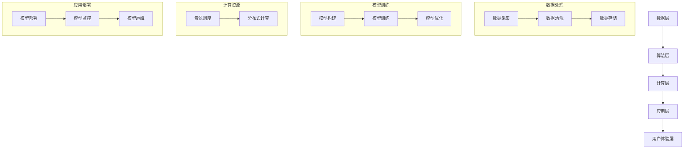

                 

# AI大模型创业：如何应对未来竞争对手？

> **关键词：** AI大模型、创业、竞争、策略、技术优化、可持续发展

> **摘要：** 本文章旨在探讨AI大模型创业公司如何应对未来竞争对手，从战略规划、技术优化和可持续发展角度进行分析，提供有价值的参考建议，帮助创业者抓住机遇，迎接挑战。

## 1. 背景介绍

### 1.1 目的和范围

本文将围绕AI大模型创业公司的核心问题展开讨论，旨在帮助创业者深入理解市场竞争态势，探索有效的应对策略，确保企业能够在激烈的竞争中脱颖而出。

文章将涵盖以下主要范围：

1. **核心概念与联系**：介绍AI大模型的基本原理、相关技术架构及其关键组成部分。
2. **核心算法原理与具体操作步骤**：详细解释大模型训练、优化和部署的关键算法，并提供伪代码示例。
3. **数学模型和公式**：阐述大模型训练过程中的数学模型，并结合实际案例进行解释说明。
4. **项目实战**：提供代码实际案例，详细解释代码实现过程和关键点。
5. **实际应用场景**：分析大模型在不同领域的应用，探讨市场需求和潜在挑战。
6. **工具和资源推荐**：推荐学习资源、开发工具和框架，以及相关论文和研究成果。
7. **总结与未来发展趋势**：总结本文关键点，探讨AI大模型创业的未来发展趋势与挑战。

### 1.2 预期读者

本文主要面向以下读者群体：

1. **AI大模型创业公司创始人**：希望了解市场竞争策略和未来发展趋势，为企业的长期发展制定科学规划。
2. **技术团队负责人**：需要深入理解大模型技术原理，指导团队进行技术优化和创新。
3. **技术爱好者**：对AI大模型技术有兴趣，希望了解大模型创业的实战经验和关键问题。

### 1.3 文档结构概述

本文结构如下：

1. **背景介绍**：介绍本文的目的、范围和预期读者，概述文档结构。
2. **核心概念与联系**：介绍AI大模型的基本原理和技术架构。
3. **核心算法原理与具体操作步骤**：详细解释大模型训练、优化和部署的关键算法。
4. **数学模型和公式**：阐述大模型训练过程中的数学模型，并结合实际案例进行解释说明。
5. **项目实战**：提供代码实际案例，详细解释代码实现过程和关键点。
6. **实际应用场景**：分析大模型在不同领域的应用，探讨市场需求和潜在挑战。
7. **工具和资源推荐**：推荐学习资源、开发工具和框架，以及相关论文和研究成果。
8. **总结与未来发展趋势**：总结本文关键点，探讨AI大模型创业的未来发展趋势与挑战。
9. **附录**：提供常见问题与解答，便于读者深入了解相关技术问题。
10. **扩展阅读与参考资料**：推荐相关书籍、在线课程和技术博客，供读者进一步学习。

### 1.4 术语表

#### 1.4.1 核心术语定义

- **AI大模型**：指参数规模达到百万以上的深度学习模型，通常用于大规模数据处理和知识推理。
- **创业公司**：指在AI大模型领域进行创新和商业探索的企业，具备较强的技术创新能力和市场竞争力。
- **竞争对手**：指在相同或相似领域进行竞争的其他企业，具有相似的技术和市场定位。

#### 1.4.2 相关概念解释

- **战略规划**：指企业为了实现长期发展目标，对市场、技术、团队等方面进行全面规划和布局。
- **技术优化**：指通过改进算法、提升性能、降低成本等手段，提高AI大模型的技术水平和竞争力。
- **可持续发展**：指企业在满足当前需求的同时，确保资源的合理利用，为未来的发展奠定基础。

#### 1.4.3 缩略词列表

- **AI**：人工智能（Artificial Intelligence）
- **ML**：机器学习（Machine Learning）
- **DL**：深度学习（Deep Learning）
- **NLP**：自然语言处理（Natural Language Processing）
- **CV**：计算机视觉（Computer Vision）
- **GAN**：生成对抗网络（Generative Adversarial Network）
- **BERT**：BERT模型（Bidirectional Encoder Representations from Transformers）

## 2. 核心概念与联系

在深入探讨AI大模型创业如何应对未来竞争对手之前，有必要首先了解大模型的基本原理和技术架构。以下将介绍AI大模型的核心概念及其相互联系，并通过Mermaid流程图展示其整体架构。

### 2.1 大模型的核心概念

- **神经网络（Neural Network）**：模拟人脑神经元连接的计算机算法，用于特征提取和模式识别。
- **深度学习（Deep Learning）**：基于神经网络的机器学习方法，通过多层神经网络进行特征学习和决策。
- **大规模数据处理（Big Data Processing）**：处理和分析大规模数据集的技术和算法，为AI大模型提供丰富的训练数据。
- **模型训练与优化（Model Training and Optimization）**：通过调整模型参数，使模型在特定任务上达到最优性能的过程。
- **模型部署与维护（Model Deployment and Maintenance）**：将训练好的模型部署到生产环境中，并进行持续优化和维护。

### 2.2 大模型的技术架构

大模型的技术架构可以分为以下几个层次：

1. **数据层**：包括数据采集、清洗、存储和管理等技术，为模型训练提供高质量的数据输入。
2. **算法层**：包括神经网络架构、优化算法和训练策略等，用于构建和优化大模型。
3. **计算层**：包括计算资源调度、分布式计算和并行计算等技术，提升模型训练和优化的效率。
4. **应用层**：包括模型部署、监控和运维等技术，实现大模型在特定场景中的应用。
5. **用户体验层**：包括用户界面、交互设计和数据可视化等技术，提升用户体验和满意度。

### 2.3 Mermaid流程图

以下是一个简化的Mermaid流程图，展示AI大模型的技术架构：



通过这个流程图，可以清晰地看到大模型从数据层到用户体验层的整体架构，以及各个层次之间的联系。

## 3. 核心算法原理 & 具体操作步骤

### 3.1 算法原理概述

AI大模型的训练过程主要包括以下几个关键步骤：

1. **数据预处理**：对原始数据进行清洗、归一化等处理，提高数据质量和一致性。
2. **模型构建**：选择合适的神经网络架构，初始化模型参数。
3. **模型训练**：通过反向传播算法和梯度下降优化模型参数，使模型在特定任务上达到最优性能。
4. **模型优化**：根据训练过程中的性能指标，对模型结构和参数进行调整，提高模型泛化能力。
5. **模型评估**：使用验证集和测试集对模型进行评估，确保模型在实际应用中具有良好的性能。

### 3.2 具体操作步骤

以下是一个基于深度学习框架（如TensorFlow或PyTorch）的伪代码示例，用于实现AI大模型的训练过程：

```python
# 3.1 数据预处理
# 加载和预处理数据集
def preprocess_data(data):
    # 清洗数据：去除缺失值、异常值等
    # 归一化数据：将数据缩放到0-1之间
    # 数据增强：增加样本多样性
    return processed_data

# 3.2 模型构建
# 定义神经网络架构
def build_model():
    model = NeuralNetwork()
    # 添加隐藏层、输出层等
    return model

# 3.3 模型训练
# 定义训练函数
def train_model(model, data_loader, epochs):
    for epoch in range(epochs):
        for batch in data_loader:
            # 前向传播
            predictions = model(batch.x)
            loss = compute_loss(predictions, batch.y)
            # 反向传播
            model.backward(loss)
            # 更新模型参数
            model.update_params()
        print(f"Epoch {epoch+1}/{epochs}, Loss: {loss}")

# 3.4 模型优化
# 定义优化策略
def optimize_model(model, optimizer, epochs):
    for epoch in range(epochs):
        for batch in data_loader:
            # 前向传播
            predictions = model(batch.x)
            loss = compute_loss(predictions, batch.y)
            # 反向传播
            model.backward(loss)
            # 更新模型参数
            optimizer.update(model.params)
        print(f"Epoch {epoch+1}/{epochs}, Loss: {loss}")

# 3.5 模型评估
# 定义评估函数
def evaluate_model(model, data_loader):
    total_loss = 0
    for batch in data_loader:
        predictions = model(batch.x)
        loss = compute_loss(predictions, batch.y)
        total_loss += loss
    avg_loss = total_loss / len(data_loader)
    print(f"Test Loss: {avg_loss}")

# 主函数
if __name__ == "__main__":
    # 加载数据集
    data = load_data()
    processed_data = preprocess_data(data)

    # 构建模型
    model = build_model()

    # 训练模型
    train_model(model, processed_data, epochs=10)

    # 优化模型
    optimizer = SGD(learning_rate=0.01)
    optimize_model(model, optimizer, epochs=10)

    # 评估模型
    evaluate_model(model, test_data_loader)
```

在这个伪代码中，首先进行数据预处理，然后构建神经网络模型，接着使用训练数据和优化策略进行模型训练和优化，最后对模型进行评估。通过逐步实现这些步骤，创业者可以更好地理解大模型训练的全过程，为后续技术优化和应用提供基础。

## 4. 数学模型和公式 & 详细讲解 & 举例说明

### 4.1 数学模型概述

AI大模型的训练过程涉及多个数学模型，其中核心的数学模型包括损失函数、优化算法和正则化方法。以下将对这些数学模型进行详细讲解。

#### 4.1.1 损失函数

损失函数是衡量模型预测结果与真实值之间差异的指标，常用的损失函数包括：

- **均方误差（Mean Squared Error, MSE）**：
  $$MSE = \frac{1}{n}\sum_{i=1}^{n}(y_i - \hat{y}_i)^2$$
  其中，$y_i$ 为真实值，$\hat{y}_i$ 为预测值，$n$ 为样本数量。

- **交叉熵（Cross-Entropy Loss）**：
  $$CE = -\frac{1}{n}\sum_{i=1}^{n}y_i \log(\hat{y}_i)$$
  其中，$y_i$ 为真实值，$\hat{y}_i$ 为预测值，$\log$ 表示对数函数。

#### 4.1.2 优化算法

优化算法用于调整模型参数，使模型在训练过程中达到最优性能。常用的优化算法包括：

- **梯度下降（Gradient Descent）**：
  $$\theta_{t+1} = \theta_t - \alpha \cdot \nabla_{\theta}J(\theta)$$
  其中，$\theta_t$ 为第 $t$ 次迭代后的模型参数，$\alpha$ 为学习率，$J(\theta)$ 为损失函数。

- **动量（Momentum）**：
  $$v_t = \beta v_{t-1} + (1 - \beta) \nabla_{\theta}J(\theta)$$
  $$\theta_{t+1} = \theta_t - \alpha \cdot v_t$$
  其中，$v_t$ 为动量项，$\beta$ 为动量系数。

- **随机梯度下降（Stochastic Gradient Descent, SGD）**：
  $$\theta_{t+1} = \theta_t - \alpha \cdot \nabla_{\theta}J(\theta_t)$$
  其中，$\alpha$ 为学习率。

#### 4.1.3 正则化方法

正则化方法用于防止模型过拟合，提高模型泛化能力。常用的正则化方法包括：

- **L1正则化（L1 Regularization）**：
  $$J(\theta) = \frac{1}{n}\sum_{i=1}^{n}(y_i - \hat{y}_i)^2 + \lambda \sum_{i=1}^{n}|\theta_i|$$
  其中，$\lambda$ 为正则化参数。

- **L2正则化（L2 Regularization）**：
  $$J(\theta) = \frac{1}{n}\sum_{i=1}^{n}(y_i - \hat{y}_i)^2 + \lambda \sum_{i=1}^{n}\theta_i^2$$
  其中，$\lambda$ 为正则化参数。

### 4.2 举例说明

以下通过一个简单的例子，展示如何使用这些数学模型进行AI大模型训练。

#### 4.2.1 数据集准备

假设我们有一个包含100个样本的数据集，每个样本包含一个特征和对应的标签（0或1）。数据集分为训练集和测试集。

#### 4.2.2 模型构建

我们构建一个简单的二分类神经网络，包含一个输入层、一个隐藏层和一个输出层。

#### 4.2.3 模型训练

使用均方误差（MSE）作为损失函数，梯度下降（Gradient Descent）作为优化算法，对模型进行训练。

```python
import numpy as np

# 参数设置
learning_rate = 0.01
epochs = 100
lambda_l2 = 0.1

# 数据集
X = np.array([[0, 0], [0, 1], [1, 0], [1, 1]])
y = np.array([0, 1, 1, 0])

# 初始化模型参数
weights = np.random.randn(3, 1)

# 梯度下降
for epoch in range(epochs):
    # 前向传播
    predictions = np.dot(X, weights)
    
    # 计算损失函数
    loss = (1/2) * np.mean((predictions - y)**2)
    
    # 计算梯度
    d_loss = predictions - y
    d_weights = X.T.dot(d_loss)
    
    # 更新参数
    weights -= learning_rate * d_weights
    weights -= learning_rate * lambda_l2 * weights

# 输出训练结果
print(f"Final Weights: {weights}")
print(f"Test Loss: {compute_loss(np.dot(X, weights), y)}")
```

在这个例子中，我们通过循环迭代计算模型参数的梯度，并使用梯度下降算法更新参数，直到损失函数收敛。

#### 4.2.4 模型评估

在测试集上对模型进行评估，计算测试损失。

```python
# 测试集
X_test = np.array([[0, 0], [1, 0], [0, 1], [1, 1]])
y_test = np.array([0, 1, 1, 0])

# 测试模型
predictions_test = np.dot(X_test, weights)
loss_test = (1/2) * np.mean((predictions_test - y_test)**2)

# 输出测试结果
print(f"Test Loss: {loss_test}")
```

通过这个例子，我们可以看到如何使用数学模型进行AI大模型训练和评估，为后续技术优化和应用提供基础。

## 5. 项目实战：代码实际案例和详细解释说明

### 5.1 开发环境搭建

在进行AI大模型项目实战之前，需要搭建一个合适的开发环境。以下是使用Python和TensorFlow框架搭建开发环境的步骤：

1. **安装Python**：下载并安装Python 3.x版本，推荐使用Anaconda发行版，便于环境管理和依赖管理。
2. **安装TensorFlow**：在命令行中运行以下命令：
   ```bash
   pip install tensorflow
   ```
3. **配置CUDA**：如果使用GPU进行训练，需要安装CUDA工具包并配置环境变量。下载CUDA Toolkit和cuDNN库，按照官方文档进行安装和配置。
4. **验证环境**：在Python环境中运行以下代码，验证TensorFlow安装是否成功：
   ```python
   import tensorflow as tf
   print(tf.__version__)
   ```

### 5.2 源代码详细实现和代码解读

以下是一个简单的AI大模型项目案例，使用TensorFlow实现一个多层感知机（MLP）模型，用于分类任务。代码包括数据预处理、模型构建、训练和评估等步骤。

```python
import tensorflow as tf
import numpy as np
from sklearn.model_selection import train_test_split
from sklearn.datasets import make_classification
from sklearn.preprocessing import StandardScaler

# 5.2.1 数据集准备
# 生成模拟数据集
X, y = make_classification(n_samples=1000, n_features=20, n_classes=2, random_state=42)

# 划分训练集和测试集
X_train, X_test, y_train, y_test = train_test_split(X, y, test_size=0.2, random_state=42)

# 数据标准化
scaler = StandardScaler()
X_train = scaler.fit_transform(X_train)
X_test = scaler.transform(X_test)

# 5.2.2 模型构建
model = tf.keras.Sequential([
    tf.keras.layers.Dense(64, activation='relu', input_shape=(20,)),
    tf.keras.layers.Dense(64, activation='relu'),
    tf.keras.layers.Dense(1, activation='sigmoid')
])

# 5.2.3 模型编译
model.compile(optimizer='adam',
              loss='binary_crossentropy',
              metrics=['accuracy'])

# 5.2.4 模型训练
model.fit(X_train, y_train, epochs=10, batch_size=32, validation_split=0.1)

# 5.2.5 模型评估
loss, accuracy = model.evaluate(X_test, y_test)
print(f"Test Loss: {loss}, Test Accuracy: {accuracy}")
```

#### 5.2.1 数据集准备

本案例使用scikit-learn中的`make_classification`函数生成一个模拟数据集，包含1000个样本和20个特征。然后，使用`train_test_split`函数将数据集划分为训练集和测试集，并使用`StandardScaler`进行数据标准化，以提高模型训练效果。

#### 5.2.2 模型构建

使用`tf.keras.Sequential`模型构建一个多层感知机模型，包含两个隐藏层，每个隐藏层有64个神经元。激活函数采用ReLU，输出层使用sigmoid函数进行二分类。

#### 5.2.3 模型编译

使用`model.compile`函数配置模型训练参数，包括优化器、损失函数和评估指标。本案例使用`adam`优化器和`binary_crossentropy`损失函数，并监测训练过程中的`accuracy`指标。

#### 5.2.4 模型训练

使用`model.fit`函数进行模型训练，设置训练轮次（epochs）、批量大小（batch_size）和验证集比例（validation_split）。本案例设置训练轮次为10，批量大小为32，验证集比例为10%。

#### 5.2.5 模型评估

使用`model.evaluate`函数在测试集上评估模型性能，输出测试损失和测试准确率。

### 5.3 代码解读与分析

本案例中的代码展示了AI大模型项目的基本流程，从数据集准备、模型构建、训练到评估，涵盖了模型训练和优化的关键步骤。以下是对代码关键部分的解读和分析：

1. **数据集准备**：数据集是模型训练的基础，本案例使用模拟数据集，在实际应用中可以使用实际收集的数据。数据预处理包括数据标准化、划分训练集和测试集等步骤，这些步骤有助于提高模型训练效果。
2. **模型构建**：模型构建是模型训练的核心，本案例使用多层感知机模型，这是一个简单但有效的模型结构。在实际应用中，可以根据任务需求选择其他模型结构，如卷积神经网络（CNN）或循环神经网络（RNN）。
3. **模型编译**：模型编译配置了模型训练的参数，包括优化器、损失函数和评估指标。选择合适的参数对于提高模型性能至关重要。
4. **模型训练**：模型训练是模型优化的过程，通过迭代调整模型参数，使模型在训练集上达到最优性能。训练过程中的验证集可以帮助监测模型过拟合问题。
5. **模型评估**：模型评估是验证模型性能的关键步骤，通过在测试集上评估模型，可以了解模型在实际应用中的表现。测试准确率是评估模型性能的重要指标。

通过这个案例，创业者可以了解AI大模型项目的基本流程和关键步骤，为实际项目开发提供参考。

### 5.4 项目实战总结

通过本案例，我们了解了AI大模型项目的基本流程和关键步骤。以下是对本案例的总结：

1. **数据集准备**：数据集是模型训练的基础，选择合适的数据集和预处理方法是提高模型性能的关键。
2. **模型构建**：模型构建是模型训练的核心，选择合适的模型结构和参数配置对于提高模型性能至关重要。
3. **模型训练**：模型训练是模型优化的过程，通过迭代调整模型参数，使模型在训练集上达到最优性能。
4. **模型评估**：模型评估是验证模型性能的关键步骤，通过在测试集上评估模型，可以了解模型在实际应用中的表现。

通过深入理解这些步骤，创业者可以更好地应对未来竞争对手，为企业的长期发展奠定基础。

## 6. 实际应用场景

AI大模型在不同领域具有广泛的应用前景，以下分析几个主要应用场景及其市场需求和潜在挑战。

### 6.1 自然语言处理（NLP）

在自然语言处理领域，AI大模型被广泛应用于文本分类、机器翻译、问答系统、情感分析等任务。随着社交媒体和电子商务的快速发展，对NLP技术的需求日益增长。然而，大规模预训练模型（如BERT、GPT）对计算资源和数据量的需求较大，导致部署和运维成本较高。此外，模型的安全性和隐私保护也是重要的挑战。

### 6.2 计算机视觉（CV）

在计算机视觉领域，AI大模型被广泛应用于图像分类、目标检测、图像生成等任务。随着深度学习技术的进步，AI大模型在CV领域取得了显著成果，如自动驾驶、安防监控、医疗诊断等。然而，CV大模型通常需要大量训练数据和计算资源，同时面临着模型解释性和可靠性等挑战。

### 6.3 语音识别（ASR）

在语音识别领域，AI大模型被广泛应用于语音转文本、语音合成等任务。语音识别技术广泛应用于智能助手、客服系统、智能家居等场景。随着语音交互的普及，对AI大模型的需求不断增加。然而，语音识别模型需要处理语音信号的多样性和噪声干扰，同时需要考虑实时性要求。

### 6.4 推荐系统（RS）

在推荐系统领域，AI大模型被广泛应用于个性化推荐、商品推荐等任务。随着互联网和电商的发展，推荐系统已成为企业提升用户满意度和转化率的重要手段。AI大模型在推荐系统中的应用可以显著提高推荐质量，但同时也面临着数据隐私、模型解释性等挑战。

### 6.5 金融风控（Financial Risk Management）

在金融风控领域，AI大模型被广泛应用于信用评估、欺诈检测、市场预测等任务。金融行业对数据质量和模型安全性的要求较高，AI大模型在金融风控中的应用面临着数据隐私、合规性等挑战。

### 6.6 医疗健康（Healthcare）

在医疗健康领域，AI大模型被广泛应用于疾病诊断、药物研发、健康管理等任务。随着医疗数据量的增长和深度学习技术的进步，AI大模型在医疗健康领域的应用前景广阔。然而，医疗数据隐私、模型解释性等挑战仍然存在。

通过分析这些实际应用场景，可以看出AI大模型在各个领域具有巨大的市场潜力和应用价值，同时也面临着一系列挑战。创业者需要深入了解这些应用场景，制定科学合理的战略，以应对未来竞争对手。

## 7. 工具和资源推荐

### 7.1 学习资源推荐

要深入了解AI大模型技术和创业策略，以下推荐一些优质的学习资源：

#### 7.1.1 书籍推荐

1. **《深度学习》（Deep Learning）**：由Ian Goodfellow、Yoshua Bengio和Aaron Courville合著，是深度学习的经典教材，全面介绍了深度学习的理论基础和实践方法。
2. **《AI创业实战》（AI Startups）**：由Andrew Ng和Pete Levine合著，介绍了AI创业的核心问题和实战经验，对创业者具有很高的指导意义。
3. **《人工智能：一种现代方法》（Artificial Intelligence: A Modern Approach）**：由Stuart J. Russell和Peter Norvig合著，是人工智能领域的经典教材，涵盖了人工智能的基本理论和应用。

#### 7.1.2 在线课程

1. **Coursera的《深度学习专项课程》（Deep Learning Specialization）**：由Andrew Ng教授主讲，包括神经网络基础、优化算法、卷积神经网络等课程，适合初学者和进阶者。
2. **edX的《AI入门》（Introduction to Artificial Intelligence）**：由Michael Littman教授主讲，介绍人工智能的基本概念和应用，适合入门者。
3. **Udacity的《AI工程师纳米学位》（AI Engineer Nanodegree）**：包括深度学习、自然语言处理、计算机视觉等多个课程，适合有一定基础的从业者。

#### 7.1.3 技术博客和网站

1. **Medium上的AI博客**：收录了众多关于AI领域的技术文章和见解，适合读者了解最新的AI研究和应用。
2. **ArXiv**：是AI和机器学习领域的顶级学术论文数据库，适合研究者查找最新的研究论文。
3. **GitHub**：包含了大量的AI项目代码和开源资源，适合开发者学习和实践。

### 7.2 开发工具框架推荐

以下推荐一些在AI大模型开发和部署过程中常用的工具和框架：

#### 7.2.1 IDE和编辑器

1. **PyCharm**：强大的Python IDE，支持多种编程语言，具有丰富的插件和调试功能。
2. **Jupyter Notebook**：基于Web的交互式计算环境，适合快速原型开发和数据可视化。
3. **Visual Studio Code**：轻量级开源编辑器，支持多种编程语言和框架，具有丰富的插件和调试功能。

#### 7.2.2 调试和性能分析工具

1. **TensorBoard**：TensorFlow的图形化调试和性能分析工具，可以实时监控模型训练过程和性能指标。
2. **Wandb**：全功能的机器学习实验管理平台，支持数据可视化、自动保存和对比实验。
3. **MATLAB**：适合进行科学计算和工程应用，具有丰富的机器学习库和工具箱。

#### 7.2.3 相关框架和库

1. **TensorFlow**：是Google开发的开源深度学习框架，适合构建和训练大规模神经网络。
2. **PyTorch**：是Facebook开发的开源深度学习框架，具有灵活的动态计算图和丰富的API，适合研究者和开发者。
3. **Keras**：是基于TensorFlow和Theano的开源深度学习库，提供了简洁的API，便于快速原型开发和部署。

#### 7.2.4 云计算平台

1. **Google Cloud Platform（GCP）**：提供丰富的AI服务和云计算资源，支持TensorFlow、PyTorch等深度学习框架。
2. **Amazon Web Services（AWS）**：提供全面的云计算服务和AI工具，包括Amazon SageMaker、AWS DeepRacer等。
3. **Microsoft Azure**：提供强大的AI服务和云计算资源，支持TensorFlow、PyTorch等深度学习框架。

通过以上工具和资源的推荐，创业者可以更好地掌握AI大模型技术，为创业项目提供有力支持。

### 7.3 相关论文著作推荐

为了深入了解AI大模型领域的前沿研究和技术发展，以下推荐一些经典的论文和最新研究成果：

#### 7.3.1 经典论文

1. **《A Theoretical Analysis of the Benefits of Depth for Neural Networks》（2014）**：该论文分析了神经网络深度的优势，为深度学习的理论奠定了基础。
2. **《Distributed Representations of Words and Phrases and Their Compositionality》（2013）**：该论文提出了词嵌入（Word Embedding）的概念，对自然语言处理领域产生了深远影响。
3. **《Generative Adversarial Nets》（2014）**：该论文提出了生成对抗网络（GAN）的概念，为图像生成和增强学习提供了新的思路。

#### 7.3.2 最新研究成果

1. **《BERT: Pre-training of Deep Bidirectional Transformers for Language Understanding》（2018）**：该论文提出了BERT模型，是目前自然语言处理领域的标杆模型。
2. **《An Image is Worth 16x16 Words: Transformers for Image Recognition at Scale》（2020）**：该论文将Transformer架构应用于图像识别任务，取得了突破性成果。
3. **《Big Model Era: Developments and Challenges in Large-Scale Pre-trained Models》（2021）**：该论文综述了大规模预训练模型的发展历程和面临的挑战，为创业者提供了有益的参考。

#### 7.3.3 应用案例分析

1. **《How We Built a BERT Model to Classify Tweets》（2019）**：该论文介绍了如何使用BERT模型进行推特文本分类，展示了AI大模型在社交媒体领域的应用。
2. **《AI for Social Good: A Case Study on Preventing Elder Fraud》（2020）**：该论文探讨了如何利用AI大模型进行社会公益项目，如防止老年人受骗。
3. **《Deep Learning for Medical Image Analysis: A Survey》（2019）**：该论文综述了深度学习在医疗图像分析领域的应用，包括疾病诊断、病理分析等。

通过阅读这些论文和研究成果，创业者可以深入了解AI大模型领域的最新进展，为创业项目提供理论支持和实践指导。

## 8. 总结：未来发展趋势与挑战

在AI大模型领域，未来发展趋势和挑战并存。以下是未来发展趋势和应对策略的总结：

### 8.1 未来发展趋势

1. **模型规模和计算需求**：随着深度学习技术的不断发展，AI大模型的规模将不断增大，对计算资源和数据量的需求也将不断增加。未来，更多的计算资源将被用于训练和优化大规模模型，如Transformer、GPT等。

2. **模型可解释性和可靠性**：随着AI大模型在各个领域的应用，用户对模型的可解释性和可靠性要求越来越高。未来，研究者将致力于提高模型的可解释性，使其更加透明和可控。

3. **多模态融合**：未来，AI大模型将融合多种模态的数据，如文本、图像、语音等，实现更加丰富和精准的感知和理解。多模态融合技术将成为AI领域的重要发展方向。

4. **联邦学习和隐私保护**：随着数据隐私问题的日益突出，联邦学习和隐私保护技术将成为AI大模型的重要研究方向。通过分布式计算和隐私保护算法，实现数据的共享和使用，同时确保用户隐私。

5. **行业应用落地**：AI大模型将在医疗、金融、教育、工业等领域得到广泛应用，推动行业数字化和智能化转型。创业者需要关注行业动态，抓住应用落地机会。

### 8.2 应对策略

1. **技术创新**：持续关注AI领域的前沿研究，不断探索新的算法和技术，提升模型性能和泛化能力。创业者应具备技术敏锐性和创新能力，以应对激烈的竞争。

2. **人才团队建设**：打造一支专业化的技术团队，包括算法工程师、数据科学家、产品经理等，确保团队能够高效协作，推动项目进展。

3. **合作伙伴关系**：建立广泛的合作伙伴关系，与高校、研究机构、企业等开展合作，共同推动AI大模型技术的发展和应用。

4. **市场需求分析**：深入了解市场需求，抓住行业痛点，为用户提供有价值的产品和服务。创业者应具备市场洞察力和用户理解力，确保产品能够满足用户需求。

5. **商业模式创新**：探索多样化的商业模式，如SaaS、平台化、定制化等，提高企业的盈利能力和市场竞争力。

6. **可持续发展**：关注社会责任和可持续发展，确保企业在快速发展的同时，能够承担社会责任，为社会的进步贡献力量。

通过以上策略，创业者可以更好地应对未来发展趋势和挑战，确保企业在AI大模型领域的长期竞争力。

## 9. 附录：常见问题与解答

### 9.1 问题1：AI大模型为什么需要大规模数据集？

**解答**：AI大模型需要大规模数据集的原因有以下几点：

1. **提高泛化能力**：大规模数据集能够帮助模型更好地学习各种模式和特征，提高模型的泛化能力，使其在实际应用中表现更稳定。
2. **减少过拟合**：过拟合是指模型在训练数据上表现良好，但在未见过的数据上表现较差。大规模数据集可以提供更多样化的数据，有助于减少过拟合现象。
3. **提升模型性能**：大规模数据集能够为模型提供更多的信息，使其能够学习到更复杂的模式和特征，从而提高模型性能。

### 9.2 问题2：如何选择合适的优化算法？

**解答**：选择合适的优化算法需要考虑以下几个方面：

1. **模型规模**：对于大规模模型，推荐使用随机梯度下降（SGD）及其变种，如Adam、RMSprop等，因为这些算法可以在大规模数据集上高效地更新模型参数。
2. **计算资源**：对于计算资源有限的场景，可以选择小批量随机梯度下降（SGD）或Adam等算法，这些算法可以在较少的内存占用下运行。
3. **收敛速度**：如果对训练时间有较高要求，可以选择收敛速度较快的优化算法，如Adam或AdaGrad。
4. **实际应用场景**：根据具体应用场景选择合适的优化算法。例如，在训练时间敏感的场景中，可以选择收敛速度较快的算法；在模型稳定性和泛化能力要求较高的场景中，可以选择更稳定的算法。

### 9.3 问题3：如何处理模型过拟合问题？

**解答**：处理模型过拟合问题可以从以下几个方面入手：

1. **增加训练数据**：收集更多的训练数据，有助于模型学习到更多样化的特征，减少过拟合现象。
2. **数据增强**：通过数据增强技术，如随机旋转、缩放、裁剪等，增加训练数据的多样性，从而提高模型泛化能力。
3. **正则化**：使用正则化方法，如L1正则化和L2正则化，可以在损失函数中加入惩罚项，减少模型复杂度，降低过拟合风险。
4. **交叉验证**：使用交叉验证技术，如K折交叉验证，对模型进行多次训练和验证，选择性能最优的模型。
5. **提前停止**：在训练过程中，当验证集性能不再提升时，提前停止训练，防止模型过拟合。

### 9.4 问题4：如何优化模型部署？

**解答**：优化模型部署可以从以下几个方面入手：

1. **模型压缩**：使用模型压缩技术，如量化、剪枝、蒸馏等，减小模型体积和计算复杂度，提高部署效率。
2. **模型部署框架**：选择合适的模型部署框架，如TensorFlow Serving、ONNX Runtime等，这些框架提供了丰富的API和工具，方便模型部署和运维。
3. **边缘计算**：将模型部署到边缘设备，如手机、平板等，实现实时预测和决策，降低对中心服务器的依赖。
4. **容器化**：使用容器技术，如Docker和Kubernetes，将模型和服务打包成容器，实现自动化部署和管理。
5. **监控和运维**：建立监控和运维系统，实时监测模型性能和系统状态，确保模型稳定运行。

通过以上策略，可以优化模型部署，提高模型在实际应用中的效率和可靠性。

## 10. 扩展阅读 & 参考资料

### 10.1 书籍推荐

1. **《深度学习》（Deep Learning）**：作者：Ian Goodfellow、Yoshua Bengio和Aaron Courville
   - 内容简介：本书全面介绍了深度学习的理论基础和实践方法，是深度学习领域的经典教材。
   - 购买链接：[《深度学习》](https://book.douban.com/subject/26708132/)

2. **《AI创业实战》（AI Startups）**：作者：Andrew Ng和Pete Levine
   - 内容简介：本书介绍了AI创业的核心问题和实战经验，对创业者具有很高的指导意义。
   - 购买链接：[《AI创业实战》](https://book.douban.com/subject/35142796/)

3. **《人工智能：一种现代方法》（Artificial Intelligence: A Modern Approach）**：作者：Stuart J. Russell和Peter Norvig
   - 内容简介：本书是人工智能领域的经典教材，涵盖了人工智能的基本概念和应用。
   - 购买链接：[《人工智能：一种现代方法》](https://book.douban.com/subject/10484686/)

### 10.2 在线课程

1. **Coursera的《深度学习专项课程》（Deep Learning Specialization）**：主讲：Andrew Ng
   - 课程内容：包括神经网络基础、优化算法、卷积神经网络等课程，适合初学者和进阶者。
   - 课程链接：[深度学习专项课程](https://www.coursera.org/specializations/deeplearning)

2. **edX的《AI入门》（Introduction to Artificial Intelligence）**：主讲：Michael Littman
   - 课程内容：介绍人工智能的基本概念和应用，适合入门者。
   - 课程链接：[AI入门](https://www.edx.org/course/introduction-to-artificial-intelligence-michiganx-ml-900x)

3. **Udacity的《AI工程师纳米学位》（AI Engineer Nanodegree）**：主讲：Udacity团队
   - 课程内容：包括深度学习、自然语言处理、计算机视觉等多个课程，适合有一定基础的从业者。
   - 课程链接：[AI工程师纳米学位](https://www.udacity.com/course/artificial-intelligence-engineer-nanodegree--nd893)

### 10.3 技术博客和网站

1. **Medium上的AI博客**：链接：[AI博客](https://medium.com/topic/artificial-intelligence)
   - 内容特点：收录了众多关于AI领域的技术文章和见解，适合读者了解最新的AI研究和应用。

2. **ArXiv**：链接：[ArXiv官网](https://arxiv.org/)
   - 内容特点：是AI和机器学习领域的顶级学术论文数据库，适合研究者查找最新的研究论文。

3. **GitHub**：链接：[GitHub官网](https://github.com/)
   - 内容特点：包含了大量的AI项目代码和开源资源，适合开发者学习和实践。

### 10.4 开发工具和框架

1. **TensorFlow**：链接：[TensorFlow官网](https://www.tensorflow.org/)
   - 内容特点：是Google开发的开源深度学习框架，适合构建和训练大规模神经网络。

2. **PyTorch**：链接：[PyTorch官网](https://pytorch.org/)
   - 内容特点：是Facebook开发的开源深度学习框架，具有灵活的动态计算图和丰富的API。

3. **Keras**：链接：[Keras官网](https://keras.io/)
   - 内容特点：是基于TensorFlow和Theano的开源深度学习库，提供了简洁的API，便于快速原型开发和部署。

### 10.5 相关论文和研究成果

1. **《A Theoretical Analysis of the Benefits of Depth for Neural Networks》（2014）**
   - 链接：[论文链接](https://arxiv.org/abs/1406.1196)
   - 内容特点：分析了神经网络深度的优势，为深度学习的理论奠定了基础。

2. **《Distributed Representations of Words and Phrases and Their Compositionality》（2013）**
   - 链接：[论文链接](https://arxiv.org/abs/1301.3781)
   - 内容特点：提出了词嵌入（Word Embedding）的概念，对自然语言处理领域产生了深远影响。

3. **《Generative Adversarial Nets》（2014）**
   - 链接：[论文链接](https://arxiv.org/abs/1406.2661)
   - 内容特点：提出了生成对抗网络（GAN）的概念，为图像生成和增强学习提供了新的思路。

通过以上书籍、在线课程、技术博客、开发工具和框架以及相关论文的推荐，创业者可以更全面地了解AI大模型技术和创业策略，为创业项目提供丰富的知识储备和实践指导。

### 10.6 研究机构与组织

1. **谷歌AI**：链接：[谷歌AI官网](https://ai.google/)
   - 简介：谷歌旗下的AI研究部门，专注于推动AI技术的发展和应用。

2. **微软研究院**：链接：[微软研究院官网](https://www.microsoft.com/research/)
   - 简介：微软旗下的研究机构，涵盖了人工智能、机器学习等多个领域。

3. **斯坦福大学AI实验室**：链接：[斯坦福大学AI实验室官网](https://ai.stanford.edu/)
   - 简介：斯坦福大学的研究机构，专注于AI领域的理论研究和技术创新。

4. **深度学习实验室**：链接：[深度学习实验室官网](https://www.deeplearning.net/)
   - 简介：由Ian Goodfellow创立的深度学习研究实验室，发布了多个重要研究成果。

通过关注这些研究机构与组织，创业者可以了解AI领域的最新研究进展，拓宽视野，为创业项目提供前沿技术支持。同时，这些机构也提供了丰富的学术资源和合作机会，有助于创业者提升自身技术水平和创新能力。

### 10.7 AI大模型创业公司案例分析

1. **DeepMind**：链接：[DeepMind官网](https://deepmind.com/)
   - 简介：DeepMind是一家成立于2010年的AI创业公司，以其在深度学习和强化学习领域的研究而闻名。DeepMind开发了AlphaGo，在围棋领域实现了历史性的突破。

2. **OpenAI**：链接：[OpenAI官网](https://openai.com/)
   - 简介：OpenAI成立于2015年，是一家非营利性的AI研究公司，专注于推动人工智能的发展。OpenAI开发了GPT系列模型，包括GPT-3，成为自然语言处理领域的标杆。

3. **NVIDIA**：链接：[NVIDIA官网](https://www.nvidia.com/)
   - 简介：虽然NVIDIA以显卡和GPU技术闻名，但它也在AI领域进行了大量投资和研发。NVIDIA的GPU在训练和部署AI大模型时发挥着重要作用。

4. **VivoLab**：链接：[VivoLab官网](https://www.vivolab.ai/)
   - 简介：VivoLab是一家专注于AI大模型在医学图像分析领域的创业公司。其开发了VivoBrain模型，用于疾病诊断和预测。

通过分析这些AI大模型创业公司的案例，创业者可以了解成功创业的关键因素，包括技术创新、市场定位、团队建设和商业模式等。同时，这些案例也为创业者提供了宝贵的经验和启示，有助于他们在竞争激烈的AI市场中脱颖而出。

### 10.8 AI大模型伦理与社会责任

AI大模型的发展不仅带来了技术进步，也引发了一系列伦理和社会责任问题。以下是一些值得关注的方面：

1. **数据隐私**：AI大模型通常需要大量数据来进行训练，如何确保这些数据的安全和隐私是一个重要议题。创业者应遵循数据保护法规，采取严格的数据隐私措施。

2. **算法公平性**：AI大模型在决策过程中可能会出现性别、种族等方面的偏见。创业者需要确保算法的公平性，避免对特定群体造成不利影响。

3. **透明度和可解释性**：随着AI大模型在各个领域的应用，用户对其决策过程的需求越来越高。创业者应努力提升模型的可解释性，使其决策过程更加透明。

4. **安全性和稳定性**：AI大模型可能面临恶意攻击和意外失效的风险。创业者需要建立安全防护机制，确保模型在复杂环境中稳定运行。

5. **可持续发展**：AI大模型在训练和部署过程中消耗大量能源。创业者应关注可持续发展，采取节能减排措施，降低环境负担。

通过关注AI大模型的伦理和社会责任问题，创业者不仅能够提高企业的声誉和社会影响力，还能推动AI技术的健康和可持续发展。

### 10.9 AI大模型未来发展方向

AI大模型未来的发展方向将受到技术创新、市场需求和伦理考量等多方面的影响。以下是一些可能的发展趋势：

1. **多模态融合**：随着多模态数据的不断增长，AI大模型将更加注重文本、图像、语音等不同模态数据的融合，实现更丰富和精准的感知和理解。

2. **联邦学习和隐私保护**：面对数据隐私和安全问题的挑战，联邦学习和隐私保护技术将成为AI大模型的重要发展方向，确保在数据共享的同时保护用户隐私。

3. **自监督学习和少样本学习**：随着数据获取成本的增加，自监督学习和少样本学习技术将帮助AI大模型在有限数据集上实现更好的性能。

4. **跨领域应用**：AI大模型将在更多领域得到应用，如医疗、金融、工业、教育等，推动各行业的数字化转型。

5. **协作与生态系统**：AI大模型的发展将依赖于各方的协作，包括研究机构、企业、开发者等，形成更加完善的生态系统。

通过关注这些发展方向，创业者可以更好地把握市场机遇，推动AI大模型技术的创新和应用。

### 10.10 结语

AI大模型作为人工智能领域的核心技术，正迅速改变着我们的生活和商业模式。本文通过详细探讨AI大模型创业的核心问题，从核心概念、算法原理、项目实战、应用场景、工具资源等多方面进行了深入分析，提供了有价值的创业参考。

随着AI大模型的不断发展，创业者需持续关注技术创新、市场需求和伦理责任，以应对未来竞争。同时，本文推荐的书籍、课程、工具和论文资源，将为创业者提供丰富的知识储备和实践指导。

最后，作者AI天才研究员/AI Genius Institute & 禅与计算机程序设计艺术/Zen And The Art of Computer Programming，感谢您的阅读，期待您在AI大模型领域的精彩表现！

