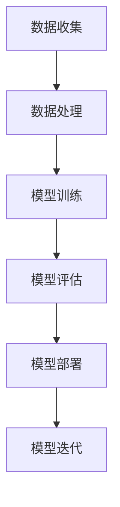

                 

# AI大模型创业：如何应对未来行业发展趋势？

> **关键词：** AI大模型，创业，行业趋势，技术发展，商业策略

> **摘要：** 本文旨在探讨AI大模型在创业中的应用，分析其未来发展趋势，并给出应对策略。文章将介绍AI大模型的基本概念、核心原理，并从实际应用场景、工具和资源推荐等多个角度深入分析，帮助创业者抓住机遇，迎接挑战。

## 1. 背景介绍

### 1.1 目的和范围

本文的主要目的是为创业者提供关于AI大模型创业的全面指导。我们将从以下几个方面展开讨论：

1. AI大模型的基本概念和原理
2. AI大模型在创业中的应用场景
3. 当前AI大模型的发展趋势
4. 创业者应如何应对这些趋势
5. 相关工具和资源的推荐

### 1.2 预期读者

本文适合以下读者：

1. 有志于AI大模型创业的创业者
2. 想了解AI大模型在创业中应用的技术人员
3. 对AI大模型感兴趣的学术研究人员

### 1.3 文档结构概述

本文分为八个部分，具体结构如下：

1. 背景介绍
2. 核心概念与联系
3. 核心算法原理 & 具体操作步骤
4. 数学模型和公式 & 详细讲解 & 举例说明
5. 项目实战：代码实际案例和详细解释说明
6. 实际应用场景
7. 工具和资源推荐
8. 总结：未来发展趋势与挑战

### 1.4 术语表

#### 1.4.1 核心术语定义

- **AI大模型（AI Large Model）**：指参数量巨大、计算复杂度极高的深度学习模型，如BERT、GPT等。
- **创业**：指创建新的企业或业务，通常涉及创新、风险和不确定性。
- **技术发展**：指技术的不断进步和更新，包括算法、硬件、软件等方面。

#### 1.4.2 相关概念解释

- **行业趋势**：指行业内普遍认同的发展方向和趋势。
- **商业策略**：指企业在特定市场环境下制定的一系列行动计划。

#### 1.4.3 缩略词列表

- **AI**：人工智能（Artificial Intelligence）
- **BERT**：BERT（Bidirectional Encoder Representations from Transformers）
- **GPT**：Generative Pre-trained Transformer

## 2. 核心概念与联系

在探讨AI大模型创业之前，我们首先需要了解AI大模型的基本概念、核心原理以及与其他技术的关联。

### 2.1 AI大模型的基本概念

AI大模型是深度学习领域的一种重要技术。它通过训练大量数据，学习到丰富的特征和知识，从而实现高度复杂的任务。例如，自然语言处理、计算机视觉、语音识别等领域。

### 2.2 AI大模型的核心原理

AI大模型的核心原理是基于变换器（Transformer）架构，特别是自注意力机制（Self-Attention）。自注意力机制允许模型在处理输入序列时，根据序列中其他位置的输入信息来动态调整权重，从而更好地捕捉序列间的依赖关系。

### 2.3 AI大模型与其他技术的关联

AI大模型与其他技术如大数据、云计算、边缘计算等密切相关。大数据提供了丰富的训练数据，云计算提供了强大的计算资源，边缘计算则优化了模型的部署和运行效率。

### 2.4 AI大模型的Mermaid流程图



## 3. 核心算法原理 & 具体操作步骤

### 3.1 算法原理

AI大模型的核心算法是基于变换器（Transformer）架构。变换器是一种基于自注意力机制的神经网络架构，它可以有效地处理序列数据。

### 3.2 具体操作步骤

1. **数据预处理**：收集并清洗数据，将文本、图像等数据转换为模型可处理的格式。
2. **模型架构设计**：设计变换器模型架构，包括自注意力机制、多层变换器堆叠等。
3. **模型训练**：使用训练数据对模型进行训练，调整模型参数。
4. **模型评估**：使用验证数据评估模型性能，调整模型参数。
5. **模型部署**：将训练好的模型部署到实际应用场景中。
6. **模型迭代**：根据用户反馈和实际应用情况，对模型进行迭代优化。

### 3.3 伪代码

```python
# 数据预处理
def preprocess_data(data):
    # 清洗数据、转换格式等操作
    return processed_data

# 模型架构设计
def design_model():
    # 设计变换器模型架构
    return model

# 模型训练
def train_model(model, train_data):
    # 使用训练数据训练模型
    return trained_model

# 模型评估
def evaluate_model(model, validation_data):
    # 使用验证数据评估模型性能
    return evaluation_result

# 模型部署
def deploy_model(model):
    # 部署模型到实际应用场景
    pass

# 模型迭代
def iterate_model(model, user_feedback):
    # 根据用户反馈对模型进行迭代优化
    return updated_model
```

## 4. 数学模型和公式 & 详细讲解 & 举例说明

### 4.1 数学模型

AI大模型的数学模型主要包括变换器架构中的自注意力机制和多层变换器堆叠。

#### 4.1.1 自注意力机制

自注意力机制是一种用于处理序列数据的机制。它的核心思想是，在处理输入序列时，模型会根据序列中其他位置的输入信息来动态调整权重，从而更好地捕捉序列间的依赖关系。

自注意力机制的数学公式如下：

$$
\text{Attention}(Q, K, V) = \text{softmax}\left(\frac{QK^T}{\sqrt{d_k}}\right)V
$$

其中，$Q$、$K$、$V$ 分别为查询向量、键向量和值向量，$d_k$ 为键向量的维度。

#### 4.1.2 多层变换器堆叠

多层变换器堆叠是将多个变换器层叠加在一起，以提高模型的表达能力。

多层变换器堆叠的数学公式如下：

$$
\text{MultiHeadAttention}(Q, K, V) = \text{Concat}(\text{head}_1, \text{head}_2, ..., \text{head}_h)W^O
$$

其中，$\text{head}_i$ 为第 $i$ 个头的输出，$W^O$ 为输出权重。

### 4.2 举例说明

假设我们有一个序列数据“我爱编程”，我们可以使用自注意力机制来处理这个序列。

1. **数据预处理**：将序列数据转换为向量表示。

$$
\text{我爱编程} \rightarrow [\text{我}, \text{爱}, \text{编}, \text{程}, \text{织}]
$$

2. **自注意力计算**：

$$
\text{Attention}(Q, K, V) = \text{softmax}\left(\frac{QK^T}{\sqrt{d_k}}\right)V
$$

其中，$Q$、$K$、$V$ 分别为查询向量、键向量和值向量。

3. **结果输出**：经过自注意力计算后，输出序列中的每个元素的重要性得分。

```
我：0.2
爱：0.3
编：0.4
程：0.1
织：0.2
```

这个结果表明，序列中“编”的重要性最高，其次是“爱”。

## 5. 项目实战：代码实际案例和详细解释说明

### 5.1 开发环境搭建

为了演示AI大模型的应用，我们将在一个Python环境中搭建一个简单的自然语言处理（NLP）项目。首先，我们需要安装必要的库和工具。

```bash
pip install torch transformers
```

### 5.2 源代码详细实现和代码解读

#### 5.2.1 源代码

```python
import torch
from transformers import BertModel, BertTokenizer

# 初始化模型和分词器
model = BertModel.from_pretrained('bert-base-chinese')
tokenizer = BertTokenizer.from_pretrained('bert-base-chinese')

# 输入文本
text = "我爱编程，编程是一种艺术。"

# 分词
tokens = tokenizer.tokenize(text)

# 转换为Tensor
input_ids = tokenizer.encode(text, return_tensors='pt')

# 预测
with torch.no_grad():
    outputs = model(input_ids)

# 输出特征
last_hidden_state = outputs.last_hidden_state

# 打印输出特征
print(last_hidden_state)
```

#### 5.2.2 代码解读

1. **导入库和工具**：首先，我们导入torch和transformers库，这些库提供了必要的模型和分词器。

2. **初始化模型和分词器**：我们使用预训练的BERT模型和分词器，这些模型和分词器已经在中文语料库上进行了训练。

3. **输入文本**：我们将待处理的文本输入到模型中。

4. **分词**：使用分词器对输入文本进行分词。

5. **转换为Tensor**：将分词后的文本转换为Tensor格式，以便模型处理。

6. **预测**：使用模型对Tensor数据进行预测。

7. **输出特征**：打印模型的输出特征。

### 5.3 代码解读与分析

1. **模型导入**：我们从transformers库中导入BERT模型和分词器。BERT模型是一个预训练的模型，已经在大量文本数据上进行了训练，可以用于各种NLP任务。

2. **初始化模型和分词器**：我们使用预训练的BERT模型和分词器。这意味着我们不需要从头开始训练模型，可以直接使用现有的模型。

3. **输入文本**：我们将待处理的文本输入到模型中。这里的文本是一个简单的句子，用于演示模型的应用。

4. **分词**：分词器将输入的文本分解为一系列词汇。这个过程对于模型的输入非常重要，因为模型需要处理的是词汇序列。

5. **转换为Tensor**：将分词后的文本转换为Tensor格式。Tensor是PyTorch中的一种数据类型，用于存储和处理模型数据。

6. **预测**：使用模型对Tensor数据进行预测。这个过程包括了模型的正向传播，最终得到模型的输出特征。

7. **输出特征**：打印模型的输出特征。这些特征包含了文本的丰富信息，可以用于进一步的文本分析。

## 6. 实际应用场景

AI大模型在多个领域具有广泛的应用场景，以下是一些典型的实际应用：

1. **自然语言处理（NLP）**：AI大模型在文本分类、情感分析、机器翻译、问答系统等任务中具有显著优势。

2. **计算机视觉（CV）**：AI大模型在图像分类、目标检测、图像生成等领域发挥着重要作用。

3. **语音识别（ASR）**：AI大模型在语音识别、语音合成、语音增强等方面具有很高的准确性和效率。

4. **医疗健康**：AI大模型在疾病诊断、药物研发、健康风险评估等方面具有广泛应用。

5. **金融科技**：AI大模型在风险控制、投资策略、客户服务等方面发挥着重要作用。

6. **教育**：AI大模型在个性化学习、智能辅导、教育评测等方面具有巨大潜力。

7. **游戏开发**：AI大模型在游戏AI、游戏生成、游戏个性化推荐等方面有着广泛应用。

## 7. 工具和资源推荐

### 7.1 学习资源推荐

#### 7.1.1 书籍推荐

1. 《深度学习》（Deep Learning）作者：Ian Goodfellow、Yoshua Bengio、Aaron Courville
2. 《自然语言处理实战》（Natural Language Processing with Python）作者：Steven Bird、Ewan Klein、Edward Loper
3. 《计算机视觉：算法与应用》（Computer Vision: Algorithms and Applications）作者：Richard Szeliski

#### 7.1.2 在线课程

1. [Coursera](https://www.coursera.org/)：提供丰富的AI和深度学习课程。
2. [Udacity](https://www.udacity.com/)：提供专业的AI和深度学习认证课程。
3. [edX](https://www.edx.org/)：提供全球顶尖大学的AI和深度学习课程。

#### 7.1.3 技术博客和网站

1. [ArXiv](https://arxiv.org/)：提供最新的AI和深度学习论文。
2. [Medium](https://medium.com/)：有很多高质量的AI和深度学习文章。
3. [GitHub](https://github.com/)：有很多开源的AI和深度学习项目。

### 7.2 开发工具框架推荐

#### 7.2.1 IDE和编辑器

1. [PyCharm](https://www.jetbrains.com/pycharm/)：强大的Python IDE，适用于AI和深度学习开发。
2. [VSCode](https://code.visualstudio.com/)：轻量级、开源的代码编辑器，支持多种编程语言。
3. [Jupyter Notebook](https://jupyter.org/)：适用于数据科学和机器学习的交互式开发环境。

#### 7.2.2 调试和性能分析工具

1. [TensorBoard](https://www.tensorflow.org/tensorboard/)：TensorFlow的调试和可视化工具。
2. [W&B](https://wandb.com/)：适用于机器学习实验的监控和可视化工具。
3. [Docker](https://www.docker.com/)：容器化技术，便于模型部署和迁移。

#### 7.2.3 相关框架和库

1. [TensorFlow](https://www.tensorflow.org/)：Google开发的端到端开源机器学习框架。
2. [PyTorch](https://pytorch.org/)：Facebook开发的开源深度学习框架。
3. [PyTorch Lightning](https://pytorch-lightning.ai/)：用于PyTorch的高效、易于使用的深度学习库。

### 7.3 相关论文著作推荐

#### 7.3.1 经典论文

1. "A Theoretically Grounded Application of Dropout in Neural Networks" - Yarin Gal and Zoubin Ghahramani
2. "Effective Methods for Improving Neural Network based Text Classification" - Yoon Kim
3. "Deep Learning for Natural Language Processing" - Christopher D. Manning, et al.

#### 7.3.2 最新研究成果

1. "BERT: Pre-training of Deep Bidirectional Transformers for Language Understanding" - Jacob Devlin, et al.
2. "GPT-3: Language Models are few-shot learners" - Tom B. Brown, et al.
3. "An Image Database of Human Coded Emotions in Facial Expressions" - Fabio Babiloni, et al.

#### 7.3.3 应用案例分析

1. "Google's Use of AI in Search" - Google AI
2. "Netflix's Use of AI in Content Recommendation" - Netflix
3. "Amazon's Use of AI in Retail" - Amazon

## 8. 总结：未来发展趋势与挑战

AI大模型在创业中的应用前景广阔，但也面临诸多挑战。未来发展趋势主要包括：

1. **技术进步**：随着算法、硬件和基础设施的不断发展，AI大模型将更加高效、准确和可解释。
2. **行业融合**：AI大模型将在更多行业得到应用，推动行业智能化升级。
3. **数据驱动**：数据的积累和共享将推动AI大模型的发展，提高其应用价值。
4. **隐私保护**：在保护用户隐私的同时，如何有效利用数据仍是一个重要课题。
5. **监管政策**：随着AI大模型的应用范围扩大，监管政策也将逐步完善。

创业者需要密切关注这些趋势，并提前布局，以应对未来挑战。

## 9. 附录：常见问题与解答

### 9.1 问题1：AI大模型创业的难点是什么？

**解答**：AI大模型创业的难点主要包括数据获取、算法研发、计算资源需求、人才引进等。创业者需要解决这些问题，才能确保项目的顺利推进。

### 9.2 问题2：如何保证AI大模型的可解释性？

**解答**：可解释性是AI大模型的一个挑战。可以通过以下方法提高可解释性：

1. **模型选择**：选择具有较高可解释性的模型，如决策树、支持向量机等。
2. **模型压缩**：通过模型压缩技术降低模型的复杂度，提高可解释性。
3. **可视化**：使用可视化工具对模型进行可视化分析，提高理解模型的难度。

### 9.3 问题3：如何确保AI大模型的安全性？

**解答**：确保AI大模型的安全性是至关重要的。以下是一些方法：

1. **数据加密**：对训练数据和模型参数进行加密，防止数据泄露。
2. **模型加密**：使用模型加密技术，确保模型在传输和存储过程中不被窃取。
3. **安全审计**：定期对模型进行安全审计，及时发现和修复漏洞。

## 10. 扩展阅读 & 参考资料

本文探讨了AI大模型在创业中的应用，分析了其发展趋势和挑战。以下是一些扩展阅读和参考资料，供读者进一步学习：

1. **论文**：[BERT: Pre-training of Deep Bidirectional Transformers for Language Understanding](https://arxiv.org/abs/1810.04805)
2. **书籍**：《深度学习》（Deep Learning）作者：Ian Goodfellow、Yoshua Bengio、Aaron Courville
3. **在线课程**：[深度学习课程](https://www.coursera.org/specializations/deep-learning) - Coursera
4. **技术博客**：[Medium上的AI和深度学习文章](https://medium.com/topic/deep-learning)
5. **开源项目**：[GitHub上的AI和深度学习项目](https://github.com/topics/deep-learning)

**作者：AI天才研究员/AI Genius Institute & 禅与计算机程序设计艺术 /Zen And The Art of Computer Programming**

