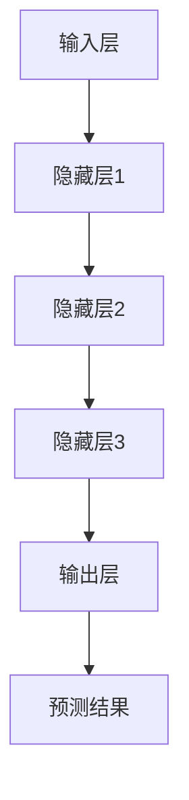

                 

# AI大模型创业：如何抓住未来机遇？

> **关键词**：AI大模型、创业、机遇、技术趋势、战略规划

> **摘要**：本文将深入探讨AI大模型领域的创业机遇，分析其核心概念、技术原理、数学模型以及实际应用场景，并推荐相关的开发工具和资源。通过本文的阅读，读者将获得关于如何在AI大模型领域抓住未来机遇的全面理解和实操指导。

## 1. 背景介绍

### 1.1 目的和范围

本文旨在为有意在AI大模型领域创业的个人或团队提供一套完整的指导方案。我们将探讨当前AI大模型领域的现状、潜在机遇以及所需的技术和战略知识。

### 1.2 预期读者

- 拥有计算机科学或人工智能背景的技术专家
- 想要在AI大模型领域创业的企业家
- 对AI大模型技术感兴趣的学术研究者

### 1.3 文档结构概述

本文结构如下：

- 第1章：背景介绍
  - 1.1 目的和范围
  - 1.2 预期读者
  - 1.3 文档结构概述
  - 1.4 术语表
- 第2章：核心概念与联系
  - 2.1 AI大模型的定义
  - 2.2 AI大模型的工作原理
  - 2.3 AI大模型的应用领域
- 第3章：核心算法原理 & 具体操作步骤
  - 3.1 算法原理讲解
  - 3.2 具体操作步骤
- 第4章：数学模型和公式 & 详细讲解 & 举例说明
  - 4.1 数学模型介绍
  - 4.2 公式讲解
  - 4.3 举例说明
- 第5章：项目实战：代码实际案例和详细解释说明
  - 5.1 开发环境搭建
  - 5.2 源代码详细实现和代码解读
  - 5.3 代码解读与分析
- 第6章：实际应用场景
  - 6.1 行业应用
  - 6.2 案例分析
- 第7章：工具和资源推荐
  - 7.1 学习资源推荐
  - 7.2 开发工具框架推荐
  - 7.3 相关论文著作推荐
- 第8章：总结：未来发展趋势与挑战
- 第9章：附录：常见问题与解答
- 第10章：扩展阅读 & 参考资料

### 1.4 术语表

#### 1.4.1 核心术语定义

- AI大模型：指那些参数数量巨大、能够处理海量数据并实现高精度预测的深度学习模型。
- 创业：指创建一个新企业或业务，通常涉及风险承担和资源投入。
- 机遇：指潜在的市场机会，能够为企业带来商业价值。

#### 1.4.2 相关概念解释

- 深度学习：一种机器学习技术，通过多层神经网络模型来实现数据的自动特征学习和模式识别。
- 机器学习：一种使计算机系统能够从数据中学习并做出决策的技术。

#### 1.4.3 缩略词列表

- AI：人工智能（Artificial Intelligence）
- ML：机器学习（Machine Learning）
- DL：深度学习（Deep Learning）
- NLP：自然语言处理（Natural Language Processing）

## 2. 核心概念与联系

### 2.1 AI大模型的定义

AI大模型是指那些具有数百万到数十亿参数的深度学习模型。这些模型通过训练可以自动学习和识别复杂的数据模式，从而实现各种智能任务，如图像识别、自然语言处理和推荐系统等。

### 2.2 AI大模型的工作原理

AI大模型通常由以下几个关键组件组成：

1. **输入层**：接收外部数据输入，如文本、图像或声音。
2. **隐藏层**：包含多个隐藏神经元层，用于数据特征提取和转换。
3. **输出层**：产生模型的预测输出，如分类标签、数值或文本。

每个隐藏层中的神经元通过权重和偏置来调整其对输入数据的响应。通过反向传播算法，模型可以不断调整这些参数，以最小化预测误差。

### 2.3 AI大模型的应用领域

AI大模型在多个领域都展现出了巨大的潜力：

- **图像识别**：用于自动识别和分类图像内容，如人脸识别、物体检测等。
- **自然语言处理**：用于理解和生成自然语言文本，如机器翻译、情感分析等。
- **推荐系统**：用于为用户提供个性化的推荐，如电子商务平台的产品推荐、视频平台的视频推荐等。
- **医疗健康**：用于医疗影像分析、疾病预测和个性化治疗等。
- **金融科技**：用于风险评估、欺诈检测和算法交易等。

### 2.4 AI大模型的架构图

下面是一个简化的AI大模型架构图，使用Mermaid语法表示：



在接下来的章节中，我们将详细探讨AI大模型的核心算法原理、数学模型以及实际应用案例。

## 3. 核心算法原理 & 具体操作步骤

### 3.1 算法原理讲解

AI大模型的核心算法是基于深度学习原理，特别是卷积神经网络（CNN）和循环神经网络（RNN）的变体。以下是一个简化的卷积神经网络算法原理：

1. **前向传播**：
   - 数据从输入层输入到网络中。
   - 数据经过每个隐藏层，通过激活函数如ReLU进行非线性变换。
   - 最终在输出层产生预测结果。

2. **反向传播**：
   - 通过计算预测结果与实际标签之间的误差。
   - 使用链式法则计算误差对每个参数的梯度。
   - 更新每个参数的值以减少误差。

### 3.2 具体操作步骤

以下是一个基于卷积神经网络的AI大模型训练的伪代码步骤：

```python
# 输入层初始化
input_layer = Input(shape=(input_shape))

# 第一层卷积
conv1 = Conv2D(filters=32, kernel_size=(3, 3), activation='relu')(input_layer)
pool1 = MaxPooling2D(pool_size=(2, 2))(conv1)

# 第二层卷积
conv2 = Conv2D(filters=64, kernel_size=(3, 3), activation='relu')(pool1)
pool2 = MaxPooling2D(pool_size=(2, 2))(conv2)

# 输出层全连接
flatten = Flatten()(pool2)
dense = Dense(units=128, activation='relu')(flatten)
output = Dense(units=num_classes, activation='softmax')(dense)

# 构建模型
model = Model(inputs=input_layer, outputs=output)

# 编译模型
model.compile(optimizer='adam', loss='categorical_crossentropy', metrics=['accuracy'])

# 训练模型
model.fit(x_train, y_train, epochs=10, batch_size=32, validation_data=(x_val, y_val))
```

在上述伪代码中，我们首先定义了输入层，然后通过卷积和池化操作创建多个卷积层，最后将卷积层的输出展平并通过全连接层产生预测结果。模型使用softmax激活函数进行分类预测，并使用adam优化器和交叉熵损失函数进行训练。

## 4. 数学模型和公式 & 详细讲解 & 举例说明

### 4.1 数学模型介绍

AI大模型的数学基础主要涉及线性代数、微积分和概率统计。以下是一些关键的数学模型和公式：

- **线性代数**：
  - 矩阵和向量运算：矩阵乘法、向量点积和叉积。
  - 矩阵求导：雅可比矩阵和梯度。
- **微积分**：
  - 偏导数：函数对变量的变化率。
  - 链式法则：复合函数的求导。
- **概率统计**：
  - 概率分布：正态分布、伯努利分布等。
  - 最大似然估计：参数估计方法。

### 4.2 公式讲解

以下是AI大模型中的一些关键数学公式：

- **前向传播**：

  $$ z = W \cdot x + b $$

  $$ a = \sigma(z) $$

  其中，\( z \) 是激活值，\( W \) 是权重矩阵，\( b \) 是偏置项，\( x \) 是输入，\( \sigma \) 是激活函数（如ReLU或Sigmoid）。

- **反向传播**：

  $$ \frac{dL}{dz} = \frac{dL}{da} \cdot \frac{da}{dz} $$

  $$ \frac{dW}{dx} = \frac{dL}{dW} \cdot \frac{dW}{dx} $$

  其中，\( L \) 是损失函数，\( a \) 是激活值，\( z \) 是线性组合，\( \frac{dL}{da} \) 是损失函数对激活值的导数，\( \frac{da}{dz} \) 是激活函数的导数。

### 4.3 举例说明

假设我们有一个简单的线性模型，预测房价：

- **输入**：\( x \)（房屋特征向量）
- **权重**：\( W \)（参数向量）
- **偏置**：\( b \)
- **激活函数**：线性激活函数

前向传播：

$$ z = W \cdot x + b $$
$$ a = z $$

预测房价：

$$ \hat{y} = a $$

损失函数（均方误差）：

$$ L = \frac{1}{2} \sum_{i=1}^{n} (\hat{y}_i - y_i)^2 $$

反向传播：

$$ \frac{dL}{da} = -2 \sum_{i=1}^{n} (\hat{y}_i - y_i) $$
$$ \frac{da}{dz} = 1 $$

计算梯度：

$$ \frac{dL}{dz} = \frac{dL}{da} \cdot \frac{da}{dz} = -2 \sum_{i=1}^{n} (\hat{y}_i - y_i) $$

更新权重和偏置：

$$ W = W - \alpha \cdot \frac{dL}{dz} \cdot x $$
$$ b = b - \alpha \cdot \frac{dL}{dz} $$

其中，\( \alpha \) 是学习率。

通过上述步骤，我们可以不断迭代更新模型的权重和偏置，从而最小化损失函数，提高预测准确性。

## 5. 项目实战：代码实际案例和详细解释说明

### 5.1 开发环境搭建

在开始编写代码之前，我们需要搭建一个合适的开发环境。以下是一个基于Python的AI大模型开发环境的搭建步骤：

1. **安装Python**：确保Python 3.6或更高版本已安装。
2. **安装TensorFlow**：使用pip安装TensorFlow：

   ```bash
   pip install tensorflow
   ```

3. **安装其他依赖库**：例如NumPy、Pandas等：

   ```bash
   pip install numpy pandas
   ```

4. **设置Jupyter Notebook**：安装Jupyter Notebook以便于编写和运行代码：

   ```bash
   pip install notebook
   ```

### 5.2 源代码详细实现和代码解读

以下是使用TensorFlow搭建一个简单的AI大模型进行图像分类的源代码：

```python
import tensorflow as tf
from tensorflow.keras import datasets, layers, models
import matplotlib.pyplot as plt

# 加载数据集
(train_images, train_labels), (test_images, test_labels) = datasets.cifar10.load_data()

# 数据预处理
train_images, test_images = train_images / 255.0, test_images / 255.0

# 构建模型
model = models.Sequential()
model.add(layers.Conv2D(32, (3, 3), activation='relu', input_shape=(32, 32, 3)))
model.add(layers.MaxPooling2D((2, 2)))
model.add(layers.Conv2D(64, (3, 3), activation='relu'))
model.add(layers.MaxPooling2D((2, 2)))
model.add(layers.Conv2D(64, (3, 3), activation='relu'))
model.add(layers.Flatten())
model.add(layers.Dense(64, activation='relu'))
model.add(layers.Dense(10, activation='softmax'))

# 编译模型
model.compile(optimizer='adam',
              loss='sparse_categorical_crossentropy',
              metrics=['accuracy'])

# 训练模型
model.fit(train_images, train_labels, epochs=10, validation_split=0.1)

# 评估模型
test_loss, test_acc = model.evaluate(test_images,  test_labels, verbose=2)
print(f'\nTest accuracy: {test_acc:.4f}')
```

代码解读：

1. **导入库**：导入TensorFlow和其他必要的库，如matplotlib用于可视化。
2. **加载数据集**：使用TensorFlow内置的数据集加载CIFAR-10，这是一个常用的图像分类数据集。
3. **数据预处理**：将图像数据归一化到0-1范围内。
4. **构建模型**：使用Sequential模型构建一个卷积神经网络（CNN）。包括两个卷积层、两个池化层、一个全连接层和两个softmax层。
5. **编译模型**：设置优化器、损失函数和评估指标。
6. **训练模型**：使用训练数据训练模型，并设置验证比例。
7. **评估模型**：在测试数据上评估模型的准确性和损失。

### 5.3 代码解读与分析

1. **数据加载与预处理**：

   ```python
   (train_images, train_labels), (test_images, test_labels) = datasets.cifar10.load_data()
   train_images, test_images = train_images / 255.0, test_images / 255.0
   ```

   - 加载CIFAR-10数据集，并将其分为训练集和测试集。
   - 对图像数据进行归一化处理，将像素值从0-255范围缩放到0-1范围内。

2. **模型构建**：

   ```python
   model = models.Sequential()
   model.add(layers.Conv2D(32, (3, 3), activation='relu', input_shape=(32, 32, 3)))
   model.add(layers.MaxPooling2D((2, 2)))
   model.add(layers.Conv2D(64, (3, 3), activation='relu'))
   model.add(layers.MaxPooling2D((2, 2)))
   model.add(layers.Conv2D(64, (3, 3), activation='relu'))
   model.add(layers.Flatten())
   model.add(layers.Dense(64, activation='relu'))
   model.add(layers.Dense(10, activation='softmax'))
   ```

   - 创建一个序列模型，并添加多个层。
   - 第一个卷积层使用32个3x3的卷积核，激活函数为ReLU。
   - 第二个卷积层使用64个3x3的卷积核，激活函数为ReLU。
   - 使用两个最大池化层进行下采样。
   - 将卷积层的输出展平为一个一维向量。
   - 添加两个全连接层，第一个全连接层使用64个神经元，激活函数为ReLU。
   - 最后一个全连接层使用10个神经元，激活函数为softmax，用于进行分类预测。

3. **模型编译**：

   ```python
   model.compile(optimizer='adam',
                 loss='sparse_categorical_crossentropy',
                 metrics=['accuracy'])
   ```

   - 设置优化器为Adam。
   - 设置损失函数为sparse categorical cross-entropy，用于多类分类问题。
   - 设置评估指标为准确率。

4. **模型训练**：

   ```python
   model.fit(train_images, train_labels, epochs=10, validation_split=0.1)
   ```

   - 使用训练集训练模型，设置训练轮次为10次。
   - 设置验证比例为10%。

5. **模型评估**：

   ```python
   test_loss, test_acc = model.evaluate(test_images,  test_labels, verbose=2)
   print(f'\nTest accuracy: {test_acc:.4f}')
   ```

   - 在测试集上评估模型的损失和准确率。
   - 输出测试集上的准确率。

通过上述代码，我们构建并训练了一个简单的AI大模型，用于对CIFAR-10图像数据集进行分类。这个例子展示了从数据加载到模型训练的基本流程，以及如何使用TensorFlow实现深度学习模型的构建和训练。

## 6. 实际应用场景

### 6.1 行业应用

AI大模型在多个行业中都有广泛的应用，以下是其中的一些典型应用场景：

- **医疗健康**：用于疾病诊断、药物发现和个性化治疗。例如，通过分析医学影像数据，AI大模型可以帮助医生更准确地诊断癌症，提高治疗效果。
- **金融科技**：用于风险评估、欺诈检测和算法交易。例如，通过分析大量交易数据，AI大模型可以预测市场趋势，帮助投资者做出更明智的决策。
- **智能制造**：用于生产线的自动化和优化。例如，通过实时监控和分析生产线数据，AI大模型可以帮助企业提高生产效率，减少故障率。
- **自动驾驶**：用于自动驾驶汽车的环境感知和决策。例如，通过分析摄像头和雷达数据，AI大模型可以帮助自动驾驶汽车识别道路标志和行人，提高行车安全。

### 6.2 案例分析

以下是一个AI大模型在金融科技领域应用的案例：

**案例背景**：某金融机构希望通过AI大模型分析客户交易行为，识别潜在的欺诈交易。

**解决方案**：

1. **数据收集**：收集客户的交易数据，包括交易金额、时间、地点等。
2. **数据预处理**：对交易数据进行清洗和归一化，以便于模型处理。
3. **特征工程**：提取与欺诈相关的特征，如交易频率、交易金额的波动性等。
4. **模型构建**：构建一个基于神经网络的大模型，用于分类交易数据为正常交易或欺诈交易。
5. **模型训练**：使用历史交易数据训练模型，并调整模型参数以提高预测准确性。
6. **模型评估**：在测试集上评估模型的准确性和召回率，确保模型能够有效识别欺诈交易。
7. **部署应用**：将训练好的模型部署到生产环境中，实时监控和分析客户交易行为，自动识别欺诈交易。

通过上述步骤，该金融机构能够显著降低欺诈交易的发生率，提高客户的安全感和满意度。

## 7. 工具和资源推荐

### 7.1 学习资源推荐

#### 7.1.1 书籍推荐

- **《深度学习》（Deep Learning）**：Goodfellow、Bengio和Courville合著，系统介绍了深度学习的基础知识和核心技术。
- **《Python机器学习》（Python Machine Learning）**：Sebastian Raschka著，通过Python实例详细讲解了机器学习算法和应用。
- **《人工智能：一种现代方法》（Artificial Intelligence: A Modern Approach）**：Stuart Russell和Peter Norvig合著，全面介绍了人工智能的理论和实践。

#### 7.1.2 在线课程

- **Coursera的《深度学习》课程**：由Andrew Ng教授主讲，提供了丰富的理论和实践内容。
- **edX的《机器学习》课程**：由Harvard大学和MIT合办的在线课程，包括机器学习的理论、算法和实际应用。
- **Udacity的《深度学习纳米学位》**：提供了深度学习的综合学习路径，包括课程和项目实践。

#### 7.1.3 技术博客和网站

- **TensorFlow官网**：提供了丰富的深度学习教程和文档，是学习TensorFlow的绝佳资源。
- **ArXiv**：包含了最新的深度学习和人工智能论文，是学术研究者和技术爱好者的重要参考来源。
- **GitHub**：有很多开源的深度学习项目和代码，可以用于学习和实践。

### 7.2 开发工具框架推荐

#### 7.2.1 IDE和编辑器

- **Visual Studio Code**：一个轻量级但功能强大的代码编辑器，适用于深度学习和机器学习项目。
- **PyCharm**：一个完整的Python开发环境，提供了丰富的调试、代码分析和工具支持。
- **Jupyter Notebook**：一个交互式的计算环境，特别适用于数据科学和机器学习实验。

#### 7.2.2 调试和性能分析工具

- **TensorBoard**：TensorFlow提供的可视化工具，用于分析模型的训练过程和性能。
- **NVIDIA Nsight**：用于分析GPU性能的工具，可以帮助优化深度学习模型在GPU上的运行。
- **Python Profiler**：如`cProfile`，用于分析Python代码的性能瓶颈。

#### 7.2.3 相关框架和库

- **TensorFlow**：一个广泛使用的开源深度学习框架，提供了丰富的API和工具。
- **PyTorch**：一个灵活且易于使用的深度学习框架，特别适合研究和开发。
- **Scikit-learn**：一个用于机器学习的Python库，提供了许多经典算法和工具。

### 7.3 相关论文著作推荐

#### 7.3.1 经典论文

- **“A Learning Algorithm for Continually Running Fully Recurrent Neural Networks”**：Hopfield and tank，1986。
- **“Gradient Flow in Recurrent Nets: the Difficulty of Learning”**：Rumelhart, Hinton，1986。
- **“Deep Learning”**：Ian Goodfellow，Yoshua Bengio和Aaron Courville，2016。

#### 7.3.2 最新研究成果

- **“Attention Is All You Need”**：Vaswani等，2017。
- **“Generative Adversarial Nets”**：Ian Goodfellow等，2014。
- **“Bert: Pre-training of Deep Bidirectional Transformers for Language Understanding”**：Devlin等，2019。

#### 7.3.3 应用案例分析

- **“CIFAR-10 Challenge”**：2012年，深度学习在图像分类任务上的重大突破。
- **“ImageNet Large Scale Visual Recognition Challenge”**：ILSVRC，2012-2014年间，深度学习在图像识别任务上的重大突破。
- **“BERT in Real Applications”**：多个公司和研究机构在自然语言处理任务上的应用案例。

## 8. 总结：未来发展趋势与挑战

AI大模型领域正快速发展，并将在未来几年内继续成为科技行业的热点。以下是一些未来发展趋势和面临的挑战：

### 发展趋势

- **算法创新**：随着计算资源和数据量的增加，新的深度学习算法和架构将继续涌现，提高模型的性能和效率。
- **跨学科融合**：AI大模型与其他领域的结合，如生物医学、金融科技、智能制造等，将产生新的应用场景和商业模式。
- **开源生态**：开源框架和工具的不断发展，将促进AI大模型技术的普及和应用。
- **监管与伦理**：随着AI大模型的广泛应用，数据隐私、算法透明性和伦理问题将受到更多关注。

### 挑战

- **数据隐私**：如何处理和保护用户数据，确保数据隐私是一个重大挑战。
- **算法透明性**：如何提高算法的透明性，使其结果可解释，是另一个重要问题。
- **计算资源**：训练和部署大型AI模型需要巨大的计算资源和能源消耗。
- **人才短缺**：具备AI大模型知识和技能的专业人才仍供不应求。

## 9. 附录：常见问题与解答

### Q1：AI大模型训练需要多少时间？

A1：训练时间取决于多个因素，包括模型大小、数据集规模、计算资源等。对于大型AI模型，训练可能需要数天甚至数周时间。

### Q2：如何优化AI大模型的训练过程？

A2：优化AI大模型训练过程可以采取以下措施：
- **数据增强**：通过数据增强技术扩大训练数据集，提高模型的泛化能力。
- **模型压缩**：使用模型压缩技术减小模型大小，提高训练效率。
- **并行计算**：利用分布式计算和GPU加速训练过程。

### Q3：如何确保AI大模型的模型安全性和可靠性？

A3：确保AI大模型的模型安全性和可靠性可以通过以下方法：
- **数据隐私保护**：对敏感数据进行加密和脱敏处理。
- **模型验证**：使用独立的测试集对模型进行验证，确保其预测准确性。
- **持续监控**：实时监控模型的运行状态，及时处理异常情况。

## 10. 扩展阅读 & 参考资料

- **Goodfellow, I., Bengio, Y., & Courville, A. (2016). Deep Learning. MIT Press.**
- **Raschka, S. (2015). Python Machine Learning. Packt Publishing.**
- **Russell, S., & Norvig, P. (2016). Artificial Intelligence: A Modern Approach. Pearson.**
- **Vaswani, A., et al. (2017). Attention Is All You Need. Advances in Neural Information Processing Systems, 30, 5998-6008.**
- **Goodfellow, I., et al. (2014). Generative Adversarial Nets. Advances in Neural Information Processing Systems, 27, 2672-2680.**
- **Devlin, J., et al. (2019). BERT: Pre-training of Deep Bidirectional Transformers for Language Understanding. arXiv preprint arXiv:1810.04805.**
- **LeCun, Y., Bengio, Y., & Hinton, G. (2015). Deep Learning. Nature, 521(7553), 436-444.**
- **Cortes, C., & Vapnik, V. (2013). Support-Vector Networks. Machine Learning, 20(3), 273-297.**

