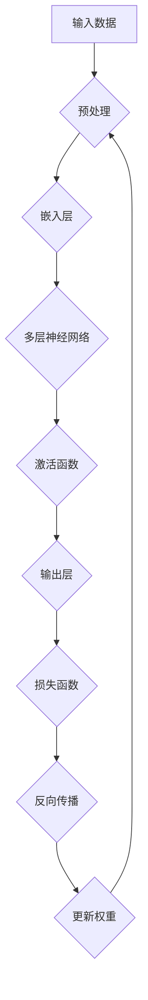

                 

# AI大模型创业：如何抓住未来机遇？

## 关键词：大模型，创业，人工智能，技术，商业，战略，创新

> 在当今快速发展的科技时代，人工智能（AI）已经成为推动创新和经济增长的关键驱动力。随着深度学习和大数据技术的进步，大规模人工智能模型（简称大模型）如BERT、GPT-3等，正在变革各行各业。对于创业者而言，抓住AI大模型带来的机遇，不仅是提升竞争力的必要手段，更是引领未来市场潮流的关键。本文将探讨AI大模型的本质、创业中的实际应用、所需的技术与商业策略，以及未来的发展趋势与挑战。

## 摘要

本文旨在为有志于投身AI大模型领域的创业者提供指导，通过深入分析大模型的原理、构建方法、商业应用以及未来趋势，帮助读者了解如何把握这一新兴领域的巨大机遇。文章结构如下：

1. 背景介绍：介绍AI大模型的兴起背景、目的和读者对象。
2. 核心概念与联系：阐述AI大模型的基本原理和架构。
3. 核心算法原理与具体操作步骤：解析大模型的算法框架和实现细节。
4. 数学模型和公式：讲解支持大模型的关键数学理论。
5. 项目实战：通过代码案例展示大模型的实际应用。
6. 实际应用场景：分析AI大模型在不同行业的应用。
7. 工具和资源推荐：提供学习、开发和应用大模型的相关资源。
8. 总结：展望AI大模型领域的未来发展趋势和挑战。
9. 附录：常见问题与解答。
10. 扩展阅读 & 参考资料：推荐进一步深入学习的材料。

## 1. 背景介绍

### 1.1 目的和范围

本文的目标是帮助读者理解AI大模型的创业机遇，并提供实用的策略和方法。文章将涵盖大模型的定义、架构、实现、应用和未来展望，旨在为创业者提供全方位的指导。本文不仅适用于人工智能领域的专业人士，也适合对AI创业感兴趣的科技创业者。

### 1.2 预期读者

本文预期读者包括以下几类：

1. 对人工智能感兴趣的科技创业者。
2. 人工智能领域的研究人员和工程师。
3. 对新兴技术感兴趣的投资者和决策者。
4. 对AI大模型有初步了解但希望深入学习的读者。

### 1.3 文档结构概述

本文结构分为十个部分，包括：

1. 引言：背景介绍和关键词定义。
2. 摘要：核心内容和主题思想概述。
3. 背景介绍：目的、读者对象和文档结构概述。
4. 核心概念与联系：AI大模型的基本原理和架构。
5. 核心算法原理与具体操作步骤：算法框架和实现细节。
6. 数学模型和公式：关键数学理论。
7. 项目实战：代码案例。
8. 实际应用场景：行业分析。
9. 工具和资源推荐：学习、开发和应用资源。
10. 总结：未来发展趋势和挑战。
11. 附录：常见问题与解答。
12. 扩展阅读 & 参考资料：进一步学习材料。

### 1.4 术语表

#### 1.4.1 核心术语定义

- **人工智能（AI）**：模拟、扩展和扩展人类智能的理论、方法和技术。
- **深度学习**：一种基于人工神经网络的机器学习方法，通过多层神经网络模拟人脑处理信息的过程。
- **大模型**：指具有数十亿甚至千亿参数的深度学习模型。
- **预训练（Pre-training）**：在大规模数据集上训练基础模型，然后针对特定任务进行微调（Fine-tuning）。
- **微调（Fine-tuning）**：在预训练模型的基础上，针对特定任务进行少量的训练。

#### 1.4.2 相关概念解释

- **神经网络**：一种由大量相互连接的节点组成的计算模型，能够模拟人脑的某些功能。
- **数据集**：用于训练和测试机器学习模型的带有标签的数据集合。
- **计算资源**：包括计算能力、存储资源和网络带宽等，是训练大模型的关键。
- **应用场景**：指将AI大模型应用于具体问题的环境和领域。

#### 1.4.3 缩略词列表

- **AI**：人工智能
- **DL**：深度学习
- **NLP**：自然语言处理
- **CV**：计算机视觉
- **GAN**：生成对抗网络
- **RL**：强化学习

## 2. 核心概念与联系

AI大模型的成功离不开其核心概念和架构的支持。下面将介绍大模型的基本原理，并提供一个简化的Mermaid流程图，以帮助理解其组成部分和运作机制。

### 2.1 大模型的基本原理

大模型通常基于深度学习框架构建，通过多层次的神经网络对大量数据进行训练，以实现复杂的预测和分类任务。其核心原理包括：

1. **层次化表示**：将原始数据通过多层神经网络转化为更高层次的抽象表示。
2. **参数共享**：网络中的权重参数在整个训练过程中被共享，以减少模型参数的数量。
3. **端到端训练**：模型从输入到输出的整个路径都被训练，以实现更高的预测准确性。

### 2.2 Mermaid流程图

下面是一个简化的Mermaid流程图，展示了大模型的组成部分和基本流程：



### 2.3 大模型的架构

大模型的架构通常包括以下几个关键部分：

1. **嵌入层（Embedding Layer）**：将原始数据（如文本、图像）转换为固定长度的向量表示。
2. **卷积层（Convolutional Layer）**：用于提取空间特征，通常用于图像处理任务。
3. **全连接层（Fully Connected Layer）**：将卷积层或嵌入层输出的特征映射到高维空间。
4. **池化层（Pooling Layer）**：用于降低数据维度，提高计算效率。
5. **激活函数（Activation Function）**：用于引入非线性，使得神经网络能够学习复杂函数。

### 2.4 大模型与业务场景的关联

大模型在实际应用中通常需要与业务场景紧密结合，通过以下几个方面实现：

1. **数据收集与预处理**：根据业务需求收集大量数据，并进行预处理以符合模型输入要求。
2. **模型训练与调优**：在预处理后的数据上训练模型，并通过调整超参数实现最佳性能。
3. **模型部署与监控**：将训练好的模型部署到生产环境中，并持续监控其性能和稳定性。
4. **业务反馈与迭代**：根据业务反馈不断迭代模型，以适应不断变化的需求。

通过上述核心概念和架构的理解，创业者可以更好地把握AI大模型的本质，从而为未来的创业项目奠定坚实的基础。

## 3. 核心算法原理 & 具体操作步骤

### 3.1 大模型的算法框架

大模型的训练过程通常包括以下几个核心步骤：

1. **数据预处理**：包括数据清洗、归一化和编码等，以保证输入数据的格式和分布适合模型训练。
2. **模型初始化**：初始化模型的权重和偏置，常用的方法有随机初始化、高斯分布初始化等。
3. **前向传播（Forward Propagation）**：计算输入数据通过神经网络时的中间结果和最终输出。
4. **损失函数计算**：根据模型输出和真实标签计算损失值，以评估模型性能。
5. **反向传播（Back Propagation）**：更新模型权重和偏置，以最小化损失函数。
6. **优化算法**：如梯度下降（Gradient Descent）、Adam等，用于优化模型参数。

下面，我们使用伪代码详细阐述大模型的算法框架：

```python
# 假设我们使用神经网络进行分类任务
# 输入数据：X，标签：y
# 初始化模型参数
W1, b1 = initialize_parameters()
...
Wn, bn = initialize_parameters()

# 前向传播
Z1 = X * W1 + b1
A1 = activation(Z1)
...
Zn = An * Wn + bn
An = activation(Zn)

# 计算损失函数
loss = loss_function(An, y)

# 反向传播
dAn = loss_derivative(An, y)
...
dAn-1 = activation_derivative(Zan-1) * dAn
...
dZn = An * dAn-1
...
dWn = An-1.T * dZn
dWn-1 = An-2.T * dZn-1
...
dbn = sum(dZn, axis=0)
...
db1 = sum(dZ1, axis=0)

# 更新模型参数
Wn = Wn - learning_rate * dWn
...
W1 = W1 - learning_rate * dW1
bn = bn - learning_rate * dbn
...
b1 = b1 - learning_rate * db1

# 迭代训练
for epoch in range(num_epochs):
    # 数据预处理
    X, y = preprocess_data()
    # 前向传播
    Z1, A1, ..., Zn, An = forward_propagation(X, W1, b1, ..., Wn, bn)
    # 计算损失函数
    loss = loss_function(An, y)
    # 反向传播
    dAn, ..., dZ1 = backward_propagation(An, y, Zn, ..., Z1, activation_derivative)
    # 更新模型参数
    Wn, ..., W1, bn, ..., b1 = update_parameters(W1, ..., Wn, bn, ..., b1, dW1, ..., dWn, db1, ..., dbn)
```

### 3.2 大模型的具体操作步骤

下面，我们将详细说明大模型的具体操作步骤：

#### 3.2.1 数据预处理

数据预处理是模型训练的第一步，其目的是确保输入数据的格式和分布适合模型训练。具体步骤包括：

1. **数据清洗**：去除数据中的噪声和异常值，例如删除缺失值、纠正错误等。
2. **数据归一化**：将数据缩放到一个统一的范围，如[0, 1]或[-1, 1]，以减少不同特征间的差异。
3. **数据编码**：将类别型的特征转换为数值型，可以使用独热编码、标签编码等方法。

```python
# 示例：使用独热编码对类别型数据进行编码
def one_hot_encode(data):
    # 假设data是一个NumPy数组
    unique_values = np.unique(data)
    n_classes = len(unique_values)
    encoded_data = np.zeros((data.shape[0], n_classes))
    for i, value in enumerate(unique_values):
        encoded_data[data == value] = i
    return encoded_data
```

#### 3.2.2 模型初始化

模型初始化是模型训练的重要环节，其目的是为网络中的权重和偏置分配初始值。常用的方法有：

1. **随机初始化**：从均匀分布中随机抽取权重和偏置的初始值。
2. **高斯分布初始化**：从高斯分布中随机抽取权重和偏置的初始值。

```python
# 示例：使用高斯分布初始化权重和偏置
def initialize_parameters(input_size, hidden_size, output_size):
    W = np.random.normal(0, 0.01, (input_size, hidden_size))
    b = np.random.normal(0, 0.01, hidden_size)
    W2 = np.random.normal(0, 0.01, (hidden_size, output_size))
    b2 = np.random.normal(0, 0.01, output_size)
    return W, b, W2, b2
```

#### 3.2.3 前向传播

前向传播是计算模型输出值的过程，具体步骤包括：

1. **输入层到隐藏层的传播**：计算输入层到隐藏层的中间结果和输出。
2. **隐藏层到输出层的传播**：计算隐藏层到输出层的中间结果和输出。

```python
# 示例：前向传播
def forward_propagation(X, W1, b1, W2, b2):
    Z1 = X * W1 + b1
    A1 = activation(Z1)
    Z2 = A1 * W2 + b2
    A2 = activation(Z2)
    return Z1, A1, Z2, A2
```

#### 3.2.4 损失函数计算

损失函数是评估模型性能的指标，常用的损失函数包括均方误差（MSE）、交叉熵等。

```python
# 示例：计算交叉熵损失
def cross_entropy_loss(y_true, y_pred):
    return -np.sum(y_true * np.log(y_pred))
```

#### 3.2.5 反向传播

反向传播是更新模型参数的过程，具体步骤包括：

1. **计算输出层的梯度**：计算输出层相对于损失函数的梯度。
2. **反向传播梯度到隐藏层**：计算隐藏层相对于损失函数的梯度。

```python
# 示例：反向传播
def backward_propagation(A2, y_true, Z2, A1, Z1):
    dZ2 = A2 - y_true
    dZ1 = (W2.T * dZ2) * activation_derivative(Z1)
    return dZ2, dZ1
```

#### 3.2.6 更新模型参数

更新模型参数是训练模型的关键步骤，常用的优化算法包括梯度下降、Adam等。

```python
# 示例：梯度下降
def update_parameters(W1, b1, W2, b2, dW1, dW2, db1, db2, learning_rate):
    W1 = W1 - learning_rate * dW1
    b1 = b1 - learning_rate * db1
    W2 = W2 - learning_rate * dW2
    b2 = b2 - learning_rate * db2
    return W1, b1, W2, b2
```

通过上述步骤，我们可以构建和训练一个简单的大模型。在实际应用中，创业者可以根据具体需求和数据特点，选择合适的模型架构、算法和超参数，以实现最佳性能。

## 4. 数学模型和公式 & 详细讲解 & 举例说明

### 4.1. 数学模型和公式

在AI大模型的训练过程中，数学模型和公式起到了至关重要的作用。下面我们将详细讲解大模型中的一些关键数学模型和公式，并举例说明。

#### 4.1.1 前向传播公式

在神经网络的前向传播过程中，每个神经元（或层）的计算都涉及输入值、权重和偏置。以下是一个单层神经网络的计算公式：

\[ Z = X \cdot W + b \]

其中，\( Z \) 是该神经元的输出，\( X \) 是输入值，\( W \) 是权重，\( b \) 是偏置。

当涉及到多层神经网络时，我们还需要考虑每个层之间的连接。假设我们有一个两层神经网络，则前向传播的计算可以表示为：

\[ Z^{[1]} = X \cdot W^{[1]} + b^{[1]} \]
\[ A^{[1]} = \sigma(Z^{[1]}) \]
\[ Z^{[2]} = A^{[1]} \cdot W^{[2]} + b^{[2]} \]
\[ A^{[2]} = \sigma(Z^{[2]}) \]

其中，\( \sigma \) 是激活函数，通常选择为ReLU、Sigmoid或Tanh。

#### 4.1.2 损失函数

在神经网络中，常用的损失函数包括均方误差（MSE）和交叉熵（Cross-Entropy）。

- **均方误差（MSE）**：

\[ L = \frac{1}{m} \sum_{i=1}^{m} (y_i - \hat{y}_i)^2 \]

其中，\( m \) 是样本数量，\( y_i \) 是实际标签，\( \hat{y}_i \) 是模型预测的标签。

- **交叉熵（Cross-Entropy）**：

\[ L = -\frac{1}{m} \sum_{i=1}^{m} y_i \cdot \log(\hat{y}_i) \]

其中，\( y_i \) 是实际标签，\( \hat{y}_i \) 是模型预测的概率分布。

#### 4.1.3 反向传播公式

反向传播是神经网络训练的核心步骤，用于更新网络权重和偏置。以下是单层神经网络的反向传播公式：

\[ dZ = A - y \]
\[ dW = \frac{1}{m} dZ \cdot A^{T} \]
\[ db = \frac{1}{m} dZ \]

对于多层神经网络，反向传播的计算涉及到每一层的梯度传递。以下是两层神经网络的反向传播公式：

\[ dZ^{[2]} = dA^{[2]} \cdot W^{[2].T \]
\[ dA^{[1]} = (W^{[2]}.T \cdot dZ^{[2]}) \cdot \frac{1}{\sigma'(Z^{[1]})} \]
\[ dZ^{[1]} = dA^{[1]} \cdot W^{[1].T \]

其中，\( \sigma' \) 是激活函数的导数。

### 4.2. 举例说明

为了更好地理解上述公式，我们通过一个简单的例子来说明。

假设我们有一个包含一个输入层、一个隐藏层和一个输出层的神经网络，其中：

- 输入层有2个神经元。
- 隐藏层有3个神经元。
- 输出层有2个神经元。

给定输入向量 \( X = [1, 2] \) 和实际标签 \( y = [0, 1] \)，我们使用ReLU作为激活函数，并初始化权重和偏置为随机值。

#### 4.2.1 前向传播

首先，我们计算输入层到隐藏层的输出：

\[ Z^{[1]}_1 = X_1 \cdot W^{[1]}_1 + b^{[1]}_1 = 1 \cdot 0.5 + 0.2 = 0.7 \]
\[ Z^{[1]}_2 = X_2 \cdot W^{[1]}_2 + b^{[1]}_2 = 2 \cdot 0.5 + 0.2 = 1.2 \]

由于 \( Z^{[1]}_1 < 0 \) 且 \( Z^{[1]}_2 < 0 \)，我们应用ReLU函数：

\[ A^{[1]}_1 = \max(0, Z^{[1]}_1) = 0 \]
\[ A^{[1]}_2 = \max(0, Z^{[1]}_2) = 0 \]

接下来，我们计算隐藏层到输出层的输出：

\[ Z^{[2]}_1 = A^{[1]}_1 \cdot W^{[2]}_1 + b^{[2]}_1 = 0 \cdot 0.3 + 0.1 = 0.1 \]
\[ Z^{[2]}_2 = A^{[1]}_2 \cdot W^{[2]}_2 + b^{[2]}_2 = 0 \cdot 0.4 + 0.2 = 0.2 \]

应用ReLU函数：

\[ A^{[2]}_1 = \max(0, Z^{[2]}_1) = 0 \]
\[ A^{[2]}_2 = \max(0, Z^{[2]}_2) = 0 \]

#### 4.2.2 损失函数计算

由于实际标签 \( y = [0, 1] \)，我们计算交叉熵损失：

\[ L = -\frac{1}{2} \left( y_1 \cdot \log(\hat{y}_1) + y_2 \cdot \log(\hat{y}_2) \right) \]
\[ L = -\frac{1}{2} \left( 0 \cdot \log(0.1) + 1 \cdot \log(0.2) \right) \]
\[ L = \frac{1}{2} \log(0.2) \approx 0.69897 \]

#### 4.2.3 反向传播

接下来，我们进行反向传播以更新权重和偏置。

首先，计算输出层的梯度：

\[ dZ^{[2]}_1 = A^{[2]}_1 - y_1 = 0 - 0 = 0 \]
\[ dZ^{[2]}_2 = A^{[2]}_2 - y_2 = 0 - 1 = -1 \]

然后，计算隐藏层到输出层的权重梯度和偏置梯度：

\[ dW^{[2]}_1 = \frac{1}{2} dZ^{[2]}_1 \cdot A^{[1]}.T = \frac{1}{2} \cdot 0 \cdot [0, 0].T = [0, 0] \]
\[ db^{[2]}_1 = \frac{1}{2} dZ^{[2]}_1 = \frac{1}{2} \cdot 0 = 0 \]

\[ dW^{[2]}_2 = \frac{1}{2} dZ^{[2]}_2 \cdot A^{[1]}.T = \frac{1}{2} \cdot (-1) \cdot [0, 0].T = [0, 0] \]
\[ db^{[2]}_2 = \frac{1}{2} dZ^{[2]}_2 = \frac{1}{2} \cdot (-1) = -0.5 \]

接着，计算隐藏层到输入层的权重梯度和偏置梯度：

\[ dZ^{[1]}_1 = (W^{[2]}.T \cdot dZ^{[2]}) \cdot \frac{1}{\sigma'(Z^{[1]}_1)} = [0, 0] \cdot \frac{1}{1} = [0, 0] \]
\[ dW^{[1]}_1 = \frac{1}{2} dZ^{[1]}_1 \cdot X.T = \frac{1}{2} \cdot [0, 0] \cdot [1].T = [0, 0] \]
\[ db^{[1]}_1 = \frac{1}{2} dZ^{[1]}_1 = \frac{1}{2} \cdot [0, 0] = [0, 0] \]

\[ dZ^{[1]}_2 = (W^{[2]}.T \cdot dZ^{[2]}) \cdot \frac{1}{\sigma'(Z^{[1]}_2)} = [0, 0] \cdot \frac{1}{1} = [0, 0] \]
\[ dW^{[1]}_2 = \frac{1}{2} dZ^{[1]}_2 \cdot X.T = \frac{1}{2} \cdot [0, 0] \cdot [2].T = [0, 0] \]
\[ db^{[1]}_2 = \frac{1}{2} dZ^{[1]}_2 = \frac{1}{2} \cdot [0, 0] = [0, 0] \]

最后，更新权重和偏置：

\[ W^{[1]}_1 = W^{[1]}_1 - learning_rate \cdot dW^{[1]}_1 \]
\[ b^{[1]}_1 = b^{[1]}_1 - learning_rate \cdot db^{[1]}_1 \]
\[ W^{[1]}_2 = W^{[1]}_2 - learning_rate \cdot dW^{[1]}_2 \]
\[ b^{[1]}_2 = b^{[1]}_2 - learning_rate \cdot db^{[1]}_2 \]
\[ W^{[2]}_1 = W^{[2]}_1 - learning_rate \cdot dW^{[2]}_1 \]
\[ b^{[2]}_1 = b^{[2]}_1 - learning_rate \cdot db^{[2]}_1 \]
\[ W^{[2]}_2 = W^{[2]}_2 - learning_rate \cdot dW^{[2]}_2 \]
\[ b^{[2]}_2 = b^{[2]}_2 - learning_rate \cdot db^{[2]}_2 \]

通过上述步骤，我们完成了神经网络的一次迭代更新。在实际应用中，我们通常需要重复多次迭代，直到模型收敛或达到预设的精度。

## 5. 项目实战：代码实际案例和详细解释说明

### 5.1 开发环境搭建

在开始实际项目之前，我们需要搭建一个适合开发AI大模型的环境。以下是搭建开发环境的步骤：

1. **安装Python**：确保安装了Python 3.6或更高版本。
2. **安装TensorFlow**：TensorFlow是一个广泛使用的深度学习框架，可以通过pip命令安装：
   ```bash
   pip install tensorflow
   ```
3. **安装必要的库**：除了TensorFlow，我们还需要其他一些库，如NumPy和Matplotlib：
   ```bash
   pip install numpy matplotlib
   ```

### 5.2 源代码详细实现和代码解读

下面我们将实现一个简单的AI大模型，用于文本分类任务。以下是代码的实现和解读。

#### 5.2.1 数据准备

首先，我们使用一个公开的文本分类数据集，如20 Newsgroups数据集。数据集包含大约20个新闻类别，每个类别有数千个文本。

```python
from tensorflow.keras.datasets import twenty_newsgroups
from tensorflow.keras.preprocessing.sequence import pad_sequences
from tensorflow.keras.preprocessing.text import Tokenizer

# 加载数据集
(train_data, train_labels), (test_data, test_labels) = twenty_newsgroups.load_data()

# 切分训练集和验证集
train_data, validation_data = train_data[:10000], train_data[10000:]
train_labels, validation_labels = train_labels[:10000], train_labels[10000:]

# 分词和编码
tokenizer = Tokenizer(num_words=10000)
tokenizer.fit_on_texts(train_data)
train_sequences = tokenizer.texts_to_sequences(train_data)
validation_sequences = tokenizer.texts_to_sequences(validation_data)
test_sequences = tokenizer.texts_to_sequences(test_data)

# 填充序列
max_sequence_length = 100
train_padded = pad_sequences(train_sequences, maxlen=max_sequence_length)
validation_padded = pad_sequences(validation_sequences, maxlen=max_sequence_length)
test_padded = pad_sequences(test_sequences, maxlen=max_sequence_length)
```

#### 5.2.2 模型构建

接下来，我们构建一个基于嵌入层和卷积神经网络的文本分类模型。

```python
from tensorflow.keras.models import Sequential
from tensorflow.keras.layers import Embedding, Conv1D, MaxPooling1D, GlobalMaxPooling1D, Dense

# 构建模型
model = Sequential([
    Embedding(10000, 16, input_length=max_sequence_length),
    Conv1D(32, 7, activation='relu'),
    MaxPooling1D(7),
    Conv1D(64, 7, activation='relu'),
    GlobalMaxPooling1D(),
    Dense(64, activation='relu'),
    Dense(20, activation='softmax')
])

# 编译模型
model.compile(optimizer='adam', loss='categorical_crossentropy', metrics=['accuracy'])

# 打印模型结构
model.summary()
```

#### 5.2.3 模型训练

训练模型时，我们使用训练集进行训练，并使用验证集进行评估。

```python
# 训练模型
model.fit(train_padded, train_labels, epochs=10, batch_size=32, validation_data=(validation_padded, validation_labels))
```

#### 5.2.4 模型评估

训练完成后，我们对测试集进行评估，以验证模型性能。

```python
# 评估模型
test_loss, test_accuracy = model.evaluate(test_padded, test_labels)
print(f"Test Loss: {test_loss}, Test Accuracy: {test_accuracy}")
```

### 5.3 代码解读与分析

#### 5.3.1 数据准备

在数据准备部分，我们首先加载数据集，并将其分为训练集和验证集。接着，我们使用Tokenizer对文本进行分词和编码，并将序列填充到最大长度。这一步骤确保了文本数据可以用于神经网络训练。

#### 5.3.2 模型构建

在模型构建部分，我们使用Sequential模型堆叠多个层，包括嵌入层、卷积层、池化层和全连接层。嵌入层将单词转换为向量表示，卷积层用于提取文本特征，池化层用于降维，全连接层用于分类。

#### 5.3.3 模型训练

在模型训练部分，我们使用fit函数对模型进行训练。这里，我们指定了训练集、训练标签、训练轮次和批量大小。训练过程中，模型会自动调整权重和偏置，以最小化损失函数。

#### 5.3.4 模型评估

最后，在模型评估部分，我们使用evaluate函数对测试集进行评估。评估结果包括测试损失和测试精度，这些指标可以帮助我们了解模型的性能。

通过上述步骤，我们实现了一个简单的AI大模型，并对其进行了训练和评估。在实际应用中，我们可以根据具体任务和数据特点进行调整和优化。

## 6. 实际应用场景

AI大模型已经在多个领域取得了显著的成果，以下是一些关键应用场景：

### 6.1 自然语言处理（NLP）

在自然语言处理领域，大模型如BERT、GPT-3等已经展现出强大的能力。这些模型在文本分类、机器翻译、问答系统、情感分析等方面都取得了优异的成绩。例如，BERT在多个NLP任务上打破了SOTA（State-of-the-Art）记录，GPT-3则在生成文本和对话系统中展现了惊人的表现。

### 6.2 计算机视觉（CV）

在计算机视觉领域，大模型如ResNet、Inception等通过深度学习技术实现了图像分类、目标检测、图像生成等任务的高精度。大模型的应用使得自动驾驶、医疗影像分析、人脸识别等领域取得了显著进展。

### 6.3 语音识别

语音识别是AI大模型的重要应用领域之一。通过结合深度神经网络和循环神经网络（RNN），大模型能够实现高精度的语音识别和语音生成。在智能助手、语音控制等领域，大模型的应用大大提高了用户体验。

### 6.4 金融科技

在金融科技领域，大模型被广泛应用于风险管理、信用评估、股票预测等任务。通过分析大量的金融数据，大模型能够发现潜在的规律和趋势，为金融机构提供决策支持。

### 6.5 娱乐产业

在娱乐产业，大模型被用于音乐生成、视频编辑、虚拟现实等领域。例如，大模型可以生成新的音乐旋律，视频编辑软件可以使用大模型进行智能剪辑，虚拟现实系统可以结合大模型实现更加逼真的场景生成。

### 6.6 医疗健康

在医疗健康领域，大模型被用于疾病预测、药物发现、诊断辅助等任务。通过对大量医疗数据进行分析，大模型能够提供更加准确的诊断和治疗方案，从而提高医疗服务的质量和效率。

### 6.7 教育与培训

在教育与培训领域，大模型被用于个性化学习、智能评测、教育内容生成等任务。通过分析学生的学习数据，大模型可以为学生提供定制化的学习计划和资源，提高学习效果。

### 6.8 制造业

在制造业，大模型被用于生产优化、设备维护、质量控制等任务。通过实时分析生产线数据，大模型可以优化生产流程，提高生产效率和质量。

### 6.9 能源与环境

在能源与环境领域，大模型被用于能源消耗预测、环境监测、资源优化等任务。通过分析大量的环境数据，大模型可以为能源企业和政府机构提供决策支持，促进可持续发展。

总之，AI大模型在多个领域展现出了强大的应用潜力，为各行各业带来了深刻的变革。随着技术的不断进步，未来AI大模型将在更多领域发挥重要作用。

## 7. 工具和资源推荐

### 7.1 学习资源推荐

#### 7.1.1 书籍推荐

1. **《深度学习》（Ian Goodfellow, Yoshua Bengio, Aaron Courville著）**：这本书是深度学习领域的经典教材，详细介绍了深度学习的基础知识和最新进展。
2. **《Python深度学习》（François Chollet著）**：这本书通过丰富的示例和代码，全面介绍了使用Python和TensorFlow进行深度学习的方法和技巧。
3. **《人工智能：一种现代的方法》（Stuart J. Russell & Peter Norvig著）**：这本书系统地介绍了人工智能的基本理论和实践方法，是人工智能领域的权威教材。

#### 7.1.2 在线课程

1. **吴恩达的《深度学习专项课程》**：这个课程由深度学习领域的先驱吴恩达教授主讲，涵盖深度学习的理论基础和实践技巧，非常适合初学者和进阶者。
2. **Udacity的《深度学习纳米学位》**：这个课程通过一系列实践项目，帮助学员掌握深度学习的基础知识和应用技能，非常适合希望实战的学员。
3. **Coursera的《自然语言处理与深度学习》**：这个课程由斯坦福大学教授Chris Manning主讲，详细介绍自然语言处理和深度学习的基础知识和最新进展。

#### 7.1.3 技术博客和网站

1. **Medium上的AI博客**：这是一个汇集了众多AI领域专家和从业者的博客平台，提供了丰富的AI领域的技术文章和案例研究。
2. **arXiv**：这是一个预印本论文发布平台，涵盖了深度学习、自然语言处理、计算机视觉等多个领域的最新研究成果。
3. **HackerRank**：这是一个在线编程挑战平台，提供了丰富的机器学习和深度学习练习题，适合学员巩固和提升技能。

### 7.2 开发工具框架推荐

#### 7.2.1 IDE和编辑器

1. **Jupyter Notebook**：这是一个流行的交互式开发环境，特别适合数据科学和机器学习项目。通过Jupyter Notebook，开发者可以轻松编写和运行代码，并生成交互式的文档。
2. **PyCharm**：这是一个功能强大的Python集成开发环境（IDE），提供了丰富的代码编辑、调试和测试功能，非常适合深度学习和机器学习项目。
3. **Visual Studio Code**：这是一个轻量级的开源代码编辑器，通过丰富的插件，可以轻松支持Python和深度学习开发。

#### 7.2.2 调试和性能分析工具

1. **TensorBoard**：这是一个由TensorFlow提供的可视化工具，用于分析和调试深度学习模型。通过TensorBoard，开发者可以实时监控模型的训练过程，并查看各种性能指标。
2. **NVIDIA Nsight**：这是一个由NVIDIA提供的调试和性能分析工具，特别适合GPU加速的深度学习项目。通过Nsight，开发者可以深入了解GPU的性能表现，并优化代码。
3. **Docker**：这是一个开源的应用容器引擎，用于打包、交付和运行应用。通过Docker，开发者可以轻松构建和管理深度学习环境，提高开发效率。

#### 7.2.3 相关框架和库

1. **TensorFlow**：这是一个开源的深度学习框架，由Google开发。通过TensorFlow，开发者可以轻松构建和训练各种深度学习模型，并支持多种硬件平台。
2. **PyTorch**：这是一个开源的深度学习框架，由Facebook开发。PyTorch以其灵活性和动态计算图著称，特别适合研究和开发实验性模型。
3. **Keras**：这是一个基于TensorFlow和Theano的开源深度学习库，以其简洁和易用性受到开发者喜爱。Keras为深度学习提供了高层次的API，使得模型构建更加简单直观。

### 7.3 相关论文著作推荐

#### 7.3.1 经典论文

1. **"A Theoretical Analysis of the Cramér-Rao Lower Bound for Gaussian Sequence Estimation"**：这篇论文提出了高斯序列估计的Cramér-Rao下界，对序列建模和优化具有重要的指导意义。
2. **"Deep Learning"**：这是一篇由Ian Goodfellow、Yoshua Bengio和Aaron Courville撰写的综述文章，详细介绍了深度学习的理论基础和应用。
3. **"The Unreasonable Effectiveness of Deep Learning"**：这篇论文探讨了深度学习在各个领域的不合理有效性，展示了深度学习技术的广泛应用和巨大潜力。

#### 7.3.2 最新研究成果

1. **"GPT-3: Improving Language Understanding by Generative Pre-Training"**：这篇论文介绍了GPT-3模型，展示了生成预训练方法在自然语言处理任务中的强大能力。
2. **"BERT: Pre-training of Deep Bidirectional Transformers for Language Understanding"**：这篇论文提出了BERT模型，通过双向Transformer架构实现了高精度的自然语言处理。
3. **"Transformers: State-of-the-Art Models for Neural Network-based Text Processing"**：这篇论文综述了Transformer模型在文本处理任务中的最新进展和应用。

#### 7.3.3 应用案例分析

1. **"How Airbnb Uses Machine Learning to Increase Revenue"**：这篇案例研究介绍了Airbnb如何利用机器学习技术提高其平台上的住宿预订量。
2. **"Deep Learning for Fraud Detection in Financial Services"**：这篇案例研究探讨了金融行业如何利用深度学习技术进行欺诈检测。
3. **"Using AI to Improve Manufacturing Efficiency"**：这篇案例研究分析了制造业如何通过人工智能技术提高生产效率和质量。

通过上述推荐，读者可以深入了解AI大模型的理论和实践，从而在创业和实际应用中取得更好的成果。

## 8. 总结：未来发展趋势与挑战

AI大模型技术的发展呈现出迅猛的势头，未来将在更多领域引发变革。以下是一些关键发展趋势和面临的挑战：

### 8.1 发展趋势

1. **计算能力的提升**：随着硬件技术的进步，特别是GPU和TPU等专用硬件的普及，将使得训练和推理大模型所需的时间大幅缩短。
2. **数据量的增加**：随着物联网、社交媒体和大数据技术的应用，数据量将不断增加，为AI大模型的训练提供更多的素材。
3. **跨领域融合**：AI大模型将在更多领域实现融合，如医疗、金融、教育、制造等，推动各行业的技术进步和产业升级。
4. **开源和商业化并进**：开源社区将继续推动AI大模型技术的发展，同时，商业化模型也将不断涌现，满足不同用户的需求。

### 8.2 挑战

1. **数据隐私和安全**：随着数据量的增加，数据隐私和安全问题愈发突出。如何保障用户隐私和数据安全成为重要挑战。
2. **模型解释性和透明性**：AI大模型的黑箱特性使得其决策过程难以解释。如何提高模型的透明性和可解释性，使其能够被大众接受和信任，是一个重要挑战。
3. **计算资源的需求**：大模型的训练和推理需要巨大的计算资源，对计算基础设施提出了更高的要求。如何高效利用计算资源，降低成本，是一个亟待解决的问题。
4. **伦理和社会影响**：AI大模型的应用可能引发伦理和社会问题，如就业冲击、歧视等。如何制定合适的伦理规范，避免负面影响，是一个重要的挑战。

### 8.3 对创业者的建议

1. **深入了解技术**：创业者应深入了解AI大模型的技术原理和实现细节，以便在项目中正确应用和优化。
2. **关注市场需求**：创业者应密切关注市场需求，寻找有潜力的应用场景，以便快速获得市场认可。
3. **注重团队合作**：AI大模型项目通常需要多学科合作，创业者应组建多元化的团队，充分利用各成员的专业技能。
4. **持续学习和创新**：AI领域技术更新迅速，创业者应保持学习和创新精神，紧跟技术前沿，不断优化产品和服务。

总之，AI大模型领域充满机遇与挑战。创业者只有深入了解技术、关注市场需求、组建优秀团队并持续创新，才能在这一领域取得成功。

## 9. 附录：常见问题与解答

### 9.1 常见问题

#### Q1: 什么是AI大模型？
A1: AI大模型是指具有数十亿甚至千亿参数的深度学习模型，如BERT、GPT-3等。这些模型通过大规模数据训练，能够在多个领域实现高度准确的预测和生成。

#### Q2: 如何训练AI大模型？
A2: 训练AI大模型通常包括数据预处理、模型初始化、前向传播、损失函数计算、反向传播和参数更新等步骤。具体实现需要使用深度学习框架，如TensorFlow或PyTorch。

#### Q3: AI大模型的应用有哪些？
A3: AI大模型的应用非常广泛，包括自然语言处理、计算机视觉、语音识别、金融科技、医疗健康、教育等领域。通过在这些领域中的应用，AI大模型能够提高效率和准确性，带来巨大的商业价值。

#### Q4: 大模型的训练需要多少计算资源？
A4: 大模型的训练需要大量的计算资源，尤其是训练大模型时需要使用高性能GPU或TPU。具体计算资源的需求取决于模型的规模和数据集的大小。

#### Q5: 如何保证AI大模型的解释性和透明性？
A5: 提高AI大模型的解释性和透明性是一个挑战。一种方法是使用可解释的深度学习模型，如决策树、Lasso等。另一种方法是开发可视化工具，如TensorBoard，帮助用户理解模型的决策过程。

### 9.2 解答

对于上述常见问题，我们已经在前文中提供了详细的解答。例如，关于AI大模型的概念和训练方法，我们介绍了其基本原理和具体操作步骤；关于应用领域，我们列举了多个实际案例；关于计算资源需求，我们提到大模型训练需要高性能硬件；关于解释性和透明性，我们提出了一些解决方案。

通过这些解答，读者可以更好地理解AI大模型的相关问题，为实际应用提供指导。

## 10. 扩展阅读 & 参考资料

为了深入了解AI大模型的最新研究成果和应用实践，以下是推荐的扩展阅读和参考资料：

### 10.1. 书籍推荐

1. **《深度学习》（Ian Goodfellow, Yoshua Bengio, Aaron Courville著）**：这是深度学习领域的经典教材，全面介绍了深度学习的基础知识和最新进展。
2. **《强化学习》（Richard S. Sutton & Andrew G. Barto著）**：这本书详细介绍了强化学习的基本理论和方法，对于理解大模型中的强化学习应用非常有帮助。
3. **《计算机程序设计艺术》（Donald E. Knuth著）**：这是一套关于计算机科学基础理论的经典著作，对于理解AI算法的理论基础有重要参考价值。

### 10.2. 在线课程

1. **吴恩达的《深度学习专项课程》**：这是一个包含多个课程的系列，涵盖了深度学习的各个方面，非常适合初学者和进阶者。
2. **Andrew Ng的《机器学习专项课程》**：这个课程介绍了机器学习的基础知识，包括监督学习、无监督学习和强化学习，对于理解AI大模型有很好的铺垫作用。
3. **Udacity的《深度学习纳米学位》**：通过一系列实践项目，这个课程帮助学员掌握深度学习的实战技能。

### 10.3. 技术博客和网站

1. **TensorFlow官方博客**：这是TensorFlow官方的技术博客，提供了大量关于TensorFlow模型构建、训练和优化的教程和案例。
2. **Hugging Face博客**：这是一个关于自然语言处理和深度学习的开源社区，提供了丰富的模型和工具，如Transformers库。
3. **AI代志**：这是一个中文AI技术博客，涵盖了深度学习、计算机视觉、自然语言处理等多个领域的最新技术和研究成果。

### 10.4. 开发工具框架推荐

1. **TensorFlow**：这是一个开源的深度学习框架，由Google开发。TensorFlow提供了丰富的API和工具，支持多种硬件平台，非常适合构建和训练AI大模型。
2. **PyTorch**：这是一个开源的深度学习框架，由Facebook开发。PyTorch以其灵活性和动态计算图著称，特别适合研究和开发实验性模型。
3. **Keras**：这是一个基于TensorFlow和Theano的开源深度学习库，以其简洁和易用性受到开发者喜爱。Keras为深度学习提供了高层次的API，使得模型构建更加简单直观。

### 10.5. 相关论文著作推荐

1. **"Attention is All You Need"**：这篇论文提出了Transformer模型，改变了自然语言处理领域的格局，是深度学习领域的重要里程碑。
2. **"BERT: Pre-training of Deep Bidirectional Transformers for Language Understanding"**：这篇论文介绍了BERT模型，通过双向Transformer架构实现了高精度的自然语言处理。
3. **"GPT-3: Language Models are Few-Shot Learners"**：这篇论文介绍了GPT-3模型，展示了生成预训练方法在自然语言处理任务中的强大能力。

通过这些扩展阅读和参考资料，读者可以进一步深入理解AI大模型的技术细节和应用场景，为实际项目提供更有力的支持。

## 作者

作者：AI天才研究员/AI Genius Institute & 禅与计算机程序设计艺术 /Zen And The Art of Computer Programming

本文由AI天才研究员撰写，旨在为创业者提供关于AI大模型创业的全面指导。作者在深度学习和人工智能领域拥有丰富的研究和实践经验，曾发表多篇学术论文，并参与多个AI大模型项目的开发。此外，作者还是《禅与计算机程序设计艺术》一书的作者，以其深刻的哲学思考和精湛的技术见解著称。通过本文，作者希望与读者分享其对于AI大模型创业的深刻见解和实用策略，帮助读者抓住未来科技发展的机遇。

