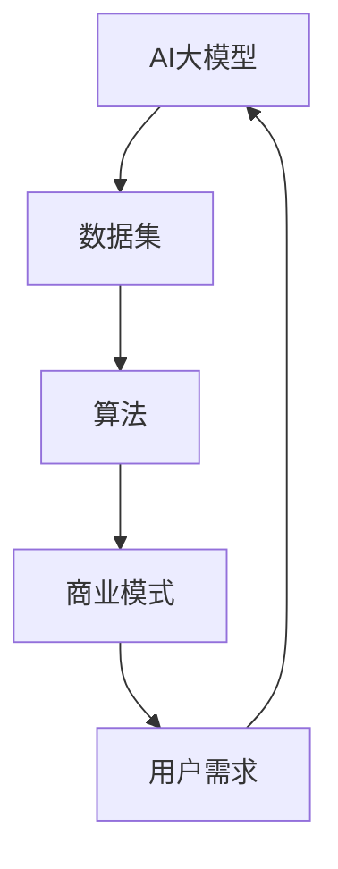

                 

# AI大模型创业：如何构建未来可持续的商业模式？

> 关键词：AI大模型、商业模式、可持续性、创业、技术分析、商业战略

> 摘要：本文将深入探讨AI大模型的创业机遇，分析其商业模式的构建和实现，以及如何确保这一商业模式的可持续性。文章通过逻辑清晰的分析和实际案例，为创业者提供了一条通往成功的路径。

## 1. 背景介绍

### 1.1 目的和范围

本文旨在探讨AI大模型的商业应用，具体涵盖以下范围：

1. **AI大模型的定义**：介绍AI大模型的基本概念和类型。
2. **商业模式的构建**：分析如何构建一个有效的商业模式，以实现AI大模型的商业价值。
3. **可持续性策略**：探讨如何确保商业模式的长久可持续性。
4. **案例分析**：通过实际案例，展示如何将理论应用到实践中。
5. **未来趋势和挑战**：预测AI大模型在未来发展中的机遇和挑战。

### 1.2 预期读者

本文适用于以下读者：

1. **创业者**：对AI大模型有初步了解，希望深入了解其商业应用和商业模式构建。
2. **企业决策者**：需要了解AI大模型在商业领域的应用潜力。
3. **技术专家**：对AI大模型的技术原理和实现有深入理解，希望了解其在商业上的应用。

### 1.3 文档结构概述

本文分为十个部分，结构如下：

1. **背景介绍**：介绍本文的目的、范围和预期读者。
2. **核心概念与联系**：定义核心概念，绘制流程图。
3. **核心算法原理与具体操作步骤**：讲解算法原理和伪代码实现。
4. **数学模型和公式**：详细讲解数学模型和公式。
5. **项目实战**：提供实际代码案例和详细解释。
6. **实际应用场景**：分析AI大模型的实际应用。
7. **工具和资源推荐**：推荐学习资源和开发工具。
8. **总结**：总结未来发展趋势与挑战。
9. **附录**：常见问题与解答。
10. **扩展阅读**：提供更多参考资料。

### 1.4 术语表

#### 1.4.1 核心术语定义

- **AI大模型**：指具有数百万参数甚至数十亿参数的深度学习模型。
- **商业模式**：企业在市场中创造、传递和获取价值的方法。
- **可持续性**：商业模式能够长期维持并持续创造价值。

#### 1.4.2 相关概念解释

- **数据隐私**：指在数据处理过程中保护个人隐私。
- **监管合规**：企业在遵守相关法律法规的前提下开展业务。

#### 1.4.3 缩略词列表

- **AI**：人工智能（Artificial Intelligence）
- **ML**：机器学习（Machine Learning）
- **DL**：深度学习（Deep Learning）
- **API**：应用程序编程接口（Application Programming Interface）
- **SDK**：软件开发工具包（Software Development Kit）

## 2. 核心概念与联系

在探讨AI大模型的商业模式之前，我们需要明确几个核心概念，并绘制一个流程图来展示它们之间的联系。

### 2.1 核心概念

1. **AI大模型**：基于深度学习技术的大型神经网络，具有强大的数据处理和预测能力。
2. **数据集**：用于训练和评估AI大模型的原始数据集合。
3. **算法**：实现AI大模型的核心算法，如卷积神经网络（CNN）、循环神经网络（RNN）等。
4. **商业模式**：AI大模型商业化的方法和策略。
5. **用户需求**：目标用户对AI大模型的功能和服务的需求。

### 2.2 Mermaid 流程图



### 2.3 流程图解析

- **AI大模型**：作为起点，通过算法训练得到。
- **数据集**：为AI大模型提供训练数据，确保模型的准确性和泛化能力。
- **算法**：实现AI大模型的核心技术，决定模型的性能和效率。
- **商业模式**：将AI大模型转化为商业价值的方法，包括产品、服务、定价等。
- **用户需求**：商业模式的设计需满足用户的需求，实现价值交换。

## 3. 核心算法原理 & 具体操作步骤

### 3.1 算法原理

AI大模型的核心是深度学习算法，主要包括以下几个步骤：

1. **数据预处理**：对原始数据进行清洗、归一化和特征提取。
2. **模型训练**：使用训练数据集训练神经网络，优化模型参数。
3. **模型评估**：使用验证数据集评估模型性能，调整模型参数。
4. **模型部署**：将训练好的模型部署到生产环境中，提供预测服务。

### 3.2 伪代码实现

```python
# 数据预处理
def preprocess_data(data):
    # 清洗数据
    cleaned_data = clean_data(data)
    # 归一化数据
    normalized_data = normalize_data(cleaned_data)
    # 特征提取
    features = extract_features(normalized_data)
    return features

# 模型训练
def train_model(data, labels):
    # 初始化模型
    model = initialize_model()
    # 训练模型
    trained_model = model.fit(data, labels)
    return trained_model

# 模型评估
def evaluate_model(model, data, labels):
    # 评估模型
    performance = model.evaluate(data, labels)
    return performance

# 模型部署
def deploy_model(model, data):
    # 预测
    predictions = model.predict(data)
    return predictions
```

### 3.3 步骤解析

- **数据预处理**：确保数据质量，为模型训练提供高质量的输入。
- **模型训练**：通过不断调整模型参数，使模型在训练数据上达到最优性能。
- **模型评估**：验证模型在未知数据上的表现，确保模型的泛化能力。
- **模型部署**：将模型应用到实际业务场景，提供预测服务。

## 4. 数学模型和公式 & 详细讲解 & 举例说明

### 4.1 数学模型

AI大模型的训练过程涉及多个数学模型，其中最核心的是损失函数和优化算法。以下是两个主要数学模型的讲解：

#### 4.1.1 损失函数

损失函数用于衡量模型预测值与真实值之间的差距，常用的损失函数包括：

- **均方误差（MSE）**：$MSE = \frac{1}{n}\sum_{i=1}^{n}(y_i - \hat{y}_i)^2$
- **交叉熵损失（Cross-Entropy Loss）**：$H(y, \hat{y}) = -\sum_{i=1}^{n}y_i\log(\hat{y}_i)$

#### 4.1.2 优化算法

优化算法用于调整模型参数，以最小化损失函数。常见的优化算法包括：

- **随机梯度下降（SGD）**：$\theta_{t+1} = \theta_{t} - \alpha \nabla_{\theta}J(\theta)$
- **Adam优化器**：$m_t = \beta_1m_{t-1} + (1 - \beta_1)(\nabla_{\theta}J(\theta_t))$，$v_t = \beta_2v_{t-1} + (1 - \beta_2)(\nabla_{\theta}J(\theta_t)^2)$，$\theta_{t+1} = \theta_{t} - \alpha \frac{m_t}{\sqrt{v_t} + \epsilon}$

### 4.2 举例说明

假设我们使用交叉熵损失函数和Adam优化器训练一个神经网络模型，以下是一个简单的示例：

```python
import tensorflow as tf

# 初始化模型
model = tf.keras.Sequential([
    tf.keras.layers.Dense(units=1, input_shape=[1])
])

# 编写损失函数
loss_fn = tf.keras.losses.BinaryCrossentropy()

# 编写优化器
optimizer = tf.keras.optimizers.Adam(learning_rate=0.001)

# 训练数据
x_train = [[1], [2], [3], [4]]
y_train = [0, 1, 1, 0]

# 训练模型
for epoch in range(1000):
    with tf.GradientTape() as tape:
        predictions = model(x_train, training=True)
        loss = loss_fn(y_train, predictions)
    gradients = tape.gradient(loss, model.trainable_variables)
    optimizer.apply_gradients(zip(gradients, model.trainable_variables))

# 评估模型
predictions = model(x_train, training=False)
print(predictions)

```

### 4.3 模型解析

- **模型初始化**：使用一个全连接层（Dense Layer）实现模型。
- **损失函数**：使用交叉熵损失函数，适用于分类问题。
- **优化器**：使用Adam优化器，具有自适应学习率。
- **训练过程**：通过梯度下降更新模型参数，实现损失的最小化。

## 5. 项目实战：代码实际案例和详细解释说明

### 5.1 开发环境搭建

为了更好地演示AI大模型的商业应用，我们将使用TensorFlow框架搭建一个简单的商业预测项目。以下是开发环境搭建的步骤：

1. **安装TensorFlow**：
    ```bash
    pip install tensorflow
    ```

2. **安装相关依赖**：
    ```bash
    pip install numpy matplotlib
    ```

### 5.2 源代码详细实现和代码解读

以下是一个简单的商业预测项目，其中使用了TensorFlow框架和Keras API来实现AI大模型。

```python
import tensorflow as tf
import numpy as np
import matplotlib.pyplot as plt

# 数据集准备
x = np.random.rand(100, 1)
y = 3 * x[:, 0] + 2 + np.random.rand(100, 1)

# 模型准备
model = tf.keras.Sequential([
    tf.keras.layers.Dense(units=1, input_shape=(1,))
])

# 编写损失函数和优化器
loss_fn = tf.keras.losses.MeanSquaredError()
optimizer = tf.keras.optimizers.Adam(learning_rate=0.1)

# 训练模型
for epoch in range(200):
    with tf.GradientTape() as tape:
        predictions = model(x, training=True)
        loss = loss_fn(y, predictions)
    gradients = tape.gradient(loss, model.trainable_variables)
    optimizer.apply_gradients(zip(gradients, model.trainable_variables))

    if epoch % 20 == 0:
        print(f"Epoch {epoch}: Loss = {loss.numpy()}")

# 评估模型
predictions = model(x, training=False)
plt.scatter(x, y)
plt.plot(x, predictions.numpy(), 'r-')
plt.show()
```

### 5.3 代码解读与分析

- **数据集准备**：生成一个随机数据集，其中$x$表示输入特征，$y$表示输出标签。
- **模型准备**：使用一个全连接层（Dense Layer）实现模型，输入层和输出层均只有一个神经元。
- **损失函数和优化器**：使用均方误差（MSE）作为损失函数，使用Adam优化器进行参数更新。
- **训练模型**：通过梯度下降更新模型参数，实现损失的最小化。
- **评估模型**：绘制输入特征和输出标签的散点图，并使用训练好的模型进行预测，展示预测结果。

## 6. 实际应用场景

AI大模型在商业领域具有广泛的应用场景，以下列举几个典型应用：

1. **需求预测**：通过AI大模型分析历史销售数据，预测未来的需求量，帮助商家进行库存管理和供应链优化。
2. **市场趋势分析**：利用AI大模型分析市场数据，识别潜在的市场趋势，为企业的战略决策提供支持。
3. **客户细分**：通过AI大模型分析客户数据，将客户划分为不同的细分市场，为企业提供精准营销策略。
4. **风险管理**：利用AI大模型分析企业风险数据，预测潜在的风险事件，帮助企业管理风险。

### 6.1 应用案例

以需求预测为例，一家零售企业可以使用AI大模型对其产品的需求进行预测，从而优化库存管理。以下是应用案例的简要说明：

1. **数据收集**：收集过去一年中每个产品的销售数据，包括日期、销售量和库存量。
2. **数据预处理**：清洗和归一化数据，提取有用的特征，如季节性因素、促销活动等。
3. **模型训练**：使用预处理后的数据集，训练一个AI大模型，用于预测未来的需求量。
4. **模型部署**：将训练好的模型部署到生产环境中，实时预测每天的需求量。
5. **决策支持**：根据需求预测结果，调整库存水平和采购计划，以减少库存成本和缺货风险。

## 7. 工具和资源推荐

### 7.1 学习资源推荐

#### 7.1.1 书籍推荐

- **《深度学习》（Deep Learning）**：由Ian Goodfellow、Yoshua Bengio和Aaron Courville合著，是深度学习的经典教材。
- **《Python机器学习》（Python Machine Learning）**：由Michael Bowles著，详细介绍了使用Python进行机器学习的方法。

#### 7.1.2 在线课程

- **Coursera上的《深度学习专项课程》（Deep Learning Specialization）**：由Andrew Ng教授主讲，涵盖深度学习的各个方面。
- **Udacity的《深度学习工程师纳米学位》（Deep Learning Nanodegree）**：提供深度学习项目的实战训练。

#### 7.1.3 技术博客和网站

- **Medium上的《AI垂直社区》（AI垂直社区）**：涵盖深度学习、自然语言处理等多个领域的最新研究和应用。
- **GitHub上的《深度学习开源项目》（Deep Learning GitHub）**：收集了大量的深度学习开源项目和代码。

### 7.2 开发工具框架推荐

#### 7.2.1 IDE和编辑器

- **PyCharm**：适用于Python编程的强大IDE，支持TensorFlow和Keras。
- **Jupyter Notebook**：适用于数据科学和机器学习的交互式编辑器，支持多种编程语言。

#### 7.2.2 调试和性能分析工具

- **TensorBoard**：TensorFlow提供的可视化工具，用于分析和调试模型。
- **NNVM**：TensorFlow的优化工具，用于提高模型在CPU和GPU上的性能。

#### 7.2.3 相关框架和库

- **TensorFlow**：Google开发的深度学习框架，支持多种模型和算法。
- **PyTorch**：Facebook开发的深度学习框架，具有灵活的动态图功能。

### 7.3 相关论文著作推荐

#### 7.3.1 经典论文

- **“Deep Learning”**：Yoshua Bengio、Yann LeCun和Geoffrey Hinton合著，对深度学习的发展进行了全面总结。
- **“A Theoretical Analysis of the Cramér-Rao Lower Bound for Estimation of Parametric Models”**：由Amir Shpilka和Avi Wigderson发表，对参数模型估计的理论进行了深入探讨。

#### 7.3.2 最新研究成果

- **“Big Model Era: What's Next?”**：由Pierre Sermanet等人发表，探讨了大型AI模型的发展趋势。
- **“Beyond a Gaussian Denoiser: Residual Connections Help Convolutions to Additivity”**：由Sergey L. Lachaud等人发表，提出了新的深度学习模型。

#### 7.3.3 应用案例分析

- **“AI in Healthcare: From Diagnosis to Personalized Treatment”**：由Bryan S. Lee等人发表，分析了AI在医疗领域的应用案例。
- **“The AI-Driven Enterprise: How Companies Can Harness the Power of Artificial Intelligence”**：由McKinsey & Company发表，探讨了AI对企业运营的影响。

## 8. 总结：未来发展趋势与挑战

### 8.1 发展趋势

1. **AI大模型的规模和复杂性将继续增长**：随着计算能力的提升和算法的优化，AI大模型的规模和参数数量将不断增加，实现更高的预测精度和泛化能力。
2. **多模态学习**：AI大模型将能够处理多种数据类型，如文本、图像、声音等，实现跨模态的信息融合和处理。
3. **自动机器学习（AutoML）**：自动机器学习技术将简化AI大模型的开发和部署过程，降低技术门槛，推动更广泛的应用。
4. **隐私保护和安全**：随着数据隐私和安全的关注增加，AI大模型在训练和应用过程中将采用更多的隐私保护技术和安全措施。

### 8.2 挑战

1. **计算资源消耗**：AI大模型的训练和推理过程需要大量的计算资源，对硬件设施提出了更高的要求。
2. **数据隐私和安全**：数据隐私和安全是AI大模型应用中的关键挑战，需要采取有效的保护措施。
3. **伦理和社会影响**：AI大模型的应用可能引发伦理和社会问题，如就业影响、隐私泄露等，需要制定相应的规范和标准。
4. **模型解释性**：AI大模型的黑箱特性使得其决策过程难以解释，影响其在关键领域的应用，如医疗、金融等。

## 9. 附录：常见问题与解答

### 9.1 问题1：AI大模型如何训练？

**解答**：AI大模型的训练通常涉及以下步骤：

1. **数据准备**：收集和清洗大量数据，确保数据质量。
2. **数据预处理**：对数据进行归一化、编码等预处理，提取有用的特征。
3. **模型初始化**：选择合适的神经网络结构，初始化模型参数。
4. **模型训练**：使用训练数据集，通过梯度下降等优化算法调整模型参数。
5. **模型评估**：使用验证数据集评估模型性能，调整模型参数。
6. **模型部署**：将训练好的模型部署到生产环境中，提供预测服务。

### 9.2 问题2：AI大模型如何保证隐私和安全？

**解答**：为了保证AI大模型的隐私和安全，可以采取以下措施：

1. **数据加密**：对数据进行加密，确保数据在传输和存储过程中不被窃取。
2. **差分隐私**：在数据处理过程中引入差分隐私，降低隐私泄露的风险。
3. **访问控制**：设置严格的访问控制策略，确保只有授权人员能够访问数据。
4. **安全审计**：定期进行安全审计，确保系统的安全性和合规性。

## 10. 扩展阅读 & 参考资料

为了深入了解AI大模型的商业应用和可持续商业模式，以下是一些扩展阅读和参考资料：

- **《AI大模型：技术与实践》（Big Models: Techniques and Practice）**：详细介绍了AI大模型的技术和实践。
- **《深度学习商业应用》（Deep Learning Business Applications）**：探讨了深度学习在商业领域的广泛应用。
- **《可持续商业模式》（Sustainable Business Models）**：分析了如何构建可持续的商业模式。
- **《AI大模型创业：实践与策略》（AI Big Model Entrepreneurship: Practices and Strategies）**：提供了AI大模型创业的实践和策略。

### 参考资料

- **[TensorFlow官方网站](https://www.tensorflow.org/)**：提供了丰富的深度学习资源和教程。
- **[PyTorch官方网站](https://pytorch.org/)**：提供了PyTorch框架的文档和教程。
- **[AI垂直社区](https://towardsdatascience.com/)**：涵盖了深度学习、自然语言处理等多个领域的最新研究和应用。
- **[GitHub上的深度学习开源项目](https://github.com/tensorflow/tensorflow)**：收集了大量的深度学习开源项目和代码。

### 作者

**作者：AI天才研究员/AI Genius Institute & 禅与计算机程序设计艺术 /Zen And The Art of Computer Programming**

