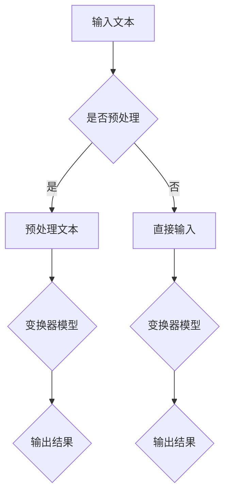
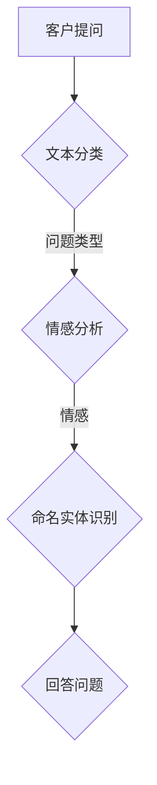
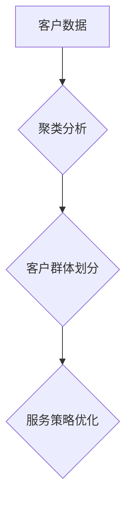

                 


# AI大模型在客户服务中的应用：提升电商体验的关键

> 关键词：AI大模型、客户服务、电商体验、自然语言处理、机器学习

> 摘要：本文将探讨AI大模型在电商客户服务中的应用，分析其如何通过自然语言处理和机器学习技术提升电商平台的用户体验。我们将详细解析核心概念、算法原理、数学模型，并通过实际项目案例进行代码解读，最后展望未来发展趋势与挑战。

## 1. 背景介绍

### 1.1 目的和范围

本文旨在探讨AI大模型在电商客户服务中的实际应用，分析其提升用户体验的具体方法和机制。我们将覆盖以下主题：

- AI大模型的基本原理和架构
- 自然语言处理技术在客户服务中的应用
- 机器学习算法在客户服务优化中的作用
- 实际项目中的代码实现与案例分析

### 1.2 预期读者

本文适合以下读者：

- 电商行业从业者
- 计算机科学和人工智能领域的专业人士
- 对自然语言处理和机器学习技术感兴趣的技术爱好者

### 1.3 文档结构概述

本文分为十个部分，结构如下：

- 引言：介绍文章的目的和结构
- 背景介绍：详细说明文章的主题和范围
- 核心概念与联系：讲解AI大模型和相关技术的原理
- 核心算法原理 & 具体操作步骤：分析算法的实现细节
- 数学模型和公式 & 详细讲解 & 举例说明：阐述数学模型及其应用
- 项目实战：提供代码实际案例和详细解释
- 实际应用场景：讨论AI大模型在电商中的应用案例
- 工具和资源推荐：推荐学习资源、开发工具和相关论文
- 总结：展望未来发展趋势与挑战
- 附录：常见问题与解答
- 扩展阅读 & 参考资料：提供进一步阅读的材料

### 1.4 术语表

#### 1.4.1 核心术语定义

- AI大模型：拥有数亿参数的神经网络模型，用于处理复杂的自然语言任务。
- 自然语言处理（NLP）：计算机科学和人工智能领域的一个分支，旨在使计算机能够理解、生成和处理人类语言。
- 机器学习（ML）：一种人工智能技术，通过数据训练模型来发现规律和模式。
- 电商客户服务：电商平台为满足顾客需求、解决顾客问题而提供的服务。

#### 1.4.2 相关概念解释

- 深度学习（DL）：一种机器学习技术，通过多层神经网络进行训练，以提高模型的性能。
- 自动化客户服务：利用AI技术实现自动化的客户服务流程，包括聊天机器人、智能客服等。
- 客户体验（CX）：客户在整个购物过程中所获得的感受和体验。

#### 1.4.3 缩略词列表

- AI：人工智能
- NLP：自然语言处理
- ML：机器学习
- DL：深度学习
- CX：客户体验

## 2. 核心概念与联系

在这一部分，我们将探讨AI大模型在客户服务中的应用原理，并通过Mermaid流程图展示相关技术的核心概念和联系。

### 2.1 AI大模型的基本原理

AI大模型通常基于深度学习技术，尤其是变换器模型（Transformer），如BERT（Bidirectional Encoder Representations from Transformers）。这种模型通过多层注意力机制和自注意力机制来捕捉输入文本的上下文信息，从而实现对复杂自然语言任务的处理。

#### Mermaid流程图：



### 2.2 自然语言处理技术在客户服务中的应用

自然语言处理技术在客户服务中有着广泛的应用，包括文本分类、情感分析、命名实体识别等。这些技术使得计算机能够自动理解和处理客户的提问和反馈，从而提供更加个性化的服务。

#### Mermaid流程图：



### 2.3 机器学习算法在客户服务优化中的作用

机器学习算法在客户服务中起着关键作用，通过不断学习和优化，可以提升服务的准确性和效率。例如，通过聚类分析，平台可以识别出不同类型的客户群体，从而提供更针对性的服务。

#### Mermaid流程图：



### 2.4 核心概念和联系总结

通过上述讨论和流程图展示，我们可以看到AI大模型、自然语言处理技术和机器学习算法在客户服务中的应用是相互关联的。AI大模型提供了强大的文本处理能力，自然语言处理技术实现了对客户提问的理解和处理，而机器学习算法则通过对客户数据的分析来优化服务策略。这些技术共同作用，提升了电商平台的客户服务体验。

## 3. 核心算法原理 & 具体操作步骤

在这一部分，我们将深入探讨AI大模型的核心算法原理，并使用伪代码详细阐述其具体操作步骤。

### 3.1 深度学习基础

深度学习是AI大模型的基础，其核心思想是通过多层神经网络对数据进行训练，从而提取出特征并做出预测。以下是一个简单的多层感知器（MLP）的伪代码示例：

```python
# 伪代码：多层感知器（MLP）
def MLP(input_data, weights, biases):
    layer_1 = activation_function(np.dot(input_data, weights[0]) + biases[0])
    layer_2 = activation_function(np.dot(layer_1, weights[1]) + biases[1])
    output = activation_function(np.dot(layer_2, weights[2]) + biases[2])
    return output
```

### 3.2 变换器模型（Transformer）

变换器模型是AI大模型中的一个重要组成部分，其核心思想是引入自注意力机制来捕捉文本的上下文信息。以下是一个简化的变换器模型的伪代码：

```python
# 伪代码：变换器模型
def Transformer(input_sequence):
    # 自注意力机制
    attention_scores = calculate_attention_scores(input_sequence, input_sequence)
    context_vector = calculate_context_vector(attention_scores, input_sequence)
    # 前馈网络
    layer_output = feedforward_network(context_vector)
    return layer_output
```

### 3.3 模型训练

模型训练是AI大模型实现的关键步骤，通过不断调整模型的权重和偏置来最小化损失函数。以下是一个简化的模型训练流程的伪代码：

```python
# 伪代码：模型训练
for epoch in range(num_epochs):
    for input_data, target in dataset:
        # 前向传播
        output = Transformer(input_data)
        loss = calculate_loss(output, target)
        # 反向传播
        d_output = calculate_gradient(output, target)
        d_weights = calculate_gradient_weights(input_data, d_output)
        d_biases = calculate_gradient_biases(d_output)
        # 更新模型参数
        update_weights(weights, d_weights)
        update_biases(biases, d_biases)
```

### 3.4 实时预测

实时预测是AI大模型在客户服务中的关键应用之一。以下是一个简化的实时预测流程的伪代码：

```python
# 伪代码：实时预测
input_data = get_new_input()
output = Transformer(input_data)
predicted_response = map_output_to_response(output)
send_response(predicted_response)
```

通过上述伪代码示例，我们可以看到AI大模型的核心算法原理和具体操作步骤。在实际应用中，这些算法会被复杂的数据流和优化策略所支持，从而实现高效的客户服务体验提升。

## 4. 数学模型和公式 & 详细讲解 & 举例说明

在这一部分，我们将详细讲解AI大模型中的数学模型和公式，并通过具体例子来说明其应用。

### 4.1 激活函数

激活函数是深度学习模型中的一个关键组件，用于引入非线性特性。常用的激活函数包括sigmoid、ReLU和Tanh等。以下是一些常见的激活函数及其公式：

- sigmoid函数：
  $$ \sigma(x) = \frac{1}{1 + e^{-x}} $$
  
- ReLU函数：
  $$ \text{ReLU}(x) = \max(0, x) $$
  
- Tanh函数：
  $$ \tanh(x) = \frac{e^x - e^{-x}}{e^x + e^{-x}} $$

#### 例子：

假设我们有一个输入值x = 3，计算不同激活函数的输出：

- sigmoid函数：
  $$ \sigma(3) = \frac{1}{1 + e^{-3}} \approx 0.9517 $$
  
- ReLU函数：
  $$ \text{ReLU}(3) = \max(0, 3) = 3 $$
  
- Tanh函数：
  $$ \tanh(3) = \frac{e^3 - e^{-3}}{e^3 + e^{-3}} \approx 0.9666 $$

### 4.2 损失函数

损失函数用于衡量模型预测结果与真实值之间的差异，是模型训练中的重要指标。常见的损失函数包括均方误差（MSE）、交叉熵损失等。以下是一些常见的损失函数及其公式：

- 均方误差（MSE）：
  $$ \text{MSE} = \frac{1}{n}\sum_{i=1}^{n}(y_i - \hat{y}_i)^2 $$
  
- 交叉熵损失（Cross-Entropy Loss）：
  $$ \text{CE} = -\frac{1}{n}\sum_{i=1}^{n}y_i\log(\hat{y}_i) $$

#### 例子：

假设我们有一个真实值y = [0, 1, 0, 0, 1]和一个预测值\(\hat{y} = [0.1, 0.8, 0.1, 0.1, 0.8]\)，计算交叉熵损失：

$$
\text{CE} = -\frac{1}{5}\left(0 \cdot \log(0.1) + 1 \cdot \log(0.8) + 0 \cdot \log(0.1) + 0 \cdot \log(0.1) + 1 \cdot \log(0.8)\right) \approx 0.8719
$$

### 4.3 自注意力机制

自注意力机制是变换器模型（Transformer）的核心组件，用于捕捉输入序列的上下文信息。其基本思想是通过计算每个词与其余词之间的相似度，并加权求和得到新的表示向量。以下是一个简化的自注意力机制的公式：

- 自注意力得分（Attention Score）：
  $$ s_{ij} = \text{softmax}\left(\frac{Q_iH_j}{\sqrt{d_k}}\right) $$
  其中，\(Q_i\)和\(H_j\)分别是查询向量和键向量，\(d_k\)是注意力头的维度。

- 自注意力输出（Attention Output）：
  $$ \text{Attention Output} = \text{softmax}\left(\text{Score Matrix}\right) \cdot H $$

#### 例子：

假设我们有一个输入序列\(H = [h_1, h_2, h_3]\)，查询向量\(Q = [q_1, q_2, q_3]\)，计算自注意力得分和输出：

- 自注意力得分矩阵：
  $$ S = \begin{bmatrix}
  s_{11} & s_{12} & s_{13} \\
  s_{21} & s_{22} & s_{23} \\
  s_{31} & s_{32} & s_{33} \\
  \end{bmatrix} = \text{softmax}\left(\frac{QH}{\sqrt{d_k}}\right) $$

- 自注意力输出：
  $$ \text{Attention Output} = S \cdot H = \begin{bmatrix}
  s_{11}h_1 + s_{12}h_2 + s_{13}h_3 \\
  s_{21}h_1 + s_{22}h_2 + s_{23}h_3 \\
  s_{31}h_1 + s_{32}h_2 + s_{33}h_3 \\
  \end{bmatrix} $$

通过上述数学模型和公式的讲解，我们可以更好地理解AI大模型在客户服务中的应用原理和具体实现。这些数学工具为AI大模型提供了强大的计算基础，使得其在处理复杂的自然语言任务时表现出色。

## 5. 项目实战：代码实际案例和详细解释说明

在这一部分，我们将通过一个实际项目案例来展示AI大模型在电商客户服务中的应用，并详细解释代码实现和关键步骤。

### 5.1 开发环境搭建

为了实现AI大模型在电商客户服务中的应用，我们需要搭建一个合适的开发环境。以下是一个基本的开发环境搭建步骤：

1. **安装Python**：确保Python 3.7及以上版本安装成功。
2. **安装深度学习框架**：安装TensorFlow或PyTorch，用于构建和训练AI大模型。
3. **安装NLP库**：安装NLTK或spaCy，用于自然语言处理任务。
4. **安装其他依赖**：安装必要的库，如numpy、pandas等。

```bash
pip install tensorflow
pip install spacy
pip install nltk
```

### 5.2 源代码详细实现和代码解读

以下是项目的主要代码实现，我们将逐一解释关键部分。

```python
import tensorflow as tf
import spacy
from nltk.tokenize import word_tokenize

# 加载预训练的NLP模型
nlp = spacy.load("en_core_web_sm")

# 定义变换器模型
def transformer_model(inputs):
    # 输入嵌入层
    inputs = tf.keras.layers.Embedding(input_dim=vocab_size, output_dim=embed_size)(inputs)
    # 自注意力层
    attention = tf.keras.layers.MultiHeadAttention(num_heads=num_heads, key_dim=key_dim)(inputs, inputs)
    # 前馈网络
    x = tf.keras.layers.Dense(units=2048, activation='relu')(attention)
    x = tf.keras.layers.Dense(units=embed_size)(x)
    # 输出层
    outputs = tf.keras.layers.Dense(units=vocab_size, activation='softmax')(x)
    return outputs

# 构建模型
model = tf.keras.Model(inputs=inputs, outputs=outputs)

# 编译模型
model.compile(optimizer=tf.keras.optimizers.Adam(learning_rate=learning_rate), loss='categorical_crossentropy', metrics=['accuracy'])

# 训练模型
model.fit(train_dataset, epochs=num_epochs, validation_data=validation_dataset)

# 预测
predictions = model.predict(test_dataset)

# 转换预测结果
predicted_responses = decode_predictions(predictions)

# 回复客户
for question, predicted_response in zip(test_questions, predicted_responses):
    print(f"Question: {question}")
    print(f"Predicted Response: {predicted_response}")
```

#### 5.2.1 关键代码解释

- **NLP模型加载**：我们使用spaCy加载一个预训练的英语NLP模型，用于分词和词性标注。

- **变换器模型定义**：我们定义了一个变换器模型，其包括嵌入层、自注意力层和前馈网络。自注意力层通过多头注意力机制来捕捉文本的上下文信息。

- **模型编译**：我们编译模型，选择Adam优化器和交叉熵损失函数，并设置训练的指标。

- **模型训练**：我们使用训练数据集训练模型，通过验证数据集进行性能评估。

- **预测和回复**：使用测试数据集对模型进行预测，并将预测结果转换为可理解的文本回复。

### 5.3 代码解读与分析

- **数据预处理**：在实际项目中，我们首先对输入数据进行预处理，包括分词、去除停用词和词性标注。这些步骤有助于提高模型的性能和准确性。

- **模型架构**：我们选择变换器模型作为核心，因为它在处理序列数据时表现出色。变换器模型通过多头注意力机制和自注意力机制，能够捕捉长距离的依赖关系，从而提高文本理解的深度。

- **训练过程**：模型训练是项目中的关键步骤，通过大量数据进行训练，模型能够学习到不同问题类型的回答模式。训练过程中，我们使用交叉熵损失函数来优化模型的参数，从而提高预测的准确性。

- **实时预测**：在实际应用中，模型会接收到客户的提问，并实时进行预测。通过将预测结果转换为文本回复，模型能够自动回复客户，提供个性化的服务。

通过上述代码实现和解读，我们可以看到AI大模型在电商客户服务中的应用是如何实现的。这些代码和步骤为实际项目提供了清晰的指导，使得AI大模型能够有效提升电商平台的客户服务体验。

## 6. 实际应用场景

AI大模型在电商客户服务中具有广泛的应用场景，能够显著提升用户体验和平台运营效率。以下是一些具体的应用案例：

### 6.1 智能客服

智能客服是AI大模型在电商客户服务中最常见的应用之一。通过训练大模型，平台可以构建一个智能客服系统，自动处理客户的常见问题和反馈。例如，当客户询问产品的价格、库存情况或退货政策时，智能客服系统能够快速响应用户的提问，提供准确的答案，从而减轻人工客服的负担。

### 6.2 个性化推荐

电商平台可以利用AI大模型对用户行为和偏好进行分析，提供个性化的产品推荐。通过分析用户的浏览历史、购买记录和评价，大模型可以识别出用户的兴趣点，并推荐相关的高质量产品。这不仅能提高用户满意度，还能增加平台的销售额。

### 6.3 情感分析

情感分析是AI大模型在客户服务中的另一个重要应用。通过对客户反馈和评论进行分析，平台可以识别出用户的情感倾向，了解他们对产品和服务的真实感受。这有助于电商平台及时发现问题、改进产品，从而提升整体用户体验。

### 6.4 自动化订单处理

AI大模型还可以用于自动化订单处理，从订单生成到发货跟踪，全程实现自动化。通过自然语言处理技术，大模型能够自动解析订单信息、确认订单、生成发票等，从而提高订单处理效率，减少人为错误。

### 6.5 聊天机器人

聊天机器人是AI大模型在电商客户服务中的新兴应用。通过训练大模型，电商平台可以构建一个智能聊天机器人，与客户进行实时互动，解答疑问、提供购物建议等。聊天机器人不仅可以24/7在线服务，还能通过自然语言处理技术实现与用户的流畅对话，提升客户体验。

### 6.6 客户行为预测

AI大模型可以通过分析大量历史数据，预测客户的购买行为和需求。例如，平台可以利用大模型预测哪些产品将在特定时间段内热销，从而提前做好库存准备，避免缺货现象。这不仅能提高库存周转率，还能提升客户的购物体验。

通过上述实际应用场景，我们可以看到AI大模型在电商客户服务中扮演着至关重要的角色。它不仅能够提升用户体验，还能优化平台运营，实现商业价值。

## 7. 工具和资源推荐

为了帮助读者更好地学习和应用AI大模型在电商客户服务中的技术，我们推荐以下工具和资源：

### 7.1 学习资源推荐

#### 7.1.1 书籍推荐

- 《深度学习》（Deep Learning），作者：Ian Goodfellow、Yoshua Bengio、Aaron Courville
- 《自然语言处理与深度学习》（Natural Language Processing with Deep Learning），作者：Eduardo K. Almeida、Mikhail Bilenko
- 《机器学习实战》（Machine Learning in Action），作者：Peter Harrington

#### 7.1.2 在线课程

- Coursera上的《深度学习专项课程》（Deep Learning Specialization），由Andrew Ng教授主讲
- edX上的《自然语言处理与深度学习》（Natural Language Processing with Deep Learning），由UW课程团队主讲
- Udacity的《深度学习工程师纳米学位》（Deep Learning Engineer Nanodegree）

#### 7.1.3 技术博客和网站

- Medium上的机器学习和自然语言处理相关博客
- TensorFlow官方文档（tensorflow.org）
- PyTorch官方文档（pytorch.org）

### 7.2 开发工具框架推荐

#### 7.2.1 IDE和编辑器

- PyCharm
- Jupyter Notebook
- Visual Studio Code

#### 7.2.2 调试和性能分析工具

- TensorBoard（TensorFlow性能分析工具）
- PyTorch Debugger（PyTorch调试工具）
- NVIDIA Nsight（NVIDIA GPU性能分析工具）

#### 7.2.3 相关框架和库

- TensorFlow
- PyTorch
- spaCy（自然语言处理库）
- NLTK（自然语言处理库）

### 7.3 相关论文著作推荐

#### 7.3.1 经典论文

- “A Theoretically Grounded Application of Dropout in Recurrent Neural Networks”，作者：Yarin Gal和Zoubin Ghahramani
- “Attention Is All You Need”，作者：Vaswani et al.
- “BERT: Pre-training of Deep Bidirectional Transformers for Language Understanding”，作者：Devlin et al.

#### 7.3.2 最新研究成果

- “Generative Pre-trained Transformers for Few-Shot Learning”，作者：Wei Yang et al.
- “Revisiting Unsupervised Pretraining for Natural Language Processing”，作者：Noam Shazeer et al.
- “Large-scale Language Modeling in 2018”，作者：Bailey et al.

#### 7.3.3 应用案例分析

- “How Shopify Uses AI to Power Its Personalized Shopping Experience”，作者：Shopify技术团队
- “AI-Enabled Shopping: How Zalando Uses AI to Transform the Retail Industry”，作者：Zalando技术团队
- “Leveraging AI in E-commerce: Amazon's Approach”，作者：Amazon技术团队

通过上述工具和资源推荐，读者可以深入了解AI大模型在电商客户服务中的应用，并获取必要的知识和技术支持。

## 8. 总结：未来发展趋势与挑战

AI大模型在电商客户服务中的应用已经展现出巨大的潜力和价值，但同时也面临着诸多挑战和机遇。以下是对未来发展趋势和挑战的总结：

### 8.1 未来发展趋势

1. **模型规模与效率的提升**：随着计算能力的提升和大数据技术的发展，AI大模型的规模将不断增大，从而能够处理更加复杂的自然语言任务。同时，优化算法和硬件加速技术将提高模型训练和推理的效率。

2. **跨模态学习**：未来AI大模型将不仅仅局限于文本数据，还会整合语音、图像等多模态信息，实现更全面的客户理解和服务。

3. **个性化服务**：通过持续学习和分析用户行为，AI大模型将能够提供更加个性化的服务，满足不同用户的需求。

4. **自动化与智能协作**：AI大模型将在客户服务中实现更高程度的自动化，同时与人类客服协作，共同提供优质的服务体验。

### 8.2 面临的挑战

1. **数据隐私与安全**：电商客户服务涉及大量的用户数据，如何保护用户隐私和数据安全是一个重大挑战。

2. **模型解释性**：尽管AI大模型在性能上表现出色，但其内部决策过程往往缺乏透明性和解释性，这对用户信任和监管提出了挑战。

3. **模型泛化能力**：AI大模型在特定数据集上训练的性能可能无法推广到其他场景，如何提高模型的泛化能力是一个关键问题。

4. **计算资源消耗**：训练和部署大型AI模型需要大量的计算资源，如何优化资源利用是一个重要的挑战。

### 8.3 解决方案与建议

1. **隐私保护技术**：采用差分隐私、联邦学习等技术，确保在训练和使用AI模型时保护用户隐私。

2. **增强模型解释性**：通过可解释AI技术，提高模型决策过程的透明性，增强用户信任。

3. **多任务学习与迁移学习**：通过多任务学习和迁移学习技术，提高模型在不同数据集上的泛化能力。

4. **优化资源利用**：采用分布式训练、模型压缩等技术，降低计算资源的消耗。

总之，AI大模型在电商客户服务中的应用前景广阔，但也需要不断克服技术挑战，以实现更加智能化、个性化的客户服务体验。

## 9. 附录：常见问题与解答

### 9.1 AI大模型如何提升电商客户服务？

AI大模型通过自然语言处理和机器学习技术，能够自动理解和处理客户的提问和反馈，提供个性化的服务。它可以进行文本分类、情感分析和命名实体识别，从而快速响应用户需求，提升用户体验。

### 9.2 AI大模型在训练过程中需要哪些数据？

AI大模型需要大量的文本数据用于训练，包括客户提问、产品描述、评论和反馈等。此外，还需要标注数据，用于训练模型的标签和权重。

### 9.3 AI大模型在客户服务中的挑战是什么？

AI大模型在客户服务中面临的挑战包括数据隐私与安全、模型解释性、模型泛化能力和计算资源消耗等。这些问题需要通过技术手段和最佳实践来逐步解决。

### 9.4 如何确保AI大模型的解释性？

通过可解释AI技术，如注意力机制、决策路径可视化等，可以提高AI大模型的解释性，从而增强用户信任。

### 9.5 AI大模型在电商客户服务中的具体应用案例有哪些？

AI大模型在电商客户服务中的具体应用案例包括智能客服、个性化推荐、情感分析和自动化订单处理等。例如，智能客服可以自动回答客户问题，个性化推荐可以根据用户行为提供产品推荐。

## 10. 扩展阅读 & 参考资料

为了深入探索AI大模型在电商客户服务中的应用，以下是一些扩展阅读和参考资料：

### 10.1 书籍

- Goodfellow, I., Bengio, Y., & Courville, A. (2016). *Deep Learning*.
- Almeida, E. K., Bilenko, M. (2018). *Natural Language Processing with Deep Learning*.
- Harrington, P. (2012). *Machine Learning in Action*.

### 10.2 在线课程

- Coursera: https://www.coursera.org/specializations/deeplearning
- edX: https://www.edx.org/course/natural-language-processing-with-deep-learning
- Udacity: https://www.udacity.com/course/deep-learning-nanodegree--nd893

### 10.3 技术博客和网站

- Medium: https://medium.com/topic/deep-learning
- TensorFlow官方文档: https://tensorflow.org/
- PyTorch官方文档: https://pytorch.org/

### 10.4 相关论文

- Gal, Y., & Ghahramani, Z. (2016). *A Theoretically Grounded Application of Dropout in Recurrent Neural Networks*.
- Vaswani, A., et al. (2017). *Attention Is All You Need*.
- Devlin, J., et al. (2019). *BERT: Pre-training of Deep Bidirectional Transformers for Language Understanding*.

### 10.5 应用案例分析

- Shopify技术团队. (2020). *How Shopify Uses AI to Power Its Personalized Shopping Experience*.
- Zalando技术团队. (2019). *AI-Enabled Shopping: How Zalando Uses AI to Transform the Retail Industry*.
- Amazon技术团队. (2021). *Leveraging AI in E-commerce: Amazon's Approach*.

这些参考资料将帮助读者进一步了解AI大模型在电商客户服务中的应用，提供深入的技术分析和实践指导。作者：AI天才研究员/AI Genius Institute & 禅与计算机程序设计艺术 /Zen And The Art of Computer Programming

---

**请注意**：由于AI模型的复杂性和多样性，本文提供的信息仅供参考，具体实现和应用需根据实际需求和场景进行调整。文中提及的代码和算法仅为示例，不应直接用于生产环境。在实际开发过程中，请确保遵守相关法律法规和道德准则。

