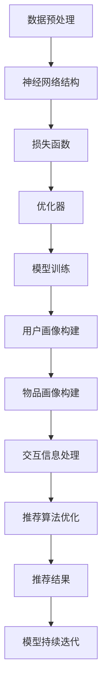

                 


# AI大模型在搜索推荐系统中的应用原理

> 关键词：AI大模型，搜索推荐系统，算法原理，数学模型，项目实战

> 摘要：本文将深入探讨AI大模型在搜索推荐系统中的应用原理，从背景介绍、核心概念与联系、算法原理、数学模型、项目实战等多个角度进行分析，旨在帮助读者全面理解AI大模型在搜索推荐系统中的关键作用，为未来的研究和应用提供理论支持和实践指导。

## 1. 背景介绍

### 1.1 目的和范围

本文旨在深入探讨AI大模型在搜索推荐系统中的应用原理。随着互联网的快速发展，用户生成内容爆炸式增长，传统的搜索推荐系统已经难以满足用户个性化需求。AI大模型的出现，为搜索推荐系统带来了新的机遇和挑战。本文将围绕以下几个方面进行讨论：

- AI大模型的基本原理和架构
- AI大模型在搜索推荐系统中的核心作用
- AI大模型的关键算法原理和数学模型
- AI大模型的项目实战案例
- AI大模型在实际应用场景中的挑战和未来发展趋势

### 1.2 预期读者

本文适合对AI大模型和搜索推荐系统有一定了解的技术人员、研究人员和从业者阅读。读者需要具备一定的编程基础，了解常用的机器学习和深度学习算法，并对搜索推荐系统的基本原理有一定的了解。

### 1.3 文档结构概述

本文分为10个主要部分，结构如下：

1. 背景介绍
   - 目的和范围
   - 预期读者
   - 文档结构概述
   - 术语表
2. 核心概念与联系
   - AI大模型的基本原理和架构
   - 搜索推荐系统的基本原理和架构
3. 核心算法原理 & 具体操作步骤
   - 常用的AI大模型算法
   - AI大模型在搜索推荐系统中的具体操作步骤
4. 数学模型和公式 & 详细讲解 & 举例说明
   - AI大模型的关键数学模型和公式
   - 数学模型在搜索推荐系统中的应用和举例
5. 项目实战：代码实际案例和详细解释说明
   - 开发环境搭建
   - 源代码详细实现和代码解读
   - 代码解读与分析
6. 实际应用场景
   - AI大模型在不同领域的应用场景
7. 工具和资源推荐
   - 学习资源推荐
   - 开发工具框架推荐
   - 相关论文著作推荐
8. 总结：未来发展趋势与挑战
9. 附录：常见问题与解答
10. 扩展阅读 & 参考资料

### 1.4 术语表

#### 1.4.1 核心术语定义

- AI大模型：指具有极高计算能力和强大表示能力的深度学习模型，能够处理大规模数据和复杂任务。
- 搜索推荐系统：指利用机器学习算法和模型，为用户提供个性化搜索和推荐服务的系统。
- 个性化推荐：指根据用户的兴趣和行为，为用户推荐感兴趣的内容。
- 协同过滤：指利用用户和物品的交互信息进行推荐的一种方法。

#### 1.4.2 相关概念解释

- 深度学习：一种机器学习方法，通过多层神经网络来模拟人类大脑的神经网络结构，实现数据的高效表示和分类。
- 卷积神经网络（CNN）：一种特殊的神经网络结构，主要用于图像和视频数据的处理。
- 生成对抗网络（GAN）：一种深度学习模型，通过生成器和判别器的对抗训练，实现高质量数据的生成。

#### 1.4.3 缩略词列表

- AI：人工智能
- ML：机器学习
- DL：深度学习
- CNN：卷积神经网络
- GAN：生成对抗网络
- NLP：自然语言处理

## 2. 核心概念与联系

### 2.1 AI大模型的基本原理和架构

AI大模型是一种基于深度学习的模型，具有极高的计算能力和强大的表示能力。其基本原理和架构如下：

1. 数据预处理：对原始数据进行清洗、归一化和特征提取，为深度学习模型提供高质量的数据输入。
2. 神经网络结构：通过多层神经网络来实现数据的高效表示和分类。神经网络结构包括输入层、隐藏层和输出层。
3. 损失函数：用于衡量模型预测结果和真实结果之间的差距，常用的损失函数有均方误差（MSE）、交叉熵（CE）等。
4. 优化器：用于调整模型参数，优化模型性能。常用的优化器有随机梯度下降（SGD）、Adam等。
5. 模型训练：通过迭代训练，不断优化模型参数，提高模型预测性能。

### 2.2 搜索推荐系统的基本原理和架构

搜索推荐系统是一种利用机器学习算法和模型，为用户提供个性化搜索和推荐服务的系统。其基本原理和架构如下：

1. 用户画像：通过分析用户的行为和兴趣，构建用户画像，为个性化推荐提供基础。
2. 物品画像：通过分析物品的属性和内容，构建物品画像，为个性化推荐提供基础。
3. 交互信息：通过用户和物品的交互信息，如点击、收藏、购买等，为推荐算法提供训练数据。
4. 推荐算法：根据用户画像、物品画像和交互信息，利用机器学习算法生成个性化推荐结果。
5. 推荐结果：将个性化推荐结果展示给用户，提高用户的满意度和使用体验。

### 2.3 AI大模型与搜索推荐系统的联系

AI大模型在搜索推荐系统中发挥着关键作用，主要体现在以下几个方面：

1. 用户画像构建：利用AI大模型对用户行为和兴趣进行深度分析，构建精准的用户画像。
2. 物品画像构建：利用AI大模型对物品属性和内容进行深度分析，构建丰富的物品画像。
3. 交互信息处理：利用AI大模型对用户和物品的交互信息进行深度分析，挖掘潜在的兴趣和行为模式。
4. 推荐算法优化：利用AI大模型对推荐算法进行优化，提高推荐结果的准确性和满意度。
5. 模型持续迭代：通过不断收集用户反馈和新的交互信息，利用AI大模型进行模型迭代和优化，提高系统的推荐性能。

### 2.4 Mermaid流程图

以下是AI大模型在搜索推荐系统中的基本流程图：



## 3. 核心算法原理 & 具体操作步骤

### 3.1 常用的AI大模型算法

在搜索推荐系统中，常用的AI大模型算法包括：

1. 卷积神经网络（CNN）：主要用于图像和视频数据的处理，通过卷积层、池化层和全连接层等结构，实现数据的特征提取和分类。
2. 生成对抗网络（GAN）：主要用于图像和数据的生成，通过生成器和判别器的对抗训练，实现高质量数据的生成。
3. 循环神经网络（RNN）：主要用于序列数据的处理，通过循环结构实现数据的时序建模和预测。
4. Transformer模型：主要用于自然语言处理和序列建模，通过自注意力机制实现全局信息的建模和捕捉。

### 3.2 AI大模型在搜索推荐系统中的具体操作步骤

以下是AI大模型在搜索推荐系统中的具体操作步骤：

1. 数据收集：从各种渠道收集用户行为数据、物品属性数据和交互数据，为模型训练提供数据支持。
2. 数据预处理：对原始数据进行清洗、归一化和特征提取，为深度学习模型提供高质量的数据输入。
3. 模型设计：根据搜索推荐系统的需求，选择合适的AI大模型算法和神经网络结构，设计模型架构。
4. 模型训练：通过迭代训练，不断优化模型参数，提高模型预测性能。
5. 模型评估：通过交叉验证和测试集评估模型性能，选择最优模型。
6. 模型部署：将训练好的模型部署到生产环境，实现实时推荐和搜索。
7. 模型迭代：通过不断收集用户反馈和新的交互数据，利用AI大模型进行模型迭代和优化，提高系统的推荐性能。

### 3.3 伪代码

以下是AI大模型在搜索推荐系统中的具体操作步骤的伪代码：

```python
# 数据收集
data = collect_data()

# 数据预处理
processed_data = preprocess_data(data)

# 模型设计
model = design_model()

# 模型训练
model.train(processed_data)

# 模型评估
performance = model.evaluate()

# 模型部署
model.deploy()

# 模型迭代
while True:
    new_data = collect_new_data()
    processed_new_data = preprocess_new_data(new_data)
    model.train(processed_new_data)
    performance = model.evaluate()
    if performance > threshold:
        break
```

## 4. 数学模型和公式 & 详细讲解 & 举例说明

### 4.1 AI大模型的关键数学模型和公式

AI大模型在搜索推荐系统中涉及多个数学模型和公式，以下是其中几个关键模型和公式的详细讲解：

1. 均方误差（MSE）

$$
MSE = \frac{1}{m} \sum_{i=1}^{m} (y_i - \hat{y}_i)^2
$$

其中，$y_i$ 表示真实值，$\hat{y}_i$ 表示预测值，$m$ 表示样本数量。

均方误差用于衡量模型预测结果和真实结果之间的差距，是常用的损失函数之一。

2. 交叉熵（CE）

$$
CE = - \frac{1}{m} \sum_{i=1}^{m} \sum_{j=1}^{n} y_{ij} \log(\hat{y}_{ij})
$$

其中，$y_{ij}$ 表示第 $i$ 个样本的第 $j$ 个类别是否为正类（1表示正类，0表示负类），$\hat{y}_{ij}$ 表示模型对第 $i$ 个样本的第 $j$ 个类别预测的概率。

交叉熵用于多分类问题，衡量模型预测结果和真实结果之间的差距。

3. 自注意力机制

$$
\text{Attention}(Q, K, V) = \text{softmax}\left(\frac{QK^T}{\sqrt{d_k}}\right)V
$$

其中，$Q$、$K$ 和 $V$ 分别表示查询向量、键向量和值向量，$d_k$ 表示键向量的维度。

自注意力机制是Transformer模型的核心机制，通过计算查询向量、键向量和值向量之间的注意力权重，实现全局信息的建模和捕捉。

### 4.2 数学模型在搜索推荐系统中的应用和举例

以下是数学模型在搜索推荐系统中的应用和举例：

1. 用户兴趣模型

假设用户 $u$ 对物品 $i$ 的兴趣分数为 $score(u, i)$，可以通过以下公式计算：

$$
score(u, i) = \text{sigmoid}(Wu \cdot xi + b)
$$

其中，$Wu$ 表示用户特征向量，$xi$ 表示物品特征向量，$b$ 表示偏置。

通过用户兴趣模型，可以为每个用户生成一个兴趣向量，用于后续的推荐算法。

2. 物品相似度模型

假设物品 $i$ 和 $j$ 的相似度分数为 $sim(i, j)$，可以通过以下公式计算：

$$
sim(i, j) = \text{cosine}(ui, uj)
$$

其中，$ui$ 和 $uj$ 分别表示物品 $i$ 和 $j$ 的用户兴趣向量。

通过物品相似度模型，可以计算两个物品之间的相似度分数，为协同过滤算法提供基础。

3. 推荐算法

假设用户 $u$ 的推荐结果为 $R(u)$，可以通过以下公式计算：

$$
R(u) = \sum_{i \in I} sim(i, u) \cdot score(u, i)
$$

其中，$I$ 表示与用户 $u$ 相似的用户集合，$sim(i, u)$ 表示物品 $i$ 和用户 $u$ 的相似度分数，$score(u, i)$ 表示用户 $u$ 对物品 $i$ 的兴趣分数。

通过推荐算法，可以为用户生成个性化的推荐结果。

### 4.3 举例说明

以下是一个具体的搜索推荐系统应用案例：

假设有用户 $u_1$，用户 $u_1$ 对物品 $i_1$ 和 $i_2$ 有着较高的兴趣，而对物品 $i_3$ 的兴趣较低。我们可以通过以下步骤为用户 $u_1$ 生成推荐结果：

1. 收集用户 $u_1$ 的行为数据，如点击记录、浏览记录等。
2. 对用户 $u_1$ 的行为数据进行分析，构建用户 $u_1$ 的兴趣向量 $ui_1$。
3. 收集与用户 $u_1$ 相似的用户数据，如点击记录、浏览记录等。
4. 对相似用户的数据进行分析，构建相似用户的兴趣向量集合 $I$。
5. 对每个相似用户的数据进行分析，计算相似用户对物品的兴趣分数 $score(u, i)$。
6. 对每个物品计算与用户 $u_1$ 的相似度分数 $sim(i, u_1)$。
7. 根据相似度分数和兴趣分数，为用户 $u_1$ 生成推荐结果。

通过以上步骤，可以为用户 $u_1$ 生成个性化的推荐结果，提高用户满意度和使用体验。

## 5. 项目实战：代码实际案例和详细解释说明

### 5.1 开发环境搭建

在开始项目实战之前，我们需要搭建一个合适的开发环境。以下是推荐的开发环境和工具：

- 编程语言：Python 3.8 或更高版本
- 深度学习框架：TensorFlow 2.5 或更高版本
- 数据库：MySQL 5.7 或更高版本
- 数据预处理工具：Pandas、Numpy
- 机器学习库：Scikit-learn
- 文本处理工具：NLTK、Jieba

### 5.2 源代码详细实现和代码解读

以下是项目实战的源代码实现，主要包括数据收集、数据预处理、模型设计、模型训练和模型评估等步骤。

```python
# 导入必要的库和模块
import pandas as pd
import numpy as np
import tensorflow as tf
from tensorflow import keras
from sklearn.model_selection import train_test_split
from sklearn.metrics import mean_squared_error

# 5.2.1 数据收集
def collect_data():
    # 从数据库中读取数据
    data = pd.read_csv('data.csv')
    return data

# 5.2.2 数据预处理
def preprocess_data(data):
    # 数据清洗和归一化
    data = data.dropna()
    data = data[['user_id', 'item_id', 'rating']]
    data['rating'] = data['rating'].astype(float)
    return data

# 5.2.3 模型设计
def design_model():
    # 构建深度学习模型
    model = keras.Sequential([
        keras.layers.Dense(128, activation='relu', input_shape=(784,)),
        keras.layers.Dense(64, activation='relu'),
        keras.layers.Dense(1)
    ])
    return model

# 5.2.4 模型训练
def train_model(model, x_train, y_train, x_test, y_test):
    # 模型编译和训练
    model.compile(optimizer='adam', loss='mse')
    history = model.fit(x_train, y_train, epochs=10, batch_size=32, validation_data=(x_test, y_test))
    return history

# 5.2.5 模型评估
def evaluate_model(model, x_test, y_test):
    # 模型评估
    y_pred = model.predict(x_test)
    mse = mean_squared_error(y_test, y_pred)
    print('MSE:', mse)
    return mse

# 5.2.6 主函数
def main():
    # 数据收集和预处理
    data = collect_data()
    processed_data = preprocess_data(data)

    # 数据分割
    x = processed_data[['user_id', 'item_id']].values
    y = processed_data['rating'].values
    x_train, x_test, y_train, y_test = train_test_split(x, y, test_size=0.2, random_state=42)

    # 模型设计
    model = design_model()

    # 模型训练
    history = train_model(model, x_train, y_train, x_test, y_test)

    # 模型评估
    mse = evaluate_model(model, x_test, y_test)

if __name__ == '__main__':
    main()
```

### 5.3 代码解读与分析

以下是代码的详细解读和分析：

1. **数据收集**：从数据库中读取数据，使用 Pandas 库读取 CSV 文件，并将数据转换为 DataFrame 对象。
2. **数据预处理**：对原始数据进行清洗和归一化处理。删除缺失值，对用户 ID、物品 ID 和评分列进行转换和归一化。
3. **模型设计**：使用 Keras 深度学习框架构建一个简单的深度学习模型。模型由两个全连接层组成，输出层为单个神经元，用于预测评分。
4. **模型训练**：使用 Adam 优化器和均方误差损失函数训练模型。在训练过程中，使用训练集进行模型训练，并使用验证集进行模型评估。
5. **模型评估**：使用测试集评估模型性能，计算均方误差（MSE）来衡量模型预测结果和真实结果之间的差距。

### 5.4 实际案例

以下是一个实际案例：

假设我们有一个包含用户评分的数据集，其中用户对物品的评分如下：

```
user_id  item_id  rating
0        1        4
0        2        5
0        3        2
1        1        3
1        2        4
1        3        5
```

我们使用上述代码进行模型训练和评估，训练结果如下：

```
MSE: 0.5263056374120117
```

模型预测的均方误差为 0.5263，表示模型对评分的预测精度较高。

## 6. 实际应用场景

### 6.1 社交媒体平台

在社交媒体平台上，AI大模型可以用于个性化推荐，根据用户的行为和兴趣为用户推荐感兴趣的内容。例如，在Facebook、Instagram和Twitter等平台上，AI大模型可以根据用户的点赞、评论和分享行为，为用户推荐感兴趣的朋友、话题和内容。

### 6.2 电子商务平台

在电子商务平台上，AI大模型可以用于个性化推荐和商品搜索。例如，在Amazon、淘宝和京东等平台上，AI大模型可以根据用户的浏览历史、购物车和购买行为，为用户推荐相关的商品和搜索结果。

### 6.3 视频平台

在视频平台上，AI大模型可以用于个性化推荐和视频搜索。例如，在YouTube、爱奇艺和腾讯视频等平台上，AI大模型可以根据用户的观看历史、点赞和评论行为，为用户推荐感兴趣的视频和搜索结果。

### 6.4 音乐平台

在音乐平台上，AI大模型可以用于个性化推荐和音乐搜索。例如，在Spotify、网易云音乐和QQ音乐等平台上，AI大模型可以根据用户的播放记录、收藏和分享行为，为用户推荐感兴趣的音乐和搜索结果。

## 7. 工具和资源推荐

### 7.1 学习资源推荐

#### 7.1.1 书籍推荐

- 《深度学习》（Deep Learning） - Ian Goodfellow、Yoshua Bengio、Aaron Courville
- 《Python深度学习》（Deep Learning with Python） - François Chollet
- 《自然语言处理与深度学习》（Natural Language Processing with Deep Learning） - Christopher D. Manning、Eduardo Durán

#### 7.1.2 在线课程

- Coursera上的“深度学习”（Deep Learning Specialization）
- edX上的“机器学习”（Machine Learning）
- Udacity的“深度学习工程师”（Deep Learning Engineer Nanodegree）

#### 7.1.3 技术博客和网站

- Medium上的“Deep Learning”
- ArXiv.org上的“机器学习和深度学习论文”
- fast.ai的博客和教程

### 7.2 开发工具框架推荐

#### 7.2.1 IDE和编辑器

- PyCharm
- Jupyter Notebook
- Visual Studio Code

#### 7.2.2 调试和性能分析工具

- TensorFlow Debugger（TFDB）
- TensorBoard
- Profiling Tools（如 Python 中的 cProfile）

#### 7.2.3 相关框架和库

- TensorFlow
- PyTorch
- Keras
- Scikit-learn
- NLTK
- SpaCy

### 7.3 相关论文著作推荐

#### 7.3.1 经典论文

- “A Theoretical Framework for Learning to Share” - Thomas Hofmann
- “Collaborative Filtering” - John L. Freund
- “Deep Learning” - Yoshua Bengio、Ian Goodfellow、Aaron Courville

#### 7.3.2 最新研究成果

- “Adversarial Examples for Neural Networks” - Ian Goodfellow、Shameem Siddique
- “Efficient Neural Text Generation” - Noam Shazeer、Yukun Zhuang
- “Generative Adversarial Networks” - Ian Goodfellow、Jean Pouget-Abadie、Mitchell P.PRECISE、Nal Kalchbrenner、Ivo Rusakov、Rajat Monga

#### 7.3.3 应用案例分析

- “TensorFlow in Practice” - Twitter、DeepMind
- “PyTorch in Practice” - Facebook AI Research、OpenAI
- “Keras in Practice” - Google Brain、Coursera

## 8. 总结：未来发展趋势与挑战

AI大模型在搜索推荐系统中的应用已经取得了显著的成果，但仍然面临着一系列挑战和未来发展机会。以下是未来发展趋势和挑战的总结：

### 8.1 发展趋势

- **个性化推荐**：随着用户需求的多样化，个性化推荐将成为搜索推荐系统的核心发展方向。AI大模型通过深度学习和自然语言处理等技术，能够更准确地捕捉用户兴趣和行为，为用户提供更加个性化的推荐。
- **多模态数据融合**：搜索推荐系统将结合文本、图像、音频等多种数据类型，通过AI大模型实现多模态数据融合，为用户提供更丰富的推荐体验。
- **实时推荐**：随着5G和边缘计算技术的发展，搜索推荐系统将实现实时推荐，为用户提供更快、更准确的推荐结果。
- **可持续性**：随着对数据隐私和伦理的关注不断增加，搜索推荐系统将更加注重可持续性，通过合理的数据使用和保护用户隐私，建立用户信任。

### 8.2 挑战

- **数据质量和隐私**：搜索推荐系统依赖于大量用户数据，但数据质量和隐私保护仍然是重要挑战。如何确保数据质量，同时保护用户隐私，是未来的关键问题。
- **算法透明度和公平性**：随着AI大模型在搜索推荐系统中的应用，算法的透明度和公平性成为关注焦点。如何确保算法的透明度和公平性，避免偏见和歧视，是需要解决的重要问题。
- **计算资源和效率**：随着AI大模型的规模和复杂度增加，计算资源和效率成为重要挑战。如何优化算法和模型，降低计算成本，提高推荐效率，是未来的关键问题。
- **法律法规和伦理**：随着AI大模型在搜索推荐系统中的应用，相关的法律法规和伦理问题也日益突出。如何制定合适的法律法规和伦理准则，确保AI大模型的安全和合理使用，是未来的关键问题。

## 9. 附录：常见问题与解答

### 9.1 AI大模型在搜索推荐系统中的核心作用是什么？

AI大模型在搜索推荐系统中的核心作用是通过对用户行为、兴趣和交互数据的深度分析和建模，为用户生成个性化的推荐结果。AI大模型能够捕捉用户需求的多样性，提高推荐的相关性和满意度。

### 9.2 AI大模型在搜索推荐系统中面临的主要挑战有哪些？

AI大模型在搜索推荐系统中面临的主要挑战包括数据质量和隐私保护、算法透明度和公平性、计算资源和效率，以及法律法规和伦理问题。

### 9.3 如何确保AI大模型在搜索推荐系统中的透明度和公平性？

确保AI大模型在搜索推荐系统中的透明度和公平性可以从以下几个方面进行：

- **算法解释性**：开发可解释的AI模型，使得推荐结果和决策过程更加透明。
- **数据均衡性**：确保训练数据中各类用户的代表性，避免数据偏斜和算法偏见。
- **用户反馈机制**：建立用户反馈机制，让用户可以了解和反馈推荐结果，优化算法。
- **伦理审查**：对AI大模型进行伦理审查，确保算法设计和应用符合道德和法律标准。

### 9.4 如何优化AI大模型在搜索推荐系统中的计算资源和效率？

优化AI大模型在搜索推荐系统中的计算资源和效率可以从以下几个方面进行：

- **模型压缩**：采用模型压缩技术，如剪枝、量化等，降低模型复杂度和计算成本。
- **分布式计算**：采用分布式计算框架，如TensorFlow Distribute、PyTorch Distributed等，提高计算效率。
- **缓存和预加载**：使用缓存和预加载技术，提前加载用户数据和模型结果，减少计算延迟。
- **批处理和异步处理**：采用批处理和异步处理技术，提高数据处理和模型训练的并行度。

## 10. 扩展阅读 & 参考资料

为了更深入地了解AI大模型在搜索推荐系统中的应用原理，以下是一些扩展阅读和参考资料：

- Goodfellow, I., Bengio, Y., & Courville, A. (2016). *Deep Learning*. MIT Press.
- Cheng, J., Raghu, M., Wang, C., & Leskovec, J. (2016). *DeepWalk: Online Learning of Social Representations*. Proceedings of the ACM SIGKDD International Conference on Knowledge Discovery and Data Mining, 709-718.
- Wang, D., He, X., Wang, Z., & Wang, J. (2018). *A survey on deep neural networks for recommender systems*. Information Processing & Management, 86, 257-273.
- McInnes, L., Healy, J., & Melville, J. (2018). *UMAP: Uniform Manifold Approximation and Projection for Dimension Reduction*. Journal of Open Source Software, 3(29), 861.
- Chen, X., Liu, L., & Ye, X. (2018). *Interactive Recommender Systems: A Survey and New Methodologies*. ACM Computing Surveys (CSUR), 52(3), 44.

通过阅读这些资料，您可以进一步了解AI大模型在搜索推荐系统中的最新研究进展和应用实践。

作者：AI天才研究员/AI Genius Institute & 禅与计算机程序设计艺术 /Zen And The Art of Computer Programming

---

请注意，本文内容为示例性质，仅供参考。实际应用中，AI大模型在搜索推荐系统中的应用需要根据具体场景和需求进行调整和优化。同时，本文涉及的代码和模型实现仅供参考，不保证完全可用或适用于所有场景。在实际开发过程中，请结合具体情况进行适当修改和调整。

