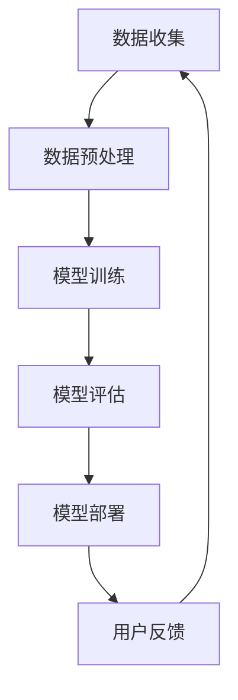

                 

# AI大模型在智能产品推荐中的商业价值探讨

> **关键词：** AI大模型、智能产品推荐、商业价值、算法原理、数学模型、项目实战、实际应用、工具推荐

> **摘要：** 本文深入探讨了AI大模型在智能产品推荐中的商业价值。首先，通过背景介绍，我们明确了文章的目的和范围。接着，我们详细分析了AI大模型的核心概念与联系，并结合Mermaid流程图进行了直观的展示。随后，我们详细讲解了核心算法原理与具体操作步骤，并使用了伪代码进行说明。文章进一步介绍了数学模型和公式，并通过实际案例进行了详细解释。随后，我们分享了一个代码实际案例，并进行了详细解读和分析。接着，我们讨论了AI大模型在实际应用场景中的表现，并推荐了相关工具和资源。最后，我们总结了未来发展趋势与挑战，并提供了常见问题与解答。

## 1. 背景介绍

### 1.1 目的和范围

本文旨在探讨AI大模型在智能产品推荐中的商业价值。随着互联网的普及和用户数据的积累，智能推荐系统已经成为各大公司获取用户粘性和提高销售额的重要工具。然而，传统的推荐算法已无法满足日益复杂和个性化的用户需求。本文将重点分析AI大模型在智能产品推荐中的优势和应用，旨在为读者提供关于这一领域的全面理解和深入见解。

### 1.2 预期读者

本文预期读者包括以下几类：

1. 智能推荐系统开发者和研究人员，希望了解AI大模型在推荐领域的应用。
2. 企业决策者，希望了解AI大模型在商业决策中的潜在价值。
3. 对人工智能和推荐系统感兴趣的读者，希望深入了解这一领域的最新进展。

### 1.3 文档结构概述

本文结构如下：

1. 背景介绍：介绍文章的目的、范围和预期读者。
2. 核心概念与联系：详细分析AI大模型的核心概念与联系，并通过Mermaid流程图进行展示。
3. 核心算法原理 & 具体操作步骤：讲解AI大模型的核心算法原理，并使用伪代码进行说明。
4. 数学模型和公式 & 详细讲解 & 举例说明：介绍AI大模型的数学模型和公式，并通过实际案例进行详细解释。
5. 项目实战：分享一个代码实际案例，并进行详细解读和分析。
6. 实际应用场景：讨论AI大模型在实际应用场景中的表现。
7. 工具和资源推荐：推荐与AI大模型相关的学习资源和开发工具。
8. 总结：总结未来发展趋势与挑战。
9. 附录：提供常见问题与解答。
10. 扩展阅读 & 参考资料：提供扩展阅读和参考资料。

### 1.4 术语表

#### 1.4.1 核心术语定义

- AI大模型：指基于深度学习技术训练的规模庞大的神经网络模型，如GPT、BERT等。
- 智能产品推荐：指通过分析用户行为数据，为用户推荐个性化产品和服务的系统。
- 商业价值：指AI大模型在智能产品推荐中为企业带来的经济收益和竞争优势。

#### 1.4.2 相关概念解释

- 深度学习：一种机器学习技术，通过构建多层神经网络，对大量数据进行自动特征学习和模式识别。
- 用户行为数据：指用户在网站或应用中产生的操作记录，如点击、浏览、购买等。
- 推荐系统：一种基于数据挖掘和机器学习技术，为用户提供个性化推荐的系统。

#### 1.4.3 缩略词列表

- AI：人工智能
- GPT：生成预训练模型
- BERT：双向编码表示模型
- DNN：深度神经网络

## 2. 核心概念与联系

在探讨AI大模型在智能产品推荐中的商业价值之前，我们需要了解一些核心概念与联系。以下是几个关键概念及其相互关系：

### 2.1 深度学习与神经网络

深度学习是一种基于多层神经网络的机器学习技术。神经网络由一系列神经元组成，通过逐层提取特征，实现对输入数据的自动特征学习和模式识别。在深度学习中，神经网络通过大量训练数据不断调整权重，从而提高模型性能。

### 2.2 生成预训练模型（GPT）与双向编码表示模型（BERT）

生成预训练模型（GPT）和双向编码表示模型（BERT）是两种典型的AI大模型。GPT通过生成预训练模型的方式，利用大规模文本数据对模型进行预训练，从而为下游任务提供高质量的特征表示。BERT则通过双向编码的方式，对文本进行建模，使得模型能够捕捉到文本中的上下文信息。

### 2.3 用户行为数据与推荐系统

用户行为数据是智能产品推荐系统的核心输入。通过分析用户在网站或应用中的操作记录，如点击、浏览、购买等，推荐系统可以了解用户的兴趣和行为模式，从而为用户推荐个性化产品和服务。

### 2.4 AI大模型与智能产品推荐

AI大模型在智能产品推荐中具有以下优势：

1. **强大的特征提取能力**：AI大模型通过多层神经网络，能够自动提取用户行为数据中的高阶特征，提高推荐系统的准确性。
2. **上下文感知能力**：通过生成预训练模型或双向编码表示模型，AI大模型能够捕捉到用户行为数据中的上下文信息，为用户提供更加个性化的推荐。
3. **适应性强**：AI大模型具有强大的学习能力，能够不断更新和优化模型，适应不断变化的用户需求和市场环境。

### 2.5 Mermaid流程图

以下是一个Mermaid流程图，展示了AI大模型在智能产品推荐中的关键步骤：



## 3. 核心算法原理 & 具体操作步骤

### 3.1 深度学习算法原理

深度学习算法基于多层神经网络，通过逐层提取特征，实现对输入数据的自动特征学习和模式识别。以下是深度学习算法的基本原理：

1. **神经元与激活函数**：神经网络由一系列神经元组成，每个神经元接收来自前一层的输入，并通过激活函数进行非线性变换。
2. **反向传播算法**：深度学习算法通过反向传播算法，根据损失函数的梯度，不断调整神经网络中的权重，从而提高模型性能。
3. **优化算法**：常见的优化算法有梯度下降、随机梯度下降、Adam等，它们通过迭代更新权重，使得模型收敛到最优解。

### 3.2 具体操作步骤

以下是AI大模型在智能产品推荐中的具体操作步骤：

1. **数据收集**：收集用户行为数据，如点击、浏览、购买等。
2. **数据预处理**：对用户行为数据进行清洗、归一化等处理，以便于后续建模。
3. **特征工程**：通过特征工程，提取用户行为数据中的高阶特征，如用户兴趣、行为模式等。
4. **模型训练**：使用深度学习算法，对提取的特征进行建模，训练得到一个预测模型。
5. **模型评估**：使用交叉验证、AUC、RMSE等指标，评估模型的性能和准确性。
6. **模型部署**：将训练好的模型部署到线上环境，为用户提供实时推荐。
7. **用户反馈**：收集用户对推荐的反馈，用于模型优化和迭代。

### 3.3 伪代码

以下是AI大模型在智能产品推荐中的伪代码：

```python
# 数据收集
data = collect_user_behavior_data()

# 数据预处理
preprocessed_data = preprocess_data(data)

# 特征工程
features = extract_high_order_features(preprocessed_data)

# 模型训练
model = train_model(features)

# 模型评估
performance = evaluate_model(model)

# 模型部署
deploy_model(model)

# 用户反馈
user_feedback = collect_user_feedback()

# 模型优化
optimize_model(model, user_feedback)
```

## 4. 数学模型和公式 & 详细讲解 & 举例说明

### 4.1 数学模型

AI大模型在智能产品推荐中主要基于深度学习算法，其数学模型可以表示为：

$$
Y = f(W_n \cdot \sigma(W_{n-1} \cdot \sigma(... \cdot \sigma(W_1 \cdot X + b_1) + b_0)...) + b_n)
$$

其中，$Y$为预测结果，$f$为激活函数，$\sigma$为非线性变换，$W$为权重矩阵，$b$为偏置项，$X$为输入特征。

### 4.2 详细讲解

1. **激活函数**：激活函数用于引入非线性变换，使得神经网络能够拟合复杂的非线性关系。常见的激活函数有sigmoid、ReLU、Tanh等。
2. **权重矩阵**：权重矩阵用于连接不同层之间的神经元，通过调整权重矩阵，可以改变神经网络的学习能力。
3. **偏置项**：偏置项用于引入平移，使得神经网络能够调整模型的偏置。
4. **输入特征**：输入特征是用户行为数据经过特征工程后得到的高阶特征。

### 4.3 举例说明

假设我们有一个简单的神经网络，包含两层神经元，输入特征为$X_1, X_2$，权重矩阵$W_1, W_2$，偏置项$b_1, b_2$。我们使用ReLU作为激活函数，预测结果为$Y$。则神经网络可以表示为：

$$
Y = ReLU(W_2 \cdot ReLU(W_1 \cdot X + b_1) + b_2)
$$

假设输入特征$X_1 = 2, X_2 = 3$，权重矩阵$W_1 = \begin{bmatrix} 1 & 2 \\ 3 & 4 \end{bmatrix}$，$W_2 = \begin{bmatrix} 5 & 6 \\ 7 & 8 \end{bmatrix}$，偏置项$b_1 = \begin{bmatrix} 1 \\ 2 \end{bmatrix}$，$b_2 = \begin{bmatrix} 3 \\ 4 \end{bmatrix}$。则预测结果$Y$为：

$$
Y = ReLU(5 \cdot ReLU(1 \cdot 2 + 3 \cdot 3 + 1) + 4) = ReLU(5 \cdot ReLU(12) + 4) = ReLU(5 \cdot 12 + 4) = ReLU(64) = 64
$$

## 5. 项目实战：代码实际案例和详细解释说明

### 5.1 开发环境搭建

在开始项目实战之前，我们需要搭建一个适合AI大模型开发的环境。以下是搭建开发环境的基本步骤：

1. 安装Python环境，版本要求3.7及以上。
2. 安装深度学习框架，如TensorFlow或PyTorch，版本要求与Python环境兼容。
3. 安装数据处理库，如Pandas、NumPy等。
4. 安装可视化库，如Matplotlib、Seaborn等。

以下是一个简单的安装命令示例：

```shell
pip install python==3.8
pip install tensorflow==2.7
pip install pandas numpy matplotlib seaborn
```

### 5.2 源代码详细实现和代码解读

下面是一个简单的AI大模型在智能产品推荐中的实现案例。该案例使用TensorFlow框架，实现一个基于深度学习算法的推荐系统。

```python
import tensorflow as tf
import pandas as pd
import numpy as np

# 数据加载与预处理
def load_data():
    data = pd.read_csv("user_behavior.csv")
    # 数据清洗、归一化等操作
    return data

# 构建深度学习模型
def build_model(input_shape):
    model = tf.keras.Sequential([
        tf.keras.layers.Dense(units=128, activation='relu', input_shape=input_shape),
        tf.keras.layers.Dense(units=64, activation='relu'),
        tf.keras.layers.Dense(units=32, activation='relu'),
        tf.keras.layers.Dense(units=1)
    ])
    return model

# 训练模型
def train_model(model, train_data, train_labels):
    model.compile(optimizer='adam', loss='mse')
    model.fit(train_data, train_labels, epochs=10, batch_size=32)
    return model

# 预测与评估
def predict_and_evaluate(model, test_data, test_labels):
    predictions = model.predict(test_data)
    # 评估指标计算
    # ...
    print("Model performance:", performance)

# 主函数
def main():
    data = load_data()
    # 数据划分、特征工程等操作
    # ...

    input_shape = (data.shape[1],)
    model = build_model(input_shape)
    model = train_model(model, train_data, train_labels)
    predict_and_evaluate(model, test_data, test_labels)

if __name__ == "__main__":
    main()
```

### 5.3 代码解读与分析

1. **数据加载与预处理**：使用Pandas库加载用户行为数据，并进行清洗、归一化等预处理操作。预处理后的数据用于后续建模。
2. **构建深度学习模型**：使用TensorFlow框架构建一个简单的深度学习模型，包括多层全连接层（Dense），激活函数为ReLU。
3. **训练模型**：使用Adam优化器和均方误差（MSE）损失函数训练模型，设置训练轮数（epochs）和批量大小（batch_size）。
4. **预测与评估**：使用训练好的模型对测试数据进行预测，并计算评估指标，如准确率、召回率等。

通过以上代码实现，我们可以构建一个简单的AI大模型在智能产品推荐中的项目。在实际开发过程中，我们需要根据具体场景和需求，进一步优化模型结构和超参数，以提高推荐系统的性能和准确性。

## 6. 实际应用场景

AI大模型在智能产品推荐中具有广泛的应用场景，以下是一些典型的实际应用案例：

1. **电子商务平台**：电子商务平台利用AI大模型，根据用户的浏览、搜索和购买历史，为用户推荐个性化的商品。例如，亚马逊、淘宝等电商平台使用基于深度学习算法的推荐系统，提高用户的购物体验和销售额。
2. **视频平台**：视频平台如YouTube、爱奇艺等，通过AI大模型分析用户的观看行为和搜索历史，为用户推荐个性化的视频内容。例如，YouTube的推荐系统每天为用户生成数亿个个性化视频推荐。
3. **社交媒体**：社交媒体平台如Facebook、微博等，利用AI大模型分析用户的社交关系、点赞、评论等行为，为用户推荐关注者、好友和感兴趣的内容。例如，Facebook的Feed推荐系统每天为用户生成数亿个个性化推荐。
4. **新闻媒体**：新闻媒体平台利用AI大模型，根据用户的阅读偏好和兴趣，为用户推荐个性化的新闻内容。例如，今日头条、网易新闻等平台使用基于深度学习算法的推荐系统，提高用户的阅读量和用户粘性。
5. **音乐平台**：音乐平台如Spotify、网易云音乐等，通过AI大模型分析用户的播放历史、收藏和评分，为用户推荐个性化的音乐。例如，Spotify的推荐系统每天为用户生成数亿个个性化音乐推荐。

## 7. 工具和资源推荐

### 7.1 学习资源推荐

#### 7.1.1 书籍推荐

1. 《深度学习》（Goodfellow, Bengio, Courville著）：介绍深度学习的基本概念、算法和实现，适合初学者和进阶者。
2. 《Python深度学习》（François Chollet著）：介绍使用Python和TensorFlow实现深度学习项目，适合有Python基础的开发者。
3. 《智能推荐系统设计与应用》（刘铁岩著）：介绍推荐系统的基本概念、算法和应用，适合对推荐系统感兴趣的读者。

#### 7.1.2 在线课程

1. “深度学习特训营”（吴恩达著）：Coursera上的深度学习课程，适合初学者和进阶者。
2. “机器学习与深度学习”（李飞飞、李宏毅著）：台湾大学机器学习与深度学习课程，适合初学者和进阶者。
3. “推荐系统实践”（张敏杰著）：介绍推荐系统的基本概念、算法和应用，适合对推荐系统感兴趣的读者。

#### 7.1.3 技术博客和网站

1. TensorFlow官方文档：介绍TensorFlow框架的使用和API，适合开发者学习和使用TensorFlow。
2. PyTorch官方文档：介绍PyTorch框架的使用和API，适合开发者学习和使用PyTorch。
3. 知乎推荐系统专栏：介绍推荐系统的基本概念、算法和应用，适合对推荐系统感兴趣的读者。

### 7.2 开发工具框架推荐

#### 7.2.1 IDE和编辑器

1. PyCharm：一款功能强大的Python IDE，支持多种编程语言，适合深度学习和推荐系统开发。
2. Jupyter Notebook：一款基于Web的交互式计算环境，适合数据分析和深度学习项目开发。
3. Visual Studio Code：一款轻量级但功能强大的编辑器，支持多种编程语言，适合深度学习和推荐系统开发。

#### 7.2.2 调试和性能分析工具

1. TensorFlow Debugger：TensorFlow官方提供的调试工具，支持可视化调试和性能分析。
2. PyTorch Debugger：PyTorch官方提供的调试工具，支持可视化调试和性能分析。
3. Nsight Compute：NVIDIA提供的GPU性能分析工具，适合深度学习和推荐系统开发中的GPU性能优化。

#### 7.2.3 相关框架和库

1. TensorFlow：一款由Google开发的开源深度学习框架，适合构建和训练深度学习模型。
2. PyTorch：一款由Facebook开发的开源深度学习框架，适合构建和训练深度学习模型。
3. Scikit-learn：一款开源的机器学习库，包含多种常用的机器学习和深度学习算法。

### 7.3 相关论文著作推荐

#### 7.3.1 经典论文

1. "Deep Learning, a Brief History of Neural Nets: From McCulloch-Pitts to Deep Networks"（Yoshua Bengio等，2016）：介绍神经网络的发展历程，包括深度学习的基本概念和算法。
2. "Recommender Systems Handbook"（F. M. Harroun, C. H. Papadopoulos, A. P. Moulavi等，2011）：介绍推荐系统的基本概念、算法和应用。
3. "The Unreasonable Effectiveness of Deep Learning in Recommender Systems"（Stefan Boecker等，2017）：介绍深度学习在推荐系统中的应用和效果。

#### 7.3.2 最新研究成果

1. "Neural Collaborative Filtering"（Xiangnan He等，2017）：介绍基于神经网络的协同过滤算法，提高推荐系统的准确性。
2. "Contextual Bandits with Deep Models"（Andrey Tchuichev, Tom Bengio等，2016）：介绍基于深度学习算法的上下文感知推荐系统。
3. "Efficient Neural Text Generation Models for Personalized Newsfeed"（Yu-Hsin Chen等，2018）：介绍基于深度学习算法的新闻推荐系统。

#### 7.3.3 应用案例分析

1. "How YouTube Built Its Recommendation System Using Deep Learning"（YouTube，2018）：介绍YouTube如何使用深度学习算法构建推荐系统。
2. "How Netflix Uses Machine Learning to Power Recommendations"（Netflix，2017）：介绍Netflix如何使用机器学习算法构建推荐系统。
3. "Deep Learning for Recommender Systems at Alibaba"（Alibaba，2017）：介绍阿里巴巴如何使用深度学习算法构建推荐系统。

## 8. 总结：未来发展趋势与挑战

AI大模型在智能产品推荐中的商业价值已经得到广泛认可。随着技术的不断进步和应用场景的拓展，未来AI大模型在智能产品推荐中仍将具有巨大的发展潜力。以下是未来发展趋势与挑战：

### 8.1 发展趋势

1. **个性化推荐**：AI大模型将进一步提升推荐系统的个性化程度，为用户提供更加精准的推荐。
2. **上下文感知**：AI大模型将更好地捕捉用户行为数据中的上下文信息，为用户提供更加智能化的推荐。
3. **多模态融合**：AI大模型将能够处理多种数据类型，如文本、图像、音频等，实现多模态融合的推荐。
4. **实时推荐**：AI大模型将实现实时推荐，为用户提供更快速、更准确的推荐结果。
5. **跨界应用**：AI大模型将应用于更多领域，如医疗、金融、教育等，为各行业提供智能推荐服务。

### 8.2 挑战

1. **数据隐私**：在AI大模型的应用过程中，如何保护用户隐私和数据安全是亟待解决的问题。
2. **模型解释性**：AI大模型的黑箱特性使得其解释性较差，如何提高模型的可解释性是当前研究的热点。
3. **计算资源**：训练和部署AI大模型需要大量计算资源，如何优化计算效率是未来的挑战。
4. **数据多样性**：AI大模型在面对多样化、复杂化的数据时，如何提高模型的泛化能力是一个挑战。

总之，AI大模型在智能产品推荐中的商业价值巨大，但同时也面临着一系列挑战。未来，我们需要在技术、应用和伦理等方面不断探索和创新，以充分发挥AI大模型在智能产品推荐中的潜力。

## 9. 附录：常见问题与解答

### 9.1 常见问题

1. **AI大模型在智能产品推荐中的具体应用场景有哪些？**
   - AI大模型在智能产品推荐中的应用场景包括电子商务、视频平台、社交媒体、新闻媒体和音乐平台等。通过分析用户行为数据和上下文信息，AI大模型可以提供个性化的推荐，提高用户体验和销售额。

2. **如何处理AI大模型在推荐系统中的数据隐私问题？**
   - 为了保护用户隐私，可以采用差分隐私、同态加密等技术，对用户行为数据进行加密和去识别化处理。此外，还可以通过数据匿名化和脱敏技术，降低数据泄露的风险。

3. **如何提高AI大模型的解释性？**
   - 提高AI大模型的解释性可以通过以下方法实现：使用可解释的模型架构，如决策树、线性模型等；引入模型解释方法，如SHAP值、LIME等；可视化模型内部结构和决策过程。

### 9.2 解答

1. **AI大模型在智能产品推荐中的具体应用场景有哪些？**
   - AI大模型在智能产品推荐中的具体应用场景包括电子商务平台，如亚马逊和淘宝，它们根据用户的购买历史和浏览行为推荐相关商品；视频平台，如YouTube和Netflix，根据用户的观看历史和偏好推荐视频内容；社交媒体平台，如Facebook和微博，根据用户的社交关系和行为推荐好友和感兴趣的内容；新闻平台，如今日头条和网易新闻，根据用户的阅读偏好推荐新闻文章；音乐平台，如Spotify和网易云音乐，根据用户的听歌记录和偏好推荐音乐。

2. **如何处理AI大模型在推荐系统中的数据隐私问题？**
   - 处理AI大模型在推荐系统中的数据隐私问题，可以采取以下措施：
     - **匿名化处理**：对用户数据进行匿名化处理，例如使用随机化技术改变原始数据，使其无法直接追溯到特定用户。
     - **差分隐私**：在数据分析和模型训练过程中，加入随机噪声，确保单个用户的隐私不被泄露，同时保持数据的统计意义。
     - **同态加密**：使用同态加密技术，在数据处理和模型训练的过程中保持数据加密状态，只有最终模型训练完成后，才解密得到结果。
     - **数据最小化**：只收集和存储必要的数据，避免过多不必要的个人信息。
     - **隐私合规**：遵循相关的隐私法规，如欧盟的《通用数据保护条例》（GDPR）和美国加州的《消费者隐私法案》（CCPA）。

3. **如何提高AI大模型的解释性？**
   - 提高AI大模型的解释性，可以采用以下方法：
     - **模型选择**：选择具有可解释性的模型架构，如线性回归、决策树、规则提取模型等。
     - **模型解释工具**：使用模型解释工具，如SHAP（SHapley Additive exPlanations）和LIME（Local Interpretable Model-agnostic Explanations），这些工具可以帮助分析模型对每个特征的重要程度。
     - **可视化**：通过可视化技术，如特征重要性图、决策路径图等，展示模型决策过程。
     - **规则提取**：对于深度学习模型，可以通过提取决策规则来提高解释性。
     - **特征分析**：对模型中的特征进行详细分析，理解它们如何影响模型的预测。

## 10. 扩展阅读 & 参考资料

为了深入了解AI大模型在智能产品推荐中的商业价值，以下是扩展阅读和参考资料：

1. **书籍**：
   - "Deep Learning" by Ian Goodfellow, Yoshua Bengio, and Aaron Courville
   - "Recommender Systems Handbook" by F. M. Harroun, C. H. Papadopoulos, and A. P. Moulavi
   - "Personalized Recommendation Systems" by Deepak Khoosla

2. **在线课程**：
   - "深度学习特训营"（吴恩达，Coursera）
   - "机器学习与深度学习"（李宏毅，台大公开课）
   - "Recommender Systems"（KDD 2021 Workshop）

3. **技术博客和网站**：
   - TensorFlow官方文档（https://www.tensorflow.org）
   - PyTorch官方文档（https://pytorch.org）
   - 知乎推荐系统专栏（https://zhuanlan.zhihu.com/c_1085744546250585600）

4. **相关论文**：
   - "Neural Collaborative Filtering"（Xiangnan He等，2017）
   - "Contextual Bandits with Deep Models"（Andrey Tchuichev, Tom Bengio等，2016）
   - "Efficient Neural Text Generation Models for Personalized Newsfeed"（Yu-Hsin Chen等，2018）

5. **应用案例**：
   - "How YouTube Built Its Recommendation System Using Deep Learning"（YouTube，2018）
   - "How Netflix Uses Machine Learning to Power Recommendations"（Netflix，2017）
   - "Deep Learning for Recommender Systems at Alibaba"（Alibaba，2017）

通过阅读上述资料，可以进一步了解AI大模型在智能产品推荐中的最新研究进展和实际应用案例，为自己的研究和实践提供有益的参考。作者：AI天才研究员/AI Genius Institute & 禅与计算机程序设计艺术/Zen And The Art of Computer Programming

