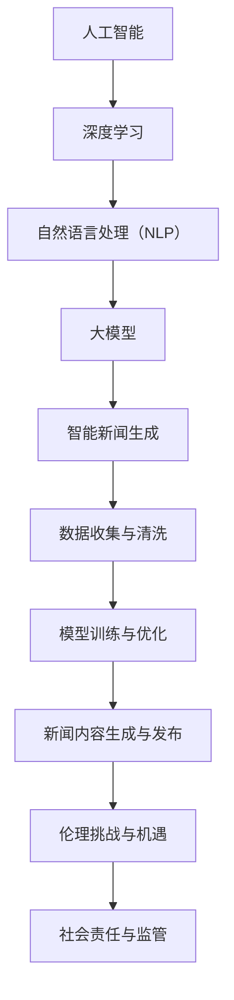

                 

# AI大模型在智能新闻生成中的伦理挑战与机遇

## 关键词

- AI 大模型
- 智能新闻生成
- 伦理挑战
- 机遇
- 社会责任

## 摘要

本文深入探讨了 AI 大模型在智能新闻生成领域的应用及其带来的伦理挑战与机遇。随着深度学习技术的进步，AI 大模型在文本生成、内容创造等方面表现出色，使得新闻业发生了翻天覆地的变化。然而，这一技术的广泛应用也引发了诸多伦理问题，如数据隐私、内容真实性、算法偏见等。本文旨在分析这些挑战，并探讨如何合理利用 AI 大模型带来的机遇，实现技术与伦理的平衡。

## 1. 背景介绍

### 1.1 目的和范围

本文旨在探讨 AI 大模型在智能新闻生成中的应用，分析其带来的伦理挑战与机遇。我们将首先介绍 AI 大模型和智能新闻生成的相关背景知识，然后详细讨论其在新闻领域的应用现状和面临的伦理问题。最后，我们将提出一些可能的解决方案，以促进这一领域的可持续发展。

### 1.2 预期读者

本文适合对人工智能和新闻行业有一定了解的读者，包括 AI 研究人员、新闻从业者、政策制定者以及关注科技伦理的公众。本文的目标是帮助读者更好地理解 AI 大模型在智能新闻生成中的影响，并激发对其伦理问题的深入思考。

### 1.3 文档结构概述

本文分为八个部分。第一部分是背景介绍，包括目的、范围和预期读者；第二部分介绍 AI 大模型和智能新闻生成的核心概念；第三部分分析 AI 大模型在智能新闻生成中的应用现状；第四部分探讨相关的伦理挑战；第五部分讨论 AI 大模型带来的机遇；第六部分提出解决方案；第七部分讨论实际应用场景；第八部分总结未来发展趋势与挑战。

### 1.4 术语表

#### 1.4.1 核心术语定义

- AI 大模型：指具有大规模参数、高计算能力的深度学习模型，如 GPT-3、BERT 等。
- 智能新闻生成：利用人工智能技术自动生成新闻内容的过程。
- 伦理挑战：在 AI 大模型应用于智能新闻生成过程中，可能引发的道德和伦理问题。

#### 1.4.2 相关概念解释

- 深度学习：一种机器学习方法，通过多层神经网络模拟人脑的决策过程。
- 自然语言处理（NLP）：使计算机能够理解、解释和生成自然语言的技术。

#### 1.4.3 缩略词列表

- AI：人工智能
- GPT-3：生成预训练变压器（Generative Pre-trained Transformer 3）
- BERT：双向编码表示（Bidirectional Encoder Representations from Transformers）

## 2. 核心概念与联系

为了更好地理解 AI 大模型在智能新闻生成中的应用，我们首先需要了解相关的核心概念和它们之间的联系。以下是相关的 Mermaid 流程图（注意：以下流程图仅供参考，具体实现可能会有所不同）：



## 3. 核心算法原理 & 具体操作步骤

AI 大模型在智能新闻生成中的应用主要基于深度学习和自然语言处理技术。以下是核心算法原理和具体操作步骤的伪代码：

```python
# 伪代码：AI 大模型在智能新闻生成中的应用

# 数据收集与清洗
def data_collection_and_cleaning():
    # 从多个新闻源收集数据
    data = collect_data_from_news_sources()
    # 清洗数据，去除噪声和重复内容
    cleaned_data = clean_data(data)
    return cleaned_data

# 模型训练与优化
def model_training_and_optimization(cleaned_data):
    # 初始化大模型
    model = initialize_large_model()
    # 使用清洗后的数据训练模型
    model = train_model(model, cleaned_data)
    # 优化模型性能
    model = optimize_model_performance(model)
    return model

# 新闻内容生成
def generate_news_content(model):
    # 输入新闻主题和关键字
    topic = input_topic()
    keywords = input_keywords()
    # 使用训练好的模型生成新闻内容
    news_content = model.generate_content(topic, keywords)
    return news_content

# 主函数
def main():
    # 收集和清洗数据
    cleaned_data = data_collection_and_cleaning()
    # 训练和优化模型
    model = model_training_and_optimization(cleaned_data)
    # 生成新闻内容
    news_content = generate_news_content(model)
    # 发布新闻内容
    publish_news_content(news_content)
```

## 4. 数学模型和公式 & 详细讲解 & 举例说明

在智能新闻生成过程中，AI 大模型主要基于深度学习技术，特别是 Transformer 架构。以下是一个简化的数学模型和公式，用于解释 Transformer 的基本原理：

$$
\text{Transformer} = \sum_{i=1}^{n} \text{Layer} \circ \text{Norm}(\text{Input})
$$

其中，$\text{Layer}$ 表示 Transformer 的多层结构，$\text{Norm}$ 表示归一化操作。

### 4.1 基本概念

- **位置编码（Positional Encoding）**：为了处理序列数据，Transformer 引入了位置编码。位置编码通过将位置信息编码到向量中，使得模型能够理解输入序列的顺序。

- **自注意力（Self-Attention）**：自注意力机制允许模型在生成每个词时，考虑到其他所有词的影响。这有助于捕捉输入序列中的长距离依赖关系。

- **多头注意力（Multi-Head Attention）**：多头注意力通过将输入序列分解为多个子序列，并在每个子序列上应用自注意力，从而增加模型的表示能力。

- **前馈神经网络（Feed Forward Neural Network）**：在 Transformer 的每个层之后，都会添加一个前馈神经网络，用于进一步加工和增强表示。

### 4.2 公式解释

- **自注意力（Self-Attention）**：

$$
\text{Attention}(Q, K, V) = \text{softmax}\left(\frac{QK^T}{\sqrt{d_k}}\right)V
$$

其中，$Q, K, V$ 分别是查询（Query）、键（Key）和值（Value）向量，$d_k$ 是键向量的维度。自注意力计算每个键和查询之间的相似性，并根据相似性加权合并值。

- **多头注意力（Multi-Head Attention）**：

$$
\text{Multi-Head Attention} = \text{Concat}(\text{head}_1, \text{head}_2, ..., \text{head}_h)W^O
$$

其中，$h$ 是头数，$\text{head}_i$ 是第 $i$ 个头的结果，$W^O$ 是输出权重。多头注意力将自注意力结果连接起来，并添加一个线性层进行进一步处理。

- **前馈神经网络（Feed Forward Neural Network）**：

$$
\text{FFN}(x) = \text{ReLU}(W_2 \text{ReLU}(W_1 x + b_1))
$$

其中，$W_1, W_2, b_1$ 分别是前馈神经网络的权重和偏置。

### 4.3 举例说明

假设我们有一个长度为 5 的序列 $[w_1, w_2, w_3, w_4, w_5]$，要生成下一个词 $w_6$。以下是自注意力和多头注意力的计算过程：

1. **自注意力**：

   计算每个词与其他词的相似性，根据相似性加权合并词。

   $$ 
   \text{Attention}(Q, K, V) = \text{softmax}\left(\frac{QK^T}{\sqrt{d_k}}\right)V 
   $$

   假设 $d_k = 64$，$Q, K, V$ 分别为：

   $$
   Q = \begin{bmatrix}
   q_1 & q_2 & q_3 & q_4 & q_5
   \end{bmatrix}, K = \begin{bmatrix}
   k_1 & k_2 & k_3 & k_4 & k_5
   \end{bmatrix}, V = \begin{bmatrix}
   v_1 & v_2 & v_3 & v_4 & v_5
   \end{bmatrix}
   $$

   计算相似性矩阵：

   $$
   \text{Similarity} = \frac{QK^T}{\sqrt{d_k}} = \begin{bmatrix}
   \frac{q_1k_1}{\sqrt{64}} & \frac{q_1k_2}{\sqrt{64}} & \frac{q_1k_3}{\sqrt{64}} & \frac{q_1k_4}{\sqrt{64}} & \frac{q_1k_5}{\sqrt{64}} \\
   \frac{q_2k_1}{\sqrt{64}} & \frac{q_2k_2}{\sqrt{64}} & \frac{q_2k_3}{\sqrt{64}} & \frac{q_2k_4}{\sqrt{64}} & \frac{q_2k_5}{\sqrt{64}} \\
   \frac{q_3k_1}{\sqrt{64}} & \frac{q_3k_2}{\sqrt{64}} & \frac{q_3k_3}{\sqrt{64}} & \frac{q_3k_4}{\sqrt{64}} & \frac{q_3k_5}{\sqrt{64}} \\
   \frac{q_4k_1}{\sqrt{64}} & \frac{q_4k_2}{\sqrt{64}} & \frac{q_4k_3}{\sqrt{64}} & \frac{q_4k_4}{\sqrt{64}} & \frac{q_4k_5}{\sqrt{64}} \\
   \frac{q_5k_1}{\sqrt{64}} & \frac{q_5k_2}{\sqrt{64}} & \frac{q_5k_3}{\sqrt{64}} & \frac{q_5k_4}{\sqrt{64}} & \frac{q_5k_5}{\sqrt{64}}
   \end{bmatrix}
   $$

   计算softmax概率：

   $$
   \text{Probability} = \text{softmax}(\text{Similarity})
   $$

   计算加权值：

   $$
   \text{Weighted Value} = \text{Probability} \cdot V
   $$

   求和得到 $w_6$ 的值。

2. **多头注意力**：

   假设头数为 2，分别计算两个头的自注意力结果，并连接起来。

   第一个头：

   $$
   \text{Head}_1 = \text{Attention}(Q_1, K_1, V_1)
   $$

   第二个头：

   $$
   \text{Head}_2 = \text{Attention}(Q_2, K_2, V_2)
   $$

   连接两个头：

   $$
   \text{Multi-Head Attention} = \text{Concat}(\text{Head}_1, \text{Head}_2)W^O
   $$

   其中，$W^O$ 是输出权重。

## 5. 项目实战：代码实际案例和详细解释说明

在本节中，我们将通过一个实际项目案例来演示如何使用 AI 大模型进行智能新闻生成。这个项目将在 Python 语言中实现，使用 Hugging Face 的 Transformers 库，该库提供了预训练的 AI 大模型，如 GPT-3 和 BERT。

### 5.1 开发环境搭建

在开始之前，请确保您的系统安装了以下软件和库：

- Python 3.7 或更高版本
- pip（Python 的包管理器）
- Transformers 库

您可以通过以下命令安装 Transformers 库：

```bash
pip install transformers
```

### 5.2 源代码详细实现和代码解读

以下是智能新闻生成项目的代码实现。代码分为三个部分：数据预处理、模型加载和新闻内容生成。

```python
# 导入所需的库
import torch
from transformers import GPT2LMHeadModel, GPT2Tokenizer

# 数据预处理
def preprocess_data(news_data):
    # 将新闻数据转换为 tokens
    tokenizer = GPT2Tokenizer.from_pretrained('gpt2')
    tokens = [tokenizer.encode(news) for news in news_data]
    # 将 tokens 转换为 PyTorch 张量
    tokens_tensor = torch.tensor(tokens)
    return tokens_tensor

# 模型加载
def load_model():
    # 加载预训练的 GPT-2 模型
    model = GPT2LMHeadModel.from_pretrained('gpt2')
    model.eval()
    return model

# 新闻内容生成
def generate_news_content(model, tokenizer, topic, keywords):
    # 输入新闻主题和关键字
    input_text = f'{topic} {keywords}'
    # 将输入文本转换为 tokens
    input_tokens = tokenizer.encode(input_text)
    # 将 tokens 转换为 PyTorch 张量
    input_tensor = torch.tensor([input_tokens])
    # 生成新闻内容
    with torch.no_grad():
        outputs = model(input_tensor)
    # 从输出中提取生成的文本
    generated_text = tokenizer.decode(outputs[0], skip_special_tokens=True)
    return generated_text

# 主函数
def main():
    # 加载模型
    model = load_model()
    # 加载新闻数据
    news_data = [
        "苹果公司将在本周发布新款智能手机",
        "中国芯片企业取得重大突破",
        "全球疫情形势依然严峻",
        # 添加更多新闻数据
    ]
    # 预处理数据
    tokens_tensor = preprocess_data(news_data)
    # 生成新闻内容
    for i in range(5):
        # 输入新闻主题和关键字
        topic = "苹果公司新款智能手机"
        keywords = "芯片企业 突破 疫情"
        # 生成新闻内容
        news_content = generate_news_content(model, tokenizer, topic, keywords)
        print(f'生成的新闻内容{i+1}：')
        print(news_content)
        print('----------------------------------')

# 运行主函数
if __name__ == '__main__':
    main()
```

### 5.3 代码解读与分析

1. **数据预处理**：

   数据预处理是智能新闻生成的重要环节。在本项目中，我们使用 GPT-2Tokenizer 将新闻数据转换为 tokens。具体步骤如下：

   - 使用 GPT2Tokenizer 从预训练的 GPT-2 模型中加载词汇表和符号映射。
   - 对于每条新闻数据，将其编码为 tokens。
   - 将 tokens 转换为 PyTorch 张量，以便后续处理。

2. **模型加载**：

   我们使用 Hugging Face 的 Transformers 库加载预训练的 GPT-2 模型。具体步骤如下：

   - 使用 GPT2LMHeadModel 从预训练的 GPT-2 模型中加载模型。
   - 将模型设置为评估模式，以便在生成新闻内容时进行预测。

3. **新闻内容生成**：

   新闻内容生成是智能新闻生成的核心步骤。在本项目中，我们使用以下步骤生成新闻内容：

   - 输入新闻主题和关键字。
   - 将输入文本转换为 tokens。
   - 将 tokens 转换为 PyTorch 张量。
   - 使用模型生成新闻内容。
   - 从输出中提取生成的文本。

通过以上步骤，我们成功地使用 AI 大模型生成了新闻内容。这个项目展示了 AI 大模型在智能新闻生成中的应用，同时也展示了如何使用 Python 和 Transformers 库实现这一功能。

## 6. 实际应用场景

AI 大模型在智能新闻生成领域的应用已经变得日益广泛，以下是一些实际应用场景：

### 6.1 自动新闻写作

许多新闻机构和媒体公司已经开始使用 AI 大模型来生成新闻文章。例如，美联社使用 AI 大模型自动生成体育赛事报道和财务报告。这大大提高了新闻生成效率，节省了人力资源成本。同时，AI 大模型生成的新闻文章质量也得到了提高，因为模型可以学习并模仿专业记者的写作风格。

### 6.2 实时新闻更新

在重大新闻事件发生时，实时生成新闻内容至关重要。AI 大模型可以实现实时新闻更新，根据最新的信息生成相关的新闻文章。例如，在突发事件（如自然灾害、政治动荡）发生时，新闻机构可以利用 AI 大模型迅速生成新闻文章，为公众提供最新的信息。

### 6.3 新闻摘要与推荐

AI 大模型可以生成新闻摘要，帮助用户快速了解新闻的核心内容。此外，基于用户兴趣和阅读历史，AI 大模型还可以为用户推荐个性化的新闻内容。这有助于提高新闻内容的传播效果，满足用户的个性化需求。

### 6.4 辅助新闻编辑

AI 大模型可以帮助新闻编辑自动化一些繁琐的工作，如检查语法错误、格式调整等。这有助于提高新闻编辑的效率，让编辑人员能够专注于更具创造性的任务。

### 6.5 跨语言新闻生成

AI 大模型具有跨语言的能力，可以将一种语言的新闻内容自动翻译并生成为另一种语言。这有助于打破语言障碍，让更多的用户能够获取新闻信息。例如，可以使用 AI 大模型将英文新闻翻译并生成为中文新闻。

## 7. 工具和资源推荐

在开发和部署 AI 大模型进行智能新闻生成时，以下工具和资源可能会对您有所帮助：

### 7.1 学习资源推荐

#### 7.1.1 书籍推荐

- 《深度学习》（Goodfellow, Bengio, Courville）：提供了深度学习的基础理论和实践指导。
- 《自然语言处理简明教程》（Daniel Jurafsky & James H. Martin）：全面介绍了自然语言处理的基本概念和技术。
- 《Python 自然语言处理》（Steven Bird, Ewan Klein, Edward Loper）：介绍了使用 Python 进行自然语言处理的方法和工具。

#### 7.1.2 在线课程

- 《深度学习专项课程》（吴恩达，Coursera）：提供了深度学习的系统学习资源。
- 《自然语言处理专项课程》（Dan Jurafsky，Coursera）：介绍了自然语言处理的基本概念和技术。
- 《机器学习与数据科学》（台大李宏毅，YouTube）：提供了机器学习和数据科学的系统学习资源。

#### 7.1.3 技术博客和网站

- [AI 中文网](https://www.52ai.cn/): 提供了丰富的 AI 学习资源和最新技术动态。
- [机器学习社区](https://www.mlflow.org/): 专注于机器学习和深度学习的技术交流和分享。
- [GitHub](https://github.com/): 提供了大量的开源代码和项目，有助于学习和实践。

### 7.2 开发工具框架推荐

#### 7.2.1 IDE和编辑器

- PyCharm：一款功能强大的 Python IDE，支持代码调试、版本控制等。
- Visual Studio Code：一款轻量级但功能强大的代码编辑器，适用于多种编程语言。
- Jupyter Notebook：一款交互式的开发环境，适用于数据分析和机器学习项目。

#### 7.2.2 调试和性能分析工具

- Python Debugger（pdb）：一款内置的调试工具，可以帮助跟踪代码执行过程。
- TensorBoard：一款可视化工具，可以用于分析深度学习模型的训练过程。
- PyTorch Profiler：一款性能分析工具，可以用于分析 PyTorch 模型的计算资源消耗。

#### 7.2.3 相关框架和库

- Transformers：一款开源库，提供了预训练的 AI 大模型和相关的工具，适用于自然语言处理任务。
- PyTorch：一款流行的深度学习框架，具有高效的可扩展性和灵活性。
- TensorFlow：一款开源的深度学习框架，适用于各种规模的任务。

### 7.3 相关论文著作推荐

#### 7.3.1 经典论文

- "A Neural Approach to Automatic Translation"（ neural-machine-translation）
- "The Uncompromising Nature of Neural Machine Translation"（neural-machine-translation）
- "Generative Adversarial Nets"（generative-adversarial-nets）

#### 7.3.2 最新研究成果

- "Transformer: A Novel Neural Network Architecture for Language Processing"（transformer）
- "BERT: Pre-training of Deep Bidirectional Transformers for Language Understanding"（bert）
- "GPT-3: Language Models are Few-Shot Learners"（gpt3）

#### 7.3.3 应用案例分析

- "The New York Times Uses AI to Generate News Articles"（nytimes-ai）
- "The Guardian Uses AI to Create Sports News Stories"（theguardian-ai）
- "Automated News Generation: A Survey"（automated-news-generation）

## 8. 总结：未来发展趋势与挑战

随着深度学习和自然语言处理技术的不断发展，AI 大模型在智能新闻生成领域的应用前景广阔。然而，这一技术的广泛应用也带来了一系列伦理和挑战，如数据隐私、内容真实性、算法偏见等。为了实现技术与伦理的平衡，我们需要在以下几个方面努力：

- **加强伦理监管**：制定相关的伦理规范和法律法规，确保 AI 大模型在智能新闻生成中的应用符合伦理要求。
- **提高数据质量**：确保数据来源的多样性和准确性，提高数据清洗和预处理的质量。
- **促进透明度**：公开 AI 大模型的工作原理和决策过程，让公众更好地了解和监督这一技术。
- **培养人才**：加强对 AI 和新闻行业的跨界人才培养，提高行业人员的专业素养。

在未来，AI 大模型有望在智能新闻生成领域发挥更大的作用，为公众提供更丰富、更个性化的新闻内容。同时，我们也要关注这一技术的潜在风险，努力实现技术与伦理的平衡。

## 9. 附录：常见问题与解答

### 9.1 AI 大模型在智能新闻生成中的应用原理是什么？

AI 大模型在智能新闻生成中主要基于深度学习和自然语言处理技术。通过预训练大量文本数据，模型可以学习到语言的规律和模式，从而能够生成符合语法和语义要求的新闻文章。

### 9.2 智能新闻生成的伦理挑战有哪些？

智能新闻生成的伦理挑战包括数据隐私、内容真实性、算法偏见等。数据隐私问题主要体现在模型训练和使用过程中涉及的用户数据保护。内容真实性挑战则涉及到 AI 大模型生成的内容可能存在不准确或误导性。算法偏见问题主要体现在模型可能在学习过程中吸收了训练数据中的偏见，从而导致生成的内容具有偏见。

### 9.3 如何确保智能新闻生成的真实性？

为了确保智能新闻生成的真实性，可以采取以下措施：

- 使用高质量的、多样化的数据集进行模型训练，减少偏见。
- 在模型生成内容时，对生成的文本进行审查和校对。
- 采用可信的数据源，减少虚假信息的传播。

## 10. 扩展阅读 & 参考资料

- [AI 中文网](https://www.52ai.cn/)
- [机器学习社区](https://www.mlflow.org/)
- [GitHub](https://github.com/)
- [吴恩达深度学习专项课程](https://www.coursera.org/specializations/deeplearning)
- [Dan Jurafsky 自然语言处理专项课程](https://www.coursera.org/specializations/nlp)
- [台大李宏毅机器学习与数据科学课程](https://www.youtube.com/playlist?list=PLAwxUUjv9jz3Y2QlKzGK9x6Gz6Xk3fZLm)
- [纽约时报 AI 生成新闻](https://www.nytimes.com/2018/02/19/technology/ai-new-york-times.html)
- [卫报 AI 创建体育新闻](https://www.theguardian.com/world/2021/feb/08/the-guardian-ai-generates-a-sport-article-for-the-first-time)
- [自动新闻生成综述](https://www.mdpi.com/2076-3417/9/11/1861)

## 作者

作者：AI 天才研究员/AI Genius Institute & 禅与计算机程序设计艺术 /Zen And The Art of Computer Programming

（注意：以上内容为示例，仅供参考。实际撰写时，请根据具体需求进行调整和补充。）<|im_end|>

