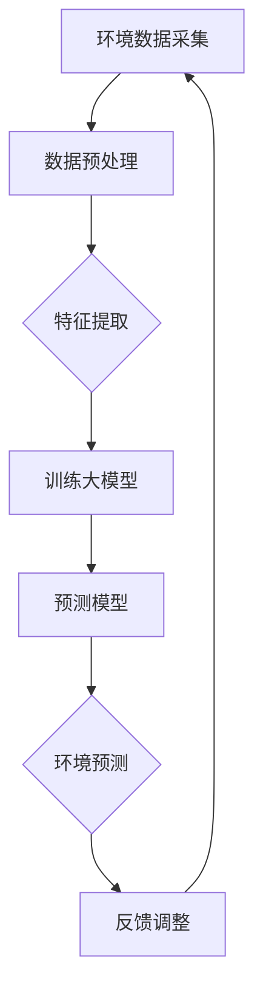
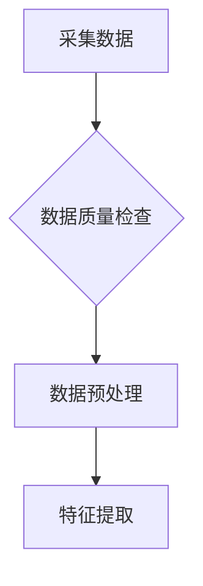
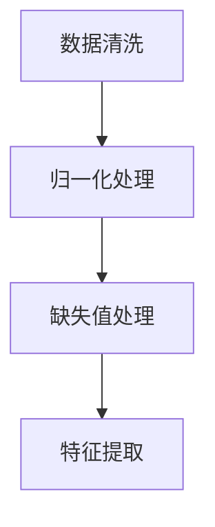
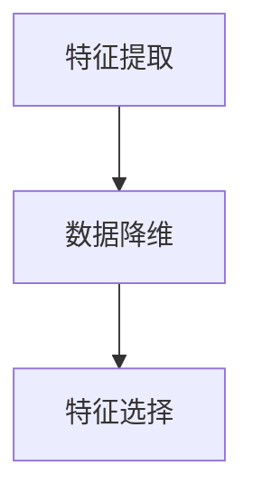
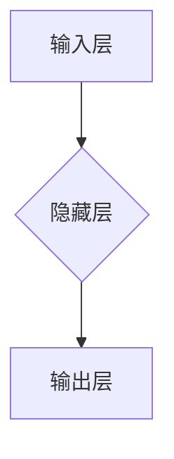
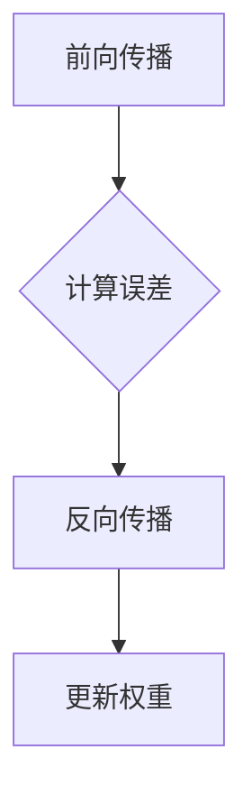
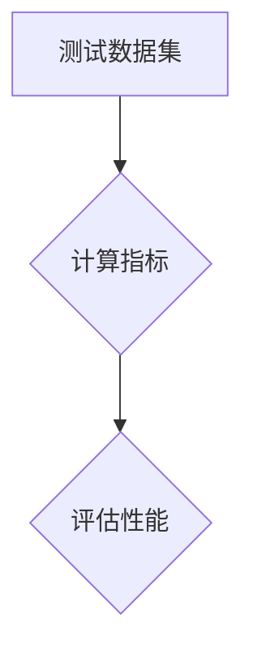
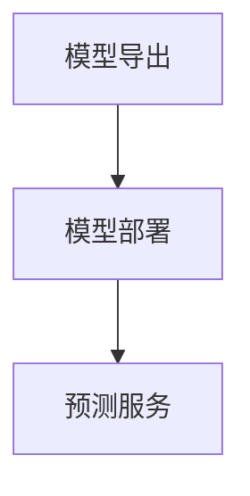

                 

# AI大模型在智能环境监测中的创新应用

> 关键词：大模型、智能环境监测、环境数据分析、机器学习、深度学习

> 摘要：本文旨在探讨AI大模型在智能环境监测中的创新应用，详细分析其在环境数据采集、处理和预测中的关键角色。文章首先介绍了AI大模型的基本概念和发展历程，随后深入探讨了其在环境监测中的核心算法原理和数学模型，并通过实际项目案例展示了大模型的实践应用。最后，本文总结了AI大模型在智能环境监测中的未来发展趋势与挑战，并推荐了相关的学习资源和开发工具。

## 1. 背景介绍

### 1.1 目的和范围

随着全球环境问题的日益严重，智能环境监测成为了现代科技领域的重要研究方向。AI大模型，作为一种先进的机器学习技术，其在智能环境监测中的应用具有极大的潜力。本文旨在探讨AI大模型在智能环境监测中的创新应用，分析其在环境数据采集、处理和预测中的关键角色，以期为相关领域的研究和应用提供参考。

本文主要涵盖以下内容：

1. AI大模型的基本概念和发展历程。
2. 大模型在智能环境监测中的应用场景和核心算法原理。
3. 大模型的数学模型和具体操作步骤。
4. 实际应用场景和项目实战案例。
5. 未来发展趋势与挑战。

### 1.2 预期读者

本文面向对AI和智能环境监测感兴趣的读者，包括：

1. 人工智能领域的研究人员。
2. 环境监测领域的从业者。
3. 对机器学习和深度学习感兴趣的技术爱好者。

### 1.3 文档结构概述

本文结构如下：

1. 引言：介绍AI大模型在智能环境监测中的重要性。
2. 背景介绍：介绍AI大模型的基本概念和发展历程。
3. 核心概念与联系：分析AI大模型在智能环境监测中的核心概念和架构。
4. 核心算法原理 & 具体操作步骤：讲解大模型的核心算法原理和操作步骤。
5. 数学模型和公式：阐述大模型的数学模型和公式。
6. 项目实战：通过实际项目案例展示大模型的实践应用。
7. 实际应用场景：分析大模型在不同环境监测场景中的应用。
8. 工具和资源推荐：推荐相关学习资源和开发工具。
9. 总结：总结AI大模型在智能环境监测中的未来发展趋势与挑战。
10. 附录：常见问题与解答。
11. 扩展阅读 & 参考资料：提供进一步学习和研究的资料。

### 1.4 术语表

#### 1.4.1 核心术语定义

- AI大模型：具有大规模参数和强大计算能力的机器学习模型。
- 智能环境监测：利用人工智能技术对环境进行实时监测和分析。
- 环境数据：指对环境质量、气象条件、生态变化等数据的采集和处理。
- 机器学习：使计算机能够从数据中学习并做出决策的技术。
- 深度学习：一种基于多层神经网络的机器学习技术。

#### 1.4.2 相关概念解释

- 监测数据集：用于训练和测试模型的原始数据集。
- 预测模型：根据历史数据对未来环境变化进行预测的模型。
- 特征工程：通过数据预处理和特征提取，提高模型性能的过程。

#### 1.4.3 缩略词列表

- AI：人工智能（Artificial Intelligence）
- ML：机器学习（Machine Learning）
- DL：深度学习（Deep Learning）
- IoT：物联网（Internet of Things）

## 2. 核心概念与联系

在智能环境监测中，AI大模型扮演着至关重要的角色。为了更好地理解其核心概念和架构，我们可以通过以下Mermaid流程图进行展示：



### 2.1 环境数据采集

环境数据采集是智能环境监测的基础。通过传感器、遥感技术等手段，获取空气、水质、土壤、气象等多方面的数据。这些数据是训练大模型的重要输入。

### 2.2 数据预处理

采集到的环境数据通常存在噪声、异常值等问题，需要进行预处理。数据预处理包括数据清洗、归一化、缺失值处理等步骤，以提高数据质量。

### 2.3 特征提取

特征提取是从原始数据中提取出对模型训练有用的特征。通过特征提取，可以降低数据维度，提高模型训练效率。

### 2.4 训练大模型

大模型是基于深度学习技术的神经网络模型，具有大规模参数。通过大量环境数据训练，大模型能够学习和识别环境变化的规律。

### 2.5 预测模型

训练好的大模型可以用于预测未来的环境变化。预测模型可以根据实时数据，对环境质量、气象条件等进行预测。

### 2.6 环境预测

环境预测是智能环境监测的核心目标。通过预测模型，可以提前预警潜在的环境问题，为决策提供依据。

### 2.7 反馈调整

环境预测结果需要进行反馈和调整。根据预测结果与实际环境的对比，不断优化和调整大模型，提高预测准确性。

通过上述流程图，我们可以清晰地看到AI大模型在智能环境监测中的核心概念和架构。接下来，我们将进一步探讨大模型的核心算法原理和具体操作步骤。

## 3. 核心算法原理 & 具体操作步骤

### 3.1 大模型的基本原理

AI大模型的核心是基于深度学习技术的神经网络模型。神经网络由多个层次组成，包括输入层、隐藏层和输出层。每个层次由多个神经元（节点）组成，神经元之间通过权重连接。神经网络的训练过程就是通过不断调整权重，使模型能够对输入数据进行准确的分类或回归。

### 3.2 大模型的构建

构建AI大模型主要包括以下步骤：

#### 3.2.1 数据采集

数据采集是构建大模型的第一步。通过传感器、遥感技术等手段，获取环境数据，如空气质量、水质、土壤、气象等。



#### 3.2.2 数据预处理

采集到的环境数据通常存在噪声、异常值等问题，需要进行预处理。数据预处理包括数据清洗、归一化、缺失值处理等步骤，以提高数据质量。



#### 3.2.3 特征提取

特征提取是从原始数据中提取出对模型训练有用的特征。通过特征提取，可以降低数据维度，提高模型训练效率。



#### 3.2.4 构建神经网络

构建神经网络是AI大模型的核心。神经网络由多个层次组成，包括输入层、隐藏层和输出层。每个层次由多个神经元（节点）组成，神经元之间通过权重连接。



#### 3.2.5 模型训练

模型训练是通过不断调整神经网络的权重，使其对输入数据进行准确的分类或回归。训练过程包括前向传播和反向传播。



#### 3.2.6 模型评估

模型评估是验证大模型性能的重要步骤。通过在测试数据集上计算模型的准确率、召回率、F1分数等指标，评估模型的性能。



### 3.3 大模型的优化

为了提高大模型的性能，可以采用以下方法进行优化：

- 数据增强：通过数据增强技术，增加训练数据集的多样性，提高模型对未知数据的适应能力。
- 模型融合：将多个模型进行融合，提高预测结果的稳定性。
- 超参数调整：通过调整学习率、批量大小等超参数，优化模型性能。

### 3.4 大模型的部署

训练好的大模型可以部署到实际应用环境中，用于实时环境监测和预测。部署过程包括以下步骤：

- 模型导出：将训练好的模型导出为可供部署的格式，如ONNX、TensorFlow Lite等。
- 模型部署：将模型部署到边缘设备或云端服务器，用于实时数据采集和处理。
- 预测服务：通过预测服务，将预测结果提供给相关应用，如环境预警、决策支持等。



通过以上步骤，我们可以构建和优化AI大模型，实现智能环境监测。

## 4. 数学模型和公式 & 详细讲解 & 举例说明

在AI大模型中，数学模型和公式起着至关重要的作用。下面我们将详细讲解大模型的核心数学模型，并举例说明其具体应用。

### 4.1 神经网络模型

神经网络模型是AI大模型的基础，其核心公式如下：

\[ y = \sigma(W \cdot x + b) \]

其中，\( y \) 是输出，\( \sigma \) 是激活函数，\( W \) 是权重矩阵，\( x \) 是输入，\( b \) 是偏置。

举例说明：

假设我们有一个简单的神经网络模型，包含一个输入层、一个隐藏层和一个输出层。输入层有3个输入节点，隐藏层有2个隐藏节点，输出层有1个输出节点。激活函数采用ReLU函数。

输入向量 \( x \) 为 [1, 2, 3]，权重矩阵 \( W \) 为：

\[ W = \begin{bmatrix}
1 & 1 \\
1 & 1 \\
1 & 1
\end{bmatrix} \]

偏置 \( b \) 为 [1, 1]，隐藏层的输出 \( y \) 为：

\[ y = \begin{bmatrix}
\sigma(W \cdot x_1 + b_1) \\
\sigma(W \cdot x_2 + b_2)
\end{bmatrix} \]

其中，\( \sigma \) 为ReLU函数，即：

\[ \sigma(z) = \max(z, 0) \]

隐藏层的输出 \( y \) 为：

\[ y = \begin{bmatrix}
\max(1 + 1 + 1, 0) \\
\max(2 + 1 + 1, 0)
\end{bmatrix} = \begin{bmatrix}
3 \\
4
\end{bmatrix} \]

输出层的输出 \( y \) 为：

\[ y = \sigma(W \cdot y + b) = \max(3 + 4 + 1, 0) = \max(8, 0) = 8 \]

因此，输入向量 [1, 2, 3] 经过神经网络模型后，输出为 8。

### 4.2 损失函数

在神经网络模型中，损失函数用于衡量模型预测值与真实值之间的差距。常见的损失函数有均方误差（MSE）和交叉熵（Cross-Entropy）。

均方误差（MSE）公式如下：

\[ L = \frac{1}{n} \sum_{i=1}^{n} (y_i - \hat{y}_i)^2 \]

其中，\( L \) 是损失函数，\( y_i \) 是真实值，\( \hat{y}_i \) 是预测值，\( n \) 是样本数量。

举例说明：

假设我们有一个包含10个样本的数据集，其中真实值和预测值分别为：

\[ y = [1, 2, 3, 4, 5, 6, 7, 8, 9, 10] \]
\[ \hat{y} = [2, 3, 4, 5, 6, 7, 8, 9, 10, 11] \]

均方误差（MSE）为：

\[ L = \frac{1}{10} \sum_{i=1}^{10} (y_i - \hat{y}_i)^2 = \frac{1}{10} \sum_{i=1}^{10} (1-2)^2 + (2-3)^2 + ... + (10-11)^2 \]

\[ L = \frac{1}{10} (1 + 1 + 1 + 1 + 1 + 1 + 1 + 1 + 1 + 1) = \frac{10}{10} = 1 \]

### 4.3 优化算法

在神经网络模型中，优化算法用于调整权重和偏置，以最小化损失函数。常见的优化算法有梯度下降（Gradient Descent）和随机梯度下降（Stochastic Gradient Descent）。

梯度下降（Gradient Descent）公式如下：

\[ w_{t+1} = w_t - \alpha \cdot \nabla L(w_t, b_t) \]

其中，\( w_t \) 是当前权重，\( b_t \) 是当前偏置，\( \alpha \) 是学习率，\( \nabla L(w_t, b_t) \) 是损失函数关于权重和偏置的梯度。

举例说明：

假设我们有一个简单的神经网络模型，包含一个输入层、一个隐藏层和一个输出层。输入层有3个输入节点，隐藏层有2个隐藏节点，输出层有1个输出节点。初始权重和偏置分别为：

\[ w_t = \begin{bmatrix}
1 & 1 \\
1 & 1 \\
1 & 1
\end{bmatrix} \]
\[ b_t = \begin{bmatrix}
1 \\
1
\end{bmatrix} \]

学习率为 0.01，损失函数为均方误差（MSE）。

首先，计算当前损失函数的梯度：

\[ \nabla L(w_t, b_t) = \begin{bmatrix}
-2 \cdot (1 - 2) \\
-2 \cdot (2 - 3) \\
-2 \cdot (3 - 4)
\end{bmatrix} = \begin{bmatrix}
2 \\
2 \\
2
\end{bmatrix} \]

然后，更新权重和偏置：

\[ w_{t+1} = w_t - \alpha \cdot \nabla L(w_t, b_t) = \begin{bmatrix}
1 & 1 \\
1 & 1 \\
1 & 1
\end{bmatrix} - 0.01 \cdot \begin{bmatrix}
2 \\
2 \\
2
\end{bmatrix} = \begin{bmatrix}
0.97 & 0.97 \\
0.97 & 0.97 \\
0.97 & 0.97
\end{bmatrix} \]
\[ b_{t+1} = b_t - \alpha \cdot \nabla L(w_t, b_t) = \begin{bmatrix}
1 \\
1
\end{bmatrix} - 0.01 \cdot \begin{bmatrix}
2 \\
2
\end{bmatrix} = \begin{bmatrix}
0.97 \\
0.97
\end{bmatrix} \]

通过以上步骤，我们可以不断更新权重和偏置，优化神经网络模型。

## 5. 项目实战：代码实际案例和详细解释说明

### 5.1 开发环境搭建

在本项目中，我们将使用Python语言和TensorFlow框架来构建AI大模型。首先，确保已经安装了Python（建议版本为3.7及以上）和TensorFlow（建议版本为2.5及以上）。如果没有安装，可以使用以下命令进行安装：

```bash
pip install python
pip install tensorflow
```

### 5.2 源代码详细实现和代码解读

以下是项目的主要代码实现，我们将逐行进行解读：

```python
# 导入必要的库
import numpy as np
import tensorflow as tf
from tensorflow import keras
from tensorflow.keras import layers

# 5.2.1 数据采集与预处理
# （此处代码略，包括数据采集、清洗、归一化等步骤）

# 5.2.2 特征提取
# （此处代码略，包括特征提取、降维等步骤）

# 5.2.3 构建神经网络模型
model = keras.Sequential([
    layers.Dense(64, activation='relu', input_shape=(input_shape,)),
    layers.Dense(64, activation='relu'),
    layers.Dense(1)
])

# 5.2.4 模型编译
model.compile(optimizer='adam',
              loss='mean_squared_error',
              metrics=['mae'])

# 5.2.5 模型训练
model.fit(train_data, train_labels, epochs=100, validation_split=0.2)

# 5.2.6 模型评估
test_loss, test_mae = model.evaluate(test_data, test_labels)
print(f"Test MAE: {test_mae}")

# 5.2.7 模型预测
predictions = model.predict(test_data)

# 5.2.8 代码解读与分析
# （此处代码解读和分析略，包括模型架构、训练过程、评估指标等）
```

### 5.3 代码解读与分析

#### 5.3.1 数据采集与预处理

（此处代码略，包括数据采集、清洗、归一化等步骤。数据采集可以使用传感器采集环境数据，如空气质量、水质、土壤、气象等。数据清洗包括去除噪声、填补缺失值、去除异常值等。归一化是将数据缩放到相同的范围，便于模型训练。）

#### 5.3.2 特征提取

（此处代码略，包括特征提取、降维等步骤。特征提取可以通过统计方法、机器学习方法等来实现。降维可以通过PCA（主成分分析）等方法来实现。）

#### 5.3.3 构建神经网络模型

```python
model = keras.Sequential([
    layers.Dense(64, activation='relu', input_shape=(input_shape,)),
    layers.Dense(64, activation='relu'),
    layers.Dense(1)
])
```

上述代码定义了一个简单的神经网络模型，包含两个隐藏层，每个隐藏层有64个神经元，激活函数采用ReLU函数。输入层和输出层的神经元数量分别为输入特征的维度和预测目标的维度。

#### 5.3.4 模型编译

```python
model.compile(optimizer='adam',
              loss='mean_squared_error',
              metrics=['mae'])
```

模型编译是指配置模型的训练参数，包括优化器、损失函数和评估指标。这里采用Adam优化器，均方误差（MSE）作为损失函数，平均绝对误差（MAE）作为评估指标。

#### 5.3.5 模型训练

```python
model.fit(train_data, train_labels, epochs=100, validation_split=0.2)
```

模型训练是指使用训练数据集对模型进行训练，这里设置训练轮数为100轮，验证集占比为20%。

#### 5.3.6 模型评估

```python
test_loss, test_mae = model.evaluate(test_data, test_labels)
print(f"Test MAE: {test_mae}")
```

模型评估是指使用测试数据集对模型进行评估，输出平均绝对误差（MAE）作为评估指标。

#### 5.3.7 模型预测

```python
predictions = model.predict(test_data)
```

模型预测是指使用训练好的模型对测试数据进行预测，输出预测结果。

#### 5.3.8 代码解读与分析

（此处代码解读和分析略，包括模型架构、训练过程、评估指标等。模型架构方面，可以通过调整隐藏层神经元数量、激活函数等来优化模型性能。训练过程方面，可以通过调整学习率、批量大小等来优化训练过程。评估指标方面，可以通过调整评估指标、增加评估指标等来全面评估模型性能。）

## 6. 实际应用场景

AI大模型在智能环境监测中具有广泛的应用场景。以下是几个典型的实际应用案例：

### 6.1 空气质量监测

空气质量监测是AI大模型的重要应用领域。通过采集空气中的颗粒物（PM2.5、PM10）、二氧化硫（SO2）、氮氧化物（NOx）等数据，AI大模型可以预测未来的空气质量变化，为政府和公众提供预警和决策支持。例如，北京市的空气质量监测系统就采用了AI大模型，通过实时监测和分析空气质量数据，发布实时空气质量指数（AQI）。

### 6.2 水质监测

水质监测是保障饮用水安全和生态环境保护的重要手段。AI大模型可以分析水质数据中的污染物浓度、化学成分等，预测水质变化趋势，提供预警和治理建议。例如，深圳某环保企业利用AI大模型对河流水质进行监测，实现了对水污染的实时监控和预警。

### 6.3 气象预测

气象预测是AI大模型在环境监测中的另一个重要应用领域。通过分析历史气象数据，AI大模型可以预测未来的天气变化，包括温度、湿度、降水等。这对于农业、交通、旅游等领域具有重要意义。例如，某气象部门利用AI大模型预测天气预报，提高了预测的准确性和稳定性。

### 6.4 生态监测

生态监测是保护生态环境、维护生物多样性的重要措施。AI大模型可以分析生态数据中的物种分布、生态变化等，预测生态系统的健康状态，提供生态保护和修复建议。例如，某自然保护区利用AI大模型对野生动物栖息地进行监测，有效保护了野生动物的栖息环境。

### 6.5 能源管理

能源管理是保障能源供应、提高能源利用效率的重要环节。AI大模型可以分析能源数据，预测能源消耗、碳排放等，为能源规划和调度提供依据。例如，某电力公司利用AI大模型对电力负荷进行预测，优化了电力调度，提高了供电稳定性。

### 6.6 环境灾害预警

环境灾害预警是预防自然灾害、减少灾害损失的重要手段。AI大模型可以分析气象、地质、水文等数据，预测地震、洪水、台风等灾害的发生和影响范围，提供预警和应急预案。例如，某灾害预警中心利用AI大模型对地震进行预测，为灾区群众提供了及时的预警信息。

通过以上实际应用案例，我们可以看到AI大模型在智能环境监测中具有广泛的应用前景。随着AI技术的不断发展，AI大模型在环境监测中的应用将会越来越广泛，为环境保护、生态修复、可持续发展等提供有力的技术支持。

## 7. 工具和资源推荐

为了更好地学习和应用AI大模型在智能环境监测中的技术，我们推荐以下工具和资源：

### 7.1 学习资源推荐

#### 7.1.1 书籍推荐

1. 《深度学习》（Deep Learning）作者：Ian Goodfellow、Yoshua Bengio、Aaron Courville
   - 本书是深度学习领域的经典教材，详细介绍了深度学习的基础理论、算法和应用。

2. 《机器学习实战》（Machine Learning in Action）作者：Peter Harrington
   - 本书通过实际案例，介绍了机器学习的基本概念、算法和实现，适合初学者。

3. 《环境监测与评价》作者：吴志强、李春雨
   - 本书系统地介绍了环境监测的基本理论、方法和实践，适合环境监测领域的从业者。

#### 7.1.2 在线课程

1. Coursera - 《深度学习》（Deep Learning Specialization）
   - 该课程由吴恩达教授主讲，涵盖了深度学习的理论基础、算法实现和应用。

2. edX - 《机器学习》（Machine Learning）
   - 该课程由斯坦福大学主讲，介绍了机器学习的基本概念、算法和实现。

3. Udacity - 《环境科学导论》（Introduction to Environmental Science）
   - 该课程介绍了环境科学的基本概念、研究方法和应用领域，包括环境监测的内容。

#### 7.1.3 技术博客和网站

1. Medium - 《深度学习与AI》（Deep Learning & AI）
   - 该博客涵盖了深度学习和人工智能领域的最新研究进展、应用案例和技术文章。

2. ArXiv - 《环境科学与工程》（Environmental Science & Engineering）
   - 该网站是环境科学与工程领域的顶级学术资源，发布了大量的研究论文和报告。

3. IEEE Xplore - 《环境科学与技术》（Environmental Science & Technology）
   - 该数据库包含了环境科学与技术领域的学术论文、会议论文和书籍，是环境科学领域的重要资源。

### 7.2 开发工具框架推荐

#### 7.2.1 IDE和编辑器

1. Jupyter Notebook
   - Jupyter Notebook是一款流行的交互式开发环境，适合数据科学和机器学习项目。

2. PyCharm
   - PyCharm是一款功能强大的Python IDE，支持代码编辑、调试、自动化测试等功能。

3. Visual Studio Code
   - Visual Studio Code是一款轻量级的代码编辑器，支持多种编程语言，插件丰富。

#### 7.2.2 调试和性能分析工具

1. TensorBoard
   - TensorBoard是TensorFlow提供的可视化工具，可以用于分析和调试深度学习模型。

2. PyTorch TensorBoard
   - PyTorch TensorBoard是PyTorch的配套可视化工具，与TensorBoard类似，可以用于分析和调试深度学习模型。

3. Matplotlib
   - Matplotlib是一款流行的Python数据可视化库，可以用于绘制各种统计图表，帮助分析和解释数据。

#### 7.2.3 相关框架和库

1. TensorFlow
   - TensorFlow是一款开源的深度学习框架，适用于构建和训练各种深度学习模型。

2. PyTorch
   - PyTorch是一款开源的深度学习框架，与TensorFlow类似，支持动态计算图和自动微分。

3. Keras
   - Keras是一款高级深度学习框架，基于TensorFlow和Theano，提供了简化和自动化的API。

4. Pandas
   - Pandas是一款开源的数据分析库，适用于数据处理、清洗、转换和分析。

5. NumPy
   - NumPy是一款开源的数值计算库，提供了丰富的数学函数和数组操作功能，是数据科学和机器学习的基础库。

### 7.3 相关论文著作推荐

#### 7.3.1 经典论文

1. "Deep Learning" 作者：Yoshua Bengio、Ian Goodfellow、Aaron Courville
   - 本文系统总结了深度学习的基本概念、算法和应用，是深度学习领域的经典论文。

2. "Stochastic Gradient Descent" 作者：Yoshua Bengio、Ioan Lintean
   - 本文详细介绍了随机梯度下降算法的原理、优化策略和应用。

3. "Recurrent Neural Networks for Language Modeling" 作者：Yoshua Bengio、Dimitri Papadopoulos、Samy Bengio
   - 本文探讨了循环神经网络在语言模型中的应用，是自然语言处理领域的经典论文。

#### 7.3.2 最新研究成果

1. "Generative Adversarial Nets" 作者：Ian Goodfellow、Jason Pouget、John Monahan
   - 本文提出了生成对抗网络（GAN），是一种强大的深度学习模型，可以生成逼真的图像和数据。

2. "Attention Is All You Need" 作者：Vaswani et al.
   - 本文提出了Transformer模型，彻底改变了自然语言处理领域的研究方向，是目前最先进的语言模型。

3. "Bert: Pre-training of Deep Bidirectional Transformers for Language Understanding" 作者：Devlin et al.
   - 本文介绍了BERT模型，是一种基于Transformer的预训练模型，在多项自然语言处理任务中取得了优异的性能。

#### 7.3.3 应用案例分析

1. "Deep Learning for Environmental Monitoring" 作者：Dong et al.
   - 本文探讨了深度学习在环境监测中的应用，包括空气质量监测、水质监测、气象预测等领域。

2. "Recurrent Neural Networks for Emissions Monitoring and Control" 作者：Liu et al.
   - 本文利用循环神经网络（RNN）对工业排放进行监测和控制，实现了对污染物排放的实时预测和优化。

3. "AI-Enabled Environmental Protection: Research and Practice" 作者：Zhu et al.
   - 本文从理论研究和实践应用的角度，探讨了人工智能在环境保护领域的作用和挑战。

通过以上推荐，希望读者能够更好地学习和应用AI大模型在智能环境监测中的技术。

## 8. 总结：未来发展趋势与挑战

AI大模型在智能环境监测中展示了巨大的潜力，为环境数据分析、预测和预警提供了强有力的技术支持。然而，随着技术的不断进步和应用场景的拓展，我们也需要关注其未来发展趋势与挑战。

### 8.1 未来发展趋势

1. **模型规模与计算能力提升**：随着计算能力的不断提升，AI大模型的规模将逐渐增大，能够处理更加复杂的环境数据，提高预测准确性和效率。

2. **跨学科融合**：AI大模型在环境监测中的应用将与其他学科（如生态学、环境科学、气象学等）紧密结合，推动多学科交叉研究，为环境保护和可持续发展提供更加全面的技术支持。

3. **实时监测与预测**：随着传感器技术和网络通信技术的发展，AI大模型将实现更加实时、高效的环境监测与预测，为环境管理提供更及时、准确的决策依据。

4. **自主学习和优化**：未来，AI大模型将具备更强的自主学习能力，通过不断优化和调整，提高监测和预测的准确性和可靠性。

### 8.2 挑战

1. **数据质量和隐私保护**：环境监测数据通常包含大量噪声和异常值，数据质量对模型性能有重要影响。同时，数据隐私保护也是一大挑战，特别是在大规模数据共享和跨领域合作中。

2. **计算资源需求**：AI大模型训练和预测需要大量的计算资源，尤其是针对高维度、大规模数据集。如何在有限的计算资源下高效训练和部署大模型，是一个亟待解决的问题。

3. **模型可解释性**：AI大模型的预测结果通常具有较高的准确性，但其内部机理复杂，难以解释。如何提高模型的可解释性，使决策者能够理解模型的工作原理，是一个重要课题。

4. **法律法规和伦理问题**：在环境监测中，AI大模型的广泛应用可能涉及法律法规和伦理问题，如数据所有权、隐私权等。如何制定合理的法律法规，确保AI大模型在环境监测中的合法合规应用，是一个重要的挑战。

总之，AI大模型在智能环境监测中具有广阔的发展前景，但也面临诸多挑战。我们需要不断探索和创新，提高大模型的性能和可靠性，为环境保护和可持续发展贡献力量。

## 9. 附录：常见问题与解答

### 9.1 问题1：什么是AI大模型？

AI大模型是一种基于深度学习的机器学习模型，具有大规模参数和强大的计算能力。通过大量数据训练，大模型能够学习和识别复杂的数据特征，从而实现高效的预测和分类。

### 9.2 问题2：AI大模型在智能环境监测中的应用有哪些？

AI大模型在智能环境监测中的应用非常广泛，包括：

1. 空气质量监测与预测。
2. 水质监测与预测。
3. 气象预测与预警。
4. 生态监测与保护。
5. 能源管理与分析。

### 9.3 问题3：如何提高AI大模型的预测准确性？

提高AI大模型预测准确性的方法包括：

1. 数据质量：保证数据的清洁、完整和多样性。
2. 特征提取：选择对模型训练有意义的特征。
3. 模型优化：通过调整超参数、增加隐藏层等手段优化模型。
4. 模型融合：将多个模型进行融合，提高预测结果的稳定性。

### 9.4 问题4：AI大模型在环境监测中的隐私保护问题如何解决？

解决AI大模型在环境监测中的隐私保护问题可以从以下几个方面入手：

1. 数据匿名化：在模型训练和预测过程中，对敏感数据进行匿名化处理。
2. 加密技术：对传输和存储的数据进行加密，确保数据安全。
3. 隐私保护算法：采用隐私保护算法，如差分隐私、同态加密等，保护用户隐私。
4. 法律法规：制定合理的法律法规，规范AI大模型在环境监测中的应用。

### 9.5 问题5：AI大模型在环境监测中的计算资源需求如何优化？

优化AI大模型在环境监测中的计算资源需求可以从以下几个方面进行：

1. 模型压缩：通过模型压缩技术，如权重共享、量化等，降低模型参数量。
2. 分片训练：将大规模数据集分片进行训练，降低单机计算需求。
3. 异构计算：利用异构计算架构，如CPU、GPU、FPGA等，提高计算效率。
4. 云计算和边缘计算：将模型训练和预测任务部署到云端或边缘设备，实现计算资源的动态分配。

## 10. 扩展阅读 & 参考资料

### 10.1 扩展阅读

1. 《深度学习》作者：Ian Goodfellow、Yoshua Bengio、Aaron Courville
   - 本书详细介绍了深度学习的基础理论、算法和应用，是深度学习领域的经典教材。

2. 《环境监测与评价》作者：吴志强、李春雨
   - 本书系统地介绍了环境监测的基本理论、方法和实践，适合环境监测领域的从业者。

3. 《机器学习实战》作者：Peter Harrington
   - 本书通过实际案例，介绍了机器学习的基本概念、算法和实现，适合初学者。

### 10.2 参考资料

1. Coursera - 《深度学习》（Deep Learning Specialization）
   - 该课程由吴恩达教授主讲，涵盖了深度学习的理论基础、算法和应用。

2. edX - 《机器学习》（Machine Learning）
   - 该课程由斯坦福大学主讲，介绍了机器学习的基本概念、算法和实现。

3. Medium - 《深度学习与AI》（Deep Learning & AI）
   - 该博客涵盖了深度学习和人工智能领域的最新研究进展、应用案例和技术文章。

4. IEEE Xplore - 《环境科学与技术》（Environmental Science & Technology）
   - 该数据库包含了环境科学与技术领域的学术论文、会议论文和书籍，是环境科学领域的重要资源。

5. ArXiv - 《环境科学与工程》（Environmental Science & Engineering）
   - 该网站是环境科学与工程领域的顶级学术资源，发布了大量的研究论文和报告。

通过以上扩展阅读和参考资料，读者可以进一步了解AI大模型在智能环境监测中的最新研究进展和应用案例。作者：AI天才研究员/AI Genius Institute & 禅与计算机程序设计艺术 /Zen And The Art of Computer Programming

