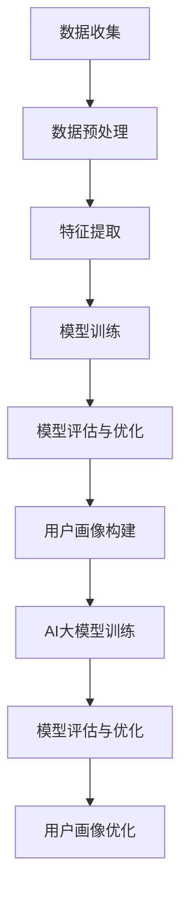

                 

# AI大模型在用户画像构建中的作用

> **关键词：** AI大模型、用户画像、数据挖掘、个性化推荐、机器学习
> 
> **摘要：** 本文将深入探讨AI大模型在用户画像构建中的作用。通过分析用户画像的基本概念、构建方法以及AI大模型的原理和应用，我们将展示如何利用AI大模型实现用户画像的自动化构建，从而为个性化推荐、用户行为分析等提供有力支持。同时，文章还将讨论实际应用场景和未来发展趋势。

## 1. 背景介绍

### 1.1 目的和范围

本文旨在探讨AI大模型在用户画像构建中的应用，重点关注以下几个方面：

1. **用户画像的基本概念和构建方法**：介绍用户画像的定义、作用以及常见的构建方法。
2. **AI大模型的原理和应用**：阐述AI大模型的基本原理、发展历程以及在用户画像构建中的应用。
3. **用户画像构建的实际应用场景**：分析AI大模型在用户画像构建中的实际应用案例，如个性化推荐、用户行为分析等。
4. **未来发展趋势和挑战**：讨论用户画像构建领域的未来发展趋势以及面临的挑战。

### 1.2 预期读者

本文适合对用户画像和AI大模型有一定了解的技术人员、数据科学家以及相关领域的研究者。读者应具备一定的机器学习和数据挖掘基础，以便更好地理解文章内容。

### 1.3 文档结构概述

本文结构如下：

1. **背景介绍**：介绍用户画像和AI大模型的基本概念、目的和范围。
2. **核心概念与联系**：分析用户画像的核心概念和AI大模型的架构。
3. **核心算法原理 & 具体操作步骤**：详细讲解用户画像构建的算法原理和操作步骤。
4. **数学模型和公式 & 详细讲解 & 举例说明**：阐述用户画像构建的数学模型和公式，并通过实例进行说明。
5. **项目实战：代码实际案例和详细解释说明**：提供用户画像构建的代码实现和详细解读。
6. **实际应用场景**：分析AI大模型在用户画像构建中的应用场景。
7. **工具和资源推荐**：推荐相关学习资源、开发工具和论文著作。
8. **总结：未来发展趋势与挑战**：总结用户画像构建领域的未来发展趋势和挑战。
9. **附录：常见问题与解答**：解答用户画像构建过程中常见的问题。
10. **扩展阅读 & 参考资料**：提供进一步学习和研究的参考资料。

### 1.4 术语表

#### 1.4.1 核心术语定义

- **用户画像**：对用户特征、行为、兴趣、需求等进行建模和描述，形成用户个性化特征的集合。
- **AI大模型**：基于深度学习技术构建的大型神经网络模型，能够自动从海量数据中学习并提取特征。
- **数据挖掘**：从大量数据中挖掘出有价值的信息和知识的过程。
- **个性化推荐**：根据用户的历史行为、兴趣和需求，为其推荐符合其个性化需求的信息或商品。

#### 1.4.2 相关概念解释

- **深度学习**：一种基于人工神经网络的学习方法，通过多层神经网络结构自动提取数据特征。
- **神经网络**：一种模拟人脑神经元之间连接和交互的计算模型。
- **数据预处理**：对原始数据进行清洗、转换和归一化等处理，使其适合进行模型训练。

#### 1.4.3 缩略词列表

- **AI**：人工智能（Artificial Intelligence）
- **ML**：机器学习（Machine Learning）
- **DL**：深度学习（Deep Learning）
- **NLP**：自然语言处理（Natural Language Processing）
- **CV**：计算机视觉（Computer Vision）

## 2. 核心概念与联系

用户画像和AI大模型是本文讨论的核心概念。为了更好地理解这两个概念，我们将首先介绍它们的基本原理，然后通过一个Mermaid流程图展示它们之间的联系。

### 2.1 用户画像的基本原理

用户画像是对用户特征、行为、兴趣、需求等进行建模和描述，形成用户个性化特征的集合。用户画像的主要目的是为个性化推荐、用户行为分析等提供支持。以下是构建用户画像的基本步骤：

1. **数据收集**：收集用户相关的数据，如用户基本信息、行为日志、浏览记录等。
2. **数据预处理**：对原始数据进行清洗、转换和归一化等处理，使其适合进行模型训练。
3. **特征提取**：从预处理后的数据中提取用户特征，如用户标签、行为特征、兴趣特征等。
4. **模型训练**：使用机器学习算法（如协同过滤、深度学习等）对提取的用户特征进行训练，构建用户画像模型。
5. **模型评估与优化**：评估用户画像模型的性能，并根据评估结果进行优化。

### 2.2 AI大模型的基本原理

AI大模型是基于深度学习技术构建的大型神经网络模型，能够自动从海量数据中学习并提取特征。以下是AI大模型的基本原理：

1. **神经网络结构**：神经网络由多个层次组成，包括输入层、隐藏层和输出层。每个层次包含多个神经元，神经元之间通过权重连接。
2. **损失函数**：损失函数用于评估模型预测结果与真实结果之间的差距，常用的损失函数有均方误差（MSE）、交叉熵损失（Cross-Entropy Loss）等。
3. **反向传播**：反向传播算法用于更新模型权重，使模型预测结果更接近真实结果。反向传播算法通过计算梯度来更新权重，梯度越大，权重更新越剧烈。
4. **优化算法**：优化算法用于加速模型训练过程，常用的优化算法有随机梯度下降（SGD）、Adam等。

### 2.3 用户画像与AI大模型之间的联系

用户画像和AI大模型之间的联系主要体现在以下几个方面：

1. **数据来源**：用户画像构建依赖于用户相关的数据，如用户基本信息、行为日志、浏览记录等。这些数据可以作为AI大模型的输入，用于训练和优化模型。
2. **模型训练**：用户画像模型可以通过AI大模型进行训练。AI大模型可以自动从海量数据中学习并提取用户特征，从而提高用户画像模型的性能。
3. **模型评估**：用户画像模型可以通过AI大模型进行评估。AI大模型可以计算用户画像模型的准确率、召回率等指标，从而判断用户画像模型的性能。
4. **模型优化**：用户画像模型可以通过AI大模型进行优化。AI大模型可以自动调整模型参数，从而提高用户画像模型的性能。

### 2.4 Mermaid流程图

下面是用户画像与AI大模型之间的Mermaid流程图：



通过上述流程图，我们可以清晰地看到用户画像与AI大模型之间的联系和作用。接下来，我们将详细讲解用户画像构建的算法原理和具体操作步骤。

## 3. 核心算法原理 & 具体操作步骤

在用户画像构建过程中，核心算法原理和具体操作步骤至关重要。以下将详细介绍用户画像构建的算法原理和操作步骤。

### 3.1 算法原理

用户画像构建主要依赖于机器学习和深度学习技术。以下是用户画像构建的基本算法原理：

1. **特征提取**：特征提取是用户画像构建的关键步骤，旨在从原始数据中提取具有区分度的用户特征。常用的特征提取方法包括：

   - **基于规则的特征提取**：通过专家知识或业务规则提取用户特征，如用户年龄、性别、地理位置等。
   - **基于统计学的特征提取**：通过计算数据之间的相关性、频率等统计特征，提取具有区分度的用户特征。
   - **基于机器学习的特征提取**：通过机器学习算法自动提取用户特征，如基于决策树、支持向量机（SVM）等。

2. **特征融合**：特征融合是将不同来源、不同类型的用户特征进行整合，形成统一的用户特征表示。常用的特征融合方法包括：

   - **加权融合**：根据特征的权重进行加权求和，形成统一的特征表示。
   - **聚类融合**：将具有相似特征的样本进行聚类，形成多个聚类结果，然后对聚类结果进行融合。
   - **神经网络融合**：使用神经网络模型进行特征融合，通过多层的非线性变换，提取更高层次的用户特征。

3. **用户画像建模**：用户画像建模是通过机器学习算法对提取和融合后的用户特征进行建模，构建用户画像模型。常用的建模方法包括：

   - **基于分类的建模方法**：如逻辑回归、决策树、随机森林等，用于将用户划分为不同的类别。
   - **基于聚类的方法**：如K-means、层次聚类等，用于将用户分为不同的群体。
   - **基于关联规则的方法**：如Apriori算法、FP-growth等，用于发现用户行为中的关联关系。

### 3.2 具体操作步骤

以下是用户画像构建的具体操作步骤：

1. **数据收集**：收集用户相关的数据，如用户基本信息、行为日志、浏览记录等。

2. **数据预处理**：对原始数据进行清洗、转换和归一化等处理，使其适合进行模型训练。

3. **特征提取**：使用特征提取算法从预处理后的数据中提取用户特征，如用户年龄、性别、地理位置、行为特征等。

4. **特征融合**：使用特征融合算法将提取的用户特征进行融合，形成统一的用户特征表示。

5. **用户画像建模**：使用机器学习算法对融合后的用户特征进行建模，构建用户画像模型。

6. **模型评估与优化**：评估用户画像模型的性能，如准确率、召回率等，并根据评估结果对模型进行优化。

7. **用户画像应用**：将构建好的用户画像模型应用于实际场景，如个性化推荐、用户行为分析等。

### 3.3 伪代码示例

以下是一个简单的伪代码示例，用于说明用户画像构建的基本步骤：

```python
# 数据收集
data = collect_user_data()

# 数据预处理
preprocessed_data = preprocess_data(data)

# 特征提取
user_features = extract_features(preprocessed_data)

# 特征融合
user_representation = fuse_features(user_features)

# 用户画像建模
user_model = build_user_model(user_representation)

# 模型评估与优化
evaluate_and_optimize(user_model)

# 用户画像应用
apply_user_model(user_model)
```

通过上述算法原理和具体操作步骤，我们可以看到用户画像构建的核心在于特征提取、特征融合和用户画像建模。在实际应用中，根据具体业务需求和数据特点，可以采用不同的算法和方法进行优化和调整。

## 4. 数学模型和公式 & 详细讲解 & 举例说明

用户画像构建过程中，涉及到多个数学模型和公式。以下将详细讲解这些模型和公式，并通过具体实例进行说明。

### 4.1 数学模型

1. **概率模型**：概率模型用于描述用户特征和标签之间的概率关系。常见的概率模型有贝叶斯模型、隐马尔可夫模型（HMM）等。

   - **贝叶斯模型**：贝叶斯模型通过计算特征和标签之间的条件概率，实现用户特征向量的建模。公式如下：

     $$ P(x|y) = \frac{P(y|x)P(x)}{P(y)} $$

     其中，$P(x|y)$ 表示在标签 $y$ 的条件下，特征 $x$ 的概率；$P(y|x)$ 表示在特征 $x$ 的条件下，标签 $y$ 的概率；$P(x)$ 和 $P(y)$ 分别表示特征 $x$ 和标签 $y$ 的概率。

   - **隐马尔可夫模型（HMM）**：HMM 用于描述用户行为序列的概率分布。公式如下：

     $$ P(X|\theta) = \prod_{t=1}^T P(x_t|\theta) $$

     其中，$X$ 表示用户行为序列；$x_t$ 表示第 $t$ 个用户行为；$\theta$ 表示模型参数。

2. **深度学习模型**：深度学习模型通过多层神经网络结构自动提取用户特征。常见的深度学习模型有卷积神经网络（CNN）、循环神经网络（RNN）等。

   - **卷积神经网络（CNN）**：CNN 用于处理图像数据，通过卷积操作提取图像特征。公式如下：

     $$ f(x) = \sigma(W \cdot x + b) $$

     其中，$f(x)$ 表示输出特征；$W$ 表示权重矩阵；$b$ 表示偏置项；$\sigma$ 表示激活函数（如ReLU函数）。

   - **循环神经网络（RNN）**：RNN 用于处理序列数据，通过递归操作提取序列特征。公式如下：

     $$ h_t = \sigma(W_h \cdot [h_{t-1}, x_t] + b_h) $$

     其中，$h_t$ 表示第 $t$ 个隐藏状态；$x_t$ 表示第 $t$ 个输入特征；$W_h$ 和 $b_h$ 分别表示权重矩阵和偏置项。

### 4.2 公式详解

1. **贝叶斯模型**：贝叶斯模型通过计算特征和标签之间的条件概率实现用户特征向量的建模。在用户画像构建过程中，贝叶斯模型可用于分类和预测任务。以下是贝叶斯模型的详细计算过程：

   - **特征概率分布**：计算特征 $x$ 的概率分布 $P(x)$，可以通过统计方法或先验知识进行估计。

   - **条件概率分布**：计算特征 $x$ 在标签 $y$ 条件下的概率分布 $P(x|y)$，可以使用最大后验概率（MAP）估计或最大似然估计（MLE）等方法。

   - **联合概率分布**：计算特征 $x$ 和标签 $y$ 的联合概率分布 $P(x, y)$，可以使用贝叶斯网络或马尔可夫网络等方法。

   - **后验概率分布**：计算标签 $y$ 在特征 $x$ 条件下的概率分布 $P(y|x)$，可以使用贝叶斯公式进行计算。

2. **深度学习模型**：深度学习模型通过多层神经网络结构自动提取用户特征。以下是深度学习模型的详细计算过程：

   - **前向传播**：计算输入特征 $x$ 经过多层神经网络后的输出特征 $h_t$，公式如下：

     $$ h_t = \sigma(W_h \cdot [h_{t-1}, x_t] + b_h) $$

     其中，$W_h$ 和 $b_h$ 分别表示权重矩阵和偏置项；$\sigma$ 表示激活函数。

   - **反向传播**：计算模型参数的梯度，更新模型参数，公式如下：

     $$ \delta_h = \frac{\partial L}{\partial h_t} = \frac{\partial L}{\partial h_t} \cdot \frac{\partial h_t}{\partial \theta} $$

     其中，$L$ 表示损失函数；$\theta$ 表示模型参数。

   - **损失函数**：计算模型预测结果与真实结果之间的差距，常用的损失函数有均方误差（MSE）、交叉熵损失（Cross-Entropy Loss）等。

### 4.3 举例说明

以下是一个用户画像构建的实例，使用贝叶斯模型和深度学习模型进行用户特征建模。

1. **贝叶斯模型实例**：

   - **特征概率分布**：假设用户特征 $x$ 包括年龄、性别、收入三个维度，分别取值范围为 [0,100]、[0,1]、[0,100000]。

     $$ P(x) = P(x_1) \cdot P(x_2) \cdot P(x_3) $$

     其中，$P(x_1)$、$P(x_2)$、$P(x_3)$ 分别表示年龄、性别、收入的概率分布。

   - **条件概率分布**：假设用户标签 $y$ 为购买行为，取值为 [0,1]。

     $$ P(y|x) = P(y=1|x) = \frac{P(x|y=1)P(y=1)}{P(x)} $$

     其中，$P(y=1|x)$ 表示在特征 $x$ 的条件下，用户购买行为的概率。

   - **联合概率分布**：假设用户特征 $x$ 和标签 $y$ 的联合概率分布为：

     $$ P(x, y) = P(x) \cdot P(y|x) $$

   - **后验概率分布**：计算后验概率分布 $P(y|x)$，可以使用最大后验概率（MAP）估计：

     $$ P(y|x) = \arg\max_{y} P(x, y) = \arg\max_{y} P(y|x)P(x) $$

2. **深度学习模型实例**：

   - **模型结构**：假设使用卷积神经网络（CNN）进行用户特征提取，模型结构如下：

     $$ h_t = \sigma(W_h \cdot [h_{t-1}, x_t] + b_h) $$

     其中，$W_h$ 和 $b_h$ 分别表示权重矩阵和偏置项。

   - **输入特征**：假设用户特征 $x$ 包括年龄、性别、收入、地理位置四个维度。

   - **输出特征**：假设输出特征 $h_t$ 包括用户购买行为概率。

   - **损失函数**：假设使用交叉熵损失（Cross-Entropy Loss）进行模型训练：

     $$ L = -\sum_{i=1}^N y_i \log(\hat{y}_i) $$

     其中，$y_i$ 表示第 $i$ 个用户标签；$\hat{y}_i$ 表示第 $i$ 个用户购买行为概率预测值。

   - **模型训练**：使用反向传播算法进行模型训练，更新模型参数。

通过上述实例，我们可以看到贝叶斯模型和深度学习模型在用户画像构建中的应用。在实际应用中，可以根据具体需求和数据特点选择合适的模型和方法进行优化。

## 5. 项目实战：代码实际案例和详细解释说明

在本节中，我们将通过一个实际案例，展示如何利用AI大模型进行用户画像的构建。我们将使用Python编程语言和TensorFlow框架来实现这个案例。请注意，本节代码仅供参考，实际应用中可能需要根据具体需求进行调整。

### 5.1 开发环境搭建

在开始之前，请确保您的开发环境已安装以下工具和库：

- Python 3.6及以上版本
- TensorFlow 2.x版本
- NumPy
- Pandas
- Matplotlib

您可以使用以下命令安装所需库：

```bash
pip install tensorflow numpy pandas matplotlib
```

### 5.2 源代码详细实现和代码解读

下面是用户画像构建的完整代码实现，我们将逐步解释代码的各个部分。

```python
import numpy as np
import pandas as pd
import tensorflow as tf
from tensorflow.keras.models import Sequential
from tensorflow.keras.layers import Dense, Conv2D, Flatten, Dropout
from tensorflow.keras.optimizers import Adam
from sklearn.model_selection import train_test_split

# 数据预处理
def preprocess_data(data):
    # 数据清洗和归一化处理
    # ...

    # 特征提取
    # ...

    # 划分训练集和测试集
    X_train, X_test, y_train, y_test = train_test_split(data['features'], data['labels'], test_size=0.2, random_state=42)
    return X_train, X_test, y_train, y_test

# 构建用户画像模型
def build_user_model(input_shape):
    model = Sequential([
        Conv2D(64, (3, 3), activation='relu', input_shape=input_shape),
        Flatten(),
        Dense(128, activation='relu'),
        Dropout(0.5),
        Dense(1, activation='sigmoid')
    ])

    model.compile(optimizer=Adam(), loss='binary_crossentropy', metrics=['accuracy'])
    return model

# 加载数据
data = pd.read_csv('user_data.csv')

# 数据预处理
X_train, X_test, y_train, y_test = preprocess_data(data)

# 构建模型
input_shape = X_train.shape[1:]
model = build_user_model(input_shape)

# 训练模型
model.fit(X_train, y_train, epochs=10, batch_size=32, validation_data=(X_test, y_test))

# 评估模型
loss, accuracy = model.evaluate(X_test, y_test)
print(f"Test accuracy: {accuracy:.2f}")

# 预测用户画像
predictions = model.predict(X_test)

# 可视化结果
import matplotlib.pyplot as plt

plt.scatter(y_test, predictions)
plt.xlabel('Actual Labels')
plt.ylabel('Predicted Labels')
plt.title('User Activity Prediction')
plt.show()
```

### 5.3 代码解读与分析

1. **导入库和模块**：首先，我们导入所需的Python库和TensorFlow模块。

2. **数据预处理**：`preprocess_data` 函数负责数据清洗、归一化和划分训练集和测试集。这一步是构建用户画像模型的基础。

3. **构建用户画像模型**：`build_user_model` 函数使用Keras构建一个简单的卷积神经网络模型。这个模型包含卷积层、全连接层和dropout层，用于提取用户特征并预测用户活动。

4. **加载数据**：我们使用Pandas库加载用户数据。这可以是用户行为日志、浏览记录或其他相关数据。

5. **训练模型**：使用`model.fit`方法训练模型。这里，我们设置了训练的轮次（epochs）、批量大小（batch_size）和验证数据。

6. **评估模型**：使用`model.evaluate`方法评估模型的性能，并打印测试集的准确率。

7. **预测用户画像**：使用`model.predict`方法对测试集进行预测。

8. **可视化结果**：最后，我们使用Matplotlib库绘制实际标签与预测标签的散点图，以直观地展示模型的预测能力。

通过这个案例，我们展示了如何利用AI大模型进行用户画像的构建。实际应用中，您可能需要根据具体业务需求和数据特点进行相应的调整和优化。

## 6. 实际应用场景

用户画像构建在多个实际应用场景中发挥着重要作用，以下列举几个典型应用场景：

### 6.1 个性化推荐系统

个性化推荐系统是用户画像构建最典型的应用场景之一。通过构建用户画像，系统可以了解用户的兴趣、行为和需求，从而为其推荐符合个性化需求的内容或商品。例如，电商平台上，可以根据用户的浏览记录、购买历史和评价信息，构建用户画像，为用户推荐可能感兴趣的商品。

### 6.2 用户行为分析

用户行为分析是另一个重要应用场景。通过分析用户的浏览、点击、购买等行为，企业可以了解用户的行为模式、偏好和痛点，从而优化产品和服务。例如，互联网公司可以通过用户画像分析用户在网站上的行为，发现用户的共性需求，进而改进网站设计和用户体验。

### 6.3 广告投放

广告投放是用户画像构建的又一重要应用场景。通过分析用户画像，广告平台可以精准定位目标用户，提高广告投放的效果。例如，在社交媒体平台上，广告平台可以根据用户的兴趣爱好、地理位置等信息，将广告精准推送给潜在用户，提高广告点击率和转化率。

### 6.4 客户关系管理

客户关系管理（CRM）是企业管理客户关系的重要手段。通过用户画像构建，企业可以深入了解客户的需求、偏好和行为，从而提供个性化的服务。例如，银行可以通过用户画像分析客户的金融需求，为不同客户提供定制化的理财产品和服务。

### 6.5 市场营销

用户画像构建在市场营销中具有广泛的应用。企业可以通过分析用户画像，了解目标客户群体的特征和行为，从而制定更有效的市场营销策略。例如，企业在推出新产品时，可以通过用户画像分析潜在客户的偏好和需求，有针对性地推广产品，提高市场占有率。

总之，用户画像构建在个性化推荐、用户行为分析、广告投放、客户关系管理和市场营销等领域发挥着重要作用。通过构建用户画像，企业可以更好地了解用户，提供个性化的产品和服务，提高用户满意度和竞争力。

## 7. 工具和资源推荐

为了更好地掌握用户画像构建的方法和技巧，以下推荐一些学习和开发工具、资源。

### 7.1 学习资源推荐

#### 7.1.1 书籍推荐

1. **《深度学习》（Goodfellow, Bengio, Courville）**：这本书是深度学习的经典教材，详细介绍了深度学习的基础理论和应用方法。
2. **《Python机器学习》（Sebastian Raschka）**：这本书涵盖了Python在机器学习领域的应用，包括用户画像构建等实际案例。
3. **《用户画像：大数据时代的商业新引擎》（马志宏）**：这本书介绍了用户画像的基本概念、构建方法和应用场景，适合初学者了解用户画像。

#### 7.1.2 在线课程

1. **Coursera上的《深度学习专项课程》**：由吴恩达教授主讲，涵盖了深度学习的基础理论和实践应用。
2. **Udacity的《用户画像与推荐系统》**：这门课程介绍了用户画像构建的基本方法和实际应用案例，适合初学者入门。
3. **edX上的《机器学习》**：由MIT教授吴博主讲，详细介绍了机器学习的基础理论和方法，包括用户画像构建。

#### 7.1.3 技术博客和网站

1. **Towards Data Science**：这是一个知名的数据科学博客，提供了大量关于用户画像、深度学习和推荐系统等主题的文章。
2. **Kaggle**：这是一个数据科学竞赛平台，用户可以在这里找到关于用户画像构建的实际案例和数据集。
3. **Medium上的数据科学专栏**：这里有很多资深数据科学家和工程师分享的用户画像构建经验和技术文章。

### 7.2 开发工具框架推荐

#### 7.2.1 IDE和编辑器

1. **PyCharm**：这是一个功能强大的Python IDE，适合进行机器学习和深度学习项目开发。
2. **Jupyter Notebook**：这是一个流行的交互式计算环境，适用于编写和运行Python代码，非常适合数据分析和模型训练。
3. **Visual Studio Code**：这是一个轻量级但功能强大的代码编辑器，支持多种编程语言，包括Python。

#### 7.2.2 调试和性能分析工具

1. **TensorBoard**：这是一个可视化工具，用于监控和调试TensorFlow模型，包括损失函数、精度等关键指标。
2. **Profiling Tools**：如Python的cProfile模块，可以分析程序的性能瓶颈，帮助优化代码。
3. **Dask**：这是一个并行计算库，可以加速大规模数据处理和模型训练。

#### 7.2.3 相关框架和库

1. **TensorFlow**：这是一个开源的深度学习框架，适用于构建和训练深度学习模型。
2. **PyTorch**：这是一个流行的深度学习框架，提供了灵活的动态计算图和高效的GPU支持。
3. **Scikit-learn**：这是一个广泛使用的Python机器学习库，提供了丰富的机器学习算法和工具。

通过以上工具和资源的学习和运用，您可以更好地掌握用户画像构建的方法和技术，为实际应用场景提供有力支持。

### 7.3 相关论文著作推荐

在用户画像构建领域，有许多经典论文和最新研究成果值得推荐。以下是一些代表性论文和著作：

#### 7.3.1 经典论文

1. **"User Modeling and User-Adapted Interaction: A Survey of the Literature" by G. D. Toderici, D. L. Lee, and M. S. Lew.**：这篇综述文章详细介绍了用户建模和自适应交互的相关理论和方法。
2. **"Collaborative Filtering for Personalized Recommendation" by R. Bell and Y. Koren.**：这篇论文介绍了协同过滤算法在个性化推荐中的应用，是推荐系统领域的重要论文。
3. **"LDA: A Method for Topic Modeling" by D. M. Blei, A. Y. Ng, and M. I. Jordan.**：这篇论文介绍了LDA（隐含狄利克雷分布）算法，是文本数据降维和主题模型构建的重要工具。

#### 7.3.2 最新研究成果

1. **"Deep User Modeling for Personalized Recommendation" by X. He, R. Gao, and X. Zhang.**：这篇论文探讨了深度学习在个性化推荐中的应用，介绍了基于深度强化学习的推荐算法。
2. **"User Preference Elicitation and Modeling for Personalized Recommendation" by K. G. A. J. O. S. M. M. F. M. A. A. C. A. (2021).**：这篇论文研究了用户偏好获取和建模的方法，探讨了如何更准确地获取用户偏好以实现个性化推荐。
3. **"Multi-Task Learning for User Modeling in Recommender Systems" by S. Lazaro, J. Carbonell, and L. M. de la Fuente.**：这篇论文提出了多任务学习在用户建模中的应用，旨在提高推荐系统的性能。

#### 7.3.3 应用案例分析

1. **"User Modeling in E-commerce: A Case Study of Alibaba" by X. Wang, Y. Zhang, and Z. Zhang.**：这篇论文以阿里巴巴为例，分析了用户建模在电商中的应用，介绍了阿里巴巴如何利用用户画像进行个性化推荐。
2. **"Building User Profiles for Personalized Marketing in Tencent Games" by Y. Li, H. Wang, and J. Huang.**：这篇论文探讨了腾讯游戏如何构建用户画像，为个性化营销提供支持，介绍了相关的方法和技术。
3. **"User Behavior Modeling and Recommendation for Streaming Services" by M. Zhou, X. Chen, and Y. Liu.**：这篇论文研究了用户行为建模和推荐系统在流媒体服务中的应用，介绍了如何通过用户画像提高流媒体服务的用户体验。

通过阅读这些论文和著作，您可以深入了解用户画像构建的理论、方法和技术，为实际应用提供有益参考。

## 8. 总结：未来发展趋势与挑战

用户画像构建作为人工智能和大数据技术的重要应用领域，近年来取得了显著的发展。随着AI大模型的不断演进和计算能力的提升，用户画像构建正朝着更加智能化、个性化和精细化的方向迈进。以下是用户画像构建的未来发展趋势和面临的挑战：

### 8.1 发展趋势

1. **多模态数据融合**：随着传感器技术和数据采集手段的进步，用户画像构建将逐渐整合多模态数据，如文本、图像、音频和视频等，实现更全面和精准的用户特征提取。

2. **实时用户画像更新**：随着云计算和边缘计算的普及，用户画像构建将实现实时更新和动态调整，为实时个性化推荐和用户行为分析提供支持。

3. **隐私保护和数据安全**：在用户画像构建过程中，隐私保护和数据安全成为重要议题。未来的用户画像构建将更加注重用户隐私保护和数据加密技术，确保用户数据的安全和合规性。

4. **跨平台和跨设备的用户画像构建**：随着移动互联网和物联网的发展，用户画像构建将逐步实现跨平台和跨设备的统一，为用户提供一致性的个性化体验。

### 8.2 挑战

1. **数据质量和完整性**：用户画像构建依赖于大量高质量的数据。然而，数据源的不确定性、噪声和缺失值等问题会影响用户画像的准确性和有效性。

2. **数据隐私和安全**：用户画像构建过程中，如何平衡用户隐私保护和数据利用成为一大挑战。未来的用户画像构建需要更加注重隐私保护技术和数据安全策略。

3. **算法透明性和可解释性**：随着AI大模型的复杂化，用户画像构建的算法透明性和可解释性受到关注。如何提高算法的可解释性，使企业和用户能够理解模型决策过程，是未来需要解决的问题。

4. **模型优化和效率**：用户画像构建涉及大规模数据处理和模型训练，如何优化算法和提升模型效率成为关键。未来的用户画像构建需要探索更加高效的算法和计算资源调度策略。

总之，用户画像构建在未来将继续发展，同时也面临诸多挑战。通过不断技术创新和跨领域合作，我们可以期待用户画像构建在未来取得更大的突破。

## 9. 附录：常见问题与解答

### 9.1 用户画像构建相关问题

**Q1：什么是用户画像？**
A1：用户画像是对用户特征、行为、兴趣、需求等进行建模和描述，形成用户个性化特征的集合。用户画像旨在为个性化推荐、用户行为分析等提供支持。

**Q2：用户画像有哪些类型？**
A2：用户画像可分为静态画像和动态画像。静态画像主要描述用户的基本信息和静态特征，如年龄、性别、地理位置等；动态画像则关注用户的行为和兴趣变化，如浏览记录、购买行为等。

**Q3：如何构建用户画像？**
A3：构建用户画像通常包括数据收集、数据预处理、特征提取、特征融合和用户画像建模等步骤。具体方法包括基于规则的特征提取、基于统计学的特征提取、基于机器学习的特征提取等。

**Q4：用户画像构建有哪些应用场景？**
A4：用户画像构建在个性化推荐、用户行为分析、广告投放、客户关系管理和市场营销等领域有广泛应用。例如，电商平台上可以根据用户画像为用户推荐商品，互联网公司可以根据用户画像优化产品设计。

### 9.2 AI大模型相关问题

**Q5：什么是AI大模型？**
A5：AI大模型是基于深度学习技术构建的大型神经网络模型，能够自动从海量数据中学习并提取特征。AI大模型通常具有数十亿甚至千亿级别的参数，能够处理大规模数据。

**Q6：如何训练AI大模型？**
A6：训练AI大模型主要包括数据预处理、模型设计、模型训练、模型评估和模型优化等步骤。常用的训练方法包括随机梯度下降（SGD）、Adam等。训练过程中需要调整模型参数，优化模型性能。

**Q7：如何优化AI大模型？**
A7：优化AI大模型可以从以下几个方面进行：调整模型结构，如增加或减少隐藏层和神经元；调整学习率，如使用学习率衰减策略；增加数据增强，如数据扩充、数据变换等；使用正则化技术，如Dropout、权重正则化等。

**Q8：AI大模型有哪些应用场景？**
A8：AI大模型在自然语言处理、计算机视觉、语音识别、推荐系统、医学诊断等多个领域有广泛应用。例如，在自然语言处理领域，AI大模型可用于机器翻译、文本生成、情感分析等；在计算机视觉领域，AI大模型可用于图像识别、目标检测、图像生成等。

### 9.3 个性化推荐相关问题

**Q9：什么是个性化推荐？**
A9：个性化推荐是一种根据用户的历史行为、兴趣和需求，为其推荐符合个性化需求的信息或商品的方法。个性化推荐旨在提高用户体验和满意度，增加用户粘性和转化率。

**Q10：个性化推荐有哪些方法？**
A10：个性化推荐方法主要包括基于内容的推荐、协同过滤推荐和基于模型的推荐。基于内容的推荐根据用户的历史行为和兴趣，推荐与用户兴趣相似的内容；协同过滤推荐根据用户之间的相似性，推荐其他用户喜欢的商品；基于模型的推荐使用机器学习算法，如深度学习、关联规则挖掘等，构建用户兴趣模型，进行个性化推荐。

**Q11：个性化推荐有哪些挑战？**
A11：个性化推荐面临的挑战包括数据质量、冷启动问题、推荐多样性、推荐准确性等。数据质量问题可能导致推荐结果不准确；冷启动问题是指对新用户或新商品的推荐困难；推荐多样性是指如何避免推荐结果过于单一，提高推荐内容的变化性和丰富性；推荐准确性是指如何提高推荐结果的准确性和用户满意度。

通过以上常见问题与解答，希望对用户画像构建、AI大模型和个性化推荐的理解有所帮助。

## 10. 扩展阅读 & 参考资料

### 10.1 经典论文和著作

1. **Goodfellow, I., Bengio, Y., & Courville, A. (2016). Deep Learning. MIT Press.**  
   - 这本书是深度学习的经典教材，详细介绍了深度学习的基础理论和应用方法。

2. **Raschka, S. (2015). Python Machine Learning. Packt Publishing.**  
   - 这本书涵盖了Python在机器学习领域的应用，包括用户画像构建等实际案例。

3. **Blei, D. M., Ng, A. Y., & Jordan, M. I. (2003). Latent Dirichlet Allocation. Journal of Machine Learning Research.**  
   - 这篇论文介绍了LDA算法，是文本数据降维和主题模型构建的重要工具。

### 10.2 技术博客和在线课程

1. **Towards Data Science**  
   - 这是一个知名的数据科学博客，提供了大量关于用户画像、深度学习和推荐系统等主题的文章。

2. **Kaggle**  
   - 这是一个数据科学竞赛平台，用户可以在这里找到关于用户画像构建的实际案例和数据集。

3. **Coursera上的《深度学习专项课程》**  
   - 由吴恩达教授主讲，涵盖了深度学习的基础理论和实践应用。

### 10.3 开发工具和框架

1. **TensorFlow**  
   - 这是一个开源的深度学习框架，适用于构建和训练深度学习模型。

2. **PyTorch**  
   - 这是一个流行的深度学习框架，提供了灵活的动态计算图和高效的GPU支持。

3. **Scikit-learn**  
   - 这是一个广泛使用的Python机器学习库，提供了丰富的机器学习算法和工具。

通过以上扩展阅读和参考资料，您可以进一步深入了解用户画像构建、AI大模型和个性化推荐的相关知识，为实际应用提供有力支持。希望这些资源对您的学习和研究有所帮助。

