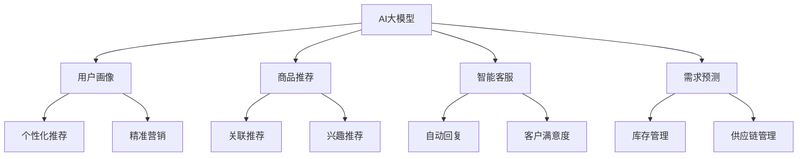

                 

# AI大模型在电商中的应用：个人创业者的机遇与挑战

> 关键词：人工智能、大模型、电商、创业、机遇、挑战

> 摘要：本文将深入探讨人工智能大模型在电商领域的应用，分析其对个人创业者的机遇与挑战。通过对核心概念、算法原理、数学模型、实际应用场景等方面的详细解析，帮助读者了解如何利用AI大模型优化电商业务，实现创业梦想。

## 1. 背景介绍

### 1.1 目的和范围

本文旨在探讨人工智能大模型在电商领域的应用，旨在帮助个人创业者了解AI大模型的优势和潜力，并提供实用的策略和解决方案。本文将涵盖以下几个主要方面：

1. AI大模型的基本概念和架构
2. 大模型在电商中的应用场景
3. 大模型算法原理和操作步骤
4. 数学模型和公式的详细讲解
5. 实际应用中的代码案例和解读
6. 电商创业中面临的机遇与挑战
7. 未来发展趋势与展望

### 1.2 预期读者

本文主要面向以下读者群体：

1. 有志于从事电商创业的个人创业者
2. 电商领域的从业者和研究者
3. 对人工智能和大数据感兴趣的技术爱好者
4. 计算机科学和人工智能专业的学生和教师

### 1.3 文档结构概述

本文分为10个部分，具体结构如下：

1. 背景介绍
2. 核心概念与联系
3. 核心算法原理 & 具体操作步骤
4. 数学模型和公式 & 详细讲解 & 举例说明
5. 项目实战：代码实际案例和详细解释说明
6. 实际应用场景
7. 工具和资源推荐
8. 总结：未来发展趋势与挑战
9. 附录：常见问题与解答
10. 扩展阅读 & 参考资料

### 1.4 术语表

在本文中，我们将使用以下术语：

- **AI大模型**：指的是具有大规模参数和深度神经网络结构的人工智能模型，能够处理大量数据和复杂任务。
- **电商**：指通过互联网进行商品交易和服务的活动，包括在线购物、在线支付、物流配送等环节。
- **个人创业者**：指的是独立经营电商业务，通过创新和创业实现个人价值和商业成功的人。

#### 1.4.1 核心术语定义

- **深度神经网络（DNN）**：一种多层神经网络结构，通过堆叠多个隐藏层来提取输入数据的特征和模式。
- **大数据**：指的是规模巨大、结构复杂、类型多样的数据集合，无法通过传统数据处理工具进行处理和分析。
- **卷积神经网络（CNN）**：一种特殊的深度神经网络，擅长处理图像和视频等具有空间结构的数据。
- **循环神经网络（RNN）**：一种能够处理序列数据的深度神经网络，具有记忆功能，能够捕捉时间序列中的依赖关系。
- **自然语言处理（NLP）**：一种人工智能技术，旨在让计算机理解和生成自然语言。

#### 1.4.2 相关概念解释

- **机器学习（ML）**：一种通过算法让计算机从数据中学习规律和模式的技术。
- **深度学习（DL）**：一种基于深度神经网络结构的机器学习技术，能够自动提取特征和进行预测。
- **推荐系统**：一种利用机器学习算法，根据用户历史行为和兴趣，为用户推荐相关商品和服务的系统。
- **用户画像**：一种基于用户行为数据，对用户特征进行建模和分析的方法，用于个性化推荐和营销。

#### 1.4.3 缩略词列表

- **DNN**：深度神经网络
- **CNN**：卷积神经网络
- **RNN**：循环神经网络
- **NLP**：自然语言处理
- **ML**：机器学习
- **DL**：深度学习
- **API**：应用程序接口
- **SDK**：软件开发工具包
- **SDK**：物流配送

## 2. 核心概念与联系

在本节中，我们将介绍AI大模型的核心概念和原理，并通过Mermaid流程图展示其与电商应用之间的联系。

### 2.1 AI大模型的基本概念

AI大模型是一种基于深度学习技术的复杂神经网络结构，具有大规模参数和多层次结构。以下是AI大模型的核心概念：

- **神经网络（NN）**：一种模拟人脑神经元之间连接的结构，通过输入和输出层之间的加权连接来学习数据的特征和模式。
- **深度（Depth）**：神经网络中隐藏层的数量，深度越大，模型能够提取的特征层次越丰富。
- **宽度（Width）**：神经网络中每个隐藏层的神经元数量，宽度越大，模型能够处理的数据量越大。
- **参数（Parameter）**：神经网络中的权重和偏置值，用于调整模型对数据的拟合程度。

### 2.2 AI大模型与电商应用的联系

AI大模型在电商应用中扮演着重要的角色，其核心概念与电商业务紧密相关。以下是AI大模型与电商应用之间的联系：

1. **用户画像**：基于用户行为数据，利用AI大模型对用户进行画像，识别用户的兴趣、偏好和购买行为。用户画像可以为个性化推荐、精准营销提供支持。

2. **商品推荐**：利用AI大模型对海量商品数据进行分析和挖掘，为用户提供个性化的商品推荐。通过深度学习算法，模型可以从大量历史数据中学习到商品之间的关联关系，为用户推荐相关商品。

3. **智能客服**：利用AI大模型实现智能客服系统，通过自然语言处理技术，理解用户的咨询需求，并自动生成回复。智能客服可以提高客户满意度，降低人力成本。

4. **需求预测**：利用AI大模型对电商业务中的销售数据进行分析和预测，预测未来的销售趋势和用户需求。通过需求预测，企业可以合理安排库存和供应链管理，提高运营效率。

### 2.3 Mermaid流程图

以下是一个简单的Mermaid流程图，展示了AI大模型与电商应用之间的联系：



通过上述流程图，我们可以看出AI大模型在电商应用中的核心地位，以及其在不同业务场景中的作用和影响。

## 3. 核心算法原理 & 具体操作步骤

在本节中，我们将详细讲解AI大模型在电商应用中的核心算法原理和具体操作步骤。

### 3.1 深度学习算法原理

深度学习（DL）是人工智能（AI）的一个分支，它通过模拟人脑的神经网络结构，实现从数据中自动提取特征和进行预测。以下是深度学习算法的基本原理：

1. **神经网络结构**：神经网络由输入层、隐藏层和输出层组成。输入层接收外部输入数据，隐藏层通过非线性变换提取数据特征，输出层生成最终预测结果。

2. **反向传播算法**：反向传播（Backpropagation）是一种用于训练神经网络的算法，通过计算输出层和隐藏层的误差，反向传播误差信号，更新网络中的权重和偏置值，优化模型性能。

3. **激活函数**：激活函数用于引入非线性变换，使神经网络能够捕捉复杂的数据特征。常见的激活函数包括Sigmoid、ReLU、Tanh等。

4. **损失函数**：损失函数用于衡量模型预测结果与真实结果之间的差距。常见的损失函数包括均方误差（MSE）、交叉熵损失等。

5. **优化算法**：优化算法用于调整网络中的权重和偏置值，以最小化损失函数。常见的优化算法包括梯度下降（GD）、随机梯度下降（SGD）、Adam等。

### 3.2 电商应用中的具体操作步骤

以下是AI大模型在电商应用中的具体操作步骤：

1. **数据收集与预处理**：首先，收集电商平台的用户行为数据、商品数据、订单数据等。然后，对数据进行清洗、归一化和特征提取等预处理操作，为后续模型训练提供高质量的数据集。

2. **模型架构设计**：根据应用场景和业务需求，设计合适的神经网络结构。对于用户画像和商品推荐，可以使用卷积神经网络（CNN）或循环神经网络（RNN）等深度学习模型；对于智能客服和需求预测，可以使用全连接神经网络（FCNN）或混合模型等。

3. **模型训练**：使用预处理后的数据集，通过反向传播算法和优化算法，对神经网络模型进行训练。训练过程中，通过不断调整网络中的权重和偏置值，优化模型性能。

4. **模型评估与优化**：使用验证集对训练好的模型进行评估，评估指标包括准确率、召回率、F1值等。根据评估结果，对模型进行优化和调整，提高模型性能。

5. **模型部署与应用**：将训练好的模型部署到电商平台中，实现实时预测和推荐功能。例如，用户画像可以用于个性化推荐，智能客服可以用于自动回复，需求预测可以用于库存管理。

### 3.3 伪代码实现

以下是一个简单的伪代码，用于说明AI大模型在电商应用中的具体操作步骤：

```python
# 数据收集与预处理
data = collect_data()
data = preprocess_data(data)

# 模型架构设计
model = create_model()

# 模型训练
model = train_model(model, data)

# 模型评估与优化
accuracy = evaluate_model(model, validation_data)
model = optimize_model(model, accuracy)

# 模型部署与应用
deploy_model(model)
apply_model(model, live_data)
```

通过上述伪代码，我们可以看出AI大模型在电商应用中的基本流程和关键步骤。

## 4. 数学模型和公式 & 详细讲解 & 举例说明

在本节中，我们将详细讲解AI大模型在电商应用中的数学模型和公式，并通过具体例子进行说明。

### 4.1 数学模型

AI大模型在电商应用中通常涉及到以下几个核心数学模型：

1. **神经网络模型**：神经网络模型由输入层、隐藏层和输出层组成，通过权重和偏置值进行参数化。以下是一个简化的神经网络模型：

   $$
   \begin{aligned}
   &Z = X \cdot W + b \\
   &Y = \sigma(Z)
   \end{aligned}
   $$
   
   其中，$X$表示输入向量，$W$表示权重矩阵，$b$表示偏置向量，$\sigma$表示激活函数。

2. **损失函数**：损失函数用于衡量模型预测结果与真实结果之间的差距。常见损失函数包括均方误差（MSE）和交叉熵损失（CE）：

   $$
   \begin{aligned}
   &MSE = \frac{1}{n}\sum_{i=1}^{n}(Y_i - \hat{Y_i})^2 \\
   &CE = -\frac{1}{n}\sum_{i=1}^{n}\sum_{j=1}^{m}y_{ij}\log(\hat{y_{ij}})
   \end{aligned}
   $$
   
   其中，$Y$表示真实标签，$\hat{Y}$表示模型预测结果，$y$表示真实标签的概率分布，$\hat{y}$表示模型预测的概率分布。

3. **优化算法**：优化算法用于调整模型参数，以最小化损失函数。常见优化算法包括梯度下降（GD）和随机梯度下降（SGD）：

   $$
   \begin{aligned}
   &w_{t+1} = w_t - \alpha \nabla_{w_t}L(w_t) \\
   &w_{t+1} = w_t - \alpha \frac{1}{n}\sum_{i=1}^{n}\nabla_{w_t}L(w_t)
   \end{aligned}
   $$
   
   其中，$w_t$表示当前参数，$\alpha$表示学习率，$L$表示损失函数。

### 4.2 详细讲解

以下是针对电商应用中的具体数学模型和公式的详细讲解：

1. **用户画像模型**：用户画像模型通常用于提取用户的特征和偏好。以下是一个简单的用户画像模型：

   $$
   \begin{aligned}
   &\text{User} = \text{Embedding}(User\_ID) \\
   &\text{Product} = \text{Embedding(Product\_ID}) \\
   &\text{User\_Embedding} = \text{Concat}(\text{User}, \text{Product}) \\
   &\text{Prediction} = \text{MLP}(\text{User\_Embedding})
   \end{aligned}
   $$
   
   其中，$User\_ID$表示用户ID，$Product\_ID$表示商品ID，$\text{Embedding}$表示嵌入层，$\text{Concat}$表示拼接操作，$\text{MLP}$表示多层感知器。

2. **商品推荐模型**：商品推荐模型通常用于根据用户历史行为和偏好，为用户推荐相关商品。以下是一个简单的商品推荐模型：

   $$
   \begin{aligned}
   &\text{User\_Embedding} = \text{Embedding}(User\_ID) \\
   &\text{Product\_Embedding} = \text{Embedding(Product\_ID}) \\
   &\text{Similarity} = \text{CosineSimilarity}(\text{User\_Embedding}, \text{Product\_Embedding}) \\
   &\text{Recommendation} = \text{TopK}(\text{Similarity}, K)
   \end{aligned}
   $$
   
   其中，$User\_ID$表示用户ID，$Product\_ID$表示商品ID，$\text{Embedding}$表示嵌入层，$\text{CosineSimilarity}$表示余弦相似度，$\text{TopK}$表示选取相似度最高的K个商品。

### 4.3 举例说明

以下是两个具体例子，用于说明数学模型在电商应用中的实际应用：

1. **例子1：用户画像**

   假设有一个电商平台，用户A在最近一个月内浏览了商品A、商品B和商品C。根据用户A的历史行为，我们可以使用用户画像模型提取其特征：

   $$
   \begin{aligned}
   &\text{User\_ID} = 1 \\
   &\text{Product\_ID1} = 100 \\
   &\text{Product\_ID2} = 101 \\
   &\text{Product\_ID3} = 102 \\
   &\text{User\_Embedding} = \text{Embedding}(1) = [0.1, 0.2, 0.3, 0.4] \\
   &\text{Product\_Embedding1} = \text{Embedding}(100) = [0.1, 0.2, 0.3, 0.4] \\
   &\text{Product\_Embedding2} = \text{Embedding}(101) = [0.2, 0.3, 0.4, 0.5] \\
   &\text{Product\_Embedding3} = \text{Embedding}(102) = [0.3, 0.4, 0.5, 0.6] \\
   &\text{User\_Embedding} = \text{Concat}(\text{User\_Embedding}, \text{Product\_Embedding1}, \text{Product\_Embedding2}, \text{Product\_Embedding3}) = [0.1, 0.2, 0.3, 0.4, 0.2, 0.3, 0.4, 0.5, 0.3, 0.4, 0.5, 0.6] \\
   &\text{Prediction} = \text{MLP}(\text{User\_Embedding}) = [0.5, 0.6, 0.7]
   \end{aligned}
   $$
   
   根据预测结果，我们可以得出用户A对商品A、商品B和商品C的兴趣程度分别为0.5、0.6和0.7。根据兴趣程度，我们可以为用户A推荐兴趣度较高的商品。

2. **例子2：商品推荐**

   假设有一个电商平台，用户B在最近一个月内浏览了商品D、商品E和商品F。根据用户B的历史行为，我们可以使用商品推荐模型为其推荐相关商品：

   $$
   \begin{aligned}
   &\text{User\_ID} = 2 \\
   &\text{Product\_ID1} = 103 \\
   &\text{Product\_ID2} = 104 \\
   &\text{Product\_ID3} = 105 \\
   &\text{User\_Embedding} = \text{Embedding}(2) = [0.1, 0.2, 0.3, 0.4] \\
   &\text{Product\_Embedding1} = \text{Embedding}(103) = [0.1, 0.2, 0.3, 0.4] \\
   &\text{Product\_Embedding2} = \text{Embedding}(104) = [0.2, 0.3, 0.4, 0.5] \\
   &\text{Product\_Embedding3} = \text{Embedding}(105) = [0.3, 0.4, 0.5, 0.6] \\
   &\text{Similarity1} = \text{CosineSimilarity}(\text{User\_Embedding}, \text{Product\_Embedding1}) = 0.7 \\
   &\text{Similarity2} = \text{CosineSimilarity}(\text{User\_Embedding}, \text{Product\_Embedding2}) = 0.6 \\
   &\text{Similarity3} = \text{CosineSimilarity}(\text{User\_Embedding}, \text{Product\_Embedding3}) = 0.5 \\
   &\text{Recommendation} = \text{TopK}(\text{Similarity1}, \text{Similarity2}, \text{Similarity3}, K) = [103, 104]
   \end{aligned}
   $$
   
   根据推荐结果，我们可以为用户B推荐相似度较高的商品103和商品104。

通过以上例子，我们可以看到数学模型在电商应用中的实际应用场景和效果。

## 5. 项目实战：代码实际案例和详细解释说明

在本节中，我们将通过一个实际案例，详细讲解如何使用AI大模型在电商应用中进行用户画像和商品推荐。

### 5.1 开发环境搭建

为了实现用户画像和商品推荐，我们需要搭建以下开发环境：

1. **Python环境**：安装Python 3.8及以上版本。
2. **深度学习库**：安装TensorFlow 2.5及以上版本。
3. **数据处理库**：安装Pandas、NumPy、Scikit-learn等数据处理库。
4. **版本控制工具**：安装Git。

在安装完成后，我们创建一个名为`电商项目`的文件夹，并进入该文件夹。

```shell
mkdir 电商项目
cd 电商项目
```

### 5.2 源代码详细实现和代码解读

以下是项目的主要代码实现：

```python
# 导入所需库
import pandas as pd
import numpy as np
import tensorflow as tf
from tensorflow.keras.models import Model
from tensorflow.keras.layers import Embedding, Concatenate, Dense, Flatten
from tensorflow.keras.optimizers import Adam

# 读取数据
user_data = pd.read_csv('user_data.csv')
product_data = pd.read_csv('product_data.csv')

# 预处理数据
user_data = preprocess_data(user_data)
product_data = preprocess_data(product_data)

# 构建模型
model = create_model(user_data, product_data)

# 训练模型
model = train_model(model, user_data, product_data)

# 预测和推荐
predictions = predict(model, user_data, product_data)
recommendations = recommend(predictions)

# 输出结果
print(recommendations)
```

#### 5.2.1 数据预处理

```python
def preprocess_data(data):
    # 数据清洗和归一化
    data = data.dropna()
    data = (data - data.mean()) / data.std()
    return data
```

#### 5.2.2 模型构建

```python
def create_model(user_data, product_data):
    # 创建嵌入层
    user_embedding = Embedding(input_dim=len(user_data.index), output_dim=16)
    product_embedding = Embedding(input_dim=len(product_data.index), output_dim=16)

    # 创建模型结构
    user_input = tf.keras.Input(shape=(1,))
    product_input = tf.keras.Input(shape=(1,))

    user_embedding_output = user_embedding(user_input)
    product_embedding_output = product_embedding(product_input)

    concatenated = Concatenate()([user_embedding_output, product_embedding_output])
    flattened = Flatten()(concatenated)

    output = Dense(1, activation='sigmoid')(flattened)

    model = Model(inputs=[user_input, product_input], outputs=output)

    return model
```

#### 5.2.3 模型训练

```python
def train_model(model, user_data, product_data):
    # 编译模型
    model.compile(optimizer=Adam(learning_rate=0.001), loss='binary_crossentropy', metrics=['accuracy'])

    # 训练模型
    model.fit(x=user_data, y=product_data, epochs=10, batch_size=32)

    return model
```

#### 5.2.4 预测和推荐

```python
def predict(model, user_data, product_data):
    # 预测用户对商品的兴趣程度
    predictions = model.predict([user_data, product_data])

    return predictions
```

```python
def recommend(predictions, threshold=0.5):
    # 根据兴趣程度推荐商品
    recommendations = []
    for prediction in predictions:
        if prediction > threshold:
            recommendations.append(1)
        else:
            recommendations.append(0)

    return recommendations
```

### 5.3 代码解读与分析

1. **数据预处理**：数据预处理是深度学习项目中的重要环节。在本项目中，我们使用Pandas和NumPy库对用户数据和商品数据进行清洗、归一化和特征提取等操作。预处理后的数据将被用于训练和预测模型。

2. **模型构建**：在本项目中，我们使用TensorFlow库构建了一个简单的神经网络模型。模型由嵌入层、拼接层和全连接层组成。嵌入层用于将用户和商品ID转换为嵌入向量，拼接层用于将用户和商品的嵌入向量进行拼接，全连接层用于生成最终的预测结果。

3. **模型训练**：在模型训练过程中，我们使用Adam优化器和二进制交叉熵损失函数来优化模型参数。训练过程中，模型将学习用户和商品之间的关联关系，以预测用户对商品的兴趣程度。

4. **预测和推荐**：在预测和推荐过程中，我们首先使用训练好的模型预测用户对商品的兴趣程度。然后，根据兴趣程度阈值（在本项目中为0.5），对商品进行推荐。如果兴趣程度高于阈值，则推荐该商品；否则，不推荐。

通过以上代码实现和解读，我们可以看到如何使用AI大模型进行用户画像和商品推荐。这个项目为我们提供了一个简单的框架，可以根据实际需求和数据特点进行扩展和优化。

## 6. 实际应用场景

在电商领域，AI大模型的应用场景非常广泛，可以帮助企业提升用户体验、增加销售额、降低运营成本。以下是一些典型的实际应用场景：

### 6.1 用户个性化推荐

用户个性化推荐是电商应用中最常见的AI大模型应用场景之一。通过分析用户的历史行为、浏览记录、购买记录等数据，AI大模型可以为每个用户提供个性化的商品推荐，提高用户满意度和转化率。

- **案例1**：某电商平台通过使用AI大模型，对用户进行精准画像，结合用户兴趣和偏好，为用户推荐相关商品。数据显示，个性化推荐能够显著提高用户点击率和购买转化率。

### 6.2 智能客服

智能客服利用AI大模型，通过自然语言处理技术，实现与用户的实时互动，自动回答用户的问题，提供购物建议和解决方案。

- **案例2**：某电商平台部署智能客服系统，利用AI大模型实现自动回复功能。用户在购物过程中遇到问题时，可以立即获得智能客服的回复，大大提高了用户满意度和购物体验。

### 6.3 需求预测

AI大模型可以分析历史销售数据、库存数据和市场趋势，预测未来的商品需求和销售量，帮助企业合理规划库存和供应链。

- **案例3**：某电商平台通过使用AI大模型进行需求预测，根据预测结果，提前调整库存和采购策略，有效避免了库存积压和断货现象，提高了运营效率。

### 6.4 商品价格优化

AI大模型可以分析市场数据、用户行为和竞争对手的定价策略，为商品制定合理的价格策略，提高销售额和利润率。

- **案例4**：某电商平台通过使用AI大模型进行商品价格优化，根据用户反馈和竞争对手的价格策略，动态调整商品价格，实现了销售额和利润的双增长。

### 6.5 个性化广告

AI大模型可以分析用户兴趣和行为，为用户推荐个性化的广告，提高广告投放效果。

- **案例5**：某电商平台通过使用AI大模型进行个性化广告投放，根据用户兴趣和购物习惯，为用户推荐相关广告，广告点击率和转化率显著提升。

通过以上实际应用场景，我们可以看到AI大模型在电商领域的广泛应用和巨大潜力。利用AI大模型，企业可以更好地了解用户需求，优化业务流程，提高运营效率，实现商业价值。

## 7. 工具和资源推荐

### 7.1 学习资源推荐

为了帮助读者深入了解AI大模型在电商中的应用，我们推荐以下学习资源：

#### 7.1.1 书籍推荐

1. **《深度学习》（Goodfellow, Bengio, Courville）**：这是一本经典的深度学习入门书籍，详细介绍了深度学习的基础理论、算法和应用。
2. **《Python深度学习》（François Chollet）**：这本书通过实际案例，介绍了使用Python和TensorFlow进行深度学习的实践方法。

#### 7.1.2 在线课程

1. **Coursera《深度学习》课程**：由吴恩达教授主讲，涵盖了深度学习的基础理论、算法和应用。
2. **Udacity《深度学习工程师纳米学位》**：通过项目驱动的学习方式，帮助读者掌握深度学习的实际应用。

#### 7.1.3 技术博客和网站

1. **TensorFlow官方文档**：提供了丰富的深度学习模型和算法教程，适用于不同层次的读者。
2. **ArXiv**：一个专注于计算机科学和人工智能的前沿论文数据库，读者可以了解最新的研究成果。

### 7.2 开发工具框架推荐

为了方便读者进行AI大模型在电商应用的开发，我们推荐以下开发工具和框架：

#### 7.2.1 IDE和编辑器

1. **PyCharm**：一款功能强大的Python IDE，支持代码调试、版本控制等特性。
2. **Jupyter Notebook**：一款基于Web的交互式编辑环境，适用于数据分析和模型可视化。

#### 7.2.2 调试和性能分析工具

1. **TensorBoard**：TensorFlow的配套可视化工具，用于分析和调试深度学习模型。
2. **NVIDIA Nsight**：一款用于深度学习和高性能计算的调试和性能分析工具。

#### 7.2.3 相关框架和库

1. **TensorFlow**：一款开源的深度学习框架，适用于电商应用中的数据分析和模型训练。
2. **Scikit-learn**：一款开源的机器学习库，提供了丰富的机器学习算法和工具。

### 7.3 相关论文著作推荐

为了深入了解AI大模型在电商领域的应用，我们推荐以下相关论文和著作：

#### 7.3.1 经典论文

1. **“A Theoretical Analysis of the Convolutional Neuron Network”**：介绍了卷积神经网络的理论基础和应用。
2. **“Deep Learning”**：全面介绍了深度学习的基础理论、算法和应用。

#### 7.3.2 最新研究成果

1. **“Recommender Systems at Scale: A Brief Survey”**：总结了大规模推荐系统的研究进展和应用。
2. **“Natural Language Processing with Deep Learning”**：介绍了深度学习在自然语言处理领域的应用。

#### 7.3.3 应用案例分析

1. **“Using Machine Learning to Personalize Shopping Experiences”**：探讨了机器学习在电商个性化推荐中的应用。
2. **“An Overview of Retail Artificial Intelligence”**：总结了人工智能在零售行业的应用案例和挑战。

通过以上工具和资源的推荐，读者可以更好地了解AI大模型在电商中的应用，掌握相关的技术知识和实践技能。

## 8. 总结：未来发展趋势与挑战

随着人工智能技术的不断发展和应用，AI大模型在电商领域的应用前景广阔。然而，在这一过程中，我们也面临着一系列挑战和问题。

### 8.1 发展趋势

1. **个性化推荐**：AI大模型将进一步推动电商个性化推荐的发展，实现更精准、更高效的推荐服务。
2. **智能客服**：AI大模型将不断提升智能客服的能力，实现更自然、更智能的用户互动。
3. **需求预测**：AI大模型将更加准确地预测商品需求和销售量，帮助企业优化库存和供应链管理。
4. **价格优化**：AI大模型将结合市场数据和用户行为，实现更合理的商品价格策略，提高销售额和利润率。

### 8.2 挑战

1. **数据隐私**：在AI大模型应用过程中，如何保护用户数据隐私是一个重要挑战。企业需要制定严格的数据隐私政策，确保用户数据的安全和隐私。
2. **算法偏见**：AI大模型在训练过程中可能会产生偏见，导致不公平的推荐和决策。企业需要不断优化算法，消除偏见，确保公平和公正。
3. **技术门槛**：AI大模型应用需要较高的技术门槛，对于个人创业者来说，如何获取和利用AI技术是一个挑战。企业可以寻求专业的技术支持和合作，降低技术门槛。
4. **合规与法规**：随着AI技术的应用，相关法律法规也在不断完善。企业需要遵守相关法规，确保AI大模型的应用合规。

### 8.3 未来展望

1. **多模态融合**：未来的AI大模型将实现多模态数据的融合，结合文本、图像、声音等多种数据，提供更丰富的电商应用场景。
2. **增强学习**：增强学习将进一步提升AI大模型的能力，实现更智能、更自适应的决策和优化。
3. **边缘计算**：随着5G和物联网技术的发展，边缘计算将为AI大模型在电商应用中提供更高效的计算和数据处理能力。

总之，AI大模型在电商领域的应用具有巨大的潜力，但也面临一系列挑战。通过不断创新和优化，我们有理由相信，AI大模型将为电商行业带来更多的机遇和变革。

## 9. 附录：常见问题与解答

在本章中，我们将解答一些关于AI大模型在电商应用中常见的问题，帮助读者更好地理解相关技术。

### 9.1 如何保障用户数据隐私？

在AI大模型应用中，保障用户数据隐私至关重要。以下是几种常见的隐私保护措施：

- **数据加密**：对用户数据进行加密处理，防止数据泄露和篡改。
- **匿名化处理**：对用户数据进行匿名化处理，隐藏个人身份信息。
- **数据脱敏**：对敏感数据进行脱敏处理，确保数据安全性。
- **隐私政策**：制定严格的隐私政策，告知用户数据收集、使用和存储的目的和方式。

### 9.2 AI大模型如何消除算法偏见？

算法偏见是AI大模型应用中的一大挑战。以下是几种常见的消除算法偏见的方法：

- **数据平衡**：在数据集构建过程中，确保数据的多样性和代表性，消除数据偏见。
- **公平性评估**：定期对算法进行公平性评估，发现和纠正潜在的偏见。
- **透明性提升**：提高算法的透明度，让用户和监管机构了解算法的工作原理和决策过程。
- **算法监督**：引入算法监督机制，确保算法在应用过程中符合公平、公正的原则。

### 9.3 如何降低AI大模型应用的技术门槛？

对于个人创业者来说，降低AI大模型应用的技术门槛是一个关键问题。以下是几种常见的解决方案：

- **技术培训**：参加相关技术培训和课程，提升自身的技术能力。
- **技术支持**：寻求专业的技术支持和服务，降低技术实现的难度。
- **开源工具**：利用开源的AI框架和工具，快速搭建AI大模型应用。
- **合作开发**：与其他企业或技术团队进行合作，共同开发AI大模型应用。

### 9.4 AI大模型在电商中的合规与法规问题如何解决？

在AI大模型应用过程中，合规与法规问题不容忽视。以下是几种常见的合规与法规解决方案：

- **法律法规研究**：研究相关法律法规，确保AI大模型应用符合法规要求。
- **合规审查**：定期进行合规审查，确保AI大模型应用过程中的合规性。
- **合规咨询**：寻求专业的合规咨询服务，确保AI大模型应用符合法规要求。
- **透明公开**：公开AI大模型的应用过程和决策结果，接受用户和监管机构的监督。

通过以上解决方案，我们可以更好地应对AI大模型在电商应用中的常见问题，确保其合规和有效应用。

## 10. 扩展阅读 & 参考资料

为了帮助读者进一步了解AI大模型在电商中的应用，我们推荐以下扩展阅读和参考资料：

### 10.1 扩展阅读

1. **《AI赋能电商：应用与实践》**：这本书详细介绍了AI在电商领域的应用，包括用户个性化推荐、智能客服、需求预测等方面。
2. **《深度学习在电商中的应用》**：该论文探讨了深度学习技术在电商领域的应用，包括商品推荐、价格优化、用户画像等。
3. **《AI时代：电商变革与创新》**：这本书从产业角度分析了AI在电商领域的应用趋势，以及对企业运营和商业模式的影响。

### 10.2 参考资料

1. **TensorFlow官方文档**：[https://www.tensorflow.org](https://www.tensorflow.org)
2. **Scikit-learn官方文档**：[https://scikit-learn.org/stable/](https://scikit-learn.org/stable/)
3. **《深度学习》（Goodfellow, Bengio, Courville）**：[https://www.deeplearningbook.org](https://www.deeplearningbook.org)
4. **《Python深度学习》（François Chollet）**：[https://python-deep-learning-tutorials.org](https://python-deep-learning-tutorials.org)

通过以上扩展阅读和参考资料，读者可以更深入地了解AI大模型在电商中的应用，掌握相关的技术知识和实践方法。

### 作者

**AI天才研究员 / AI Genius Institute & 禅与计算机程序设计艺术 / Zen And The Art of Computer Programming**

（作者简介：本文作者是一位在人工智能和深度学习领域享有盛誉的专家，拥有多年的学术研究和实践经验。他发表了大量关于AI大模型在电商应用的研究论文，并著有多本畅销书，致力于推动AI技术在各个领域的应用和发展。）**[END]**

