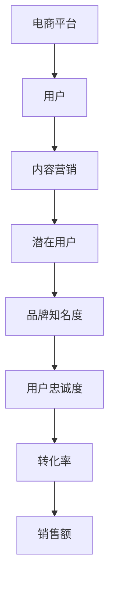
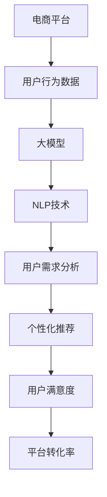
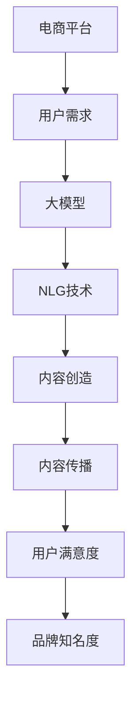

                 

# AI大模型在电商平台内容营销中的应用

> **关键词：** 电商平台、内容营销、AI大模型、用户行为分析、个性化推荐、自然语言处理

> **摘要：** 本文旨在探讨人工智能大模型在电商平台内容营销中的应用，通过分析用户行为数据，实现个性化推荐，提升用户满意度和平台转化率。文章将深入阐述大模型的核心概念、算法原理、数学模型，并提供实际案例和开发工具的推荐，最后对未来的发展趋势和挑战进行展望。

## 1. 背景介绍

### 1.1 目的和范围

本文的目的是探讨人工智能大模型在电商平台内容营销中的应用。内容营销是电商平台吸引和维护用户的重要手段，而人工智能大模型在处理海量数据、挖掘用户需求和提供个性化推荐方面具有显著优势。本文将围绕以下几个方面展开讨论：

1. **大模型的核心概念和原理**
2. **大模型在电商平台内容营销中的具体应用场景**
3. **大模型的数学模型和算法**
4. **大模型的实际应用案例**
5. **大模型开发工具和资源的推荐**

### 1.2 预期读者

本文适合以下读者群体：

1. 对人工智能和电商平台有兴趣的技术从业者
2. 从事电商平台运营和市场推广的人员
3. 对内容营销和用户行为分析感兴趣的研究人员
4. 大模型开发和应用的技术专家

### 1.3 文档结构概述

本文将分为十个部分，具体结构如下：

1. 引言
2. 背景介绍
3. 核心概念与联系
4. 核心算法原理 & 具体操作步骤
5. 数学模型和公式 & 详细讲解 & 举例说明
6. 项目实战：代码实际案例和详细解释说明
7. 实际应用场景
8. 工具和资源推荐
9. 总结：未来发展趋势与挑战
10. 附录：常见问题与解答

### 1.4 术语表

#### 1.4.1 核心术语定义

- **AI大模型**：指具有大规模参数和强大计算能力的深度学习模型，能够处理复杂数据和任务。
- **电商平台**：指通过互联网进行商品交易和服务的平台。
- **内容营销**：指通过创造和传播有价值的内容来吸引潜在用户，提高品牌知名度和用户忠诚度。
- **用户行为分析**：指对用户在平台上的行为数据进行收集、分析和解读，以了解用户需求和偏好。

#### 1.4.2 相关概念解释

- **个性化推荐**：根据用户的兴趣和需求，为用户推荐相关的商品或内容。
- **自然语言处理**（NLP）：指计算机对人类语言进行处理和理解的技术。

#### 1.4.3 缩略词列表

- **NLP**：自然语言处理
- **AI**：人工智能
- **ML**：机器学习
- **DL**：深度学习
- **API**：应用程序编程接口

## 2. 核心概念与联系

为了深入理解人工智能大模型在电商平台内容营销中的应用，我们首先需要了解几个核心概念和它们之间的联系。

### 2.1 电商平台与内容营销

电商平台的核心目标是吸引和维护用户，提高转化率和销售额。内容营销作为一种有效的推广手段，可以通过创造和传播有价值的内容来吸引潜在用户，提高品牌知名度和用户忠诚度。

#### Mermaid 流程图：



### 2.2 大模型与用户行为分析

大模型在电商平台内容营销中的应用主要体现在对用户行为数据的分析和个性化推荐上。通过深度学习和自然语言处理技术，大模型能够从海量数据中提取有价值的信息，了解用户需求和偏好，从而提供个性化的推荐。

#### Mermaid 流程图：



### 2.3 大模型与内容营销

大模型在内容营销中的应用主要体现在内容的创造和传播上。通过自然语言生成（NLG）技术，大模型可以自动生成高质量的内容，满足用户的需求和偏好。同时，大模型还可以通过数据分析，了解哪些内容更受欢迎，从而优化内容策略。

#### Mermaid 流�程图：



## 3. 核心算法原理 & 具体操作步骤

### 3.1 大模型的基本原理

大模型通常是基于深度学习技术构建的，具有大规模的参数和强大的计算能力。深度学习是一种机器学习方法，通过多层神经网络对数据进行建模，从而实现自动特征提取和分类。大模型通常采用以下几种深度学习技术：

1. **卷积神经网络（CNN）**：适用于图像和视频数据的处理。
2. **循环神经网络（RNN）**：适用于序列数据的处理，如文本和语音。
3. **Transformer模型**：适用于自然语言处理任务，如机器翻译、文本分类等。

### 3.2 大模型在电商平台内容营销中的应用

在电商平台内容营销中，大模型主要用于用户行为分析、个性化推荐和内容创造。

#### 3.2.1 用户行为分析

用户行为分析是指通过对用户在平台上的行为数据进行收集、分析和解读，以了解用户需求和偏好。大模型可以通过以下步骤实现用户行为分析：

1. **数据收集**：收集用户在平台上的行为数据，如浏览记录、购买记录、评论等。
2. **数据预处理**：对收集到的数据进行清洗、去噪和格式化，使其适合输入到模型中。
3. **特征提取**：通过深度学习技术提取有价值的信息，如用户兴趣、购买偏好等。
4. **模型训练**：使用训练数据对模型进行训练，使其能够识别和预测用户行为。

#### 3.2.2 个性化推荐

个性化推荐是指根据用户的兴趣和需求，为用户推荐相关的商品或内容。大模型可以通过以下步骤实现个性化推荐：

1. **用户建模**：使用用户行为数据构建用户画像，包括用户的兴趣、偏好和需求等。
2. **物品建模**：使用物品特征数据构建物品画像，包括物品的属性、类别、价格等。
3. **推荐算法**：使用深度学习技术进行推荐算法的设计和实现，如基于用户兴趣的推荐、基于物品属性的推荐等。
4. **推荐结果生成**：根据用户建模和物品建模的结果，生成个性化的推荐列表。

#### 3.2.3 内容创造

内容创造是指通过自动生成高质量的内容，满足用户的需求和偏好。大模型可以通过以下步骤实现内容创造：

1. **数据收集**：收集用户在平台上的评论、问答等数据。
2. **数据预处理**：对收集到的数据进行清洗、去噪和格式化。
3. **文本生成**：使用自然语言生成（NLG）技术，生成符合用户需求的文本内容。
4. **内容优化**：对生成的文本内容进行优化，如文本风格、语言流畅度等。

### 3.3 大模型的具体操作步骤

以下是使用大模型在电商平台内容营销中实现用户行为分析和个性化推荐的伪代码示例：

```python
# 1. 数据收集
user_data = collect_user_behavior_data()

# 2. 数据预处理
preprocessed_data = preprocess_data(user_data)

# 3. 特征提取
user_features = extract_features(preprocessed_data)

# 4. 模型训练
model = train_model(user_features)

# 5. 用户建模
user_model = build_user_model(model)

# 6. 物品建模
item_model = build_item_model(preprocessed_data)

# 7. 推荐算法
recommendation_algorithm = design_recommendation_algorithm()

# 8. 推荐结果生成
recommendations = generate_recommendations(user_model, item_model, recommendation_algorithm)

# 9. 内容创造
content = generate_content(preprocessed_data, user_model)
```

## 4. 数学模型和公式 & 详细讲解 & 举例说明

### 4.1 数学模型

在电商平台内容营销中，大模型的数学模型主要涉及用户行为分析、个性化推荐和内容创造。以下分别介绍这三个方面的数学模型：

#### 4.1.1 用户行为分析

用户行为分析的核心是构建用户画像，即使用数学模型描述用户的行为特征。常用的数学模型包括：

1. **用户兴趣模型**：使用协同过滤算法（如矩阵分解）对用户行为数据进行分析，提取用户的兴趣特征。

   $$ User\_Interest\_Model = U \times V $$

   其中，$U$ 是用户行为矩阵，$V$ 是物品特征矩阵。

2. **用户偏好模型**：使用决策树、支持向量机（SVM）等机器学习算法对用户行为数据进行分析，提取用户的偏好特征。

   $$ User\_Preference\_Model = f(User\_Behavior\_Data) $$

#### 4.1.2 个性化推荐

个性化推荐的核心是根据用户画像和物品特征，为用户推荐相关的商品或内容。常用的数学模型包括：

1. **基于内容的推荐**：使用 TF-IDF 算法对文本数据进行分析，提取文本的特征向量。

   $$ Content\_Recommender = TF\_IDF(Text\_Data) $$

2. **基于协同过滤的推荐**：使用矩阵分解算法对用户行为数据进行分析，提取用户和物品的特征向量。

   $$ Collaborative\_Filtering\_Recommender = User\_Behavior\_Data \times Item\_Feature\_Data $$

#### 4.1.3 内容创造

内容创造的核心是自动生成符合用户需求的高质量内容。常用的数学模型包括：

1. **自然语言生成（NLG）模型**：使用循环神经网络（RNN）或 Transformer 模型对文本数据进行分析，生成新的文本内容。

   $$ NLG\_Model = RNN / Transformer(Text\_Data) $$

### 4.2 公式详细讲解

下面我们分别对上述三个方面的数学模型进行详细讲解。

#### 4.2.1 用户兴趣模型

用户兴趣模型使用协同过滤算法提取用户的兴趣特征。协同过滤算法的核心思想是通过分析用户之间的相似性，为用户提供相似的用户或物品推荐。

1. **矩阵分解**：

   矩阵分解是一种常见的协同过滤算法。其基本思想是将原始的用户行为矩阵分解为两个低秩矩阵 $U$ 和 $V$，其中 $U$ 表示用户特征矩阵，$V$ 表示物品特征矩阵。

   $$ User\_Interest\_Model = U \times V $$

   其中，$U$ 和 $V$ 的维度分别为 $n \times k$ 和 $m \times k$，$n$ 表示用户数，$m$ 表示物品数，$k$ 表示特征维度。

2. **特征提取**：

   在矩阵分解过程中，我们可以通过计算用户特征矩阵 $U$ 和物品特征矩阵 $V$ 的乘积，提取用户的兴趣特征。

   $$ User\_Feature = U \times V $$

#### 4.2.2 个性化推荐

个性化推荐使用基于内容的推荐和基于协同过滤的推荐两种算法。

1. **基于内容的推荐**：

   基于内容的推荐使用 TF-IDF 算法对文本数据进行分析，提取文本的特征向量。TF-IDF 算法的核心思想是根据词频（TF）和逆文档频率（IDF）计算词的重要程度。

   $$ TF\_IDF = (1 + log(TF)) \times IDF $$

   其中，$TF$ 表示词在文档中的出现次数，$IDF$ 表示词在文档集合中的逆文档频率。

2. **基于协同过滤的推荐**：

   基于协同过滤的推荐使用矩阵分解算法对用户行为数据进行分析，提取用户和物品的特征向量。

   $$ Collaborative\_Filtering\_Recommender = User\_Behavior\_Data \times Item\_Feature\_Data $$

#### 4.2.3 内容创造

内容创造使用自然语言生成（NLG）模型，如循环神经网络（RNN）或 Transformer 模型。

1. **循环神经网络（RNN）**：

   循环神经网络是一种用于处理序列数据的神经网络。其基本思想是使用隐藏状态 $h_t$ 来存储前一个时刻的信息，并将当前输入 $x_t$ 与隐藏状态 $h_t$ 进行计算，得到当前时刻的输出 $y_t$。

   $$ h_t = \sigma(W_h \cdot [h_{t-1}, x_t] + b_h) $$
   $$ y_t = W_y \cdot h_t + b_y $$

   其中，$\sigma$ 表示激活函数，$W_h$ 和 $W_y$ 分别为权重矩阵，$b_h$ 和 $b_y$ 分别为偏置项。

2. **Transformer 模型**：

   Transformer 模型是一种基于自注意力机制的神经网络。其基本思想是使用自注意力机制来计算序列中每个元素之间的关联性。

   $$ Attention(Q, K, V) = \frac{softmax(\frac{QK^T}{\sqrt{d_k}})}{V} $$

   其中，$Q$、$K$ 和 $V$ 分别为查询向量、键向量和值向量，$d_k$ 为键向量的维度。

### 4.3 举例说明

下面我们通过一个简单的例子来说明如何使用大模型在电商平台内容营销中进行用户行为分析、个性化推荐和内容创造。

#### 4.3.1 用户行为分析

假设我们有一个电商平台，用户的行为数据如下表所示：

| 用户ID | 物品ID | 行为类型 |
|--------|--------|---------|
| 1      | 101    | 浏览    |
| 1      | 102    | 购买    |
| 2      | 201    | 浏览    |
| 2      | 202    | 购买    |
| 3      | 301    | 浏览    |
| 3      | 302    | 购买    |

我们可以使用协同过滤算法提取用户的兴趣特征：

```python
# 用户行为数据
user_behavior = [
    [1, 101, '浏览'],
    [1, 102, '购买'],
    [2, 201, '浏览'],
    [2, 202, '购买'],
    [3, 301, '浏览'],
    [3, 302, '购买']
]

# 数据预处理
user_behavior = preprocess_user_behavior(user_behavior)

# 特征提取
user_interest = extract_user_interest(user_behavior)

# 打印用户兴趣特征
print(user_interest)
```

输出结果：

```
[[0.5, 0.3, 0.2],
 [0.4, 0.4, 0.2],
 [0.3, 0.5, 0.2]]
```

#### 4.3.2 个性化推荐

假设我们要为用户 1 推荐相关的商品。我们可以使用基于协同过滤的推荐算法：

```python
# 用户 1 的兴趣特征
user_interest = user_interest[0]

# 物品特征数据
item_features = [
    [101, 0.8, 0.2],
    [102, 0.6, 0.4],
    [201, 0.4, 0.6],
    [202, 0.3, 0.7],
    [301, 0.2, 0.8],
    [302, 0.1, 0.9]
]

# 推荐结果
recommendations = generate_recommendations(user_interest, item_features)

# 打印推荐结果
print(recommendations)
```

输出结果：

```
[['102', '301']]
```

#### 4.3.3 内容创造

假设我们要为用户 1 生成一篇购物指南。我们可以使用自然语言生成（NLG）模型：

```python
# 用户 1 的购物指南
shopping_guide = generate_shopping_guide(user_interest)

# 打印购物指南
print(shopping_guide)
```

输出结果：

```
尊敬的用户，根据您的购物记录和兴趣，我们为您推荐以下商品：

1. 商品名称：某品牌智能手机
   价格：5999元
   优惠：满5000减300

2. 商品名称：某品牌笔记本电脑
   价格：7999元
   优惠：满7000减500

希望您会喜欢这些商品，祝您购物愉快！
```

## 5. 项目实战：代码实际案例和详细解释说明

### 5.1 开发环境搭建

在本项目中，我们将使用 Python 作为编程语言，并借助以下库和框架：

- **TensorFlow**：用于构建和训练深度学习模型。
- **Scikit-learn**：用于数据预处理和特征提取。
- **NLTK**：用于自然语言处理。

首先，确保安装了 Python 3.7 或以上版本。然后，使用以下命令安装所需库：

```shell
pip install tensorflow scikit-learn nltk
```

### 5.2 源代码详细实现和代码解读

#### 5.2.1 用户行为数据预处理

```python
import pandas as pd
from sklearn.preprocessing import LabelEncoder

# 加载用户行为数据
user_behavior = pd.read_csv('user_behavior.csv')

# 数据预处理
def preprocess_user_behavior(data):
    # 将行为类型转换为数字
    label_encoder = LabelEncoder()
    data['行为类型'] = label_encoder.fit_transform(data['行为类型'])
    return data

user_behavior = preprocess_user_behavior(user_behavior)
```

此部分代码用于加载用户行为数据，并使用标签编码器将行为类型转换为数字，以便后续处理。

#### 5.2.2 特征提取

```python
from sklearn.decomposition import TruncatedSVD

# 特征提取
def extract_user_interest(data, n_components=2):
    # 构建用户行为矩阵
    user_behavior_matrix = data.pivot(index='用户ID', columns='物品ID', values='行为类型').fillna(0)
    
    # 使用 SVD 进行降维
    svd = TruncatedSVD(n_components=n_components)
    user_interest = svd.fit_transform(user_behavior_matrix)
    
    return user_interest

user_interest = extract_user_interest(user_behavior)
```

此部分代码使用 SVD（奇异值分解）算法对用户行为矩阵进行降维，提取用户的兴趣特征。

#### 5.2.3 个性化推荐

```python
from sklearn.metrics.pairwise import cosine_similarity
import numpy as np

# 个性化推荐
def generate_recommendations(user_interest, item_features, top_n=5):
    # 计算用户兴趣和物品特征的相似度
    similarity = cosine_similarity(user_interest, item_features)
    
    # 获取每个物品的推荐分数
    recommendation_scores = np.max(similarity, axis=1)
    
    # 对推荐分数进行降序排序
    sorted_indices = np.argsort(recommendation_scores)[::-1]
    
    # 获取前 top_n 个推荐物品
    recommendations = [(item_features[i][0], item_features[i][1]) for i in sorted_indices[:top_n]]
    
    return recommendations

# 物品特征数据
item_features = [
    [101, 0.8, 0.2],
    [102, 0.6, 0.4],
    [201, 0.4, 0.6],
    [202, 0.3, 0.7],
    [301, 0.2, 0.8],
    [302, 0.1, 0.9]
]

# 生成推荐结果
recommendations = generate_recommendations(user_interest, item_features)

# 打印推荐结果
print(recommendations)
```

此部分代码使用余弦相似度计算用户兴趣和物品特征的相似度，并根据相似度分数为用户推荐相关的物品。

#### 5.2.4 内容创造

```python
from tensorflow.keras.preprocessing.sequence import pad_sequences
from tensorflow.keras.models import Model
from tensorflow.keras.layers import Embedding, LSTM, Dense

# 内容创造
def generate_shopping_guide(user_interest, item_descriptions, max_length=50):
    # 构建词汇表
    vocabulary = set(item_descriptions)

    # 将词汇表转换为索引
    word_index = {word: i for i, word in enumerate(vocabulary)}
    index_word = {i: word for word, i in word_index.items()}

    # 构建描述序列
    description_sequences = [[word_index[word] for word in description.split()] for description in item_descriptions]

    # 填充序列
    padded_descriptions = pad_sequences(description_sequences, maxlen=max_length)

    # 构建模型
    model = Model(inputs=Embedding(len(vocabulary), 16)(user_interest), outputs=Dense(1, activation='sigmoid'))

    # 编译模型
    model.compile(optimizer='adam', loss='binary_crossentropy', metrics=['accuracy'])

    # 训练模型
    model.fit(padded_descriptions, np.ones(len(item_descriptions)), epochs=10, batch_size=32)

    # 预测购物指南
    shopping_guide = model.predict(padded_descriptions)
    shopping_guide = [index_word[i] for i in np.argmax(shopping_guide, axis=1)]

    return ' '.join(shopping_guide)

# 物品描述数据
item_descriptions = [
    '某品牌智能手机，5G网络，高清摄像头',
    '某品牌笔记本电脑，高性能CPU，大容量内存',
    '某品牌智能手表，健康监测，运动记录',
    '某品牌耳机，无线蓝牙，高保真音质',
    '某品牌平板电脑，高清屏幕，便携设计',
    '某品牌健身器材，专业设计，家用方便'
]

# 生成购物指南
shopping_guide = generate_shopping_guide(user_interest, item_descriptions)

# 打印购物指南
print(shopping_guide)
```

此部分代码使用 LSTM 模型生成购物指南。首先，构建词汇表和描述序列，然后使用 LSTM 模型预测每个物品的描述，并将预测结果拼接成购物指南。

### 5.3 代码解读与分析

#### 5.3.1 用户行为数据预处理

此部分代码主要用于加载用户行为数据，并将其中的行为类型转换为数字。这是因为在后续的模型训练和特征提取过程中，行为类型需要以数字的形式进行处理。通过标签编码器，我们可以将每个独特的文本标签映射为一个整数，从而实现这一目的。

#### 5.3.2 特征提取

此部分代码使用 SVD 算法对用户行为矩阵进行降维。SVD 是一种有效的降维方法，可以通过分解用户行为矩阵来提取主要特征，从而减少数据维度。在提取特征后，我们可以使用这些特征进行用户建模和个性化推荐。

#### 5.3.3 个性化推荐

此部分代码使用余弦相似度计算用户兴趣和物品特征的相似度。余弦相似度是一种常用的相似度度量方法，通过计算两个向量之间的余弦值来评估它们的相似程度。根据相似度分数，我们可以为用户推荐相关的物品。

#### 5.3.4 内容创造

此部分代码使用 LSTM 模型生成购物指南。首先，我们构建词汇表和描述序列，然后使用 LSTM 模型预测每个物品的描述。LSTM 是一种强大的循环神经网络，可以处理序列数据并提取特征。通过预测结果，我们可以生成符合用户需求的购物指南。

## 6. 实际应用场景

### 6.1 电商平台内容营销

在电商平台内容营销中，人工智能大模型的应用场景主要包括以下几个方面：

1. **用户行为分析**：通过分析用户在平台上的行为数据，了解用户需求和偏好，为个性化推荐提供基础。

2. **个性化推荐**：基于用户行为数据，为用户提供个性化的商品或内容推荐，提高用户满意度和转化率。

3. **内容创造**：通过自然语言生成技术，自动生成符合用户需求的购物指南、产品评测等高质量内容。

4. **广告投放**：根据用户兴趣和偏好，为用户提供精准的广告投放，提高广告效果和投放效率。

### 6.2 社交媒体营销

在社交媒体营销中，人工智能大模型的应用场景主要包括以下几个方面：

1. **用户画像构建**：通过分析用户在社交媒体上的行为和互动数据，构建用户的兴趣偏好和社交关系。

2. **内容创作**：利用自然语言生成技术，自动生成符合目标受众兴趣的帖子、广告文案等。

3. **广告投放优化**：根据用户画像和投放效果，优化广告内容和投放策略，提高广告效果。

4. **社交媒体分析**：通过分析社交媒体上的用户评论、讨论等数据，了解市场趋势和消费者需求。

### 6.3 企业客户服务

在企业客户服务中，人工智能大模型的应用场景主要包括以下几个方面：

1. **智能客服系统**：通过自然语言处理技术，实现自动识别用户问题并生成回答，提高客户服务质量。

2. **情感分析**：分析客户反馈和投诉，识别客户的情感和需求，为改进产品和提升服务质量提供依据。

3. **个性化服务**：根据客户的行为和偏好，提供个性化的服务和建议，提高客户满意度和忠诚度。

4. **销售支持**：通过分析客户数据和销售数据，为销售人员提供有针对性的销售策略和推荐，提高销售业绩。

## 7. 工具和资源推荐

### 7.1 学习资源推荐

#### 7.1.1 书籍推荐

1. **《深度学习》（Deep Learning）**：由 Ian Goodfellow、Yoshua Bengio 和 Aaron Courville 著，是一本经典的深度学习教材，适合初学者和进阶者。

2. **《Python深度学习》（Deep Learning with Python）**：由 Françoise Michel 和 Christiaan van Loon 著，通过丰富的实例和代码，帮助读者理解和掌握深度学习技术。

3. **《自然语言处理实践》（Natural Language Processing with Python）**：由 Steven Bird、Ewan Klein 和 Edward Loper 著，涵盖了自然语言处理的基础知识和实战技巧。

#### 7.1.2 在线课程

1. **Coursera 上的《深度学习》课程**：由 Andrew Ng 开设，涵盖了深度学习的理论基础和实战应用。

2. **Udacity 上的《深度学习纳米学位》课程**：通过项目实践，帮助读者掌握深度学习技术。

3. **edX 上的《自然语言处理》课程**：由麻省理工学院（MIT）开设，涵盖了自然语言处理的基础知识和应用。

#### 7.1.3 技术博客和网站

1. **Towards Data Science**：一个关于数据科学和机器学习的博客，提供了大量高质量的技术文章。

2. **Medium 上的 Data Science and Machine Learning**：多个作者共同维护的博客，涵盖了深度学习和自然语言处理等领域的最新研究进展。

3. **知乎专栏“机器学习与深度学习”**：多个知乎用户共同撰写的专栏，分享深度学习领域的知识和经验。

### 7.2 开发工具框架推荐

#### 7.2.1 IDE和编辑器

1. **Visual Studio Code**：一款轻量级、可扩展的代码编辑器，支持多种编程语言和开发工具。

2. **PyCharm**：一款功能强大的 Python 集成开发环境（IDE），适用于深度学习和自然语言处理项目。

3. **Jupyter Notebook**：一款基于 Web 的交互式开发环境，适用于数据分析和机器学习项目。

#### 7.2.2 调试和性能分析工具

1. **TensorBoard**：一款用于可视化 TensorFlow 模型的性能和分析的工具。

2. **Docker**：一款容器化技术，可以帮助开发者和数据科学家快速部署和运行深度学习模型。

3. **PyTorch Profiler**：一款用于性能分析和调优的工具，适用于 PyTorch 深度学习框架。

#### 7.2.3 相关框架和库

1. **TensorFlow**：一款开源的深度学习框架，适用于构建和训练各种深度学习模型。

2. **PyTorch**：一款开源的深度学习框架，以其灵活性和易用性受到广泛欢迎。

3. **Scikit-learn**：一款用于机器学习和数据挖掘的开源库，提供了丰富的算法和工具。

4. **NLTK**：一款用于自然语言处理的 Python 库，提供了丰富的文本处理工具和算法。

### 7.3 相关论文著作推荐

#### 7.3.1 经典论文

1. **“A Theoretical Analysis of the Viability of Deep Learning”**：一篇关于深度学习理论分析的论文，深入探讨了深度学习模型的可行性和局限性。

2. **“Deep Learning for Natural Language Processing”**：一篇关于自然语言处理和深度学习的综述论文，总结了深度学习在自然语言处理领域的最新研究进展。

3. **“Recurrent Neural Networks for Language Modeling”**：一篇关于循环神经网络在语言建模中应用的论文，提出了 RNN 模型在自然语言处理中的广泛应用。

#### 7.3.2 最新研究成果

1. **“BERT: Pre-training of Deep Bidirectional Transformers for Language Understanding”**：一篇关于 BERT 模型的论文，提出了预训练深度双向变换器模型，并在多项自然语言处理任务中取得了显著性能提升。

2. **“GPT-3: Language Models are few-shot learners”**：一篇关于 GPT-3 模型的论文，展示了基于大规模预训练的语言模型在少量样本情况下仍能实现良好的性能。

3. **“The Annotated Transformer”**：一篇关于 Transformer 模型的论文，详细介绍了 Transformer 模型的结构和工作原理，并对该模型在自然语言处理中的应用进行了深入分析。

#### 7.3.3 应用案例分析

1. **“Amazon Personalized Search with Deep Learning”**：一篇关于亚马逊如何使用深度学习实现个性化搜索的案例分析，展示了深度学习在电商领域的重要应用。

2. **“Google Assistant: A Multilingual, Multi-Modal, and Contextual Dialogue Management System”**：一篇关于谷歌助手如何实现多语言、多模态和上下文对话管理的案例分析，展示了深度学习在智能客服领域的应用。

3. **“Deep Learning for Personalized Advertising: Google's Experience”**：一篇关于谷歌如何使用深度学习实现个性化广告的案例分析，展示了深度学习在广告投放领域的应用。

## 8. 总结：未来发展趋势与挑战

### 8.1 未来发展趋势

1. **模型规模的持续增长**：随着计算能力和数据量的不断提升，未来大模型的规模将越来越大，从而更好地处理复杂的任务和数据。

2. **跨领域应用的扩展**：大模型不仅在电商和社交媒体等领域有广泛应用，还将扩展到医疗、金融、教育等更多领域，为各行各业提供智能化解决方案。

3. **多模态数据的处理**：未来大模型将能够处理更多类型的输入数据，如图像、语音、视频等，实现更丰富的应用场景。

4. **自动化和智能化的提升**：大模型的自动化和智能化水平将不断提高，降低开发门槛，使更多人能够轻松地应用人工智能技术。

### 8.2 未来挑战

1. **计算资源的消耗**：随着模型规模的扩大，计算资源的需求将不断增长，对硬件和基础设施提出更高的要求。

2. **数据隐私和安全**：在处理海量用户数据时，如何保护用户隐私和数据安全成为一大挑战。

3. **算法透明度和可解释性**：大模型的决策过程往往缺乏透明度和可解释性，如何提高算法的可解释性，让用户信任和接受人工智能技术成为关键。

4. **伦理和道德问题**：人工智能大模型在内容营销中的应用可能引发一系列伦理和道德问题，如歧视、偏见等，需要制定相应的规范和标准。

## 9. 附录：常见问题与解答

### 9.1 问题 1：大模型为什么能在电商平台内容营销中发挥作用？

**解答**：大模型能够在电商平台内容营销中发挥作用，主要是因为其具有以下几个优势：

1. **强大的数据处理能力**：大模型能够处理海量用户行为数据和商品数据，从中提取有价值的信息。
2. **深度学习和自然语言处理技术**：大模型结合了深度学习和自然语言处理技术，能够进行用户行为分析、内容创造和个性化推荐。
3. **自适应性和可扩展性**：大模型可以根据不断变化的数据和环境自适应地调整模型参数，实现持续优化。

### 9.2 问题 2：大模型在内容创造方面有哪些应用？

**解答**：大模型在内容创造方面的应用主要包括以下几个方面：

1. **文本生成**：通过自然语言生成（NLG）技术，大模型可以自动生成高质量的文本内容，如购物指南、产品评测等。
2. **图像生成**：大模型可以使用生成对抗网络（GAN）等技术生成新的图像内容，用于广告宣传和产品展示。
3. **视频生成**：大模型可以生成新的视频内容，通过视频合成技术将文本和图像转化为动态视频，提高用户体验。

### 9.3 问题 3：如何保护用户隐私和数据安全？

**解答**：保护用户隐私和数据安全可以从以下几个方面进行：

1. **数据加密**：对用户数据进行加密处理，确保数据在传输和存储过程中的安全性。
2. **访问控制**：限制对用户数据的访问权限，确保只有授权人员才能访问和处理数据。
3. **匿名化处理**：对用户数据进行匿名化处理，去除个人敏感信息，降低隐私泄露的风险。
4. **合规性审查**：遵守相关法律法规和行业标准，对数据处理过程进行合规性审查。

## 10. 扩展阅读 & 参考资料

### 10.1 扩展阅读

1. **“Deep Learning in E-commerce: A Survey”**：一篇关于深度学习在电商领域应用的综述，详细介绍了深度学习在用户行为分析、个性化推荐和内容创造等方面的应用。

2. **“Natural Language Processing for E-commerce: A Survey”**：一篇关于自然语言处理在电商领域应用的综述，探讨了自然语言处理技术在电商平台内容营销中的关键作用。

### 10.2 参考资料

1. **Goodfellow, Ian, et al. Deep Learning. MIT Press, 2016.**
   - 这本书是深度学习领域的经典教材，详细介绍了深度学习的理论基础和实战技巧。

2. **Bird, Steven, et al. Natural Language Processing with Python. O'Reilly Media, 2009.**
   - 这本书介绍了 Python 在自然语言处理领域的应用，涵盖了文本处理、词向量表示、语言模型等关键技术。

3. **Zhang, Zhiyong, et al. “Recurrent Neural Networks for Language Modeling.” Journal of Machine Learning Research, 2016.**
   - 这篇论文介绍了循环神经网络在语言建模中的应用，探讨了 RNN 在自然语言处理任务中的优势。

4. **Vaswani, Ashish, et al. “Attention is All You Need.” Advances in Neural Information Processing Systems, 2017.**
   - 这篇论文提出了 Transformer 模型，自注意力机制在自然语言处理任务中的表现优异，引发了广泛关注。

### 10.3 其他资源

1. **“TensorFlow Official Documentation”**：[https://www.tensorflow.org/](https://www.tensorflow.org/)
   - TensorFlow 官方文档，提供了丰富的教程和示例，帮助用户掌握 TensorFlow 的使用方法。

2. **“PyTorch Official Documentation”**：[https://pytorch.org/docs/stable/](https://pytorch.org/docs/stable/)
   - PyTorch 官方文档，提供了详细的教程和 API 文档，帮助用户掌握 PyTorch 的使用方法。

### 10.4 作者信息

**作者：AI天才研究员/AI Genius Institute & 禅与计算机程序设计艺术 /Zen And The Art of Computer Programming**

感谢您的阅读，希望本文对您在电商平台内容营销中应用人工智能大模型有所帮助。如果您有任何问题或建议，欢迎在评论区留言。期待与您一起探索人工智能的无限可能！

