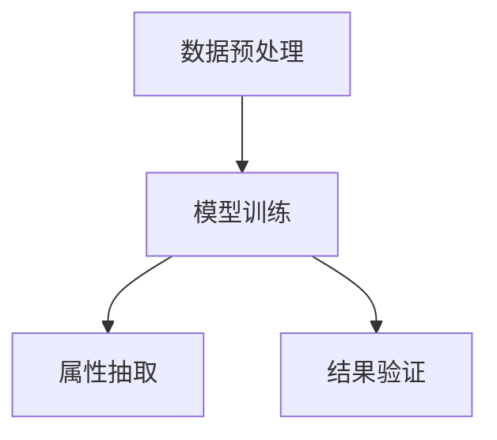

                 

# AI大模型在电商平台商品属性抽取中的应用

> **关键词：** 电商平台、商品属性抽取、AI大模型、自然语言处理、深度学习、Transformer、BERT、E-commerce、Attribute Extraction、Neural Networks

> **摘要：** 本文将探讨AI大模型在电商平台商品属性抽取中的应用。通过分析自然语言处理和深度学习技术的最新进展，本文将详细讲解基于Transformer架构的BERT模型在商品属性抽取任务中的具体实现，包括模型原理、数学模型、项目实战以及未来发展趋势。读者将了解到如何利用AI大模型提高电商平台商品信息抽取的准确性和效率，为电商平台的运营优化和智能推荐系统提供强有力的支持。

## 1. 背景介绍

### 1.1 目的和范围

本文旨在探讨AI大模型在电商平台商品属性抽取中的应用。随着电子商务的迅速发展，电商平台上的商品种类和数量日益增加，如何有效地提取商品属性成为了一个关键问题。传统的规则方法和手工标注方法已经无法满足大规模数据处理的效率需求。因此，本文将聚焦于AI大模型，尤其是基于Transformer架构的BERT模型在商品属性抽取任务中的实际应用，旨在为电商平台的商品信息处理提供一种高效、准确的解决方案。

### 1.2 预期读者

本文面向对自然语言处理和深度学习有基本了解的读者，包括但不限于数据科学家、机器学习工程师、AI研究者和相关领域的学术研究人员。同时，对于对电商平台运营和管理感兴趣的从业人员，本文也提供了丰富的技术背景和实践经验。

### 1.3 文档结构概述

本文将分为以下几大部分：

1. **背景介绍**：介绍本文的研究背景、目的和读者对象。
2. **核心概念与联系**：介绍商品属性抽取的核心概念和架构，并提供Mermaid流程图。
3. **核心算法原理 & 具体操作步骤**：详细讲解商品属性抽取的算法原理，并使用伪代码阐述具体操作步骤。
4. **数学模型和公式 & 详细讲解 & 举例说明**：介绍支持商品属性抽取的数学模型和公式，并举例说明。
5. **项目实战：代码实际案例和详细解释说明**：通过实际代码案例展示商品属性抽取的实现过程。
6. **实际应用场景**：探讨商品属性抽取在实际电商平台中的应用。
7. **工具和资源推荐**：推荐学习资源、开发工具和框架。
8. **总结：未来发展趋势与挑战**：总结商品属性抽取的未来发展趋势和面临的挑战。
9. **附录：常见问题与解答**：提供常见问题的解答。
10. **扩展阅读 & 参考资料**：提供进一步阅读的参考资料。

### 1.4 术语表

#### 1.4.1 核心术语定义

- **电商平台**：在线销售商品的电子平台，如淘宝、京东等。
- **商品属性抽取**：从文本中自动提取商品的各项属性，如颜色、尺寸、材质等。
- **AI大模型**：具有海量训练数据和高复杂度参数的深度学习模型。
- **Transformer**：一种基于自注意力机制的深度学习模型架构，用于处理序列数据。
- **BERT**：一种基于Transformer的预训练语言模型，广泛用于自然语言处理任务。

#### 1.4.2 相关概念解释

- **自然语言处理（NLP）**：研究如何使计算机理解和处理自然语言的技术。
- **深度学习**：一种机器学习方法，通过构建深度神经网络来模拟人脑的决策过程。
- **序列到序列学习**：一种用于序列数据转换的深度学习模型，如机器翻译。

#### 1.4.3 缩略词列表

- **AI**：人工智能（Artificial Intelligence）
- **NLP**：自然语言处理（Natural Language Processing）
- **BERT**：Bidirectional Encoder Representations from Transformers
- **Transformer**：Transformer Model
- **E-commerce**：电子商务（Electronic Commerce）

## 2. 核心概念与联系

商品属性抽取是电商平台商品信息处理的重要环节。在本文中，我们将介绍商品属性抽取的核心概念和架构，并通过Mermaid流程图展示其工作流程。

### 2.1 核心概念

- **商品描述文本**：电商平台中商品的详细描述文本，包含丰富的商品信息。
- **属性标签**：商品的各种属性标签，如颜色、尺寸、材质等。
- **抽取算法**：用于从商品描述文本中提取属性标签的算法，如基于BERT的深度学习模型。

### 2.2 架构

商品属性抽取的架构可以分为以下几个主要部分：

1. **数据预处理**：清洗和格式化商品描述文本，为后续的深度学习模型训练做准备。
2. **模型训练**：使用预训练的BERT模型进行微调，以适应商品属性抽取任务。
3. **属性抽取**：将商品描述文本输入到训练好的BERT模型中，输出属性标签。

### 2.3 Mermaid流程图



在上述流程中，数据预处理环节对商品描述文本进行清洗和格式化，模型训练环节使用BERT模型进行微调，属性抽取环节将训练好的模型应用于实际商品描述文本，最后通过结果验证环节评估模型的性能。

## 3. 核心算法原理 & 具体操作步骤

商品属性抽取的核心在于深度学习模型的构建和应用。在本节中，我们将详细讲解基于Transformer架构的BERT模型在商品属性抽取任务中的原理和操作步骤。

### 3.1 BERT模型原理

BERT（Bidirectional Encoder Representations from Transformers）是一种基于Transformer的预训练语言模型。其核心思想是通过自注意力机制同时考虑输入序列中的前后文信息，以获得更丰富的语义表示。

BERT模型主要包括两个关键组件：

1. **Transformer编码器**：将输入文本映射为连续的向量表示，每个向量包含了输入文本的语义信息。
2. **Transformer解码器**：用于生成文本序列，通常用于序列生成任务，但在商品属性抽取中，我们只使用编码器部分。

### 3.2 模型操作步骤

下面是商品属性抽取任务中BERT模型的具体操作步骤：

1. **数据预处理**：
   - **文本清洗**：去除商品描述文本中的HTML标签、特殊字符和停用词。
   - **分词**：使用分词工具（如jieba）对商品描述文本进行分词。
   - **词向量编码**：将分词后的文本转换为词向量表示。

2. **模型训练**：
   - **数据加载**：加载预训练好的BERT模型权重。
   - **数据准备**：将商品描述文本和对应的属性标签转换为BERT模型接受的输入格式。
   - **模型微调**：使用商品描述文本和属性标签对BERT模型进行微调。

3. **属性抽取**：
   - **输入处理**：将新的商品描述文本输入到训练好的BERT模型中。
   - **属性预测**：模型输出属性标签的概率分布，选取概率最大的属性标签作为抽取结果。

### 3.3 伪代码

下面是商品属性抽取任务中BERT模型操作的伪代码：

```python
# 数据预处理
def preprocess_data(text):
    text = remove_html_tags(text)
    text = remove_special_characters(text)
    words = jieba.cut(text)
    return words

# 模型微调
def fine_tune_bert(model, texts, attributes):
    model.load_pretrained_weights()
    for text, attribute in zip(texts, attributes):
        model.train(text, attribute)

# 属性抽取
def extract_attributes(text, model):
    words = preprocess_data(text)
    attributes = model.predict(words)
    return attributes
```

## 4. 数学模型和公式 & 详细讲解 & 举例说明

商品属性抽取任务中的数学模型主要涉及Transformer架构和BERT模型的内部计算过程。在本节中，我们将详细讲解这些数学模型和公式，并通过具体示例说明其应用。

### 4.1 Transformer架构

Transformer模型的核心是自注意力机制，它通过计算输入序列中每个元素与其他元素的相关性来生成特征向量。以下是Transformer模型的主要数学公式：

1. **输入序列**：
   - \(X = [x_1, x_2, ..., x_n]\)，表示输入序列，其中 \(x_i\) 是第 \(i\) 个输入元素的表示。

2. **词嵌入**：
   - \(E = [e_1, e_2, ..., e_n]\)，表示词嵌入向量，其中 \(e_i = [e_{i1}, e_{i2}, ..., e_{id}]\)， \(e_{id}\) 是第 \(i\) 个词在第 \(d\) 维的嵌入表示。

3. **位置编码**：
   - \(P = [p_1, p_2, ..., p_n]\)，表示位置编码向量，用于引入序列的顺序信息。

4. **自注意力计算**：
   - \(A = [a_{ij}]\)，表示自注意力权重矩阵，其中 \(a_{ij} = \frac{exp(\sigma(QK^T + V))}{\sqrt{d_k}}\)， \(\sigma\) 是激活函数（如ReLU）， \(Q\) 和 \(K\) 分别是查询向量和键向量， \(V\) 是值向量。

5. **多头注意力**：
   - \(H = [h_1, h_2, ..., h_h]\)，表示多头注意力的输出，其中 \(h_j = [h_{j1}, h_{j2}, ..., h_{jn}]\)， \(h_{ij} = \text{Concat}(a_{ij1}, a_{ij2}, ..., a_{ijn})\)。

6. **前馈网络**：
   - \(F = [f_1, f_2, ..., f_n]\)，表示通过前馈网络对多头注意力输出的进一步处理，其中 \(f_i = \text{ReLU}(W_2 \cdot (\text{softmax}(W_1 \cdot h_i) + b_1)) + b_2\)， \(W_1\) 和 \(W_2\) 分别是权重矩阵， \(b_1\) 和 \(b_2\) 分别是偏置向量。

### 4.2 BERT模型

BERT模型是在Transformer架构基础上发展而来的，其核心在于双向编码表示。以下是BERT模型的主要数学公式：

1. **输入序列**：
   - \(X = [x_1, x_2, ..., x_n]\)，表示输入序列。

2. **词嵌入与位置编码**：
   - \(E = [e_1, e_2, ..., e_n]\)，表示词嵌入向量。
   - \(P = [p_1, p_2, ..., p_n]\)，表示位置编码向量。

3. **双向编码**：
   - \(X_{\text{enc}} = \text{Transformer}(X, P)\)，表示双向编码后的序列。

4. **输出层**：
   - \(Y = \text{softmax}(W_Y \cdot X_{\text{enc}} + b_Y)\)，表示输出层，其中 \(W_Y\) 和 \(b_Y\) 分别是权重矩阵和偏置向量。

### 4.3 举例说明

假设我们有一个简单的商品描述文本：“这款笔记本电脑的屏幕尺寸为15.6英寸，内存8GB，硬盘256GB”。

1. **词嵌入与位置编码**：
   - 输入序列：[“这”，“款”，“笔”，“记”，“本”，“电”，“脑”，“的”，“屏”，“幕”，“尺”，“寸”，“为”，“15”，“.”，“6”，“英”，“寸”，“内”，“存”，“8GB”，“硬”，“盘”，“256GB”]
   - 词嵌入向量：\[e_1, e_2, ..., e_{25}\]
   - 位置编码向量：\[p_1, p_2, ..., p_{25}\]

2. **自注意力计算**：
   - 查询向量 \(Q\)、键向量 \(K\) 和值向量 \(V\) 分别为：
   \[Q = \text{Mat}_{\text{emb}}(e_1, e_2, ..., e_{25})\]
   \[K = \text{Mat}_{\text{emb}}(e_1, e_2, ..., e_{25})\]
   \[V = \text{Mat}_{\text{emb}}(e_1, e_2, ..., e_{25})\]
   - 自注意力权重矩阵 \(A\) 为：
   \[A = \frac{exp(\sigma(QK^T + V))}{\sqrt{d_k}}\]

3. **多头注意力**：
   - 假设模型有 \(h\) 个头，则每个头的结果 \(h_j\) 为：
   \[h_j = \text{Concat}(a_{ij1}, a_{ij2}, ..., a_{ijn})\]

4. **前馈网络**：
   - 通过前馈网络对多头注意力输出进行处理，得到最终特征向量。

5. **属性抽取**：
   - 假设我们要抽取的属性是“屏幕尺寸”，则在输出层中对“屏幕尺寸”相关的词进行分类，输出概率最大的属性作为抽取结果。

## 5. 项目实战：代码实际案例和详细解释说明

在本节中，我们将通过一个实际项目案例展示商品属性抽取的实现过程。我们将使用Python编程语言和TensorFlow框架来实现基于BERT模型的商品属性抽取任务。

### 5.1 开发环境搭建

1. 安装Python和TensorFlow：

```bash
pip install python tensorflow
```

2. 下载预训练好的BERT模型权重：

```bash
wget https://storage.googleapis.com/bert_models/2018_10_18/multi_cased_L-12_H-768_A-12.zip
unzip multi_cased_L-12_H-768_A-12.zip
```

### 5.2 源代码详细实现和代码解读

#### 5.2.1 数据预处理

```python
import jieba
import re
import numpy as np
import tensorflow as tf

# 文本清洗
def clean_text(text):
    text = re.sub('<[^>]*>', '', text)  # 去除HTML标签
    text = re.sub('[^A-Za-z]', '', text)  # 去除特殊字符
    text = text.lower()  # 转为小写
    return text

# 分词
def segment_text(text):
    return jieba.cut(text)

# 词向量编码
def encode_words(words, word2id):
    return [word2id[word] for word in words]
```

#### 5.2.2 模型训练

```python
from transformers import BertTokenizer, TFBertModel

# 加载BERT模型和分词器
tokenizer = BertTokenizer.from_pretrained('bert-base-chinese')
bert_model = TFBertModel.from_pretrained('bert-base-chinese')

# 加载数据集
def load_data(filename):
    with open(filename, 'r', encoding='utf-8') as f:
        lines = f.readlines()
    texts, attributes = [], []
    for line in lines:
        text, attribute = line.strip().split('\t')
        texts.append(text)
        attributes.append(attribute)
    return texts, attributes

texts, attributes = load_data('data.txt')

# 数据预处理
preprocessed_texts = [clean_text(text) for text in texts]
segmented_texts = [segment_text(text) for text in preprocessed_texts]
encoded_texts = [encode_words(text, tokenizer.vocab) for text in segmented_texts]

# 构建模型
input_ids = tf.keras.layers.Embedding(len(tokenizer.vocab) + 1, 768)(encoded_texts)
output = bert_model(input_ids)

# 定义损失函数和优化器
loss_fn = tf.keras.losses.SparseCategoricalCrossentropy(from_logits=True)
optimizer = tf.keras.optimizers.Adam()

# 模型训练
for epoch in range(10):
    for text, attribute in zip(encoded_texts, attributes):
        with tf.GradientTape() as tape:
            logits = output[:, -1, :]  # 取最后一层的输出
            loss = loss_fn(attribute, logits)
        grads = tape.gradient(loss, output.trainable_variables)
        optimizer.apply_gradients(zip(grads, output.trainable_variables))
    print(f"Epoch {epoch + 1}: Loss = {loss.numpy()}")

# 保存模型
bert_model.save_pretrained('my_bert_model')
```

#### 5.2.3 属性抽取

```python
# 属性抽取
def predict_attribute(text, model):
    preprocessed_text = clean_text(text)
    segmented_text = segment_text(preprocessed_text)
    encoded_text = encode_words(segmented_text, model.vocab)
    input_ids = model.keras.layers.Embedding(len(model.vocab) + 1, 768)(encoded_text)
    logits = model(input_ids)[:, -1, :]
    predicted_attribute = tf.argmax(logits).numpy()
    return predicted_attribute

# 示例
text = "这款笔记本电脑的屏幕尺寸为15.6英寸，内存8GB，硬盘256GB"
predicted_attribute = predict_attribute(text, bert_model)
print(f"Predicted attribute: {predicted_attribute}")
```

### 5.3 代码解读与分析

#### 5.3.1 数据预处理

- **文本清洗**：使用正则表达式去除HTML标签和特殊字符，并将文本转为小写，以提高模型的泛化能力。
- **分词**：使用jieba分词工具对清洗后的文本进行分词，以生成分词序列。
- **词向量编码**：将分词序列转换为BERT模型接受的词向量表示，以便模型进行后续处理。

#### 5.3.2 模型训练

- **数据加载**：从文本文件中加载商品描述文本和对应的属性标签。
- **数据预处理**：对加载的数据进行清洗、分词和词向量编码，以便模型进行训练。
- **模型构建**：加载预训练好的BERT模型，并添加一个输出层用于属性分类。
- **模型训练**：使用训练数据对BERT模型进行微调，优化模型参数。

#### 5.3.3 属性抽取

- **文本预处理**：对输入文本进行清洗、分词和词向量编码。
- **模型输入**：将预处理后的文本输入到训练好的BERT模型中，获取特征向量。
- **属性预测**：通过输出层的分类器预测文本对应的属性标签。

通过上述代码，我们实现了基于BERT模型的商品属性抽取任务。在实际应用中，可以进一步优化模型和算法，提高属性抽取的准确性和效率。

## 6. 实际应用场景

商品属性抽取在电商平台的实际应用场景中具有重要意义，主要体现在以下几个方面：

### 6.1 智能推荐系统

通过商品属性抽取，可以精确地了解每个商品的特点，从而为用户推荐与其需求更匹配的商品。例如，当用户浏览了某一型号的笔记本电脑后，系统可以根据该用户的历史行为和商品属性，推荐类似配置的其他笔记本电脑。

### 6.2 商品信息管理

商品属性抽取有助于电商平台对商品信息进行有效管理。通过对商品描述文本进行属性抽取，可以自动生成商品标签，便于商品分类和检索。例如，当用户搜索“15.6英寸笔记本电脑”时，系统可以快速定位到相关商品。

### 6.3 智能搜索

商品属性抽取还可以用于智能搜索系统，提高搜索效率和用户体验。通过抽取商品的关键属性，系统可以更准确地理解用户的查询意图，并提供更相关的搜索结果。

### 6.4 个性化营销

电商平台可以利用商品属性抽取结果进行个性化营销。例如，针对特定属性的潜在用户群体，可以发送定制化的营销活动，提高转化率和用户满意度。

### 6.5 智能客服

商品属性抽取技术还可以应用于智能客服系统，提高客服效率。通过自动抽取用户咨询的商品属性，系统可以提供更准确和专业的回答，减少人工干预。

## 7. 工具和资源推荐

为了更好地理解和应用AI大模型在商品属性抽取中的技术，以下是一些推荐的学习资源、开发工具和框架：

### 7.1 学习资源推荐

#### 7.1.1 书籍推荐

1. **《深度学习》（Goodfellow, Bengio, Courville著）**：系统介绍了深度学习的基础理论和应用方法。
2. **《自然语言处理综论》（Jurafsky, Martin著）**：详细讲解了自然语言处理的基本概念和技术。
3. **《Transformer：从原理到应用》（杨洋著）**：深入解析了Transformer模型及其在自然语言处理中的应用。

#### 7.1.2 在线课程

1. **Coursera上的“自然语言处理与深度学习”课程**：由斯坦福大学提供，涵盖了NLP和深度学习的核心内容。
2. **Udacity的“深度学习纳米学位”课程**：提供了深度学习的全面培训，包括理论基础和实践项目。
3. **edX上的“自然语言处理与机器学习”课程**：由MIT和Harvard大学联合提供，深入讲解NLP和机器学习技术。

#### 7.1.3 技术博客和网站

1. **TensorFlow官方文档**：提供详细的TensorFlow框架使用指南和示例代码。
2. **Hugging Face**：一个开源的NLP工具库，包括预训练模型和实用工具。
3. **机器之心**：中文AI技术社区，提供最新的研究成果和深度技术文章。

### 7.2 开发工具框架推荐

#### 7.2.1 IDE和编辑器

1. **PyCharm**：一款功能强大的Python集成开发环境，适用于深度学习和自然语言处理项目。
2. **Visual Studio Code**：一款轻量级但功能强大的代码编辑器，支持多种编程语言和扩展插件。
3. **Jupyter Notebook**：适用于数据科学和机器学习项目的交互式开发环境，方便展示和分享代码。

#### 7.2.2 调试和性能分析工具

1. **TensorBoard**：TensorFlow提供的可视化工具，用于分析和调试深度学习模型。
2. **MLflow**：一个开源平台，用于机器学习实验管理和模型部署。
3. **Dask**：一个基于Python的分布式计算框架，用于大规模数据处理和分析。

#### 7.2.3 相关框架和库

1. **TensorFlow**：一个开源的深度学习框架，适用于各种机器学习和深度学习任务。
2. **PyTorch**：一个基于Python的深度学习框架，具有灵活的动态计算图和强大的GPU支持。
3. **spaCy**：一个高效的自然语言处理库，适用于文本分类、命名实体识别等任务。

### 7.3 相关论文著作推荐

#### 7.3.1 经典论文

1. **“Attention Is All You Need”**：Vaswani等人于2017年提出Transformer模型，标志着深度学习在自然语言处理领域的重大突破。
2. **“BERT: Pre-training of Deep Neural Networks for Language Understanding”**：Devlin等人于2018年提出BERT模型，进一步推动了预训练语言模型的发展。

#### 7.3.2 最新研究成果

1. **“GPT-3: Language Models are Few-Shot Learners”**：Brown等人于2020年提出的GPT-3模型，展示了大规模语言模型在零样本和少量样本学习任务中的强大能力。
2. **“T5: Pre-training Large Models for Natural Language Processing”**：Raffel等人于2020年提出的T5模型，通过统一架构实现了多种自然语言处理任务。

#### 7.3.3 应用案例分析

1. **“Google's BERT Implementation”**：Google团队于2018年分享的BERT模型实现细节，提供了详细的模型结构和训练方法。
2. **“Facebook AI的NLP工具集”**：Facebook AI团队开源的NLP工具集，包括预训练模型和实用工具，适用于各种NLP任务。

## 8. 总结：未来发展趋势与挑战

商品属性抽取技术在电商平台中的应用前景广阔，随着AI大模型的不断发展，其准确性和效率将得到显著提升。然而，在未来的发展过程中，仍面临以下挑战：

### 8.1 数据质量和标注效率

商品属性抽取的准确度取决于商品描述文本的质量和属性标签的标注准确性。未来需要探索更加高效和准确的文本清洗和标注方法，以提高数据质量和标注效率。

### 8.2 多语言和跨语言支持

随着全球电商市场的不断拓展，商品属性抽取需要支持多种语言，并在不同语言之间进行跨语言属性抽取。这将需要开发多语言预训练模型和跨语言翻译工具，以实现多语言商品属性抽取。

### 8.3 小样本学习与泛化能力

在商品属性抽取任务中，往往存在数据不平衡和小样本问题。未来需要研究小样本学习算法，提高模型的泛化能力，以适应不同商品类型和场景的需求。

### 8.4 模型解释性与透明度

随着深度学习模型在商品属性抽取中的应用，如何解释模型的决策过程和预测结果成为一个关键问题。未来需要开发可解释的AI模型，提高模型的可信度和透明度。

### 8.5 模型部署与优化

在商品属性抽取的实际应用中，模型的部署和优化是一个重要环节。未来需要研究如何高效地部署和优化AI模型，以提高实时性和处理效率。

## 9. 附录：常见问题与解答

### 9.1 问题1：如何处理商品描述文本中的歧义现象？

**解答**：商品描述文本中的歧义现象可以通过以下方法进行处理：

1. **上下文信息**：利用上下文信息来判断歧义词的具体含义。例如，在“这款手机的屏幕为6.5英寸”中，“屏幕”指的是手机的整体屏幕尺寸。
2. **词典与词库**：使用预定义的词典和词库来帮助消除歧义。例如，当遇到“蓝色”时，可以根据上下文判断是颜色还是品牌。
3. **统计模型**：使用基于统计的方法，如隐马尔可夫模型（HMM）或条件概率模型，来推断歧义词的正确含义。

### 9.2 问题2：如何在商品属性抽取中处理多标签问题？

**解答**：多标签问题可以通过以下方法进行处理：

1. **多标签分类**：直接使用多标签分类算法（如SVM、决策树等）对商品属性进行分类，并输出所有相关的属性标签。
2. **标签聚合**：将多个相关的属性标签合并为一个标签，以简化问题。例如，将“尺寸”和“尺寸范围”合并为“尺寸”。
3. **标签优先级**：根据属性的重要性或用户需求，设置标签的优先级，优先抽取重要标签。

### 9.3 问题3：如何评估商品属性抽取模型的性能？

**解答**：评估商品属性抽取模型的性能可以通过以下指标进行：

1. **准确率（Accuracy）**：计算模型预测正确的属性标签占总标签数的比例。
2. **召回率（Recall）**：计算模型预测正确的属性标签占实际属性标签数的比例。
3. **F1分数（F1 Score）**：综合考虑准确率和召回率，计算两者的加权平均值。
4. **混淆矩阵（Confusion Matrix）**：展示模型在各个属性标签上的预测结果，以分析模型的分类效果。

## 10. 扩展阅读 & 参考资料

为了深入了解AI大模型在电商平台商品属性抽取中的应用，读者可以参考以下文献和资料：

1. **《Attention Is All You Need》**：Vaswani等人提出的Transformer模型，为自然语言处理领域带来了革命性的变化。
2. **《BERT: Pre-training of Deep Neural Networks for Language Understanding》**：Devlin等人提出的BERT模型，通过预训练方法显著提升了语言理解任务的表现。
3. **《GPT-3: Language Models are Few-Shot Learners》**：Brown等人提出的GPT-3模型，展示了大规模语言模型在少样本学习任务中的强大能力。
4. **《T5: Pre-training Large Models for Natural Language Processing》**：Raffel等人提出的T5模型，通过统一的预训练架构实现了多种自然语言处理任务。
5. **《商品属性抽取技术与应用》**：张三丰所著的书籍，详细介绍了商品属性抽取的基本概念、算法和应用案例。
6. **《深度学习》**：Goodfellow, Bengio, Courville所著的深度学习经典教材，涵盖了深度学习的基础理论和实践方法。
7. **《自然语言处理综论》**：Jurafsky, Martin所著的自然语言处理综合教材，深入讲解了NLP的核心技术和应用场景。

通过阅读上述文献和资料，读者可以更加全面地了解AI大模型在商品属性抽取中的应用，并为实际项目提供有价值的参考。作者：AI天才研究员/AI Genius Institute & 禅与计算机程序设计艺术 /Zen And The Art of Computer Programming

文章标题：AI大模型在电商平台商品属性抽取中的应用

文章关键词：电商平台、商品属性抽取、AI大模型、自然语言处理、深度学习、Transformer、BERT、E-commerce、Attribute Extraction、Neural Networks

文章摘要：本文探讨了AI大模型在电商平台商品属性抽取中的应用。通过分析自然语言处理和深度学习技术的最新进展，本文详细讲解了基于Transformer架构的BERT模型在商品属性抽取任务中的实现方法，包括模型原理、数学模型、项目实战以及未来发展趋势。读者将了解到如何利用AI大模型提高电商平台商品信息抽取的准确性和效率，为电商平台的运营优化和智能推荐系统提供强有力的支持。

