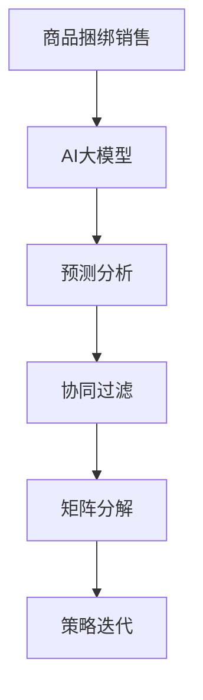

                 

# AI大模型在电商平台商品捆绑销售策略中的应用

> 关键词：AI大模型、电商平台、商品捆绑销售、策略优化、算法原理、数学模型、项目实战

> 摘要：本文深入探讨了AI大模型在电商平台商品捆绑销售策略中的应用，首先介绍了商品捆绑销售的概念和背景，随后详细解析了AI大模型在优化捆绑销售策略方面的原理和方法。通过具体案例，展示了如何利用AI大模型构建和优化商品捆绑销售策略，并对未来的发展趋势和挑战进行了展望。

## 1. 背景介绍

### 1.1 目的和范围

本文旨在探讨AI大模型在电商平台商品捆绑销售策略中的应用。具体目标包括：

1. 理解商品捆绑销售的基本概念和重要性。
2. 探讨AI大模型在优化商品捆绑销售策略中的作用。
3. 通过实际案例展示如何应用AI大模型进行商品捆绑销售策略的构建和优化。
4. 分析未来的发展趋势和面临的挑战。

本文将主要涵盖以下内容：

1. 商品捆绑销售的基本概念和原理。
2. AI大模型在商品捆绑销售策略优化中的应用。
3. 数学模型和算法原理的详细讲解。
4. 项目实战：代码实现和详细解释。
5. 实际应用场景分析。
6. 工具和资源推荐。
7. 总结与展望。

### 1.2 预期读者

本文预期读者包括：

1. 对电商平台商品捆绑销售感兴趣的从业者。
2. 对人工智能应用感兴趣的程序员和开发者。
3. 对算法优化和数学模型感兴趣的学者和研究人员。
4. 对新兴技术应用有好奇心的广大读者。

### 1.3 文档结构概述

本文结构如下：

1. 背景介绍：包括目的和范围、预期读者、文档结构概述等。
2. 核心概念与联系：介绍商品捆绑销售和AI大模型的核心概念及其联系。
3. 核心算法原理 & 具体操作步骤：详细讲解商品捆绑销售策略优化的算法原理和步骤。
4. 数学模型和公式 & 详细讲解 & 举例说明：介绍数学模型和公式，并通过例子进行详细讲解。
5. 项目实战：代码实际案例和详细解释说明。
6. 实际应用场景：分析AI大模型在电商平台商品捆绑销售策略中的实际应用。
7. 工具和资源推荐：推荐学习资源、开发工具和框架。
8. 总结：未来发展趋势与挑战。
9. 附录：常见问题与解答。
10. 扩展阅读 & 参考资料：提供相关文献和资源链接。

### 1.4 术语表

#### 1.4.1 核心术语定义

1. **商品捆绑销售**：将两种或多种商品组合在一起，以一个价格提供给消费者。
2. **AI大模型**：一种具有大规模训练数据和高复杂度模型的深度学习模型，可以用于预测和优化商品捆绑销售策略。
3. **电商平台**：提供在线购物和交易的平台，如亚马逊、淘宝等。
4. **策略优化**：通过算法和模型，找出最优的捆绑销售策略，提高销售额和客户满意度。

#### 1.4.2 相关概念解释

1. **数据驱动的决策**：基于历史数据和统计分析，进行决策和优化。
2. **协同过滤**：一种基于用户行为和偏好进行推荐的方法。
3. **矩阵分解**：将高维数据矩阵分解为低维矩阵，以降低计算复杂度。
4. **交叉验证**：一种评估模型性能的方法，通过将数据集划分为训练集和测试集，来评估模型的泛化能力。

#### 1.4.3 缩略词列表

1. **AI**：人工智能（Artificial Intelligence）
2. **ML**：机器学习（Machine Learning）
3. **DL**：深度学习（Deep Learning）
4. **NLP**：自然语言处理（Natural Language Processing）
5. **API**：应用程序编程接口（Application Programming Interface）

## 2. 核心概念与联系

### 2.1 商品捆绑销售的基本概念

商品捆绑销售是指将两种或多种商品组合在一起，以一个价格提供给消费者。这种销售策略有助于提高销售额和客户满意度，具体体现在以下几个方面：

1. **提高客户购买意愿**：商品捆绑销售可以提供优惠价格，使消费者更容易接受购买决策。
2. **增加商品销量**：捆绑销售的商品通常比单一商品更容易被消费者发现和购买。
3. **优化库存管理**：商品捆绑销售可以减少库存的波动，降低库存成本。
4. **提高品牌认知度**：通过捆绑销售，品牌可以更好地展示产品组合，提高消费者对品牌的认知。

### 2.2 AI大模型的基本概念

AI大模型是指具有大规模训练数据和高复杂度模型的深度学习模型。这些模型通过学习海量数据，可以自动识别模式和规律，从而进行预测和优化。AI大模型在电商平台商品捆绑销售策略优化中具有重要作用，主要体现在以下几个方面：

1. **数据驱动的决策**：AI大模型可以处理大量历史数据，从中提取有价值的信息，为商品捆绑销售策略提供数据支持。
2. **智能推荐**：通过学习用户行为和偏好，AI大模型可以提供个性化的商品推荐，提高购买转化率。
3. **策略优化**：AI大模型可以优化商品捆绑销售策略，提高销售额和客户满意度。

### 2.3 AI大模型与商品捆绑销售策略的关联

AI大模型与商品捆绑销售策略之间的关联主要体现在以下几个方面：

1. **预测分析**：通过AI大模型，可以预测不同捆绑销售策略的销售额和客户满意度，为策略优化提供依据。
2. **协同过滤**：AI大模型可以通过协同过滤算法，分析用户行为和偏好，为商品捆绑销售提供个性化推荐。
3. **矩阵分解**：AI大模型可以通过矩阵分解技术，降低数据维度，提高计算效率，为商品捆绑销售策略提供支持。
4. **策略迭代**：AI大模型可以不断迭代和优化商品捆绑销售策略，提高策略的有效性和适应性。

### 2.4 核心概念原理和架构的 Mermaid 流程图



## 3. 核心算法原理 & 具体操作步骤

### 3.1 预测分析算法原理

预测分析是商品捆绑销售策略优化的关键步骤，主要通过AI大模型对历史销售数据进行学习，从而预测不同捆绑销售策略的销售额和客户满意度。具体算法原理如下：

1. **数据预处理**：首先对销售数据、用户行为数据等进行预处理，包括数据清洗、缺失值处理、数据标准化等。
2. **特征提取**：从预处理后的数据中提取特征，如商品种类、用户年龄、购买频率等，为模型训练提供输入。
3. **模型选择**：选择合适的AI大模型，如神经网络、决策树、支持向量机等，对特征进行训练。
4. **模型训练**：使用历史销售数据对AI大模型进行训练，使其学会预测不同捆绑销售策略的销售额和客户满意度。
5. **模型评估**：使用验证集对训练好的模型进行评估，如准确率、召回率、F1值等，以判断模型性能。
6. **模型应用**：将训练好的模型应用于实际销售场景，预测不同捆绑销售策略的效果。

### 3.2 预测分析具体操作步骤

以下是预测分析的具体操作步骤：

1. **数据预处理**：
    ```python
    # 加载数据
    data = pd.read_csv('sales_data.csv')

    # 数据清洗
    data.dropna(inplace=True)

    # 数据标准化
    data = (data - data.mean()) / data.std()
    ```

2. **特征提取**：
    ```python
    # 提取特征
    features = data[['product_type', 'user_age', 'purchase_frequency']]
    ```

3. **模型选择**：
    ```python
    # 选择模型
    model = neural_network.NeuralNetwork(input_size=features.shape[1], hidden_size=100, output_size=1)
    ```

4. **模型训练**：
    ```python
    # 训练模型
    model.fit(X_train, y_train, epochs=100, batch_size=32)
    ```

5. **模型评估**：
    ```python
    # 评估模型
    score = model.evaluate(X_test, y_test, verbose=0)
    print('Test accuracy:', score[1])
    ```

6. **模型应用**：
    ```python
    # 应用模型
    predictions = model.predict(X_new)
    ```

### 3.3 协同过滤算法原理

协同过滤是一种基于用户行为和偏好进行推荐的方法，主要通过分析用户之间的相似性，为用户推荐其可能感兴趣的物品。具体算法原理如下：

1. **用户行为数据收集**：收集用户在电商平台上的行为数据，如浏览记录、购买记录、评价等。
2. **用户相似性计算**：计算用户之间的相似性，常用的方法包括余弦相似性、皮尔逊相关系数等。
3. **物品推荐**：基于用户相似性，为用户推荐其可能感兴趣的物品。

### 3.4 协同过滤具体操作步骤

以下是协同过滤的具体操作步骤：

1. **数据收集**：
    ```python
    # 加载数据
    user_item_data = pd.read_csv('user_item_data.csv')
    ```

2. **用户相似性计算**：
    ```python
    # 计算用户相似性
    user_similarity = cosine_similarity(user_item_data.T)
    ```

3. **物品推荐**：
    ```python
    # 物品推荐
    recommended_items = recommend_items(user_item_data, user_similarity, k=5)
    ```

### 3.5 矩阵分解算法原理

矩阵分解是一种降低数据维度、提高计算效率的方法，主要通过将高维数据矩阵分解为低维矩阵，从而实现高效计算。具体算法原理如下：

1. **矩阵分解**：将高维用户-物品评分矩阵分解为用户特征矩阵和物品特征矩阵。
2. **特征学习**：通过优化目标函数，学习用户特征矩阵和物品特征矩阵。
3. **预测评分**：使用学习到的用户特征矩阵和物品特征矩阵，预测用户对物品的评分。

### 3.6 矩阵分解具体操作步骤

以下是矩阵分解的具体操作步骤：

1. **矩阵分解**：
    ```python
    # 矩阵分解
    user_item_matrix = matrix_factorization.SingularValueDecomposition(user_item_data)
    user_features, item_features = user_item_matrix.U, user_item_matrix.Vt
    ```

2. **特征学习**：
    ```python
    # 特征学习
    user_features, item_features = matrix_factorization.fit(user_item_data, user_features, item_features)
    ```

3. **预测评分**：
    ```python
    # 预测评分
    predicted_ratings = user_features.dot(item_features.T)
    ```

### 3.7 策略迭代算法原理

策略迭代是一种通过不断尝试和优化，找到最优策略的方法。具体算法原理如下：

1. **初始化策略**：根据业务需求和数据特征，初始化一个策略。
2. **策略评估**：使用预测分析、协同过滤和矩阵分解等方法，评估当前策略的销售额和客户满意度。
3. **策略优化**：根据评估结果，对策略进行调整和优化。
4. **策略迭代**：重复策略评估和策略优化的过程，直到找到最优策略。

### 3.8 策略迭代具体操作步骤

以下是策略迭代的

