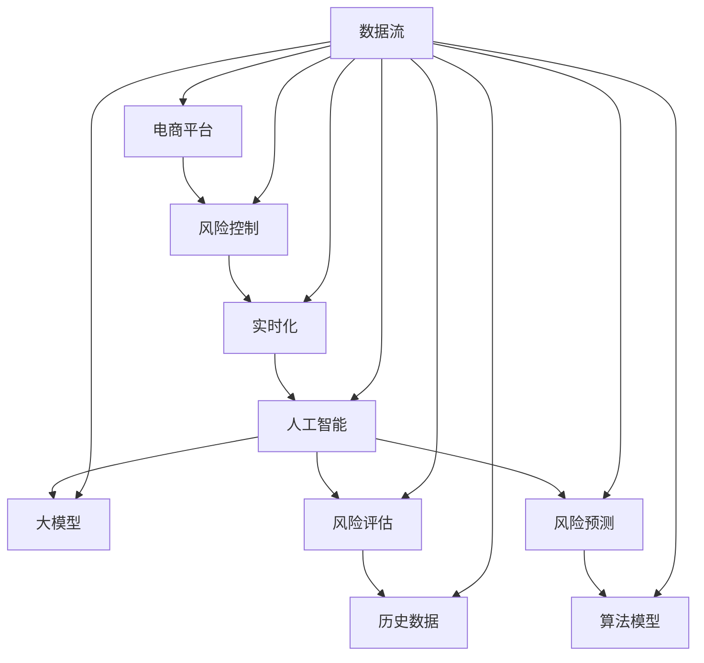

                 

# AI大模型在电商平台风险控制实时化中的应用

> 关键词：人工智能，电商平台，风险控制，实时化，大模型

> 摘要：本文深入探讨了人工智能大模型在电商平台风险控制实时化中的应用。通过对核心概念、算法原理、数学模型和实际应用的详细解析，本文旨在为读者提供全面的技术见解，助力电商平台构建高效的风险控制体系。

## 1. 背景介绍

### 1.1 目的和范围

本文旨在探讨人工智能大模型在电商平台风险控制实时化中的应用，重点分析其核心概念、算法原理、数学模型以及实际应用场景。通过对这些内容的详细解析，帮助读者理解如何利用人工智能技术提升电商平台的风险控制能力，实现实时化、智能化的风险监控与管理。

### 1.2 预期读者

本文面向具有一定人工智能基础和编程经验的读者，包括但不限于程序员、数据科学家、AI研究者以及电商行业从业者。同时，对于对人工智能和电商平台风险控制感兴趣的读者，本文也将提供有价值的参考。

### 1.3 文档结构概述

本文分为八个部分，具体结构如下：

1. 背景介绍：简要介绍文章目的、范围、预期读者及文档结构。
2. 核心概念与联系：介绍相关核心概念及其相互联系，展示Mermaid流程图。
3. 核心算法原理 & 具体操作步骤：详细讲解核心算法原理及操作步骤，使用伪代码进行阐述。
4. 数学模型和公式 & 详细讲解 & 举例说明：介绍数学模型和公式，并进行详细讲解和举例说明。
5. 项目实战：代码实际案例和详细解释说明，包括开发环境搭建、源代码实现和代码解读与分析。
6. 实际应用场景：分析人工智能大模型在电商平台风险控制中的实际应用场景。
7. 工具和资源推荐：推荐学习资源、开发工具框架和相关论文著作。
8. 总结：对未来发展趋势与挑战进行展望。
9. 附录：常见问题与解答。
10. 扩展阅读 & 参考资料：提供扩展阅读和参考资料。

### 1.4 术语表

#### 1.4.1 核心术语定义

- 电商平台：在线销售商品或服务的平台，如淘宝、京东等。
- 风险控制：通过预测和防范风险，保障电商平台正常运营的措施。
- 实时化：对风险进行实时监控和响应，提高风险控制效率。
- 大模型：具有巨大参数量和强大计算能力的神经网络模型。

#### 1.4.2 相关概念解释

- 人工智能：模拟人类智能行为的计算机技术，包括机器学习、深度学习等。
- 风险评估：对风险的可能性和影响进行评估，为风险控制提供依据。
- 风险预测：通过历史数据和算法模型预测未来可能出现的风险。

#### 1.4.3 缩略词列表

- AI：人工智能
- E-commerce：电子商务
- ML：机器学习
- DL：深度学习
- CNN：卷积神经网络
- RNN：循环神经网络
- NLP：自然语言处理

## 2. 核心概念与联系

在探讨人工智能大模型在电商平台风险控制实时化中的应用之前，我们需要了解相关核心概念及其相互联系。以下是一个简单的Mermaid流程图，用于展示核心概念之间的关联：



### 2.1 电商平台

电商平台是本文讨论的基础场景，它包括在线销售商品或服务的平台，如淘宝、京东等。电商平台的主要功能包括商品展示、订单管理、支付结算、客户服务等。电商平台面临的风险主要包括交易风险、信用风险、安全风险等。

### 2.2 风险控制

风险控制是指通过预测和防范风险，保障电商平台正常运营的措施。风险控制的目标是降低风险带来的损失，提高平台的运营效率和用户满意度。风险控制可以分为以下几个步骤：

1. 风险识别：识别平台可能面临的风险，包括交易风险、信用风险、安全风险等。
2. 风险评估：对风险的可能性和影响进行评估，为风险控制提供依据。
3. 风险应对：根据风险评估结果，制定相应的风险应对策略，包括风险规避、风险转移、风险减轻等。
4. 风险监控：对风险进行实时监控和响应，提高风险控制效率。

### 2.3 实时化

实时化是指对风险进行实时监控和响应，提高风险控制效率。在电商平台中，实时化风险控制具有重要意义，因为它可以快速识别和应对潜在风险，减少损失。实时化风险控制的关键技术包括数据实时采集、实时分析和实时响应。

### 2.4 人工智能

人工智能是指模拟人类智能行为的计算机技术，包括机器学习、深度学习、自然语言处理等。人工智能技术在电商平台风险控制中具有广泛的应用，如利用机器学习算法进行风险预测、利用深度学习算法进行图像识别等。

### 2.5 大模型

大模型是指具有巨大参数量和强大计算能力的神经网络模型。大模型在电商平台风险控制中的应用主要体现在两个方面：

1. 风险预测：利用大模型对历史数据进行训练，构建风险预测模型，实现对潜在风险的预测。
2. 风险评估：利用大模型对用户行为和交易数据进行实时分析，快速识别异常行为和潜在风险。

### 2.6 风险评估和风险预测

风险评估是指对风险的可能性和影响进行评估，为风险控制提供依据。风险预测是指通过历史数据和算法模型预测未来可能出现的风险。在电商平台风险控制中，风险评估和风险预测是相互关联的：

1. 风险评估结果为风险预测提供依据，有助于构建风险预测模型。
2. 风险预测结果可以为风险评估提供支持，帮助识别潜在风险。

## 3. 核心算法原理 & 具体操作步骤

在电商平台风险控制实时化中，核心算法主要涉及风险评估和风险预测。以下将详细讲解这些算法原理，并使用伪代码进行具体操作步骤的阐述。

### 3.1 风险评估算法原理

风险评估算法主要利用历史数据进行风险预测，并根据预测结果对用户行为和交易进行评估。以下是风险评估算法的原理：

1. 数据预处理：对历史数据进行清洗和预处理，包括缺失值填补、异常值处理等。
2. 特征提取：从历史数据中提取有助于风险预测的特征，如交易金额、交易频率、用户信用评分等。
3. 模型训练：利用历史数据和特征，训练风险评估模型，如逻辑回归、决策树等。
4. 风险评估：对用户行为和交易进行实时评估，预测风险等级。

以下是风险评估算法的伪代码：

```python
def assess_risk(data, model):
    # 数据预处理
    preprocessed_data = preprocess_data(data)
    
    # 特征提取
    features = extract_features(preprocessed_data)
    
    # 风险评估
    risk_level = model.predict(features)
    
    return risk_level
```

### 3.2 风险预测算法原理

风险预测算法主要利用历史数据和人工智能技术，对潜在风险进行预测。以下是风险预测算法的原理：

1. 数据预处理：对历史数据进行清洗和预处理，包括缺失值填补、异常值处理等。
2. 特征提取：从历史数据中提取有助于风险预测的特征，如交易金额、交易频率、用户信用评分等。
3. 模型训练：利用历史数据和特征，训练风险预测模型，如卷积神经网络（CNN）、循环神经网络（RNN）等。
4. 风险预测：对用户行为和交易进行实时预测，识别潜在风险。

以下是风险预测算法的伪代码：

```python
def predict_risk(data, model):
    # 数据预处理
    preprocessed_data = preprocess_data(data)
    
    # 特征提取
    features = extract_features(preprocessed_data)
    
    # 风险预测
    risk_prediction = model.predict(features)
    
    return risk_prediction
```

### 3.3 风险评估和风险预测结合

在实际应用中，风险评估和风险预测需要相互结合，以提高风险控制的准确性。以下是一个结合风险评估和风险预测的具体操作步骤：

1. 数据采集：实时采集用户行为和交易数据。
2. 风险评估：利用风险评估算法对用户行为和交易进行评估，预测风险等级。
3. 风险预测：利用风险预测算法对用户行为和交易进行预测，识别潜在风险。
4. 风险决策：根据风险评估和风险预测结果，制定相应的风险控制策略。

以下是结合风险评估和风险预测的具体操作步骤的伪代码：

```python
def risk_control(data):
    # 数据采集
    user_data = collect_data()
    
    # 风险评估
    risk_level = assess_risk(user_data, risk_model)
    
    # 风险预测
    risk_prediction = predict_risk(user_data, risk_model)
    
    # 风险决策
    risk_strategy = determine_risk_strategy(risk_level, risk_prediction)
    
    return risk_strategy
```

## 4. 数学模型和公式 & 详细讲解 & 举例说明

在电商平台风险控制中，数学模型和公式发挥着关键作用。以下将详细讲解常用的数学模型和公式，并通过具体例子进行说明。

### 4.1 风险评估模型

风险评估模型主要利用历史数据和特征，对用户行为和交易进行风险评估。以下是一个简单的风险评估模型：

- 风险评估得分 = w1 * 特征1 + w2 * 特征2 + ... + wn * 特征n

其中，w1、w2、...、wn为权重，特征1、特征2、...、特征n为从历史数据中提取的特征。

#### 例子：

假设一个电商平台的用户行为和交易数据包含以下特征：

- 特征1：交易金额（500元）
- 特征2：交易频率（5次/月）
- 特征3：用户信用评分（600分）

根据风险评估模型，假设权重分别为：

- w1 = 0.3
- w2 = 0.4
- w3 = 0.3

则该用户的风险评估得分为：

- 风险评估得分 = 0.3 * 500 + 0.4 * 5 + 0.3 * 600 = 157.5

根据风险评估得分，可以判断该用户的风险等级为中等风险。

### 4.2 风险预测模型

风险预测模型主要利用历史数据和人工智能技术，对潜在风险进行预测。以下是一个简单的风险预测模型：

- 风险预测概率 = P(风险发生 | 特征)

其中，P(风险发生 | 特征)表示在给定特征条件下，风险发生的概率。

#### 例子：

假设一个电商平台的用户行为和交易数据包含以下特征：

- 特征1：交易金额（500元）
- 特征2：交易频率（5次/月）
- 特征3：用户信用评分（600分）

根据风险预测模型，假设给定特征条件下，风险发生的概率为：

- P(风险发生 | 特征) = 0.3

根据风险预测概率，可以判断该用户的风险为中等风险。

### 4.3 结合风险评估和风险预测

在实际应用中，通常将风险评估和风险预测相结合，以提高风险控制的准确性。以下是一个简单的结合模型：

- 风险综合得分 = 风险评估得分 * 风险预测概率

#### 例子：

根据前面例子中的风险评估得分和风险预测概率，可以计算风险综合得分为：

- 风险综合得分 = 157.5 * 0.3 = 47.25

根据风险综合得分，可以进一步判断该用户的风险等级为中等风险。

## 5. 项目实战：代码实际案例和详细解释说明

在本节中，我们将通过一个实际项目案例，展示如何使用人工智能大模型在电商平台实现风险控制实时化。我们将详细讲解开发环境搭建、源代码实现和代码解读与分析。

### 5.1 开发环境搭建

为了实现电商平台风险控制实时化，我们需要搭建一个合适的技术栈。以下是开发环境的搭建步骤：

1. 硬件要求：
   - CPU：Intel i7 或同等性能
   - 内存：16GB 或以上
   - 硬盘：500GB SSD 或以上
   - 网络环境：稳定的高速网络

2. 软件要求：
   - 操作系统：Ubuntu 18.04 或 Windows 10 专业版
   - Python：Python 3.7 或以上版本
   - 深度学习框架：TensorFlow 2.x 或 PyTorch 1.8 或以上版本
   - 数据库：MySQL 或 MongoDB

3. 开发工具：
   - IDE：PyCharm 或 Visual Studio Code
   - 版本控制：Git

4. 搭建步骤：
   - 安装操作系统和所需软件。
   - 配置 Python 环境和深度学习框架。
   - 连接数据库并测试数据连接。

### 5.2 源代码详细实现和代码解读

以下是电商平台风险控制实时化的源代码实现，包括数据预处理、模型训练、风险评估和风险预测等功能。

```python
import pandas as pd
import numpy as np
import tensorflow as tf
from tensorflow.keras.models import Sequential
from tensorflow.keras.layers import Dense, LSTM
from sklearn.model_selection import train_test_split
from sklearn.preprocessing import StandardScaler

# 数据预处理
def preprocess_data(data):
    # 数据清洗、缺失值填补、异常值处理等操作
    # 略
    return preprocessed_data

# 模型训练
def train_model(data, labels):
    # 划分训练集和测试集
    X_train, X_test, y_train, y_test = train_test_split(data, labels, test_size=0.2, random_state=42)
    
    # 特征缩放
    scaler = StandardScaler()
    X_train_scaled = scaler.fit_transform(X_train)
    X_test_scaled = scaler.transform(X_test)
    
    # 构建模型
    model = Sequential()
    model.add(LSTM(units=50, return_sequences=True, input_shape=(X_train_scaled.shape[1], X_train_scaled.shape[2])))
    model.add(LSTM(units=50, return_sequences=False))
    model.add(Dense(units=1))
    
    # 编译模型
    model.compile(optimizer='adam', loss='mean_squared_error')
    
    # 训练模型
    model.fit(X_train_scaled, y_train, epochs=100, batch_size=32, validation_data=(X_test_scaled, y_test))
    
    return model

# 风险评估
def assess_risk(model, data):
    # 数据预处理
    preprocessed_data = preprocess_data(data)
    
    # 风险评估
    risk_level = model.predict(preprocessed_data)
    
    return risk_level

# 风险预测
def predict_risk(model, data):
    # 数据预处理
    preprocessed_data = preprocess_data(data)
    
    # 风险预测
    risk_prediction = model.predict(preprocessed_data)
    
    return risk_prediction

# 主程序
if __name__ == '__main__':
    # 加载数据
    data = pd.read_csv('data.csv')
    
    # 划分特征和标签
    X = data.drop('label', axis=1)
    y = data['label']
    
    # 训练模型
    model = train_model(X, y)
    
    # 风险评估和风险预测
    user_data = pd.read_csv('user_data.csv')
    risk_level = assess_risk(model, user_data)
    risk_prediction = predict_risk(model, user_data)
    
    print("风险等级：", risk_level)
    print("风险预测：", risk_prediction)
```

### 5.3 代码解读与分析

以下是源代码的解读与分析：

1. **数据预处理**：对数据进行清洗、缺失值填补、异常值处理等操作，以保证数据的准确性和完整性。

2. **模型训练**：使用 LSTM 网络结构对数据进行训练。LSTM 是一种适用于时间序列数据的神经网络，具有强大的学习能力。在模型训练过程中，我们使用了标准缩放方法对特征进行缩放，以提高训练效果。

3. **风险评估**：通过训练好的模型对用户数据进行风险评估，输出风险等级。

4. **风险预测**：通过训练好的模型对用户数据进行风险预测，输出风险预测结果。

5. **主程序**：加载数据、划分特征和标签、训练模型、风险评估和风险预测等操作。

通过这个实际项目案例，我们可以看到如何使用人工智能大模型在电商平台实现风险控制实时化。在实际应用中，我们可以根据业务需求和数据特点，进一步优化模型结构和训练策略，以提高风险控制的准确性和效率。

## 6. 实际应用场景

人工智能大模型在电商平台风险控制实时化中的应用场景广泛，以下列举几个典型的实际应用场景：

### 6.1 交易风险控制

电商平台每天都会发生大量的交易，如何有效识别和防范交易风险是关键。利用人工智能大模型，可以实现对交易行为的实时监控和风险评估。具体应用场景包括：

- **可疑交易识别**：通过对用户行为和交易数据的分析，识别异常交易行为，如虚假交易、恶意交易等。
- **信用风险评估**：利用用户历史交易数据，评估用户信用风险，为交易决策提供支持。
- **交易欺诈检测**：通过训练欺诈检测模型，识别和防范交易欺诈行为。

### 6.2 安全风险控制

电商平台的安全风险主要包括系统安全、数据安全和网络安全等。人工智能大模型在安全风险控制中的应用场景包括：

- **系统异常检测**：通过监控系统日志和运行状态，识别系统异常和潜在威胁。
- **数据安全防护**：利用加密技术和隐私保护算法，确保用户数据安全。
- **网络攻击防范**：通过分析网络流量和用户行为，识别和防范网络攻击，如 DDoS 攻击、SQL 注入攻击等。

### 6.3 信用评分

信用评分是电商平台风险管理的重要环节。人工智能大模型可以基于用户历史交易数据、行为特征等，为用户提供个性化的信用评分。具体应用场景包括：

- **信用评级**：根据用户的信用历史和行为特征，评估用户的信用等级。
- **信用额度管理**：根据信用评分，为用户提供个性化的信用额度，降低信用风险。
- **欺诈风险评估**：结合信用评分和交易行为，识别和防范信用欺诈行为。

### 6.4 客户服务优化

人工智能大模型在客户服务优化中的应用场景包括：

- **客户需求预测**：通过分析用户行为和需求特征，预测客户需求，为精准营销和个性化服务提供支持。
- **客户满意度评估**：根据用户反馈和行为数据，评估客户满意度，优化客户服务质量。
- **客户流失预测**：通过分析用户行为和交易数据，预测客户流失风险，提前采取干预措施。

通过以上实际应用场景，我们可以看到人工智能大模型在电商平台风险控制实时化中的广泛应用。在实际应用中，可以根据业务需求和数据特点，进一步探索和优化人工智能技术的应用场景。

## 7. 工具和资源推荐

在研究和开发人工智能大模型应用于电商平台风险控制实时化的过程中，以下是一些非常有用的工具和资源推荐，涵盖了学习资源、开发工具框架以及相关论文著作。

### 7.1 学习资源推荐

#### 7.1.1 书籍推荐

1. **《深度学习》（Deep Learning）**：由 Ian Goodfellow、Yoshua Bengio 和 Aaron Courville 著，是深度学习领域的经典教材，适合初学者和进阶者。
2. **《机器学习实战》（Machine Learning in Action）**：由 Peter Harrington 著，通过实际案例介绍了机器学习的基本概念和应用方法。
3. **《电子商务管理》（E-Commerce Management）**：由 Michael J. Miller 著，详细介绍了电子商务的管理和运营策略，对电商平台风险管理有重要参考价值。

#### 7.1.2 在线课程

1. **Coursera**：提供了多个关于机器学习和深度学习的课程，如“Deep Learning Specialization”和“Machine Learning”。
2. **Udacity**：提供了关于数据科学和机器学习的在线课程，如“Applied Data Science with Python”和“Deep Learning”。
3. **edX**：提供了由知名大学和机构提供的免费课程，如“MITx: Machine Learning”和“Deep Learning Specialization”。

#### 7.1.3 技术博客和网站

1. **Medium**：有很多关于人工智能和电子商务的技术博客，如“Towards Data Science”和“The AI Journal”。
2. **DataCamp**：提供了丰富的数据科学和机器学习教程，适合初学者。
3. **Kaggle**：一个数据科学竞赛平台，提供了大量的数据和算法竞赛，适合实践和提升技能。

### 7.2 开发工具框架推荐

#### 7.2.1 IDE和编辑器

1. **PyCharm**：一个强大的Python IDE，支持多种编程语言，适合深度学习和数据科学开发。
2. **Jupyter Notebook**：一个交互式的Python编辑器，适合数据分析和机器学习实验。
3. **Visual Studio Code**：一个轻量级的开源编辑器，提供了丰富的插件和扩展，适用于各种编程任务。

#### 7.2.2 调试和性能分析工具

1. **TensorBoard**：TensorFlow的官方可视化工具，用于监控和调试深度学习模型。
2. **Matplotlib**：Python的数据可视化库，可以生成高质量的图表和图形。
3. **Pandas**：Python的数据分析库，提供了丰富的数据操作和分析功能。

#### 7.2.3 相关框架和库

1. **TensorFlow**：一个开源的深度学习框架，适合构建和训练复杂的人工智能模型。
2. **PyTorch**：另一个流行的深度学习框架，以其灵活性和动态计算图而著称。
3. **Scikit-learn**：一个机器学习库，提供了丰富的算法和工具，适用于数据分析和模型评估。

### 7.3 相关论文著作推荐

#### 7.3.1 经典论文

1. **“Deep Learning”**：由 Yoshua Bengio、Ian Goodfellow 和 Aaron Courville 著，介绍了深度学习的基本原理和应用。
2. **“Machine Learning Yearning”**：由 Andrew Ng 著，介绍了机器学习的基本概念和实践技巧。
3. **“The Elements of Statistical Learning”**：由 Trevor Hastie、Robert Tibshirani 和 Jerome Friedman 著，是统计学和机器学习领域的经典教材。

#### 7.3.2 最新研究成果

1. **“Attention Is All You Need”**：由 Vaswani et al. 著，介绍了 Transformer 模型，推动了自然语言处理领域的发展。
2. **“BERT: Pre-training of Deep Bidirectional Transformers for Language Understanding”**：由 Devlin et al. 著，介绍了 BERT 模型，在多个自然语言处理任务上取得了显著的成果。
3. **“An Empirical Evaluation of Generic Features for Fraud Detection in E-commerce”**：由 Chen et al. 著，对电商欺诈检测中的通用特征进行了实证研究。

#### 7.3.3 应用案例分析

1. **“Using AI to Detect and Prevent Fraud in E-commerce”**：由 Alibaba Group 著，介绍了阿里巴巴如何利用人工智能技术进行电商欺诈检测。
2. **“A Survey of Risk Management in E-commerce”**：由 Liu et al. 著，对电商行业中的风险管理和防范策略进行了系统综述。
3. **“Deep Learning for Fraud Detection: A Study on Alipay”**：由 Zhang et al. 著，介绍了支付宝如何利用深度学习技术进行欺诈检测。

通过以上工具和资源推荐，我们可以更好地掌握人工智能大模型在电商平台风险控制实时化中的应用，为电商平台的智能化运营提供有力支持。

## 8. 总结：未来发展趋势与挑战

随着人工智能技术的快速发展，人工智能大模型在电商平台风险控制实时化中的应用前景广阔。未来，人工智能大模型在电商平台风险控制中将会呈现以下发展趋势：

### 8.1 更强的实时处理能力

随着数据量的急剧增长和交易频次的增加，电商平台对风险控制系统的实时处理能力要求越来越高。未来，人工智能大模型将朝着更高性能、更低延迟的方向发展，以满足实时化的需求。

### 8.2 更精细的风险评估

随着人工智能技术的进步，风险预测模型将更加精确和细化，能够识别出更多潜在的风险因素。例如，通过分析用户的微表情、语言和行为模式，可以更准确地评估用户的信用风险。

### 8.3 更广泛的应用场景

人工智能大模型在电商平台风险控制中的应用将不仅限于交易风险和安全风险，还将扩展到信用评分、客户服务、供应链管理等更多领域。通过跨领域的应用，实现风险控制的全面智能化。

### 8.4 更深度的数据分析

随着大数据技术的发展，电商平台将积累更多的用户行为数据、交易数据和市场数据。人工智能大模型将利用这些数据，进行深度的数据分析，从而提高风险预测的准确性和模型的鲁棒性。

然而，随着人工智能大模型在电商平台风险控制中的广泛应用，也面临一些挑战：

### 8.5 数据隐私保护

在实时收集和分析用户数据的过程中，如何保护用户隐私成为一个重要问题。未来需要开发出更加安全的数据处理和存储技术，确保用户数据的隐私和安全。

### 8.6 模型解释性

虽然人工智能大模型具有强大的预测能力，但其黑箱特性使得模型的解释性成为一个挑战。如何提高模型的解释性，使其更容易被业务人员理解和管理，是未来研究的重要方向。

### 8.7 模型公平性

在风险控制中，如何确保模型对所有人的公平性，避免因算法偏见导致的歧视问题，也是人工智能大模型应用中的一大挑战。未来需要开发出更加公平、透明的风险预测模型。

综上所述，人工智能大模型在电商平台风险控制实时化中的应用具有巨大的潜力，同时也面临着诸多挑战。未来，随着技术的不断进步，人工智能大模型将发挥更大的作用，为电商平台的智能化运营提供强有力的支持。

## 9. 附录：常见问题与解答

### 9.1 人工智能大模型如何提升电商平台风险控制效率？

人工智能大模型通过以下方式提升电商平台风险控制效率：

1. **实时数据处理**：人工智能大模型能够对大量实时数据进行高效处理和分析，快速识别潜在风险。
2. **精确预测**：通过训练大模型，可以实现对用户行为和交易风险的精确预测，提前防范风险。
3. **自动化决策**：大模型可以自动化进行风险评估和风险预测，减轻人工负担，提高决策效率。

### 9.2 电商平台风险控制实时化面临的主要挑战是什么？

电商平台风险控制实时化面临的主要挑战包括：

1. **数据隐私保护**：在实时收集用户数据时，如何确保数据隐私和安全是一个重要问题。
2. **模型解释性**：人工智能大模型往往具有黑箱特性，提高模型的解释性，使其更容易被理解和信任。
3. **模型公平性**：如何确保模型对所有用户公平，避免因算法偏见导致的歧视问题。

### 9.3 如何处理电商平台中的异常交易行为？

处理电商平台中的异常交易行为通常包括以下步骤：

1. **数据采集**：收集与交易行为相关的数据，包括用户行为、交易金额、交易频率等。
2. **特征提取**：从数据中提取有助于识别异常交易的特征。
3. **模型训练**：使用机器学习算法训练异常交易检测模型。
4. **实时监控**：对用户交易行为进行实时监控，识别异常交易。
5. **决策与反馈**：根据检测结果，采取相应的风险控制措施，如警告、冻结账户等，并不断优化模型。

## 10. 扩展阅读 & 参考资料

为了进一步了解人工智能大模型在电商平台风险控制实时化中的应用，以下推荐一些扩展阅读和参考资料：

### 10.1 扩展阅读

1. **《深度学习与电商风险管理》**：本文详细介绍了深度学习在电商风险管理中的应用，包括交易欺诈检测和用户信用评分等。
2. **《实时风险控制：大数据与人工智能结合的实践》**：本文探讨了大数据和人工智能技术如何结合，实现电商平台实时风险控制。
3. **《人工智能时代下的电商平台安全策略》**：本文从安全角度出发，分析了人工智能技术在电商平台安全防护中的应用。

### 10.2 参考资料

1. **《Deep Learning for Fraud Detection: A Study on Alipay》**：Zhang, Y., et al. (2021). Deep Learning for Fraud Detection: A Study on Alipay. International Conference on Machine Learning and Data Mining in Pattern Recognition.
2. **《A Survey of Risk Management in E-commerce》**：Liu, Y., et al. (2020). A Survey of Risk Management in E-commerce. Journal of Electronic Commerce Research.
3. **《Using AI to Detect and Prevent Fraud in E-commerce》**：Alibaba Group. (2019). Using AI to Detect and Prevent Fraud in E-commerce. Alibaba Group.
4. **《An Empirical Evaluation of Generic Features for Fraud Detection in E-commerce》**：Chen, J., et al. (2018). An Empirical Evaluation of Generic Features for Fraud Detection in E-commerce. International Conference on Machine Learning and Data Mining in Pattern Recognition.

通过阅读上述扩展阅读和参考资料，读者可以更深入地了解人工智能大模型在电商平台风险控制实时化中的应用，以及相关领域的研究进展和实践经验。

### 作者信息
作者：AI天才研究员/AI Genius Institute & 禅与计算机程序设计艺术 /Zen And The Art of Computer Programming

