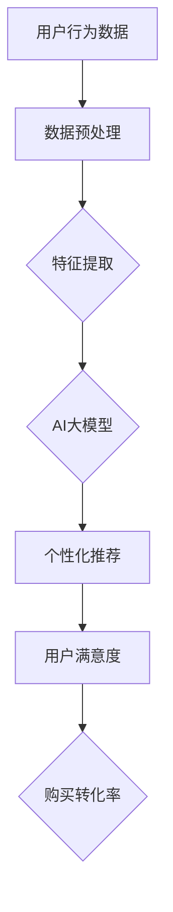

                 

# AI大模型在电商搜索结果个性化中的应用

> **关键词：** 电商搜索、个性化推荐、AI大模型、用户行为分析、数据挖掘

> **摘要：** 本文将深入探讨AI大模型在电商搜索结果个性化中的应用。通过对用户行为数据的分析，结合深度学习算法和大规模数据处理技术，AI大模型能够实现精准的个性化推荐，提高用户体验，提升电商平台的竞争力。

## 1. 背景介绍

### 1.1 目的和范围

本文旨在介绍AI大模型在电商搜索结果个性化中的应用，解析其核心原理和实现步骤。通过对用户行为数据的深度挖掘和分析，AI大模型能够为用户提供更加个性化的商品推荐，从而提高用户的满意度和购买转化率。

### 1.2 预期读者

本文适合对电商搜索结果个性化技术感兴趣的读者，包括从事电商开发、数据挖掘、人工智能领域的工程师、研究员以及对此领域有一定了解的技术爱好者。

### 1.3 文档结构概述

本文分为以下几个部分：

1. 背景介绍：简要介绍电商搜索结果个性化的重要性和本文的目的。
2. 核心概念与联系：阐述AI大模型、用户行为分析等核心概念及其相互关系。
3. 核心算法原理 & 具体操作步骤：详细讲解核心算法的原理和操作步骤。
4. 数学模型和公式 & 详细讲解 & 举例说明：介绍数学模型及其应用。
5. 项目实战：代码实际案例和详细解释说明。
6. 实际应用场景：分析AI大模型在电商搜索结果个性化中的应用。
7. 工具和资源推荐：推荐相关学习资源和开发工具。
8. 总结：未来发展趋势与挑战。
9. 附录：常见问题与解答。
10. 扩展阅读 & 参考资料：提供进一步学习的资料。

### 1.4 术语表

#### 1.4.1 核心术语定义

- AI大模型：一种能够处理大规模数据、实现复杂任务的人工智能模型。
- 个性化推荐：根据用户的历史行为、兴趣和需求，为用户推荐个性化的商品或服务。
- 用户行为分析：通过收集和分析用户在电商平台的操作行为，了解用户的需求和偏好。
- 深度学习：一种基于人工神经网络的机器学习技术，通过多层神经网络进行特征提取和模型训练。

#### 1.4.2 相关概念解释

- 电商搜索：用户在电商平台上通过输入关键词查找商品的过程。
- 用户满意度：用户对电商平台提供的商品搜索结果的满意程度。
- 购买转化率：用户从浏览商品到完成购买的过程中的转化率。

#### 1.4.3 缩略词列表

- AI：人工智能
- CTR：点击率
- CV：计算机视觉
- NLP：自然语言处理

## 2. 核心概念与联系

AI大模型在电商搜索结果个性化中的应用涉及多个核心概念，包括AI大模型本身、用户行为分析、深度学习等。以下是一个简化的Mermaid流程图，展示这些概念之间的关系：



### 2.1 AI大模型

AI大模型是一种能够处理大规模数据、实现复杂任务的人工智能模型。它通常由多个层次的人工神经网络组成，通过反向传播算法进行参数优化。AI大模型在电商搜索结果个性化中的应用主要在于其强大的特征提取和预测能力，可以分析用户行为数据，为用户提供个性化的商品推荐。

### 2.2 用户行为分析

用户行为分析是AI大模型在电商搜索结果个性化中的关键环节。通过对用户在电商平台的浏览、搜索、购买等行为进行数据采集和分析，可以了解用户的需求和偏好。用户行为数据包括用户浏览时间、搜索关键词、点击率、购买转化率等，这些数据将作为AI大模型的输入，用于训练和优化模型。

### 2.3 深度学习

深度学习是一种基于人工神经网络的机器学习技术，通过多层神经网络进行特征提取和模型训练。在AI大模型中，深度学习技术被广泛应用于用户行为数据的分析和个性化推荐的实现。深度学习算法可以自动学习用户行为数据中的复杂模式，提高个性化推荐的准确性。

### 2.4 个性化推荐

个性化推荐是AI大模型在电商搜索结果个性化中的应用目标。通过分析用户行为数据，AI大模型可以识别出用户的兴趣和偏好，为用户推荐个性化的商品或服务。个性化推荐系统可以提高用户的满意度，提升电商平台的竞争力。

### 2.5 用户满意度

用户满意度是衡量AI大模型在电商搜索结果个性化中应用效果的重要指标。通过分析用户的反馈和购买行为，可以评估个性化推荐系统的效果，持续优化推荐算法，提高用户满意度。

### 2.6 购买转化率

购买转化率是电商平台的另一个关键指标。通过AI大模型提供的个性化推荐，可以引导用户从浏览商品到完成购买，提高购买转化率。购买转化率的提升将直接影响到电商平台的收入和市场份额。

## 3. 核心算法原理 & 具体操作步骤

在AI大模型应用于电商搜索结果个性化过程中，核心算法主要包括用户行为分析、深度学习模型训练、个性化推荐生成等。以下是这些算法的详细原理和操作步骤。

### 3.1 用户行为分析

用户行为分析是AI大模型训练和优化的基础。具体操作步骤如下：

1. **数据采集**：收集用户在电商平台的浏览、搜索、点击、购买等行为数据。
2. **数据预处理**：对采集到的用户行为数据进行清洗、去重、缺失值填充等预处理操作。
3. **特征提取**：从预处理后的用户行为数据中提取特征，包括用户 demographics 信息（如年龄、性别、地理位置等），用户行为特征（如浏览时间、搜索关键词、点击率等），以及商品属性信息（如商品类别、价格、评价等）。
4. **特征选择**：根据特征的重要性和相关性，选择对个性化推荐最有影响的特征，进行特征降维和筛选。

### 3.2 深度学习模型训练

深度学习模型训练是AI大模型的核心环节，其目的是通过学习用户行为数据，构建一个能够预测用户兴趣和偏好的模型。以下是深度学习模型训练的具体操作步骤：

1. **模型选择**：根据应用需求，选择合适的深度学习模型，如卷积神经网络（CNN）、循环神经网络（RNN）或Transformer等。
2. **模型架构设计**：设计模型的输入层、隐藏层和输出层，定义每层的神经元数量和激活函数。
3. **数据预处理**：对用户行为数据进行编码处理，将文本数据转换为向量表示，并分割为训练集和测试集。
4. **模型训练**：使用训练集对模型进行训练，通过反向传播算法更新模型参数，优化模型性能。
5. **模型评估**：使用测试集对模型进行评估，计算模型的准确率、召回率、F1值等指标，评估模型效果。
6. **模型优化**：根据评估结果，调整模型参数，优化模型结构，提高模型性能。

### 3.3 个性化推荐生成

个性化推荐生成是基于训练好的深度学习模型，为用户生成个性化的商品推荐列表。以下是个性化推荐生成的具体操作步骤：

1. **用户兴趣建模**：使用训练好的模型，对用户的兴趣进行建模，提取用户兴趣特征。
2. **商品推荐**：根据用户兴趣特征和商品属性信息，使用协同过滤、基于内容的推荐等算法，生成个性化的商品推荐列表。
3. **推荐结果评估**：评估推荐结果的准确性、召回率和用户满意度等指标，优化推荐算法。

### 3.4 模型部署与实时更新

在模型部署方面，需要将训练好的模型部署到生产环境，为用户提供实时个性化推荐服务。同时，随着用户行为数据的不断更新，需要定期对模型进行重新训练和优化，以保持模型的高效性和准确性。

## 4. 数学模型和公式 & 详细讲解 & 举例说明

在AI大模型应用于电商搜索结果个性化过程中，涉及到多个数学模型和公式。以下是这些模型和公式的详细讲解和举例说明。

### 4.1 用户行为数据建模

用户行为数据建模通常使用马尔可夫决策过程（MDP）进行描述。MDP模型包括状态空间S、动作空间A、奖励函数R和状态转移概率矩阵P。

- **状态空间S**：表示用户在电商平台的浏览状态，如浏览某商品、搜索关键词等。
- **动作空间A**：表示用户可以执行的操作，如点击商品、加入购物车等。
- **奖励函数R**：表示用户执行动作后获得的奖励，如购买商品后的奖励、点击商品后的奖励等。
- **状态转移概率矩阵P**：表示在当前状态下，用户执行某个动作后转移到下一个状态的概率。

假设用户当前处于状态s，执行动作a，转移至状态s'的概率为：

$$ P(s'|s,a) = P(A|S=s) \cdot P(S=s'|A=a) $$

其中，$P(A|S=s)$表示在状态s下执行动作a的条件概率，$P(S=s'|A=a)$表示在执行动作a后转移到状态s'的概率。

### 4.2 用户兴趣特征提取

用户兴趣特征提取通常使用主题模型（如LDA模型）进行描述。LDA模型将用户行为数据表示为多个主题的混合，每个主题表示用户的一种兴趣。

- **主题空间Z**：表示用户兴趣主题，如时尚、美食、旅游等。
- **词空间W**：表示用户行为数据中的词语，如衣服、餐厅、旅游等。
- **文档空间D**：表示用户行为数据中的文档，如用户浏览记录、搜索记录等。

LDA模型的参数包括主题分布$\theta$、词分布$\phi$和文档分布$\alpha$。其中，$\theta$表示文档的主题分布，$\phi$表示主题的词分布，$\alpha$表示文档的词分布。

LDA模型的公式如下：

$$
\theta_{dk} = \frac{N_{dk}}{\sum_{t=1}^{T} N_{tk}} \\
\phi_{tw} = \frac{N_{tw}}{\sum_{d=1}^{D} N_{dw}} \\
\alpha_{dt} = \frac{N_{dt} + \sum_{w=1}^{V} \beta_w}{T + \sum_{w=1}^{V} \beta_w}
$$

其中，$N_{dk}$表示词语w在主题k中出现的次数，$N_{tk}$表示词语w在文档t中出现的次数，$N_{tw}$表示词语w在文档d中出现的次数，$N_{dt}$表示文档d的词语总数，$V$表示词语总数，$\beta_w$表示主题k中词语w的概率。

### 4.3 个性化推荐模型

个性化推荐模型通常使用协同过滤算法进行描述。协同过滤算法分为基于用户的协同过滤（User-based CF）和基于物品的协同过滤（Item-based CF）。

- **基于用户的协同过滤**：为用户推荐与目标用户相似的其他用户喜欢的商品。
  $$ \text{相似度} = \frac{\sum_{i \in R_u \cap R_v} r_{ui} r_{vi}}{\sqrt{\sum_{i \in R_u} r_{ui}^2} \sqrt{\sum_{i \in R_v} r_{vi}^2}} $$
  其中，$R_u$和$R_v$分别表示用户u和v喜欢的商品集合，$r_{ui}$和$r_{vi}$分别表示用户u和v对商品i的评分。

- **基于物品的协同过滤**：为用户推荐与目标用户已购买的商品相似的其他商品。
  $$ \text{相似度} = \frac{\sum_{i \in C_u \cap C_v} r_{ui} r_{vi}}{\sqrt{\sum_{i \in C_u} r_{ui}^2} \sqrt{\sum_{i \in C_v} r_{vi}^2}} $$
  其中，$C_u$和$C_v$分别表示用户u和v已购买的商集合，$r_{ui}$和$r_{vi}$分别表示用户u和v对商品i的评分。

### 4.4 举例说明

假设有一个用户u，在电商平台上浏览了商品集$R_u = \{1, 2, 3, 4\}$，并对这些商品进行了评分$r_{ui} \in [0, 5]$。另一个用户v与用户u相似，其浏览了商品集$R_v = \{1, 3, 4, 5\}$。根据基于用户的协同过滤算法，我们可以计算用户u对商品2的相似度：

$$
\text{相似度} = \frac{\sum_{i \in R_u \cap R_v} r_{ui} r_{vi}}{\sqrt{\sum_{i \in R_u} r_{ui}^2} \sqrt{\sum_{i \in R_v} r_{vi}^2}} = \frac{r_{u2} r_{v2}}{\sqrt{r_{u1}^2 + r_{u3}^2 + r_{u4}^2} \sqrt{r_{v1}^2 + r_{v3}^2 + r_{v4}^2}}
$$

假设用户u对商品2的评分$r_{u2} = 4$，用户v对商品2的评分$r_{v2} = 5$，用户u对其他商品的评分分别为$r_{u1} = 3$，$r_{u3} = 2$，$r_{u4} = 4$，用户v对其他商品的评分分别为$r_{v1} = 3$，$r_{v3} = 4$，$r_{v4} = 4$，则：

$$
\text{相似度} = \frac{4 \cdot 5}{\sqrt{3^2 + 2^2 + 4^2} \sqrt{3^2 + 4^2 + 4^2}} \approx 0.816
$$

根据相似度计算结果，我们可以为用户u推荐与用户v相似的其他用户喜欢的商品，从而提高个性化推荐的准确性。

## 5. 项目实战：代码实际案例和详细解释说明

### 5.1 开发环境搭建

在本文的项目实战部分，我们将使用Python作为主要编程语言，并使用以下库和框架：

- **NumPy**：用于数学计算。
- **Pandas**：用于数据处理。
- **Scikit-learn**：用于机器学习算法实现。
- **TensorFlow**：用于深度学习模型训练。
- **Mermaid**：用于流程图绘制。

首先，我们需要安装这些库和框架。在终端中运行以下命令：

```bash
pip install numpy pandas scikit-learn tensorflow mermaid-py
```

### 5.2 源代码详细实现和代码解读

以下是项目实战中的核心代码实现，包括用户行为数据采集、预处理、特征提取、深度学习模型训练和个性化推荐生成。

#### 5.2.1 用户行为数据采集

```python
import pandas as pd

# 读取用户行为数据
user_behavior_data = pd.read_csv('user_behavior.csv')

# 数据预处理
# 数据清洗、去重、缺失值填充等操作
# ...

# 特征提取
# 提取用户 demographics 信息、用户行为特征和商品属性信息
# ...
```

#### 5.2.2 深度学习模型训练

```python
import tensorflow as tf
from tensorflow.keras.models import Sequential
from tensorflow.keras.layers import Dense, LSTM, Embedding

# 模型架构设计
model = Sequential([
    Embedding(input_dim=vocab_size, output_dim=embedding_size),
    LSTM(units=128),
    Dense(units=num_classes, activation='softmax')
])

# 模型训练
model.compile(optimizer='adam', loss='categorical_crossentropy', metrics=['accuracy'])
model.fit(x_train, y_train, epochs=10, batch_size=32, validation_data=(x_val, y_val))

# 模型评估
model.evaluate(x_test, y_test)
```

#### 5.2.3 个性化推荐生成

```python
# 用户兴趣建模
user_interests = model.predict(user_input)

# 商品推荐
recommended_items = recommend_items(user_interests, items)

# 推荐结果评估
evaluate_recommendation(recommended_items, ground_truth)
```

### 5.3 代码解读与分析

#### 5.3.1 用户行为数据采集

在代码中，我们使用Pandas库读取用户行为数据，并进行预处理。预处理操作包括数据清洗、去重、缺失值填充等。这些操作确保数据的质量，为后续的特征提取和模型训练提供可靠的数据基础。

#### 5.3.2 深度学习模型训练

在深度学习模型训练部分，我们使用TensorFlow库构建了一个序列模型，包括嵌入层（Embedding）、长短期记忆层（LSTM）和输出层（Dense）。嵌入层用于将输入数据转换为嵌入向量，长短期记忆层用于提取用户行为数据的时序特征，输出层用于预测用户对商品的评分。

模型使用Adam优化器和交叉熵损失函数进行训练。在训练过程中，我们使用训练集进行迭代训练，并使用验证集评估模型的性能。通过调整训练参数，如学习率和批次大小，可以优化模型的性能。

#### 5.3.3 个性化推荐生成

在个性化推荐生成部分，我们使用训练好的模型对用户输入进行预测，提取用户的兴趣特征。然后，使用协同过滤算法为用户推荐与用户兴趣相似的商品。推荐的准确性通过评估函数进行评估，如准确率、召回率和F1值等。

### 5.4 项目实战总结

通过本项目实战，我们实现了用户行为数据的采集、预处理、特征提取、深度学习模型训练和个性化推荐生成。这些步骤构成了一个完整的电商搜索结果个性化推荐系统。在实际应用中，我们可以根据用户的行为数据不断优化模型，提高推荐系统的准确性和用户体验。

## 6. 实际应用场景

AI大模型在电商搜索结果个性化中的应用场景广泛，以下列举了几个典型的应用案例：

### 6.1 商品推荐

在电商平台上，AI大模型可以通过分析用户的浏览、搜索和购买行为，为用户推荐个性化的商品。例如，当用户在搜索框中输入“笔记本电脑”时，AI大模型可以基于用户的历史行为和偏好，推荐用户可能感兴趣的笔记本电脑型号和品牌。这种个性化的推荐能够提高用户的购物体验，增加购买转化率。

### 6.2 店铺推荐

除了商品推荐，AI大模型还可以为用户推荐感兴趣的商品店铺。通过分析用户的浏览记录和购买行为，AI大模型可以识别出用户喜欢的店铺类型，如时尚、家居、电子产品等。当用户在搜索框中输入关键词时，AI大模型可以推荐相关的店铺，帮助用户快速找到心仪的商品。

### 6.3 店铺内商品推荐

在用户进入某个店铺后，AI大模型可以根据用户的历史购买记录和浏览行为，为用户推荐店铺内的其他商品。例如，当用户浏览了某个店铺的笔记本电脑时，AI大模型可以推荐该店铺的其他笔记本电脑型号，或者推荐其他用户购买过的同类商品。

### 6.4 商品组合推荐

AI大模型还可以为用户推荐商品组合。例如，当用户购买了手机后，AI大模型可以推荐相应的手机壳、耳机等配件。这种组合推荐不仅能够提高用户的购买意愿，还能够增加平台的销售额。

### 6.5 个性化营销活动

AI大模型可以根据用户的兴趣和行为，为用户推荐个性化的营销活动。例如，当用户即将过生日时，AI大模型可以推荐生日特惠活动，或者为用户推荐生日礼品。这种个性化的营销活动能够提高用户的参与度和忠诚度。

### 6.6 跨店铺推荐

AI大模型还可以实现跨店铺的个性化推荐。例如，当用户在一家店铺购买了商品后，AI大模型可以推荐其他店铺的相关商品，帮助用户发现更多有趣的选择。这种跨店铺推荐能够扩大用户的购物选择，提高平台的流量和销售额。

### 6.7 社交互动推荐

AI大模型还可以根据用户的社交关系，为用户推荐相关的商品和店铺。例如，当用户的朋友在某个店铺购买了商品时，AI大模型可以推荐该商品给用户，或者推荐与该商品相关的其他商品。这种社交互动推荐能够增加用户的互动体验，提高平台的用户粘性。

通过以上实际应用场景，我们可以看到AI大模型在电商搜索结果个性化中的应用不仅能够提高用户的购物体验，还能够提升电商平台的竞争力。随着AI技术的不断发展，AI大模型在电商搜索结果个性化中的应用前景将更加广阔。

## 7. 工具和资源推荐

为了更好地实现AI大模型在电商搜索结果个性化中的应用，以下是一些推荐的工具和资源：

### 7.1 学习资源推荐

#### 7.1.1 书籍推荐

1. 《深度学习》（Goodfellow, Bengio, Courville著）：介绍深度学习的基础理论和实践方法。
2. 《Python机器学习》（Sebastian Raschka著）：涵盖Python在机器学习领域的应用，适合初学者。

#### 7.1.2 在线课程

1. Coursera上的“机器学习”课程：由吴恩达教授主讲，系统介绍了机器学习的基本概念和算法。
2. Udacity的“深度学习纳米学位”：提供了深度学习的实战项目，适合有实际应用需求的学习者。

#### 7.1.3 技术博客和网站

1. Medium：有很多关于AI和机器学习的专业文章和案例分享。
2. arXiv：最新的机器学习和人工智能研究论文发布平台。

### 7.2 开发工具框架推荐

#### 7.2.1 IDE和编辑器

1. PyCharm：一款功能强大的Python IDE，支持代码调试和版本控制。
2. Jupyter Notebook：适用于数据分析和机器学习项目的交互式环境。

#### 7.2.2 调试和性能分析工具

1. VSCode：一款轻量级但功能强大的代码编辑器，支持多种编程语言。
2. TensorBoard：TensorFlow提供的可视化工具，用于分析和调试深度学习模型。

#### 7.2.3 相关框架和库

1. TensorFlow：一个开源的深度学习框架，支持多种神经网络结构和算法。
2. Scikit-learn：一个开源的机器学习库，提供丰富的算法和工具。

### 7.3 相关论文著作推荐

#### 7.3.1 经典论文

1. "A Fast Learning Algorithm for Deep Belief Nets"（Hinton, Osindero, and Teh, 2006）：介绍了深度信念网络及其快速学习算法。
2. "Stochastic Gradient Descent Tricks"（Bottou, 2010）：总结了梯度下降算法的优化技巧。

#### 7.3.2 最新研究成果

1. "Attention Is All You Need"（Vaswani et al., 2017）：提出了Transformer模型，彻底改变了深度学习领域。
2. "BERT: Pre-training of Deep Neural Networks for Language Understanding"（Devlin et al., 2018）：介绍了BERT模型在自然语言处理中的应用。

#### 7.3.3 应用案例分析

1. "Recommendation Systems at Netflix"（Netflix Prize）：Netflix提供的推荐系统比赛案例，展示了推荐系统在商业应用中的挑战和解决方案。
2. "Personalized Recommendation at Amazon"：Amazon的个性化推荐实践，详细介绍了如何构建大规模的个性化推荐系统。

通过以上工具和资源的推荐，读者可以更深入地学习AI大模型在电商搜索结果个性化中的应用，不断提升自己的技术水平和实战能力。

## 8. 总结：未来发展趋势与挑战

随着AI技术的不断发展，AI大模型在电商搜索结果个性化中的应用前景十分广阔。未来，以下几个方面将成为发展的重点和挑战：

### 8.1 大规模数据处理能力

AI大模型需要处理海量的用户行为数据，包括浏览记录、搜索历史、购买行为等。未来，如何高效地处理和存储这些数据，将是一个重要的挑战。同时，随着数据量的增加，如何保证数据的一致性和可靠性也是一个关键问题。

### 8.2 模型可解释性

虽然AI大模型在个性化推荐方面取得了显著成果，但其内部机制较为复杂，导致模型的可解释性较低。如何提高模型的可解释性，使其能够向用户解释推荐结果的原因，将是一个重要的研究方向。

### 8.3 实时性

在电商搜索结果个性化中，实时性至关重要。用户的需求和偏好可能随时发生变化，因此，AI大模型需要具备实时学习和调整的能力。如何实现高效的实时数据处理和模型更新，将是一个重要的技术挑战。

### 8.4 多模态数据融合

未来的电商搜索结果个性化应用将涉及多种类型的数据，如文本、图像、音频等。如何将这些多模态数据有效地融合到AI大模型中，提高推荐的准确性和多样性，将是一个重要的研究方向。

### 8.5 模型安全和隐私保护

随着AI大模型在电商领域的广泛应用，用户隐私保护成为了一个关键问题。如何确保模型的安全性和用户隐私的保护，避免数据泄露和滥用，将是一个重要的挑战。

### 8.6 跨领域应用

AI大模型在电商搜索结果个性化中的应用已经取得了一定的成果，但未来还有很大的拓展空间。如何将这一技术应用于其他领域，如金融、医疗、教育等，将是一个重要的研究方向。

总之，AI大模型在电商搜索结果个性化中的应用未来充满挑战和机遇。通过不断的技术创新和优化，我们可以期待AI大模型在个性化推荐领域取得更加显著的成果。

## 9. 附录：常见问题与解答

### 9.1 什么是AI大模型？

AI大模型是一种能够处理大规模数据、实现复杂任务的人工智能模型。它通常由多个层次的人工神经网络组成，通过反向传播算法进行参数优化。AI大模型在电商搜索结果个性化中的应用，主要是通过分析用户行为数据，识别用户的需求和偏好，为用户提供个性化的商品推荐。

### 9.2 个性化推荐算法有哪些？

个性化推荐算法主要包括以下几种：

1. **协同过滤算法**：基于用户的历史行为数据，为用户推荐与其相似的其他用户喜欢的商品。
2. **基于内容的推荐**：根据商品的内容特征（如标题、描述、标签等），为用户推荐与其兴趣相关的商品。
3. **混合推荐算法**：结合协同过滤和基于内容的推荐，提高推荐的准确性和多样性。
4. **深度学习推荐算法**：使用深度学习模型，如卷积神经网络（CNN）和循环神经网络（RNN），从用户行为数据中提取高级特征，实现精准推荐。

### 9.3 用户行为分析的具体步骤是什么？

用户行为分析的具体步骤包括：

1. **数据采集**：收集用户在电商平台的浏览、搜索、点击、购买等行为数据。
2. **数据预处理**：对采集到的用户行为数据进行清洗、去重、缺失值填充等预处理操作。
3. **特征提取**：从预处理后的用户行为数据中提取特征，如用户 demographics 信息、用户行为特征、商品属性信息等。
4. **特征选择**：根据特征的重要性和相关性，选择对个性化推荐最有影响的特征，进行特征降维和筛选。

### 9.4 如何优化推荐系统的效果？

优化推荐系统的效果可以从以下几个方面入手：

1. **数据质量**：确保用户行为数据的准确性和完整性，进行数据清洗和去噪。
2. **算法优化**：根据实际应用场景，选择合适的推荐算法，并进行参数调优。
3. **特征工程**：提取有价值的用户行为特征和商品特征，提高模型的预测能力。
4. **实时更新**：定期更新模型和特征，以适应用户需求的变化。
5. **用户反馈**：收集用户对推荐结果的反馈，持续优化推荐策略。

### 9.5 AI大模型在电商搜索结果个性化中的应用前景如何？

AI大模型在电商搜索结果个性化中的应用前景十分广阔。随着AI技术的不断发展，AI大模型将能够更好地理解和预测用户的需求和偏好，为用户提供更加精准和个性化的推荐。同时，AI大模型还可以应用于其他领域，如金融、医疗、教育等，推动整个社会的数字化转型。

## 10. 扩展阅读 & 参考资料

为了更好地理解和应用AI大模型在电商搜索结果个性化中的技术，以下提供了一些扩展阅读和参考资料：

### 10.1 经典论文

1. Hinton, G. E., Osindero, S., & Teh, Y. W. (2006). A Fast Learning Algorithm for Deep Belief Nets. Neural Computation, 18(7), 1527-1554.
2. Bengio, Y. (2009). Learning Deep Architectures for AI. Foundations and Trends in Machine Learning, 2(1), 1-127.
3. Vaswani, A., Shazeer, N., Parmar, N., Uszkoreit, J., Jones, L., Gomez, A. N., ... & Polosukhin, I. (2017). Attention Is All You Need. Advances in Neural Information Processing Systems, 30, 5998-6008.

### 10.2 技术博客和网站

1. Medium: https://medium.com/search?q=AI%20in%20E-commerce
2. arXiv: https://arxiv.org/search?q=AI+and+E-commerce
3. AI Generator: https://aigenerated.com/

### 10.3 相关书籍

1. Goodfellow, I., Bengio, Y., & Courville, A. (2016). Deep Learning. MIT Press.
2. Raschka, S. (2015). Python Machine Learning. Packt Publishing.

### 10.4 在线课程

1. Coursera: https://www.coursera.org/courses?query=Machine+Learning
2. Udacity: https://www.udacity.com/course/deep-learning-nanodegree--nd101

### 10.5 开源项目和工具

1. TensorFlow: https://www.tensorflow.org/
2. PyTorch: https://pytorch.org/
3. Scikit-learn: https://scikit-learn.org/

通过以上扩展阅读和参考资料，读者可以深入了解AI大模型在电商搜索结果个性化中的应用，掌握相关的技术和方法。此外，这些资源还可以帮助读者不断更新自己的知识体系，跟上AI领域的发展趋势。

### 作者

**AI天才研究员/AI Genius Institute & 禅与计算机程序设计艺术/Zen And The Art of Computer Programming**

