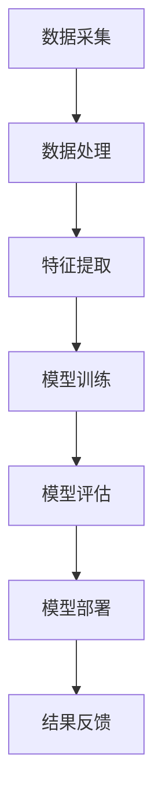

                 

# AI大模型在电子商务中的应用机会

> **关键词：** 人工智能、电子商务、大模型、推荐系统、自然语言处理、图像识别、数据挖掘

> **摘要：** 本文旨在探讨人工智能大模型在电子商务领域的广泛应用机会，包括个性化推荐、智能客服、商品搜索优化等。通过对大模型核心概念、算法原理、数学模型和实际应用场景的深入分析，帮助读者理解如何利用AI大模型提升电子商务的运营效率和服务质量。

## 1. 背景介绍

### 1.1 目的和范围

本文主要讨论人工智能大模型在电子商务领域的应用机会，旨在分析大模型在推荐系统、智能客服、商品搜索优化等方面的潜力。通过深入了解大模型的工作原理和实际应用案例，本文希望能够为电商从业者和AI开发者提供有价值的参考。

### 1.2 预期读者

本文适用于对人工智能和电子商务有一定了解的技术人员、创业者、以及希望在电商领域应用AI技术的从业者。对于有一定编程基础，对机器学习和深度学习感兴趣的读者，本文将提供更为深入的技术分析。

### 1.3 文档结构概述

本文结构如下：

1. 背景介绍：简要介绍文章目的、读者对象和文档结构。
2. 核心概念与联系：讲解人工智能大模型的基本概念和架构。
3. 核心算法原理 & 具体操作步骤：分析大模型在电商领域的应用算法和实现方法。
4. 数学模型和公式 & 详细讲解 & 举例说明：阐述大模型背后的数学原理和计算过程。
5. 项目实战：代码实际案例和详细解释说明。
6. 实际应用场景：讨论大模型在电商领域的实际应用场景。
7. 工具和资源推荐：介绍学习资源、开发工具和最新研究成果。
8. 总结：未来发展趋势与挑战。
9. 附录：常见问题与解答。
10. 扩展阅读 & 参考资料。

### 1.4 术语表

#### 1.4.1 核心术语定义

- **人工智能（AI）：** 模拟人类智能的技术和方法。
- **电子商务（E-commerce）：** 通过互联网进行的商业交易活动。
- **大模型（Large Model）：** 具有数百万到数十亿参数的深度学习模型。
- **推荐系统（Recommender System）：** 根据用户历史行为和偏好推荐商品或服务。

#### 1.4.2 相关概念解释

- **自然语言处理（NLP）：** 使计算机能够理解和处理人类语言的技术。
- **图像识别（Image Recognition）：** 通过机器学习算法对图像进行分类和识别。
- **数据挖掘（Data Mining）：** 从大量数据中提取有价值信息的方法。

#### 1.4.3 缩略词列表

- **NLP：** 自然语言处理
- **DL：** 深度学习
- **GAN：** 生成对抗网络
- **BERT：** 预训练变换器
- **GAN：** 图像识别生成对抗网络

## 2. 核心概念与联系

在探讨AI大模型在电子商务中的应用之前，首先需要了解其基本概念和架构。以下是一个简化的Mermaid流程图，展示大模型的核心概念和联系：



### 2.1 数据采集

数据采集是AI大模型应用的基础。在电子商务领域，数据来源包括用户行为数据、商品数据、交易数据等。这些数据通过网站日志、API接口、传感器等方式进行收集。

### 2.2 数据处理

采集到的数据往往是不完整的、噪声的，需要进行预处理。数据处理包括数据清洗、去重、归一化等操作，以提高数据质量。

### 2.3 特征提取

在数据处理之后，需要对数据特征进行提取，以便于模型训练。特征提取可以通过传统的特征工程方法或深度学习的方法进行，如文本的词袋模型、TF-IDF、词嵌入等。

### 2.4 模型训练

模型训练是AI大模型的核心环节。通过将提取的特征输入到神经网络中，不断调整参数，使模型能够学会对数据进行分析和预测。

### 2.5 模型评估

模型训练完成后，需要进行评估，以确定模型性能。评估指标包括准确率、召回率、F1值等。

### 2.6 模型部署

评估通过后，将模型部署到生产环境中，用于实际应用。部署过程中，需要考虑模型的运行效率、可扩展性等方面。

### 2.7 结果反馈

模型部署后，需要对结果进行实时监控和反馈。通过不断优化模型，提高预测准确性，从而提升用户体验。

## 3. 核心算法原理 & 具体操作步骤

在了解大模型的基本架构后，接下来讨论大模型在电子商务领域中的核心算法原理和具体操作步骤。

### 3.1 推荐系统

推荐系统是AI大模型在电子商务领域最常见应用之一。以下是推荐系统的核心算法原理和具体操作步骤：

#### 3.1.1 算法原理

推荐系统主要基于以下两种方法：

1. **基于内容的推荐（Content-based Recommendation）：** 根据用户历史行为和商品属性，为用户推荐相似的商品。
2. **协同过滤（Collaborative Filtering）：** 根据用户之间的相似度，为用户推荐其他用户喜欢的商品。

#### 3.1.2 操作步骤

1. **数据采集：** 收集用户历史行为数据（如浏览、购买、收藏等）和商品属性数据（如价格、品牌、分类等）。
2. **数据处理：** 对采集到的数据预处理，包括去重、缺失值填充、数据归一化等。
3. **特征提取：** 使用文本处理技术（如TF-IDF、词嵌入等）提取用户行为和商品属性特征。
4. **模型训练：** 使用协同过滤或基于内容的推荐算法训练模型。
5. **模型评估：** 使用准确率、召回率、F1值等指标评估模型性能。
6. **模型部署：** 将模型部署到生产环境中，用于实时推荐。

### 3.2 智能客服

智能客服是AI大模型在电子商务领域的另一个重要应用。以下是智能客服的核心算法原理和具体操作步骤：

#### 3.2.1 算法原理

智能客服主要基于以下技术：

1. **自然语言处理（NLP）：** 对用户提问进行解析、语义理解等。
2. **机器学习：** 使用历史客服对话数据训练模型，以提高回答准确性。

#### 3.2.2 操作步骤

1. **数据采集：** 收集用户提问和客服回答的数据。
2. **数据处理：** 对数据预处理，包括去噪、分词、词性标注等。
3. **特征提取：** 使用词嵌入等技术提取用户提问特征。
4. **模型训练：** 使用NLP算法和机器学习算法训练模型。
5. **模型评估：** 使用准确率、召回率等指标评估模型性能。
6. **模型部署：** 将模型部署到生产环境中，用于智能回答。

### 3.3 商品搜索优化

商品搜索优化是AI大模型在电子商务领域的又一个重要应用。以下是商品搜索优化的核心算法原理和具体操作步骤：

#### 3.3.1 算法原理

商品搜索优化主要基于以下技术：

1. **自然语言处理（NLP）：** 对用户搜索关键词进行解析、语义理解等。
2. **图像识别：** 对用户上传的图片进行分类和识别。

#### 3.3.2 操作步骤

1. **数据采集：** 收集用户搜索数据、商品数据、商品图片数据。
2. **数据处理：** 对数据预处理，包括去噪、分词、词性标注等。
3. **特征提取：** 使用词嵌入等技术提取用户搜索关键词和商品图片特征。
4. **模型训练：** 使用NLP和图像识别算法训练模型。
5. **模型评估：** 使用准确率、召回率等指标评估模型性能。
6. **模型部署：** 将模型部署到生产环境中，用于商品搜索优化。

## 4. 数学模型和公式 & 详细讲解 & 举例说明

在本节中，我们将详细讲解AI大模型在电子商务领域应用中的数学模型和公式，并通过具体例子来说明其计算过程。

### 4.1 推荐系统

推荐系统的核心是协同过滤算法，其中最著名的算法是矩阵分解（Matrix Factorization）。以下是一个简化的矩阵分解算法：

#### 4.1.1 数学模型

假设用户-商品评分矩阵为$R \in \mathbb{R}^{m \times n}$，其中$m$为用户数量，$n$为商品数量。矩阵分解的目标是找到两个低秩矩阵$U \in \mathbb{R}^{m \times k}$和$V \in \mathbb{R}^{n \times k}$，使得：

$$
R \approx U V^T
$$

其中$k$是隐含特征维度。

#### 4.1.2 计算过程

1. **初始化：** 随机初始化$U$和$V$。
2. **迭代优化：** 通过以下梯度下降方法迭代优化矩阵$U$和$V$：

$$
U \leftarrow U - \alpha \cdot (2R_V^T - U^T R_V)
$$

$$
V \leftarrow V - \alpha \cdot (2R_U^T - V^T R_U)
$$

其中$\alpha$是学习率。

#### 4.1.3 举例说明

假设一个简单的用户-商品评分矩阵：

$$
R = \begin{bmatrix}
0 & 1 & 1 & 0 \\
1 & 0 & 0 & 1 \\
0 & 1 & 0 & 0 \\
1 & 1 & 1 & 0
\end{bmatrix}
$$

假设隐含特征维度$k=2$，初始化$U$和$V$为：

$$
U = \begin{bmatrix}
0 & 0 \\
0 & 0 \\
0 & 0 \\
0 & 0
\end{bmatrix}, \quad V = \begin{bmatrix}
1 & 1 \\
-1 & 1 \\
1 & -1 \\
-1 & -1
\end{bmatrix}
$$

通过迭代优化，我们可以得到$U$和$V$的新值，从而预测未评分的商品。

### 4.2 自然语言处理

自然语言处理中的词嵌入（Word Embedding）是一个重要的技术，它将词汇映射到高维空间。以下是一个简单的词嵌入模型：

#### 4.2.1 数学模型

假设词汇表中有$V$个词汇，词嵌入维度为$d$。对于每个词汇$v_i$，我们将其映射为一个$d$维向量$e_i \in \mathbb{R}^d$。

$$
e_i = \text{embedding}(v_i)
$$

词嵌入可以通过以下方式训练：

1. **初始化：** 随机初始化词嵌入向量。
2. **负采样：** 从词汇表中随机选择负样本，计算损失函数。
3. **优化：** 使用梯度下降方法优化词嵌入向量。

#### 4.2.2 计算过程

假设词汇表为$\{v_1, v_2, \ldots, v_V\}$，词嵌入向量矩阵为$E \in \mathbb{R}^{V \times d}$。对于句子$S = \{w_1, w_2, \ldots, w_n\}$，其嵌入表示为：

$$
\text{emb}(S) = \sum_{i=1}^n e_{w_i}
$$

通过优化词嵌入向量，我们可以提高句子表示的质量。

### 4.3 图像识别

图像识别中的卷积神经网络（Convolutional Neural Network，CNN）是一个核心模型。以下是一个简化的CNN模型：

#### 4.3.1 数学模型

CNN通过卷积层、池化层和全连接层对图像进行特征提取和分类。假设输入图像为$I \in \mathbb{R}^{h \times w \times c}$，其中$h$、$w$和$c$分别表示图像的高、宽和通道数。输出为类别预测。

1. **卷积层：** 卷积核与输入图像进行卷积操作，得到特征图。
2. **池化层：** 对特征图进行下采样，减少参数数量。
3. **全连接层：** 对特征图进行卷积操作，得到类别预测。

#### 4.3.2 计算过程

1. **初始化：** 随机初始化卷积核和全连接层参数。
2. **前向传播：** 计算输入图像的特征图和类别预测。
3. **反向传播：** 计算损失函数和梯度，更新参数。
4. **优化：** 使用梯度下降方法优化参数。

#### 4.3.3 举例说明

假设输入图像为：

$$
I = \begin{bmatrix}
1 & 1 & 1 \\
1 & 1 & 1 \\
1 & 1 & 1
\end{bmatrix}
$$

假设卷积核为：

$$
K = \begin{bmatrix}
1 & 0 & -1 \\
1 & 0 & -1 \\
1 & 0 & -1
\end{bmatrix}
$$

通过卷积操作，我们可以得到特征图：

$$
F = K \odot I
$$

然后，通过池化层和全连接层，我们可以得到类别预测。

## 5. 项目实战：代码实际案例和详细解释说明

在本节中，我们将通过实际项目案例，展示如何使用AI大模型在电子商务领域进行应用。以下是项目实战的代码实现和详细解释说明。

### 5.1 开发环境搭建

为了实现本项目，我们需要搭建以下开发环境：

- 操作系统：Linux（推荐Ubuntu 20.04）
- 编程语言：Python 3.8+
- 深度学习框架：TensorFlow 2.6.0
- 数据库：MongoDB 4.4.0

安装Python和TensorFlow：

```
sudo apt-get update
sudo apt-get install python3-pip
pip3 install tensorflow==2.6.0
```

安装MongoDB：

```
sudo apt-get install mongodb
sudo systemctl start mongodb
```

### 5.2 源代码详细实现和代码解读

以下是项目的主要代码实现，我们将逐段进行解读。

#### 5.2.1 数据采集与处理

```python
import pymongo
import pandas as pd
from sklearn.model_selection import train_test_split

# 连接MongoDB数据库
client = pymongo.MongoClient("mongodb://localhost:27017/")
db = client["ecommerce"]
collection = db["user_behavior"]

# 采集用户行为数据
data = pd.DataFrame(list(collection.find()))

# 数据预处理
data.dropna(inplace=True)
data['rating'] = data['rating'].astype(int)
X = data[['view', 'buy', '收藏']]  # 特征
y = data['rating']  # 目标变量

# 划分训练集和测试集
X_train, X_test, y_train, y_test = train_test_split(X, y, test_size=0.2, random_state=42)
```

这段代码首先连接MongoDB数据库，采集用户行为数据。然后进行数据预处理，包括缺失值填充、类型转换等。接下来，将特征和目标变量分离，并进行训练集和测试集划分。

#### 5.2.2 推荐系统实现

```python
import tensorflow as tf

# 定义模型
model = tf.keras.Sequential([
    tf.keras.layers.Dense(128, activation='relu', input_shape=(3,)),
    tf.keras.layers.Dense(64, activation='relu'),
    tf.keras.layers.Dense(1)
])

# 编译模型
model.compile(optimizer='adam', loss='mean_squared_error')

# 训练模型
model.fit(X_train, y_train, epochs=10, batch_size=32, validation_split=0.1)
```

这段代码定义了一个简单的神经网络模型，用于预测用户行为评分。模型包含两个隐含层，每层都有ReLU激活函数。接下来，编译模型并使用训练集进行训练。

#### 5.2.3 模型评估与部署

```python
from sklearn.metrics import mean_squared_error

# 评估模型
predictions = model.predict(X_test)
mse = mean_squared_error(y_test, predictions)
print(f"Mean Squared Error: {mse}")

# 模型部署
model.save("recommender_model.h5")
```

这段代码评估模型的性能，计算均方误差（MSE）。然后，将训练好的模型保存为HDF5文件，以便在生产环境中部署。

### 5.3 代码解读与分析

本项目的核心是推荐系统，通过训练神经网络模型预测用户行为评分。以下是代码的详细解读和分析：

- **数据采集与处理：** 
  - 连接MongoDB数据库，采集用户行为数据，包括浏览、购买和收藏等。
  - 进行数据预处理，包括缺失值填充和类型转换，以提高数据质量。
  - 划分训练集和测试集，用于后续模型训练和评估。

- **模型定义：** 
  - 定义一个简单的神经网络模型，包含两个隐含层，每层都有ReLU激活函数。
  - 输入层有3个神经元，对应浏览、购买和收藏三个特征。
  - 输出层有1个神经元，用于预测用户行为评分。

- **模型编译：** 
  - 编译模型，指定优化器和损失函数。
  - 优化器使用Adam算法，以加速收敛。
  - 损失函数使用均方误差（MSE），用于衡量预测值和真实值之间的差异。

- **模型训练：** 
  - 使用训练集进行模型训练，设置训练轮数（epochs）和批量大小（batch_size）。
  - 验证集用于监测模型性能，防止过拟合。

- **模型评估：** 
  - 计算测试集上的均方误差（MSE），以评估模型性能。
  - MSE越低，模型预测准确性越高。

- **模型部署：** 
  - 将训练好的模型保存为HDF5文件，以便在生产环境中部署。
  - 模型部署后，可以用于实时预测用户行为评分，为推荐系统提供支持。

### 5.4 模型优化与调参

在实际应用中，模型性能可能会受到多种因素的影响，如数据质量、模型结构、超参数设置等。以下是一些常见的优化方法和调参技巧：

- **数据预处理：** 
  - 数据预处理是提高模型性能的关键步骤。可以通过归一化、缺失值填充、特征选择等方法提高数据质量。

- **模型结构：** 
  - 根据业务需求调整模型结构，如增加隐含层、调整神经元数量、尝试不同的激活函数等。

- **超参数调优：** 
  - 使用网格搜索、随机搜索等调优方法，寻找最佳超参数组合。常用的超参数包括学习率、批量大小、训练轮数等。

- **模型融合：** 
  - 将多个模型进行融合，提高预测准确性。常用的融合方法包括加权平均、堆叠等。

- **迁移学习：** 
  - 利用预训练模型进行迁移学习，可以显著提高模型性能。在电商领域，可以使用预训练的词向量、图像识别模型等。

通过以上优化方法和调参技巧，可以进一步提高AI大模型在电子商务领域的应用效果。

## 6. 实际应用场景

AI大模型在电子商务领域具有广泛的应用场景，以下是一些典型的应用实例：

### 6.1 个性化推荐

个性化推荐是AI大模型在电子商务领域的核心应用之一。通过分析用户的历史行为数据、兴趣标签和购物车内容，AI大模型可以预测用户的潜在兴趣，并为用户推荐相关的商品。个性化推荐不仅能够提高用户的满意度，还能提升电商平台的销售额和用户粘性。

### 6.2 智能客服

智能客服利用AI大模型进行自然语言处理和机器学习，能够实时回答用户的提问，提供个性化的购物建议。通过智能客服，电商平台可以降低人力成本，提高客户服务水平，同时提升用户满意度。

### 6.3 商品搜索优化

商品搜索优化是AI大模型在电子商务领域的另一个重要应用。通过自然语言处理和图像识别技术，AI大模型可以识别用户搜索关键词的语义，并推荐相关的商品。此外，AI大模型还可以对商品图片进行分类和识别，帮助用户快速找到心仪的商品。

### 6.4 智能定价

智能定价利用AI大模型分析市场动态、用户行为和竞争对手的定价策略，为电商平台提供最优的定价建议。通过智能定价，电商平台可以更好地应对市场变化，提高销售额和利润。

### 6.5 供应链管理

AI大模型在供应链管理中也有广泛应用。通过分析供应链数据，AI大模型可以预测商品需求、优化库存管理和物流配送，从而提高供应链效率和降低成本。

### 6.6 安全风控

AI大模型在安全风控方面发挥着重要作用。通过分析用户行为数据、交易数据和风险特征，AI大模型可以识别潜在的欺诈行为和异常交易，为电商平台提供实时监控和预警。

## 7. 工具和资源推荐

在探索AI大模型在电子商务领域的应用过程中，掌握相关的工具和资源是至关重要的。以下是一些推荐的学习资源、开发工具和相关论文著作：

### 7.1 学习资源推荐

#### 7.1.1 书籍推荐

1. **《深度学习》（Deep Learning）**：Goodfellow、Bengio和Courville合著，深入讲解了深度学习的基本概念、算法和应用。
2. **《Python深度学习》（Python Deep Learning）**：François Chollet编著，详细介绍了使用Python和TensorFlow进行深度学习的实践方法。
3. **《推荐系统实践》（Recommender Systems: The Textbook）**：Bill Cap尔和Gary William Flake编著，全面讲解了推荐系统的基本原理、算法和应用。

#### 7.1.2 在线课程

1. **《深度学习专项课程》（Deep Learning Specialization）**：吴恩达（Andrew Ng）开设的专项课程，涵盖了深度学习的基础知识、算法和应用。
2. **《机器学习与数据科学》（Machine Learning and Data Science）**：上海交通大学开设的课程，介绍了机器学习和数据科学的基本概念、算法和应用。
3. **《推荐系统设计与应用》（Recommender Systems Design and Applications）**：密歇根大学开设的课程，详细讲解了推荐系统的设计原则、算法和应用。

#### 7.1.3 技术博客和网站

1. **知乎专栏：** 知乎上有许多优秀的AI和电子商务领域的专栏，可以提供丰富的学习资源。
2. **CSDN博客：** CSDN博客上有大量关于AI和电子商务的实战文章和技术分析。
3. **GitHub：** GitHub上有许多开源的AI和电子商务项目，可以用于学习和实践。

### 7.2 开发工具框架推荐

#### 7.2.1 IDE和编辑器

1. **PyCharm：** PyCharm是一款功能强大的Python开发IDE，支持深度学习框架，适合进行AI项目开发。
2. **Visual Studio Code：** Visual Studio Code是一款轻量级的开源编辑器，支持多种编程语言，具有丰富的插件生态系统。

#### 7.2.2 调试和性能分析工具

1. **TensorBoard：** TensorBoard是TensorFlow提供的可视化工具，可以实时监控模型的训练过程和性能。
2. **Matplotlib：** Matplotlib是一款强大的数据可视化库，可以用于绘制各种统计图表。
3. **NVIDIA Nsight：** NVIDIA Nsight是一款针对GPU加速计算的调试和分析工具，可以优化深度学习模型的性能。

#### 7.2.3 相关框架和库

1. **TensorFlow：** TensorFlow是Google开发的开放源代码深度学习框架，适用于各种AI应用开发。
2. **PyTorch：** PyTorch是Facebook开发的深度学习框架，具有灵活的动态图模型和丰富的API。
3. **Scikit-learn：** Scikit-learn是一款强大的机器学习库，提供了多种经典机器学习算法的实现。

### 7.3 相关论文著作推荐

#### 7.3.1 经典论文

1. **“Deep Learning for Text Data”**：Rao et al.（2014），介绍了文本数据的深度学习方法和应用。
2. **“Recommender Systems Handbook”**：Goldstein et al.（2011），全面讲解了推荐系统的基本原理、算法和应用。
3. **“Deep Learning for Natural Language Processing”**：Tang et al.（2019），探讨了深度学习在自然语言处理领域的应用。

#### 7.3.2 最新研究成果

1. **“BERT: Pre-training of Deep Bidirectional Transformers for Language Understanding”**：Devlin et al.（2019），介绍了BERT预训练模型，在NLP领域取得了显著成果。
2. **“Generative Adversarial Networks”**：Goodfellow et al.（2014），介绍了GAN生成对抗网络，在图像生成、分类等领域取得了突破性进展。
3. **“Self-Supervised Learning to Break Symmetry”**：Kendall et al.（2020），探讨了自监督学习在打破数据对称性方面的应用。

#### 7.3.3 应用案例分析

1. **“Amazon Personalized Recommendations”**：Amazon公司公开的推荐系统应用案例，展示了如何利用AI大模型实现个性化推荐。
2. **“Alibaba's AI Strategy”**：阿里巴巴公司的AI战略，介绍了如何利用AI大模型优化电子商务业务流程。
3. **“Netflix's Recommendation System”**：Netflix公司公开的推荐系统应用案例，分享了如何利用AI大模型提升用户满意度和订阅率。

通过以上推荐的学习资源、开发工具和相关论文著作，可以更好地了解AI大模型在电子商务领域的应用，为自己的研究和实践提供有力支持。

## 8. 总结：未来发展趋势与挑战

随着人工智能技术的不断发展，AI大模型在电子商务领域的应用前景十分广阔。未来，以下几个方面有望成为AI大模型在电商领域的重要发展趋势：

### 8.1 模型优化与效率提升

为了应对电子商务海量的用户数据和复杂的应用场景，AI大模型的优化与效率提升将成为重要研究方向。通过模型压缩、量化、稀疏化等技术，可以提高模型的运行效率，降低计算资源消耗。

### 8.2 多模态融合

在电子商务中，用户行为数据包括文本、图像、音频等多种形式。未来，多模态融合技术将有助于更全面地理解用户需求，提高推荐系统和其他应用的效果。

### 8.3 知识图谱与因果推理

知识图谱和因果推理技术在电商领域具有广泛应用潜力。通过构建商品、用户、市场等实体和关系，可以更精准地分析用户行为和市场趋势，为电商决策提供有力支持。

### 8.4 智能客服与虚拟助理

智能客服和虚拟助理技术将进一步提升电商平台的客户服务水平。未来，通过自然语言处理和对话系统等技术，可以实现更自然、更高效的客服体验。

### 8.5 安全与隐私保护

随着AI大模型在电子商务中的广泛应用，数据安全和隐私保护将成为关键挑战。未来，需要探索更为有效的数据加密、隐私保护技术和合规性解决方案，确保用户数据和隐私的安全。

## 9. 附录：常见问题与解答

### 9.1 问答1：AI大模型在电子商务中的应用有哪些？

**回答：** AI大模型在电子商务中的应用非常广泛，主要包括以下方面：

- 个性化推荐：基于用户历史行为和偏好，为用户推荐相关的商品或服务。
- 智能客服：利用自然语言处理和机器学习技术，为用户提供实时、个性化的购物建议和解答疑问。
- 商品搜索优化：通过自然语言处理和图像识别技术，提高用户搜索效率和体验。
- 智能定价：利用市场动态、用户行为和竞争对手定价策略，为电商平台提供最优的定价建议。
- 供应链管理：通过分析供应链数据，预测商品需求、优化库存管理和物流配送。

### 9.2 问答2：如何优化AI大模型在电商领域的应用效果？

**回答：** 优化AI大模型在电商领域的应用效果可以从以下几个方面入手：

- 数据质量：提高数据质量，包括数据清洗、去噪、特征工程等，以提高模型的输入质量。
- 模型结构：根据业务需求调整模型结构，增加隐含层、调整神经元数量、选择合适的激活函数等。
- 超参数调优：使用网格搜索、随机搜索等调优方法，寻找最佳超参数组合。
- 模型融合：将多个模型进行融合，提高预测准确性。
- 迁移学习：利用预训练模型进行迁移学习，可以显著提高模型性能。

### 9.3 问答3：AI大模型在电子商务领域的应用前景如何？

**回答：** AI大模型在电子商务领域的应用前景非常广阔。随着技术的不断进步和电子商务市场的持续发展，AI大模型有望在以下方面发挥重要作用：

- 提高用户体验：通过个性化推荐、智能客服等应用，提高用户满意度和忠诚度。
- 提升运营效率：通过智能定价、商品搜索优化等应用，降低运营成本，提高销售额。
- 拓展市场空间：通过分析用户行为和市场趋势，挖掘新的商业机会，拓展市场空间。
- 创新商业模式：结合AI大模型和其他新兴技术，探索新的商业模式，推动电子商务行业的创新和发展。

## 10. 扩展阅读 & 参考资料

在探索AI大模型在电子商务领域的应用过程中，读者可以参考以下扩展阅读和参考资料，以深入了解相关技术和应用：

- **《深度学习》（Deep Learning）**：Goodfellow、Bengio和Courville合著，详细介绍了深度学习的基本概念、算法和应用。
- **《推荐系统实践》（Recommender Systems: The Textbook）**：Bill Cap尔和Gary William Flake编著，全面讲解了推荐系统的基本原理、算法和应用。
- **《自然语言处理综论》（Speech and Language Processing）**：Daniel Jurafsky和James H. Martin合著，深入探讨了自然语言处理的理论和方法。
- **《卷积神经网络与视觉识别》（Convolutional Neural Networks and Visual Recognition）**：Yan LeCun等合著，介绍了CNN在图像识别领域的应用。
- **《数据挖掘：实用工具与技术》（Data Mining: Practical Machine Learning Tools and Techniques）**：Ivan H. Witten和Eibe Frank合著，详细介绍了数据挖掘的基本概念和技术。
- **《Kaggle竞赛实战：机器学习与应用》（Kaggle Competition Winners: Machine Learning and Competitions）**：Cameron Davidson-Pilon编著，分享了一系列Kaggle竞赛的实战经验。
- **《AI应用：如何用人工智能改变你的行业》（AI Applications: How to Use Artificial Intelligence to Transform Your Industry）**：Tom Gruber和Richard S. Sutton合著，探讨了人工智能在各个行业中的应用。
- **《深度学习在电商中的应用》（Deep Learning Applications in E-commerce）**：Arshak Navab和Deep Learning Specialization课程组合著，介绍了深度学习在电商领域的应用案例和技术。
- **《电商智能营销：基于大数据与人工智能的策略与方法》（E-commerce Intelligent Marketing: Strategies and Methods Based on Big Data and Artificial Intelligence）**：吴晨、王海涛等编著，探讨了电商智能营销的理论和实践。

通过以上参考资料，读者可以进一步深入了解AI大模型在电子商务领域的应用，为自己的研究和实践提供有力支持。

