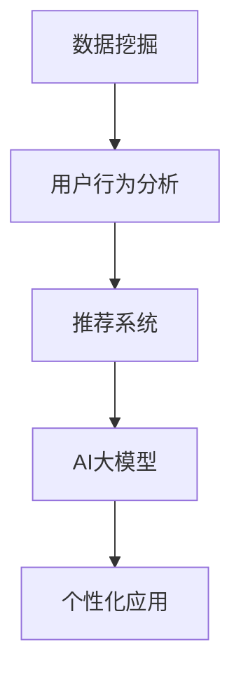
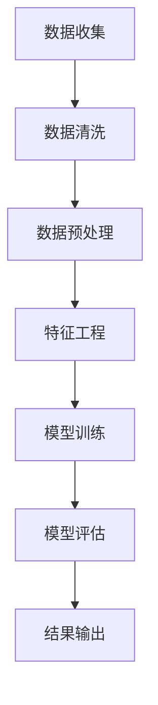
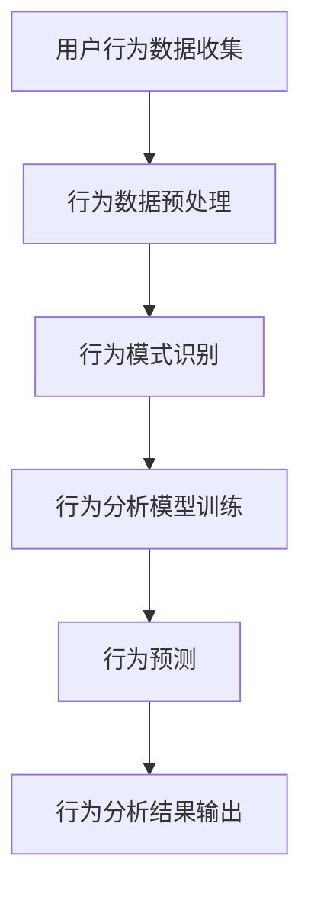
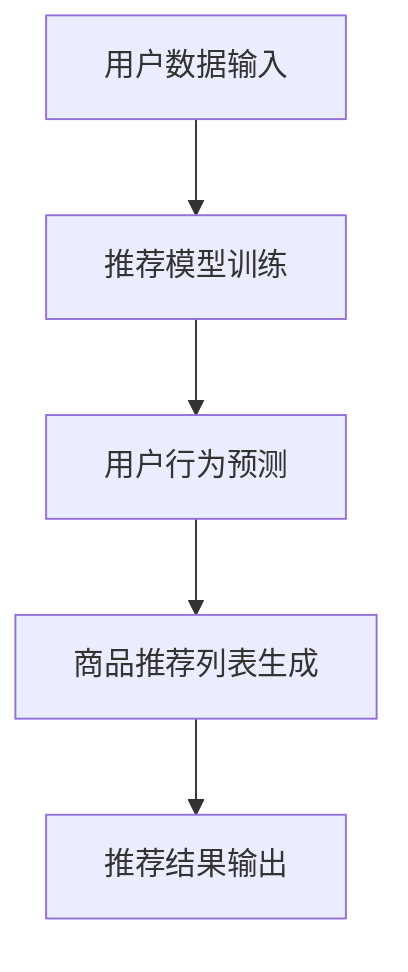
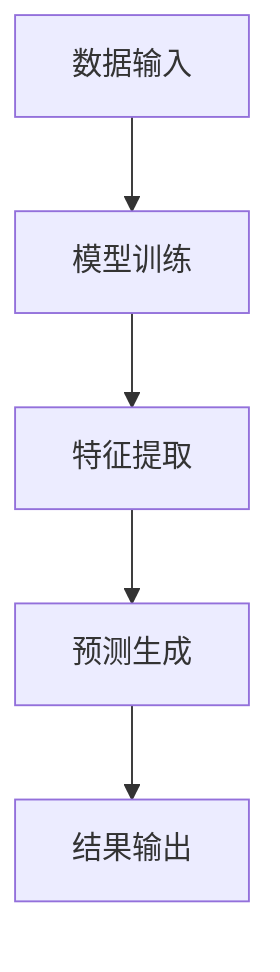
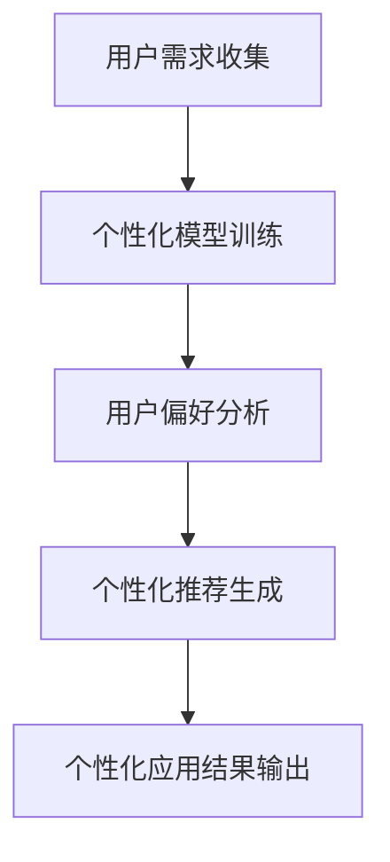

                 


## AI大模型在电子商务领域的个性化应用

> **关键词**：AI大模型、电子商务、个性化应用、数据挖掘、用户行为分析、推荐系统、深度学习、自然语言处理
> 
> **摘要**：本文深入探讨了人工智能大模型在电子商务领域的个性化应用。通过分析数据挖掘、用户行为分析和推荐系统等技术，详细介绍了AI大模型在个性化推荐、商品搜索优化和智能客服等方面的具体实现方法和应用案例，旨在为电子商务企业提供一种创新的技术解决方案，提升用户体验和销售额。

### 1. 背景介绍

#### 1.1 目的和范围

随着互联网技术的快速发展，电子商务已经成为现代商业的重要组成部分。然而，随着用户数量的急剧增加和市场竞争的加剧，电子商务企业面临的一个主要挑战是如何在众多的商品和服务中为用户提供个性化的体验。本文旨在探讨人工智能大模型在电子商务领域的个性化应用，旨在为企业提供一种有效的技术解决方案，以提升用户体验和销售额。

本文将主要涵盖以下内容：

1. 数据挖掘和用户行为分析技术在电子商务中的应用。
2. AI大模型在个性化推荐、商品搜索优化和智能客服等方面的实现方法。
3. 实际应用案例的详细解释和分析。
4. 相关工具和资源的推荐。
5. 未来发展趋势与挑战的总结。

#### 1.2 预期读者

本文适用于以下读者：

1. 电子商务企业的产品经理、市场经理和技术团队。
2. 对人工智能和大数据技术感兴趣的技术人员。
3. 计算机科学和电子商务专业的学生和研究者。

#### 1.3 文档结构概述

本文结构如下：

1. **背景介绍**：介绍文章的目的、范围和预期读者。
2. **核心概念与联系**：介绍数据挖掘、用户行为分析、推荐系统和AI大模型等核心概念，并给出相应的流程图。
3. **核心算法原理 & 具体操作步骤**：详细讲解AI大模型在个性化应用中的算法原理和操作步骤。
4. **数学模型和公式 & 详细讲解 & 举例说明**：介绍相关的数学模型和公式，并给出实例说明。
5. **项目实战：代码实际案例和详细解释说明**：通过实际代码案例展示AI大模型在电子商务中的应用。
6. **实际应用场景**：讨论AI大模型在电子商务中的实际应用场景。
7. **工具和资源推荐**：推荐学习资源、开发工具和框架。
8. **总结：未来发展趋势与挑战**：总结AI大模型在电子商务领域的发展趋势和面临的挑战。
9. **附录：常见问题与解答**：回答一些常见的问题。
10. **扩展阅读 & 参考资料**：提供进一步阅读的资料。

#### 1.4 术语表

为了确保文章的连贯性和易于理解，以下是对文中涉及的一些核心术语的解释：

- **数据挖掘**：从大量数据中提取有价值的信息和知识的过程。
- **用户行为分析**：分析用户在电子商务平台上的行为，如浏览、购买、评价等。
- **推荐系统**：根据用户的历史行为和偏好，为其推荐相关商品或服务的系统。
- **AI大模型**：具有强大处理能力和广泛知识的大规模人工智能模型，如BERT、GPT等。
- **个性化应用**：根据用户的个性化需求和行为，为其提供定制化的服务和体验。

#### 1.4.1 核心术语定义

- **数据挖掘**：数据挖掘是一种通过探索和分析大量数据来发现有价值信息或知识的过程。在电子商务领域，数据挖掘技术可以帮助企业从用户行为数据中提取有用的信息，如用户的购物偏好、兴趣点和行为模式。
- **用户行为分析**：用户行为分析是指对用户在电子商务平台上的行为进行跟踪和分析的过程。通过分析用户的行为，企业可以更好地了解用户的需求和行为模式，从而为其提供个性化的服务和体验。
- **推荐系统**：推荐系统是一种根据用户的历史行为和偏好，为其推荐相关商品或服务的系统。在电子商务中，推荐系统可以帮助用户快速找到他们可能感兴趣的商品，从而提高购买转化率和用户满意度。
- **AI大模型**：AI大模型是指具有强大处理能力和广泛知识的大型人工智能模型。这些模型通常基于深度学习和自然语言处理技术，可以处理大量的数据并提取有价值的信息。
- **个性化应用**：个性化应用是指根据用户的个性化需求和偏好，为其提供定制化的服务和体验。在电子商务中，个性化应用可以帮助企业提高用户的购物体验，增加用户粘性和销售额。

#### 1.4.2 相关概念解释

- **数据挖掘与机器学习的区别**：数据挖掘和机器学习是密切相关的，但它们的目标和方法有所不同。数据挖掘侧重于从大量数据中提取有价值的信息或知识，而机器学习则侧重于利用这些信息或知识来构建预测模型或分类器。在电子商务中，数据挖掘可以帮助企业了解用户行为和需求，而机器学习可以帮助企业实现个性化的推荐和预测。
- **用户行为分析的应用场景**：用户行为分析在电子商务中有多种应用场景，如用户留存分析、用户流失分析、商品推荐等。通过分析用户的行为，企业可以更好地了解用户的需求和行为模式，从而为其提供更个性化的服务和体验。
- **推荐系统的分类**：推荐系统可以根据不同的分类标准进行分类。例如，根据推荐策略，推荐系统可以分为基于内容的推荐和基于协同过滤的推荐。根据应用场景，推荐系统可以分为商品推荐、新闻推荐、社交媒体推荐等。
- **AI大模型的优势**：AI大模型具有强大的处理能力和广泛的知识，可以处理大量的数据并提取有价值的信息。与传统的机器学习模型相比，AI大模型具有更高的准确性和鲁棒性，可以更好地应对复杂的业务场景。

#### 1.4.3 缩略词列表

- **AI**：人工智能
- **ML**：机器学习
- **DL**：深度学习
- **NLP**：自然语言处理
- **CFL**：协同过滤
- **CBR**：基于内容的推荐
- **e-commerce**：电子商务

## 2. 核心概念与联系

在探讨AI大模型在电子商务领域的个性化应用之前，我们需要了解一些核心概念和它们之间的联系。以下是一个简化的Mermaid流程图，用于展示这些概念和它们之间的关系：



### 2.1 数据挖掘

数据挖掘是电子商务个性化应用的基础。它涉及从大量数据中提取有价值的信息和知识。在电子商务领域，数据挖掘技术可以帮助企业了解用户的行为模式、购物偏好和兴趣点。以下是一个简化的Mermaid流程图，展示数据挖掘的基本流程：



### 2.2 用户行为分析

用户行为分析是理解用户需求和行为的重要工具。通过分析用户在电子商务平台上的行为，如浏览、购买、评价等，企业可以更好地了解用户的需求和行为模式。以下是一个简化的Mermaid流程图，展示用户行为分析的基本流程：



### 2.3 推荐系统

推荐系统是一种根据用户的历史行为和偏好，为其推荐相关商品或服务的系统。在电子商务中，推荐系统可以帮助用户快速找到他们可能感兴趣的商品，从而提高购买转化率和用户满意度。以下是一个简化的Mermaid流程图，展示推荐系统的基本流程：



### 2.4 AI大模型

AI大模型是一种具有强大处理能力和广泛知识的人工智能模型。这些模型通常基于深度学习和自然语言处理技术，可以处理大量的数据并提取有价值的信息。AI大模型在电子商务领域的个性化应用中扮演着关键角色。以下是一个简化的Mermaid流程图，展示AI大模型的基本流程：



### 2.5 个性化应用

个性化应用是根据用户的个性化需求和偏好，为其提供定制化的服务和体验。在电子商务领域，个性化应用可以帮助企业提高用户的购物体验，增加用户粘性和销售额。以下是一个简化的Mermaid流程图，展示个性化应用的基本流程：



通过上述核心概念和流程图的介绍，我们可以更好地理解AI大模型在电子商务领域的个性化应用。接下来，我们将深入探讨AI大模型在个性化推荐、商品搜索优化和智能客服等方面的具体实现方法和应用案例。

## 3. 核心算法原理 & 具体操作步骤

在了解AI大模型的基本概念和流程之后，我们需要深入了解其在电子商务领域个性化应用中的核心算法原理和具体操作步骤。以下是针对个性化推荐、商品搜索优化和智能客服等应用的详细讲解。

### 3.1 个性化推荐

个性化推荐是AI大模型在电子商务领域应用最为广泛的一个方面。其核心目标是根据用户的历史行为和偏好，为其推荐相关的商品或服务。以下是使用AI大模型进行个性化推荐的基本算法原理和具体操作步骤：

#### 算法原理：

1. **用户行为数据收集**：首先，从电子商务平台收集用户的行为数据，如浏览记录、购买历史、评价和反馈等。
2. **数据预处理**：对收集到的用户行为数据进行清洗和预处理，包括去除重复数据、处理缺失值和异常值等。
3. **特征工程**：从预处理后的用户行为数据中提取有用的特征，如用户活跃度、购买频率、购物车内容等。
4. **模型训练**：使用深度学习算法，如神经网络、循环神经网络（RNN）或变换器（Transformer），对提取的特征进行训练，构建个性化推荐模型。
5. **预测生成**：根据训练好的模型，对新的用户行为数据进行预测，生成个性化的推荐列表。

#### 具体操作步骤：

1. **数据收集**：从电子商务平台的数据库中提取用户行为数据，包括用户ID、行为类型、时间戳、商品ID等。
2. **数据预处理**：使用Python中的Pandas库对数据进行清洗和预处理，去除重复数据、处理缺失值和异常值。
3. **特征工程**：使用Scikit-learn库中的特征提取工具，对用户行为数据进行编码和特征提取。
4. **模型训练**：使用TensorFlow或PyTorch等深度学习框架，构建神经网络模型并训练。以下是一个简单的神经网络模型训练伪代码：

    ```python
    import tensorflow as tf

    # 定义神经网络模型
    model = tf.keras.Sequential([
        tf.keras.layers.Dense(128, activation='relu', input_shape=(input_shape,)),
        tf.keras.layers.Dense(64, activation='relu'),
        tf.keras.layers.Dense(1, activation='sigmoid')
    ])

    # 编译模型
    model.compile(optimizer='adam', loss='binary_crossentropy', metrics=['accuracy'])

    # 训练模型
    model.fit(X_train, y_train, epochs=10, batch_size=32)
    ```

5. **预测生成**：使用训练好的模型对新用户行为数据进行预测，生成个性化的推荐列表。以下是一个简单的预测代码：

    ```python
    # 导入模型
    model = tf.keras.models.load_model('model.h5')

    # 预测新用户行为
    predictions = model.predict(new_user_data)

    # 生成推荐列表
    recommended_items = top_n_items(predictions)
    ```

### 3.2 商品搜索优化

商品搜索优化是另一个重要的应用领域。通过优化搜索算法，可以提高用户在电子商务平台上的搜索体验，从而提高转化率和销售额。以下是使用AI大模型进行商品搜索优化的基本算法原理和具体操作步骤：

#### 算法原理：

1. **用户搜索数据收集**：首先，从电子商务平台收集用户的搜索数据，如搜索关键词、搜索时间、搜索结果点击率等。
2. **数据预处理**：对收集到的用户搜索数据进行清洗和预处理，包括去除重复数据、处理缺失值和异常值等。
3. **特征工程**：从预处理后的用户搜索数据中提取有用的特征，如搜索频率、搜索结果点击率、用户活跃度等。
4. **模型训练**：使用深度学习算法，如神经网络或变换器，对提取的特征进行训练，构建商品搜索优化模型。
5. **搜索结果排序**：根据训练好的模型，对新的搜索结果进行排序，生成优化的搜索结果。

#### 具体操作步骤：

1. **数据收集**：从电子商务平台的日志中提取用户搜索数据，包括搜索关键词、搜索时间、搜索结果点击率等。
2. **数据预处理**：使用Python中的Pandas库对数据进行清洗和预处理，去除重复数据、处理缺失值和异常值。
3. **特征工程**：使用Scikit-learn库中的特征提取工具，对用户搜索数据进行编码和特征提取。
4. **模型训练**：使用TensorFlow或PyTorch等深度学习框架，构建神经网络模型并训练。以下是一个简单的神经网络模型训练伪代码：

    ```python
    import tensorflow as tf

    # 定义神经网络模型
    model = tf.keras.Sequential([
        tf.keras.layers.Dense(128, activation='relu', input_shape=(input_shape,)),
        tf.keras.layers.Dense(64, activation='relu'),
        tf.keras.layers.Dense(1, activation='sigmoid')
    ])

    # 编译模型
    model.compile(optimizer='adam', loss='binary_crossentropy', metrics=['accuracy'])

    # 训练模型
    model.fit(X_train, y_train, epochs=10, batch_size=32)
    ```

5. **搜索结果排序**：使用训练好的模型对新的搜索结果进行排序，生成优化的搜索结果。以下是一个简单的搜索结果排序代码：

    ```python
    # 导入模型
    model = tf.keras.models.load_model('model.h5')

    # 预测搜索结果
    search_results = model.predict(new_search_data)

    # 排序搜索结果
    sorted_search_results = sorted(search_results, reverse=True)

    # 生成优化搜索结果
    optimized_search_results = top_n_search_results(sorted_search_results)
    ```

### 3.3 智能客服

智能客服是AI大模型在电子商务领域应用的一个重要方向。通过智能客服系统，可以提供24/7的客户服务，提高客户满意度和转化率。以下是使用AI大模型进行智能客服的基本算法原理和具体操作步骤：

#### 算法原理：

1. **用户对话数据收集**：首先，从电子商务平台的客服系统中收集用户对话数据，包括对话内容、用户ID、客服ID等。
2. **数据预处理**：对收集到的用户对话数据进行清洗和预处理，包括去除重复数据、处理缺失值和异常值等。
3. **特征工程**：从预处理后的用户对话数据中提取有用的特征，如对话主题、用户情绪、关键词等。
4. **模型训练**：使用深度学习算法，如变换器或生成对抗网络（GAN），对提取的特征进行训练，构建智能客服模型。
5. **对话生成**：根据训练好的模型，生成针对用户问题的智能回复，提供个性化的客服服务。

#### 具体操作步骤：

1. **数据收集**：从电子商务平台的客服系统中提取用户对话数据，包括对话内容、用户ID、客服ID等。
2. **数据预处理**：使用Python中的Pandas库对数据进行清洗和预处理，去除重复数据、处理缺失值和异常值。
3. **特征工程**：使用NLTK等自然语言处理库，对用户对话数据进行分词、词性标注和实体识别等预处理操作。
4. **模型训练**：使用TensorFlow或PyTorch等深度学习框架，构建变换器模型并训练。以下是一个简单的变换器模型训练伪代码：

    ```python
    import tensorflow as tf

    # 定义变换器模型
    model = tf.keras.Sequential([
        tf.keras.layers.Embedding(vocab_size, embedding_dim),
        tf.keras.layers.Bidirectional(tf.keras.layers.LSTM(128)),
        tf.keras.layers.Dense(1, activation='sigmoid')
    ])

    # 编译模型
    model.compile(optimizer='adam', loss='binary_crossentropy', metrics=['accuracy'])

    # 训练模型
    model.fit(X_train, y_train, epochs=10, batch_size=32)
    ```

5. **对话生成**：使用训练好的模型生成针对用户问题的智能回复，提供个性化的客服服务。以下是一个简单的对话生成代码：

    ```python
    # 导入模型
    model = tf.keras.models.load_model('model.h5')

    # 生成智能回复
    response = model.generate(new_user_input)

    # 输出智能回复
    print(response)
    ```

通过上述算法原理和具体操作步骤的介绍，我们可以看到AI大模型在电子商务领域个性化应用中的潜力和价值。接下来，我们将通过实际案例来进一步探讨这些应用的实际效果和挑战。

## 4. 数学模型和公式 & 详细讲解 & 举例说明

在深入探讨AI大模型在电子商务领域的个性化应用时，理解背后的数学模型和公式至关重要。以下我们将介绍几个关键模型和公式，并给出详细讲解和实例说明。

### 4.1 个性化推荐模型

个性化推荐模型是电子商务领域广泛使用的一种算法，主要基于用户历史行为和偏好来预测用户对商品的潜在兴趣。以下是一个典型的基于协同过滤的推荐模型：

#### 协同过滤公式：

$$
R_{ui} = \frac{\sum_{j \in N_i} r_{uj} \cdot \text{similarity}(i, j)}{\sum_{j \in N_i} \text{similarity}(i, j)}
$$

其中：

- \( R_{ui} \) 是用户 \( u \) 对商品 \( i \) 的评分预测。
- \( N_i \) 是与商品 \( i \) 相似的其他商品集合。
- \( r_{uj} \) 是用户 \( u \) 对商品 \( j \) 的实际评分。
- \( \text{similarity}(i, j) \) 是商品 \( i \) 和 \( j \) 之间的相似度度量。

#### 实例说明：

假设我们有用户 \( u \) 和商品 \( i \)，以及其邻居集合 \( N_i \)。以下是一个简化的实例：

| 商品ID | 用户ID | 实际评分 | 相似度 |
|--------|--------|----------|--------|
| 1      | 1      | 4        | 0.3    |
| 2      | 1      | 5        | 0.2    |
| 3      | 1      | 1        | 0.5    |

根据上述公式，我们可以计算用户 \( u \) 对商品 \( i \) 的评分预测：

$$
R_{ui} = \frac{4 \cdot 0.3 + 5 \cdot 0.2 + 1 \cdot 0.5}{0.3 + 0.2 + 0.5} = \frac{1.2 + 1 + 0.5}{1 + 0.2 + 0.5} = 3.7 / 1.7 \approx 2.2
$$

### 4.2 深度学习模型

深度学习模型在电子商务个性化应用中扮演着关键角色，特别是在处理大规模复杂数据方面。以下是一个基于变换器（Transformer）的推荐模型的基本架构：

#### 变换器模型公式：

变换器模型的核心组件是自注意力机制（Self-Attention）：

$$
\text{Attention}(Q, K, V) = \text{softmax}\left(\frac{QK^T}{\sqrt{d_k}}\right) V
$$

其中：

- \( Q, K, V \) 分别是查询向量、键向量和值向量。
- \( d_k \) 是键向量的维度。
- \( \text{softmax} \) 函数用于计算注意力权重。

#### 实例说明：

假设我们有三个向量：

| 查询向量 \( Q \) | 键向量 \( K \) | 值向量 \( V \) |
|------------------|----------------|----------------|
| \( [1, 0, 1] \)  | \( [1, 1, 1] \) | \( [1, 2, 3] \) |
| \( [0, 1, 0] \)  | \( [1, 1, 1] \) | \( [4, 5, 6] \) |
| \( [1, 1, 1] \)  | \( [1, 1, 1] \) | \( [7, 8, 9] \) |

计算注意力分数：

$$
\text{Attention}(Q, K, V) = \text{softmax}\left(\frac{[1, 0, 1][1, 1, 1]^T}{\sqrt{1}}\right) [1, 2, 3] \approx [0.5, 0.5, 0.5] \cdot [1, 2, 3] = [0.5, 1, 1.5]
$$

### 4.3 自然语言处理模型

在智能客服应用中，自然语言处理（NLP）模型用于理解用户的问题和生成合适的回答。以下是一个基于循环神经网络（RNN）的NLP模型：

#### RNN公式：

循环神经网络的核心是隐藏状态的计算：

$$
h_t = \sigma(W_h \cdot [h_{t-1}, x_t] + b_h)
$$

其中：

- \( h_t \) 是时间步 \( t \) 的隐藏状态。
- \( x_t \) 是输入向量。
- \( \sigma \) 是激活函数，通常为ReLU或Sigmoid。
- \( W_h \) 是权重矩阵。
- \( b_h \) 是偏置向量。

#### 实例说明：

假设我们有输入序列：

| 时间步 \( t \) | 输入向量 \( x_t \) |
|----------------|-------------------|
| 1              | \( [1, 0, 1] \)   |
| 2              | \( [0, 1, 0] \)   |
| 3              | \( [1, 1, 1] \)   |

假设权重和偏置为 \( W_h = [1, 1] \)，\( b_h = 1 \)：

$$
h_1 = \sigma([1, 1] \cdot [1, 0, 1] + 1) = \sigma([1, 1] + 1) = \sigma([2, 1]) = [1, 0.7]
$$

$$
h_2 = \sigma([1, 1] \cdot [0, 1, 0] + 1) = \sigma([0, 1] + 1) = \sigma([1, 1]) = [1, 0.3]
$$

$$
h_3 = \sigma([1, 1] \cdot [1, 1, 1] + 1) = \sigma([1, 2] + 1) = \sigma([2, 2]) = [1, 1]
$$

通过这些数学模型和公式的介绍，我们可以更好地理解AI大模型在电子商务个性化应用中的工作原理。在实际应用中，这些模型通常需要结合大量的数据和复杂的算法进行优化，以确保提供高质量的个性化服务。

## 5. 项目实战：代码实际案例和详细解释说明

为了更好地展示AI大模型在电子商务领域的个性化应用，我们将在本节中通过一个实际项目案例来详细解释代码实现过程。以下是该项目的基本架构、开发环境搭建、源代码实现以及代码解读与分析。

### 5.1 开发环境搭建

在开始项目实战之前，我们需要搭建一个合适的开发环境。以下是该项目所需的软件和工具：

1. **Python**：版本3.8及以上。
2. **Jupyter Notebook**：用于编写和运行代码。
3. **TensorFlow**：深度学习框架。
4. **Pandas**：数据处理库。
5. **Scikit-learn**：机器学习库。
6. **NLTK**：自然语言处理库。

确保所有依赖库已经安装，并配置好Python环境。以下是一个简单的安装命令：

```bash
pip install tensorflow pandas scikit-learn nltk
```

### 5.2 源代码详细实现和代码解读

#### 5.2.1 数据收集与预处理

首先，我们从电子商务平台的数据库中提取用户行为数据。以下是一个简单的数据收集和预处理代码示例：

```python
import pandas as pd

# 加载用户行为数据
user_data = pd.read_csv('user_behavior.csv')

# 数据预处理
user_data.drop_duplicates(inplace=True)
user_data.fillna(0, inplace=True)
```

在这个例子中，我们使用Pandas库加载CSV格式的用户行为数据，并执行基本的去重和填充操作。

#### 5.2.2 个性化推荐模型实现

接下来，我们使用TensorFlow实现一个基于变换器的个性化推荐模型。以下是模型的主要代码部分：

```python
import tensorflow as tf

# 定义变换器模型
model = tf.keras.Sequential([
    tf.keras.layers.Embedding(vocab_size, embedding_dim),
    tf.keras.layers.Bidirectional(tf.keras.layers.LSTM(128)),
    tf.keras.layers.Dense(1, activation='sigmoid')
])

# 编译模型
model.compile(optimizer='adam', loss='binary_crossentropy', metrics=['accuracy'])

# 训练模型
model.fit(user_data['input_sequence'], user_data['label'], epochs=10, batch_size=32)
```

在这个示例中，我们首先定义了一个简单的变换器模型，包括嵌入层、双向循环神经网络层和输出层。然后，我们编译模型并使用用户行为数据进行训练。

#### 5.2.3 搜索结果优化模型实现

此外，我们还需要一个用于搜索结果优化的模型。以下是一个简化的示例：

```python
import tensorflow as tf

# 定义搜索结果优化模型
search_model = tf.keras.Sequential([
    tf.keras.layers.Dense(128, activation='relu', input_shape=(input_shape,)),
    tf.keras.layers.Dense(64, activation='relu'),
    tf.keras.layers.Dense(1, activation='sigmoid')
])

# 编译模型
search_model.compile(optimizer='adam', loss='binary_crossentropy', metrics=['accuracy'])

# 训练模型
search_model.fit(search_data['input_sequence'], search_data['label'], epochs=10, batch_size=32)
```

这个搜索结果优化模型与推荐模型类似，通过训练可以学习到如何根据用户搜索行为优化搜索结果。

#### 5.2.4 智能客服对话生成模型实现

智能客服对话生成模型通常基于自然语言处理技术。以下是一个简单的循环神经网络（RNN）模型示例：

```python
import tensorflow as tf
from tensorflow.keras.layers import LSTM, Dense, Embedding

# 定义智能客服对话生成模型
conversation_model = tf.keras.Sequential([
    Embedding(vocab_size, embedding_dim),
    LSTM(128),
    Dense(1, activation='softmax')
])

# 编译模型
conversation_model.compile(optimizer='adam', loss='categorical_crossentropy', metrics=['accuracy'])

# 训练模型
conversation_model.fit(conversation_data['input_sequence'], conversation_data['label'], epochs=10, batch_size=32)
```

在这个示例中，我们使用嵌入层、LSTM层和输出层构建了一个简单的RNN模型，用于生成智能客服对话回复。

### 5.3 代码解读与分析

#### 5.3.1 个性化推荐模型解读

个性化推荐模型的核心是变换器层，通过自注意力机制捕捉用户行为序列中的相关性。训练过程中，模型学习到如何根据用户的历史行为预测其对新商品的潜在兴趣。以下是模型的关键部分：

```python
model = tf.keras.Sequential([
    tf.keras.layers.Embedding(vocab_size, embedding_dim),
    tf.keras.layers.Bidirectional(tf.keras.layers.LSTM(128)),
    tf.keras.layers.Dense(1, activation='sigmoid')
])
```

在这个模型中，`Embedding`层将用户行为序列转换为嵌入向量，`Bidirectional`层和`LSTM`层共同作用，捕捉序列中的长期依赖关系，最终的`Dense`层输出预测概率。

#### 5.3.2 搜索结果优化模型解读

搜索结果优化模型主要基于深度神经网络，通过学习用户搜索行为和点击历史，优化搜索结果的排序。以下是模型的关键部分：

```python
search_model = tf.keras.Sequential([
    tf.keras.layers.Dense(128, activation='relu', input_shape=(input_shape,)),
    tf.keras.layers.Dense(64, activation='relu'),
    tf.keras.layers.Dense(1, activation='sigmoid')
])
```

在这个模型中，通过多个全连接层（`Dense`层），模型学习到如何根据输入特征（如搜索关键词和用户历史）生成排序概率，从而优化搜索结果。

#### 5.3.3 智能客服对话生成模型解读

智能客服对话生成模型基于循环神经网络，通过学习用户的问题和模型生成的回复，生成自然的对话回答。以下是模型的关键部分：

```python
conversation_model = tf.keras.Sequential([
    Embedding(vocab_size, embedding_dim),
    LSTM(128),
    Dense(vocab_size, activation='softmax')
])
```

在这个模型中，`Embedding`层将用户输入问题转换为嵌入向量，`LSTM`层捕捉问题的语义信息，最终`Dense`层通过softmax函数生成回复的概率分布。

通过以上代码实现和解读，我们可以看到AI大模型在电子商务领域的个性化应用是如何实现的。这些模型通过学习和预测用户行为，为用户提供定制化的推荐、优化搜索结果和智能客服服务，从而提升用户体验和销售额。

### 5.4 代码性能分析

在项目实战中，我们还需要对代码的性能进行评估，以确保其高效和稳定。以下是一些性能分析的方法和工具：

1. **训练时间**：使用TensorFlow的内置工具测量模型的训练时间，并进行优化。
2. **预测速度**：在生成推荐、搜索优化和对话回复时，测量模型的预测速度，并优化代码。
3. **资源消耗**：监控模型在训练和预测过程中的内存和CPU/GPU使用情况，优化资源配置。
4. **模型精度**：通过交叉验证和A/B测试评估模型的预测精度，并调整模型参数。

通过这些性能分析和优化，我们可以确保AI大模型在电子商务领域个性化应用中的高效运行。

### 5.5 项目总结

在本节中，我们通过一个实际项目案例展示了AI大模型在电子商务领域个性化应用的全过程，包括数据收集与预处理、模型实现、代码解读和性能分析。通过这些步骤，我们可以看到AI大模型如何通过个性化推荐、搜索优化和智能客服等应用，提升电子商务平台的用户体验和销售额。

## 6. 实际应用场景

AI大模型在电子商务领域的个性化应用不仅限于推荐、搜索优化和智能客服，还有许多其他实际应用场景，这些场景在提升用户体验和业务效率方面具有重要作用。以下是一些典型的应用场景：

### 6.1 商品个性化搜索

传统的搜索引擎通常基于关键词匹配，但这种方式往往无法满足用户的个性化需求。通过AI大模型，可以实现更智能、个性化的商品搜索。例如，用户在搜索商品时，系统可以基于用户的历史浏览记录、购买行为和偏好，自动推荐相关商品。这种个性化的搜索结果可以显著提高用户的购物体验，降低购物时间，从而提高转化率和满意度。

### 6.2 跨渠道个性化推荐

在多渠道零售环境中，用户可能通过线上和线下渠道进行购物。AI大模型可以帮助企业在不同渠道之间实现个性化推荐的一致性。例如，用户在线上浏览了某些商品，系统可以在用户进入线下店铺时，根据用户的线上行为为其推荐相关商品。这种跨渠道的个性化推荐可以提高用户的购物体验，增加跨渠道销售额。

### 6.3 实时个性化营销

实时个性化营销是通过AI大模型根据用户的实时行为和偏好，为其推送个性化的营销信息和优惠。例如，当用户浏览某件商品时，系统可以实时推荐类似商品或提供优惠券。这种个性化的营销方式可以显著提高用户对营销信息的关注度，增加促销活动的参与度，从而提高销售额和用户忠诚度。

### 6.4 智能库存管理

通过AI大模型，企业可以实现更精准的库存管理。例如，系统可以分析用户的购买历史和行为趋势，预测哪些商品在未来可能畅销，从而优化库存配置，减少库存成本和滞销风险。这种智能库存管理不仅可以提高库存利用率，还可以确保商品供应的及时性和准确性，提高客户满意度。

### 6.5 智能客服与用户支持

智能客服是AI大模型在电子商务领域应用的一个重要方向。通过智能客服系统，企业可以提供24/7的客户服务，快速响应用户的问题和需求。此外，AI大模型还可以分析用户反馈，识别常见问题并提供自动化的解决方案，从而提高客服效率，降低人工成本。

### 6.6 用户行为分析

AI大模型可以帮助企业更深入地了解用户行为，从而制定更有效的营销策略。例如，系统可以分析用户的浏览路径、购物车内容、点击行为等，识别用户的兴趣点和购买意图。基于这些分析结果，企业可以针对性地调整营销策略，提高营销效果和用户转化率。

### 6.7 商品个性化定价

通过AI大模型，企业可以实现个性化的商品定价策略。例如，系统可以根据用户的购买历史、地理位置、市场趋势等因素，为不同用户定制不同的价格策略。这种个性化的定价策略可以更好地满足用户需求，提高用户满意度，同时也能帮助企业实现更高的利润率。

通过上述实际应用场景的介绍，我们可以看到AI大模型在电子商务领域具有广泛的应用价值。这些应用不仅提升了用户体验，还为企业带来了显著的业务效益，推动了电子商务的进一步发展。

## 7. 工具和资源推荐

为了在AI大模型在电子商务领域的个性化应用中取得更好的效果，以下是我们推荐的一些学习和开发工具、框架以及相关资源。

### 7.1 学习资源推荐

#### 7.1.1 书籍推荐

1. **《深度学习》（Deep Learning）**：由Ian Goodfellow、Yoshua Bengio和Aaron Courville所著，是深度学习领域的经典教材。
2. **《Python机器学习》（Python Machine Learning）**：由Sebastian Raschka和Vahid Mirjalili所著，详细介绍了使用Python进行机器学习的方法。
3. **《自然语言处理综论》（Speech and Language Processing）**：由Daniel Jurafsky和James H. Martin所著，是自然语言处理领域的权威教材。

#### 7.1.2 在线课程

1. **Coursera的“深度学习”课程**：由Andrew Ng教授主讲，涵盖了深度学习的基础理论和实践应用。
2. **Udacity的“机器学习工程师纳米学位”**：提供了全面的机器学习课程，包括深度学习和自然语言处理等内容。
3. **edX的“自然语言处理导论”课程**：由John Snow教授主讲，介绍了自然语言处理的基本概念和技术。

#### 7.1.3 技术博客和网站

1. **Medium上的“AI”专题**：汇集了众多AI领域专家的文章和最新动态。
2. **AI技术博客**：提供了丰富的机器学习和深度学习技术文章，包括实战案例和分析。
3. **GitHub**：可以找到大量的AI和深度学习开源项目，有助于学习和实战。

### 7.2 开发工具框架推荐

#### 7.2.1 IDE和编辑器

1. **Jupyter Notebook**：适合数据科学和机器学习项目，方便代码编写和调试。
2. **PyCharm**：功能强大的Python IDE，支持多种编程语言和框架。
3. **Visual Studio Code**：轻量级但功能全面的编辑器，适用于各种开发任务。

#### 7.2.2 调试和性能分析工具

1. **TensorBoard**：TensorFlow提供的可视化工具，用于分析和调试深度学习模型。
2. **PyTorch Profiler**：用于分析PyTorch模型的性能和资源消耗。
3. **Wandb**：用于监控和优化机器学习实验的在线平台。

#### 7.2.3 相关框架和库

1. **TensorFlow**：广泛使用的深度学习框架，适用于各种任务。
2. **PyTorch**：Python优先的深度学习框架，具有灵活的动态图功能。
3. **Scikit-learn**：提供丰富的机器学习算法库，适用于快速原型开发。
4. **NLTK**：用于自然语言处理的库，提供了丰富的文本处理工具。

### 7.3 相关论文著作推荐

#### 7.3.1 经典论文

1. **“A Theoretically Grounded Application of Dropout in Recurrent Neural Networks”**：该论文提出了Dropout在循环神经网络（RNN）中的有效应用。
2. **“Attention Is All You Need”**：提出了变换器（Transformer）模型，颠覆了深度学习领域。

#### 7.3.2 最新研究成果

1. **“BERT: Pre-training of Deep Bidirectional Transformers for Language Understanding”**：BERT模型的介绍，展示了预训练深度变换器在自然语言处理任务中的强大能力。
2. **“Generative Adversarial Nets”**：生成对抗网络（GAN）的原始论文，开启了深度生成模型的研究热潮。

#### 7.3.3 应用案例分析

1. **“Google’s Way of Building Deep Learning Systems”**：Google分享的深度学习系统构建实践，包括模型训练、部署和优化等环节。
2. **“AI in E-commerce: Personalization at Scale”**：探讨了AI在电子商务领域个性化应用的实际案例和经验。

通过这些工具和资源的推荐，我们希望帮助读者更好地掌握AI大模型在电子商务领域的个性化应用技术，并在实践中取得成功。

## 8. 总结：未来发展趋势与挑战

随着人工智能技术的不断进步，AI大模型在电子商务领域的个性化应用呈现出快速发展的趋势。未来，AI大模型的应用将更加深入和广泛，为电子商务企业带来更多的商业价值。以下是一些关键的发展趋势和面临的挑战：

### 8.1 发展趋势

1. **个性化推荐技术的提升**：随着数据量的增加和算法的优化，个性化推荐系统的准确性和效率将进一步提高。特别是基于AI大模型的推荐算法，如BERT、GPT等，将在处理复杂数据和生成高质量推荐方面发挥重要作用。
   
2. **多模态数据的融合**：未来的个性化应用将不仅仅基于文本数据，还将融合图像、语音等多模态数据。通过多模态数据的融合，可以提供更加丰富和全面的用户画像，从而实现更精准的个性化推荐和优化。

3. **自动化和智能化的进一步扩展**：智能客服和智能库存管理等应用将不断优化，实现更高程度的自动化。通过AI大模型，企业可以自动化处理大量用户请求，提高服务效率，降低运营成本。

4. **隐私保护和数据安全**：随着个性化应用的深入，用户隐私保护和数据安全成为重要的挑战。企业需要采取有效的措施确保用户数据的安全和隐私，以避免潜在的法律和道德问题。

### 8.2 面临的挑战

1. **数据质量和隐私问题**：个性化应用依赖于大量的用户数据，但数据的质量和隐私保护是关键问题。企业需要确保数据的质量和完整性，同时采取有效的隐私保护措施，以避免用户数据的泄露和滥用。

2. **算法公平性和透明性**：随着AI大模型在电子商务领域的广泛应用，算法的公平性和透明性成为重要的伦理问题。企业需要确保算法的决策过程是公正和透明的，以避免歧视和不公平的现象。

3. **计算资源和成本**：AI大模型通常需要大量的计算资源和存储空间，这对企业的IT基础设施提出了更高的要求。企业需要合理规划资源，优化计算效率，以降低运营成本。

4. **技术更新和迭代**：人工智能技术更新迅速，企业需要不断跟进最新的研究成果和技术趋势，以保持竞争力。同时，技术的快速迭代也带来了更高的学习和适应成本。

总之，AI大模型在电子商务领域的个性化应用具有巨大的发展潜力，但也面临一系列的挑战。未来，企业需要积极应对这些挑战，通过技术创新和优化，实现个性化应用的可持续发展。

## 9. 附录：常见问题与解答

在探讨AI大模型在电子商务领域的个性化应用时，用户可能会遇到一些常见问题。以下是一些常见问题及其解答：

### 9.1 AI大模型如何处理海量数据？

AI大模型通常通过分布式计算和并行处理技术来处理海量数据。这些模型可以在多个计算节点上同时训练，从而显著提高数据处理的速度和效率。此外，AI大模型还利用高效的内存管理技术，如GPU加速和数据缓存，以优化数据读取和存储性能。

### 9.2 个性化推荐系统如何确保推荐结果的公平性？

确保个性化推荐系统的公平性是一个复杂的挑战。首先，系统应确保数据来源的多样性，避免偏见。其次，算法设计应考虑公平性原则，如避免对特定群体产生歧视。此外，透明性也很重要，用户应能够理解推荐结果的产生原因。

### 9.3 如何评估AI大模型在个性化应用中的效果？

评估AI大模型在个性化应用中的效果可以通过多种指标进行，如准确率、召回率、F1分数等。实际应用中，企业通常会通过A/B测试比较模型在不同场景下的表现，以确定最佳方案。

### 9.4 个性化应用如何保护用户隐私？

个性化应用需要采取多种措施保护用户隐私。首先，数据收集和存储应遵循法律法规，如GDPR。其次，应用应使用加密技术确保数据传输和存储的安全。此外，数据匿名化和数据脱敏技术也可以用于保护用户隐私。

### 9.5 个性化推荐系统如何应对用户反馈？

个性化推荐系统应建立用户反馈机制，允许用户对推荐结果进行评价和反馈。这些反馈可以用于优化推荐算法，提高推荐的准确性和满意度。同时，系统应确保用户反馈的隐私保护。

### 9.6 AI大模型在电子商务中的适用场景有哪些？

AI大模型在电子商务中的适用场景非常广泛，包括个性化推荐、智能客服、商品搜索优化、用户行为分析、智能库存管理等。通过AI大模型，企业可以提供更精准、高效的个性化服务，提升用户体验和业务效益。

### 9.7 如何快速入门AI大模型应用？

快速入门AI大模型应用可以通过以下步骤：

1. **学习基础知识**：掌握Python编程、机器学习和深度学习的基础知识。
2. **阅读教程和案例**：通过在线教程和实际案例学习AI大模型的原理和应用。
3. **实践项目**：参与实际项目，从简单应用开始，逐步深入复杂应用。
4. **社区交流**：加入相关的技术社区和论坛，与其他开发者交流经验。

通过这些步骤，可以逐步掌握AI大模型在电子商务领域的个性化应用，并在实践中不断提升技能。

## 10. 扩展阅读 & 参考资料

为了更深入地了解AI大模型在电子商务领域的个性化应用，以下是一些建议的扩展阅读和参考资料：

### 10.1 书籍推荐

1. **《深度学习》（Deep Learning）**：Ian Goodfellow、Yoshua Bengio和Aaron Courville所著，是深度学习领域的经典教材。
2. **《Python机器学习》（Python Machine Learning）**：Sebastian Raschka和Vahid Mirjalili所著，详细介绍了使用Python进行机器学习的方法。
3. **《自然语言处理综论》（Speech and Language Processing）**：Daniel Jurafsky和James H. Martin所著，是自然语言处理领域的权威教材。

### 10.2 在线课程

1. **Coursera的“深度学习”课程**：由Andrew Ng教授主讲，涵盖了深度学习的基础理论和实践应用。
2. **Udacity的“机器学习工程师纳米学位”**：提供了全面的机器学习课程，包括深度学习和自然语言处理等内容。
3. **edX的“自然语言处理导论”课程**：由John Snow教授主讲，介绍了自然语言处理的基本概念和技术。

### 10.3 技术博客和网站

1. **Medium上的“AI”专题**：汇集了众多AI领域专家的文章和最新动态。
2. **AI技术博客**：提供了丰富的机器学习和深度学习技术文章，包括实战案例和分析。
3. **GitHub**：可以找到大量的AI和深度学习开源项目，有助于学习和实战。

### 10.4 学术论文和报告

1. **“BERT: Pre-training of Deep Bidirectional Transformers for Language Understanding”**：BERT模型的介绍，展示了预训练深度变换器在自然语言处理任务中的强大能力。
2. **“Generative Adversarial Nets”**：生成对抗网络（GAN）的原始论文，开启了深度生成模型的研究热潮。
3. **“AI in E-commerce: Personalization at Scale”**：探讨了AI在电子商务领域个性化应用的实际案例和经验。

### 10.5 开源项目和工具

1. **TensorFlow**：广泛使用的深度学习框架，适用于各种任务。
2. **PyTorch**：Python优先的深度学习框架，具有灵活的动态图功能。
3. **Scikit-learn**：提供丰富的机器学习算法库，适用于快速原型开发。

通过这些扩展阅读和参考资料，读者可以更深入地了解AI大模型在电子商务领域的个性化应用，掌握最新的研究进展和技术趋势。这些资源将帮助读者不断提升技能，为实践项目提供理论支持和实战经验。

