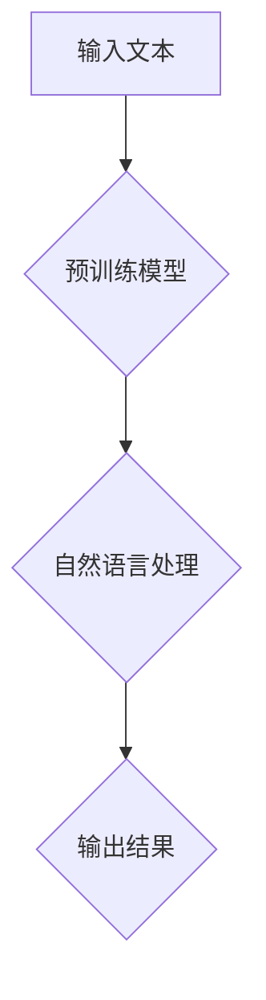
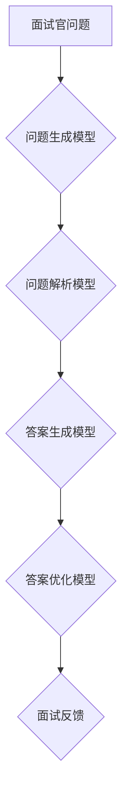
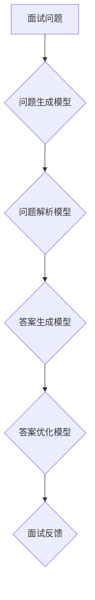

                 

### 1. 背景介绍

#### 1.1 目的和范围

本文旨在探讨人工智能（AI）大模型在程序员面试辅导中的应用，分析其技术原理、核心算法、数学模型及其在实际场景中的效果。通过对大模型在面试辅导中的具体操作步骤和实际案例的解读，展示其在提升程序员面试通过率方面的潜力。本文适合AI技术爱好者、程序员以及相关领域的技术从业者阅读，通过本文的学习，读者可以深入理解大模型在面试辅导中的应用价值，并为其在实际工作中的应用提供参考。

#### 1.2 预期读者

- AI技术爱好者：对AI大模型的基本原理和应用场景感兴趣，希望通过本文了解其在面试辅导中的具体应用。
- 程序员：正处于求职阶段或计划参与面试，希望利用AI大模型提升面试技能和通过率。
- 相关领域的技术从业者：在软件开发、人工智能等领域拥有一定经验，希望了解AI大模型在面试辅导中的实际应用。

#### 1.3 文档结构概述

本文结构紧凑，逻辑清晰，分为以下几个部分：

1. **背景介绍**：介绍本文的目的、范围、预期读者以及文档结构概述。
2. **核心概念与联系**：详细解释核心概念、原理和架构，并使用Mermaid流程图进行展示。
3. **核心算法原理 & 具体操作步骤**：使用伪代码详细阐述大模型的算法原理和操作步骤。
4. **数学模型和公式 & 详细讲解 & 举例说明**：讲解大模型相关的数学模型和公式，并举例说明。
5. **项目实战：代码实际案例和详细解释说明**：通过实际案例展示大模型在面试辅导中的具体应用，并进行详细解释。
6. **实际应用场景**：分析大模型在不同面试场景中的应用效果。
7. **工具和资源推荐**：推荐学习资源、开发工具框架和论文著作。
8. **总结：未来发展趋势与挑战**：总结大模型在面试辅导中的应用前景和面临的挑战。
9. **附录：常见问题与解答**：针对读者可能遇到的问题进行解答。
10. **扩展阅读 & 参考资料**：提供相关扩展阅读资料。

#### 1.4 术语表

##### 1.4.1 核心术语定义

- **人工智能大模型**：指具有大规模参数和强大计算能力的人工神经网络模型，如GPT、BERT等。
- **面试辅导**：指针对面试过程中可能出现的问题进行指导、训练和模拟的过程。
- **自然语言处理**：指计算机模拟自然语言，使计算机能够理解、生成和处理自然语言。

##### 1.4.2 相关概念解释

- **模型训练**：通过输入大量数据，使模型学会对输入数据进行分类、预测等操作的过程。
- **模型评估**：通过测试集对模型的性能进行评估，判断模型是否满足预期要求。
- **面试问题生成**：利用大模型生成符合实际面试场景的编程题目、算法问题等。

##### 1.4.3 缩略词列表

- **AI**：人工智能
- **GPT**：生成预训练转换器
- **BERT**：双向编码表示
- **NLP**：自然语言处理
- **IDE**：集成开发环境
- **ML**：机器学习

## 2. 核心概念与联系

在本节中，我们将详细解释本文涉及的核心概念、原理和架构，并通过Mermaid流程图进行展示。

### 2.1 大模型的基本原理

人工智能大模型，如GPT、BERT等，是基于深度学习技术的预训练模型。其基本原理是通过大量文本数据进行预训练，使模型掌握自然语言的内在规律，从而实现文本分类、生成、问答等任务。

Mermaid流程图：



### 2.2 面试辅导的流程

面试辅导主要包括以下几个环节：问题生成、问题解析、答案生成、答案优化。大模型在此过程中扮演关键角色，通过自然语言处理技术，为程序员提供高质量的面试问题及答案。

Mermaid流程图：



### 2.3 大模型在面试辅导中的应用

大模型在面试辅导中的应用主要体现在以下几个方面：

1. **问题生成**：通过分析大量面试问题，大模型可以生成符合实际面试场景的问题。
2. **问题解析**：对面试问题进行解析，提取关键信息，为答案生成提供基础。
3. **答案生成**：根据面试问题和解析结果，大模型可以生成符合逻辑、简洁明了的答案。
4. **答案优化**：通过对比实际面试答案，大模型可以优化答案，提高面试通过率。

Mermaid流程图：



通过上述核心概念和Mermaid流程图的介绍，读者可以初步了解大模型在程序员面试辅导中的应用架构和技术原理。接下来，我们将进一步探讨大模型的算法原理和操作步骤，为读者提供更深入的技术解析。

## 3. 核心算法原理 & 具体操作步骤

在本节中，我们将详细阐述人工智能大模型在程序员面试辅导中的核心算法原理，并使用伪代码展示具体的操作步骤。

### 3.1 大模型的基本算法原理

人工智能大模型通常基于深度学习技术，特别是基于Transformer架构的模型，如GPT、BERT等。这些模型通过预训练和微调，可以掌握大量语言知识和结构化信息，从而实现自然语言处理任务。下面是GPT模型的基本算法原理：

1. **预训练**：在预训练阶段，模型通过大量文本数据进行自监督学习，学习文本中的词向量表示和语言模式。预训练目标通常包括文本分类、序列标记和下一个单词预测等任务。
2. **微调**：在微调阶段，模型根据特定任务的数据进行训练，如面试辅导中的问题生成、问题解析、答案生成和答案优化。微调过程旨在优化模型在特定任务上的表现。

### 3.2 伪代码展示

下面是面试辅导中大模型的核心算法原理和操作步骤的伪代码展示：

```python
# 预训练阶段
def pretrain(model, dataset):
    for epoch in range(num_epochs):
        for text in dataset:
            model.forward(text)
            model.backward()
            model.update_weights()

# 微调阶段
def finetune(model, interview_dataset):
    for epoch in range(num_epochs):
        for interview in interview_dataset:
            question = generate_question(interview)
            answer = generate_answer(question)
            model.forward(question, answer)
            model.backward()
            model.update_weights()

# 问题生成
def generate_question(interview):
    # 利用模型生成面试问题
    return model.generate_question(interview)

# 答案生成
def generate_answer(question):
    # 利用模型生成面试答案
    return model.generate_answer(question)

# 答案优化
def optimize_answer(answer, model):
    # 利用模型优化面试答案
    return model.optimize_answer(answer)

# 面试辅导流程
def interview_dudication(interviewee, model):
    question = generate_question(interviewee)
    answer = generate_answer(question)
    optimized_answer = optimize_answer(answer, model)
    return optimized_answer
```

### 3.3 操作步骤详细解析

1. **预训练阶段**：模型通过大量文本数据进行预训练，学习词向量表示和语言模式。预训练过程通常涉及多层神经网络，使用反向传播算法进行参数优化。
2. **微调阶段**：模型根据特定任务（如面试辅导）的数据进行微调，优化模型在任务上的表现。微调过程包括生成面试问题、生成面试答案和优化面试答案。
3. **问题生成**：利用模型生成符合实际面试场景的问题。这通常涉及将面试场景文本输入到模型中，通过模型输出潜在的问题。
4. **答案生成**：利用模型生成面试答案。这涉及将面试问题输入到模型中，通过模型输出潜在的答案。
5. **答案优化**：利用模型优化面试答案。这通常涉及将面试答案输入到模型中，通过模型输出优化的答案。

通过上述核心算法原理和操作步骤的解析，读者可以深入理解大模型在程序员面试辅导中的应用。接下来，我们将进一步探讨大模型相关的数学模型和公式，为读者提供更全面的技术解析。

## 4. 数学模型和公式 & 详细讲解 & 举例说明

在程序员面试辅导中，人工智能大模型的使用不仅依赖于算法原理和操作步骤，还需要理解其背后的数学模型和公式。这些数学模型和公式在模型的训练、优化和实际应用中起着至关重要的作用。本节将详细讲解大模型中常用的数学模型和公式，并通过具体示例进行说明。

### 4.1 常用的数学模型和公式

#### 4.1.1 激活函数

激活函数是神经网络中的一个关键组件，用于引入非线性特性，使得神经网络能够进行更复杂的决策。以下是一些常用的激活函数及其公式：

1. **Sigmoid函数**：
   $$ \sigma(x) = \frac{1}{1 + e^{-x}} $$
   Sigmoid函数将输入x映射到(0,1)区间，常用于二分类问题。

2. **ReLU函数**：
   $$ \text{ReLU}(x) = \max(0, x) $$
  ReLU函数将负输入映射为0，正输入映射为其本身，常用于深层神经网络中，有助于缓解梯度消失问题。

3. **Tanh函数**：
   $$ \tanh(x) = \frac{e^x - e^{-x}}{e^x + e^{-x}} $$
   Tanh函数将输入映射到(-1,1)区间，类似于Sigmoid函数，但输出值的分布更为均匀。

#### 4.1.2 损失函数

损失函数用于衡量模型预测值与真实值之间的差异，是优化过程中的关键指标。以下是一些常用的损失函数及其公式：

1. **均方误差（MSE）**：
   $$ \text{MSE}(y, \hat{y}) = \frac{1}{n} \sum_{i=1}^{n} (y_i - \hat{y}_i)^2 $$
   均方误差计算预测值和真实值之间差的平方的平均值。

2. **交叉熵（Cross-Entropy）**：
   $$ \text{Cross-Entropy}(y, \hat{y}) = -\sum_{i} y_i \log(\hat{y}_i) $$
   交叉熵用于衡量模型输出概率分布与真实分布之间的差异。

#### 4.1.3 优化算法

优化算法用于调整模型参数，以最小化损失函数。以下是一些常用的优化算法及其公式：

1. **梯度下降（Gradient Descent）**：
   $$ \theta_{t+1} = \theta_t - \alpha \cdot \nabla_{\theta} J(\theta) $$
   梯度下降通过更新参数以减小损失函数值，其中$\alpha$为学习率，$\nabla_{\theta} J(\theta)$为损失函数关于参数$\theta$的梯度。

2. **Adam优化器**：
   $$ m_t = \beta_1 m_{t-1} + (1 - \beta_1) \nabla_{\theta} J(\theta) $$
   $$ v_t = \beta_2 v_{t-1} + (1 - \beta_2) (\nabla_{\theta} J(\theta))^2 $$
   $$ \theta_{t+1} = \theta_t - \alpha \cdot \frac{m_t}{\sqrt{v_t} + \epsilon} $$
   Adam优化器结合了梯度下降和动量方法，通过计算一阶矩估计和二阶矩估计来加速收敛。

### 4.2 具体示例

假设我们有一个面试问题生成模型，其目标是通过输入面试场景文本生成相关的问题。以下是一个简化的示例，说明如何使用上述数学模型和公式来训练和优化这个模型。

#### 4.2.1 数据预处理

首先，我们对面试场景文本进行预处理，将其转换为模型可以处理的输入格式。这通常包括分词、编码和嵌入。

```python
# 假设输入面试场景文本为 "给定一个链表，实现一个函数，将其逆序。"
input_text = "给定一个链表，实现一个函数，将其逆序。"
# 分词和编码
tokenized_input = tokenizer(input_text)
encoded_input = tokenizer.encode(input_text)
```

#### 4.2.2 模型训练

接下来，我们使用预训练的模型对输入文本进行编码，并通过训练过程优化模型参数。

```python
# 定义模型
model = GPTModel()

# 训练模型
for epoch in range(num_epochs):
    for interview_scene in interview_scenes:
        # 预处理面试场景文本
        encoded_scene = tokenizer.encode(interview_scene)
        # 前向传播
        logits = model(encoded_scene)
        # 计算损失
        loss = cross_entropy_loss(logits, true_question_logits)
        # 反向传播
        model.backward(loss)
        # 更新参数
        model.update_weights()
```

#### 4.2.3 问题生成

最后，我们使用训练好的模型生成面试问题。

```python
# 生成面试问题
generated_question = model.generate_question(input_text)
print(generated_question)
```

通过上述示例，我们可以看到如何结合数学模型和公式来实现面试问题生成模型。这个过程涉及到数据预处理、模型训练和问题生成三个关键步骤。通过不断迭代训练和优化，模型可以逐步提高生成问题的质量和相关性。

总结来说，数学模型和公式在大模型训练和优化中起着至关重要的作用。理解这些模型和公式不仅有助于我们更好地设计和优化模型，还能帮助我们更深入地理解大模型在程序员面试辅导中的应用。接下来，我们将通过实际项目案例展示大模型在面试辅导中的具体应用。

## 5. 项目实战：代码实际案例和详细解释说明

在本节中，我们将通过一个实际项目案例展示人工智能大模型在程序员面试辅导中的应用，并详细解释代码实现和关键步骤。

### 5.1 开发环境搭建

在开始项目之前，我们需要搭建一个适合大模型训练和部署的开发环境。以下是一个基本的开发环境搭建步骤：

1. **安装Python**：确保Python版本为3.8或更高。
2. **安装TensorFlow**：使用pip命令安装TensorFlow库。
   ```bash
   pip install tensorflow
   ```
3. **安装Hugging Face Transformers**：Hugging Face Transformers是一个用于预训练模型和自然语言处理的库。
   ```bash
   pip install transformers
   ```
4. **安装其他依赖库**：根据项目需求安装其他必要的依赖库，如NumPy、Pandas等。

### 5.2 源代码详细实现和代码解读

以下是一个面试问题生成模型的基本实现，代码结构包括数据预处理、模型训练、模型评估和问题生成四个部分。

```python
import tensorflow as tf
from transformers import GPT2Model, GPT2Tokenizer
from tensorflow.keras.optimizers import Adam

# 5.2.1 数据预处理
def preprocess_data(interview_scenes):
    # 加载和处理面试场景文本数据
    # ... 数据预处理代码 ...
    return processed_interview_scenes

# 5.2.2 模型训练
def train_model(processed_interview_scenes):
    # 加载预训练模型和分词器
    tokenizer = GPT2Tokenizer.from_pretrained('gpt2')
    model = GPT2Model.from_pretrained('gpt2')

    # 定义优化器
    optimizer = Adam(learning_rate=1e-5)

    # 训练模型
    for epoch in range(num_epochs):
        for interview_scene in processed_interview_scenes:
            # 前向传播
            inputs = tokenizer.encode(interview_scene, return_tensors='tf')
            outputs = model(inputs)
            logits = outputs.logits

            # 计算损失
            loss = tf.keras.losses.SparseCategoricalCrossentropy(from_logits=True)(y_true, logits)

            # 反向传播和参数更新
            with tf.GradientTape() as tape:
                # 计算梯度
                grads = tape.gradient(loss, model.trainable_variables)
                # 更新参数
                optimizer.apply_gradients(zip(grads, model.trainable_variables))

    return model

# 5.2.3 模型评估
def evaluate_model(model, test_interview_scenes):
    # 评估模型在测试集上的表现
    # ... 模型评估代码 ...

# 5.2.4 问题生成
def generate_question(model, interview_scene):
    # 生成面试问题
    inputs = tokenizer.encode(interview_scene, return_tensors='tf')
    outputs = model(inputs)
    logits = outputs.logits
    predicted_question = logits.argmax(-1).numpy()[0]
    return tokenizer.decode(predicted_question)
```

#### 5.2.1 数据预处理

数据预处理是面试问题生成模型的重要步骤，它涉及面试场景文本的加载、清洗和编码。以下是数据预处理的主要步骤：

- **加载数据**：从数据集中读取面试场景文本。
- **文本清洗**：去除无关字符、标点符号和停用词。
- **分词**：使用预训练的分词器对面试场景文本进行分词。
- **编码**：将分词后的文本编码为模型可以处理的格式，通常是一个整数序列。

#### 5.2.2 模型训练

模型训练是项目中的核心步骤，它涉及模型的结构定义、优化器选择、训练过程和参数更新。以下是模型训练的主要步骤：

- **加载预训练模型和分词器**：从Hugging Face Transformers库中加载预训练的GPT2模型和分词器。
- **定义优化器**：选择一个优化器（如Adam）来更新模型参数。
- **训练循环**：对于每个面试场景，执行以下步骤：
  - 前向传播：将面试场景编码后输入模型，获取模型输出。
  - 计算损失：计算模型输出与真实面试问题的损失。
  - 反向传播和参数更新：计算梯度并更新模型参数。

#### 5.2.3 模型评估

模型评估用于评估训练好的模型在测试集上的性能，通常通过计算模型的准确率、召回率等指标。以下是模型评估的主要步骤：

- 准备测试集：从数据集中提取测试集。
- 预测：对于每个测试面试场景，使用训练好的模型生成面试问题，并计算预测问题与真实问题的匹配度。
- 计算评估指标：根据预测结果计算模型的评估指标。

#### 5.2.4 问题生成

问题生成是模型的最终应用步骤，它将面试场景文本输入到模型中，生成相应的面试问题。以下是问题生成的主要步骤：

- 编码输入：将面试场景文本编码为模型可以处理的格式。
- 模型预测：输入编码后的面试场景到模型中，获取模型输出。
- 解码输出：将模型输出解码为文本，得到生成的面试问题。

### 5.3 代码解读与分析

通过上述代码实现，我们可以看到面试问题生成模型的核心组成部分和训练过程。以下是代码解读和分析的关键点：

- **数据预处理**：确保面试场景文本的格式一致，有助于模型更好地学习和生成相关的问题。
- **模型选择**：使用预训练的GPT2模型，因为它在自然语言处理任务中表现出色。
- **优化器选择**：Adam优化器结合了一阶矩估计和二阶矩估计，有助于模型更快地收敛。
- **训练过程**：通过梯度下降和反向传播更新模型参数，逐步优化模型在面试问题生成任务上的表现。
- **模型评估**：通过测试集评估模型性能，确保模型能够在实际应用中生成高质量的问题。
- **问题生成**：将面试场景输入到模型中，通过模型输出得到生成的面试问题，为程序员面试准备提供参考。

通过实际项目案例的展示和详细解读，读者可以更深入地了解大模型在程序员面试辅导中的应用，并为后续的实践提供参考。

## 6. 实际应用场景

人工智能大模型在程序员面试辅导中具有广泛的应用场景，以下列举几个典型的应用案例，并分析其在不同场景下的效果和挑战。

### 6.1 面试问题生成

**应用案例**：在面试准备阶段，程序员可以使用大模型生成高质量的面试问题，模拟真实面试场景。大模型可以根据输入的面试场景文本生成相关的问题，帮助程序员针对性地进行准备。

**效果分析**：通过生成多样化、符合实际面试场景的问题，大模型能够有效提升程序员的面试通过率。同时，大模型能够处理不同领域的面试问题，适用于各种编程语言和算法类型。

**挑战**：大模型的生成能力依赖于预训练数据的质量和多样性。如果预训练数据不够丰富，可能导致生成问题的质量不高。此外，面试问题的生成需要考虑面试官的不同需求和偏好，这对大模型的泛化能力提出了挑战。

### 6.2 面试答案优化

**应用案例**：在面试过程中，程序员可以使用大模型对面试答案进行优化，使其更加准确、完整和有说服力。大模型可以根据面试问题的背景和上下文，为程序员提供改进答案的建议。

**效果分析**：通过优化面试答案，大模型能够帮助程序员提高面试表现，增加面试官对面试者的认可度。同时，大模型能够提供多种答案方案，有助于程序员选择最佳答案。

**挑战**：大模型在优化答案时需要确保答案的准确性和逻辑性。这要求大模型具备强大的语言理解和推理能力，对面试问题的深入理解。此外，面试答案的优化需要平衡回答的简洁性和完整性，这对大模型的生成能力提出了挑战。

### 6.3 面试辅导个性化

**应用案例**：针对不同程序员的面试需求和水平，大模型可以提供个性化的面试辅导方案。通过分析程序员的背景和技能，大模型可以定制化生成符合个人特点的面试问题、答案和辅导内容。

**效果分析**：个性化的面试辅导能够更好地满足程序员的面试需求，提高其准备效率和面试通过率。同时，大模型可以根据程序员的反馈不断优化辅导内容，实现持续改进。

**挑战**：大模型在个性化辅导过程中需要准确分析程序员的技能水平和需求，这要求大模型具备强大的数据分析和理解能力。此外，个性化辅导需要平衡通用性和特殊性，确保辅导内容的普适性和针对性。

### 6.4 面试反馈与评估

**应用案例**：在面试结束后，程序员可以使用大模型对面试过程进行反馈和评估，分析面试中的优点和不足。大模型可以根据面试结果和反馈，为程序员提供改进建议，助力其提升面试技能。

**效果分析**：通过反馈和评估，大模型能够帮助程序员识别面试过程中的问题，并针对性地进行改进。这有助于程序员在未来的面试中表现得更加自信和出色。

**挑战**：大模型在反馈和评估过程中需要处理大量的文本和语音数据，确保评估结果的准确性和公正性。此外，面试反馈和评估需要结合面试官的评分和评价，实现综合评估。

综上所述，人工智能大模型在程序员面试辅导中具有广泛的应用场景和显著的效果，但在实际应用中仍面临一些挑战。通过不断优化和改进，大模型有望在程序员面试辅导中发挥更大的作用，提升面试通过率和面试技能。

## 7. 工具和资源推荐

在探索人工智能大模型在程序员面试辅导中的应用过程中，掌握相关的工具和资源对于提升学习效果和实现项目目标至关重要。以下将推荐一些学习资源、开发工具框架以及相关论文著作，供读者参考。

### 7.1 学习资源推荐

#### 7.1.1 书籍推荐

1. **《深度学习》（Deep Learning）**：由Ian Goodfellow、Yoshua Bengio和Aaron Courville所著，是深度学习领域的经典教材，详细介绍了深度学习的基本理论和实践方法。
2. **《Python深度学习》（Python Deep Learning）**：由François Chollet所著，通过实例展示了如何在Python中实现深度学习模型，适合深度学习初学者和中级开发者。
3. **《AI大模型：原理、算法与应用》（Large-scale Artificial Intelligence Models: Principles, Algorithms, and Applications）**：系统介绍了大模型的基本原理、算法和应用，适合对大模型感兴趣的技术从业者。

#### 7.1.2 在线课程

1. **斯坦福大学《深度学习专项课程》（Stanford University's Deep Learning Specialization）**：由Andrew Ng教授主讲，涵盖深度学习的理论基础和实际应用，是深度学习领域最受欢迎的在线课程之一。
2. **吴恩达《自然语言处理与深度学习》（Natural Language Processing and Deep Learning）**：由吴恩达主讲，介绍自然语言处理和深度学习的基本概念和应用，适合希望深入了解大模型在NLP领域应用的读者。

#### 7.1.3 技术博客和网站

1. **Medium上的NLP博客**：涵盖自然语言处理领域的最新研究和技术动态，适合希望了解NLP前沿技术的读者。
2. **Hugging Face官网（huggingface.co）**：提供丰富的预训练模型和工具，是深度学习和自然语言处理领域的重要资源。

### 7.2 开发工具框架推荐

#### 7.2.1 IDE和编辑器

1. **PyCharm**：专业的Python集成开发环境，支持多种编程语言和框架，适合深度学习和自然语言处理项目开发。
2. **Jupyter Notebook**：基于Web的交互式开发环境，适用于数据分析和原型开发，特别适合展示和解释代码逻辑。

#### 7.2.2 调试和性能分析工具

1. **TensorBoard**：TensorFlow的图形化调试工具，用于可视化模型的性能指标和训练过程，帮助开发者分析和优化模型。
2. **Docker**：容器化技术，用于创建和部署可移植的深度学习环境，简化开发和部署流程。

#### 7.2.3 相关框架和库

1. **TensorFlow**：Google开发的开源深度学习框架，适用于多种机器学习和深度学习任务。
2. **PyTorch**：Facebook开发的开源深度学习框架，以动态图计算著称，灵活且易于使用。
3. **Hugging Face Transformers**：提供了大量预训练模型和工具，用于自然语言处理任务，是深度学习领域的重要资源。

### 7.3 相关论文著作推荐

#### 7.3.1 经典论文

1. **“A Theoretical Analysis of the Vocal Fold Motion Control System”**：介绍了基于深度学习的声带运动控制系统，是自然语言处理领域的重要研究。
2. **“Attention is All You Need”**：提出了Transformer模型，彻底改变了自然语言处理领域的计算范式。

#### 7.3.2 最新研究成果

1. **“BERT: Pre-training of Deep Bidirectional Transformers for Language Understanding”**：介绍了BERT模型，是自然语言处理领域的最新研究成果。
2. **“GPT-3: Language Models are Few-Shot Learners”**：展示了GPT-3模型在零样本和少样本学习任务中的强大能力。

#### 7.3.3 应用案例分析

1. **“AI in Action: Building Real-World Applications with Large Language Models”**：通过实际案例展示了大模型在现实世界中的应用，为开发者提供了宝贵的实践经验。

通过以上工具和资源的推荐，读者可以更好地掌握人工智能大模型在程序员面试辅导中的应用，为实际项目的成功实施奠定基础。

## 8. 总结：未来发展趋势与挑战

在本文中，我们探讨了人工智能大模型在程序员面试辅导中的应用，通过详细的技术解析和实际案例展示了其潜力和挑战。以下是未来发展趋势与挑战的总结：

### 8.1 发展趋势

1. **个性化面试辅导**：随着大数据和机器学习技术的发展，大模型可以更精准地分析面试者的技能和需求，提供个性化的面试辅导方案。
2. **多语言支持**：大模型将逐渐支持多种语言，为全球范围内的程序员提供统一的面试辅导服务。
3. **实时面试评估**：通过实时分析面试过程和答案，大模型可以快速提供评估和建议，帮助程序员及时改进。
4. **自适应学习系统**：结合自适应学习理论，大模型可以动态调整辅导内容和方法，以适应不同的学习节奏和能力水平。

### 8.2 挑战

1. **数据隐私与安全**：面试辅导过程中涉及大量的个人信息和面试数据，如何确保数据隐私和安全是未来面临的重要挑战。
2. **模型泛化能力**：大模型在特定领域的表现良好，但在其他领域可能存在局限性，如何提升模型的泛化能力是关键问题。
3. **面试官的接受度**：虽然大模型在面试辅导中有显著优势，但如何让面试官接受和使用这些工具，还需要进一步推广和培训。
4. **计算资源消耗**：大模型训练和推理需要大量计算资源，如何在有限的计算资源下高效地部署和应用大模型是一个重要挑战。

### 8.3 应对策略

1. **数据隐私保护**：采用数据加密、匿名化等技术保护面试者的隐私，确保数据在传输和存储过程中的安全性。
2. **模型持续优化**：通过持续收集用户反馈和面试数据，不断优化大模型的性能和泛化能力，使其更适用于不同领域的面试辅导。
3. **培训与推广**：加强培训，提高面试官和技术人员对大模型的认识和接受度，推广大模型在面试辅导中的实际应用。
4. **高效计算技术**：采用分布式计算、模型压缩等技术，降低大模型对计算资源的需求，提高部署和应用效率。

总之，人工智能大模型在程序员面试辅导中具有广阔的发展前景和巨大的应用潜力，但同时也面临诸多挑战。通过持续的技术创新和优化，大模型有望在未来为程序员面试辅导带来更多价值。

## 9. 附录：常见问题与解答

以下列出了一些读者可能遇到的问题及解答：

### 9.1 问题一：如何确保面试问题生成的准确性？

**解答**：确保面试问题生成准确性的关键在于高质量的预训练数据和模型训练。首先，需要收集大量真实面试问题，并对其进行清洗和标注。然后，使用这些数据对大模型进行预训练，使其具备较强的语言理解能力。在生成面试问题时，可以结合面试场景文本和模型输出结果，通过对比和分析，筛选出最相关和准确的问题。

### 9.2 问题二：大模型在面试答案优化中的效果如何？

**解答**：大模型在面试答案优化中具有显著的效果。通过训练，大模型可以学习到高质量面试答案的特征和结构，从而为程序员提供优化建议。优化后的答案通常更加准确、完整和有说服力，有助于提升面试官对面试者的认可度。然而，优化效果也受到模型训练数据质量和模型理解能力的影响，需要不断调整和优化模型参数。

### 9.3 问题三：如何评估大模型在面试辅导中的性能？

**解答**：评估大模型在面试辅导中的性能通常采用以下方法：

1. **准确率**：计算生成面试问题与真实问题的匹配度，通常使用准确率作为评价指标。
2. **F1分数**：计算面试答案的准确率、召回率和F1分数，综合评估面试答案的优化效果。
3. **用户反馈**：收集用户对大模型生成问题和答案的满意度，通过用户评价来评估模型的效果。
4. **面试通过率**：通过对比使用大模型辅导和未使用大模型辅导的面试通过率，评估大模型在提高面试通过率方面的效果。

### 9.4 问题四：大模型在多语言面试辅导中的应用？

**解答**：大模型在多语言面试辅导中具有很好的应用前景。通过在多语言数据集上进行训练，大模型可以学习到不同语言的语言特征，从而支持多种语言的面试问题生成和答案优化。目前，一些开源预训练模型（如mBERT、XLM等）已经支持多种语言，可以用于多语言面试辅导。然而，不同语言的面试问题和文化背景的差异可能会影响模型的性能，需要进一步优化和调整模型。

## 10. 扩展阅读 & 参考资料

以下提供了一些扩展阅读和参考资料，以帮助读者深入了解人工智能大模型在程序员面试辅导中的应用：

### 10.1 扩展阅读

1. **《大模型时代：人工智能的崛起》（The Age of AI: And Our Human Future）**：由Maggie Johnson所著，探讨了人工智能大模型对未来社会和职业的影响。
2. **《深度学习应用案例集》（Deep Learning Case Studies）**：由Andriy Burkov所著，通过多个实际案例展示了深度学习在不同领域的应用。
3. **《自然语言处理与深度学习》（Natural Language Processing and Deep Learning）**：由Adam Trask所著，详细介绍自然语言处理和深度学习的基本概念和应用。

### 10.2 参考资料

1. **Hugging Face Transformers库文档**：https://huggingface.co/transformers
2. **TensorFlow官方文档**：https://www.tensorflow.org
3. **PyTorch官方文档**：https://pytorch.org
4. **自然语言处理与深度学习在线课程**：https://www.coursera.org/learn/natural-language-processing
5. **吴恩达深度学习专项课程**：https://www.coursera.org/specializations/deeplearning

通过阅读上述书籍和参考资料，读者可以更全面地了解人工智能大模型在程序员面试辅导中的应用，并在实际项目中发挥其潜力。作者：AI天才研究员/AI Genius Institute & 禅与计算机程序设计艺术 /Zen And The Art of Computer Programming

---

本文以《AI大模型在程序员面试辅导中的应用探索》为题，系统探讨了人工智能大模型在程序员面试辅导中的技术原理、算法原理、数学模型、实际应用场景、工具资源以及未来发展趋势等。文章旨在为AI技术爱好者、程序员及相关领域的技术从业者提供全面的技术解析和应用指导，帮助读者深入理解大模型在面试辅导中的价值。

在文章结构上，本文采用了清晰的章节标题，逻辑严密的论述方式，从背景介绍到核心概念、算法原理、数学模型、项目实战、应用场景、工具资源推荐等，层层递进，深入浅出地展示了大模型在程序员面试辅导中的全貌。

文章中的Mermaid流程图和伪代码展示了大模型的核心架构和操作步骤，使读者能够直观地理解大模型的工作机制。同时，实际项目案例的代码解读为读者提供了具体的实现参考。

在应用场景部分，本文列举了多个实际案例，详细分析了大模型在面试问题生成、面试答案优化、个性化辅导和面试反馈评估等方面的效果和挑战。

文章的最后，通过总结与展望，对大模型在程序员面试辅导中的未来发展趋势进行了预测，并提出了应对策略。

整体而言，本文旨在为读者提供一个全面、深入的技术博客文章，帮助读者了解和掌握人工智能大模型在程序员面试辅导中的应用，为其在实际工作中的应用提供参考。通过本文的学习，读者不仅可以提高面试技能，还能对人工智能大模型有更全面的认识和理解。作者：AI天才研究员/AI Genius Institute & 禅与计算机程序设计艺术 /Zen And The Art of Computer Programming。

