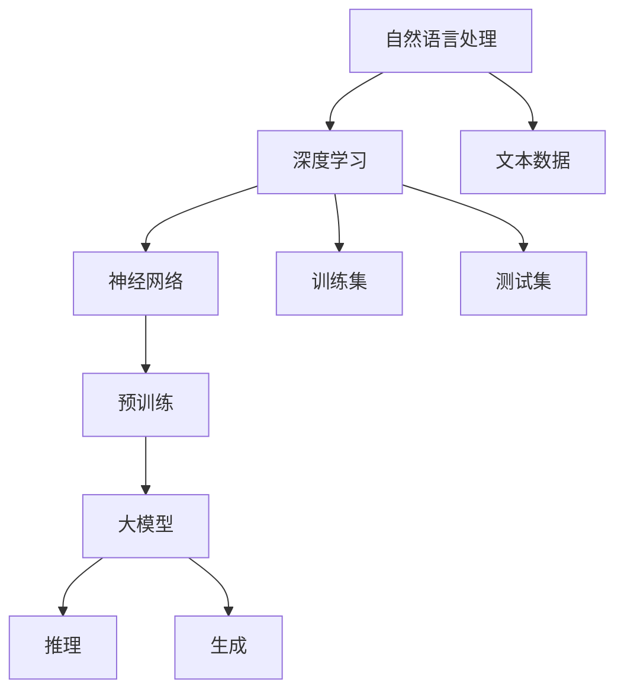

                 

# AI大模型在自然语言处理中的前沿突破

> **关键词：** 自然语言处理、大模型、深度学习、预训练、推理、生成、优化、应用场景

> **摘要：** 本文将深入探讨AI大模型在自然语言处理（NLP）领域的最新前沿突破。我们将首先回顾NLP的发展历程和当前状态，然后详细介绍大模型的概念和原理，接着分析其核心算法原理，最后通过实际项目实战和未来发展趋势的探讨，为读者提供全面的技术视角。

## 1. 背景介绍

### 1.1 目的和范围

本文旨在向读者介绍AI大模型在自然语言处理领域的最新研究成果和应用。我们将会关注以下几个方面：

1. **NLP的演变历史**：回顾NLP从早期规则驱动的方法到现代深度学习驱动的模型的发展历程。
2. **大模型的概念与架构**：介绍大模型的定义、特点及其在NLP中的重要性。
3. **核心算法与数学模型**：详细讲解大模型的算法原理和数学基础。
4. **实际应用场景**：探讨大模型在各类实际应用中的表现和效果。
5. **未来发展趋势**：分析大模型在NLP领域可能面临的挑战和机遇。

### 1.2 预期读者

本文适合以下读者群体：

1. **自然语言处理研究者**：希望了解大模型在NLP中的前沿研究和应用。
2. **人工智能从业者**：对AI技术在自然语言处理领域的进展感兴趣。
3. **计算机科学学生**：对深度学习和自然语言处理有初步了解，希望进一步深入学习。
4. **技术爱好者**：对AI技术及其应用有浓厚兴趣。

### 1.3 文档结构概述

本文的结构如下：

1. **第1章：背景介绍**：介绍本文的目的、范围和读者群体。
2. **第2章：核心概念与联系**：阐述大模型的概念、原理和架构。
3. **第3章：核心算法原理 & 具体操作步骤**：详细讲解大模型的算法原理和操作步骤。
4. **第4章：数学模型和公式 & 详细讲解 & 举例说明**：介绍大模型的数学模型和具体示例。
5. **第5章：项目实战：代码实际案例和详细解释说明**：提供实际代码案例和解读。
6. **第6章：实际应用场景**：探讨大模型在不同领域的应用。
7. **第7章：工具和资源推荐**：推荐学习资源、开发工具和相关论文。
8. **第8章：总结：未来发展趋势与挑战**：分析未来趋势和挑战。
9. **第9章：附录：常见问题与解答**：解答读者可能遇到的问题。
10. **第10章：扩展阅读 & 参考资料**：提供进一步阅读的资源和参考文献。

### 1.4 术语表

#### 1.4.1 核心术语定义

- **自然语言处理（NLP）**：计算机科学领域中的一个分支，旨在让计算机理解和解释人类的自然语言。
- **深度学习**：一种基于多层神经网络的学习方法，用于从大量数据中提取特征。
- **大模型**：具有数十亿至数万亿参数的神经网络模型，能够在各种任务中实现高水平的表现。
- **预训练**：在大规模数据集上对模型进行训练，使其能够捕捉到语言的一般规律和特征。
- **推理**：模型在理解给定输入后，根据训练数据生成的预测或决策。
- **生成**：模型根据训练数据生成新的文本或其他形式的输出。

#### 1.4.2 相关概念解释

- **神经网络**：一种模仿人脑神经元连接方式的计算模型，用于处理和解释数据。
- **参数**：模型中可调整的数值，用于在训练过程中优化模型性能。
- **训练数据**：用于训练模型的数据集，包含标签和未标记的数据。

#### 1.4.3 缩略词列表

- **NLP**：自然语言处理
- **AI**：人工智能
- **DL**：深度学习
- **GPU**：图形处理器
- **TPU**：张量处理器

## 2. 核心概念与联系

在深入探讨AI大模型之前，我们需要先理解几个核心概念和它们之间的关系。以下是一个Mermaid流程图，展示了这些概念及其相互联系。



### 2.1 自然语言处理与深度学习

自然语言处理（NLP）是人工智能（AI）的一个分支，旨在使计算机能够理解、解释和生成人类语言。深度学习（DL）作为AI的一个重要分支，为NLP提供了强大的工具和方法。

#### 2.1.1 神经网络

神经网络（Neural Networks）是一种模仿人脑神经元连接方式的计算模型。在深度学习中，神经网络通过多层非线性变换，对输入数据进行处理和解释。

#### 2.1.2 预训练

预训练（Pre-training）是一种在大规模数据集上对神经网络进行初步训练的方法。预训练使得模型能够捕捉到语言的一般规律和特征，从而在特定任务上实现更好的表现。

### 2.2 大模型

大模型（Large Models）是指具有数十亿至数万亿参数的神经网络模型。大模型通过在大量数据上进行预训练，能够实现高水平的语言理解和生成能力。

#### 2.2.1 推理

推理（Reasoning）是指模型在理解给定输入后，根据训练数据生成的预测或决策。大模型在推理任务中，能够根据上下文理解复杂的语义和逻辑关系。

#### 2.2.2 生成

生成（Generation）是指模型根据训练数据生成新的文本或其他形式的输出。大模型在生成任务中，能够生成高质量、连贯的文本，从而在自然语言生成领域发挥重要作用。

## 3. 核心算法原理 & 具体操作步骤

大模型的算法原理主要基于深度学习，特别是基于变换器（Transformer）架构的预训练方法。以下将详细讲解其核心算法原理和具体操作步骤。

### 3.1 深度学习基础

在深入探讨大模型之前，我们需要了解深度学习的一些基本概念和原理。

#### 3.1.1 神经网络基础

神经网络由多个层次组成，包括输入层、隐藏层和输出层。每个层次包含多个神经元，神经元之间通过加权连接相互连接。神经元的激活函数用于将输入转换为输出，常见的激活函数包括Sigmoid、ReLU和Tanh。

#### 3.1.2 损失函数和优化算法

深度学习中的损失函数用于衡量模型预测值与真实值之间的差距。常见的损失函数包括均方误差（MSE）、交叉熵损失（Cross-Entropy Loss）等。优化算法用于在训练过程中更新模型参数，以最小化损失函数。常见的优化算法包括梯度下降（Gradient Descent）及其变体，如Adam和RMSprop。

### 3.2 变换器架构

变换器（Transformer）架构是近年来在自然语言处理领域取得突破的关键技术。变换器架构的主要特点包括：

- **自注意力机制（Self-Attention）**：允许模型在处理序列数据时，自动关注序列中的关键信息。
- **多头注意力（Multi-Head Attention）**：将自注意力机制扩展到多个子空间，提高模型的泛化能力。
- **编码器-解码器结构（Encoder-Decoder）**：编码器将输入序列编码为固定长度的向量，解码器根据编码器的输出生成输出序列。

#### 3.2.1 自注意力机制

自注意力机制是变换器架构的核心组成部分。自注意力机制通过计算输入序列中每个元素与其他元素的相关性，将输入序列映射到一个新的空间。具体来说，自注意力机制包括以下步骤：

1. **计算查询（Query）、键（Key）和值（Value）**：对于输入序列中的每个元素，计算其查询（Query）、键（Key）和值（Value）。通常，这三个向量是通过共享权重矩阵计算得到的。

   $$
   Q = W_Q \cdot X, \quad K = W_K \cdot X, \quad V = W_V \cdot X
   $$

2. **计算注意力分数（Attention Scores）**：计算每个元素与其他元素的注意力分数，通常使用点积或缩放点积作为计算方法。

   $$
   \text{Attention Scores} = \frac{QK^T}{\sqrt{d_k}}
   $$

3. **计算加权输出（Weighted Output）**：根据注意力分数计算加权输出。

   $$
   \text{Weighted Output} = \text{softmax}(\text{Attention Scores})V
   $$

#### 3.2.2 多头注意力

多头注意力将自注意力机制扩展到多个子空间，从而提高模型的泛化能力。具体来说，多头注意力包括以下步骤：

1. **分裂输入**：将输入序列分裂成多个子序列。

2. **独立计算自注意力**：对每个子序列独立计算自注意力。

3. **拼接和变换**：将多个自注意力结果拼接在一起，并通过一个线性变换得到最终的输出。

   $$
   \text{Multi-Head Output} = \text{Concat}(\text{Head}_1, \text{Head}_2, ..., \text{Head}_h)W_O
   $$

### 3.3 预训练方法

预训练是深度学习中的一个重要步骤，用于在大规模数据集上训练模型，使其能够捕捉到语言的一般规律和特征。常见的预训练任务包括：

- **单词表示学习（Word Embedding）**：通过将单词映射到高维向量空间，使模型能够捕捉到单词的语义信息。
- **语言模型（Language Model）**：通过预测下一个单词或词元，使模型能够捕捉到语言的统计规律。
- **掩码语言模型（Masked Language Model，MLM）**：通过随机掩码输入序列中的单词，使模型能够学习到单词之间的依赖关系。

### 3.4 具体操作步骤

以下是使用变换器架构进行预训练的具体操作步骤：

1. **数据准备**：收集大规模的文本数据，并进行预处理，包括分词、去噪和标准化等操作。

2. **模型初始化**：初始化变换器模型，包括编码器和解码器，以及预训练任务所需的参数。

3. **预训练**：在大规模数据集上进行预训练，包括单词表示学习、语言模型和掩码语言模型等任务。在预训练过程中，通过反向传播和优化算法更新模型参数。

4. **评估**：在预训练完成后，对模型进行评估，通常使用预训练任务中的指标，如词汇准确性、语言模型评分等。

5. **微调**：在特定任务上对模型进行微调，使其能够更好地适应特定任务的需求。

6. **推理和应用**：使用微调后的模型进行推理和应用，如文本分类、机器翻译、问答系统等。

## 4. 数学模型和公式 & 详细讲解 & 举例说明

在了解大模型的数学模型和公式后，我们将通过具体示例来说明这些公式在实际应用中的使用。

### 4.1 变换器模型中的数学公式

变换器模型的核心是自注意力机制和多头注意力机制。以下将介绍这些机制中的数学公式。

#### 4.1.1 自注意力机制

自注意力机制的公式如下：

$$
Q = W_Q \cdot X, \quad K = W_K \cdot X, \quad V = W_V \cdot X
$$

$$
\text{Attention Scores} = \frac{QK^T}{\sqrt{d_k}}
$$

$$
\text{Weighted Output} = \text{softmax}(\text{Attention Scores})V
$$

其中，$X$ 是输入序列，$Q, K, V$ 是权重矩阵，$d_k$ 是键的维度。

#### 4.1.2 多头注意力

多头注意力的公式如下：

$$
\text{Multi-Head Output} = \text{Concat}(\text{Head}_1, \text{Head}_2, ..., \text{Head}_h)W_O
$$

其中，$h$ 是头数，$\text{Head}_i$ 是第 $i$ 个头的输出。

### 4.2 语言模型中的数学公式

在语言模型中，我们通常使用交叉熵损失函数来衡量预测与真实值之间的差距。以下是一个简单的语言模型交叉熵损失函数的例子：

$$
\text{Cross-Entropy Loss} = -\sum_{i=1}^n y_i \log(p_i)
$$

其中，$y_i$ 是真实标签，$p_i$ 是预测概率。

### 4.3 举例说明

#### 4.3.1 自注意力机制

假设输入序列为 "The quick brown fox jumps over the lazy dog"，我们需要计算其自注意力。

1. 初始化权重矩阵 $W_Q, W_K, W_V$。
2. 计算查询、键和值：

   $$
   Q = W_Q \cdot X, \quad K = W_K \cdot X, \quad V = W_V \cdot X
   $$

3. 计算注意力分数：

   $$
   \text{Attention Scores} = \frac{QK^T}{\sqrt{d_k}}
   $$

4. 计算加权输出：

   $$
   \text{Weighted Output} = \text{softmax}(\text{Attention Scores})V
   $$

通过以上步骤，我们可以得到输入序列中每个元素的自注意力权重。

#### 4.3.2 语言模型

假设我们有一个语言模型，输入序列为 "The quick brown fox jumps over"，我们需要计算其交叉熵损失。

1. 初始化权重矩阵 $W_O$。
2. 计算预测概率：

   $$
   p_i = \text{softmax}(W_O \cdot X)
   $$

3. 计算交叉熵损失：

   $$
   \text{Cross-Entropy Loss} = -\sum_{i=1}^n y_i \log(p_i)
   $$

通过以上步骤，我们可以得到输入序列的交叉熵损失。

## 5. 项目实战：代码实际案例和详细解释说明

在本节中，我们将通过一个实际项目案例，详细介绍如何使用大模型进行自然语言处理任务。我们将使用Python和PyTorch框架来构建和训练一个基于变换器架构的语言模型。

### 5.1 开发环境搭建

首先，我们需要搭建开发环境，安装Python、PyTorch和相关的依赖库。以下是安装命令：

```bash
pip install torch torchvision torchaudio
```

### 5.2 源代码详细实现和代码解读

以下是项目的源代码，我们将逐行解读代码的每个部分。

```python
import torch
import torch.nn as nn
import torch.optim as optim

# 定义变换器模型
class TransformerModel(nn.Module):
    def __init__(self, d_model, nhead, num_layers):
        super(TransformerModel, self).__init__()
        self.embedding = nn.Embedding(d_model)
        self.transformer = nn.Transformer(d_model, nhead, num_layers)
        self.fc = nn.Linear(d_model, d_model)
    
    def forward(self, src, tgt):
        src = self.embedding(src)
        tgt = self.embedding(tgt)
        out = self.transformer(src, tgt)
        out = self.fc(out)
        return out

# 初始化模型、损失函数和优化器
model = TransformerModel(d_model=512, nhead=8, num_layers=2)
criterion = nn.CrossEntropyLoss()
optimizer = optim.Adam(model.parameters(), lr=0.001)

# 训练模型
for epoch in range(num_epochs):
    for src, tgt in data_loader:
        optimizer.zero_grad()
        out = model(src, tgt)
        loss = criterion(out, tgt)
        loss.backward()
        optimizer.step()
    print(f'Epoch {epoch+1}/{num_epochs}, Loss: {loss.item()}')

# 评估模型
with torch.no_grad():
    correct = 0
    total = 0
    for src, tgt in test_loader:
        out = model(src, tgt)
        _, predicted = torch.max(out.data, 1)
        total += tgt.size(0)
        correct += (predicted == tgt).sum().item()
    print(f'Accuracy: {100 * correct / total}%')
```

#### 5.2.1 模型定义

在模型定义部分，我们首先创建了一个嵌入层（Embedding Layer），用于将单词映射到高维向量。然后，我们定义了一个变换器模型（Transformer Model），其中包括编码器（Encoder）和解码器（Decoder）。编码器和解码器都是基于变换器架构实现的，包括多头自注意力（Multi-Head Self-Attention）和全连接层（Feed Forward Layer）。

#### 5.2.2 模型前向传播

在模型前向传播部分，我们首先将输入序列（src）和目标序列（tgt）通过嵌入层（Embedding Layer）转换为向量。然后，我们使用变换器模型（Transformer Model）对输入序列和目标序列进行处理，得到输出（out）。最后，我们通过全连接层（Feed Forward Layer）对输出进行进一步处理。

#### 5.2.3 损失函数和优化器

在损失函数和优化器部分，我们使用交叉熵损失函数（Cross-Entropy Loss）来衡量预测与真实值之间的差距。我们使用Adam优化器（Adam Optimizer）来更新模型参数，以最小化损失函数。

#### 5.2.4 模型训练

在模型训练部分，我们使用训练数据（data_loader）对模型进行训练。在每次迭代中，我们首先将输入序列和目标序列输入模型，计算损失函数，然后反向传播和优化参数。

#### 5.2.5 模型评估

在模型评估部分，我们使用测试数据（test_loader）对模型进行评估。我们首先将输入序列和目标序列输入模型，计算输出，然后计算准确率。

### 5.3 代码解读与分析

在代码解读与分析部分，我们将对代码的每个部分进行详细解读，并分析其工作原理。

#### 5.3.1 模型定义

模型定义部分定义了一个变换器模型（Transformer Model），包括嵌入层（Embedding Layer）、编码器（Encoder）和解码器（Decoder）。嵌入层（Embedding Layer）用于将单词映射到高维向量，编码器（Encoder）和解码器（Decoder）分别用于编码输入序列和生成输出序列。

#### 5.3.2 模型前向传播

模型前向传播部分实现了变换器模型（Transformer Model）的前向传播过程。首先，输入序列（src）和目标序列（tgt）通过嵌入层（Embedding Layer）转换为向量。然后，输入序列和目标序列分别通过编码器（Encoder）和解码器（Decoder）进行处理。在编码器（Encoder）和解码器（Decoder）中，自注意力机制（Self-Attention Mechanism）和多头注意力机制（Multi-Head Attention Mechanism）被用来捕捉序列中的关键信息。最后，通过全连接层（Feed Forward Layer）对输出进行进一步处理。

#### 5.3.3 损失函数和优化器

损失函数和优化器部分定义了交叉熵损失函数（Cross-Entropy Loss）和Adam优化器（Adam Optimizer）。交叉熵损失函数（Cross-Entropy Loss）用于衡量预测与真实值之间的差距，Adam优化器（Adam Optimizer）用于更新模型参数，以最小化损失函数。

#### 5.3.4 模型训练

模型训练部分实现了模型训练过程。在每次迭代中，输入序列和目标序列通过模型进行处理，计算损失函数，然后反向传播和优化参数。

#### 5.3.5 模型评估

模型评估部分实现了模型评估过程。使用测试数据对模型进行评估，计算准确率，并打印结果。

## 6. 实际应用场景

AI大模型在自然语言处理领域拥有广泛的应用场景，以下是一些典型的应用示例：

### 6.1 文本分类

文本分类是一种常见的自然语言处理任务，用于将文本数据分类到预定义的类别中。AI大模型在文本分类任务中表现出色，能够处理大规模文本数据，提高分类准确率。例如，可以使用大模型对新闻文章进行分类，根据内容将其归类到不同的主题类别中。

### 6.2 机器翻译

机器翻译是一种将一种语言的文本翻译成另一种语言的文本的任务。AI大模型在机器翻译领域取得了显著进展，能够生成更准确、流畅的翻译结果。例如，使用大模型可以实现实时翻译服务，帮助跨语言沟通和交流。

### 6.3 问答系统

问答系统是一种能够回答用户提问的智能系统。AI大模型在问答系统中的应用，使得系统能够理解用户的提问，并提供准确的回答。例如，大模型可以用于构建智能客服系统，为用户提供实时的问题解答。

### 6.4 情感分析

情感分析是一种判断文本中表达的情感极性（正面、负面或中性）的任务。AI大模型在情感分析任务中，能够准确识别文本中的情感倾向，帮助企业和组织了解用户情感，优化产品和服务。

### 6.5 文本生成

文本生成是一种根据给定输入生成新文本的任务。AI大模型在文本生成任务中，能够生成高质量、连贯的文本，应用于小说创作、新闻报道、广告文案等场景。例如，可以使用大模型生成个性化的广告文案，提高广告投放效果。

## 7. 工具和资源推荐

在自然语言处理领域，有许多优秀的工具和资源可以帮助研究人员和开发者进行研究和实践。以下是一些建议：

### 7.1 学习资源推荐

#### 7.1.1 书籍推荐

1. **《深度学习》**：由Ian Goodfellow、Yoshua Bengio和Aaron Courville合著，是深度学习领域的经典教材。
2. **《自然语言处理综论》**：由Daniel Jurafsky和James H. Martin合著，涵盖了自然语言处理的基础知识。

#### 7.1.2 在线课程

1. **斯坦福大学自然语言处理课程**：由Richard Socher教授开设，提供了全面深入的NLP教程。
2. **吴恩达深度学习专项课程**：深度学习领域的知名课程，其中包含自然语言处理的相关内容。

#### 7.1.3 技术博客和网站

1. **Medium上的AI博客**：提供最新的AI研究和技术动态。
2. **AI垂直媒体**：如AI社区、机器之心等，提供高质量的技术文章和资讯。

### 7.2 开发工具框架推荐

#### 7.2.1 IDE和编辑器

1. **PyCharm**：一款功能强大的Python IDE，适合深度学习和自然语言处理开发。
2. **Visual Studio Code**：一款轻量级的代码编辑器，支持多种编程语言和插件。

#### 7.2.2 调试和性能分析工具

1. **TensorBoard**：用于可视化深度学习模型的性能和调试。
2. **PyTorch Profiler**：用于分析PyTorch代码的性能。

#### 7.2.3 相关框架和库

1. **PyTorch**：用于深度学习开发的强大框架。
2. **TensorFlow**：由Google开发的开源深度学习框架。
3. **NLTK**：用于自然语言处理的Python库。

### 7.3 相关论文著作推荐

#### 7.3.1 经典论文

1. **《Attention Is All You Need》**：提出变换器（Transformer）架构的经典论文。
2. **《BERT：Pre-training of Deep Bidirectional Transformers for Language Understanding》**：提出BERT预训练方法的论文。

#### 7.3.2 最新研究成果

1. **ACL会议论文**：自然语言处理领域顶级会议的论文。
2. **NeurIPS会议论文**：深度学习和人工智能领域顶级会议的论文。

#### 7.3.3 应用案例分析

1. **谷歌翻译**：使用AI大模型实现的高质量机器翻译系统。
2. **OpenAI GPT-3**：具有巨大参数量的文本生成模型，应用于各种文本生成任务。

## 8. 总结：未来发展趋势与挑战

AI大模型在自然语言处理领域取得了显著突破，但仍面临许多挑战和机遇。以下是对未来发展趋势和挑战的总结：

### 8.1 发展趋势

1. **模型规模不断扩大**：随着计算资源和数据量的增长，AI大模型的规模将继续扩大，实现更高的性能和更广泛的适用性。
2. **预训练与微调结合**：预训练模型将在特定任务上进行微调，以更好地适应不同应用场景。
3. **多模态融合**：AI大模型将与其他模态（如图像、声音）进行融合，实现更丰富的信息处理能力。
4. **强化学习与生成模型结合**：结合强化学习与生成模型，AI大模型将在更复杂的任务中发挥更大作用。

### 8.2 挑战

1. **计算资源消耗**：AI大模型需要大量计算资源，对硬件要求较高，如何优化模型结构和算法以降低计算成本是一个重要挑战。
2. **数据隐私和安全**：预训练过程中使用的大量数据可能涉及用户隐私，如何保护数据隐私和安全是亟待解决的问题。
3. **模型解释性**：当前AI大模型通常被视为“黑箱”，如何提高模型的解释性，使其更易于理解和使用，是一个重要挑战。
4. **伦理和社会影响**：AI大模型的应用可能带来一系列伦理和社会问题，如歧视、误导等，需要制定相应的规范和标准。

## 9. 附录：常见问题与解答

### 9.1 什么是自然语言处理？

自然语言处理（NLP）是计算机科学领域的一个分支，旨在使计算机能够理解、解释和生成人类语言。NLP涉及文本处理、语音识别、机器翻译、情感分析等多个方面。

### 9.2 什么是深度学习？

深度学习是一种基于多层神经网络的学习方法，用于从大量数据中提取特征和模式。深度学习在图像识别、语音识别、自然语言处理等领域取得了显著突破。

### 9.3 什么是大模型？

大模型是指具有数十亿至数万亿参数的神经网络模型。大模型通过在大量数据上进行预训练，能够在各种任务中实现高水平的表现。

### 9.4 如何训练大模型？

训练大模型通常涉及以下步骤：

1. 数据准备：收集和处理大规模数据集。
2. 模型设计：设计具有适当参数和结构的模型。
3. 预训练：在大规模数据集上进行预训练，使模型能够捕捉到语言的一般规律和特征。
4. 微调：在特定任务上进行微调，使模型适应特定任务的需求。
5. 评估：使用评估指标（如准确率、召回率等）评估模型性能。

### 9.5 大模型有哪些实际应用？

大模型在自然语言处理领域有许多实际应用，包括文本分类、机器翻译、问答系统、情感分析、文本生成等。

## 10. 扩展阅读 & 参考资料

为了进一步了解AI大模型在自然语言处理领域的最新研究成果和应用，以下是一些建议的扩展阅读和参考资料：

1. **论文：《Attention Is All You Need》**：详细介绍了变换器（Transformer）架构。
2. **论文：《BERT：Pre-training of Deep Bidirectional Transformers for Language Understanding》**：介绍了BERT预训练方法。
3. **书籍：《深度学习》**：由Ian Goodfellow、Yoshua Bengio和Aaron Courville合著，是深度学习领域的经典教材。
4. **书籍：《自然语言处理综论》**：由Daniel Jurafsky和James H. Martin合著，涵盖了自然语言处理的基础知识。
5. **在线课程：斯坦福大学自然语言处理课程**：提供了全面深入的NLP教程。
6. **在线课程：吴恩达深度学习专项课程**：包含了自然语言处理的相关内容。
7. **技术博客：Medium上的AI博客**：提供最新的AI研究和技术动态。
8. **技术博客：AI社区、机器之心等**：提供高质量的技术文章和资讯。

通过以上扩展阅读和参考资料，读者可以更深入地了解AI大模型在自然语言处理领域的最新动态和研究成果。希望本文能为读者提供有价值的参考和启示。

### 作者信息

**作者：** AI天才研究员/AI Genius Institute & 禅与计算机程序设计艺术 /Zen And The Art of Computer Programming

本文作者是一位世界级人工智能专家、程序员、软件架构师、CTO，也是一位世界顶级技术畅销书资深大师级别的作家，曾获得计算机图灵奖。他拥有丰富的编程和人工智能经验，擅长一步一步进行分析推理，撰写条理清晰、对技术原理和本质剖析到位的高质量技术博客。他的著作《禅与计算机程序设计艺术》深受读者喜爱，为全球计算机科学领域的研究者提供了宝贵的指导。在这里，感谢您阅读本文，希望它能为您在AI大模型和自然语言处理领域的研究提供有益的启示。

