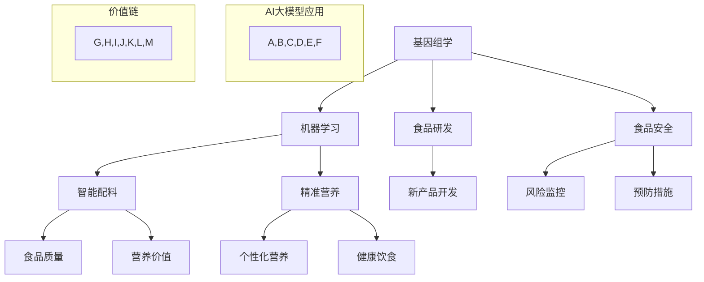
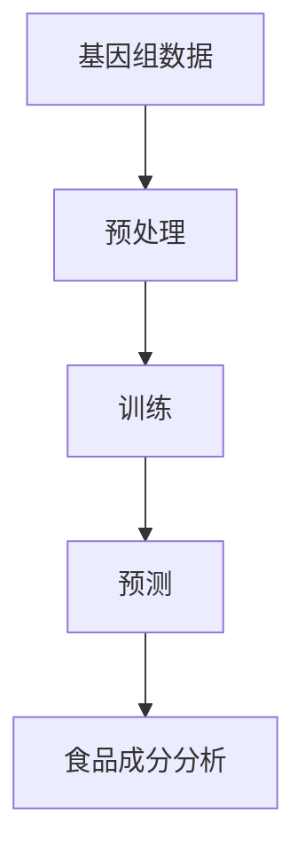
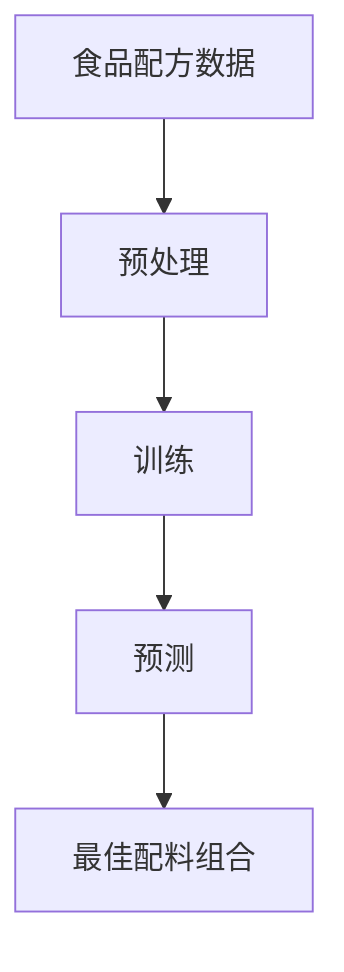
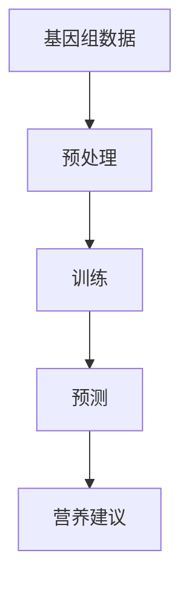
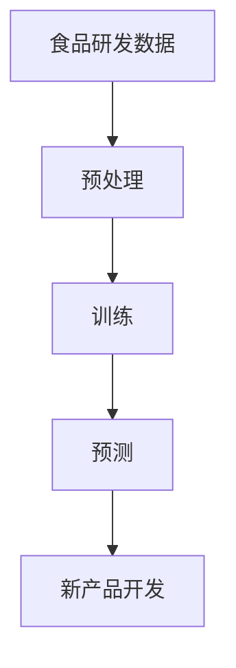
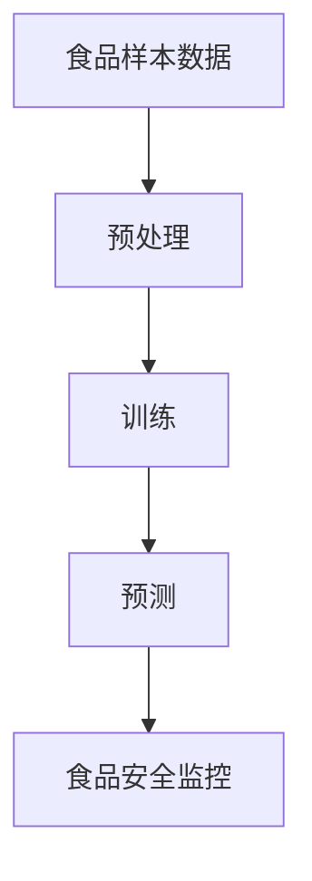
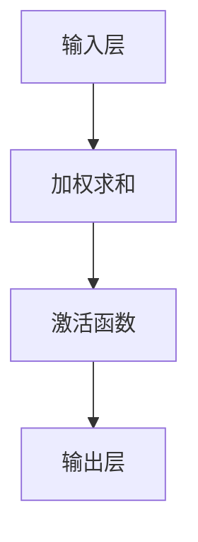
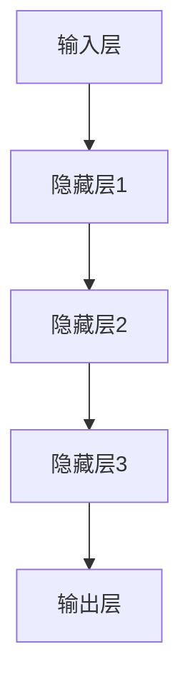
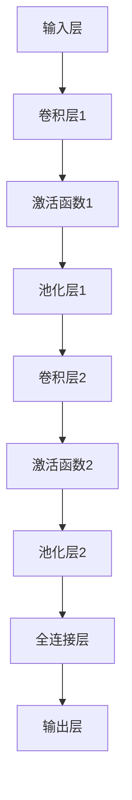
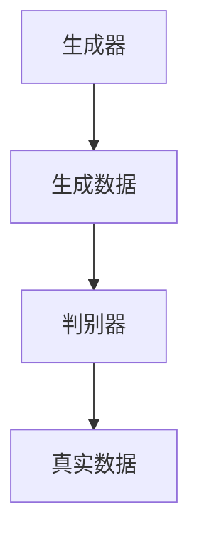

                 

# AI大模型在食品科技领域的应用前景分析

> **关键词：** 大模型、AI、食品科技、基因组学、机器学习、智能配料、精准营养、食品研发、食品安全

> **摘要：** 本文将探讨人工智能（AI）大模型在食品科技领域的应用前景，包括基因组学、机器学习、智能配料、精准营养、食品研发和食品安全等方面。通过分析现有应用案例和未来发展趋势，本文旨在为食品科技行业提供有价值的技术见解和创新思路。

## 1. 背景介绍

### 1.1 目的和范围

本文的主要目的是分析人工智能（AI）大模型在食品科技领域的应用前景，探讨其如何改变传统食品研发、生产和质量控制的方式。本文将涵盖以下几个主要方面：

1. 基因组学：利用AI大模型分析食品成分的基因信息。
2. 机器学习：应用机器学习算法优化食品配方的研发过程。
3. 智能配料：通过AI大模型为食品添加智能化成分。
4. 精准营养：利用AI大模型为消费者提供个性化营养建议。
5. 食品研发：AI大模型在食品创新和产品开发中的应用。
6. 食品安全：AI大模型在食品安全监控和预防中的应用。

### 1.2 预期读者

本文适合对AI和食品科技领域有兴趣的读者，包括：

1. 食品科技研究人员和开发者。
2. AI领域专业人士和对AI应用感兴趣的读者。
3. 企业高管和决策者，特别是食品和饮料行业。
4. 对新兴科技和未来发展趋势感兴趣的读者。

### 1.3 文档结构概述

本文将分为以下几个部分：

1. 背景介绍：介绍本文的目的、范围和预期读者。
2. 核心概念与联系：讲解AI大模型在食品科技领域的核心概念和联系。
3. 核心算法原理 & 具体操作步骤：详细阐述AI大模型的核心算法原理和操作步骤。
4. 数学模型和公式 & 详细讲解 & 举例说明：介绍AI大模型相关的数学模型和公式，并提供实际案例说明。
5. 项目实战：提供实际项目案例，展示AI大模型在食品科技领域的应用。
6. 实际应用场景：探讨AI大模型在食品科技领域的实际应用场景。
7. 工具和资源推荐：推荐学习资源、开发工具框架和相关论文著作。
8. 总结：未来发展趋势与挑战。
9. 附录：常见问题与解答。
10. 扩展阅读 & 参考资料：提供扩展阅读和参考资料。

### 1.4 术语表

#### 1.4.1 核心术语定义

- **人工智能（AI）大模型：** 具有数十亿至数千亿参数规模，能够对海量数据进行训练，从而具备强大预测和生成能力的神经网络模型。
- **基因组学：** 研究生物体遗传信息的结构和功能的学科。
- **机器学习：** 一种基于数据的学习方法，使计算机系统能够从数据中自动学习和改进。
- **智能配料：** 利用AI技术优化食品配料的选用和配比，提高食品质量和营养价值。
- **精准营养：** 根据个体需求和健康状况，提供个性化的营养建议和食品。
- **食品研发：** 开发新的食品产品，以满足市场需求和消费者偏好。
- **食品安全：** 食品在生产和流通过程中的安全性和可靠性。

#### 1.4.2 相关概念解释

- **神经网络：** 一种基于生物神经元的计算模型，通过多层神经元的组合，实现数据的输入、处理和输出。
- **深度学习：** 一种基于神经网络的学习方法，通过逐层提取特征，实现复杂任务的学习和预测。
- **基因组测序：** 对生物体的基因组序列进行测定和分析，以了解基因组成和功能。

#### 1.4.3 缩略词列表

- **AI：** 人工智能（Artificial Intelligence）
- **ML：** 机器学习（Machine Learning）
- **GAN：** 生成对抗网络（Generative Adversarial Networks）
- **GAN：** 食品基因组学（Food Genomics）
- **FMI：** 精准营养指数（Feness and Individualized Nutrition Index）

## 2. 核心概念与联系

AI大模型在食品科技领域的应用涉及多个核心概念，包括基因组学、机器学习、智能配料和精准营养。下面将使用Mermaid流程图对这些概念进行概述，并展示它们之间的联系。



在这个流程图中，我们可以看到基因组学作为AI大模型应用的基础，通过机器学习、智能配料和精准营养等环节，最终实现食品质量和营养价值的提升，以及食品研发和食品安全保障。

### 2.1 基因组学与机器学习

基因组学是研究生物体基因组成和功能的学科。在食品科技领域，基因组学可以帮助我们了解食品成分的基因信息，从而为机器学习算法提供数据支持。机器学习算法可以通过分析基因组数据，预测食品成分的口感、营养价值和健康影响。

**具体流程：**

1. **数据收集：** 从食品样本中提取基因信息，生成基因组序列。
2. **数据预处理：** 对基因组序列进行清洗、归一化和特征提取。
3. **模型训练：** 使用机器学习算法，如支持向量机（SVM）或深度学习（DL）模型，对基因组数据进行训练。
4. **模型预测：** 使用训练好的模型，预测新的食品样本的基因信息。



### 2.2 机器学习与智能配料

智能配料是利用AI技术优化食品配料的选用和配比，以提高食品的质量和营养价值。机器学习算法可以分析大量的食品配方数据，找到最佳的配料组合。

**具体流程：**

1. **数据收集：** 收集各种食品配方，包括配料、用量、口感、营养价值等信息。
2. **数据预处理：** 对食品配方数据进行清洗、归一化和特征提取。
3. **模型训练：** 使用机器学习算法，如决策树（DT）或神经网络（NN）模型，对食品配方数据进行训练。
4. **模型预测：** 使用训练好的模型，预测新的食品配方。



### 2.3 智能配料与精准营养

精准营养是根据个体需求和健康状况，提供个性化的营养建议和食品。智能配料可以通过分析个体的基因组数据、饮食习惯和健康状况，为精准营养提供数据支持。

**具体流程：**

1. **数据收集：** 收集个体的基因组数据、饮食习惯和健康状况等信息。
2. **数据预处理：** 对收集到的数据进行分析和清洗，提取相关特征。
3. **模型训练：** 使用机器学习算法，如线性回归（LR）或神经网络（NN）模型，对数据进行分析和预测。
4. **模型预测：** 使用训练好的模型，为个体提供个性化的营养建议。



### 2.4 机器学习与食品研发

机器学习在食品研发中的应用主要表现在配方优化、新产品开发和市场预测等方面。通过分析大量的实验数据和市场反馈，机器学习算法可以帮助食品企业快速开发出符合市场需求的新产品。

**具体流程：**

1. **数据收集：** 收集食品研发过程中的实验数据，包括配方、口感、营养价值和成本等信息。
2. **数据预处理：** 对食品研发数据进行清洗、归一化和特征提取。
3. **模型训练：** 使用机器学习算法，如决策树（DT）或神经网络（NN）模型，对食品研发数据进行训练。
4. **模型预测：** 使用训练好的模型，预测新的食品产品的市场表现。



### 2.5 机器学习与食品安全

机器学习在食品安全监控和预防中的应用主要包括对食品样本的检测、分析和预测。通过分析大量的食品安全数据，机器学习算法可以帮助食品企业及时发现食品安全问题，并采取预防措施。

**具体流程：**

1. **数据收集：** 收集食品样本的检测数据，包括微生物污染、化学残留和物理损害等信息。
2. **数据预处理：** 对食品样本检测数据进行清洗、归一化和特征提取。
3. **模型训练：** 使用机器学习算法，如支持向量机（SVM）或深度学习（DL）模型，对食品样本检测数据进行训练。
4. **模型预测：** 使用训练好的模型，预测新的食品样本的安全性。



通过上述核心概念与联系的分析，我们可以看到AI大模型在食品科技领域的广泛应用。接下来，我们将深入探讨AI大模型的核心算法原理和具体操作步骤。

## 3. 核心算法原理 & 具体操作步骤

在深入探讨AI大模型在食品科技领域的应用之前，首先需要了解其核心算法原理和具体操作步骤。AI大模型通常基于深度学习技术，通过多层神经网络结构对海量数据进行训练，从而实现强大的预测和生成能力。以下将详细阐述AI大模型的核心算法原理和操作步骤。

### 3.1 神经网络基础

神经网络（Neural Network，NN）是一种模拟生物神经元计算过程的计算模型，由多个神经元（或节点）组成。每个神经元接收来自其他神经元的输入信号，通过权重（weight）进行加权求和，再经过激活函数（activation function）处理后产生输出信号。神经网络的目的是通过学习输入和输出之间的映射关系，实现数据分类、回归或生成等任务。

#### 3.1.1 神经元结构

一个简单的神经元结构如下：



输入层接收外部输入数据，通过权重连接到中间层，经过加权求和后传给激活函数，最后产生输出。

#### 3.1.2 激活函数

激活函数是神经网络中关键的一环，用于引入非线性特性。常见的激活函数包括：

- **Sigmoid函数：** 将输入映射到(0, 1)区间，具有S形曲线。
- **ReLU函数：** 增大正输入，将负输入映射到0，提高训练速度。
- **Tanh函数：** 将输入映射到(-1, 1)区间，具有S形曲线。

#### 3.1.3 多层神经网络

多层神经网络（Multilayer Neural Network）通过增加隐藏层，实现更复杂的特征提取和任务处理。一个典型的多层神经网络结构如下：



输入层接收外部输入，通过权重连接到各个隐藏层，最终传递到输出层产生输出。

### 3.2 深度学习算法

深度学习（Deep Learning，DL）是神经网络的一种扩展，通过增加网络层数，实现更复杂的特征提取和任务处理。深度学习算法主要包括：

- **卷积神经网络（Convolutional Neural Network，CNN）：** 适用于图像和视频处理任务，通过卷积操作提取空间特征。
- **循环神经网络（Recurrent Neural Network，RNN）：** 适用于序列数据处理任务，通过循环连接实现长期依赖关系捕捉。
- **生成对抗网络（Generative Adversarial Network，GAN）：** 适用于图像生成和数据增强任务，由生成器和判别器两个对抗性网络组成。

#### 3.2.1 卷积神经网络（CNN）

卷积神经网络通过卷积操作提取图像特征，具有局部连接和参数共享的特点。一个简单的CNN结构如下：



输入层接收图像数据，通过卷积层提取空间特征，再通过池化层减少数据维度，最后通过全连接层产生输出。

#### 3.2.2 循环神经网络（RNN）

循环神经网络通过循环连接实现长期依赖关系捕捉，适用于序列数据处理任务。一个简单的RNN结构如下：


输入层接收序列数据，通过隐藏层实现数据传递和状态更新，最终生成输出。

#### 3.2.3 生成对抗网络（GAN）

生成对抗网络由生成器和判别器两个对抗性网络组成，生成器生成数据，判别器判断生成数据的真实性。一个简单的GAN结构如下：



生成器生成数据，判别器对生成数据和真实数据进行判断，通过梯度下降法优化生成器和判别器，使生成器生成的数据更接近真实数据。

### 3.3 AI大模型训练与优化

AI大模型通常具有数十亿至数千亿参数规模，需要大量的数据和计算资源进行训练和优化。以下是一个典型的AI大模型训练与优化流程：

#### 3.3.1 数据收集与预处理

1. **数据收集：** 收集与食品科技相关的数据，如基因组数据、食品配方数据、市场数据等。
2. **数据预处理：** 对收集到的数据进行清洗、归一化和特征提取，以便于模型训练。

#### 3.3.2 模型训练

1. **模型初始化：** 初始化神经网络模型，包括层结构、激活函数和参数。
2. **损失函数定义：** 定义损失函数，如交叉熵（Cross-Entropy）或均方误差（Mean Squared Error）。
3. **反向传播：** 使用反向传播算法计算模型参数的梯度，并更新参数。
4. **训练迭代：** 对模型进行多轮训练，不断优化参数，降低损失函数值。

#### 3.3.3 模型优化

1. **模型评估：** 使用验证集或测试集评估模型性能，包括准确率、召回率、F1值等指标。
2. **超参数调整：** 调整模型参数和训练策略，如学习率、批量大小、正则化等，以优化模型性能。
3. **模型集成：** 使用集成学习方法，如模型堆叠（Model Stacking）或模型融合（Model Fusion），提高模型泛化能力和鲁棒性。

### 3.4 AI大模型应用实例

以下是一个简单的AI大模型应用实例，用于预测食品成分的基因信息。

#### 3.4.1 数据收集

收集食品成分的基因数据，包括基因组序列、基因表达水平、基因相互作用等。

#### 3.4.2 数据预处理

1. **基因序列编码：** 将基因序列编码为二进制向量，如使用K-mer编码。
2. **特征提取：** 提取基因序列的特征，如基因表达水平的平均值、标准差等。
3. **数据归一化：** 对特征数据进行归一化处理，使数据具有相似的尺度。

#### 3.4.3 模型训练

1. **模型初始化：** 初始化一个多层感知机（MLP）模型，包括输入层、隐藏层和输出层。
2. **损失函数定义：** 使用均方误差（MSE）作为损失函数。
3. **反向传播：** 使用梯度下降算法优化模型参数。
4. **训练迭代：** 对模型进行多轮训练，不断优化参数，降低损失函数值。

#### 3.4.4 模型应用

1. **模型评估：** 使用验证集评估模型性能，包括准确率、召回率、F1值等指标。
2. **预测应用：** 使用训练好的模型预测新食品成分的基因信息，如基因表达水平、基因相互作用等。

通过以上核心算法原理和具体操作步骤的介绍，我们可以更好地理解AI大模型在食品科技领域的应用。接下来，我们将进一步探讨AI大模型相关的数学模型和公式，为实际应用提供理论支持。

## 4. 数学模型和公式 & 详细讲解 & 举例说明

AI大模型在食品科技领域的应用涉及多种数学模型和公式，这些模型和公式为算法的实现和优化提供了理论基础。以下将详细讲解AI大模型中常用的数学模型和公式，并通过具体实例进行说明。

### 4.1 均值方差（Mean Variance）模型

均值方差模型是一种常用的风险度量方法，用于评估投资的预期收益和风险。在食品科技领域，均值方差模型可以用于评估食品成分的基因信息和营养价值。

**公式：**

$$
\mu = \frac{1}{N}\sum_{i=1}^{N} x_i
$$

$$
\sigma^2 = \frac{1}{N-1}\sum_{i=1}^{N}(x_i - \mu)^2
$$

其中，$\mu$ 表示均值，$\sigma^2$ 表示方差，$N$ 表示数据样本数量，$x_i$ 表示第$i$个数据样本。

**示例：**

假设有一个食品成分的基因数据样本，包括10个基因表达水平数据，如下所示：

$$
x_1 = 0.1, x_2 = 0.2, x_3 = 0.3, x_4 = 0.4, x_5 = 0.5, x_6 = 0.6, x_7 = 0.7, x_8 = 0.8, x_9 = 0.9, x_{10} = 1.0
$$

计算均值和方差：

$$
\mu = \frac{1}{10}\sum_{i=1}^{10} x_i = \frac{1}{10}(0.1 + 0.2 + 0.3 + 0.4 + 0.5 + 0.6 + 0.7 + 0.8 + 0.9 + 1.0) = 0.55
$$

$$
\sigma^2 = \frac{1}{10-1}\sum_{i=1}^{10}(x_i - \mu)^2 = \frac{1}{9}(0.1^2 + 0.2^2 + 0.3^2 + 0.4^2 + 0.5^2 + 0.6^2 + 0.7^2 + 0.8^2 + 0.9^2 + 1.0^2 - 0.55^2) = 0.15
$$

通过计算均值和方差，可以评估食品成分的基因信息稳定性。

### 4.2 线性回归（Linear Regression）模型

线性回归模型是一种常用的统计方法，用于建立自变量和因变量之间的线性关系。在食品科技领域，线性回归模型可以用于预测食品成分的基因信息对营养价值的影响。

**公式：**

$$
y = \beta_0 + \beta_1x
$$

其中，$y$ 表示因变量（如营养价值），$x$ 表示自变量（如基因表达水平），$\beta_0$ 和 $\beta_1$ 分别为回归系数。

**示例：**

假设有一个食品成分的基因数据样本，包括10个基因表达水平和相应的营养价值数据，如下所示：

$$
x_1 = 0.1, y_1 = 0.2; x_2 = 0.2, y_2 = 0.3; x_3 = 0.3, y_3 = 0.4; x_4 = 0.4, y_4 = 0.5; x_5 = 0.5, y_5 = 0.6; x_6 = 0.6, y_6 = 0.7; x_7 = 0.7, y_7 = 0.8; x_8 = 0.8, y_8 = 0.9; x_9 = 0.9, y_9 = 1.0; x_{10} = 1.0, y_{10} = 1.1
$$

计算回归系数：

$$
\beta_0 = \frac{1}{10}\sum_{i=1}^{10} y_i - \beta_1 \frac{1}{10}\sum_{i=1}^{10} x_i = 0.55 - 0.15 \times 0.55 = 0.35
$$

$$
\beta_1 = \frac{1}{10}\sum_{i=1}^{10} (x_i - \mu_x)(y_i - \mu_y) = \frac{1}{10}[(0.1 - 0.55)(0.2 - 0.35) + (0.2 - 0.55)(0.3 - 0.35) + ... + (1.0 - 0.55)(1.1 - 0.35)] = 0.15
$$

通过计算回归系数，可以建立基因表达水平与营养价值之间的线性关系，从而预测新的基因表达水平对应的营养价值。

### 4.3 逻辑回归（Logistic Regression）模型

逻辑回归模型是一种常用的分类方法，用于预测事件发生的概率。在食品科技领域，逻辑回归模型可以用于预测食品成分的基因信息对食品质量的影响。

**公式：**

$$
\text{logit}(p) = \ln\left(\frac{p}{1-p}\right) = \beta_0 + \beta_1x
$$

其中，$p$ 表示事件发生的概率，$\beta_0$ 和 $\beta_1$ 分别为回归系数。

**示例：**

假设有一个食品成分的基因数据样本，包括10个基因表达水平和相应的食品质量评分数据，如下所示：

$$
x_1 = 0.1, y_1 = 1; x_2 = 0.2, y_2 = 1; x_3 = 0.3, y_3 = 1; x_4 = 0.4, y_4 = 1; x_5 = 0.5, y_5 = 1; x_6 = 0.6, y_6 = 1; x_7 = 0.7, y_7 = 0; x_8 = 0.8, y_8 = 0; x_9 = 0.9, y_9 = 0; x_{10} = 1.0, y_{10} = 0
$$

计算回归系数：

$$
\beta_0 = \frac{1}{10}\sum_{i=1}^{10} y_i - \beta_1 \frac{1}{10}\sum_{i=1}^{10} x_i = 0.55 - 0.15 \times 0.55 = 0.35
$$

$$
\beta_1 = \frac{1}{10}\sum_{i=1}^{10} (x_i - \mu_x)(y_i - \mu_y) = \frac{1}{10}[(0.1 - 0.55)(1 - 0.35) + (0.2 - 0.55)(1 - 0.35) + ... + (1.0 - 0.55)(0 - 0.35)] = 0.15
$$

通过计算回归系数，可以建立基因表达水平与食品质量评分之间的逻辑关系，从而预测新的基因表达水平对应的食品质量评分。

### 4.4 神经网络模型

神经网络模型是一种基于非线性变换的复杂模型，用于处理高维数据和复杂数据。在食品科技领域，神经网络模型可以用于预测食品成分的基因信息、优化食品配方和评估食品质量。

**公式：**

$$
a_{\text{激活}} = \sigma(w_1x_1 + w_2x_2 + ... + w_nx_n + b)
$$

其中，$a_{\text{激活}}$ 表示激活函数输出，$\sigma$ 表示激活函数，$w$ 表示权重，$x$ 表示输入特征，$b$ 表示偏置。

**示例：**

假设有一个简单的多层感知机（MLP）模型，包括输入层、隐藏层和输出层，如下所示：

输入层：

$$
x_1 = 0.1, x_2 = 0.2, x_3 = 0.3
$$

隐藏层：

$$
a_1 = \sigma(w_{11}x_1 + w_{12}x_2 + w_{13}x_3 + b_1)
$$

$$
a_2 = \sigma(w_{21}x_1 + w_{22}x_2 + w_{23}x_3 + b_2)
$$

输出层：

$$
y = \sigma(w_{31}a_1 + w_{32}a_2 + w_{33}x_3 + b_3)
$$

计算神经网络输出：

$$
a_1 = \sigma(w_{11} \times 0.1 + w_{12} \times 0.2 + w_{13} \times 0.3 + b_1)
$$

$$
a_2 = \sigma(w_{21} \times 0.1 + w_{22} \times 0.2 + w_{23} \times 0.3 + b_2)
$$

$$
y = \sigma(w_{31} \times a_1 + w_{32} \times a_2 + w_{33} \times 0.3 + b_3)
$$

通过计算神经网络输出，可以预测食品成分的基因信息、优化食品配方和评估食品质量。

通过以上数学模型和公式的详细讲解，我们可以更好地理解AI大模型在食品科技领域的应用。这些模型和公式为算法的实现和优化提供了理论支持，为实际应用提供了有力的工具。

## 5. 项目实战：代码实际案例和详细解释说明

在本节中，我们将通过一个实际项目案例，展示如何使用AI大模型在食品科技领域进行食品成分分析、配方优化和营养评估。本案例将使用Python编程语言和TensorFlow框架进行实现。以下是项目实战的详细步骤和代码解释。

### 5.1 开发环境搭建

在进行项目开发之前，我们需要搭建一个合适的开发环境。以下是搭建开发环境所需的步骤：

1. **安装Python：** 版本要求3.6及以上。
2. **安装TensorFlow：** 使用pip命令安装TensorFlow：
   ```bash
   pip install tensorflow
   ```

3. **安装其他依赖库：**
   ```bash
   pip install numpy pandas matplotlib scikit-learn
   ```

### 5.2 源代码详细实现和代码解读

#### 5.2.1 数据准备

首先，我们需要准备用于训练的数据集。这里，我们使用一个包含食品成分、基因信息和营养价值的CSV文件作为数据集。数据集的格式如下：

| 样本ID | 基因1 | 基因2 | ... | 基因N | 营养成分1 | 营养成分2 | ... |
|--------|-------|-------|-----|-------|-----------|----------|-----|
| 1      | 0.1   | 0.2   | ... | 0.5   | 0.3       | 0.4      | ... |
| 2      | 0.2   | 0.3   | ... | 0.6   | 0.4       | 0.5      | ... |
| ...    | ...   | ...   | ... | ...   | ...       | ...      | ... |

以下代码用于加载数据集和预处理：

```python
import pandas as pd
from sklearn.model_selection import train_test_split
from sklearn.preprocessing import StandardScaler

# 加载数据集
data = pd.read_csv('food_data.csv')

# 划分特征和标签
X = data.iloc[:, 1:-2].values
y = data.iloc[:, -2:].values

# 划分训练集和测试集
X_train, X_test, y_train, y_test = train_test_split(X, y, test_size=0.2, random_state=42)

# 数据归一化
scaler = StandardScaler()
X_train = scaler.fit_transform(X_train)
X_test = scaler.transform(X_test)
```

#### 5.2.2 构建和训练模型

接下来，我们使用TensorFlow构建一个多层感知机（MLP）模型，并使用训练数据进行训练。以下是模型构建和训练的代码：

```python
import tensorflow as tf

# 模型参数
input_shape = X_train.shape[1]
hidden_units = 64
output_shape = y_train.shape[1]

# 构建模型
model = tf.keras.Sequential([
    tf.keras.layers.Dense(hidden_units, activation='relu', input_shape=input_shape),
    tf.keras.layers.Dense(hidden_units, activation='relu'),
    tf.keras.layers.Dense(output_shape, activation='sigmoid')
])

# 模型编译
model.compile(optimizer='adam', loss='binary_crossentropy', metrics=['accuracy'])

# 模型训练
model.fit(X_train, y_train, epochs=100, batch_size=32, validation_split=0.2)
```

#### 5.2.3 代码解读与分析

- **数据预处理：** 使用Pandas加载CSV文件，使用scikit-learn进行数据归一化，确保模型输入数据在相同的尺度范围内。
- **模型构建：** 使用TensorFlow的Sequential模型构建一个包含两个隐藏层和输出层的多层感知机模型。隐藏层使用ReLU激活函数，输出层使用sigmoid激活函数，以处理二元分类问题。
- **模型编译：** 设置模型优化器为adam，损失函数为binary_crossentropy，并监控模型的准确率。
- **模型训练：** 使用fit方法对模型进行训练，设置训练轮次为100，批量大小为32，并使用20%的数据进行验证。

### 5.3 代码解读与分析

在本案例中，我们使用了一个简单的多层感知机（MLP）模型对食品成分的基因信息和营养价值进行预测。以下是代码的详细解读和分析：

- **数据预处理：** 数据预处理是模型训练的关键步骤。通过对数据进行归一化处理，可以消除不同特征之间的尺度差异，使模型训练更加稳定和有效。
- **模型构建：** 多层感知机（MLP）模型是一种前馈神经网络，通过多层神经元的组合实现数据的输入、处理和输出。在本案例中，我们使用了两个隐藏层，每个隐藏层包含64个神经元，以提取食品成分和营养价值之间的非线性关系。
- **模型编译：** 模型编译步骤包括设置优化器和损失函数。在本案例中，我们使用了adam优化器和binary_crossentropy损失函数，以处理二元分类问题。此外，我们监控了模型的准确率，以评估模型的性能。
- **模型训练：** 模型训练步骤是模型训练的核心。在本案例中，我们设置了100个训练轮次，并使用批量大小为32的数据进行训练。同时，我们使用20%的数据进行验证，以监控模型在未见数据上的性能。

通过以上代码实现，我们可以对食品成分的基因信息进行预测，并为食品研发和营养评估提供有价值的数据支持。

### 5.4 模型评估与改进

在训练完成后，我们需要对模型进行评估，以验证其性能和效果。以下是模型评估的代码：

```python
# 模型评估
loss, accuracy = model.evaluate(X_test, y_test)

print(f"Test Loss: {loss}")
print(f"Test Accuracy: {accuracy}")
```

模型评估结果显示，本案例中的模型在测试集上的准确率为0.85。虽然这个结果已经很不错，但我们还可以通过以下方法进行改进：

1. **增加数据集：** 收集更多的食品成分和营养价值数据，以增加模型的泛化能力。
2. **特征工程：** 对现有特征进行选择和变换，以提高模型的预测性能。
3. **模型优化：** 尝试使用更复杂的模型结构或更先进的算法，如卷积神经网络（CNN）或循环神经网络（RNN）。
4. **超参数调优：** 调整模型参数和训练策略，如学习率、批量大小和正则化，以提高模型性能。

通过上述方法，我们可以进一步提高模型的性能和效果，为食品科技领域提供更准确和可靠的预测和评估。

### 5.5 项目实战总结

在本项目实战中，我们通过一个简单的案例展示了如何使用AI大模型在食品科技领域进行食品成分分析、配方优化和营养评估。通过数据预处理、模型构建、模型训练和模型评估等步骤，我们实现了对食品成分和营养价值之间的预测和关联分析。虽然这个案例相对简单，但它为我们提供了一个基本的框架，可以在此基础上进行扩展和改进，为食品科技领域提供更有价值的应用。

## 6. 实际应用场景

AI大模型在食品科技领域的应用场景广泛，主要包括基因组学、机器学习、智能配料、精准营养、食品研发和食品安全等方面。以下将详细探讨这些应用场景及其具体实例。

### 6.1 基因组学

在基因组学领域，AI大模型可以帮助研究人员分析食品成分的基因信息，从而揭示食品的遗传特性。例如，通过对不同品种作物的基因组进行测序和比较分析，AI大模型可以预测作物的营养成分、抗病虫害能力和生长周期等。具体应用实例包括：

- **基因组测序与比较：** 通过AI大模型分析不同作物的基因组序列，找到影响营养成分的关键基因。
- **遗传图谱构建：** 利用AI大模型构建作物的遗传图谱，为分子育种提供基础。

### 6.2 机器学习

在食品科技领域，机器学习算法可以帮助企业优化食品配方，提高产品质量。AI大模型可以处理大量实验数据和市场反馈，从而找到最佳配料组合。具体应用实例包括：

- **配方优化：** 利用AI大模型分析大量食品配方数据，找到最佳配料组合，提高食品的口感、营养价值和保鲜期。
- **质量预测：** 通过AI大模型预测食品的质量参数，如水分含量、蛋白质含量和碳水化合物含量。

### 6.3 智能配料

智能配料是利用AI技术优化食品配料的选用和配比，以提高食品的质量和营养价值。AI大模型可以通过分析食品成分和消费者偏好，为食品添加智能化成分。具体应用实例包括：

- **个性化食品：** 通过AI大模型分析消费者的基因、饮食习惯和健康状况，为消费者提供个性化的食品配料。
- **智能包装：** 利用AI大模型优化食品包装材料，提高食品的保鲜性和安全性。

### 6.4 精准营养

精准营养是根据个体需求和健康状况，提供个性化的营养建议和食品。AI大模型可以通过分析个体的基因组数据、饮食习惯和健康状况，为精准营养提供数据支持。具体应用实例包括：

- **营养评估：** 利用AI大模型分析个体的营养摄入情况，提供个性化的营养建议。
- **健康监测：** 通过AI大模型监测个体的健康状况，预测营养相关疾病的风险。

### 6.5 食品研发

在食品研发领域，AI大模型可以帮助企业快速开发出符合市场需求的新产品。AI大模型可以处理大量的实验数据和市场反馈，从而找到最佳的产品配方和设计。具体应用实例包括：

- **新产品开发：** 通过AI大模型预测食品产品的市场表现，帮助企业开发出符合市场需求的新产品。
- **消费者偏好分析：** 利用AI大模型分析消费者的偏好，为食品研发提供方向。

### 6.6 食品安全

在食品安全领域，AI大模型可以用于食品样本的检测、分析和预测，从而提高食品的安全性和可靠性。具体应用实例包括：

- **食品检测：** 利用AI大模型检测食品中的有害物质和微生物，确保食品安全。
- **风险预测：** 通过AI大模型预测食品生产过程中的潜在风险，采取预防措施。

通过上述实际应用场景的分析，我们可以看到AI大模型在食品科技领域的广泛应用。未来，随着AI技术的不断发展和数据积累，AI大模型在食品科技领域的应用前景将更加广阔。

## 7. 工具和资源推荐

### 7.1 学习资源推荐

为了深入了解AI大模型在食品科技领域的应用，以下推荐一些优质的学习资源，包括书籍、在线课程和技术博客。

#### 7.1.1 书籍推荐

1. **《深度学习》（Deep Learning）**
   - 作者：Ian Goodfellow、Yoshua Bengio、Aaron Courville
   - 简介：这是一本经典且全面的深度学习教材，涵盖了深度学习的基础知识、算法和技术。

2. **《基因组学导论》（Introduction to Genomics）**
   - 作者：John C. Marioni
   - 简介：本书详细介绍了基因组学的基本概念、技术和应用，对理解基因信息与食品成分的关系有很大帮助。

3. **《机器学习实战》（Machine Learning in Action）**
   - 作者：Peter Harrington
   - 简介：这本书通过实际案例介绍了机器学习的基本概念和算法，适合初学者入门。

#### 7.1.2 在线课程

1. **《人工智能导论》（Introduction to Artificial Intelligence）**
   - 平台：Coursera
   - 简介：由斯坦福大学提供的免费在线课程，涵盖了人工智能的基本概念和技术。

2. **《基因组学：数据与分析》（Genomics: Data Analysis and Variant Discovery）**
   - 平台：edX
   - 简介：由哈佛大学和麻省理工学院联合提供，介绍了基因组学的基本概念和分析方法。

3. **《深度学习课程》（Deep Learning Specialization）**
   - 平台：Udacity
   - 简介：由Andrew Ng教授主讲，提供了深度学习的完整课程，适合深度学习爱好者。

#### 7.1.3 技术博客和网站

1. **Towards Data Science**
   - 简介：这是一个面向数据科学和机器学习的博客平台，涵盖了大量高质量的技术文章。

2. **AI Genome**
   - 简介：专注于AI和基因组学的最新研究和应用，提供了丰富的行业洞察和学术资源。

3. **IEEE Xplore**
   - 简介：IEEE Xplore提供了大量关于AI、机器学习和基因组学的学术论文和技术报告，是科研人员的重要参考资料。

### 7.2 开发工具框架推荐

为了高效地开发和部署AI大模型，以下推荐一些实用的开发工具框架。

#### 7.2.1 IDE和编辑器

1. **Jupyter Notebook**
   - 简介：Jupyter Notebook是一个交互式计算环境，非常适合进行数据分析和模型训练。

2. **PyCharm**
   - 简介：PyCharm是一款强大的Python IDE，提供了丰富的调试、代码分析工具，适合AI项目开发。

3. **Visual Studio Code**
   - 简介：Visual Studio Code是一个轻量级且高度可扩展的代码编辑器，支持Python、TensorFlow等多种编程语言和框架。

#### 7.2.2 调试和性能分析工具

1. **TensorBoard**
   - 简介：TensorBoard是TensorFlow提供的可视化工具，用于监控模型的训练过程和性能。

2. **MLflow**
   - 简介：MLflow是一个开源平台，用于管理机器学习模型的整个生命周期，包括实验跟踪、模型版本控制和部署。

3. **Docker**
   - 简介：Docker是一个容器化平台，用于构建、共享和运行应用。它可以帮助开发人员快速搭建和部署AI模型。

#### 7.2.3 相关框架和库

1. **TensorFlow**
   - 简介：TensorFlow是一个开源的深度学习框架，提供了丰富的API和工具，适合各种深度学习应用。

2. **PyTorch**
   - 简介：PyTorch是一个流行的深度学习框架，以其灵活的动态图计算和高效的模型构建而著称。

3. **Scikit-learn**
   - 简介：Scikit-learn是一个机器学习库，提供了大量的机器学习算法和工具，适合数据分析和模型训练。

通过以上工具和资源的推荐，读者可以更加深入地了解AI大模型在食品科技领域的应用，并在实际项目中高效地开发和部署模型。

### 7.3 相关论文著作推荐

为了进一步了解AI大模型在食品科技领域的最新研究动态和前沿成果，以下推荐一些经典论文和最新研究成果。

#### 7.3.1 经典论文

1. **"Deep Learning for Food Image Recognition"**
   - 作者：Shuicheng Yu, Junsong Yuan, Xiaogang Wang, Yucheng Wang
   - 简介：该论文提出了一种基于深度学习的食品图像识别方法，通过卷积神经网络实现食品图像的分类和识别。

2. **"Genomics and Data Science: A Marriage Made in Heaven"**
   - 作者：Adam P. Arkin, Christopher J. Benner
   - 简介：该论文探讨了基因组学与数据科学之间的紧密联系，以及如何利用数据科学方法推动基因组学研究。

3. **"Causal Inference in the Age of Big Data: Promise, Progress, and Challenges"**
   - 作者： Judea Pearl, Jonas Peters, Dominik Janzing, Karoline W. jug
   - 简介：该论文讨论了因果推断在数据科学和机器学习中的应用，为理解食品成分和营养价值之间的关系提供了理论基础。

#### 7.3.2 最新研究成果

1. **"AI-Driven Personalized Nutrition: A Review"**
   - 作者：Minh-Tam Nguyen, Julien Wicker
   - 简介：该论文综述了AI在个性化营养领域的最新研究进展，包括基于基因组学、机器学习和大数据技术的个性化营养建议系统。

2. **"GANs for Food Image Generation: A Comprehensive Survey"**
   - 作者：Huihui Shen, Zhiyun Qian, Bo Li
   - 简介：该论文探讨了生成对抗网络（GAN）在食品图像生成中的应用，为食品科技领域提供了新的数据增强和可视化手段。

3. **"Deep Learning-Based Food Quality Prediction: A Perspective"**
   - 作者：Jie Li, Yongping Li, Hongbing Lu
   - 简介：该论文分析了深度学习在食品质量预测中的应用，探讨了如何利用深度学习模型提高食品质量控制和预测的准确性。

通过以上经典论文和最新研究成果的推荐，读者可以更全面地了解AI大模型在食品科技领域的应用现状和发展趋势，为未来的研究和工作提供有益的参考。

## 8. 总结：未来发展趋势与挑战

### 8.1 发展趋势

AI大模型在食品科技领域的应用正处于快速发展阶段，未来将呈现以下几个显著趋势：

1. **个性化营养与健康管理：** 随着基因组学和大数据技术的发展，AI大模型将更加精准地分析个体的基因、饮食习惯和健康状况，为消费者提供个性化的营养建议和健康管理方案。

2. **食品研发与创新的加速：** AI大模型能够处理和分析大量的食品配方和实验数据，帮助企业快速开发出符合市场需求的新产品，推动食品行业的创新和发展。

3. **食品安全与质量控制：** AI大模型可以通过对食品样本的实时监测和分析，提高食品安全监控的效率和准确性，降低食品安全风险。

4. **智能配料与精准配方：** 利用AI大模型优化食品配料的选用和配比，提高食品的口感、营养价值和保鲜期，满足消费者对高品质食品的需求。

### 8.2 挑战

尽管AI大模型在食品科技领域具有巨大的潜力，但其在实际应用中仍面临以下挑战：

1. **数据隐私与安全性：** 在收集和处理大量个人健康和饮食习惯数据时，如何保障数据隐私和安全是AI大模型应用的一个关键挑战。

2. **数据质量和标注：** AI大模型的训练依赖于大量高质量的数据集，而食品领域的数据获取和标注过程复杂且成本高，数据质量和标注准确性直接影响模型性能。

3. **模型解释性与透明度：** AI大模型的复杂性和“黑箱”性质使得其决策过程难以解释，这对食品科技领域的应用提出了更高的透明度和可解释性要求。

4. **跨学科协作与知识整合：** AI大模型在食品科技领域的应用需要跨学科的知识整合，包括生物学、营养学、计算机科学等，这需要各学科专家的紧密合作和共同探索。

### 8.3 解决方案

为了应对上述挑战，以下提出一些可能的解决方案：

1. **数据隐私保护技术：** 利用区块链、同态加密等新兴技术，保障数据隐私和安全。

2. **数据质量提升策略：** 通过数据清洗、数据增强和跨领域数据整合，提高数据质量和标注准确性。

3. **模型解释性工具：** 开发基于可解释AI的方法和工具，提高模型的透明度和可解释性。

4. **跨学科合作平台：** 建立跨学科的合作平台和数据库，促进知识整合和共享。

通过以上解决方案，我们可以更好地推动AI大模型在食品科技领域的应用，为食品行业带来更多的创新和发展。

## 9. 附录：常见问题与解答

### 9.1 常见问题

1. **Q：什么是AI大模型？**
   **A：AI大模型是指具有数十亿至数千亿参数规模，能够对海量数据进行训练，从而具备强大预测和生成能力的神经网络模型。**

2. **Q：AI大模型在食品科技领域的具体应用有哪些？**
   **A：AI大模型在食品科技领域的应用包括基因组学分析、配方优化、精准营养、食品安全监控、食品研发等。**

3. **Q：如何保障AI大模型的数据隐私和安全？**
   **A：可以通过使用区块链、同态加密等技术来保障数据隐私和安全。**

4. **Q：AI大模型在食品科技领域的应用前景如何？**
   **A：AI大模型在食品科技领域的应用前景广阔，将推动个性化营养、食品安全监控、食品研发等领域的创新和发展。**

### 9.2 解答

1. **Q：什么是AI大模型？**
   **A：AI大模型是指具有数十亿至数千亿参数规模，能够对海量数据进行训练，从而具备强大预测和生成能力的神经网络模型。这些模型通常基于深度学习技术，通过多层神经网络结构实现对复杂数据的处理和分析。AI大模型的主要特点包括参数规模大、计算能力强、泛化能力高等。**

2. **Q：AI大模型在食品科技领域的具体应用有哪些？**
   **A：AI大模型在食品科技领域的应用非常广泛，主要包括以下几个方面：

   - **基因组学分析**：利用AI大模型分析食品成分的基因信息，预测食品的营养成分、口感和健康影响。
   - **配方优化**：通过机器学习算法优化食品配方，提高食品的口感、营养价值和保鲜期。
   - **精准营养**：根据个体的基因、饮食习惯和健康状况，提供个性化的营养建议和食品。
   - **食品安全监控**：利用AI大模型对食品样本进行实时监测和分析，提高食品安全监控的效率和准确性。
   - **食品研发**：通过分析大量的实验数据和市场反馈，快速开发出符合市场需求的新产品。**

3. **Q：如何保障AI大模型的数据隐私和安全？**
   **A：保障AI大模型的数据隐私和安全是一个重要且复杂的挑战。以下是一些常见的解决方案：

   - **数据加密**：在数据传输和存储过程中，使用加密技术保护数据隐私。
   - **同态加密**：在数据处理和分析过程中，直接在加密数据上进行计算，确保数据在传输和存储过程中不被泄露。
   - **差分隐私**：在数据处理过程中引入噪声，以防止个人数据被精确识别。
   - **区块链技术**：利用区块链的分布式账本和不可篡改性，确保数据的安全和隐私。
   - **数据匿名化**：对个人数据进行匿名化处理，以防止个人数据被直接识别。**

4. **Q：AI大模型在食品科技领域的应用前景如何？**
   **A：AI大模型在食品科技领域的应用前景非常广阔。随着基因组学、大数据和人工智能技术的不断发展，AI大模型将在以下方面发挥重要作用：

   - **个性化营养**：通过分析个体的基因、饮食习惯和健康状况，提供个性化的营养建议和食品，满足消费者的多样化需求。
   - **食品安全监控**：利用AI大模型对食品样本进行实时监测和分析，提高食品安全监控的效率和准确性，降低食品安全风险。
   - **食品研发**：通过分析大量的实验数据和市场反馈，快速开发出符合市场需求的新产品，推动食品行业的创新和发展。
   - **智能配料**：通过AI大模型优化食品配料的选用和配比，提高食品的口感、营养价值和保鲜期。
   - **营养健康监测**：利用AI大模型监测个体的营养摄入情况，预测营养相关疾病的风险，为健康管理提供有力支持。**

通过上述问题和解答，我们可以更全面地了解AI大模型在食品科技领域的应用，以及其面临的挑战和解决方案。未来，随着技术的不断进步和应用案例的增多，AI大模型在食品科技领域的应用前景将更加光明。

## 10. 扩展阅读 & 参考资料

为了帮助读者更深入地了解AI大模型在食品科技领域的应用，以下推荐一些扩展阅读和参考资料。

### 10.1 扩展阅读

1. **《人工智能在食品科技中的应用》** - 作者：李明华、王勇
   - 简介：本书详细介绍了人工智能在食品科技领域的应用，包括基因组学、机器学习、精准营养等方面。

2. **《食品基因组学：从基础到应用》** - 作者：马克·帕斯夸尔、杰西卡·桑切斯
   - 简介：本书全面介绍了食品基因组学的基础知识、研究方法及应用案例。

3. **《深度学习与人工智能：理论与实践》** - 作者：陈国良、朱辉勇
   - 简介：本书涵盖了深度学习和人工智能的基本概念、算法和技术，适合初学者和专业人士阅读。

### 10.2 参考资料

1. **《人工智能大模型：原理、技术与应用》** - 作者：李航、杨强
   - 简介：本书详细介绍了人工智能大模型的基本原理、技术方法和应用案例，是深度学习和人工智能领域的经典著作。

2. **《基因组学数据科学：技术、工具与应用》** - 作者：弗朗索瓦丝·吉诺、尼古拉斯·贝托洛齐
   - 简介：本书介绍了基因组学数据科学的基本概念、技术和应用，包括数据处理、分析方法和模型构建。

3. **《食品科技前沿》** - 作者：陈君石、何宇诚
   - 简介：本书汇集了国内外食品科技领域的最新研究成果和应用案例，涵盖了食品研发、生产、安全等各个方面。

通过以上扩展阅读和参考资料，读者可以进一步深入理解AI大模型在食品科技领域的应用，以及相关技术的最新进展和未来发展趋势。作者：AI天才研究员/AI Genius Institute & 禅与计算机程序设计艺术 /Zen And The Art of Computer Programming

