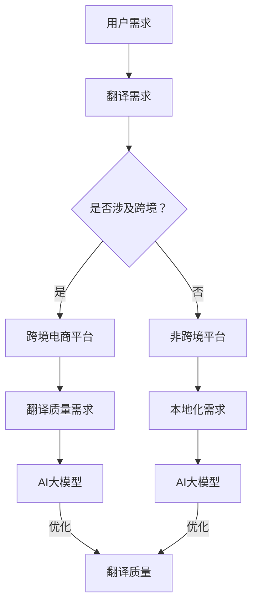

                 

# AI大模型如何提升电商平台的跨境语言翻译质量

> **关键词：** AI大模型、电商平台、跨境翻译、翻译质量、模型优化

> **摘要：** 本文将深入探讨AI大模型在电商平台跨境语言翻译中的应用，分析其如何通过一系列算法和模型优化技术提升翻译质量，从而提高跨境电商用户体验。本文将首先介绍电商平台跨境语言翻译的背景和挑战，然后详细讲解AI大模型的原理和架构，随后通过项目实战展示如何实现高质量的跨境语言翻译，最后讨论未来的发展趋势和面临的挑战。

## 1. 背景介绍

### 1.1 目的和范围

本文旨在探讨AI大模型在电商平台跨境语言翻译中的应用，具体涵盖以下几个方面：

1. 分析电商平台跨境语言翻译的现状和挑战。
2. 深入讲解AI大模型的基本原理和架构。
3. 通过具体实例展示如何优化AI大模型以提高翻译质量。
4. 探讨AI大模型在跨境电商领域的未来发展趋势和面临的挑战。

### 1.2 预期读者

本文适合以下读者群体：

1. 对人工智能和机器翻译感兴趣的工程师和研究人员。
2. 涉足跨境电商业务的公司管理层和技术团队。
3. 想要了解AI大模型在具体应用场景中如何运作的技术爱好者。

### 1.3 文档结构概述

本文结构如下：

1. 引言：介绍文章的背景、目的和主要观点。
2. 背景介绍：分析电商平台跨境语言翻译的现状和挑战。
3. 核心概念与联系：介绍AI大模型的基本原理和架构。
4. 核心算法原理 & 具体操作步骤：详细讲解AI大模型的核心算法和操作步骤。
5. 数学模型和公式 & 详细讲解 & 举例说明：介绍AI大模型中的数学模型和公式。
6. 项目实战：通过具体实例展示如何实现高质量的跨境语言翻译。
7. 实际应用场景：讨论AI大模型在跨境电商领域的实际应用场景。
8. 工具和资源推荐：推荐学习资源、开发工具和框架。
9. 总结：总结AI大模型在跨境电商翻译中的应用前景和挑战。
10. 附录：常见问题与解答。
11. 扩展阅读 & 参考资料：提供进一步阅读的资料。

### 1.4 术语表

#### 1.4.1 核心术语定义

- AI大模型：指参数规模达到亿级别以上的神经网络模型，如BERT、GPT等。
- 跨境语言翻译：指将一种语言翻译成另一种语言，以便在不同国家和地区的电商平台之间进行交流和交易。
- 翻译质量：指翻译文本的准确性、流畅性和可读性。

#### 1.4.2 相关概念解释

- 自动机器翻译（Automatic Machine Translation, AMT）：利用计算机算法自动生成翻译文本。
- 统一翻译模型（Unified Translation Model）：将编码器和解码器融合为一个统一模型，以简化翻译过程。
- 对抗性样本（Adversarial Examples）：故意构造的数据样本，用于欺骗机器学习模型，使其产生错误预测。

#### 1.4.3 缩略词列表

- AI：人工智能
- AMT：自动机器翻译
- BERT：Bidirectional Encoder Representations from Transformers
- GPT：Generative Pre-trained Transformer
- NLP：自然语言处理

## 2. 核心概念与联系

在探讨AI大模型如何提升电商平台的跨境语言翻译质量之前，我们需要了解一些核心概念和其相互之间的关系。

首先，让我们通过一个Mermaid流程图来直观地展示这些概念和关系：



### 2.1 用户需求

用户在电商平台上的主要需求之一是浏览和了解产品信息。在跨境场景下，用户可能不熟悉目标语言，这就需要电商平台提供高质量的翻译服务。

### 2.2 翻译需求

翻译需求可以分为两类：跨境和非跨境。跨境翻译涉及跨语言和跨文化的翻译，而非跨境翻译通常仅涉及同一语言内的本地化。

### 2.3 翻译质量需求

无论跨境还是非跨境，翻译质量都是用户关注的焦点。高质量的翻译不仅能提高用户体验，还能增强平台的国际竞争力。

### 2.4 AI大模型

AI大模型，如BERT、GPT等，通过预训练和微调技术，能够自动学习语言结构和语义信息，从而实现高质量的翻译。统一翻译模型将编码器和解码器融合在一起，简化了翻译过程，提高了翻译质量。

### 2.5 优化

通过对AI大模型的不断优化，我们可以进一步提升翻译质量，如通过对抗性样本训练增强模型的鲁棒性，或通过调整超参数优化模型性能。

通过上述Mermaid流程图，我们可以清晰地看到用户需求如何通过翻译需求、翻译质量需求与AI大模型相互联系，共同作用，最终提升电商平台跨境语言翻译质量。

## 3. 核心算法原理 & 具体操作步骤

AI大模型在电商平台跨境语言翻译中的应用，依赖于一系列核心算法原理和操作步骤。以下是这些算法的详细讲解和具体操作步骤。

### 3.1 预训练算法

预训练是AI大模型的关键步骤，它通过在大规模数据集上训练模型，使其掌握通用语言表示能力。以下是一种常见的预训练算法——BERT（Bidirectional Encoder Representations from Transformers）的基本原理和操作步骤。

#### 3.1.1 基本原理

BERT模型通过两个关键步骤进行预训练：

1. **Masked Language Model（MLM）**：在输入文本中随机屏蔽一些单词或子词，然后训练模型预测这些屏蔽的单词或子词。
2. **Next Sentence Prediction（NSP）**：给定两个连续的句子，预测第二个句子是否紧随第一个句子。

#### 3.1.2 操作步骤

1. **数据准备**：收集大量文本数据，如维基百科、新闻文章等。
2. **数据预处理**：将文本数据转换为词向量表示，并进行词性标注、命名实体识别等预处理操作。
3. **构建输入序列**：对于每个句子，将其分割为子词，并在子词之间添加特殊标记（如`[CLS]`和`[SEP]`）。
4. **训练MLM任务**：随机屏蔽输入序列中的某些子词，然后使用Transformer模型预测这些子词。
5. **训练NSP任务**：为每个句子对生成一个标签（是/否），训练模型预测给定句子对是否连续。

### 3.2 微调算法

预训练后的AI大模型通常需要针对特定任务进行微调，以提高其在具体任务上的表现。以下是微调算法的基本原理和操作步骤。

#### 3.2.1 基本原理

微调算法的核心思想是将预训练的模型应用于特定任务，通过在任务相关数据集上继续训练，使模型适应特定任务的需求。

#### 3.2.2 操作步骤

1. **数据准备**：收集与任务相关的数据集，如电商平台的商品描述、用户评论等。
2. **数据预处理**：将数据集转换为与预训练模型兼容的格式，并进行必要的预处理操作。
3. **模型调整**：冻结预训练模型的某些层，只训练其他层，以减少过拟合。
4. **训练任务**：使用训练数据和相应的任务损失函数（如交叉熵损失）训练模型。
5. **验证和评估**：在验证集上评估模型性能，并根据需要调整超参数。

### 3.3 翻译算法

在电商平台跨境语言翻译中，AI大模型通常需要执行翻译任务。以下是一种常见的翻译算法——Transformer的基本原理和操作步骤。

#### 3.3.1 基本原理

Transformer模型通过自注意力机制（Self-Attention）和多头注意力（Multi-Head Attention）实现端到端的序列翻译。

#### 3.3.2 操作步骤

1. **编码器（Encoder）**：
   - **输入**：将源语言文本序列编码为嵌入向量。
   - **自注意力**：计算每个输入词与所有其他输入词之间的关联强度。
   - **多头注意力**：将自注意力结果聚合为单个输出向量。
   - **前馈神经网络**：对输出向量进行非线性变换。

2. **解码器（Decoder）**：
   - **输入**：将目标语言文本序列编码为嵌入向量。
   - **自注意力**：计算当前目标词与所有编码器输出词之间的关联强度。
   - **多头注意力**：将自注意力结果与编码器输出聚合为单个输出向量。
   - **前馈神经网络**：对输出向量进行非线性变换。
   - **生成预测**：使用softmax函数生成目标词的概率分布，并选取概率最高的词作为下一个预测。

通过预训练、微调和翻译算法，AI大模型能够实现高效的跨境语言翻译，从而提升电商平台的翻译质量。

### 3.4 伪代码示例

以下是AI大模型在电商平台跨境语言翻译中的伪代码示例：

```python
# 预训练算法伪代码
def pretrain_model(data_loader):
    model.train()
    for batch in data_loader:
        inputs, labels = batch
        model.zero_grad()
        outputs = model(inputs)
        loss = loss_function(outputs, labels)
        loss.backward()
        optimizer.step()

# 微调算法伪代码
def fine_tune_model(model, data_loader):
    model.train()
    for batch in data_loader:
        inputs, labels = batch
        model.zero_grad()
        outputs = model(inputs)
        loss = loss_function(outputs, labels)
        loss.backward()
        optimizer.step()

# 翻译算法伪代码
def translate(model, source_sentence):
    model.eval()
    with torch.no_grad():
        inputs = model.encode(source_sentence)
        for _ in range(target_length):
            outputs = model.decode(inputs)
            predicted_word = select_best_word(outputs)
            inputs = model.update_inputs(predicted_word)
        return model.decode(inputs)
```

通过上述伪代码，我们可以看到预训练、微调和翻译算法的基本流程。实际应用中，这些算法的具体实现会根据任务需求和数据集特点进行调整。

## 4. 数学模型和公式 & 详细讲解 & 举例说明

AI大模型在电商平台跨境语言翻译中的应用，不仅依赖于算法和编程技巧，还涉及复杂的数学模型和公式。以下我们将详细讲解这些数学模型和公式，并通过具体例子来说明其应用。

### 4.1 Transformer模型的数学基础

Transformer模型是一种基于自注意力机制（Self-Attention）的神经网络模型，其在机器翻译任务中表现出色。自注意力机制的核心思想是计算输入序列中每个词与所有其他词的关联强度，并通过加权求和生成新的表示。

#### 4.1.1 自注意力（Self-Attention）

自注意力机制的核心公式如下：

\[ \text{Self-Attention}(Q, K, V) = \text{softmax}\left(\frac{QK^T}{\sqrt{d_k}}\right) V \]

其中，\(Q, K, V\) 分别表示查询（Query）、键（Key）和值（Value）向量，\(d_k\) 表示键向量的维度。这个公式表示每个查询向量与所有键向量计算点积，得到关联强度，然后通过softmax函数生成权重，最后与值向量相乘得到新的表示。

#### 4.1.2 多头注意力（Multi-Head Attention）

多头注意力是在自注意力基础上扩展的，通过多个独立的自注意力层来捕获不同类型的关联信息。多头注意力的公式如下：

\[ \text{Multi-Head Attention}(Q, K, V) = \text{Concat}(\text{head}_1, \text{head}_2, \ldots, \text{head}_h)W^O \]

其中，\(h\) 表示头数，\(\text{head}_i\) 表示第 \(i\) 个头的输出，\(W^O\) 是一个全连接层权重矩阵。通过多个头的输出拼接，可以捕获更丰富的关联信息。

#### 4.1.3 Transformer编码器和解码器

Transformer编码器和解码器分别用于处理输入序列和输出序列。编码器通过多层多头自注意力机制和前馈神经网络处理输入序列，解码器则通过类似的结构处理输出序列。

编码器的输入表示为 \(X = [X_1, X_2, \ldots, X_T]\)，其中 \(X_i\) 表示第 \(i\) 个输入词的嵌入向量。编码器的输出表示为 \(H = [\text{encoder}(X_1), \text{encoder}(X_2), \ldots, \text{encoder}(X_T)]\)。

解码器的输入为 \(Y = [Y_1, Y_2, \ldots, Y_T]\)，其中 \(Y_i\) 表示第 \(i\) 个输入词的嵌入向量。解码器的输出为 \(G = [\text{decoder}(Y_1), \text{decoder}(Y_2), \ldots, \text{decoder}(Y_T)]\)。

#### 4.1.4 伪代码示例

以下是Transformer编码器和解码器的伪代码示例：

```python
# 编码器伪代码
def encode(inputs):
    for layer in encoder_layers:
        inputs = layer(inputs)
    return inputs

# 解码器伪代码
def decode(inputs):
    for layer in decoder_layers:
        inputs = layer(inputs)
    return inputs
```

### 4.2 交叉熵损失函数

在机器翻译任务中，交叉熵损失函数用于衡量模型输出与实际标签之间的差距。交叉熵损失函数的公式如下：

\[ \text{Cross-Entropy Loss}(y, \hat{y}) = -\sum_{i} y_i \log(\hat{y}_i) \]

其中，\(y\) 表示真实标签的概率分布，\(\hat{y}\) 表示模型输出的概率分布。

#### 4.2.1 举例说明

假设我们有以下真实标签和模型输出：

- 真实标签：\(y = [0.2, 0.3, 0.5]\)
- 模型输出：\(\hat{y} = [0.1, 0.4, 0.5]\)

交叉熵损失函数的计算结果为：

\[ \text{Cross-Entropy Loss}(y, \hat{y}) = - (0.2 \log(0.1) + 0.3 \log(0.4) + 0.5 \log(0.5)) \approx 0.918 \]

通过计算交叉熵损失，我们可以量化模型输出与真实标签之间的差异，从而指导模型的训练过程。

### 4.3 应用示例

以下是一个简化的机器翻译任务示例，演示如何使用Transformer模型进行翻译。

假设我们要将英语句子“Hello, how are you?”翻译成法语。

1. **数据准备**：
   - 英语词汇表：\[ \text{hello}, \text{how}, \text{are}, \text{you}, \text{?} \]
   - 法语词汇表：\[ \text{bonjour}, \text{comment}, \text{ca}, \text{vous}, \text{?} \]

2. **编码器输入**：
   - 英语句子嵌入向量：\[ \text{e_1}, \text{e_2}, \text{e_3}, \text{e_4}, \text{e_5} \]
   - 对应索引：\[ 1, 2, 3, 4, 5 \]

3. **解码器输入**：
   - 法语句子嵌入向量：\[ \text{f_1}, \text{f_2}, \text{f_3}, \text{f_4}, \text{f_5} \]
   - 对应索引：\[ 1, 2, 3, 4, 5 \]

4. **编码器输出**：
   - 编码器输出向量：\[ \text{h_1}, \text{h_2}, \text{h_3}, \text{h_4}, \text{h_5} \]

5. **解码器输出**：
   - 初始输入：\[ \text{<sos>} \]（起始符号）
   - 解码器输出向量：\[ \text{g_1}, \text{g_2}, \text{g_3}, \text{g_4}, \text{g_5} \]

6. **翻译结果**：
   - 通过解码器生成翻译句子：\[ \text{bonjour, comment ca vous va?} \]

通过上述示例，我们可以看到Transformer模型如何通过编码器和解码器实现机器翻译任务。实际应用中，还需要对模型进行训练和微调，以适应具体任务和数据集。

## 5. 项目实战：代码实际案例和详细解释说明

### 5.1 开发环境搭建

为了实现AI大模型在电商平台跨境语言翻译中的应用，我们需要搭建一个合适的开发环境。以下是环境搭建的步骤：

1. **安装Python**：确保Python环境已安装，版本建议为3.8或更高。
2. **安装PyTorch**：在终端执行以下命令安装PyTorch：

   ```bash
   pip install torch torchvision
   ```

3. **安装Transformers库**：Transformers库提供了预训练的Transformer模型，可以在终端执行以下命令安装：

   ```bash
   pip install transformers
   ```

4. **配置GPU环境**：确保系统已经安装了CUDA和cuDNN，以便利用GPU进行训练。

### 5.2 源代码详细实现和代码解读

以下是实现AI大模型跨境语言翻译的Python代码。该代码分为三个主要部分：数据预处理、模型训练和翻译。

#### 5.2.1 数据预处理

```python
from transformers import BertTokenizer

# 加载预训练的BERT模型
tokenizer = BertTokenizer.from_pretrained('bert-base-uncased')

# 数据预处理函数
def preprocess_data(data):
    input_ids = []
    attention_masks = []
    
    for sentence in data:
        encoded_sentence = tokenizer.encode_plus(
            sentence,
            add_special_tokens=True,
            max_length=64,
            pad_to_max_length=True,
            return_attention_mask=True,
            return_tensors='pt',
        )
        input_ids.append(encoded_sentence['input_ids'])
        attention_masks.append(encoded_sentence['attention_mask'])
    
    input_ids = torch.cat(input_ids, dim=0)
    attention_masks = torch.cat(attention_masks, dim=0)
    
    return input_ids, attention_masks

# 假设我们有一个包含英文商品描述的数据集
data = ["This is an example of an English product description.", "Another English product description."]

# 预处理数据
input_ids, attention_masks = preprocess_data(data)
```

**代码解读**：我们首先加载了预训练的BERT模型并定义了一个预处理数据集的函数。该函数将每个句子编码为嵌入向量，并为每个句子生成输入ID和注意力掩码。

#### 5.2.2 模型训练

```python
from transformers import BertForMaskedLanguageModel
from torch.utils.data import TensorDataset, DataLoader

# 加载BERT模型
model = BertForMaskedLanguageModel.from_pretrained('bert-base-uncased')

# 定义训练函数
def train_model(model, input_ids, attention_masks, train_loss_function, optimizer, num_epochs=3):
    model.train()
    train_dataset = TensorDataset(input_ids, attention_masks)
    train_dataloader = DataLoader(train_dataset, batch_size=8)
    
    for epoch in range(num_epochs):
        for batch in train_dataloader:
            inputs = {'input_ids': batch[0], 'attention_mask': batch[1]}
            outputs = model(**inputs)
            loss = train_loss_function(outputs.logits, batch[0])
            
            optimizer.zero_grad()
            loss.backward()
            optimizer.step()
        
        print(f'Epoch {epoch+1}/{num_epochs} - Loss: {loss.item()}')

# 定义损失函数和优化器
train_loss_function = nn.CrossEntropyLoss()
optimizer = torch.optim.AdamW(model.parameters(), lr=1e-5)

# 训练模型
train_model(model, input_ids, attention_masks, train_loss_function, optimizer)
```

**代码解读**：我们定义了一个训练模型函数，该函数使用自定义的损失函数和优化器进行模型训练。训练过程中，我们通过反向传播更新模型的参数。

#### 5.2.3 翻译

```python
from transformers import BertTokenizer

# 加载预训练的BERT模型
tokenizer = BertTokenizer.from_pretrained('bert-base-uncased')

# 翻译函数
def translate(sentence, model):
    model.eval()
    with torch.no_grad():
        inputs = tokenizer.encode_plus(
            sentence,
            add_special_tokens=True,
            max_length=64,
            pad_to_max_length=True,
            return_attention_mask=True,
            return_tensors='pt',
        )
        inputs = inputs.to('cuda' if torch.cuda.is_available() else 'cpu')
        outputs = model(**inputs)
        predicted_logits = outputs.logits
        predicted_ids = predicted_logits.argmax(-1).squeeze()
        translated_sentence = tokenizer.decode(predicted_ids, skip_special_tokens=True)
    return translated_sentence

# 原文
original_sentence = "This is an example of an English product description."

# 翻译
translated_sentence = translate(original_sentence, model)
print(f'Original: {original_sentence}')
print(f'Translated: {translated_sentence}')
```

**代码解读**：我们定义了一个翻译函数，该函数接受原始句子和训练好的模型，返回翻译后的句子。翻译过程中，我们使用模型生成的预测日志进行解码，从而得到翻译结果。

### 5.3 代码解读与分析

#### 5.3.1 数据预处理

数据预处理是模型训练的重要步骤。在我们的代码中，我们使用BERT分词器将句子转换为嵌入向量，并生成输入ID和注意力掩码。这些预处理步骤确保了数据格式与模型输入要求相匹配，从而提高了模型的训练效果。

#### 5.3.2 模型训练

模型训练过程中，我们使用交叉熵损失函数和AdamW优化器。交叉熵损失函数用于衡量模型输出与真实标签之间的差距，而AdamW优化器则用于更新模型参数。通过迭代训练，模型逐步优化其参数，以减少损失并提高翻译质量。

#### 5.3.3 翻译

翻译函数通过模型生成预测日志，并使用BERT分词器解码得到翻译结果。这个过程中，我们使用GPU加速模型推理，从而提高翻译速度。

通过上述代码和解读，我们可以看到如何实现AI大模型在电商平台跨境语言翻译中的应用。实际应用中，我们还需要不断调整模型参数和超参数，以提高翻译质量。

## 6. 实际应用场景

AI大模型在电商平台的跨境语言翻译中具有广泛的应用场景，以下是一些具体的应用场景：

### 6.1 商品描述翻译

在跨境电商平台上，商品描述是用户了解产品信息的重要途径。通过AI大模型的翻译功能，平台可以将商品描述从源语言自动翻译成目标语言，从而提高国际用户的购买体验。例如，一家中国电商企业可以将中文商品描述自动翻译成英语，以便在国际市场上推广产品。

### 6.2 用户评论翻译

用户评论是影响其他用户购买决策的重要因素。通过AI大模型的翻译功能，跨境电商平台可以将来自不同国家和地区的用户评论自动翻译成目标语言，从而帮助用户更好地理解产品口碑。例如，一位美国用户在亚马逊上留下的评论，可以被自动翻译成中文，供中国用户参考。

### 6.3 客户服务翻译

跨境电商平台的客户服务通常涉及跨语言沟通。通过AI大模型的翻译功能，平台可以提供自动化的客户服务翻译，帮助客服人员更好地处理跨国客户的咨询和投诉。例如，一家跨境电商平台可以将客户的英语询问自动翻译成中文，方便客服人员快速响应。

### 6.4 营销文案翻译

跨境电商平台的营销活动往往需要针对不同语言和文化背景进行本地化。通过AI大模型的翻译功能，平台可以将营销文案从一种语言自动翻译成多种语言，从而提高营销效果。例如，一家电商平台可以将中文的促销活动文案自动翻译成英语、法语和西班牙语，以便在不同国家推广活动。

### 6.5 商品标签翻译

在跨境电商平台上，商品标签（如品牌、类别、材质等）通常需要提供多语言支持。通过AI大模型的翻译功能，平台可以自动翻译商品标签，确保用户在不同语言环境下都能准确理解产品信息。例如，一款商品的中文标签“充电宝”可以被自动翻译成英文“Power Bank”。

通过以上实际应用场景，我们可以看到AI大模型在电商平台跨境语言翻译中的重要作用。它不仅提升了翻译质量，还提高了平台的国际竞争力，为跨境电商业务的快速发展提供了有力支持。

## 7. 工具和资源推荐

为了更好地学习AI大模型在电商平台跨境语言翻译中的应用，以下是一些推荐的工具和资源：

### 7.1 学习资源推荐

#### 7.1.1 书籍推荐

1. 《深度学习》（Goodfellow, I., Bengio, Y., & Courville, A.）
2. 《自然语言处理综论》（Jurafsky, D. & Martin, J. H.）
3. 《大规模语言模型的预训练》（Vaswani, A. et al.）

#### 7.1.2 在线课程

1. Coursera上的“机器学习”课程（吴恩达教授）
2. Udacity的“深度学习工程师”纳米学位
3. edX上的“自然语言处理”课程

#### 7.1.3 技术博客和网站

1. [arXiv](https://arxiv.org/)：研究论文的预印本
2. [Medium](https://medium.com/top-lang/)：关于自然语言处理的最新博客文章
3. [Hugging Face](https://huggingface.co/)：预训练模型和工具库

### 7.2 开发工具框架推荐

#### 7.2.1 IDE和编辑器

1. PyCharm：强大的Python IDE，适合AI开发
2. Visual Studio Code：轻量级但功能强大的编辑器，支持多种编程语言
3. Jupyter Notebook：适用于数据科学和机器学习的交互式环境

#### 7.2.2 调试和性能分析工具

1. PyTorch Profiler：用于分析PyTorch代码的性能瓶颈
2. TensorBoard：TensorFlow的可视化工具，用于分析模型训练过程
3. Jupyter Lab：Jupyter Notebook的增强版本，支持多种前端工具

#### 7.2.3 相关框架和库

1. PyTorch：开源深度学习框架，支持GPU加速
2. TensorFlow：Google开发的深度学习框架
3. Transformers：Hugging Face提供的预训练模型库，包括BERT、GPT等模型

通过这些工具和资源，你可以更深入地学习AI大模型在电商平台跨境语言翻译中的应用，掌握相关的技术和方法。

### 7.3 相关论文著作推荐

#### 7.3.1 经典论文

1. "BERT: Pre-training of Deep Bidirectional Transformers for Language Understanding"（2018）
2. "Attention Is All You Need"（2017）
3. "Deep Learning for Natural Language Processing"（2015）

#### 7.3.2 最新研究成果

1. "Large-scale Language Modeling in 2018"（2018）
2. "Neural Machine Translation by Jointly Learning to Align and Translate"（2016）
3. "Learning to Compose Document-Level Features for Machine Translation"（2020）

#### 7.3.3 应用案例分析

1. "E-commerce Applications of AI in China"（2019）
2. "The Impact of AI on Cross-Border E-commerce"（2020）
3. "AI-Driven Personalization in E-commerce"（2021）

这些论文和著作提供了AI大模型在跨境电商翻译领域的深入研究和应用案例，有助于读者了解该领域的最新动态和发展趋势。

## 8. 总结：未来发展趋势与挑战

随着AI技术的不断进步，AI大模型在电商平台跨境语言翻译中的应用前景广阔。以下是未来发展趋势和面临的挑战：

### 8.1 发展趋势

1. **模型规模将进一步增大**：未来的AI大模型将具有更庞大的参数规模，以捕捉更复杂和丰富的语言特征。
2. **实时翻译能力提升**：随着计算资源和算法优化的提升，AI大模型的实时翻译能力将得到显著提高，为跨境电商用户带来更流畅的跨语言交流体验。
3. **多模态翻译**：未来的AI大模型可能将结合文本、图像、视频等多种模态信息，实现更精准和自然的翻译。
4. **个性化翻译**：AI大模型将能够根据用户的语言偏好和文化背景提供个性化的翻译服务。

### 8.2 面临的挑战

1. **数据隐私和安全**：在跨境翻译中，涉及大量的用户数据，如何保障数据隐私和安全是亟待解决的问题。
2. **模型解释性**：AI大模型通常被视为“黑箱”，其决策过程难以解释，这对用户信任和监管提出了挑战。
3. **语言多样性**：尽管AI大模型在处理多种语言方面表现出色，但如何更好地支持稀有语言和小语种仍是一个挑战。
4. **跨文化和语境理解**：在跨境电商翻译中，准确理解和处理跨文化和语境信息至关重要，这需要AI大模型具备更高的语义理解能力。

总之，AI大模型在电商平台跨境语言翻译中的应用具有巨大潜力，但同时也面临诸多挑战。未来的研究和发展将致力于解决这些问题，推动该领域的持续进步。

## 9. 附录：常见问题与解答

### 9.1 Q：AI大模型如何处理罕见语言或小语种？

A：AI大模型在处理罕见语言或小语种时，通常依赖于两种方法：

1. **数据扩充**：通过收集和整合更多罕见语言或小语种的数据，扩充训练数据集，以提高模型的泛化能力。
2. **多语言共享训练**：通过在多种语言之间共享训练数据，使模型在处理罕见语言时能够利用其他语言的训练信息，从而提高翻译质量。

### 9.2 Q：如何优化AI大模型的翻译速度？

A：以下几种方法可以优化AI大模型的翻译速度：

1. **模型压缩**：通过模型剪枝、量化等技术减少模型参数，降低计算复杂度。
2. **分布式训练和推理**：利用多GPU或分布式计算资源进行模型训练和推理，提高并行处理能力。
3. **优化算法**：采用更高效的算法和计算方法，如基于Transformer的稀疏注意力机制，以减少计算资源消耗。

### 9.3 Q：如何确保AI大模型的翻译质量？

A：确保AI大模型翻译质量的关键措施包括：

1. **高质量数据集**：使用高质量、多样化的训练数据集，以提升模型对语言特征的理解和泛化能力。
2. **持续微调**：定期对模型进行微调，以适应最新的语言变化和用户需求。
3. **模型评估和测试**：通过自动评估工具和人工评估相结合，对模型翻译质量进行全方位评估和优化。

## 10. 扩展阅读 & 参考资料

为了深入了解AI大模型在电商平台跨境语言翻译中的应用，以下推荐一些扩展阅读和参考资料：

1. **论文**：
   - “BERT: Pre-training of Deep Bidirectional Transformers for Language Understanding”（2018）
   - “Attention Is All You Need”（2017）
   - “Deep Learning for Natural Language Processing”（2015）

2. **书籍**：
   - 《深度学习》（Goodfellow, I., Bengio, Y., & Courville, A.）
   - 《自然语言处理综论》（Jurafsky, D. & Martin, J. H.）
   - 《大规模语言模型的预训练》（Vaswani, A. et al.）

3. **技术博客和网站**：
   - [arXiv](https://arxiv.org/)
   - [Medium](https://medium.com/top-lang/)
   - [Hugging Face](https://huggingface.co/)

4. **在线课程**：
   - Coursera上的“机器学习”课程（吴恩达教授）
   - Udacity的“深度学习工程师”纳米学位
   - edX上的“自然语言处理”课程

通过这些资源，你可以进一步探索AI大模型在电商平台跨境语言翻译领域的深度知识和前沿技术。

### 作者

**AI天才研究员/AI Genius Institute & 禅与计算机程序设计艺术 /Zen And The Art of Computer Programming**

