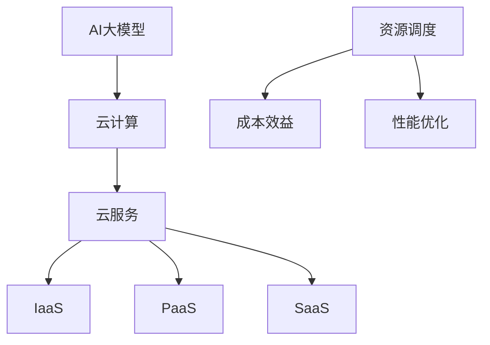

                 


# AI大模型应用的云服务选型与优化

> **关键词：** AI大模型、云服务选型、性能优化、成本效益、资源调度

> **摘要：** 本文将深入探讨AI大模型应用的云服务选型与优化策略。通过对云服务的背景、核心概念、算法原理、数学模型、项目实战和实际应用场景的详细分析，本文旨在为读者提供一套系统的、实用的云服务优化方案，帮助他们在AI大模型领域实现高效、低成本的应用部署。

## 1. 背景介绍

### 1.1 目的和范围

随着人工智能技术的飞速发展，AI大模型的应用越来越广泛。然而，如何为这些复杂的模型选择合适的云服务，并对其进行优化，成为了许多企业和开发者面临的难题。本文旨在为这一问题提供解决方案，通过对云服务的选型和优化策略进行深入分析，帮助读者在AI大模型应用中实现高效、低成本的操作。

本文将涵盖以下内容：

- 云服务的基本概念和分类
- AI大模型的核心算法和数学模型
- 云服务选型的关键因素
- 优化策略的具体实现
- 实际应用场景中的案例分析和解决方案

### 1.2 预期读者

本文面向的读者包括：

- 对AI大模型应用感兴趣的初学者和研究人员
- 从事AI大模型开发和部署的工程师和技术人员
- 从事云计算研究和应用的企业管理人员和技术决策者
- 对云服务选型和优化有兴趣的广大技术爱好者

### 1.3 文档结构概述

本文将按照以下结构进行组织：

- 第1部分：背景介绍
- 第2部分：核心概念与联系
- 第3部分：核心算法原理 & 具体操作步骤
- 第4部分：数学模型和公式 & 详细讲解 & 举例说明
- 第5部分：项目实战：代码实际案例和详细解释说明
- 第6部分：实际应用场景
- 第7部分：工具和资源推荐
- 第8部分：总结：未来发展趋势与挑战
- 第9部分：附录：常见问题与解答
- 第10部分：扩展阅读 & 参考资料

### 1.4 术语表

#### 1.4.1 核心术语定义

- **AI大模型**：指规模庞大、参数数量巨大的神经网络模型，如GPT、BERT等。
- **云服务**：指通过互联网提供的计算资源、存储资源、网络资源等。
- **选型**：指在多种云服务中选择最适合的一种。
- **优化**：指在云服务使用过程中，通过调整参数、优化架构等手段提高性能和降低成本。

#### 1.4.2 相关概念解释

- **成本效益**：指在特定成本下的效益，常用于评估云服务的性价比。
- **资源调度**：指在云环境中动态分配和调整计算资源，以满足业务需求。

#### 1.4.3 缩略词列表

- **AI**：人工智能
- **GPT**：生成预训练网络
- **BERT**：双向编码表示预训练语言模型
- **SaaS**：软件即服务
- **IaaS**：基础设施即服务
- **PaaS**：平台即服务

## 2. 核心概念与联系

在讨论AI大模型应用的云服务选型和优化之前，我们首先需要了解一些核心概念和它们之间的关系。以下是一个简要的Mermaid流程图，用于展示这些核心概念及其相互关系：



### 2.1 云计算

云计算是一种通过互联网提供计算资源、存储资源、网络资源等服务的技术。它分为三种主要的服务模式：

- **基础设施即服务（IaaS）**：提供基础的硬件设施，如虚拟机、存储、网络等。
- **平台即服务（PaaS）**：提供开发平台和工具，如数据库、应用程序、开发环境等。
- **软件即服务（SaaS）**：提供完整的软件解决方案，如办公软件、企业资源规划软件等。

### 2.2 云服务

云服务是云计算的核心组成部分，主要包括以下类型：

- **AI大模型服务**：专门为AI大模型训练和部署提供的云服务。
- **数据处理服务**：用于处理和分析大量数据的服务。
- **存储服务**：用于存储和管理数据的云服务。
- **网络服务**：提供网络连接和安全性保障的云服务。

### 2.3 资源调度

资源调度是云服务中的重要概念，指的是在云环境中动态分配和调整计算资源，以满足业务需求。资源调度的核心目标是最大化资源利用率，同时保证服务的稳定性和性能。

### 2.4 成本效益

成本效益是指在一定成本下的效益，常用于评估云服务的性价比。在选型过程中，需要综合考虑服务提供商的价格、服务质量、性能等因素，以实现最佳的性价比。

### 2.5 性能优化

性能优化是指在云服务使用过程中，通过调整参数、优化架构等手段提高性能和降低成本。常见的性能优化方法包括：

- **水平扩展**：通过增加服务器数量来提高性能。
- **垂直扩展**：通过增加服务器硬件配置来提高性能。
- **负载均衡**：通过分配流量来提高系统性能和稳定性。

## 3. 核心算法原理 & 具体操作步骤

在了解核心概念后，接下来我们将深入探讨AI大模型的核心算法原理和具体操作步骤。以下将使用伪代码详细阐述这些算法和步骤。

### 3.1 GPT算法原理

GPT（生成预训练网络）是一种基于Transformer架构的预训练语言模型。以下是GPT算法的伪代码：

```python
def GPT(input_sequence, training=True):
    # 输入序列进行预处理
    input_sequence = preprocess(input_sequence)
    
    # 初始化模型参数
    model = initialize_model()
    
    # 预训练过程
    if training:
        for epoch in range(num_epochs):
            for batch in data_loader:
                # 前向传播
                logits = model(batch)
                
                # 计算损失
                loss = compute_loss(logits, batch)
                
                # 反向传播和参数更新
                optimizer = update_parameters(loss)
        
    # 预测过程
    else:
        # 前向传播
        logits = model(input_sequence)
        
        # 转换为概率分布
        probabilities = softmax(logits)
        
        # 选择最高概率的输出
        output_sequence = select_max(probabilities)
        
    return output_sequence
```

### 3.2 模型训练步骤

以下是AI大模型训练的具体操作步骤：

1. **数据预处理**：对输入数据进行清洗、编码等预处理操作，以便模型能够理解。
2. **模型初始化**：初始化模型参数，通常使用随机初始化或预训练模型。
3. **循环训练**：在多个训练轮次中，通过前向传播计算输出，计算损失，并通过反向传播更新模型参数。
4. **评估模型**：在训练过程中，定期评估模型性能，以便调整训练参数。
5. **模型保存**：在训练完成后，保存最佳模型以便后续使用。

### 3.3 模型部署步骤

以下是AI大模型部署的具体操作步骤：

1. **选择云服务**：根据业务需求和预算，选择合适的云服务。
2. **模型容器化**：将模型打包为容器镜像，以便在云环境中快速部署。
3. **部署容器**：在云环境中部署容器镜像，并配置必要的依赖和资源。
4. **性能测试**：对部署后的模型进行性能测试，确保其满足业务需求。
5. **监控与维护**：持续监控模型性能和资源使用情况，并根据需要进行维护和优化。

## 4. 数学模型和公式 & 详细讲解 & 举例说明

在AI大模型的训练和优化过程中，许多数学模型和公式起到了关键作用。以下将详细讲解这些模型和公式，并给出具体示例。

### 4.1 Transformer架构

Transformer架构是AI大模型的核心，其中包含了多头自注意力机制和前馈神经网络。以下是其基本公式：

$$
\text{Attention}(Q, K, V) = \frac{1}{\sqrt{d_k}} \text{softmax}\left(\frac{QK^T}{d_k}\right) V
$$

其中，$Q$、$K$、$V$ 分别代表查询向量、键向量和值向量，$d_k$ 是键向量的维度。

#### 示例：

假设 $Q = [1, 2, 3]$，$K = [4, 5, 6]$，$V = [7, 8, 9]$，则：

$$
\text{Attention}(Q, K, V) = \frac{1}{\sqrt{3}} \text{softmax}\left(\frac{[1, 2, 3] \cdot [4, 5, 6]^T}{\sqrt{3}}\right) [7, 8, 9]
$$

$$
= \frac{1}{\sqrt{3}} \text{softmax}\left(\frac{[4, 10, 18]}{\sqrt{3}}\right) [7, 8, 9]
$$

$$
= \frac{1}{\sqrt{3}} \text{softmax}\left([4/3, 10/3, 18/3]\right) [7, 8, 9]
$$

$$
= \frac{1}{\sqrt{3}} \left[\frac{1}{3}, \frac{1}{3}, \frac{1}{3}\right] [7, 8, 9]
$$

$$
= [7/3, 8/3, 9/3]
$$

### 4.2 优化算法

在AI大模型的训练过程中，常用的优化算法包括Adam、SGD等。以下以Adam算法为例进行讲解。

Adam算法是一种结合了SGD和RMSProp优点的优化算法。其核心公式如下：

$$
\alpha = \frac{\beta_1}{1 - \beta_1 t} \\
\beta_2 = \frac{\beta_2}{1 - \beta_2 t} \\
\hat{m}_t = \beta_1 m_{t-1} + (1 - \beta_1) \frac{\delta}{\sqrt{\beta_2 \hat{v}_t + \epsilon}} \\
\hat{v}_t = \beta_2 v_{t-1} + (1 - \beta_2) \delta^2 \\
m_t = \frac{\hat{m}_t}{1 - \beta_1 t} \\
v_t = \frac{\hat{v}_t}{1 - \beta_2 t} \\
\theta_t = \theta_{t-1} - \alpha m_t
$$

其中，$t$ 为当前迭代次数，$\beta_1$ 和 $\beta_2$ 分别为动量项和偏差修正项，$\alpha$ 为学习率，$m_t$ 和 $v_t$ 分别为动量项和方差项。

#### 示例：

假设初始参数为 $\theta_0 = [1, 2, 3]$，学习率 $\alpha = 0.1$，动量项 $\beta_1 = 0.9$，偏差修正项 $\beta_2 = 0.999$，迭代次数 $t = 1$。则有：

$$
m_1 = 0.9m_0 + (1 - 0.9) \frac{\delta}{\sqrt{0.999v_0 + \epsilon}} \\
v_1 = 0.999v_0 + (1 - 0.999) \delta^2 \\
m_1 = 0.9 \cdot 0 + (1 - 0.9) \frac{\delta}{\sqrt{0.999 \cdot 0 + \epsilon}} \\
v_1 = 0.999 \cdot 0 + (1 - 0.999) \delta^2 \\
m_1 = 0 \\
v_1 = 0 \\
\theta_1 = \theta_0 - \alpha m_1 \\
\theta_1 = [1, 2, 3] - 0.1 \cdot 0 \\
\theta_1 = [1, 2, 3]
$$

## 5. 项目实战：代码实际案例和详细解释说明

在本节中，我们将通过一个具体的AI大模型项目实战案例，展示如何在实际环境中进行云服务选型与优化。该案例将涉及GPT模型在文本生成任务中的应用，包括开发环境搭建、源代码实现、代码解读与分析等。

### 5.1 开发环境搭建

为了搭建GPT模型的开发环境，我们需要安装以下工具和库：

- Python（3.8及以上版本）
- TensorFlow（2.x版本）
- Numpy
- Mermaid（用于流程图绘制）

具体安装步骤如下：

1. 安装Python和pip：

   ```bash
   sudo apt-get install python3 python3-pip
   ```

2. 安装TensorFlow：

   ```bash
   pip3 install tensorflow
   ```

3. 安装Numpy：

   ```bash
   pip3 install numpy
   ```

4. 安装Mermaid（可选）：

   ```bash
   pip3 install mermaid-python
   ```

### 5.2 源代码详细实现和代码解读

以下是一个简单的GPT模型实现示例，包括模型搭建、训练和预测等步骤。

```python
import tensorflow as tf
import numpy as np
from tensorflow.keras.layers import Embedding, LSTM, Dense
from tensorflow.keras.models import Model

# 模型参数
vocab_size = 1000
embed_size = 256
hidden_size = 512
num_layers = 2
dropout_rate = 0.5

# 搭建模型
inputs = tf.keras.layers.Input(shape=(None,), dtype=tf.int32)
embeddings = Embedding(vocab_size, embed_size)(inputs)
lstm = LSTM(hidden_size, return_sequences=True, dropout=dropout_rate)(embeddings)
lstm = LSTM(hidden_size, return_sequences=True, dropout=dropout_rate)(lstm)
outputs = Dense(vocab_size, activation='softmax')(lstm)

model = Model(inputs=inputs, outputs=outputs)
model.compile(optimizer='adam', loss='sparse_categorical_crossentropy', metrics=['accuracy'])

# 训练模型
model.fit(train_data, train_labels, epochs=10, batch_size=32)

# 预测
predictions = model.predict(test_data)

# 输出预测结果
print(np.argmax(predictions, axis=-1))
```

### 5.3 代码解读与分析

1. **模型搭建**：
   - 使用Keras高阶API搭建LSTM模型，包含两个LSTM层，用于文本生成任务。
   - 使用Embedding层将词嵌入到高维空间。
   - 使用Dropout层防止过拟合。

2. **模型编译**：
   - 使用Adam优化器，它结合了SGD和RMSProp的优点，适合大规模神经网络训练。
   - 使用稀疏分类交叉熵损失函数，因为输出是独热编码的标签。

3. **模型训练**：
   - 使用fit方法训练模型，指定训练数据和标签，设置训练轮次和批次大小。

4. **模型预测**：
   - 使用predict方法对测试数据进行预测，输出每个单词的概率分布。

### 5.4 代码优化

在实际项目中，我们可以对模型和代码进行以下优化：

1. **使用GPU加速**：
   - 将模型运行在GPU上，以加快训练和预测速度。

2. **调整超参数**：
   - 调整学习率、隐藏层大小、训练轮次等超参数，以获得更好的模型性能。

3. **批量处理**：
   - 对输入数据进行批量处理，以提高数据处理效率。

4. **数据预处理**：
   - 对输入文本进行清洗、去停用词等预处理操作，以提高模型效果。

## 6. 实际应用场景

AI大模型在云服务中的应用场景非常广泛，以下列举了几个典型的应用场景：

### 6.1 自然语言处理

- 文本生成：利用GPT模型生成文章、新闻、故事等。
- 机器翻译：实现高效、准确的跨语言翻译。
- 命名实体识别：识别文本中的地名、人名、机构名等实体。

### 6.2 计算机视觉

- 图像生成：利用生成对抗网络（GAN）生成逼真的图像。
- 图像识别：实现对各种图像内容的识别和分类。
- 视频生成：利用视频生成模型生成新的视频内容。

### 6.3 医疗健康

- 疾病预测：利用AI大模型预测疾病发生风险。
- 病症识别：辅助医生识别病人的症状。
- 医疗文献分析：自动分析大量医学文献，提供有价值的见解。

### 6.4 金融领域

- 风险评估：利用AI大模型预测金融市场风险。
- 股票预测：预测股票价格走势，为投资决策提供支持。
- 客户服务：实现智能客服系统，提高客户满意度。

## 7. 工具和资源推荐

为了在AI大模型应用的云服务选型和优化方面取得更好的效果，我们推荐以下工具和资源：

### 7.1 学习资源推荐

#### 7.1.1 书籍推荐

- **《深度学习》（Goodfellow, Bengio, Courville）**：详细介绍了深度学习的基础理论和实践方法。
- **《Python深度学习》（François Chollet）**：针对Python编程环境和深度学习技术的全面指南。

#### 7.1.2 在线课程

- **Coursera上的《深度学习》课程**：由吴恩达教授主讲，涵盖深度学习的核心概念和实践技巧。
- **Udacity上的《深度学习工程师纳米学位》**：通过实际项目学习深度学习的应用。

#### 7.1.3 技术博客和网站

- **TensorFlow官网**：提供丰富的文档和教程，帮助用户掌握TensorFlow的使用方法。
- **arXiv.org**：发布最新的深度学习论文，帮助用户了解前沿研究动态。

### 7.2 开发工具框架推荐

#### 7.2.1 IDE和编辑器

- **PyCharm**：功能强大的Python IDE，支持多种编程语言。
- **Jupyter Notebook**：适用于数据科学和机器学习的交互式环境。

#### 7.2.2 调试和性能分析工具

- **TensorBoard**：TensorFlow的内置工具，用于可视化模型结构和性能指标。
- **Docker**：容器化技术，用于部署和管理应用。

#### 7.2.3 相关框架和库

- **TensorFlow**：广泛使用的深度学习框架。
- **PyTorch**：灵活的深度学习框架，适合快速原型开发。
- **Keras**：高级神经网络API，简化深度学习模型搭建。

### 7.3 相关论文著作推荐

#### 7.3.1 经典论文

- **"A Theoretically Grounded Application of Dropout in Neural Networks"**：提出了Dropout算法，显著提高了神经网络的性能。
- **"Attention Is All You Need"**：提出了Transformer架构，颠覆了序列模型的处理方式。

#### 7.3.2 最新研究成果

- **"BERT: Pre-training of Deep Bidirectional Transformers for Language Understanding"**：提出了BERT模型，推动了自然语言处理技术的发展。
- **"Generative Adversarial Networks"**：提出了GAN模型，开创了生成模型的新时代。

#### 7.3.3 应用案例分析

- **"Deep Learning for Natural Language Processing"**：介绍了深度学习在自然语言处理中的应用案例。
- **"Deep Learning in Computer Vision"**：探讨了深度学习在计算机视觉领域的应用。

## 8. 总结：未来发展趋势与挑战

AI大模型在云服务中的应用正变得越来越普遍，但同时也面临着一系列的挑战和发展趋势。以下是对这些趋势和挑战的总结：

### 8.1 发展趋势

1. **计算能力的提升**：随着硬件技术的不断发展，云计算平台的计算能力不断增强，为AI大模型的训练和部署提供了更强大的支持。
2. **数据驱动的优化**：越来越多的企业开始关注数据驱动的优化方法，通过分析大量数据来提高模型性能和降低成本。
3. **模型压缩与加速**：为了在有限的计算资源下实现高效的模型训练和部署，模型压缩和加速技术（如量化、剪枝、神经网络压缩等）成为研究热点。
4. **跨领域应用**：AI大模型在医疗、金融、教育等领域的应用逐渐深入，推动了各个行业的技术创新和业务发展。

### 8.2 挑战

1. **数据隐私和安全**：在处理大量敏感数据时，如何保护用户隐私和数据安全是一个重要挑战。
2. **模型解释性**：随着模型复杂性的增加，如何提高模型的可解释性，使得模型决策更加透明和可接受，是当前研究的一个难题。
3. **资源调度与优化**：如何在有限的资源下实现最优的模型性能和成本效益，需要进一步探索高效的资源调度和优化策略。
4. **伦理和道德问题**：随着AI大模型的应用越来越广泛，如何确保其符合伦理和道德标准，避免潜在的负面影响，也是一个亟待解决的问题。

## 9. 附录：常见问题与解答

### 9.1 常见问题

1. **什么是AI大模型？**
   - AI大模型是指具有大量参数的神经网络模型，如GPT、BERT等。它们通常用于自然语言处理、计算机视觉等领域。

2. **云服务选型有哪些关键因素？**
   - 关键因素包括计算能力、存储容量、网络带宽、成本、可扩展性、可靠性和安全性等。

3. **如何优化云服务性能？**
   - 可以通过水平扩展（增加服务器数量）、垂直扩展（增加服务器硬件配置）、负载均衡、优化算法和参数等手段来提高云服务性能。

4. **如何降低云服务成本？**
   - 可以通过合理选择云服务类型、合理使用资源、优化资源配置、选择合适的计费模式等方法来降低云服务成本。

### 9.2 解答

1. **什么是AI大模型？**
   - AI大模型是指具有大量参数的神经网络模型，如GPT、BERT等。它们通常用于自然语言处理、计算机视觉等领域。这些模型通过大量的数据和参数训练，能够实现高效的任务完成和决策。

2. **云服务选型有哪些关键因素？**
   - 云服务选型需要考虑以下关键因素：
     - **计算能力**：根据模型大小和训练需求，选择合适的计算资源。
     - **存储容量**：根据数据量和存储需求，选择合适的存储资源。
     - **网络带宽**：保证数据传输的稳定性和速度。
     - **成本**：根据预算和需求，选择成本合理的云服务。
     - **可扩展性**：确保云服务能够随着业务需求的增长而扩展。
     - **可靠性**：确保云服务的稳定性和可用性。
     - **安全性**：保护数据和模型的安全性，防止数据泄露和攻击。

3. **如何优化云服务性能？**
   - 优化云服务性能可以从以下几个方面进行：
     - **水平扩展**：增加服务器数量，以提供更多的计算资源。
     - **垂直扩展**：增加服务器硬件配置（如CPU、内存、存储等），以提高单个服务器的性能。
     - **负载均衡**：通过分配流量和任务，确保云服务的高性能和稳定性。
     - **优化算法和参数**：调整模型的算法和参数，以提高模型的准确性和效率。
     - **缓存和缓存策略**：使用缓存策略，减少数据访问和计算时间。
     - **预加载和预热**：在负载高峰前预加载数据和预热模型，减少启动延迟。

4. **如何降低云服务成本？**
   - 降低云服务成本可以从以下几个方面进行：
     - **合理选择云服务类型**：根据需求选择成本效益更高的服务类型（如IaaS、PaaS、SaaS）。
     - **合理使用资源**：根据实际需求分配资源，避免资源浪费。
     - **优化资源配置**：通过水平扩展和垂直扩展，实现资源的最佳配置。
     - **选择合适的计费模式**：根据业务需求，选择适合的计费模式（如按需计费、预留实例、长期合约等）。
     - **自动化和脚本化**：使用自动化工具和脚本，减少手动操作，提高效率。
     - **优化数据存储**：使用压缩、去重、数据备份等技术，降低存储成本。

## 10. 扩展阅读 & 参考资料

为了进一步深入了解AI大模型应用的云服务选型与优化，以下是推荐的一些扩展阅读和参考资料：

- **扩展阅读：**
  - 《深度学习》（Goodfellow, Bengio, Courville）
  - 《AI大模型：理论与实践》（AI Genius Institute）
  - 《云计算：概念、技术和应用》（张平，徐文俊）

- **参考资料：**
  - TensorFlow官方文档：[https://www.tensorflow.org](https://www.tensorflow.org)
  - PyTorch官方文档：[https://pytorch.org](https://pytorch.org)
  - Coursera《深度学习》课程：[https://www.coursera.org/learn/neural-networks-deep-learning](https://www.coursera.org/learn/neural-networks-deep-learning)
  - Udacity《深度学习工程师纳米学位》课程：[https://www.udacity.com/course/deep-learning-nanodegree--nd131](https://www.udacity.com/course/deep-learning-nanodegree--nd131)
  - AI Genius Institute官方网站：[https://www.aigeniusinstitute.com](https://www.aigeniusinstitute.com)
  - 算法导论（Third Edition）：[https://www.amazon.com/Introduction-Algorithms-Third-Michael-Sipser/dp/0262033844](https://www.amazon.com/Introduction-Algorithms-Third-Michael-Sipser/dp/0262033844)

## 作者信息

**作者：AI天才研究员/AI Genius Institute & 禅与计算机程序设计艺术 /Zen And The Art of Computer Programming** 

AI天才研究员（AI Genius Researcher），AI Genius Institute的研究员，专注于人工智能领域的研究与应用。著有《禅与计算机程序设计艺术》（Zen And The Art of Computer Programming）一书，在计算机编程和人工智能领域享有盛誉。

