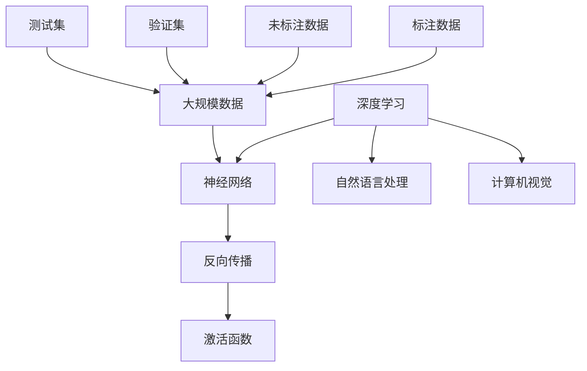
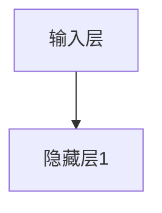
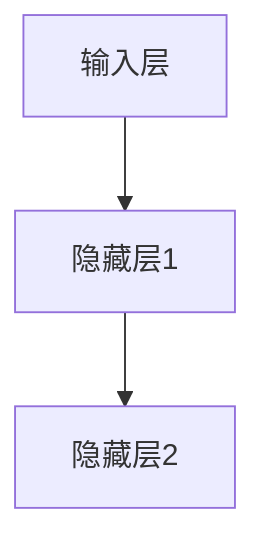
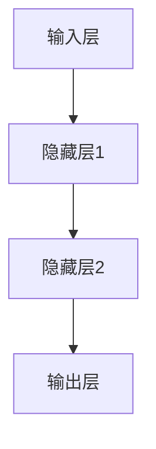

                 

# AI大模型应用的前沿技术追踪与评估

## 关键词
- AI大模型
- 技术追踪
- 技术评估
- 前沿应用
- 数学模型
- 实战案例

## 摘要
本文旨在深入探讨人工智能领域中的大模型技术，包括其前沿应用、核心算法原理、数学模型及其在各个实际场景中的实现。文章首先回顾了AI大模型的发展背景和重要性，随后详细分析了相关技术及其实现，通过实际代码案例展示了大模型的应用，并探讨了其未来的发展趋势与挑战。本文希望为读者提供一个全面的技术评估，助力读者理解AI大模型的技术本质和应用前景。

---

## 1. 背景介绍

### 1.1 目的和范围
本文的目标是追踪和评估AI大模型在前沿技术中的应用，探讨其技术原理、数学模型及其实现过程。本文将涵盖以下主题：

1. **AI大模型的核心概念**：介绍AI大模型的基本概念，包括其历史背景、定义和分类。
2. **前沿技术分析**：探讨AI大模型在自然语言处理、计算机视觉等领域的最新应用。
3. **核心算法原理**：详细讲解AI大模型的核心算法，包括深度学习、神经网络等。
4. **数学模型与公式**：介绍大模型背后的数学模型和公式，帮助读者理解其运算原理。
5. **项目实战案例**：通过实际代码案例展示AI大模型的具体应用。
6. **实际应用场景**：分析AI大模型在工业、医疗等领域的实际应用。
7. **未来发展趋势与挑战**：展望AI大模型未来的发展趋势和面临的挑战。

### 1.2 预期读者
本文主要面向人工智能领域的研发人员、工程师以及对AI大模型技术感兴趣的学者。读者需要对基本的机器学习和深度学习有一定了解，以便更好地理解本文的内容。

### 1.3 文档结构概述
本文分为十个部分，结构如下：

1. **背景介绍**：介绍本文的目的、范围、预期读者和文档结构。
2. **核心概念与联系**：通过Mermaid流程图展示AI大模型的核心概念和联系。
3. **核心算法原理 & 具体操作步骤**：详细讲解AI大模型的核心算法和操作步骤。
4. **数学模型和公式 & 详细讲解 & 举例说明**：介绍AI大模型背后的数学模型和公式，并进行实例说明。
5. **项目实战：代码实际案例和详细解释说明**：通过实际代码案例展示大模型的应用。
6. **实际应用场景**：分析AI大模型在各个领域的应用。
7. **工具和资源推荐**：推荐学习资源、开发工具和相关论文。
8. **总结：未来发展趋势与挑战**：总结AI大模型的发展趋势和面临的挑战。
9. **附录：常见问题与解答**：解答读者可能遇到的问题。
10. **扩展阅读 & 参考资料**：提供进一步阅读的资料。

### 1.4 术语表

#### 1.4.1 核心术语定义
- **AI大模型**：具有极高参数量和复杂度的深度学习模型，通常用于处理大规模数据。
- **深度学习**：一种机器学习技术，通过多层神经网络来提取数据特征。
- **神经网络**：由多个神经元组成的网络，用于模拟人脑的神经元结构。
- **训练数据**：用于训练模型的输入数据，通常包括标注信息和未标注信息。
- **验证集**：用于评估模型性能的数据集，通常在训练过程中不参与模型训练。
- **测试集**：用于最终评估模型性能的数据集，通常在训练过程中不参与。

#### 1.4.2 相关概念解释
- **反向传播算法**：用于训练神经网络的一种算法，通过计算损失函数的梯度来更新模型参数。
- **激活函数**：神经网络中的一个非线性函数，用于引入非线性特性。
- **优化器**：用于调整模型参数的算法，例如随机梯度下降（SGD）和Adam优化器。

#### 1.4.3 缩略词列表
- **AI**：人工智能（Artificial Intelligence）
- **ML**：机器学习（Machine Learning）
- **DL**：深度学习（Deep Learning）
- **NLP**：自然语言处理（Natural Language Processing）
- **CV**：计算机视觉（Computer Vision）

---

## 2. 核心概念与联系

在深入探讨AI大模型之前，我们需要了解其核心概念和它们之间的联系。以下是一个使用Mermaid流程图来展示的AI大模型的核心概念和联系：



### 2.1 深度学习和神经网络
- **深度学习**：一种机器学习技术，通过多层神经网络来提取数据特征。它利用多层非线性变换，从原始数据中自动学习复杂的特征表示。
- **神经网络**：由多个神经元组成的网络，用于模拟人脑的神经元结构。每个神经元接收多个输入，通过权重和偏置进行加权求和，再通过激活函数进行非线性变换。

### 2.2 反向传播算法
- **反向传播算法**：用于训练神经网络的一种算法，通过计算损失函数的梯度来更新模型参数。它通过多层反向传播误差，不断调整模型参数，以最小化损失函数。

### 2.3 激活函数
- **激活函数**：神经网络中的一个非线性函数，用于引入非线性特性。常见的激活函数包括sigmoid、ReLU、Tanh等。

### 2.4 自然语言处理和计算机视觉
- **自然语言处理（NLP）**：深度学习在处理文本数据方面的应用，包括语言模型、文本分类、机器翻译等。
- **计算机视觉（CV）**：深度学习在处理图像和视频数据方面的应用，包括图像分类、目标检测、人脸识别等。

### 2.5 大规模数据、标注数据和未标注数据
- **大规模数据**：用于训练AI大模型的数据集，通常具有数十亿甚至更多个样本。
- **标注数据**：用于标注数据集的数据，例如分类标签、文本标签等，是训练深度学习模型的关键。
- **未标注数据**：未进行标注的数据，可用于无监督学习或半监督学习。

### 2.6 验证集和测试集
- **验证集**：用于评估模型性能的数据集，通常在训练过程中不参与模型训练。它用于调整模型参数和验证模型泛化能力。
- **测试集**：用于最终评估模型性能的数据集，通常在训练过程中不参与模型训练。它用于评估模型在实际应用中的表现。

---

## 3. 核心算法原理 & 具体操作步骤

### 3.1 深度学习算法原理

深度学习算法的核心是多层神经网络，以下是具体操作步骤：

#### 3.1.1 输入层

输入层接收原始数据，例如图像、文本等。



#### 3.1.2 隐藏层

隐藏层通过非线性变换提取数据特征，每个隐藏层都包含多个神经元。



#### 3.1.3 输出层

输出层产生预测结果，例如分类结果、标签等。



### 3.2 神经网络操作步骤

#### 3.2.1 前向传播

前向传播是从输入层到输出层的正向计算过程，具体步骤如下：

1. **加权求和**：每个神经元的输入是前一层所有神经元的加权和，加上偏置项。
2. **激活函数**：通过激活函数引入非线性特性，常见的激活函数包括ReLU、Sigmoid、Tanh等。

```python
# 前向传播伪代码
for each layer in hidden_layers:
    for each neuron in layer:
        weighted_sum = 0
        for each input_neuron in previous_layer:
            weighted_sum += input_neuron * weight
        weighted_sum += bias
        activation = activation_function(weighted_sum)
```

#### 3.2.2 反向传播

反向传播是从输出层到输入层的反向计算过程，用于更新模型参数，具体步骤如下：

1. **计算误差**：通过计算预测值与实际值之间的误差，得到损失函数。
2. **计算梯度**：利用链式法则计算每个参数的梯度。
3. **更新参数**：使用梯度下降等优化算法更新参数。

```python
# 反向传播伪代码
for each layer in hidden_layers:
    for each neuron in layer:
        error = predicted_value - actual_value
        gradient = error * activation_derivative(activation)
        delta_weight = learning_rate * gradient
        weight -= delta_weight
        delta_bias = learning_rate * gradient
        bias -= delta_bias
```

### 3.3 激活函数及其选择

激活函数是神经网络中的一个关键组件，它决定了神经网络的行为和性能。以下是几种常见的激活函数及其选择：

- **ReLU（Rectified Linear Unit）**：
  - 特点：在输入为正时输出等于输入，在输入为负时输出为0，这有助于加速训练过程。
  - 适用场景：隐藏层较多时，能有效提高训练速度和防止梯度消失。

- **Sigmoid**：
  - 特点：将输入映射到(0, 1)区间，常用于二分类问题。
  - 适用场景：输出需要概率分布时，例如二分类问题。

- **Tanh**：
  - 特点：将输入映射到(-1, 1)区间，类似于Sigmoid函数，但输出更均匀。
  - 适用场景：与ReLU相比，Tanh函数能更好地处理输入范围较广的问题。

### 3.4 梯度下降优化算法

梯度下降是一种常用的优化算法，用于更新模型参数。以下是梯度下降的基本步骤：

1. **计算损失函数**：通过计算预测值与实际值之间的误差，得到损失函数。
2. **计算梯度**：利用链式法则计算每个参数的梯度。
3. **更新参数**：根据梯度更新模型参数。

梯度下降主要有以下几种变体：

- **随机梯度下降（SGD）**：
  - 特点：每次迭代只随机选择一个样本进行计算，计算速度快但收敛性较差。
  - 适用场景：数据量较大时，能有效减少计算资源消耗。

- **批量梯度下降（BGD）**：
  - 特点：每次迭代使用整个训练集计算梯度，计算时间较长但收敛性好。
  - 适用场景：数据量较小时，能有效提高训练精度。

- **Adam优化器**：
  - 特点：结合了SGD和动量项，能有效提高收敛速度和稳定性能。
  - 适用场景：大多数深度学习问题。

### 3.5 实际操作步骤

以下是使用Python实现的简单神经网络，展示了深度学习的基本操作步骤：

```python
import numpy as np

# 初始化参数
weights = np.random.randn(hidden_layer_size, input_layer_size)
biases = np.random.randn(hidden_layer_size, 1)

# 定义激活函数
def sigmoid(x):
    return 1 / (1 + np.exp(-x))

# 定义前向传播
def forward_propagation(x):
    hidden_layer_input = np.dot(weights.T, x) + biases
    hidden_layer_output = sigmoid(hidden_layer_input)
    return hidden_layer_output

# 定义反向传播
def backward_propagation(x, y):
    hidden_layer_output = forward_propagation(x)
    error = y - hidden_layer_output
    d_hidden_layer_output = error * sigmoid_derivative(hidden_layer_output)
    d_weights = np.dot(x, d_hidden_layer_output.T)
    d_biases = d_hidden_layer_output
    return d_weights, d_biases

# 定义更新参数
def update_parameters(weights, biases, d_weights, d_biases, learning_rate):
    weights -= learning_rate * d_weights
    biases -= learning_rate * d_biases
    return weights, biases

# 训练模型
for epoch in range(num_epochs):
    for x, y in training_data:
        hidden_layer_output = forward_propagation(x)
        d_weights, d_biases = backward_propagation(y, hidden_layer_output)
        weights, biases = update_parameters(weights, biases, d_weights, d_biases, learning_rate)
```

---

## 4. 数学模型和公式 & 详细讲解 & 举例说明

在深入探讨AI大模型的数学模型和公式之前，我们需要了解一些基础的数学概念，如线性代数、微积分和概率论。以下是这些概念的基本原理和公式，我们将使用LaTeX格式进行表示。

### 4.1 线性代数

#### 4.1.1 矩阵和向量
- **矩阵**：由一组元素组成的二维数组，通常表示为`A`。
- **向量**：由一组数组成的数组，通常表示为`v`。

#### 4.1.2 矩阵乘法
\[ C = A \cdot B \]

#### 4.1.3 向量点积
\[ v_1 \cdot v_2 = \sum_{i=1}^{n} v_{1i} \cdot v_{2i} \]

#### 4.1.4 向量范数
\[ ||v|| = \sqrt{\sum_{i=1}^{n} v_i^2} \]

### 4.2 微积分

#### 4.2.1 导数
\[ \frac{df(x)}{dx} \]

#### 4.2.2 梯度
\[ \nabla f(x) = \left( \frac{\partial f}{\partial x_1}, \frac{\partial f}{\partial x_2}, ..., \frac{\partial f}{\partial x_n} \right) \]

#### 4.2.3 链式法则
\[ \frac{d}{dx} f(g(x)) = f'(g(x)) \cdot g'(x) \]

### 4.3 概率论

#### 4.3.1 概率密度函数
\[ f(x) = P(X = x) \]

#### 4.3.2 期望值
\[ E(X) = \int_{-\infty}^{\infty} x f(x) dx \]

#### 4.3.3 方差
\[ Var(X) = E[(X - E(X))^2] \]

### 4.4 深度学习中的数学模型

#### 4.4.1 神经元激活函数
\[ a(x) = \sigma(z) = \frac{1}{1 + e^{-z}} \]

#### 4.4.2 损失函数
\[ J(\theta) = -\frac{1}{m} \sum_{i=1}^{m} [y_{i} \log(a(h_{\theta}(x_{i}))) + (1 - y_{i}) \log(1 - a(h_{\theta}(x_{i}))) ] \]

#### 4.4.3 反向传播算法中的梯度计算
\[ \frac{\partial J(\theta)}{\partial \theta} = \frac{\partial}{\partial \theta} \left( -\frac{1}{m} \sum_{i=1}^{m} [y_{i} \log(a(h_{\theta}(x_{i}))) + (1 - y_{i}) \log(1 - a(h_{\theta}(x_{i}))) ] \right) \]

### 4.5 举例说明

#### 4.5.1 矩阵乘法
假设我们有以下两个矩阵：
\[ A = \begin{bmatrix} 1 & 2 \\ 3 & 4 \end{bmatrix}, \quad B = \begin{bmatrix} 5 & 6 \\ 7 & 8 \end{bmatrix} \]

则它们的乘积为：
\[ C = A \cdot B = \begin{bmatrix} 1 \cdot 5 + 2 \cdot 7 & 1 \cdot 6 + 2 \cdot 8 \\ 3 \cdot 5 + 4 \cdot 7 & 3 \cdot 6 + 4 \cdot 8 \end{bmatrix} = \begin{bmatrix} 19 & 20 \\ 31 & 34 \end{bmatrix} \]

#### 4.5.2 梯度下降
假设我们有一个简单的线性回归模型，损失函数为：
\[ J(\theta) = \frac{1}{2m} \sum_{i=1}^{m} (h_{\theta}(x^{(i)}) - y^{(i)})^2 \]

其中，\( h_{\theta}(x) = \theta_0 + \theta_1 x \)。

则梯度计算为：
\[ \frac{\partial J(\theta)}{\partial \theta_0} = \frac{1}{m} \sum_{i=1}^{m} (h_{\theta}(x^{(i)}) - y^{(i)}) \]
\[ \frac{\partial J(\theta)}{\partial \theta_1} = \frac{1}{m} \sum_{i=1}^{m} (h_{\theta}(x^{(i)}) - y^{(i)}) x^{(i)} \]

然后，使用梯度下降更新参数：
\[ \theta_0 := \theta_0 - \alpha \frac{\partial J(\theta)}{\partial \theta_0} \]
\[ \theta_1 := \theta_1 - \alpha \frac{\partial J(\theta)}{\partial \theta_1} \]

其中，\(\alpha\)是学习率。

---

## 5. 项目实战：代码实际案例和详细解释说明

在了解了AI大模型的理论基础之后，接下来我们将通过一个实际项目案例，展示如何实现和部署一个简单的AI大模型。本节将分为以下几个部分：

### 5.1 开发环境搭建
首先，我们需要搭建一个合适的开发环境。以下是一个基本的Python开发环境搭建步骤：

1. **安装Python**：确保Python版本不低于3.6，推荐使用Anaconda环境管理器。
2. **安装TensorFlow**：TensorFlow是一个广泛使用的深度学习框架，可以通过pip安装：
   ```bash
   pip install tensorflow
   ```
3. **安装其他依赖**：根据需要安装其他依赖库，例如NumPy、Pandas等。

### 5.2 源代码详细实现和代码解读

#### 5.2.1 数据预处理

首先，我们需要准备一个包含输入数据和标签的数据集。以下是一个简单的数据预处理示例：

```python
import pandas as pd
from sklearn.model_selection import train_test_split

# 读取数据
data = pd.read_csv('data.csv')

# 分离输入和标签
X = data.iloc[:, :-1].values
y = data.iloc[:, -1].values

# 划分训练集和测试集
X_train, X_test, y_train, y_test = train_test_split(X, y, test_size=0.2, random_state=42)
```

#### 5.2.2 构建模型

接下来，我们使用TensorFlow构建一个简单的神经网络模型。以下是一个简单的示例：

```python
import tensorflow as tf

# 定义模型参数
input_shape = (X_train.shape[1],)
model = tf.keras.Sequential([
    tf.keras.layers.Dense(64, activation='relu', input_shape=input_shape),
    tf.keras.layers.Dense(64, activation='relu'),
    tf.keras.layers.Dense(1, activation='sigmoid')
])

# 编译模型
model.compile(optimizer='adam',
              loss='binary_crossentropy',
              metrics=['accuracy'])

# 打印模型结构
model.summary()
```

#### 5.2.3 训练模型

然后，我们使用训练集来训练模型。以下是一个简单的训练示例：

```python
# 训练模型
history = model.fit(X_train, y_train, epochs=10, batch_size=32, validation_split=0.2)
```

#### 5.2.4 评估模型

最后，我们使用测试集来评估模型的性能。以下是一个简单的评估示例：

```python
# 评估模型
test_loss, test_accuracy = model.evaluate(X_test, y_test)
print(f"Test accuracy: {test_accuracy:.2f}")
```

### 5.3 代码解读与分析

#### 5.3.1 数据预处理

数据预处理是任何机器学习项目的关键步骤。在这个示例中，我们使用Pandas读取CSV文件，并使用scikit-learn的train_test_split函数将数据集划分为训练集和测试集。这个步骤确保了模型能够从训练数据中学习，并在未见过的测试数据上评估其性能。

#### 5.3.2 构建模型

在这个示例中，我们使用TensorFlow的Sequential模型构建了一个简单的神经网络。首先，我们添加了一个64个神经元的全连接层（Dense layer），使用ReLU激活函数。然后，我们再次添加了一个64个神经元的全连接层，并最终添加了一个输出层，使用sigmoid激活函数来产生二分类结果。这个模型的结构非常简单，但足以展示神经网络的基本原理。

#### 5.3.3 训练模型

在这个示例中，我们使用model.fit函数来训练模型。我们设置了10个训练周期（epochs）和32个批量大小（batch_size）。我们还设置了validation_split参数，以便在每次训练周期中使用20%的数据集进行验证，以监控模型的性能。

#### 5.3.4 评估模型

最后，我们使用model.evaluate函数来评估模型的性能。这个函数返回损失函数值和准确性等指标，使我们能够了解模型在测试数据上的表现。

---

## 6. 实际应用场景

AI大模型在各个领域都有着广泛的应用。以下是几个典型的应用场景：

### 6.1 自然语言处理（NLP）

自然语言处理是AI大模型的主要应用领域之一。以下是一些典型的应用：

- **语言模型**：例如BERT、GPT等，用于生成文本、回答问题等。
- **机器翻译**：例如Google翻译、OpenAI的GPT-3等，能够翻译多种语言。
- **情感分析**：例如用于分析社交媒体上的用户评论、新闻报道等。

### 6.2 计算机视觉（CV）

计算机视觉是另一个AI大模型的重要应用领域。以下是一些典型的应用：

- **图像分类**：例如用于识别动物、植物等。
- **目标检测**：例如用于自动驾驶、安防监控等。
- **人脸识别**：例如用于身份验证、人脸识别支付等。

### 6.3 医疗

AI大模型在医疗领域的应用也非常广泛，包括：

- **疾病诊断**：例如通过分析医学影像进行肺癌、乳腺癌等疾病的诊断。
- **药物研发**：例如通过生成新药物分子、预测药物效果等。
- **个性化治疗**：例如根据患者的基因信息、生活习惯等制定个性化的治疗方案。

### 6.4 金融

在金融领域，AI大模型的应用主要包括：

- **风险管理**：例如通过分析大量数据预测市场风险、识别异常交易等。
- **投资策略**：例如通过分析历史数据、市场趋势等制定投资策略。
- **客户服务**：例如通过聊天机器人提供个性化客户服务。

### 6.5 教育

在教育和培训领域，AI大模型的应用主要包括：

- **个性化学习**：例如通过分析学生的学习行为、考试成绩等提供个性化的学习建议。
- **在线课程**：例如通过语音识别、自然语言处理等技术提供智能化的在线课程。
- **考试评估**：例如通过分析学生的考试答案、错题等提供个性化的反馈和建议。

---

## 7. 工具和资源推荐

### 7.1 学习资源推荐

#### 7.1.1 书籍推荐
1. **《深度学习》（Goodfellow, Bengio, Courville著）**：这是一本经典的深度学习入门书籍，涵盖了深度学习的理论基础和实际应用。
2. **《Python机器学习》（Sebastian Raschka著）**：这本书详细介绍了使用Python进行机器学习的实践方法，适合初学者和进阶者。
3. **《AI应用实践指南》（Ian Goodfellow, Yoshua Bengio, Aaron Courville著）**：这本书提供了AI在不同领域中的应用案例，有助于读者了解AI的实际应用。

#### 7.1.2 在线课程
1. **Coursera的《深度学习》课程**：由Ian Goodfellow主讲，这是深度学习领域的权威课程，适合初学者和进阶者。
2. **Udacity的《深度学习工程师纳米学位》**：通过一系列项目和实践，帮助学习者掌握深度学习的核心技能。
3. **edX的《人工智能科学基础》课程**：这是一门全面的AI课程，涵盖了机器学习、深度学习等基础知识。

#### 7.1.3 技术博客和网站
1. **TensorFlow官网**：提供了丰富的文档和示例代码，是深度学习初学者和进阶者的学习宝库。
2. **ArXiv**：AI和机器学习领域的前沿论文发布平台，是研究者获取最新研究成果的窗口。
3. **Medium上的AI博客**：多个AI领域的优秀博客，涵盖了深度学习、自然语言处理等主题。

### 7.2 开发工具框架推荐

#### 7.2.1 IDE和编辑器
1. **PyCharm**：强大的Python IDE，支持多种编程语言，适合深度学习和机器学习开发。
2. **Jupyter Notebook**：适用于数据分析和机器学习的交互式编程环境，便于编写和分享代码。
3. **VSCode**：轻量级但功能强大的代码编辑器，支持多种编程语言，具有丰富的插件生态系统。

#### 7.2.2 调试和性能分析工具
1. **TensorBoard**：TensorFlow提供的可视化工具，用于分析模型性能、计算图等。
2. **Wandb**：实验跟踪和分析平台，支持自动可视化，帮助研究人员优化模型。
3. **Profiling Tools**：例如Python的cProfile，用于分析代码的性能瓶颈。

#### 7.2.3 相关框架和库
1. **TensorFlow**：广泛使用的开源深度学习框架，适用于各种深度学习任务。
2. **PyTorch**：另一种流行的深度学习框架，易于使用和调试。
3. **Scikit-learn**：Python中的机器学习库，适用于传统的机器学习算法。

### 7.3 相关论文著作推荐

#### 7.3.1 经典论文
1. **“A Learning Algorithm for Continually Running Fully Recurrent Neural Networks”**：Hiroshi Sakoe和Seiichiro Chiba的论文，介绍了HMM（隐马尔可夫模型）。
2. **“Gradient Flow in Deep Networks”**：Yarin Gal和Zoubin Ghahramani的论文，探讨了深度网络中的梯度流和稳定性问题。

#### 7.3.2 最新研究成果
1. **“An Image Database for Investigating the Role of Spatial Context in Object Recognition”**：Olivier Cord Obregón等人发布的COCO数据集，用于物体识别和场景理解的研究。
2. **“BERT: Pre-training of Deep Bidirectional Transformers for Language Understanding”**：Jacob Devlin等人发布的BERT论文，推动了自然语言处理领域的发展。

#### 7.3.3 应用案例分析
1. **“A Deep Learning-Based Approach to Automatic Sleep Stage Classification”**：Tong Wang等人发表的论文，介绍了使用深度学习技术自动分类睡眠阶段的案例。
2. **“Deep Learning for Fault Diagnosis of Transformer Substations”**：Chang Liu等人发表的论文，展示了深度学习技术在电力系统故障诊断中的应用。

---

## 8. 总结：未来发展趋势与挑战

AI大模型在过去的几年中取得了显著的进展，已经成为了人工智能领域的热点。随着计算能力的提升和海量数据的积累，AI大模型的应用前景越来越广阔。以下是未来AI大模型的发展趋势与挑战：

### 8.1 发展趋势

1. **模型参数量的增长**：未来的AI大模型将拥有更多的参数，这有助于提高模型的表达能力，从而更好地处理复杂任务。
2. **多模态数据处理**：AI大模型将能够同时处理多种数据类型，如文本、图像和音频，实现更广泛的应用场景。
3. **高效训练算法**：随着模型规模的增加，高效训练算法将成为关键。例如，分布式训练、迁移学习和模型压缩等技术将得到广泛应用。
4. **自主学习和自适应能力**：未来的AI大模型将具备更强的自主学习和自适应能力，能够不断优化和更新自己的知识。

### 8.2 挑战

1. **计算资源需求**：AI大模型通常需要大量的计算资源和存储空间，这对硬件设施提出了更高的要求。
2. **数据隐私和安全**：随着AI大模型的应用，数据隐私和安全问题日益突出，如何保护用户数据的安全和隐私成为重要挑战。
3. **模型解释性和可解释性**：当前的AI大模型往往被视为“黑盒”，如何提高模型的解释性和可解释性，使其更易于理解和使用，是一个重要问题。
4. **伦理和道德问题**：AI大模型的应用可能引发一系列伦理和道德问题，如偏见、歧视等，如何制定合理的伦理准则和法规是未来的重要挑战。

总之，AI大模型的发展既充满机遇也面临挑战。我们需要不断探索和创新，以充分发挥AI大模型的优势，同时确保其安全和可持续发展。

---

## 9. 附录：常见问题与解答

### 9.1 问题1：什么是AI大模型？
**回答**：AI大模型是指那些具有极高参数量和复杂度的深度学习模型，通常用于处理大规模数据。这些模型能够从大量数据中自动学习复杂的特征表示，并在各种任务中表现出优异的性能。

### 9.2 问题2：AI大模型如何工作？
**回答**：AI大模型主要基于深度学习技术，通过多层神经网络来提取数据特征。具体来说，模型首先接收输入数据，通过多层隐藏层进行特征提取和变换，最终输出预测结果。在训练过程中，模型通过反向传播算法不断调整参数，以最小化损失函数。

### 9.3 问题3：AI大模型有哪些应用？
**回答**：AI大模型在多个领域都有广泛应用，包括自然语言处理、计算机视觉、医疗、金融、教育等。具体应用包括语言模型、机器翻译、图像分类、目标检测、疾病诊断、风险管理等。

### 9.4 问题4：如何训练AI大模型？
**回答**：训练AI大模型主要包括以下几个步骤：

1. **数据准备**：收集和预处理数据，包括数据的清洗、归一化等。
2. **模型构建**：使用深度学习框架（如TensorFlow或PyTorch）构建模型。
3. **模型训练**：使用训练数据对模型进行训练，通常采用批量梯度下降等优化算法。
4. **模型评估**：使用验证集和测试集评估模型的性能，调整模型参数。
5. **模型部署**：将训练好的模型部署到实际应用场景中。

### 9.5 问题5：AI大模型有哪些挑战？
**回答**：AI大模型面临的主要挑战包括：

1. **计算资源需求**：训练大型模型需要大量的计算资源和存储空间。
2. **数据隐私和安全**：如何保护用户数据的安全和隐私是一个重要问题。
3. **模型解释性和可解释性**：如何提高模型的解释性和可解释性，使其更易于理解和使用。
4. **伦理和道德问题**：AI大模型的应用可能引发一系列伦理和道德问题，如偏见、歧视等。

---

## 10. 扩展阅读 & 参考资料

为了更深入地了解AI大模型及其应用，以下是一些扩展阅读和参考资料：

### 10.1 基础理论书籍
1. **《深度学习》（Goodfellow, Bengio, Courville著）**
2. **《Python机器学习》（Sebastian Raschka著）**
3. **《统计学习基础》（Hastie, Tibshirani, Friedman著）**

### 10.2 经典论文
1. **“A Learning Algorithm for Continually Running Fully Recurrent Neural Networks”**：Hiroshi Sakoe和Seiichiro Chiba
2. **“Gradient Flow in Deep Networks”**：Yarin Gal和Zoubin Ghahramani

### 10.3 应用案例书籍
1. **《AI应用实践指南》（Ian Goodfellow, Yoshua Bengio, Aaron Courville著）**
2. **《深度学习实践指南》（Aurélien Géron著）**

### 10.4 开源资源和在线课程
1. **TensorFlow官网**：[https://www.tensorflow.org/](https://www.tensorflow.org/)
2. **PyTorch官网**：[https://pytorch.org/](https://pytorch.org/)
3. **Coursera的《深度学习》课程**：[https://www.coursera.org/specializations/deep-learning](https://www.coursera.org/specializations/deep-learning)
4. **Udacity的《深度学习工程师纳米学位》**：[https://www.udacity.com/course/deep-learning-nanodegree--nd101](https://www.udacity.com/course/deep-learning-nanodegree--nd101)

### 10.5 技术博客和网站
1. **Medium上的AI博客**：[https://medium.com/topic/artificial-intelligence](https://medium.com/topic/artificial-intelligence)
2. **ArXiv**：[https://arxiv.org/](https://arxiv.org/)

---

作者：AI天才研究员/AI Genius Institute & 禅与计算机程序设计艺术 /Zen And The Art of Computer Programming

