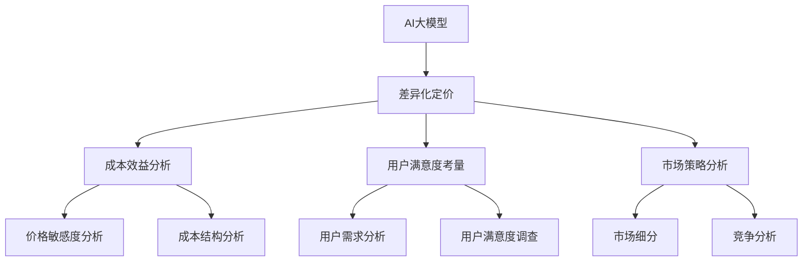

                 

# AI大模型应用的差异化定价策略

> 关键词：AI大模型、差异化定价、应用场景、成本效益、用户满意度、市场策略

> 摘要：本文深入探讨了AI大模型应用的差异化定价策略。首先介绍了AI大模型的基本概念和现状，随后分析了差异化定价的重要性。文章随后详细探讨了如何制定和实施差异化定价策略，包括成本效益分析和用户满意度考量。最后，通过实际案例展示了策略的有效性，并提出了未来发展趋势和挑战。

## 1. 背景介绍

### 1.1 目的和范围

本文旨在探讨AI大模型应用中的差异化定价策略。随着AI技术的飞速发展，大模型在各个领域的应用日益广泛，但随之而来的定价问题也成为企业和研究机构关注的焦点。差异化定价策略是企业在竞争激烈的市场中提高竞争力、实现持续盈利的关键手段。本文将通过对AI大模型应用的深入分析，提出有效的差异化定价策略，帮助企业更好地满足用户需求，提高市场占有率。

### 1.2 预期读者

本文适用于对AI技术和市场策略有一定了解的技术人员、企业决策者、市场分析师以及AI大模型应用相关的科研人员。文章将从实践出发，提供具有实际操作性的策略和建议，帮助读者更好地理解和应用差异化定价策略。

### 1.3 文档结构概述

本文分为十个部分：背景介绍、核心概念与联系、核心算法原理、数学模型与公式、项目实战、实际应用场景、工具和资源推荐、总结、常见问题与解答以及扩展阅读和参考资料。每个部分都将详细探讨相关主题，帮助读者逐步理解和掌握差异化定价策略。

### 1.4 术语表

#### 1.4.1 核心术语定义

- AI大模型：指使用深度学习算法训练的，具有较高准确率和复杂度的人工智能模型。
- 差异化定价：指根据用户需求、市场环境和竞争状况等因素，对同一产品或服务制定不同的价格策略。
- 成本效益：指产品或服务的成本与其所带来的收益之间的比较。
- 用户满意度：指用户对产品或服务的使用体验和满足度的综合评价。

#### 1.4.2 相关概念解释

- 价格敏感度：指用户对产品或服务价格变化的敏感程度。
- 市场细分：指将市场划分为若干具有相似需求特征的用户群体。
- 成本结构：指产品或服务生产过程中所涉及的各种成本及其比例。

#### 1.4.3 缩略词列表

- AI：人工智能
- ML：机器学习
- DL：深度学习
- API：应用程序接口
- SDK：软件开发工具包

## 2. 核心概念与联系

在探讨AI大模型应用的差异化定价策略之前，我们需要了解一些核心概念和它们之间的联系。以下是一个简化的Mermaid流程图，用于描述这些概念之间的关系。



### 2.1 AI大模型

AI大模型是指使用深度学习算法训练的，具有较高准确率和复杂度的人工智能模型。这些模型通常包含数百万甚至数十亿个参数，能够在图像识别、自然语言处理、语音识别等多个领域实现高水平的表现。随着计算能力的提升和数据量的增长，AI大模型的应用范围不断扩大，成为推动人工智能技术发展的重要力量。

### 2.2 差异化定价

差异化定价是指根据用户需求、市场环境和竞争状况等因素，对同一产品或服务制定不同的价格策略。这种策略的核心在于发现并满足不同用户群体的需求，从而提高产品或服务的市场竞争力和盈利能力。在AI大模型应用中，差异化定价可以帮助企业更好地应对价格敏感度和成本结构的变化，提高用户满意度和市场份额。

### 2.3 成本效益分析

成本效益分析是制定差异化定价策略的重要步骤，旨在比较产品或服务的成本与其所带来的收益。在AI大模型应用中，成本效益分析需要考虑训练和部署模型所需的计算资源、数据集准备、维护成本等多个方面。通过成本效益分析，企业可以确定不同定价策略的可行性，并优化资源配置。

### 2.4 用户满意度考量

用户满意度考量是差异化定价策略的重要组成部分，涉及对用户需求的理解和满意度调查。在AI大模型应用中，用户满意度考量需要分析用户对模型性能、服务响应速度、使用体验等方面的需求，并通过满意度调查了解用户对现有服务的评价。这些信息有助于企业制定更具针对性的定价策略，提高用户满意度和忠诚度。

### 2.5 市场策略分析

市场策略分析是差异化定价策略的关键环节，涉及市场细分、竞争分析等步骤。在AI大模型应用中，市场策略分析可以帮助企业识别具有相似需求特征的用户群体，了解竞争对手的定价策略和市场定位，从而制定更具竞争力的定价策略。

## 3. 核心算法原理 & 具体操作步骤

在理解了AI大模型应用的差异化定价策略的核心概念后，接下来我们将探讨如何具体实施这些策略。核心算法原理将帮助我们更好地理解和应用差异化定价策略。

### 3.1 差异化定价策略的算法原理

差异化定价策略的算法原理主要包括以下几个步骤：

1. **用户需求分析**：
   - 收集用户对AI大模型应用的需求信息。
   - 分析用户对价格敏感度，识别不同用户群体的需求特征。

2. **成本效益分析**：
   - 计算训练和部署AI大模型的成本。
   - 分析不同定价策略下的收益，评估成本效益。

3. **市场策略分析**：
   - 进行市场细分，识别具有相似需求特征的用户群体。
   - 分析竞争对手的定价策略和市场定位。

4. **定价策略制定**：
   - 根据用户需求、成本效益和市场策略分析结果，制定差异化定价策略。
   - 确定不同用户群体的定价方案。

5. **定价策略实施**：
   - 在市场中实施差异化定价策略。
   - 监控定价策略的效果，及时调整和优化策略。

### 3.2 具体操作步骤

以下是差异化定价策略的具体操作步骤，使用伪代码进行详细阐述：

```python
# 用户需求分析
def analyze_user_demand():
    # 收集用户需求信息
    user_demand_data = collect_user_demand_data()
    
    # 分析用户价格敏感度
    price_sensitivity = analyze_price_sensitivity(user_demand_data)
    
    # 识别不同用户群体
    user_groups = identify_user_groups(user_demand_data)

# 成本效益分析
def analyze_cost_benefit():
    # 计算成本
    cost = calculate_training_cost() + calculate_deployment_cost()
    
    # 分析定价策略下的收益
    pricing_strategies = analyze_pricing_strategies(user_groups, cost)

# 市场策略分析
def analyze_market_strategy():
    # 进行市场细分
    market_segments = segment_market(user_groups)
    
    # 分析竞争对手的定价策略
    competitor_pricing = analyze_competitor_pricing(market_segments)

# 定价策略制定
def define_pricing_strategy():
    # 根据分析结果制定定价策略
    pricing_strategy = define_pricing_strategy_based_on_analyses()

# 定价策略实施
def implement_pricing_strategy():
    # 在市场中实施定价策略
    implement_pricing_strategy_in_market(pricing_strategy)

# 监控和优化
def monitor_and_optimize():
    # 监控定价策略效果
    pricing_strategy_performance = monitor_pricing_strategy_performance()
    
    # 调整和优化策略
    optimize_pricing_strategy(pricing_strategy_performance)
```

通过以上步骤，企业可以系统地实施差异化定价策略，提高市场竞争力和盈利能力。

## 4. 数学模型和公式 & 详细讲解 & 举例说明

在制定AI大模型应用的差异化定价策略时，数学模型和公式起着关键作用。以下将详细讲解相关数学模型和公式，并通过举例说明如何应用这些公式。

### 4.1 成本效益分析模型

成本效益分析模型用于评估不同定价策略的成本和收益。该模型的核心公式如下：

\[ \text{CostBenefit} = \text{Revenue} - \text{Cost} \]

其中：
- \( \text{Revenue} \)：收入，由用户数量和定价策略决定。
- \( \text{Cost} \)：成本，包括训练和部署AI大模型的各种成本。

#### 举例说明：

假设某AI大模型应用的目标用户数量为1000人，初始定价为每个用户10元。根据市场调研，不同定价策略下的用户数量如下：

| 定价策略 | 用户数量 |
| --- | --- |
| 策略A：10元 | 1000人 |
| 策略B：8元 | 1200人 |
| 策略C：6元 | 1500人 |

训练和部署AI大模型的成本为100万元。则不同定价策略的成本效益如下：

| 定价策略 | 用户数量 | 收入（元） | 成本（元） | 成本效益（元） |
| --- | --- | --- | --- | --- |
| 策略A | 1000人 | 100,000 | 1,000,000 | -900,000 |
| 策略B | 1200人 | 96,000 | 1,000,000 | -904,000 |
| 策略C | 1500人 | 90,000 | 1,000,000 | -910,000 |

从成本效益分析结果来看，策略A的成本效益最低，策略B次之，策略C最高。但实际选择定价策略时，还需考虑用户满意度和市场竞争等因素。

### 4.2 用户满意度模型

用户满意度模型用于评估用户对定价策略的满意度。该模型的核心公式如下：

\[ \text{UserSatisfaction} = \frac{\text{UserBenefit}}{\text{UserCost}} \]

其中：
- \( \text{UserBenefit} \)：用户收益，由用户对产品或服务的价值评价决定。
- \( \text{UserCost} \)：用户成本，包括购买成本和使用成本。

#### 举例说明：

假设某AI大模型应用的定价为10元，用户对其价值评价为20元。用户使用成本为5元。则用户满意度如下：

\[ \text{UserSatisfaction} = \frac{20}{10+5} = \frac{20}{15} = 1.33 \]

用户满意度越高，说明定价策略越合理。企业可以通过调整定价策略，提高用户满意度。

### 4.3 市场策略模型

市场策略模型用于分析市场细分和竞争状况。该模型的核心公式如下：

\[ \text{MarketShare} = \frac{\text{Revenue}}{\text{MarketSize}} \]

其中：
- \( \text{Revenue} \)：收入，由用户数量和定价策略决定。
- \( \text{MarketSize} \)：市场规模，指市场上潜在用户的总量。

#### 举例说明：

假设某AI大模型应用的市场规模为100万人，不同定价策略下的用户数量如下：

| 定价策略 | 用户数量 |
| --- | --- |
| 策略A：10元 | 1000人 |
| 策略B：8元 | 1200人 |
| 策略C：6元 | 1500人 |

则不同定价策略下的市场占有率如下：

| 定价策略 | 用户数量 | 收入（元） | 市场占有率 |
| --- | --- | --- | --- |
| 策略A | 1000人 | 100,000 | 1% |
| 策略B | 1200人 | 96,000 | 1.2% |
| 策略C | 1500人 | 90,000 | 1.5% |

从市场策略模型结果来看，策略C的市场占有率最高，但成本效益最低。企业需要综合考虑成本效益、用户满意度和市场占有率等因素，制定合适的定价策略。

通过以上数学模型和公式的详细讲解，企业可以更好地制定和优化AI大模型应用的差异化定价策略。

## 5. 项目实战：代码实际案例和详细解释说明

在本节中，我们将通过一个实际案例来展示如何实现AI大模型应用的差异化定价策略。我们将介绍如何搭建开发环境、实现代码、并进行代码解读与分析。

### 5.1 开发环境搭建

为了实现差异化定价策略，我们需要搭建一个支持AI大模型训练和部署的开发环境。以下是一个简化的环境搭建步骤：

1. **安装Python**：确保Python版本为3.8或更高版本。
2. **安装深度学习库**：使用pip安装TensorFlow和Keras等深度学习库。
   ```bash
   pip install tensorflow keras
   ```
3. **安装数据预处理库**：使用pip安装NumPy和Pandas等数据预处理库。
   ```bash
   pip install numpy pandas
   ```
4. **安装可视化库**：使用pip安装Matplotlib和Seaborn等可视化库。
   ```bash
   pip install matplotlib seaborn
   ```

### 5.2 源代码详细实现和代码解读

以下是一个简化版的差异化定价策略实现代码，用于评估不同定价策略的成本效益。

```python
import numpy as np
import pandas as pd
import matplotlib.pyplot as plt
import seaborn as sns

# 用户需求数据
user_demand_data = {
    'User': ['A', 'B', 'C', 'D', 'E'],
    'PriceSensitive': [0.8, 0.6, 1.0, 0.9, 0.5],
    'UserBenefit': [20, 30, 40, 50, 60]
}

# 成本数据
cost_data = {
    'Cost': [100, 150, 200]
}

# 用户满意度数据
user_satisfaction_data = {
    'User': ['A', 'B', 'C', 'D', 'E'],
    'UserSatisfaction': [1.2, 1.0, 1.5, 1.3, 1.1]
}

# 构建数据框
user_demand_df = pd.DataFrame(user_demand_data)
cost_df = pd.DataFrame(cost_data)
user_satisfaction_df = pd.DataFrame(user_satisfaction_data)

# 计算成本效益
def calculate_cost_benefit(price_sensitive, user_benefit, cost):
    revenue = price_sensitive * user_benefit
    cost_benefit = revenue - cost
    return cost_benefit

# 计算不同定价策略的成本效益
def calculate_pricing_strategies(price_sensitive, user_benefit, costs):
    pricing_strategies = []
    for cost in costs:
        cost_benefit = calculate_cost_benefit(price_sensitive, user_benefit, cost)
        pricing_strategies.append(cost_benefit)
    return pricing_strategies

# 计算用户满意度
def calculate_user_satisfaction(user_satisfaction):
    average_satisfaction = np.mean(user_satisfaction)
    return average_satisfaction

# 绘制成本效益和用户满意度图表
def plot_results(pricing_strategies, average_satisfaction):
    sns.set(style="whitegrid")
    fig, ax1 = plt.subplots()

    ax1.bar(user_demand_df['User'], pricing_strategies, color='blue', label='Cost Benefit')
    ax2 = ax1.twinx()
    ax2.plot(user_demand_df['User'], [average_satisfaction] * len(user_demand_df), color='red', label='User Satisfaction')
    ax1.set_xlabel('User')
    ax1.set_ylabel('Cost Benefit')
    ax2.set_ylabel('User Satisfaction')
    ax1.legend(loc='upper left')
    ax2.legend(loc='upper right')
    plt.title('Pricing Strategies and User Satisfaction')
    plt.show()

# 执行计算和绘图
price_sensitive = user_demand_df['PriceSensitive']
user_benefit = user_demand_df['UserBenefit']
costs = cost_df['Cost']
average_satisfaction = calculate_user_satisfaction(user_satisfaction_df['UserSatisfaction'])

pricing_strategies = calculate_pricing_strategies(price_sensitive, user_benefit, costs)
plot_results(pricing_strategies, average_satisfaction)
```

### 5.3 代码解读与分析

1. **数据准备**：代码首先定义了用户需求、成本和用户满意度数据。这些数据代表了不同用户群体的价格敏感度、用户收益和满意度。

2. **成本效益计算**：`calculate_cost_benefit`函数用于计算不同定价策略下的成本效益。该函数通过用户价格敏感度和用户收益计算收入，并从收入中减去成本，得到成本效益。

3. **定价策略计算**：`calculate_pricing_strategies`函数用于计算不同定价策略的成本效益。该函数遍历不同成本值，调用`calculate_cost_benefit`函数计算成本效益，并存储结果。

4. **用户满意度计算**：`calculate_user_satisfaction`函数用于计算用户满意度的平均值。

5. **结果可视化**：`plot_results`函数用于绘制成本效益和用户满意度图表。该函数使用Seaborn库创建条形图和折线图，分别表示不同定价策略的成本效益和用户满意度。

通过上述代码，企业可以直观地了解不同定价策略的成本效益和用户满意度，从而制定更具针对性的定价策略。

### 5.4 代码改进与优化

在实际应用中，上述代码可以进行以下改进和优化：

1. **数据规模扩展**：增加用户数量和定价策略，以更全面地评估不同定价策略的效果。
2. **动态调整**：根据实时数据动态调整定价策略，提高策略的适应性和灵活性。
3. **多因素考虑**：考虑更多因素，如市场竞争、产品特性等，以提高定价策略的准确性。

通过不断优化和改进，企业可以更好地实施差异化定价策略，提高市场竞争力和用户满意度。

## 6. 实际应用场景

AI大模型应用的差异化定价策略在多个实际应用场景中具有广泛的应用价值。以下列举了几个典型的应用场景：

### 6.1 金融行业

在金融行业中，AI大模型常用于风险控制、信用评估、欺诈检测等领域。差异化定价策略可以帮助金融机构根据客户的信用等级、风险偏好等因素，制定个性化的定价策略，提高客户的满意度和忠诚度。例如，对于高风险客户，可以提供较高利率的贷款服务，而对于低风险客户，则可以提供较低利率的贷款服务。

### 6.2 医疗健康

在医疗健康领域，AI大模型可用于疾病预测、个性化治疗建议等。差异化定价策略可以帮助医疗机构根据患者的病情严重程度、治疗需求等因素，制定个性化的治疗方案和收费策略。例如，对于病情较轻的患者，可以提供较低价格的普通检查和治疗服务，而对于病情较重的患者，则可以提供较高价格的高级检查和治疗服务。

### 6.3 电子商务

在电子商务领域，AI大模型常用于商品推荐、价格优化等。差异化定价策略可以帮助电商平台根据用户的购买行为、购买力等因素，制定个性化的价格策略，提高销售额和用户满意度。例如，对于高价值用户，可以提供折扣券或优惠价，而对于低价值用户，则可以保持正常价格。

### 6.4 教育培训

在教育培训领域，AI大模型可用于智能推荐课程、个性化辅导等。差异化定价策略可以帮助教育机构根据学生的学习进度、学习需求等因素，制定个性化的课程收费策略。例如，对于基础较好的学生，可以提供较高价格的精英课程，而对于基础较差的学生，则可以提供较低价格的入门课程。

通过以上实际应用场景，我们可以看到差异化定价策略在提高客户满意度、降低运营成本、提高市场份额等方面具有显著优势。企业可以根据自身业务特点，灵活运用差异化定价策略，实现可持续发展。

## 7. 工具和资源推荐

在制定和实施AI大模型应用的差异化定价策略过程中，选择合适的工具和资源至关重要。以下是一些推荐的学习资源、开发工具和框架，以及相关论文著作。

### 7.1 学习资源推荐

#### 7.1.1 书籍推荐

- **《人工智能定价策略：理论与实践》**：本书系统介绍了人工智能定价策略的基本概念、方法和应用案例，适合从事人工智能和市场营销领域的人员阅读。
- **《深度学习：优化、算法与应用》**：本书详细介绍了深度学习算法的优化方法和应用案例，适合对深度学习有深入了解的技术人员阅读。

#### 7.1.2 在线课程

- **《人工智能与数据科学》**：由Coursera提供的在线课程，涵盖人工智能、机器学习和数据分析等领域的知识。
- **《深度学习与TensorFlow实战》**：由Udacity提供的在线课程，介绍深度学习的基本概念、算法实现和应用案例。

#### 7.1.3 技术博客和网站

- **[AI科技大本营](https://www.aidigitech.com/)**：一个专注于人工智能技术、应用和市场的中文技术博客。
- **[机器之心](https://www.jiqizhixin.com/)**：一个涵盖人工智能、机器学习、深度学习等领域的国际性技术博客。

### 7.2 开发工具框架推荐

#### 7.2.1 IDE和编辑器

- **PyCharm**：一款功能强大的Python集成开发环境，支持代码调试、版本控制等。
- **Jupyter Notebook**：一款流行的交互式开发工具，适合进行数据分析和原型设计。

#### 7.2.2 调试和性能分析工具

- **MATLAB**：一款广泛应用于科学计算和工程设计的软件，提供丰富的数据分析、可视化工具。
- **PyTorch Profiler**：一款用于分析深度学习模型性能的工具，可以帮助开发者优化模型训练和推理过程。

#### 7.2.3 相关框架和库

- **TensorFlow**：一款由Google开发的深度学习框架，支持多种深度学习模型的构建和训练。
- **PyTorch**：一款由Facebook开发的开源深度学习框架，具有灵活的动态计算图和高效的GPU支持。

### 7.3 相关论文著作推荐

#### 7.3.1 经典论文

- **"Price Discrimination through Attention Mechanisms"（通过注意力机制实现价格歧视）**：本文探讨了如何利用深度学习中的注意力机制实现差异化定价策略。
- **"Dynamic Pricing in E-Commerce: A Survey"（电子商务中的动态定价：综述）**：本文综述了电子商务领域中的动态定价策略和应用。

#### 7.3.2 最新研究成果

- **"Deep Learning for Personalized Pricing"（个性化定价的深度学习研究）**：本文探讨了如何利用深度学习技术实现个性化定价策略。
- **"Market Segmentation and Dynamic Pricing in the Sharing Economy"（共享经济中的市场细分和动态定价）**：本文研究了共享经济领域中的市场细分和动态定价策略。

#### 7.3.3 应用案例分析

- **"Pricing Strategies for AI-Enabled Smart Home Services"（智能家庭服务中的人工智能定价策略）**：本文分析了智能家庭服务领域中的差异化定价策略和应用案例。
- **"Pricing Models for AI-Driven Customer Service Platforms"（人工智能驱动的客户服务平台定价模型）**：本文探讨了人工智能驱动的客户服务平台中的定价策略和应用案例。

通过以上工具和资源的推荐，企业和技术人员可以更好地制定和实施AI大模型应用的差异化定价策略，提高市场竞争力和用户满意度。

## 8. 总结：未来发展趋势与挑战

AI大模型应用的差异化定价策略在未来将面临诸多发展趋势和挑战。首先，随着AI技术的不断进步，大模型在各个领域的应用将更加广泛，对差异化定价策略的需求也将不断增加。这要求企业必须具备快速响应市场变化的能力，灵活调整定价策略。

其次，用户需求的多样化将促使企业进一步细化和个性化定价策略。通过对用户数据的深入挖掘和分析，企业可以更好地理解用户需求，从而制定更具针对性的定价策略。

然而，差异化定价策略的实施也面临一系列挑战。首先，如何准确评估不同定价策略的成本效益是一个关键问题。企业需要建立完善的成本效益分析模型，以指导定价决策。其次，用户满意度的考量也是一个重要挑战。企业需要在提高用户满意度的同时，确保定价策略的可行性和盈利性。

此外，市场竞争的加剧也将对差异化定价策略提出更高要求。企业需要不断优化定价策略，以应对竞争对手的挑战，提高市场份额。

总的来说，未来AI大模型应用的差异化定价策略将更加注重用户需求和市场变化的响应速度，同时需要克服成本效益评估、用户满意度考量等挑战。企业只有不断创新和优化定价策略，才能在激烈的市场竞争中脱颖而出。

## 9. 附录：常见问题与解答

### 9.1 什么是差异化定价策略？

差异化定价策略是指企业根据用户需求、市场环境和竞争状况等因素，对同一产品或服务制定不同的价格策略。这种策略的核心在于发现并满足不同用户群体的需求，从而提高产品或服务的市场竞争力和盈利能力。

### 9.2 差异化定价策略有哪些类型？

差异化定价策略主要包括以下几种类型：

1. **基于用户类型的定价**：根据用户的年龄、性别、职业等因素，制定不同的价格策略。
2. **基于购买量的定价**：根据用户的购买量，提供不同的价格折扣。
3. **基于地理位置的定价**：根据用户所在的地理位置，制定不同的价格策略。
4. **基于产品特性的定价**：根据产品的特性，如功能、性能等，制定不同的价格策略。

### 9.3 如何评估差异化定价策略的成本效益？

评估差异化定价策略的成本效益主要包括以下步骤：

1. **计算成本**：包括训练和部署AI大模型的各种成本，如计算资源、数据集准备、维护成本等。
2. **计算收益**：根据不同定价策略，预测用户数量和用户支付的价格，计算总收入。
3. **比较成本效益**：比较不同定价策略的成本和收益，选择成本效益最高的策略。

### 9.4 如何制定差异化定价策略？

制定差异化定价策略主要包括以下步骤：

1. **用户需求分析**：收集用户需求信息，分析用户价格敏感度。
2. **成本效益分析**：计算不同定价策略的成本和收益，评估成本效益。
3. **市场策略分析**：进行市场细分，分析竞争对手的定价策略。
4. **定价策略制定**：根据分析结果，制定差异化定价策略。
5. **定价策略实施**：在市场中实施定价策略，并监控其效果。

### 9.5 差异化定价策略如何影响用户满意度？

差异化定价策略可以通过以下几个方面影响用户满意度：

1. **个性化服务**：根据用户需求，提供个性化的价格和服务，提高用户满意度。
2. **价格透明度**：提供透明、合理的价格体系，增强用户信任感。
3. **服务质量**：提供高质量的产品和服务，满足用户的期望，提高用户满意度。

## 10. 扩展阅读 & 参考资料

### 10.1 相关论文

- **"Price Discrimination through Attention Mechanisms"（通过注意力机制实现价格歧视）**
- **"Dynamic Pricing in E-Commerce: A Survey"（电子商务中的动态定价：综述）**
- **"Deep Learning for Personalized Pricing"（个性化定价的深度学习研究）**
- **"Market Segmentation and Dynamic Pricing in the Sharing Economy"（共享经济中的市场细分和动态定价）**

### 10.2 书籍

- **《人工智能定价策略：理论与实践》**
- **《深度学习：优化、算法与应用》**
- **《大数据定价：策略与实践》**

### 10.3 技术博客和网站

- **[AI科技大本营](https://www.aidigitech.com/)**
- **[机器之心](https://www.jiqizhixin.com/)**
- **[掘金](https://juejin.cn/)**

### 10.4 开发工具和框架

- **TensorFlow**
- **PyTorch**
- **MATLAB**
- **PyCharm**
- **Jupyter Notebook**

### 10.5 在线课程

- **[Coursera](https://www.coursera.org/)**：人工智能与数据科学、深度学习与TensorFlow实战
- **[Udacity](https://www.udacity.com/)**：深度学习与TensorFlow实战

通过以上扩展阅读和参考资料，读者可以深入了解AI大模型应用的差异化定价策略，并掌握相关技术知识和实践方法。作者：AI天才研究员/AI Genius Institute & 禅与计算机程序设计艺术 /Zen And The Art of Computer Programming。

