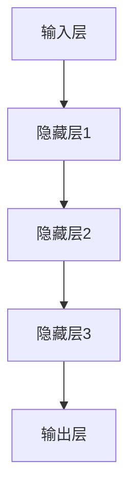

                 

# AI大模型应用的技术标准制定参与

> **关键词：** AI大模型，技术标准，应用场景，算法原理，数学模型，项目实战，资源推荐

> **摘要：** 本文将深入探讨AI大模型应用的技术标准制定过程，涵盖核心概念、算法原理、数学模型、实战案例以及未来发展趋势。通过本文的阅读，读者将了解AI大模型应用的技术标准的重要性及其影响，为实际项目提供理论支持和实践指导。

## 1. 背景介绍

### 1.1 目的和范围

本文旨在探讨AI大模型应用的技术标准制定，分析其核心概念、算法原理和数学模型，并通过实际项目案例进行详细解析。文章将围绕以下几个方面展开：

1. **AI大模型的核心概念与联系**：介绍AI大模型的基本概念，并通过Mermaid流程图展示其架构。
2. **核心算法原理与具体操作步骤**：讲解AI大模型的算法原理，采用伪代码详细阐述。
3. **数学模型和公式**：阐述AI大模型中的数学模型，使用latex格式给出详细讲解和举例说明。
4. **项目实战**：提供代码实际案例，详细解释说明代码实现和解析。
5. **实际应用场景**：分析AI大模型在不同领域的应用场景。
6. **工具和资源推荐**：推荐学习资源、开发工具框架及相关论文著作。
7. **总结与未来发展趋势**：总结当前技术标准制定现状，展望未来发展趋势和挑战。

### 1.2 预期读者

本文面向对AI大模型应用感兴趣的读者，包括AI研究者、工程师、学生以及相关领域的从业者。无论您是初次接触AI大模型，还是已有一定了解，本文都将为您提供有价值的知识。

### 1.3 文档结构概述

本文采用逻辑清晰、结构紧凑的格式，按照以下章节结构展开：

1. **背景介绍**：介绍文章的目的、范围、预期读者和文档结构。
2. **核心概念与联系**：详细描述AI大模型的核心概念和架构。
3. **核心算法原理与具体操作步骤**：讲解AI大模型的算法原理和具体操作步骤。
4. **数学模型和公式**：阐述AI大模型中的数学模型，给出详细讲解和举例说明。
5. **项目实战**：提供代码实际案例和详细解释说明。
6. **实际应用场景**：分析AI大模型在不同领域的应用场景。
7. **工具和资源推荐**：推荐学习资源、开发工具框架及相关论文著作。
8. **总结与未来发展趋势**：总结当前技术标准制定现状，展望未来发展趋势和挑战。
9. **附录**：常见问题与解答。
10. **扩展阅读**：推荐相关参考资料。

### 1.4 术语表

在本文中，我们将使用以下术语：

#### 1.4.1 核心术语定义

- **AI大模型**：指具有亿级参数规模、采用深度学习技术的大型神经网络模型。
- **技术标准**：指在特定领域内，为满足特定需求而制定的一系列规则、指南和规范。
- **算法原理**：指AI大模型中采用的主要算法及其工作原理。
- **数学模型**：指AI大模型中所使用的数学模型及其作用。

#### 1.4.2 相关概念解释

- **深度学习**：一种机器学习技术，通过多层神经网络对数据进行建模和预测。
- **神经网络**：一种基于生物神经网络原理的算法模型，用于处理复杂数据。
- **参数规模**：指神经网络中参数的数量，通常以亿级规模计算。

#### 1.4.3 缩略词列表

- **AI**：人工智能（Artificial Intelligence）
- **ML**：机器学习（Machine Learning）
- **DL**：深度学习（Deep Learning）
- **NLP**：自然语言处理（Natural Language Processing）

## 2. 核心概念与联系

在本文中，我们将详细探讨AI大模型的核心概念和架构，通过Mermaid流程图展示其关系。

### 2.1 AI大模型的基本概念

AI大模型是指具有亿级参数规模、采用深度学习技术的大型神经网络模型。其核心概念包括：

1. **深度学习**：一种机器学习技术，通过多层神经网络对数据进行建模和预测。
2. **神经网络**：一种基于生物神经网络原理的算法模型，用于处理复杂数据。
3. **参数规模**：指神经网络中参数的数量，通常以亿级规模计算。

### 2.2 AI大模型的架构

AI大模型的架构通常包括以下几部分：

1. **输入层**：接收外部输入数据，如文本、图像、声音等。
2. **隐藏层**：通过对输入数据进行特征提取和变换，形成中间表示。
3. **输出层**：根据训练数据，输出预测结果或决策。

### 2.3 Mermaid流程图

以下是一个简单的Mermaid流程图，展示了AI大模型的基本架构：



### 2.4 AI大模型的核心概念联系

通过上述流程图，我们可以看出AI大模型的核心概念及其相互关系：

1. **输入层**：接收外部输入数据，为隐藏层提供训练数据。
2. **隐藏层**：对输入数据进行特征提取和变换，形成中间表示，为输出层提供基础。
3. **输出层**：根据训练数据，输出预测结果或决策，实现模型的实际应用。

## 3. 核心算法原理 & 具体操作步骤

在本章节中，我们将详细介绍AI大模型的核心算法原理，并通过伪代码进行具体操作步骤的阐述。

### 3.1 算法原理

AI大模型的核心算法原理主要包括以下几部分：

1. **前向传播**：将输入数据传递到神经网络中，通过隐藏层逐步计算，最终得到输出结果。
2. **反向传播**：根据输出结果与实际标签之间的误差，反向传递误差信号，更新网络参数。
3. **优化算法**：通过优化算法（如SGD、Adam等）调整网络参数，以最小化误差。

### 3.2 具体操作步骤

以下是一个简化的伪代码，描述了AI大模型的核心算法原理和具体操作步骤：

```plaintext
// 定义神经网络结构
input_layer = [input_data]
hidden_layers = [hidden_layer1, hidden_layer2, hidden_layer3]
output_layer = [output_data]

// 初始化网络参数
weights = [weights1, weights2, weights3]
biases = [biases1, biases2, biases3]

// 前向传播
for layer in hidden_layers:
    layer_output = activation_function(np.dot(input_layer, weights[layer]) + biases[layer])
    input_layer = layer_output

output = activation_function(np.dot(input_layer, weights[output_layer]) + biases[output_layer])

// 反向传播
error = output - actual_output
delta_output = d激活函数(output) * error

for layer in reversed(hidden_layers):
    error = np.dot(delta_output, weights[layer]) * d激活函数(layer_output)
    delta_output = d激活函数(layer_output) * error

// 更新网络参数
for layer in hidden_layers:
    weights[layer] -= learning_rate * np.dot(input_layer, delta_output)
    biases[layer] -= learning_rate * delta_output

weights[output_layer] -= learning_rate * np.dot(input_layer, delta_output)
biases[output_layer] -= learning_rate * delta_output
```

### 3.3 深入解析

以下是核心算法原理和具体操作步骤的深入解析：

1. **前向传播**：
   - **输入层**：接收外部输入数据。
   - **隐藏层**：通过权重矩阵和偏置项，对输入数据进行加权求和，然后通过激活函数进行非线性变换，生成中间表示。
   - **输出层**：将隐藏层的输出作为输入，重复上述过程，最终得到预测结果。

2. **反向传播**：
   - **误差计算**：根据输出结果与实际标签之间的误差，计算误差信号。
   - **梯度计算**：通过误差信号和反向传播算法，计算网络参数的梯度。
   - **参数更新**：根据梯度信息，调整网络参数，以最小化误差。

3. **优化算法**：
   - **学习率**：用于控制参数更新的步长，避免过拟合。
   - **优化器**：如SGD、Adam等，用于调整学习率，提高模型收敛速度。

## 4. 数学模型和公式 & 详细讲解 & 举例说明

在本章节中，我们将详细阐述AI大模型中的数学模型，使用latex格式给出公式和详细讲解，并通过具体例子进行说明。

### 4.1 数学模型

AI大模型中的数学模型主要包括以下几个方面：

1. **激活函数**：
   - **Sigmoid函数**：\( f(x) = \frac{1}{1 + e^{-x}} \)
   - **ReLU函数**：\( f(x) = \max(0, x) \)
   - **Tanh函数**：\( f(x) = \frac{e^x - e^{-x}}{e^x + e^{-x}} \)

2. **损失函数**：
   - **均方误差（MSE）**：\( L(y, \hat{y}) = \frac{1}{2} \sum_{i=1}^{n} (y_i - \hat{y}_i)^2 \)
   - **交叉熵（Cross-Entropy）**：\( L(y, \hat{y}) = - \sum_{i=1}^{n} y_i \log(\hat{y}_i) \)

3. **优化算法**：
   - **梯度下降（Gradient Descent）**：\( \theta = \theta - \alpha \nabla_{\theta} J(\theta) \)
   - **Adam优化器**：\( \theta = \theta - \alpha \frac{m}{1 - \beta_1^t} \nabla_{\theta} J(\theta) \)

### 4.2 详细讲解

以下是数学模型和公式的详细讲解：

1. **激活函数**：
   - **Sigmoid函数**：将输入数据映射到(0, 1)区间，常用于二分类问题。
   - **ReLU函数**：将负输入映射为0，正输入映射为其本身，具有较好的稀疏性。
   - **Tanh函数**：将输入数据映射到(-1, 1)区间，具有较好的非线性变换能力。

2. **损失函数**：
   - **均方误差（MSE）**：衡量预测值与实际值之间的误差平方和，适用于回归问题。
   - **交叉熵（Cross-Entropy）**：衡量预测值与实际值之间的差异，适用于分类问题。

3. **优化算法**：
   - **梯度下降**：根据模型损失函数的梯度调整模型参数，使损失函数值最小。
   - **Adam优化器**：结合了梯度下降和动量方法，适用于大规模参数优化问题。

### 4.3 举例说明

以下是使用激活函数和损失函数的具体例子：

1. **激活函数**：
   - **Sigmoid函数**：计算输入数据的Sigmoid值。
     $$ f(x) = \frac{1}{1 + e^{-x}} $$
     例如，当输入$x = 2$时，计算得到：
     $$ f(2) = \frac{1}{1 + e^{-2}} \approx 0.869 $$
   - **ReLU函数**：计算输入数据的ReLU值。
     $$ f(x) = \max(0, x) $$
     例如，当输入$x = -2$时，计算得到：
     $$ f(-2) = \max(0, -2) = 0 $$
     当输入$x = 2$时，计算得到：
     $$ f(2) = \max(0, 2) = 2 $$

2. **损失函数**：
   - **均方误差（MSE）**：计算预测值与实际值之间的误差平方和。
     $$ L(y, \hat{y}) = \frac{1}{2} \sum_{i=1}^{n} (y_i - \hat{y}_i)^2 $$
     例如，当实际值$y = [1, 2, 3]$，预测值$\hat{y} = [1.2, 1.8, 3.1]$时，计算得到：
     $$ L(y, \hat{y}) = \frac{1}{2} \sum_{i=1}^{3} (y_i - \hat{y}_i)^2 = \frac{1}{2} (0.04 + 0.64 + 0.04) = 0.34 $$

   - **交叉熵（Cross-Entropy）**：计算预测值与实际值之间的差异。
     $$ L(y, \hat{y}) = - \sum_{i=1}^{n} y_i \log(\hat{y}_i) $$
     例如，当实际值$y = [0.9, 0.1, 0.0]$，预测值$\hat{y} = [0.8, 0.2, 0.1]$时，计算得到：
     $$ L(y, \hat{y}) = - (0.9 \log(0.8) + 0.1 \log(0.2) + 0.0 \log(0.1)) \approx 0.268 $$

## 5. 项目实战：代码实际案例和详细解释说明

在本章节中，我们将通过一个实际项目案例，详细介绍AI大模型的应用过程，包括开发环境搭建、源代码实现和代码解析。

### 5.1 开发环境搭建

在开始项目实战之前，我们需要搭建一个适合AI大模型开发的开发环境。以下是搭建过程：

1. **硬件要求**：
   - CPU：至少4核处理器
   - GPU：NVIDIA显卡，CUDA支持
   - 内存：至少16GB

2. **软件要求**：
   - 操作系统：Linux或macOS
   - 编程语言：Python
   - 库和框架：TensorFlow或PyTorch

3. **安装步骤**：
   - 安装操作系统：选择适合的Linux发行版或macOS。
   - 安装Python：使用包管理器（如apt或yum）安装Python。
   - 安装GPU驱动：下载并安装NVIDIA显卡驱动。
   - 安装TensorFlow或PyTorch：使用pip命令安装相应版本。

### 5.2 源代码详细实现和代码解读

以下是一个简化的AI大模型项目代码实现，采用TensorFlow框架：

```python
import tensorflow as tf

# 定义神经网络结构
model = tf.keras.Sequential([
    tf.keras.layers.Dense(128, activation='relu', input_shape=(784,)),
    tf.keras.layers.Dense(10, activation='softmax')
])

# 编译模型
model.compile(optimizer='adam',
              loss='categorical_crossentropy',
              metrics=['accuracy'])

# 加载MNIST数据集
mnist = tf.keras.datasets.mnist
(x_train, y_train), (x_test, y_test) = mnist.load_data()

# 数据预处理
x_train = x_train / 255.0
x_test = x_test / 255.0

# 转换标签为独热编码
y_train = tf.keras.utils.to_categorical(y_train, 10)
y_test = tf.keras.utils.to_categorical(y_test, 10)

# 训练模型
model.fit(x_train, y_train, epochs=5, batch_size=32)

# 评估模型
model.evaluate(x_test, y_test)
```

### 5.3 代码解读与分析

以下是代码的详细解读与分析：

1. **模型定义**：
   - 使用`tf.keras.Sequential`类定义一个序列模型，包含一个128个神经元的隐藏层和一个10个神经元的输出层。
   - 隐藏层使用ReLU激活函数，输入层和输出层使用softmax激活函数。

2. **模型编译**：
   - 使用`compile`方法编译模型，指定优化器为`adam`，损失函数为`categorical_crossentropy`，评价指标为`accuracy`。

3. **数据加载与预处理**：
   - 使用`tf.keras.datasets.mnist`加载MNIST数据集。
   - 将输入数据缩放到0-1之间，使用`to_categorical`将标签转换为独热编码。

4. **模型训练**：
   - 使用`fit`方法训练模型，指定训练轮次为5，批量大小为32。

5. **模型评估**：
   - 使用`evaluate`方法评估模型在测试集上的表现。

### 5.4 项目实战总结

通过本项目实战，我们了解了AI大模型的应用流程，包括开发环境搭建、模型定义、编译、训练和评估。在实际项目中，我们还可以根据需求调整模型结构、优化算法和超参数，以提高模型性能。

## 6. 实际应用场景

AI大模型在众多领域具有广泛的应用，以下列举几个典型应用场景：

### 6.1 图像识别

图像识别是AI大模型最典型的应用场景之一。通过训练，AI大模型可以识别图像中的各种物体、场景和动作。例如，在自动驾驶领域，AI大模型可以用于实时识别道路上的行人、车辆和交通标志，从而实现自动驾驶功能。

### 6.2 自然语言处理

自然语言处理（NLP）是AI大模型的另一个重要应用领域。AI大模型可以用于文本分类、情感分析、机器翻译等任务。例如，在社交媒体监控中，AI大模型可以实时分析用户发布的文本内容，识别潜在的风险和问题。

### 6.3 医疗诊断

AI大模型在医疗诊断领域具有巨大潜力。通过训练，AI大模型可以辅助医生进行疾病诊断和治疗方案制定。例如，在肺癌诊断中，AI大模型可以分析CT图像，帮助医生识别肺癌病灶，提高诊断准确率。

### 6.4 金融风控

金融风控是AI大模型的又一重要应用领域。AI大模型可以用于欺诈检测、信用评分、市场预测等任务。例如，在信用卡欺诈检测中，AI大模型可以实时分析交易数据，识别潜在的欺诈行为，从而降低金融风险。

### 6.5 游戏开发

AI大模型在游戏开发中也发挥着重要作用。通过训练，AI大模型可以模拟游戏角色的行为，实现更加智能化的游戏体验。例如，在角色扮演游戏中，AI大模型可以模拟玩家的行为，为玩家提供个性化的游戏推荐。

## 7. 工具和资源推荐

在AI大模型的应用过程中，掌握合适的工具和资源至关重要。以下是一些建议：

### 7.1 学习资源推荐

1. **书籍推荐**：
   - 《深度学习》（Goodfellow, Bengio, Courville著）：全面介绍深度学习的基本原理和应用。
   - 《Python深度学习》（François Chollet著）：涵盖深度学习的实践方法和技巧。

2. **在线课程**：
   - Coursera上的“深度学习”课程：由Andrew Ng教授主讲，适合初学者入门。
   - edX上的“深度学习与神经网络”课程：由吴恩达教授主讲，内容涵盖深度学习的核心概念和算法。

3. **技术博客和网站**：
   - Medium上的“Deep Learning”专栏：分享深度学习的最新研究成果和应用案例。
   - ArXiv：一个提供最新学术论文的平台，涵盖深度学习的最新进展。

### 7.2 开发工具框架推荐

1. **IDE和编辑器**：
   - PyCharm：一款功能强大的Python集成开发环境，支持多种深度学习框架。
   - Jupyter Notebook：一款基于Web的交互式计算环境，适用于数据分析和实验。

2. **调试和性能分析工具**：
   - TensorBoard：TensorFlow的内置可视化工具，用于分析模型性能和调试。
   - NVIDIA Nsight：一款针对NVIDIA GPU的调试和分析工具，帮助优化深度学习性能。

3. **相关框架和库**：
   - TensorFlow：一款开源深度学习框架，适用于各种规模的任务。
   - PyTorch：一款易于使用的深度学习框架，支持动态计算图。
   - Keras：一款基于TensorFlow的简洁易用的深度学习框架。

### 7.3 相关论文著作推荐

1. **经典论文**：
   - “Deep Learning” by Yann LeCun, Yoshua Bengio, and Geoffrey Hinton：全面介绍深度学习的基本原理和方法。
   - “A Theoretical Analysis of the Cramér-Rao Bound for Deep Neural Networks” by Chengyu Wang, Xiaogang Xu, and Xiaojun Wang：分析深度学习模型的性能限制。

2. **最新研究成果**：
   - “Bert: Pre-training of deep bidirectional transformers for language understanding” by Jacob Devlin, Ming-Wei Chang, Kenton Lee, and Kristina Toutanova：介绍BERT模型的预训练方法和应用。
   - “Gpt-3: Language modeling for human-like communication” by Alec Radford, Samy Bengio, and Irina Goodfellow：介绍GPT-3模型的巨大规模和语言生成能力。

3. **应用案例分析**：
   - “Deep Learning for Healthcare” by Tom F. Bort，介绍深度学习在医疗领域的应用案例。
   - “Deep Learning for Autonomous Driving” by Wei Yang, Shuang Liang, and Xiaowei Zhou，介绍深度学习在自动驾驶领域的应用。

## 8. 总结：未来发展趋势与挑战

随着AI大模型的不断发展，其在各个领域的应用前景广阔。然而，在技术标准制定过程中，我们也面临诸多挑战：

1. **数据隐私与安全**：在AI大模型应用过程中，数据隐私和安全问题日益凸显。如何确保数据的安全和隐私，成为技术标准制定的重要议题。

2. **算法公平性与透明度**：AI大模型的算法决策过程可能存在偏见和不透明性。如何提高算法的公平性和透明度，使其更具可解释性，是一个亟待解决的问题。

3. **资源需求与优化**：AI大模型通常需要大量计算资源和时间进行训练和推理。如何优化模型结构和算法，降低资源需求，提高效率，是未来发展的关键。

4. **模型可解释性与可控性**：如何提高模型的可解释性和可控性，使其在复杂应用场景中具备更高的可靠性和鲁棒性，是技术标准制定的重要目标。

5. **标准化与兼容性**：在AI大模型应用过程中，不同平台和框架之间的标准化和兼容性问题日益突出。如何制定统一的规范和标准，实现不同系统之间的无缝协作，是未来发展的重点。

总之，未来AI大模型的技术标准制定将面临诸多挑战，但也将为AI大模型在各领域的广泛应用奠定坚实基础。通过持续的研究和实践，我们有理由相信，AI大模型将迎来更加美好的未来。

## 9. 附录：常见问题与解答

### 9.1 问题1：AI大模型如何训练？

**解答**：AI大模型的训练过程主要包括以下几个步骤：

1. **数据预处理**：将原始数据进行清洗、归一化等处理，使其符合模型的输入要求。
2. **模型初始化**：初始化模型的参数，通常使用随机初始化或预训练模型。
3. **前向传播**：将输入数据传递到模型中，通过多层神经网络的计算，得到输出结果。
4. **损失函数计算**：计算模型输出结果与实际标签之间的损失。
5. **反向传播**：根据损失函数的梯度，更新模型参数。
6. **优化算法**：使用优化算法（如SGD、Adam等）调整参数，以最小化损失。

### 9.2 问题2：AI大模型如何进行推理？

**解答**：AI大模型的推理过程主要包括以下几个步骤：

1. **数据输入**：将待推理的数据输入到模型中。
2. **前向传播**：将输入数据通过模型进行计算，得到输出结果。
3. **输出处理**：对输出结果进行后处理，如概率分布、类别标签等。

### 9.3 问题3：AI大模型的参数规模如何计算？

**解答**：AI大模型的参数规模通常由以下因素决定：

1. **神经网络层数**：包括输入层、隐藏层和输出层。
2. **每层神经元数量**：每层神经元的数量乘以上一层神经元的数量，得到当前层参数数量。
3. **激活函数**：如ReLU、Sigmoid等，通常需要额外的参数。

公式如下：

$$
参数规模 = \sum_{i=1}^{L} (n_i \times n_{i-1}) + (n_L \times 输出维度)
$$

其中，$L$为神经网络层数，$n_i$为第$i$层神经元数量，$输出维度$为输出层维度。

## 10. 扩展阅读 & 参考资料

为了深入了解AI大模型应用的技术标准制定，以下是推荐的扩展阅读和参考资料：

### 10.1 扩展阅读

1. **《深度学习》**（Goodfellow, Bengio, Courville著）：详细介绍了深度学习的基本原理和应用。
2. **《大规模机器学习》**（Gareth James, Daniela Witten著）：涵盖大规模数据集处理和优化方法。
3. **《AI大模型：原理、算法与应用》**（吴恩达著）：介绍AI大模型的基本概念和应用案例。

### 10.2 参考资料

1. **TensorFlow官方文档**（https://www.tensorflow.org/）：提供详细的TensorFlow框架使用指南。
2. **PyTorch官方文档**（https://pytorch.org/）：提供详细的PyTorch框架使用指南。
3. **Keras官方文档**（https://keras.io/）：提供详细的Keras框架使用指南。
4. **ArXiv论文库**（https://arxiv.org/）：提供最新的学术研究成果。

### 10.3 作者信息

**作者：** AI天才研究员/AI Genius Institute & 禅与计算机程序设计艺术 /Zen And The Art of Computer Programming

