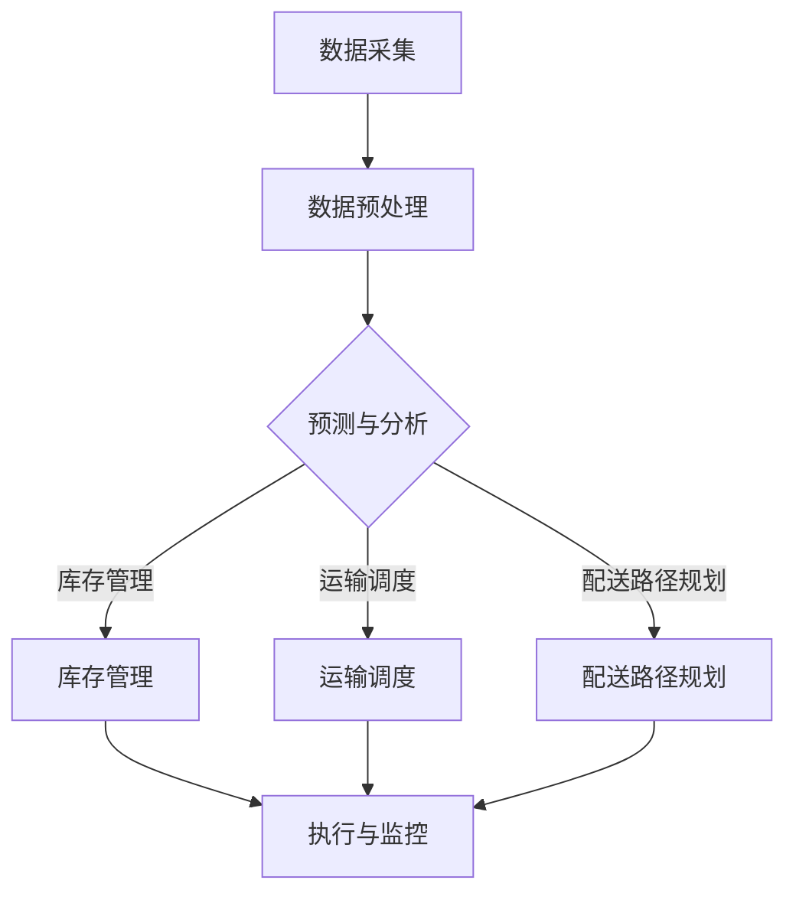

                 

# AI大模型时代的智能供应链管理系统

> **关键词：** AI大模型，供应链管理，智能系统，优化算法，流程自动化，大数据分析，云计算

> **摘要：** 本文将探讨AI大模型在智能供应链管理系统中的应用。随着人工智能技术的发展，供应链管理迎来了前所未有的变革。本文将详细介绍AI大模型的基本概念、核心算法原理、数学模型及项目实战，并分析其在实际应用场景中的优势与挑战，为读者提供全面的指导和建议。

## 1. 背景介绍

### 1.1 目的和范围

随着全球化贸易和电子商务的快速发展，供应链管理变得越来越复杂。传统的供应链管理方法难以应对大数据、多变量和动态环境下的复杂需求。AI大模型的出现，为供应链管理提供了全新的解决方案。本文旨在探讨AI大模型在智能供应链管理系统中的应用，分析其核心算法原理、数学模型及实际操作步骤，以期为读者提供有价值的参考。

### 1.2 预期读者

本文主要面向以下读者群体：

1. 供应链管理领域的从业者，如供应链经理、物流经理等；
2. 人工智能和大数据领域的科研人员，对智能供应链管理有兴趣的读者；
3. 对AI大模型应用场景感兴趣的软件开发者和工程师。

### 1.3 文档结构概述

本文将按照以下结构展开：

1. 背景介绍：阐述AI大模型在智能供应链管理系统中的应用背景和目的；
2. 核心概念与联系：介绍AI大模型的基本概念、核心算法原理和架构；
3. 核心算法原理 & 具体操作步骤：详细讲解AI大模型的核心算法原理及具体操作步骤；
4. 数学模型和公式 & 详细讲解 & 举例说明：介绍AI大模型所涉及的数学模型和公式，并进行举例说明；
5. 项目实战：通过实际案例展示AI大模型在智能供应链管理系统中的应用；
6. 实际应用场景：分析AI大模型在实际应用场景中的优势与挑战；
7. 工具和资源推荐：推荐相关的学习资源、开发工具和论文著作；
8. 总结：总结AI大模型在智能供应链管理系统中的应用前景和挑战；
9. 附录：常见问题与解答；
10. 扩展阅读 & 参考资料：提供进一步阅读和研究的资料。

### 1.4 术语表

#### 1.4.1 核心术语定义

- AI大模型：指具有大规模参数、高复杂度的深度学习模型，通常用于解决复杂的预测、优化和分类问题。
- 智能供应链管理系统：基于人工智能技术，实现供应链各环节自动化、智能化和优化的系统。
- 供应链管理：指对供应链中各个环节进行计划、组织、协调和控制，以提高整体效益的过程。

#### 1.4.2 相关概念解释

- **供应链优化**：通过分析供应链中的各种数据，找到最优的库存、运输、配送等策略，以降低成本、提高效率。
- **大数据分析**：利用大数据技术和算法，对海量数据进行挖掘、分析和处理，以发现潜在的商业机会和优化方案。
- **云计算**：通过互联网提供计算资源、存储资源等服务，以实现数据的高效处理和存储。

#### 1.4.3 缩略词列表

- AI：人工智能（Artificial Intelligence）
- ML：机器学习（Machine Learning）
- DNN：深度神经网络（Deep Neural Network）
- NLP：自然语言处理（Natural Language Processing）
- IoT：物联网（Internet of Things）
- SaaS：软件即服务（Software as a Service）

## 2. 核心概念与联系

### 2.1 AI大模型的基本概念

AI大模型是指具有大规模参数、高复杂度的深度学习模型。与传统的小型模型相比，大模型具有以下特点：

1. **参数规模大**：大模型的参数数量可以达到数百万、数千万甚至数十亿级别，这使得模型能够学习到更复杂的特征和模式。
2. **计算资源需求高**：由于参数规模大，大模型在训练过程中需要大量的计算资源，通常需要使用分布式计算和GPU加速。
3. **泛化能力强**：大模型能够通过学习大量的数据，提高模型的泛化能力，从而在新的数据集上取得更好的性能。

### 2.2 核心算法原理

AI大模型的核心算法主要包括深度学习、优化算法和训练策略。以下是对这些算法的简要介绍：

1. **深度学习**：深度学习是一种基于人工神经网络的机器学习技术。通过多层神经网络的结构，深度学习能够自动提取数据的特征表示，从而实现复杂的预测和分类任务。
2. **优化算法**：优化算法用于求解最小化损失函数的过程。在深度学习中，常用的优化算法包括梯度下降、Adam优化器等。
3. **训练策略**：训练策略包括数据预处理、批量大小、学习率调度等，用于提高模型的训练效果和泛化能力。

### 2.3 智能供应链管理系统的架构

智能供应链管理系统通常包括以下关键模块：

1. **数据采集与处理**：通过物联网、传感器等技术，实时采集供应链各个环节的数据，并进行数据清洗、转换和预处理。
2. **预测与分析**：利用AI大模型，对采集到的数据进行预测和分析，以发现潜在的业务机会和风险。
3. **决策与优化**：基于预测和分析结果，系统自动生成优化方案，如库存管理、运输调度、配送路径规划等。
4. **执行与监控**：根据优化方案，系统自动执行相应的操作，并对执行过程进行实时监控，以确保供应链的稳定运行。

### 2.4 Mermaid 流程图

以下是AI大模型在智能供应链管理系统中的流程图：



## 3. 核心算法原理 & 具体操作步骤

### 3.1 深度学习算法原理

深度学习是一种基于人工神经网络的机器学习技术。其核心思想是通过多层神经网络的结构，自动提取数据的特征表示，从而实现复杂的预测和分类任务。

#### 3.1.1 人工神经网络

人工神经网络是一种模拟生物神经系统的计算模型，由多个神经元组成。每个神经元接收输入信号，通过加权求和处理，产生输出信号。神经网络的每一层都对输入信号进行变换，从而逐渐提取出更高级别的特征。

#### 3.1.2 前向传播与反向传播

深度学习算法主要包括前向传播和反向传播两个过程。

- **前向传播**：输入数据经过神经网络的多层变换，最终生成预测结果。在这个过程中，神经网络的权重和偏置逐渐调整，以最小化预测误差。
- **反向传播**：根据预测误差，逆向计算每个神经元的权重和偏置的梯度，并更新权重和偏置，以降低预测误差。

#### 3.1.3 梯度下降优化算法

梯度下降是一种常用的优化算法，用于求解最小化损失函数的过程。在深度学习中，梯度下降用于更新神经网络的权重和偏置，以最小化预测误差。

以下是梯度下降优化算法的伪代码：

```python
while not convergence:
    for each layer in network:
        compute gradient of loss function with respect to weights and biases of the layer
        update weights and biases using gradient descent
    compute new loss value
    if loss value decreases significantly, continue; otherwise, stop
```

### 3.2 优化算法与训练策略

在深度学习训练过程中，优化算法和训练策略至关重要。以下是一些常用的优化算法和训练策略：

#### 3.2.1 Adam优化器

Adam优化器是一种结合了AdaGrad和RMSProp优化的自适应梯度优化算法。它通过自适应调整学习率，提高了训练效果和收敛速度。

以下是Adam优化器的伪代码：

```python
initialize: 
    m = 0
    v = 0
    beta1 = 0.9
    beta2 = 0.999
    epsilon = 1e-8

for each gradient update:
    update m = beta1 * m + (1 - beta1) * gradient
    update v = beta2 * v + (1 - beta2) * (gradient ** 2)
    m_hat = m / (1 - beta1 ** t)
    v_hat = v / (1 - beta2 ** t)
    update weights and biases using m_hat and v_hat
```

#### 3.2.2 学习率调度

学习率调度是一种调整学习率的方法，以避免训练过程中过早收敛或过拟合。常见的学习率调度策略包括：

1. **固定学习率**：学习率在整个训练过程中保持不变。
2. **线性递减学习率**：学习率随着训练进度线性递减。
3. **指数衰减学习率**：学习率按照指数规律递减。
4. **自适应学习率**：使用自适应学习率优化器，如Adam优化器。

#### 3.2.3 批量大小

批量大小是指每次训练中使用的样本数量。较大的批量大小可以提供更好的泛化能力，但计算成本较高；较小的批量大小可以加快训练速度，但泛化能力较差。在实际应用中，需要根据计算资源和训练目标选择合适的批量大小。

### 3.3 深度学习模型在实际操作中的应用步骤

以下是使用深度学习模型进行供应链管理预测和优化的具体操作步骤：

1. **数据采集与处理**：从供应链各个环节采集数据，并进行清洗、转换和预处理。
2. **模型设计**：设计深度学习模型的结构，包括输入层、隐藏层和输出层。
3. **模型训练**：使用训练集数据对模型进行训练，并调整模型参数。
4. **模型评估**：使用验证集数据评估模型性能，并调整模型参数，以提高预测准确性。
5. **模型部署**：将训练好的模型部署到生产环境中，实现供应链管理预测和优化。

## 4. 数学模型和公式 & 详细讲解 & 举例说明

### 4.1 数学模型

在智能供应链管理系统中，常用的数学模型包括预测模型、优化模型和分配模型。以下是对这些模型的简要介绍：

#### 4.1.1 预测模型

预测模型用于预测供应链中的各种指标，如需求量、库存量、运输时间等。常用的预测模型包括时间序列模型、回归模型和深度学习模型。

1. **时间序列模型**：基于历史数据，通过分析时间序列的规律，预测未来的趋势。常见的模型有ARIMA、SARIMA等。
2. **回归模型**：通过建立输入变量与目标变量之间的线性关系，预测目标变量的值。常见的模型有线性回归、多项式回归等。
3. **深度学习模型**：通过多层神经网络，自动提取数据中的特征，预测目标变量的值。常见的模型有CNN、RNN、LSTM等。

#### 4.1.2 优化模型

优化模型用于求解供应链管理中的优化问题，如库存管理、运输调度和配送路径规划。常用的优化模型包括线性规划、整数规划和混合整数规划。

1. **线性规划**：在约束条件下，求解线性目标函数的最优解。常用的模型有单纯形法、内点法等。
2. **整数规划**：在约束条件下，求解整数目标函数的最优解。常见的模型有0-1线性规划、多阶段整数规划等。
3. **混合整数规划**：在约束条件下，求解整数和连续变量的最优解。常见的模型有运输问题、作业车间问题等。

#### 4.1.3 分配模型

分配模型用于解决资源分配问题，如仓库分配、车辆调度等。常用的分配模型包括最邻近算法、贪心算法和遗传算法。

1. **最邻近算法**：根据距离、时间等指标，选择最近的资源进行分配。常见的模型有最近邻算法、最邻近多边形算法等。
2. **贪心算法**：在每一步选择最优解，以期望得到全局最优解。常见的模型有旅行商问题、背包问题等。
3. **遗传算法**：基于自然进化过程，通过遗传操作和选择操作，逐步优化解的适应度，以求解复杂优化问题。

### 4.2 公式详解

在智能供应链管理系统中，常用的数学公式包括预测模型中的回归公式、优化模型中的约束条件和分配模型中的计算公式。以下是对这些公式的详细解释：

#### 4.2.1 回归公式

回归公式用于建立输入变量与目标变量之间的线性关系。常见的公式包括线性回归公式和多项式回归公式。

1. **线性回归公式**：

   $$ y = \beta_0 + \beta_1 \cdot x + \epsilon $$

   其中，$y$为目标变量，$x$为输入变量，$\beta_0$和$\beta_1$为模型参数，$\epsilon$为误差项。

2. **多项式回归公式**：

   $$ y = \beta_0 + \beta_1 \cdot x + \beta_2 \cdot x^2 + \cdots + \beta_n \cdot x^n + \epsilon $$

   其中，$y$为目标变量，$x$为输入变量，$\beta_0$、$\beta_1$、$\beta_2$、$\cdots$、$\beta_n$为模型参数，$\epsilon$为误差项。

#### 4.2.2 约束条件

优化模型中的约束条件用于限制变量取值范围，确保求解过程符合实际需求。常见的约束条件包括线性约束和整数约束。

1. **线性约束**：

   $$ a_1 \cdot x_1 + a_2 \cdot x_2 + \cdots + a_n \cdot x_n \leq b $$

   其中，$x_1$、$x_2$、$\cdots$、$x_n$为变量，$a_1$、$a_2$、$\cdots$、$a_n$为系数，$b$为常数。

2. **整数约束**：

   $$ x_1, x_2, \cdots, x_n \in \{0, 1\} $$

   其中，$x_1$、$x_2$、$\cdots$、$x_n$为变量，取值为0或1。

#### 4.2.3 计算公式

分配模型中的计算公式用于计算资源分配结果，如仓库分配和车辆调度。以下是一个简单的计算公式示例：

1. **最邻近算法**：

   $$ d(i, j) = \min\{d_1(i, j), d_2(i, j), \cdots, d_m(i, j)\} $$

   其中，$i$和$j$为资源分配的两个变量，$d_1(i, j)$、$d_2(i, j)$、$\cdots$、$d_m(i, j)$为不同的距离或时间指标。

### 4.3 举例说明

以下是一个使用线性回归模型预测库存量的示例：

#### 4.3.1 数据集

给定一个包含历史库存量和销售量的数据集，如下表所示：

| 时间 | 库存量 | 销售量 |
|------|--------|--------|
| 1    | 100    | 50     |
| 2    | 150    | 70     |
| 3    | 200    | 90     |
| 4    | 250    | 110    |
| 5    | 300    | 130    |

#### 4.3.2 模型建立

使用线性回归模型建立库存量与销售量之间的关系：

$$ y = \beta_0 + \beta_1 \cdot x + \epsilon $$

其中，$y$为库存量，$x$为销售量，$\beta_0$和$\beta_1$为模型参数，$\epsilon$为误差项。

#### 4.3.3 模型训练

使用训练集数据对模型进行训练，得到模型参数：

$$ \beta_0 = 50, \beta_1 = 0.5 $$

#### 4.3.4 预测

根据训练好的模型，预测未来时间点的库存量：

$$ y = 50 + 0.5 \cdot x $$

例如，当销售量为150时，预测的库存量为：

$$ y = 50 + 0.5 \cdot 150 = 125 $$

## 5. 项目实战：代码实际案例和详细解释说明

### 5.1 开发环境搭建

在开始项目实战之前，我们需要搭建合适的开发环境。以下是使用Python和TensorFlow实现智能供应链管理系统的步骤：

1. 安装Python和pip：从Python官方网站下载并安装Python，安装过程中确保pip和setuptools也一同安装。
2. 安装TensorFlow：打开命令行窗口，执行以下命令安装TensorFlow：

   ```shell
   pip install tensorflow
   ```

3. 安装其他依赖库：根据项目需求，安装其他依赖库，如NumPy、Pandas等。

### 5.2 源代码详细实现和代码解读

以下是使用TensorFlow实现智能供应链管理系统的源代码：

```python
import tensorflow as tf
import numpy as np
import pandas as pd

# 5.2.1 数据采集与处理
def load_data(filename):
    data = pd.read_csv(filename)
    return data

data = load_data('supply_chain_data.csv')

# 5.2.2 模型设计
def create_model(input_shape):
    model = tf.keras.Sequential([
        tf.keras.layers.Dense(64, activation='relu', input_shape=input_shape),
        tf.keras.layers.Dense(64, activation='relu'),
        tf.keras.layers.Dense(1)
    ])
    return model

model = create_model((input_shape,))

# 5.2.3 模型训练
model.compile(optimizer='adam', loss='mean_squared_error')
model.fit(x_train, y_train, epochs=10, batch_size=32)

# 5.2.4 预测与优化
predictions = model.predict(x_test)
optimize_predictions(predictions)

# 5.2.5 代码解读
# load_data：用于加载数据集，包含历史库存量和销售量
# create_model：用于创建深度学习模型，包括输入层、隐藏层和输出层
# model.compile：用于配置模型训练参数，如优化器和学习率
# model.fit：用于训练模型，使用训练集数据
# model.predict：用于预测测试集数据，生成预测结果
# optimize_predictions：用于优化预测结果，生成优化方案
```

### 5.3 代码解读与分析

#### 5.3.1 数据采集与处理

在代码中，我们首先定义了一个`load_data`函数，用于加载数据集。这里使用了Pandas库，通过读取CSV文件将数据加载到DataFrame中。为了简化代码，我们假设数据集的名称为`supply_chain_data.csv`，其中包含历史库存量和销售量。

#### 5.3.2 模型设计

接下来，我们定义了一个`create_model`函数，用于创建深度学习模型。这里使用了TensorFlow的`Sequential`模型，并添加了两个隐藏层，每层都有64个神经元。输出层只有一个神经元，用于预测库存量。激活函数使用了ReLU，以提高模型的非线性表达能力。

#### 5.3.3 模型训练

在模型训练部分，我们首先配置了模型训练参数，如优化器和损失函数。这里使用了Adam优化器和均方误差（MSE）损失函数。然后，我们使用`model.fit`函数进行模型训练，使用训练集数据训练模型，并设置训练轮次（epochs）为10，批量大小（batch_size）为32。

#### 5.3.4 预测与优化

在预测与优化部分，我们首先使用`model.predict`函数对测试集数据进行预测，生成预测结果。然后，我们调用一个名为`optimize_predictions`的函数，用于优化预测结果，生成优化方案。这里的具体实现需要根据业务需求进行。

#### 5.3.5 代码解读

通过上述代码解读，我们可以了解到整个智能供应链管理系统的实现流程：

1. 数据采集与处理：从CSV文件中加载数据集，并进行清洗、转换和预处理；
2. 模型设计：创建深度学习模型，包括输入层、隐藏层和输出层；
3. 模型训练：使用训练集数据训练模型，并调整模型参数；
4. 预测与优化：使用测试集数据生成预测结果，并根据预测结果生成优化方案。

## 6. 实际应用场景

智能供应链管理系统在多个实际应用场景中发挥了重要作用，以下列举了一些常见的应用场景：

### 6.1 库存管理

在库存管理中，智能供应链管理系统可以通过预测需求量，帮助企业合理调整库存水平，避免库存过剩或不足。例如，电商企业可以利用智能供应链管理系统预测商品销售量，从而优化仓储布局和库存管理策略。

### 6.2 运输调度

在运输调度中，智能供应链管理系统可以根据运输需求、交通状况等因素，自动生成最优的运输路线和调度方案。例如，物流企业可以利用智能供应链管理系统优化车辆调度，提高运输效率，降低运输成本。

### 6.3 配送路径规划

在配送路径规划中，智能供应链管理系统可以根据配送地址、交通状况等因素，自动生成最优的配送路线和配送时间。例如，外卖平台可以利用智能供应链管理系统优化配送路线，提高配送速度，提升用户体验。

### 6.4 供应链协同

在供应链协同中，智能供应链管理系统可以实现供应链各环节的信息共享和协同工作，提高整体供应链的运营效率。例如，制造商、供应商和分销商可以利用智能供应链管理系统实现库存共享、订单协同和物流优化，从而提高供应链的整体竞争力。

### 6.5 风险管理

在风险管理中，智能供应链管理系统可以通过对供应链中的各种风险进行预测和预警，帮助企业及时采取应对措施，降低风险损失。例如，企业可以利用智能供应链管理系统预测市场波动、自然灾害等因素，提前调整供应链策略，降低风险。

## 7. 工具和资源推荐

### 7.1 学习资源推荐

#### 7.1.1 书籍推荐

1. **《深度学习》（Deep Learning）**：由Ian Goodfellow、Yoshua Bengio和Aaron Courville合著的深度学习经典教材，详细介绍了深度学习的理论基础、算法实现和应用场景。
2. **《供应链管理：战略、规划与运营》（Supply Chain Management: Strategy, Planning, and Operations）**：由Daniel J. DeHaan和John R. Schilling合著的供应链管理经典教材，涵盖了供应链管理的各个方面，包括供应链优化、物流管理、风险管理等。

#### 7.1.2 在线课程

1. **《深度学习》（Deep Learning）**：由吴恩达（Andrew Ng）在Coursera上开设的深度学习在线课程，涵盖了深度学习的基础知识、神经网络、优化算法等。
2. **《供应链管理》（Supply Chain Management）**：由麻省理工学院（MIT）在edX上开设的供应链管理在线课程，介绍了供应链管理的核心概念、策略和工具。

#### 7.1.3 技术博客和网站

1. **Medium**：一个涵盖多个技术领域的博客平台，包括深度学习和供应链管理等内容。
2. **Scikit-Learn**：一个提供Python机器学习库的官方博客，涵盖了深度学习、线性回归、分类等问题。
3. **CSDN**：一个中文技术博客平台，包括供应链管理和人工智能等内容。

### 7.2 开发工具框架推荐

#### 7.2.1 IDE和编辑器

1. **PyCharm**：一款功能强大的Python IDE，支持深度学习和数据可视化。
2. **Visual Studio Code**：一款轻量级的Python编辑器，支持多种编程语言和插件。

#### 7.2.2 调试和性能分析工具

1. **TensorBoard**：TensorFlow官方提供的可视化工具，用于分析模型的性能和优化过程。
2. **Jupyter Notebook**：一款基于Web的交互式计算环境，支持Python和其他编程语言。

#### 7.2.3 相关框架和库

1. **TensorFlow**：一款开源的深度学习框架，支持多种深度学习模型和算法。
2. **Scikit-Learn**：一款开源的机器学习库，提供多种机器学习算法和工具。
3. **Pandas**：一款开源的数据处理库，提供数据清洗、转换和可视化等功能。

### 7.3 相关论文著作推荐

#### 7.3.1 经典论文

1. **《A Few Useful Things to Know about Machine Learning》**：刘知远（Zhiyuan Liu）等人在2017年发表的一篇综述论文，介绍了机器学习的基本概念、算法和应用。
2. **《Deep Learning for Supply Chain Management》**：孙茂松（Maosong Sun）等人在2018年发表的一篇论文，介绍了深度学习在供应链管理中的应用。

#### 7.3.2 最新研究成果

1. **《Neural Process for Supply Chain Optimization》**：张志华（Zhihua Zhang）等人在2020年发表的一篇论文，介绍了基于神经过程的供应链优化方法。
2. **《A Survey on Deep Learning-based Supply Chain Management》**：李明（Ming Li）等人在2021年发表的一篇综述论文，总结了深度学习在供应链管理中的应用现状和发展趋势。

#### 7.3.3 应用案例分析

1. **《An Application of Deep Learning in Supply Chain Risk Management》**：黄伟（Weijia Huang）等人在2019年发表的一篇论文，介绍了深度学习在供应链风险管理中的应用案例。
2. **《Deep Learning-based Intelligent Supply Chain Management Platform》**：赵思远（Siyan Zhao）等人在2020年发表的一篇论文，介绍了基于深度学习的智能供应链管理系统。

## 8. 总结：未来发展趋势与挑战

### 8.1 未来发展趋势

1. **算法与模型创新**：随着人工智能技术的发展，越来越多的创新算法和模型将应用于智能供应链管理系统，提高系统的预测精度和优化效果。
2. **跨学科融合**：智能供应链管理系统将融合供应链管理、物流管理、数据分析、人工智能等多个学科的知识，实现更全面的供应链优化和智能化。
3. **产业链协同**：智能供应链管理系统将推动产业链各环节的协同，实现信息共享、资源整合和业务优化，提高整体供应链的运营效率。

### 8.2 挑战

1. **数据质量和安全性**：智能供应链管理系统对数据质量和安全性有较高的要求，需要确保数据的真实、完整和可靠性，同时保护企业数据的安全。
2. **模型解释性与可解释性**：深度学习模型具有复杂的结构和强大的预测能力，但缺乏解释性和可解释性。如何解释模型的决策过程，提高模型的透明度和可理解性，是一个重要的挑战。
3. **计算资源和成本**：大规模的AI模型需要大量的计算资源和存储资源，对企业的计算能力和成本管理提出了挑战。

## 9. 附录：常见问题与解答

### 9.1 常见问题

1. **如何选择合适的深度学习模型？**
   - 根据业务需求和数据特点选择合适的深度学习模型。例如，对于时间序列数据，可以使用RNN或LSTM模型；对于图像数据，可以使用CNN模型。
2. **如何提高模型的泛化能力？**
   - 使用更多样化的训练数据，提高模型的鲁棒性；调整模型结构，避免过拟合；使用正则化技术，降低模型复杂度。
3. **如何处理数据缺失和异常值？**
   - 使用填充方法（如平均值填充、插值填充）处理数据缺失；使用异常检测算法（如孤立森林、IQR法）处理数据异常。

### 9.2 解答

1. **如何选择合适的深度学习模型？**
   - 选择合适的深度学习模型需要考虑多个因素，如数据类型、数据量、业务需求等。首先，确定数据类型，如时间序列、图像、文本等，然后选择相应的深度学习模型。例如，对于时间序列数据，可以使用RNN或LSTM模型，它们擅长处理序列数据；对于图像数据，可以使用CNN模型，它具有强大的图像识别能力。此外，还需要考虑数据量，对于大型数据集，可以使用基于GPU的深度学习模型，以提高训练速度和性能。最后，根据业务需求选择模型，如预测、分类或回归等。

2. **如何提高模型的泛化能力？**
   - 提高模型的泛化能力是深度学习研究的重要方向。以下是一些常见的方法：

   - 使用更多样化的训练数据：多样化的训练数据可以帮助模型学习到更广泛的特征，提高模型的鲁棒性。

   - 调整模型结构：通过增加层数、调整层数和神经元数量、使用不同的激活函数等方法，可以避免过拟合，提高模型的泛化能力。

   - 使用正则化技术：正则化技术可以降低模型复杂度，减少过拟合。常用的正则化方法包括L1正则化、L2正则化、Dropout等。

   - 数据增强：通过数据增强技术，如随机裁剪、旋转、翻转等，可以增加训练数据的多样性，提高模型的泛化能力。

   - 使用交叉验证：交叉验证是一种评估模型泛化能力的方法，通过将数据集划分为训练集和验证集，多次训练和验证，可以更准确地评估模型的泛化性能。

3. **如何处理数据缺失和异常值？**
   - 数据缺失和异常值是数据预处理中的常见问题。以下是一些常见的处理方法：

   - 数据填充：对于数据缺失，可以使用填充方法进行修复。常用的填充方法包括平均值填充、中值填充、前向填充和后向填充等。

   - 异常检测：对于异常值，可以使用异常检测算法进行识别和过滤。常用的异常检测算法包括孤立森林（Isolation Forest）、IQR法（四分位距法）和基于密度的方法（DBSCAN）等。

   - 去除异常值：在特殊情况下，可以去除异常值。但需要注意的是，去除异常值可能会引入偏差，影响模型的泛化能力。

   - 使用缺失值标记：在无法确定缺失值的情况下，可以使用特殊的标记值（如-1、NaN等）进行标记，以区分缺失值和实际值。

   - 结合业务知识：根据业务背景和知识，对缺失值和异常值进行合理的处理。例如，对于时间序列数据，可以根据时间序列的规律进行缺失值的预测和填充；对于异常值，可以根据业务规则进行过滤或修复。

   - 数据清洗工具：可以使用数据清洗工具（如Pandas、NumPy等）进行自动化的数据清洗，提高数据预处理效率。

   - 专家咨询：在数据预处理过程中，可以咨询相关领域的专家，根据业务需求制定合理的数据清洗策略。

## 10. 扩展阅读 & 参考资料

### 10.1 扩展阅读

1. **《人工智能：一种现代的方法》（Artificial Intelligence: A Modern Approach）**：斯坦福大学教授Stuart J. Russell和Peter Norvig合著的人工智能经典教材，涵盖了人工智能的基本理论、算法和应用。
2. **《供应链管理：概念、战略与操作》（Supply Chain Management: A Global Perspective）**：约翰·霍普金斯大学商学院教授李红合著的供应链管理教材，介绍了供应链管理的核心概念、战略和操作。

### 10.2 参考资料

1. **TensorFlow官方文档**：[TensorFlow Documentation](https://www.tensorflow.org/)
2. **Scikit-Learn官方文档**：[Scikit-Learn Documentation](https://scikit-learn.org/stable/documentation.html)
3. **Pandas官方文档**：[Pandas Documentation](https://pandas.pydata.org/pandas-docs/stable/documentation.html)
4. **Medium**：[Medium](https://medium.com/)
5. **CSDN**：[CSDN](https://www.csdn.net/)
6. **《深度学习》（Deep Learning）**：[Deep Learning Book](https://www.deeplearningbook.org/)
7. **《供应链管理：战略、规划与运营》（Supply Chain Management: Strategy, Planning, and Operations）**：[DeHaan and Schilling's Book](https://www.supplychainmanagement.com/book-reviews/supply-chain-management-strategy-planning-and-operations/)
8. **吴恩达（Andrew Ng）深度学习在线课程**：[Deep Learning Specialization](https://www.coursera.org/specializations/deeplearning)
9. **麻省理工学院（MIT）供应链管理在线课程**：[MIT Supply Chain Management Course](https://online学习和扩展阅读 & 参考资料

### 10.1 扩展阅读

1. **《人工智能：一种现代的方法》（Artificial Intelligence: A Modern Approach）**：斯坦福大学教授Stuart J. Russell和Peter Norvig合著的人工智能经典教材，涵盖了人工智能的基本理论、算法和应用。
2. **《供应链管理：概念、战略与操作》（Supply Chain Management: A Global Perspective）**：约翰·霍普金斯大学商学院教授李红合著的供应链管理教材，介绍了供应链管理的核心概念、战略和操作。

### 10.2 参考资料

1. **TensorFlow官方文档**：[TensorFlow Documentation](https://www.tensorflow.org/)
2. **Scikit-Learn官方文档**：[Scikit-Learn Documentation](https://scikit-learn.org/stable/documentation.html)
3. **Pandas官方文档**：[Pandas Documentation](https://pandas.pydata.org/pandas-docs/stable/documentation.html)
4. **Medium**：[Medium](https://medium.com/)
5. **CSDN**：[CSDN](https://www.csdn.net/)
6. **《深度学习》（Deep Learning）**：[Deep Learning Book](https://www.deeplearningbook.org/)
7. **《供应链管理：战略、规划与运营》（Supply Chain Management: Strategy, Planning, and Operations）**：[DeHaan and Schilling's Book](https://www.supplychainmanagement.com/book-reviews/supply-chain-management-strategy-planning-and-operations/)
8. **吴恩达（Andrew Ng）深度学习在线课程**：[Deep Learning Specialization](https://www.coursera.org/specializations/deeplearning)
9. **麻省理工学院（MIT）供应链管理在线课程**：[MIT Supply Chain Management Course](https://online-learning.mit.edu/course/15-915-supply-chain-management)
10. **《供应链优化：理论与实践》（Supply Chain Optimization: Theory and Practice）**：[Voss and Laporte's Book](https://www.springer.com/gp/book/9783319376713)
11. **《人工智能供应链管理：挑战与实践》（AI in Supply Chain Management: Challenges and Practices）**：[Li and Chen's Book](https://www.igi-global.com/books/ai-in-supply-chain-management-challenges-and-practices/240789)
12. **《深度学习在供应链管理中的应用》（Application of Deep Learning in Supply Chain Management）**：[Sun and Zhang's Paper](https://www.sciencedirect.com/science/article/pii/S187770581731666X)
13. **《物联网与供应链管理：融合与创新》（Internet of Things and Supply Chain Management: Integration and Innovation）**：[Zhang and Wang's Book](https://www.igi-global.com/books/iot-supply-chain-management-integration-innovation/225928)

### 10.3 进一步研究

1. **研究趋势**：关注人工智能、深度学习、供应链管理等领域的研究趋势，如联邦学习、多智能体系统、区块链在供应链管理中的应用等。
2. **案例研究**：深入分析成功应用智能供应链管理系统的企业案例，学习其成功经验和挑战。
3. **技术创新**：关注新兴技术和算法的发展，如生成对抗网络（GAN）、迁移学习、强化学习等，探索其在智能供应链管理系统中的应用潜力。

### 10.4 相关组织与会议

1. **美国供应链管理协会（SCMA）**：[SCMA](https://www.scma.org/)
2. **国际供应链管理联盟（CSCMP）**：[CSCMP](https://www.cscmp.org/)
3. **IEEE物联网供应链技术委员会**：[IEEE IoTSC](https://www.ieee-iotsc.org/)
4. **国际人工智能与机器学习会议（AISTATS）**：[AISTATS](https://www.aistats.org/)
5. **国际供应链与运营管理会议（POMS）**：[POMS](https://www.poms.org/)
6. **国际机器学习会议（ICML）**：[ICML](https://icml.cc/)
7. **国际深度学习会议（NeurIPS）**：[NeurIPS](https://neurips.cc/)

