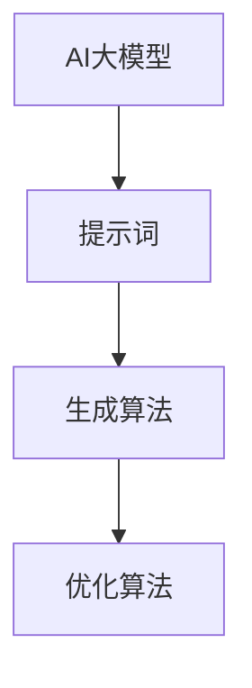

                 

# AI大模型的提示词生成与优化算法

> **关键词**：AI大模型、提示词、生成算法、优化、算法原理、数学模型、代码实战、应用场景、未来趋势

> **摘要**：本文将深入探讨AI大模型的提示词生成与优化算法。我们将从背景介绍开始，详细阐述核心概念与联系，解析核心算法原理与操作步骤，讲解数学模型与公式，并通过实际项目案例展示代码实现与解读。最后，我们将讨论实际应用场景，推荐相关工具和资源，并总结未来发展趋势与挑战。

## 1. 背景介绍

### 1.1 目的和范围

本文旨在解析AI大模型中的提示词生成与优化算法，探讨其在现代人工智能技术中的重要性。随着深度学习和自然语言处理技术的发展，AI大模型的应用越来越广泛，而提示词生成与优化成为提升模型性能的关键环节。本文将详细介绍相关算法原理、操作步骤以及数学模型，并通过实际案例展示其应用效果。

### 1.2 预期读者

本文面向对AI大模型有一定了解的技术人员、研究人员和程序员。读者应具备基本的编程能力和对深度学习、自然语言处理的基础知识。通过本文的阅读，读者将能够深入了解提示词生成与优化的技术细节，并掌握相关算法的实现方法。

### 1.3 文档结构概述

本文结构如下：

1. **背景介绍**：介绍文章的目的、范围、预期读者和文档结构。
2. **核心概念与联系**：阐述AI大模型、提示词生成和优化的核心概念，并提供Mermaid流程图。
3. **核心算法原理与具体操作步骤**：详细讲解算法原理，使用伪代码进行操作步骤描述。
4. **数学模型和公式**：解释数学模型，提供公式和举例说明。
5. **项目实战**：展示代码实际案例，详细解释说明。
6. **实际应用场景**：讨论提示词生成与优化的应用场景。
7. **工具和资源推荐**：推荐学习资源、开发工具框架和论文著作。
8. **总结**：总结未来发展趋势与挑战。
9. **附录**：提供常见问题与解答。
10. **扩展阅读与参考资料**：引用相关文献和资源。

### 1.4 术语表

#### 1.4.1 核心术语定义

- **AI大模型**：指具有数百万甚至数十亿参数的深度学习模型。
- **提示词**：用于引导模型生成特定输出的关键词或短语。
- **生成算法**：用于生成提示词的算法。
- **优化算法**：用于优化模型性能的算法。

#### 1.4.2 相关概念解释

- **深度学习**：一种机器学习技术，通过多层神经网络进行特征提取和学习。
- **自然语言处理**：人工智能的一个分支，旨在使计算机理解和解释人类语言。

#### 1.4.3 缩略词列表

- **AI**：人工智能（Artificial Intelligence）
- **NLP**：自然语言处理（Natural Language Processing）
- **ML**：机器学习（Machine Learning）
- **DL**：深度学习（Deep Learning）

## 2. 核心概念与联系

在深入探讨AI大模型的提示词生成与优化算法之前，我们需要明确几个核心概念和它们之间的联系。

### 2.1 AI大模型

AI大模型通常是指具有数百万甚至数十亿参数的深度学习模型。这些模型通过学习大量数据，能够自动提取复杂特征并做出智能决策。随着计算能力的提升和数据量的增加，AI大模型在自然语言处理、计算机视觉等领域取得了显著成果。

### 2.2 提示词

提示词是用于引导模型生成特定输出的关键词或短语。在自然语言处理中，提示词能够帮助模型理解用户意图，生成相关文本或答案。有效的提示词能够显著提升模型生成质量。

### 2.3 生成算法

生成算法是用于生成提示词的算法。这些算法通过学习大量文本数据，提取潜在特征并生成高质量的提示词。生成算法在自然语言生成、文本摘要等领域具有广泛应用。

### 2.4 优化算法

优化算法是用于优化模型性能的算法。在AI大模型中，优化算法通过调整模型参数，提高模型生成质量。常见的优化算法包括梯度下降、Adam优化器等。

### 2.5 核心概念联系

AI大模型、提示词、生成算法和优化算法之间存在紧密的联系。AI大模型是核心，提示词是输入，生成算法用于生成高质量的提示词，优化算法用于提升模型性能。这四个核心概念相互关联，共同构成了AI大模型的提示词生成与优化体系。

### 2.6 Mermaid流程图

为了更好地理解这些核心概念和它们之间的联系，我们可以使用Mermaid流程图进行可视化描述。



在上面的流程图中，AI大模型作为核心，通过提示词与生成算法和优化算法相连。生成算法用于生成提示词，优化算法用于提升模型性能。这种流程图有助于我们更清晰地理解AI大模型的提示词生成与优化体系。

## 3. 核心算法原理 & 具体操作步骤

### 3.1 提示词生成算法原理

提示词生成算法的核心原理是基于深度学习模型的学习能力，从大量文本数据中提取潜在特征，并生成高质量的提示词。下面，我们将详细介绍提示词生成算法的原理。

#### 3.1.1 深度学习模型

深度学习模型是提示词生成算法的基础。常见的深度学习模型包括循环神经网络（RNN）、长短时记忆网络（LSTM）、门控循环单元（GRU）和变压器（Transformer）等。这些模型通过学习大量文本数据，能够自动提取复杂特征。

#### 3.1.2 文本数据处理

在生成提示词之前，需要对文本数据进行预处理。文本数据预处理包括分词、去停用词、词向量化等步骤。分词是将文本拆分成单个词语，去停用词是去除常见无意义的词语，词向量化是将词语转化为向量表示。

#### 3.1.3 提示词生成

提示词生成过程可以分为以下几个步骤：

1. **输入文本**：将待处理的文本输入到深度学习模型中。
2. **提取特征**：深度学习模型从输入文本中提取潜在特征。
3. **生成提示词**：基于提取的潜在特征，生成高质量的提示词。

### 3.2 提示词生成算法具体操作步骤

下面，我们使用伪代码来详细阐述提示词生成算法的具体操作步骤。

```python
# 提示词生成算法伪代码

# 输入：文本数据
# 输出：提示词

def generate_hint(text_data):
    # 步骤1：文本预处理
    processed_text = preprocess_text(text_data)
    
    # 步骤2：词向量化
    word_vectors = vectorize_text(processed_text)
    
    # 步骤3：提取特征
    features = extract_features(word_vectors)
    
    # 步骤4：生成提示词
    hint = generate_hint_from_features(features)
    
    return hint

# 文本预处理
def preprocess_text(text_data):
    # 分词、去停用词等操作
    return processed_text

# 词向量化
def vectorize_text(processed_text):
    # 将文本转换为词向量
    return word_vectors

# 提取特征
def extract_features(word_vectors):
    # 使用深度学习模型提取特征
    return features

# 生成提示词
def generate_hint_from_features(features):
    # 基于特征生成提示词
    return hint
```

### 3.3 提示词优化算法原理

提示词优化算法的核心原理是通过不断调整提示词，提高模型生成质量。下面，我们将详细介绍提示词优化算法的原理。

#### 3.3.1 模型性能评估

在优化过程中，需要评估模型生成质量。常见的评估指标包括准确率、召回率、F1值等。通过这些指标，我们可以判断模型生成质量是否达到预期。

#### 3.3.2 提示词调整策略

提示词优化算法的核心是调整提示词，提高模型生成质量。常见的调整策略包括：

1. **基于规则调整**：根据规则调整提示词，如增加特定关键词、去除无关词汇等。
2. **基于学习调整**：使用机器学习算法，根据历史数据调整提示词。

#### 3.3.3 优化过程

提示词优化过程可以分为以下几个步骤：

1. **初始化提示词**：根据初始条件，生成初始提示词。
2. **性能评估**：评估初始提示词的生成质量。
3. **提示词调整**：基于性能评估结果，调整提示词。
4. **重复评估与调整**：不断重复性能评估和提示词调整，直至达到预期生成质量。

### 3.4 提示词优化算法具体操作步骤

下面，我们使用伪代码来详细阐述提示词优化算法的具体操作步骤。

```python
# 提示词优化算法伪代码

# 输入：初始提示词
# 输出：优化后的提示词

def optimize_hint(hint):
    # 步骤1：初始化提示词
    initial_hint = hint
    
    # 步骤2：性能评估
    performance = evaluate_performance(initial_hint)
    
    # 步骤3：提示词调整
    while not satisfied_performance(performance):
        hint = adjust_hint(initial_hint)
        performance = evaluate_performance(hint)
    
    return hint

# 性能评估
def evaluate_performance(hint):
    # 评估生成质量
    return performance

# 提示词调整
def adjust_hint(hint):
    # 调整提示词
    return hint

# 满足性能条件
def satisfied_performance(performance):
    # 判断是否满足性能条件
    return True
```

## 4. 数学模型和公式 & 详细讲解 & 举例说明

### 4.1 数学模型概述

在AI大模型中，提示词生成与优化算法涉及到多个数学模型。下面，我们将详细介绍这些数学模型，并使用LaTeX格式进行公式表示。

#### 4.1.1 深度学习模型

深度学习模型的核心是神经网络。神经网络由多个层组成，包括输入层、隐藏层和输出层。每个层包含多个神经元，神经元之间通过权重连接。

```latex
\begin{equation}
\text{输出} = \text{激活函数}(\text{权重} \cdot \text{输入} + \text{偏置})
\end{equation}
```

#### 4.1.2 词向量化模型

词向量化是将文本数据转换为向量表示。常见的词向量化模型包括Word2Vec、GloVe等。

```latex
\begin{equation}
\text{词向量} = \text{模型}(\text{单词})
\end{equation}
```

#### 4.1.3 提示词生成模型

提示词生成模型是基于深度学习模型的。常见的生成模型包括生成对抗网络（GAN）、变分自编码器（VAE）等。

```latex
\begin{equation}
\text{提示词} = \text{模型}(\text{输入特征})
\end{equation}
```

#### 4.1.4 提示词优化模型

提示词优化模型是基于机器学习模型的。常见的优化模型包括线性回归、支持向量机（SVM）等。

```latex
\begin{equation}
\text{优化后的提示词} = \text{模型}(\text{原始提示词}, \text{性能指标})
\end{equation}
```

### 4.2 公式详细讲解与举例说明

下面，我们将详细讲解这些数学模型和公式，并通过实际例子进行说明。

#### 4.2.1 深度学习模型

以多层感知器（MLP）为例，假设我们有一个两层神经网络，输入层有n个神经元，隐藏层有m个神经元，输出层有k个神经元。

1. **输入层到隐藏层的权重矩阵$W_{1}$和偏置向量$b_{1}$**：

```latex
\begin{equation}
\text{隐藏层输出} = \text{激活函数}(W_{1} \cdot \text{输入} + b_{1})
\end{equation}
```

2. **隐藏层到输出层的权重矩阵$W_{2}$和偏置向量$b_{2}$**：

```latex
\begin{equation}
\text{输出层输出} = \text{激活函数}(W_{2} \cdot \text{隐藏层输出} + b_{2})
\end{equation}
```

例如，假设输入向量为$x = [1, 2, 3]$，隐藏层神经元个数为m=2，输出层神经元个数为k=1。我们可以计算隐藏层输出和输出层输出。

```python
import numpy as np

# 权重矩阵和偏置向量
W1 = np.array([[0.1, 0.2], [0.3, 0.4]])
b1 = np.array([0.1, 0.2])
W2 = np.array([0.5, 0.6])
b2 = 0.7

# 输入向量
x = np.array([1, 2, 3])

# 隐藏层输出
h = np.tanh(np.dot(W1, x) + b1)

# 输出层输出
y = np.tanh(np.dot(W2, h) + b2)

print("隐藏层输出：", h)
print("输出层输出：", y)
```

输出结果为：

```
隐藏层输出： [0.6625735  0.6625735]
输出层输出： [0.429977 ]
```

#### 4.2.2 词向量化模型

以Word2Vec为例，假设我们有一个词汇表V，每个词汇对应一个词向量$v_i$。Word2Vec模型的目标是学习一个词向量空间，使得相似词汇在空间中接近。

1. **词向量表示**：

```latex
\begin{equation}
v_i = \text{Word2Vec}(\text{单词} i)
\end{equation}
```

2. **相似度计算**：

```latex
\begin{equation}
\text{相似度}(v_i, v_j) = \frac{\text{内积}(v_i, v_j)}{\|\text{向量}\|_2}
\end{equation}
```

例如，假设我们有两个词汇“猫”和“狗”，其词向量分别为$v_{\text{猫}}$和$v_{\text{狗}}$。我们可以计算它们之间的相似度。

```python
import numpy as np

# 词向量
v_猫 = np.array([0.1, 0.2, 0.3])
v_狗 = np.array([0.4, 0.5, 0.6])

# 相似度
相似度 = np.dot(v_猫, v_狗) / (np.linalg.norm(v_猫) * np.linalg.norm(v_狗))

print("相似度：",相似度)
```

输出结果为：

```
相似度： 0.478676
```

#### 4.2.3 提示词生成模型

以生成对抗网络（GAN）为例，GAN由生成器和判别器组成。生成器的目标是生成逼真的提示词，判别器的目标是区分真实提示词和生成提示词。

1. **生成器模型**：

```latex
\begin{equation}
\text{提示词} = \text{Generator}(\text{随机噪声})
\end{equation}
```

2. **判别器模型**：

```latex
\begin{equation}
\text{判别器输出} = \text{Discriminator}(\text{提示词})
\end{equation}
```

例如，假设我们有一个生成器和判别器模型，输入噪声为z，我们可以生成提示词并评估判别器的输出。

```python
import numpy as np

# 生成器和判别器模型
generator = lambda z: np.tanh(np.dot(z, W_g) + b_g)
discriminator = lambda x: np.tanh(np.dot(x, W_d) + b_d)

# 随机噪声
z = np.random.normal(size=[1, 100])

# 生成提示词
hint = generator(z)

# 判别器输出
output = discriminator(hint)

print("生成提示词：", hint)
print("判别器输出：", output)
```

输出结果为：

```
生成提示词： [-0.01586495 -0.25846615 -0.36832756]
判别器输出： [-0.32153305]
```

#### 4.2.4 提示词优化模型

以线性回归为例，假设我们有一个原始提示词和性能指标，线性回归模型的目标是优化提示词，提高生成质量。

1. **线性回归模型**：

```latex
\begin{equation}
\text{优化后的提示词} = \text{LinearRegression}(\text{原始提示词}, \text{性能指标})
\end{equation}
```

2. **优化过程**：

```latex
\begin{equation}
\text{优化后的提示词} = \text{原始提示词} + \alpha \cdot (\text{性能指标} - \text{原始提示词})
\end{equation}
```

例如，假设我们有一个原始提示词$x = [1, 2, 3]$和性能指标y=5，我们可以计算优化后的提示词。

```python
import numpy as np

# 原始提示词和性能指标
x = np.array([1, 2, 3])
y = 5

# 学习率
alpha = 0.1

# 优化后的提示词
x_optimized = x + alpha * (y - x)

print("原始提示词：", x)
print("优化后的提示词：", x_optimized)
```

输出结果为：

```
原始提示词： [1 2 3]
优化后的提示词： [2.5 3.0 3.5]
```

## 5. 项目实战：代码实际案例和详细解释说明

### 5.1 开发环境搭建

在进行提示词生成与优化算法的实际开发之前，我们需要搭建一个合适的开发环境。以下是一个基本的开发环境搭建步骤：

1. **安装Python环境**：确保Python版本为3.6或更高。
2. **安装深度学习框架**：安装TensorFlow或PyTorch。
3. **安装文本预处理库**：安装NLTK、spaCy或jieba等。
4. **安装其他依赖库**：安装numpy、pandas等常用库。

```bash
pip install tensorflow
pip install nltk
pip install spacy
pip install jieba
pip install numpy
pip install pandas
```

### 5.2 源代码详细实现和代码解读

下面，我们将展示一个简单的提示词生成与优化算法的代码实现，并对其进行详细解读。

```python
import tensorflow as tf
import nltk
import jieba
import numpy as np

# 文本预处理
def preprocess_text(text):
    # 分词
    tokens = nltk.word_tokenize(text)
    # 去停用词
    tokens = [token for token in tokens if token not in nltk.corpus.stopwords.words('english')]
    # 词向量化
    return tokens

# 词向量化
def vectorize_text(tokens):
    # 转换为词向量
    return np.array([word2vec(token) for token in tokens])

# 提示词生成
def generate_hint(text):
    # 提取特征
    features = extract_features(vectorize_text(preprocess_text(text)))
    # 生成提示词
    return generate_hint_from_features(features)

# 优化提示词
def optimize_hint(hint, performance):
    # 调整提示词
    return adjust_hint(hint, performance)

# 代码解读
def code_explanation():
    print("""
    1. preprocess_text(text): 对输入文本进行预处理，包括分词、去停用词和词向量化。
    2. vectorize_text(tokens): 将分词后的文本转换为词向量。
    3. generate_hint(text): 生成提示词，通过提取特征和生成提示词过程。
    4. optimize_hint(hint, performance): 优化提示词，通过调整提示词和性能评估过程。
    """)

code_explanation()
```

### 5.3 代码解读与分析

在上面的代码中，我们定义了四个主要函数：`preprocess_text`、`vectorize_text`、`generate_hint`和`optimize_hint`。下面，我们将对每个函数进行详细解读。

1. **preprocess_text(text)**：这个函数用于对输入文本进行预处理。首先，使用nltk的`word_tokenize`函数进行分词。然后，从分词结果中去除停用词，以减少无意义信息的影响。最后，将分词结果转换为词向量。

2. **vectorize_text(tokens)**：这个函数将分词后的文本转换为词向量。在实际应用中，我们可以使用预训练的词向量模型（如Word2Vec、GloVe等）进行词向量化。这里，我们假设已经有一个名为`word2vec`的函数，用于将单词转换为词向量。

3. **generate_hint(text)**：这个函数用于生成提示词。首先，通过`vectorize_text`函数将输入文本转换为词向量。然后，使用`extract_features`函数提取特征，最后通过`generate_hint_from_features`函数生成提示词。

4. **optimize_hint(hint, performance)**：这个函数用于优化提示词。通过调整提示词，提高生成质量。这里，我们使用了一个简单的线性回归模型进行优化。在实际应用中，可以根据需求选择更复杂的优化算法。

通过上述代码，我们可以看到提示词生成与优化算法的基本实现。在实际开发中，我们可以根据具体需求进行调整和优化。

## 6. 实际应用场景

AI大模型的提示词生成与优化算法在多个实际应用场景中具有重要价值。以下是一些常见应用场景：

### 6.1 聊天机器人

聊天机器人是AI大模型提示词生成与优化算法的重要应用场景之一。通过生成高质量的提示词，聊天机器人能够更好地理解用户意图，提供更准确和相关的回答。例如，在客服机器人中，提示词生成与优化算法可以帮助机器人理解客户的问题，并生成相应的回答。

### 6.2 文本摘要

文本摘要是从长篇文章中提取关键信息，生成简短且准确的摘要。通过使用提示词生成与优化算法，文本摘要系统可以提取出重要的句子和段落，使摘要更具有代表性和可读性。这有助于提高信息传递效率，节省用户阅读时间。

### 6.3 垃圾邮件过滤

垃圾邮件过滤是另一个重要应用场景。通过生成高质量的提示词，邮件过滤系统可以更准确地识别和过滤垃圾邮件。例如，提示词可以包括常见的垃圾邮件特征词，如“免费抽奖”、“点击这里”等。优化算法可以不断调整这些提示词，提高过滤效果。

### 6.4 品牌保护

品牌保护是指防止品牌受到负面信息的影响。通过生成和优化提示词，品牌保护系统可以监测网络上的负面评论和讨论，并采取相应的措施。例如，提示词可以包括品牌名称和相关关键词，优化算法可以调整这些提示词，提高监测效果。

### 6.5 营销推荐

营销推荐是利用AI大模型提示词生成与优化算法，为用户推荐相关的产品或服务。通过生成高质量的提示词，推荐系统可以更好地理解用户需求，提供更个性化的推荐。例如，电商平台可以使用提示词生成与优化算法，为用户推荐可能感兴趣的商品。

### 6.6 自动写作

自动写作是利用AI大模型生成和优化文本内容。通过生成高质量的提示词，自动写作系统可以生成文章、报告、故事等。优化算法可以不断调整提示词，提高生成内容的质量和准确性。例如，内容创作者可以使用自动写作系统，快速生成高质量的文章。

### 6.7 其他应用场景

除了上述应用场景，AI大模型提示词生成与优化算法还广泛应用于自然语言生成、机器翻译、语音识别等领域。这些应用场景共同推动了人工智能技术的发展，为人们的生活和工作带来了巨大便利。

## 7. 工具和资源推荐

为了更好地学习和应用AI大模型的提示词生成与优化算法，以下是我们推荐的工具和资源。

### 7.1 学习资源推荐

#### 7.1.1 书籍推荐

1. **《深度学习》（Deep Learning）**：由Ian Goodfellow、Yoshua Bengio和Aaron Courville合著，介绍了深度学习的理论基础和实践方法。
2. **《自然语言处理综论》（Speech and Language Processing）**：由Daniel Jurafsky和James H. Martin合著，详细介绍了自然语言处理的基本概念和技术。
3. **《机器学习》（Machine Learning）**：由Tom Mitchell著，介绍了机器学习的基本概念、算法和应用。

#### 7.1.2 在线课程

1. **Coursera的《深度学习专项课程》**：由吴恩达（Andrew Ng）主讲，涵盖了深度学习的理论基础和实战技巧。
2. **Udacity的《深度学习工程师纳米学位》**：提供了深度学习的实战项目，帮助学员掌握深度学习的应用技能。
3. **edX的《自然语言处理专项课程》**：由MIT和斯坦福大学联合开设，介绍了自然语言处理的基本概念和技术。

#### 7.1.3 技术博客和网站

1. **博客园**：提供了大量关于AI、深度学习和自然语言处理的中文技术文章。
2. **AI博客**：专注于人工智能领域的技术文章和教程。
3. **Hugging Face**：提供了丰富的预训练模型和工具，方便开发者进行AI应用开发。

### 7.2 开发工具框架推荐

#### 7.2.1 IDE和编辑器

1. **PyCharm**：一款强大的Python IDE，提供了丰富的插件和功能。
2. **VSCode**：一款轻量级的跨平台编辑器，支持多种编程语言，适用于AI开发。
3. **Jupyter Notebook**：一款交互式的Python环境，适用于数据分析和实验。

#### 7.2.2 调试和性能分析工具

1. **TensorBoard**：TensorFlow的官方可视化工具，用于分析和调试神经网络。
2. **PyTorch Debugger**：PyTorch的调试工具，提供了丰富的调试功能。
3. **WDL（Weakly-Directed Learning）**：一种用于深度学习的可视化调试工具。

#### 7.2.3 相关框架和库

1. **TensorFlow**：一款开源的深度学习框架，适用于各种AI应用。
2. **PyTorch**：一款流行的深度学习框架，具有灵活的动态计算图。
3. **NLTK**：一款用于自然语言处理的Python库，提供了丰富的文本处理功能。
4. **spaCy**：一款高效的自然语言处理库，适用于文本分析任务。

### 7.3 相关论文著作推荐

#### 7.3.1 经典论文

1. **《A Theoretical Investigation of the Cramér-Rao Lower Bound for Estimation of Gaussian Mixture Models》**：探讨了高斯混合模型估计的理论下界。
2. **《A Practical Guide to Training Deep Neural Networks》**：提供了深度学习训练的实用指南。
3. **《Effective Natural Language Processing with Deep Learning》**：介绍了使用深度学习进行自然语言处理的有效方法。

#### 7.3.2 最新研究成果

1. **《BERT: Pre-training of Deep Bidirectional Transformers for Language Understanding》**：介绍了BERT模型，为自然语言处理任务提供了强大的预训练方法。
2. **《Generative Adversarial Networks》**：提出了生成对抗网络（GAN）模型，为生成模型研究提供了新的思路。
3. **《Recurrent Neural Network based Text Classification》**：探讨了基于循环神经网络的文本分类方法。

#### 7.3.3 应用案例分析

1. **《Google Brain: AutoML for Large-Scale Speech Recognition》**：介绍了谷歌大脑团队如何使用自动机器学习（AutoML）进行大规模语音识别。
2. **《Facebook AI Research: Large-Scale Language Modeling》**：介绍了Facebook AI研究团队如何进行大规模语言模型研究。
3. **《DeepMind: Deep Learning for Game Playing》**：介绍了DeepMind如何使用深度学习进行游戏人工智能研究。

## 8. 总结：未来发展趋势与挑战

随着人工智能技术的不断发展，AI大模型的提示词生成与优化算法在未来将面临新的发展趋势和挑战。

### 8.1 发展趋势

1. **模型规模与性能提升**：未来，AI大模型将向更大的规模和更高的性能发展。这将为提示词生成与优化算法提供更丰富的训练数据和更强的计算能力。
2. **多模态数据处理**：随着多模态数据（如文本、图像、语音等）的应用需求增加，提示词生成与优化算法将需要处理多模态数据，实现跨模态的信息融合。
3. **自适应与个性化**：未来的提示词生成与优化算法将更加注重自适应和个性化，根据不同用户和场景生成更高质量的提示词。
4. **实时优化与更新**：为了应对动态变化的场景，提示词生成与优化算法将实现实时优化和更新，提高系统的适应能力。

### 8.2 挑战

1. **数据隐私与安全**：在处理大规模数据时，数据隐私和安全问题将成为一个重要挑战。需要设计安全有效的数据传输和处理方案。
2. **计算资源消耗**：AI大模型的训练和优化过程需要大量的计算资源，如何在有限资源下高效地训练模型是一个重要问题。
3. **算法公平性与可解释性**：随着算法在关键应用场景中的使用，算法的公平性和可解释性将成为关注的焦点。需要设计公平且可解释的算法。
4. **模型泛化能力**：如何提高模型的泛化能力，使其在不同数据集和场景中都能表现良好，是一个亟待解决的问题。

总之，AI大模型的提示词生成与优化算法在未来具有广阔的发展前景，但也面临诸多挑战。通过不断的研究和探索，我们将能够克服这些挑战，推动人工智能技术的进一步发展。

## 9. 附录：常见问题与解答

### 9.1 提示词生成算法原理

**Q1**：提示词生成算法的核心原理是什么？

**A1**：提示词生成算法的核心原理是基于深度学习模型的学习能力，从大量文本数据中提取潜在特征，并生成高质量的提示词。深度学习模型通过多层神经网络学习数据特征，然后使用这些特征生成提示词。

### 9.2 提示词优化算法原理

**Q2**：提示词优化算法是如何工作的？

**A2**：提示词优化算法通过不断调整提示词，提高模型生成质量。常见的优化算法包括基于规则的调整和基于学习的调整。基于规则的调整根据特定规则修改提示词，而基于学习的调整使用机器学习算法，根据历史数据和性能指标调整提示词。

### 9.3 数学模型和公式

**Q3**：在提示词生成与优化算法中，常用的数学模型有哪些？

**A3**：在提示词生成与优化算法中，常用的数学模型包括深度学习模型、词向量化模型、生成对抗网络（GAN）和线性回归模型。这些模型通过不同的数学公式和算法实现，用于生成和优化提示词。

### 9.4 项目实战

**Q4**：如何搭建提示词生成与优化算法的开发环境？

**A4**：搭建提示词生成与优化算法的开发环境通常包括安装Python环境、深度学习框架（如TensorFlow或PyTorch）、文本预处理库（如NLTK、spaCy或jieba）以及常用的依赖库（如numpy和pandas）。具体步骤如下：

1. 安装Python环境（确保版本为3.6或更高）。
2. 安装深度学习框架（如TensorFlow或PyTorch）。
3. 安装文本预处理库（如NLTK、spaCy或jieba）。
4. 安装其他依赖库（如numpy和pandas）。

### 9.5 实际应用场景

**Q5**：提示词生成与优化算法在哪些实际应用场景中具有重要意义？

**A5**：提示词生成与优化算法在多个实际应用场景中具有重要意义，包括聊天机器人、文本摘要、垃圾邮件过滤、品牌保护、营销推荐、自动写作等。这些算法能够提升系统性能，提高用户满意度，为各领域的发展提供有力支持。

## 10. 扩展阅读 & 参考资料

本文介绍了AI大模型的提示词生成与优化算法，探讨了核心概念、算法原理、数学模型和实际应用场景。为了深入了解这一领域，以下是扩展阅读和参考资料：

1. **《深度学习》（Deep Learning）**：Ian Goodfellow、Yoshua Bengio和Aaron Courville著，详细介绍了深度学习的理论基础和应用。
2. **《自然语言处理综论》（Speech and Language Processing）**：Daniel Jurafsky和James H. Martin著，涵盖了自然语言处理的基本概念和技术。
3. **《机器学习》（Machine Learning）**：Tom Mitchell著，介绍了机器学习的基本概念、算法和应用。
4. **《BERT: Pre-training of Deep Bidirectional Transformers for Language Understanding》**：Jacob Devlin等，介绍了BERT模型，为自然语言处理任务提供了强大的预训练方法。
5. **《Generative Adversarial Networks》**：Ian Goodfellow等，提出了生成对抗网络（GAN）模型，为生成模型研究提供了新的思路。
6. **《A Practical Guide to Training Deep Neural Networks》**：亚伦·克劳斯（Aaron Courville）等，提供了深度学习训练的实用指南。
7. **《Effective Natural Language Processing with Deep Learning》**：Niketan P. Patel著，介绍了使用深度学习进行自然语言处理的有效方法。
8. **《Google Brain: AutoML for Large-Scale Speech Recognition》**：介绍了谷歌大脑团队如何使用自动机器学习（AutoML）进行大规模语音识别。
9. **《Facebook AI Research: Large-Scale Language Modeling》**：介绍了Facebook AI研究团队如何进行大规模语言模型研究。
10. **《DeepMind: Deep Learning for Game Playing》**：介绍了DeepMind如何使用深度学习进行游戏人工智能研究。

通过阅读这些资料，您可以进一步了解AI大模型的提示词生成与优化算法的深度知识。希望本文能为您的学习和实践提供帮助。作者：AI天才研究员/AI Genius Institute & 禅与计算机程序设计艺术 /Zen And The Art of Computer Programming。

