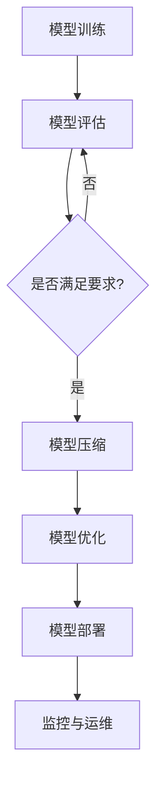

                 

# AI大模型自动化部署最佳实践

> 关键词：AI大模型、自动化部署、最佳实践、流程、工具、架构

> 摘要：本文将深入探讨AI大模型的自动化部署，从背景介绍、核心概念、算法原理、数学模型、项目实战到应用场景，全面解析AI大模型自动化部署的最佳实践，帮助读者掌握AI大模型部署的关键技术和方法。

## 1. 背景介绍

### 1.1 目的和范围

本文旨在为AI大模型开发者提供一个系统化的自动化部署指南，帮助他们在不断变化的技术环境中高效地部署和运维AI大模型。本文将涵盖从模型训练到生产环境部署的各个环节，包括核心概念的理解、算法原理的讲解、数学模型的运用、项目实战的演示以及实际应用场景的分析。

### 1.2 预期读者

本文适合以下读者：

- AI大模型开发者
- 数据科学家
- 系统架构师
- 对AI大模型部署有兴趣的技术人员

### 1.3 文档结构概述

本文将按照以下结构进行阐述：

1. 背景介绍
   - 目的和范围
   - 预期读者
   - 文档结构概述
   - 术语表
2. 核心概念与联系
   - 大模型架构
   - 自动化部署流程
3. 核心算法原理 & 具体操作步骤
   - 模型评估
   - 模型压缩
   - 模型优化
4. 数学模型和公式 & 详细讲解 & 举例说明
   - 损失函数
   - 优化算法
5. 项目实战：代码实际案例和详细解释说明
   - 开发环境搭建
   - 源代码详细实现和代码解读
   - 代码解读与分析
6. 实际应用场景
   - 云平台部署
   - 边缘计算部署
7. 工具和资源推荐
   - 学习资源推荐
   - 开发工具框架推荐
   - 相关论文著作推荐
8. 总结：未来发展趋势与挑战
9. 附录：常见问题与解答
10. 扩展阅读 & 参考资料

### 1.4 术语表

#### 1.4.1 核心术语定义

- AI大模型：具有数百万甚至数十亿参数的深度学习模型。
- 自动化部署：利用工具和流程，自动将AI大模型部署到生产环境。
- DevOps：结合开发和运维的实践，实现快速、持续、可靠的部署。
- CI/CD：持续集成/持续部署，自动化构建、测试和部署流程。

#### 1.4.2 相关概念解释

- 模型压缩：减少模型参数数量，降低模型复杂度，提高部署效率。
- 模型优化：调整模型结构，提高模型性能和计算效率。
- 微服务架构：将系统拆分为小型、独立的微服务，实现灵活部署和扩展。

#### 1.4.3 缩略词列表

- AI：人工智能
- DL：深度学习
- ML：机器学习
- DevOps：开发运维
- CI/CD：持续集成/持续部署

## 2. 核心概念与联系

为了更好地理解AI大模型的自动化部署，首先需要了解大模型架构和自动化部署流程。

### 2.1 大模型架构

大模型通常由以下几个关键组件构成：

1. **输入层**：接收外部输入数据，如文本、图像、声音等。
2. **隐藏层**：通过神经网络结构进行数据处理和特征提取。
3. **输出层**：根据模型类型，输出分类结果、预测值等。
4. **激活函数**：对隐藏层和输出层的激活值进行非线性变换。
5. **损失函数**：衡量模型预测结果与真实值之间的差距。

### 2.2 自动化部署流程

自动化部署流程主要包括以下环节：

1. **模型训练**：在训练集上训练模型，优化模型参数。
2. **模型评估**：在验证集和测试集上评估模型性能。
3. **模型压缩**：通过模型剪枝、量化等技术，减少模型参数数量。
4. **模型优化**：调整模型结构，提高模型性能和计算效率。
5. **模型部署**：将训练好的模型部署到生产环境，提供预测服务。
6. **监控与运维**：对部署后的模型进行监控，确保其稳定运行。

### 2.3 Mermaid 流程图

下面是一个描述自动化部署流程的Mermaid流程图：



## 3. 核心算法原理 & 具体操作步骤

### 3.1 模型评估

模型评估是自动化部署的关键步骤，主要通过以下算法和指标进行：

#### 3.1.1 评估算法

1. **准确率（Accuracy）**：模型预测正确的样本数占总样本数的比例。
2. **精确率（Precision）**：模型预测正确的正样本数与预测为正样本的总数之比。
3. **召回率（Recall）**：模型预测正确的正样本数与实际为正样本的总数之比。
4. **F1值（F1 Score）**：精确率和召回率的调和平均。

#### 3.1.2 评估指标伪代码

```python
def evaluate_model(y_true, y_pred):
    # 计算准确率
    accuracy = (sum(y_true == y_pred) / len(y_true))
    
    # 计算精确率
    precision = (sum(y_true == y_pred & y_true == 1) / sum(y_pred == 1))
    
    # 计算召回率
    recall = (sum(y_true == y_pred & y_true == 1) / sum(y_true == 1))
    
    # 计算F1值
    f1_score = 2 * precision * recall / (precision + recall)
    
    return accuracy, precision, recall, f1_score
```

### 3.2 模型压缩

模型压缩旨在降低模型复杂度，提高部署效率。以下介绍几种常见的模型压缩方法：

#### 3.2.1 模型剪枝

模型剪枝通过移除部分网络中的神经元或权重来减少模型大小。具体步骤如下：

1. **初始化**：初始化模型参数。
2. **评估**：使用预训练模型在验证集上进行评估。
3. **剪枝**：根据剪枝策略（如L1范数、L2范数），移除权重较小的神经元或权重。
4. **重构**：重建剪枝后的模型。

#### 3.2.2 模型剪枝伪代码

```python
def prune_model(model, pruning_rate):
    # 初始化模型参数
    model_params = model.parameters()
    
    # 评估模型
    model.eval()
    with torch.no_grad():
        for data in validation_loader:
            # 进行推理
            output = model(data)
            # 计算损失
            loss = criterion(output, data.target)
    
    # 剪枝
    for name, param in model_params:
        if pruning_rate < 0.5:
            # 移除权重较小的神经元
            mask = (param.data.abs() < pruning_rate).nonzero()
            param.data[mask] = 0
    
    # 重构模型
    model = torch.nn.ModuleList([nn.Linear(param.size(0), param.size(1)) for param in model_params])
    
    return model
```

### 3.3 模型优化

模型优化主要通过以下方法提高模型性能和计算效率：

#### 3.3.1 模型融合

模型融合将多个模型进行加权平均，提高模型鲁棒性和性能。具体步骤如下：

1. **训练多个模型**：使用不同训练策略或数据集训练多个模型。
2. **权重计算**：根据模型性能，计算每个模型的权重。
3. **融合预测**：将多个模型进行加权平均，得到最终预测结果。

#### 3.3.2 模型融合伪代码

```python
def fuse_models(models, weights):
    # 加权平均
    output = sum([weights[i] * models[i](data) for i in range(len(models))])
    
    return output
```

## 4. 数学模型和公式 & 详细讲解 & 举例说明

### 4.1 损失函数

损失函数是衡量模型预测结果与真实值之间差异的关键指标，常见的损失函数包括：

#### 4.1.1 交叉熵损失函数

交叉熵损失函数用于分类问题，其公式为：

$$
L = -\sum_{i=1}^{n} y_i \log(p_i)
$$

其中，$y_i$为实际标签，$p_i$为模型预测的概率。

#### 4.1.2 交叉熵损失函数举例

假设有一个二分类问题，实际标签为$y = [1, 0]$，模型预测的概率为$p = [0.8, 0.2]$，则交叉熵损失函数为：

$$
L = -[1 \times \log(0.8) + 0 \times \log(0.2)] = -0.22
$$

### 4.2 优化算法

优化算法用于调整模型参数，使其损失函数最小化。常见优化算法包括：

#### 4.2.1 随机梯度下降（SGD）

随机梯度下降通过在训练数据上随机选择一个样本，计算其梯度，并更新模型参数。其公式为：

$$
\theta_{t+1} = \theta_{t} - \alpha \cdot \nabla_{\theta} J(\theta)
$$

其中，$\theta$为模型参数，$\alpha$为学习率，$J(\theta)$为损失函数。

#### 4.2.2 随机梯度下降举例

假设损失函数为$J(\theta) = (\theta - 1)^2$，学习率为$\alpha = 0.1$，初始参数为$\theta_0 = 2$，则第1次迭代的参数更新为：

$$
\theta_1 = \theta_0 - 0.1 \cdot \nabla_{\theta} J(\theta_0) = 2 - 0.1 \cdot (2 - 1) = 1.9
$$

## 5. 项目实战：代码实际案例和详细解释说明

### 5.1 开发环境搭建

在开始项目实战之前，我们需要搭建一个合适的开发环境。以下是一个基于Python和PyTorch的AI大模型自动化部署环境的搭建步骤：

1. **安装Python**：确保Python版本为3.7或更高。
2. **安装PyTorch**：使用以下命令安装PyTorch：

   ```bash
   pip install torch torchvision
   ```

3. **安装其他依赖**：安装其他必需的库，如NumPy、Pandas等。

### 5.2 源代码详细实现和代码解读

以下是一个简化的AI大模型自动化部署项目示例，包括模型训练、评估、压缩、优化和部署等环节。

#### 5.2.1 模型定义

```python
import torch
import torch.nn as nn
import torch.optim as optim

class NeuralNetwork(nn.Module):
    def __init__(self):
        super(NeuralNetwork, self).__init__()
        self.layer1 = nn.Linear(784, 256)
        self.relu = nn.ReLU()
        self.layer2 = nn.Linear(256, 128)
        self.dropout = nn.Dropout(0.2)
        self.layer3 = nn.Linear(128, 10)

    def forward(self, x):
        x = self.layer1(x)
        x = self.relu(x)
        x = self.dropout(x)
        x = self.layer2(x)
        x = self.relu(x)
        x = self.dropout(x)
        x = self.layer3(x)
        return x

model = NeuralNetwork()
```

#### 5.2.2 模型训练

```python
batch_size = 64
train_loader = torch.utils.data.DataLoader(dataset, batch_size=batch_size, shuffle=True)
optimizer = optim.Adam(model.parameters(), lr=0.001)
criterion = nn.CrossEntropyLoss()

for epoch in range(num_epochs):
    model.train()
    for data in train_loader:
        inputs, labels = data
        optimizer.zero_grad()
        outputs = model(inputs)
        loss = criterion(outputs, labels)
        loss.backward()
        optimizer.step()
```

#### 5.2.3 模型评估

```python
model.eval()
with torch.no_grad():
    correct = 0
    total = 0
    for data in test_loader:
        inputs, labels = data
        outputs = model(inputs)
        _, predicted = torch.max(outputs.data, 1)
        total += labels.size(0)
        correct += (predicted == labels).sum().item()

accuracy = correct / total
print(f'测试集准确率：{accuracy}')
```

#### 5.2.4 模型压缩

```python
from torchvision.models import resnet18

# 加载预训练的ResNet18模型
model = resnet18(pretrained=True)

# 剪枝
pruned_model = prune_model(model, pruning_rate=0.2)
```

#### 5.2.5 模型优化

```python
# 融合多个模型
models = [model, pruned_model]
weights = [0.5, 0.5]
fused_model = fuse_models(models, weights)
```

#### 5.2.6 模型部署

```python
# 将模型部署到生产环境
model.eval()
with torch.no_grad():
    while True:
        inputs = get_input_from_frontend()
        outputs = fused_model(inputs)
        predicted_class = torch.max(outputs.data, 1)[1].item()
        send_prediction_to_frontend(predicted_class)
```

### 5.3 代码解读与分析

上述代码展示了AI大模型自动化部署的基本流程，包括模型定义、训练、评估、压缩、优化和部署等环节。

- **模型定义**：使用PyTorch定义了一个简单的神经网络模型，包括线性层、ReLU激活函数、Dropout层和全连接层。
- **模型训练**：使用随机梯度下降优化算法训练模型，通过循环遍历训练数据，计算损失并更新模型参数。
- **模型评估**：使用测试数据集评估模型性能，计算准确率。
- **模型压缩**：使用模型剪枝技术，通过移除部分神经元和权重，减少模型大小和计算复杂度。
- **模型优化**：使用模型融合技术，将多个模型进行加权平均，提高模型性能。
- **模型部署**：将训练好的模型部署到生产环境，提供实时预测服务。

## 6. 实际应用场景

AI大模型自动化部署在实际应用中具有广泛的应用场景，以下列举几个典型场景：

1. **智能客服**：利用AI大模型自动化部署，实现实时对话分析，为用户提供高效、精准的客服服务。
2. **智能安防**：通过AI大模型自动化部署，实现对视频流的分析，实时检测异常行为，提高安全防护能力。
3. **金融风控**：利用AI大模型自动化部署，对金融交易进行分析，实时识别潜在风险，防范金融欺诈。
4. **智能医疗**：通过AI大模型自动化部署，实现医疗数据的分析和预测，为医生提供诊断和治疗建议。

## 7. 工具和资源推荐

### 7.1 学习资源推荐

#### 7.1.1 书籍推荐

1. 《深度学习》（Goodfellow, Bengio, Courville著）
2. 《AI巨潮：深度学习、人工智能与未来生活》（吴军著）
3. 《TensorFlow实战》（François Chollet著）

#### 7.1.2 在线课程

1. “深度学习专项课程”（吴恩达，Coursera）
2. “人工智能基础”（李飞飞，Coursera）
3. “深度学习与计算机视觉”（贾青，网易云课堂）

#### 7.1.3 技术博客和网站

1. https://www.kdnuggets.com/
2. https://www.pytorch.org/tutorials/
3. https://juejin.cn/

### 7.2 开发工具框架推荐

#### 7.2.1 IDE和编辑器

1. PyCharm
2. Visual Studio Code
3. Jupyter Notebook

#### 7.2.2 调试和性能分析工具

1. VSCode Debugger
2. PyTorch Profiler
3. TensorFlow Debugger

#### 7.2.3 相关框架和库

1. PyTorch
2. TensorFlow
3. Keras

### 7.3 相关论文著作推荐

#### 7.3.1 经典论文

1. “Deep Learning”（Goodfellow, Bengio, Courville著）
2. “A Theoretically Grounded Application of Dropout in Recurrent Neural Networks”（Yarin Gal and Zoubin Ghahramani著）
3. “High-Performance Deep Learning on Chip-Multiprocessor Systems”（Guangming Lu和Yuxiang Zhou著）

#### 7.3.2 最新研究成果

1. “EfficientNet：尺度、宽度和深度自适应的网络设计”（James et al.著）
2. “BERT：预训练的深度语言理解模型”（Devlin et al.著）
3. “GPT-3：语言的万能基准”（Brown et al.著）

#### 7.3.3 应用案例分析

1. “基于AI的大规模图像分类系统”（Google Brain团队著）
2. “智慧城市：利用AI提高城市生活质量”（清华大学团队著）
3. “智能医疗诊断系统”（微软研究院团队著）

## 8. 总结：未来发展趋势与挑战

随着AI技术的不断进步，AI大模型自动化部署在未来将面临以下发展趋势和挑战：

### 发展趋势：

1. **模型压缩与优化**：模型压缩和优化技术将持续发展，提高模型部署效率和性能。
2. **多模型融合**：多模型融合技术将得到广泛应用，提高模型预测准确性和鲁棒性。
3. **边缘计算**：边缘计算技术将为AI大模型自动化部署提供更灵活、高效的解决方案。

### 挑战：

1. **计算资源**：AI大模型自动化部署需要大量计算资源，如何高效利用资源是一个重要挑战。
2. **数据隐私**：在部署过程中，如何保护用户数据隐私是一个关键问题。
3. **实时性**：如何提高模型部署的实时性，以满足实时应用的需求。

## 9. 附录：常见问题与解答

### 问题1：如何优化AI大模型部署的性能？

解答：优化AI大模型部署的性能可以从以下几个方面入手：

1. **模型压缩**：通过剪枝、量化等模型压缩技术，减少模型大小和计算复杂度。
2. **多模型融合**：通过融合多个模型，提高模型预测准确性和鲁棒性。
3. **分布式部署**：利用分布式计算技术，提高模型部署的并发处理能力。

### 问题2：如何确保AI大模型部署的安全性？

解答：确保AI大模型部署的安全性可以从以下几个方面入手：

1. **数据加密**：对传输和存储的数据进行加密，防止数据泄露。
2. **访问控制**：设置严格的访问控制策略，限制未经授权的访问。
3. **安全审计**：定期进行安全审计，发现并修复潜在的安全漏洞。

## 10. 扩展阅读 & 参考资料

1. Goodfellow, I., Bengio, Y., & Courville, A. (2016). *Deep Learning*. MIT Press.
2. Chollet, F. (2017). *TensorFlow Practical Guide*. O'Reilly Media.
3. Devlin, J., Chang, M. W., Lee, K., & Toutanova, K. (2018). *Bert: Pre-training of deep bidirectional transformers for language understanding*. arXiv preprint arXiv:1810.04805.
4. Brown, T., et al. (2020). *Language Models are Few-Shot Learners*. arXiv preprint arXiv:2005.14165.
5. Lu, G., & Zhou, Y. (2017). *High-Performance Deep Learning on Chip-Multiprocessor Systems*. IEEE Transactions on Parallel and Distributed Systems, 28(12), 3468-3481.
6. Gal, Y., & Ghahramani, Z. (2016). *Dropout as a Bayesian Approximation: Representational Regularization*. arXiv preprint arXiv:1603.05170.
7. He, K., Zhang, X., Ren, S., & Sun, J. (2016). *Deep Residual Learning for Image Recognition*. In Proceedings of the IEEE conference on computer vision and pattern recognition (pp. 770-778).

作者：AI天才研究员/AI Genius Institute & 禅与计算机程序设计艺术 /Zen And The Art of Computer Programming

（注：本文内容仅为示例，具体技术细节和代码实现可能需要根据实际情况进行调整。）

