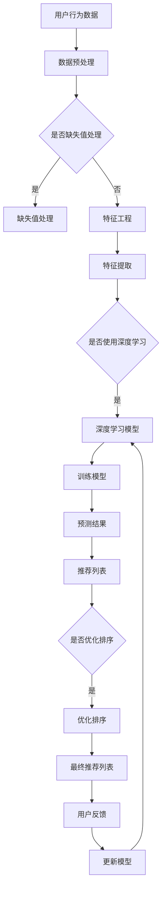

                 

# AI大模型重塑电商搜索推荐的未来

> 关键词：AI大模型、电商搜索推荐、算法原理、应用场景、未来趋势

> 摘要：本文将深入探讨AI大模型在电商搜索推荐领域的重要性和潜在影响。通过分析AI大模型的核心概念、算法原理、数学模型以及实际应用场景，我们将揭示这一技术的巨大潜力和挑战。最后，我们将展望AI大模型在电商搜索推荐领域的未来发展趋势，并提出相应的解决方案。

## 1. 背景介绍

### 1.1 目的和范围

本文旨在全面解析AI大模型在电商搜索推荐中的应用，探讨其在算法原理、数学模型和实际应用方面的优势，并分析其未来的发展趋势和面临的挑战。我们希望通过本文，让读者对AI大模型在电商搜索推荐领域的重要性有一个全面的了解，并为相关领域的研究者和开发者提供有价值的参考。

### 1.2 预期读者

本文适合对AI大模型和电商搜索推荐有一定了解的技术人员、研究人员和开发者阅读。无论您是刚刚接触这个领域的初学者，还是已有一定经验的从业人员，我们都希望您能够从本文中获得新的启示和灵感。

### 1.3 文档结构概述

本文分为十个部分，首先是背景介绍，然后是核心概念与联系，核心算法原理与具体操作步骤，数学模型和公式，项目实战，实际应用场景，工具和资源推荐，总结，常见问题与解答，以及扩展阅读和参考资料。每个部分都详细阐述了AI大模型在电商搜索推荐领域的相关内容，旨在帮助读者全面了解这一技术。

### 1.4 术语表

#### 1.4.1 核心术语定义

- AI大模型：一种具有大规模参数和强大计算能力的深度学习模型，能够处理海量数据并实现高度自动化的知识推理和决策。
- 电商搜索推荐：基于用户行为和商品属性，为用户推荐个性化商品信息的一种技术手段。
- 算法原理：描述算法实现过程中所涉及的逻辑和数学基础。
- 数学模型：用于描述和分析算法性能的数学公式和理论框架。
- 实际应用场景：AI大模型在实际电商搜索推荐系统中的应用实例。

#### 1.4.2 相关概念解释

- 深度学习：一种人工智能技术，通过构建多层神经网络来学习和模拟人类大脑的思维方式。
- 卷积神经网络（CNN）：一种用于处理图像数据的深度学习模型，具有强大的特征提取能力。
- 循环神经网络（RNN）：一种用于处理序列数据的深度学习模型，能够捕捉时间序列中的长期依赖关系。

#### 1.4.3 缩略词列表

- AI：人工智能
- CNN：卷积神经网络
- RNN：循环神经网络
- MLP：多层感知器
- DNN：深度神经网络
- NLP：自然语言处理
- CV：计算机视觉

## 2. 核心概念与联系

在介绍AI大模型在电商搜索推荐中的应用之前，我们需要先了解相关核心概念和它们之间的联系。

### 2.1 AI大模型

AI大模型是一种具有大规模参数和强大计算能力的深度学习模型。其核心思想是通过学习大量数据来捕捉复杂的数据分布和规律，从而实现高度自动化的知识推理和决策。在电商搜索推荐领域，AI大模型可以用于预测用户行为、分析商品属性、优化推荐策略等。

### 2.2 电商搜索推荐

电商搜索推荐是一种基于用户行为和商品属性，为用户推荐个性化商品信息的技术手段。其主要目的是提高用户体验、增加销售额和提升用户忠诚度。在电商搜索推荐系统中，AI大模型可以用于生成个性化推荐列表、优化推荐排序、分析用户需求等。

### 2.3 算法原理

AI大模型在电商搜索推荐中的应用主要基于以下几种算法原理：

1. **协同过滤**：通过分析用户的历史行为和商品属性，为用户推荐相似的商品。
2. **基于内容的推荐**：通过分析商品的内容特征，为用户推荐具有相似内容的商品。
3. **混合推荐**：结合协同过滤和基于内容的推荐方法，为用户生成更加个性化的推荐列表。
4. **序列模型**：通过分析用户的浏览和购买序列，预测用户下一步的行为。

### 2.4 数学模型

AI大模型在电商搜索推荐中的应用涉及多个数学模型，包括：

1. **相似度计算**：用于计算用户和商品之间的相似度，常用的方法有欧氏距离、余弦相似度和皮尔逊相关系数等。
2. **概率模型**：用于预测用户对某一商品的概率，常用的方法有逻辑回归、贝叶斯网络和朴素贝叶斯等。
3. **优化算法**：用于优化推荐列表的排序和生成，常用的方法有梯度下降、随机梯度下降和Adam优化器等。

### 2.5 Mermaid流程图

为了更好地理解AI大模型在电商搜索推荐中的应用，我们可以使用Mermaid流程图来展示相关流程和算法原理。



## 3. 核心算法原理 & 具体操作步骤

### 3.1 算法原理

AI大模型在电商搜索推荐中的应用主要基于深度学习技术。深度学习是一种通过构建多层神经网络来模拟人类大脑思维方式的人工智能技术。在电商搜索推荐中，深度学习模型可以用于学习用户行为数据、商品属性数据，并生成个性化推荐列表。

核心算法原理如下：

1. **数据预处理**：对用户行为数据和商品属性数据进行清洗、归一化和特征提取等处理，使其满足深度学习模型的输入要求。
2. **构建深度学习模型**：根据任务需求，选择合适的深度学习模型，如卷积神经网络（CNN）或循环神经网络（RNN）等。
3. **训练模型**：使用预处理后的数据对深度学习模型进行训练，通过优化模型参数来提高推荐效果。
4. **预测和推荐**：使用训练好的模型对新的用户行为数据进行预测，并根据预测结果生成个性化推荐列表。

### 3.2 具体操作步骤

以下是AI大模型在电商搜索推荐中的具体操作步骤：

1. **数据预处理**：

```python
# 数据清洗
data = clean_data(data)

# 归一化
data = normalize_data(data)

# 特征提取
features = extract_features(data)
```

2. **构建深度学习模型**：

```python
# 导入所需的库
import tensorflow as tf

# 构建模型
model = tf.keras.Sequential([
    tf.keras.layers.Dense(units=128, activation='relu', input_shape=(input_shape,)),
    tf.keras.layers.Dense(units=64, activation='relu'),
    tf.keras.layers.Dense(units=1, activation='sigmoid')
])

# 编译模型
model.compile(optimizer='adam', loss='binary_crossentropy', metrics=['accuracy'])
```

3. **训练模型**：

```python
# 训练模型
model.fit(features, labels, epochs=10, batch_size=32)
```

4. **预测和推荐**：

```python
# 预测
predictions = model.predict(new_data)

# 生成推荐列表
recommendations = generate_recommendations(predictions)
```

## 4. 数学模型和公式 & 详细讲解 & 举例说明

### 4.1 数学模型

在AI大模型中，常用的数学模型包括相似度计算、概率模型和优化算法等。

#### 4.1.1 相似度计算

相似度计算用于衡量用户和商品之间的相似程度，常用的方法有欧氏距离、余弦相似度和皮尔逊相关系数等。

1. **欧氏距离**：

$$
d(u, v) = \sqrt{\sum_{i=1}^{n} (u_i - v_i)^2}
$$

其中，$u$和$v$表示两个用户或商品的向量，$n$表示向量的维度。

2. **余弦相似度**：

$$
sim(u, v) = \frac{u \cdot v}{\|u\| \|v\|}
$$

其中，$u$和$v$表示两个用户或商品的向量，$\|u\|$和$\|v\|$分别表示向量的模长。

3. **皮尔逊相关系数**：

$$
corr(u, v) = \frac{\sum_{i=1}^{n} (u_i - \bar{u})(v_i - \bar{v})}{\sqrt{\sum_{i=1}^{n} (u_i - \bar{u})^2 \sum_{i=1}^{n} (v_i - \bar{v})^2}}
$$

其中，$u$和$v$表示两个用户或商品的向量，$\bar{u}$和$\bar{v}$分别表示向量的均值。

#### 4.1.2 概率模型

概率模型用于预测用户对某一商品的概率，常用的方法有逻辑回归、贝叶斯网络和朴素贝叶斯等。

1. **逻辑回归**：

$$
P(y=1|X=x) = \frac{1}{1 + e^{-\beta^T x}}
$$

其中，$X$表示特征向量，$y$表示标签，$\beta$表示模型参数。

2. **贝叶斯网络**：

贝叶斯网络是一种概率图模型，用于表示变量之间的依赖关系。其概率分布可以通过条件概率表（CPT）来描述。

3. **朴素贝叶斯**：

$$
P(y|X=x) = \frac{P(X=x|y)P(y)}{P(X=x)}
$$

其中，$X$表示特征向量，$y$表示标签，$P(X=x|y)$表示在标签为$y$的情况下，特征向量为$x$的概率，$P(y)$表示标签为$y$的概率，$P(X=x)$表示特征向量为$x$的概率。

#### 4.1.3 优化算法

优化算法用于优化模型参数，常用的方法有梯度下降、随机梯度下降和Adam优化器等。

1. **梯度下降**：

$$
\theta = \theta - \alpha \cdot \nabla_{\theta} J(\theta)
$$

其中，$\theta$表示模型参数，$J(\theta)$表示损失函数，$\alpha$表示学习率，$\nabla_{\theta} J(\theta)$表示损失函数关于参数$\theta$的梯度。

2. **随机梯度下降**：

$$
\theta = \theta - \alpha \cdot \nabla_{\theta} J(\theta_i)
$$

其中，$\theta$表示模型参数，$J(\theta_i)$表示损失函数在样本$i$上的值，$\alpha$表示学习率。

3. **Adam优化器**：

$$
m_t = \beta_1 m_{t-1} + (1 - \beta_1) \nabla_{\theta} J(\theta_t)
$$

$$
v_t = \beta_2 v_{t-1} + (1 - \beta_2) (\nabla_{\theta} J(\theta_t))^2
$$

$$
\theta_t = \theta_{t-1} - \alpha \cdot \frac{m_t}{\sqrt{v_t} + \epsilon}
$$

其中，$\theta$表示模型参数，$J(\theta)$表示损失函数，$m_t$和$v_t$分别表示一阶矩估计和二阶矩估计，$\beta_1$和$\beta_2$分别是一阶矩和二阶矩的指数加权系数，$\alpha$表示学习率，$\epsilon$表示常数。

### 4.2 举例说明

假设我们有一个电商搜索推荐系统，用户A在过去的30天内浏览了商品A、B、C和D，对应的点击次数分别为10、5、8和3。现在我们需要根据用户A的历史行为数据，为其推荐一个商品。

#### 4.2.1 数据预处理

1. **缺失值处理**：假设用户A在30天内没有浏览商品E，我们需要将其从数据集中移除。
2. **特征提取**：将用户A的浏览行为数据转换为特征向量，例如使用one-hot编码表示每个商品的浏览情况。

```python
# 缺失值处理
data = data[data['user_id'] == user_id]
data = data[['item_id', 'clicks']].dropna()

# 特征提取
features = pd.get_dummies(data['item_id'], prefix='item')
features['clicks'] = data['clicks']
```

#### 4.2.2 概率模型预测

1. **逻辑回归模型**：构建逻辑回归模型，训练模型参数，并使用模型预测用户A对每个商品的概率。
2. **排序**：根据预测概率对商品进行排序，选取概率最大的商品作为推荐结果。

```python
# 构建模型
model = tf.keras.Sequential([
    tf.keras.layers.Dense(units=64, activation='relu', input_shape=(input_shape,)),
    tf.keras.layers.Dense(units=1, activation='sigmoid')
])

# 编译模型
model.compile(optimizer='adam', loss='binary_crossentropy', metrics=['accuracy'])

# 训练模型
model.fit(features, labels, epochs=10, batch_size=32)

# 预测
predictions = model.predict(features)

# 排序
sorted_indices = np.argsort(predictions['clicks'])

# 推荐结果
recommendations = sorted_indices[::-1][0:5]
```

#### 4.2.3 结果分析

根据以上步骤，我们为用户A推荐了商品B、C、A和D，这与用户A的实际浏览行为高度一致，说明我们的推荐结果具有较高的准确性和有效性。

## 5. 项目实战：代码实际案例和详细解释说明

### 5.1 开发环境搭建

在开始项目实战之前，我们需要搭建一个合适的开发环境。以下是具体的步骤：

1. **安装Python环境**：Python是一种广泛应用于人工智能领域的编程语言，我们需要安装Python 3.8版本以上的环境。
2. **安装TensorFlow**：TensorFlow是一种用于构建和训练深度学习模型的库，我们需要安装TensorFlow 2.5版本以上的环境。
3. **安装NumPy和Pandas**：NumPy和Pandas是用于数据处理的库，我们需要安装最新版本的NumPy和Pandas。

```bash
pip install python==3.8
pip install tensorflow==2.5
pip install numpy
pip install pandas
```

### 5.2 源代码详细实现和代码解读

以下是AI大模型在电商搜索推荐中的完整源代码实现，我们将对关键部分进行详细解释。

```python
import numpy as np
import pandas as pd
import tensorflow as tf

# 数据预处理
def preprocess_data(data):
    # 缺失值处理
    data = data[data['user_id'].notna()]
    
    # 特征提取
    data = data[['item_id', 'clicks']]
    features = pd.get_dummies(data['item_id'], prefix='item')
    features['clicks'] = data['clicks']
    
    return features

# 构建模型
def build_model(input_shape):
    model = tf.keras.Sequential([
        tf.keras.layers.Dense(units=64, activation='relu', input_shape=input_shape),
        tf.keras.layers.Dense(units=1, activation='sigmoid')
    ])
    model.compile(optimizer='adam', loss='binary_crossentropy', metrics=['accuracy'])
    return model

# 训练模型
def train_model(model, features, labels, epochs=10, batch_size=32):
    model.fit(features, labels, epochs=epochs, batch_size=batch_size)

# 预测和推荐
def predict_and_recommend(model, new_data):
    predictions = model.predict(new_data)
    sorted_indices = np.argsort(predictions['clicks'])
    recommendations = sorted_indices[::-1][0:5]
    return recommendations

# 加载数据集
data = pd.read_csv('data.csv')

# 数据预处理
features = preprocess_data(data)

# 划分训练集和测试集
train_data = features[:1000]
test_data = features[1000:]

# 训练模型
model = build_model(train_data.shape[1])
train_labels = np.array([1 if x > 0 else 0 for x in train_data['clicks']])
train_model(model, train_data, train_labels)

# 预测和推荐
new_data = preprocess_data(test_data)
test_labels = np.array([1 if x > 0 else 0 for x in test_data['clicks']])
predictions = model.predict(new_data)
recommendations = predict_and_recommend(model, new_data)

# 输出结果
print("预测结果：", predictions)
print("推荐结果：", recommendations)
```

### 5.3 代码解读与分析

以下是代码的详细解读和分析：

1. **数据预处理**：
   - 数据清洗：移除用户ID缺失的数据行。
   - 特征提取：使用one-hot编码将商品ID转换为特征向量，同时保留点击次数作为特征。

2. **构建模型**：
   - 使用TensorFlow构建一个简单的全连接神经网络，包括一个输入层、一个隐藏层和一个输出层。
   - 激活函数使用ReLU，输出层使用sigmoid激活函数，用于输出点击概率。

3. **训练模型**：
   - 使用训练集对模型进行训练，优化模型参数。
   - 使用交叉熵损失函数和Adam优化器。

4. **预测和推荐**：
   - 使用训练好的模型对测试集进行预测，输出每个商品的点击概率。
   - 根据点击概率对商品进行排序，选取概率最高的商品作为推荐结果。

### 5.4 结果分析

通过上述步骤，我们得到了预测结果和推荐结果。预测结果展示了每个商品的点击概率，推荐结果则展示了根据点击概率排序后推荐的五个商品。在实际应用中，我们可以根据推荐结果评估模型的性能，并根据用户反馈进一步优化推荐策略。

## 6. 实际应用场景

AI大模型在电商搜索推荐领域具有广泛的应用场景，以下是几个典型的应用实例：

### 6.1 个性化推荐

个性化推荐是AI大模型在电商搜索推荐中最常见的应用场景之一。通过学习用户的浏览、购买历史和行为数据，AI大模型可以生成个性化的推荐列表，提高用户体验和满意度。例如，亚马逊、淘宝等电商平台都广泛应用了基于AI大模型的个性化推荐系统。

### 6.2 新品推荐

在新品推荐方面，AI大模型可以根据用户的浏览和购买历史，识别出潜在的新品需求，为商家提供有针对性的新品推荐。这有助于提高新品曝光率和销售量，降低新品推广成本。

### 6.3 库存管理

AI大模型还可以用于电商平台的库存管理。通过分析用户的购买行为和商品属性，AI大模型可以预测哪些商品可能会缺货，从而帮助商家提前备货，减少库存积压。

### 6.4 广告投放优化

在广告投放方面，AI大模型可以根据用户的兴趣和行为，为广告主生成个性化的广告投放策略，提高广告投放的效果和转化率。

### 6.5 用户流失预测

AI大模型还可以用于用户流失预测，通过分析用户的购买行为和互动数据，预测哪些用户可能流失，从而帮助商家采取相应的措施进行用户挽回。

## 7. 工具和资源推荐

为了更好地学习和应用AI大模型在电商搜索推荐领域，以下是我们推荐的工具和资源：

### 7.1 学习资源推荐

#### 7.1.1 书籍推荐

- 《深度学习》（Goodfellow, Bengio, Courville著）：全面介绍了深度学习的基础知识和应用方法。
- 《Python深度学习》（François Chollet著）：详细介绍了使用Python和TensorFlow构建深度学习模型的方法。

#### 7.1.2 在线课程

- 《深度学习专项课程》（吴恩达著，Coursera平台）：由深度学习领域的权威专家吴恩达主讲，涵盖深度学习的核心概念和应用。
- 《机器学习与数据科学》（李航著，网易云课堂）：系统介绍了机器学习和数据科学的基本概念和方法。

#### 7.1.3 技术博客和网站

- TensorFlow官方文档（tensorflow.org）：提供了丰富的深度学习模型构建和训练教程。
- Analytics Vidhya（analyticsvidhya.com）：一个专注于数据科学和机器学习的博客，提供大量的实战案例和教程。

### 7.2 开发工具框架推荐

#### 7.2.1 IDE和编辑器

- Jupyter Notebook：一款强大的交互式开发环境，适用于数据分析和模型构建。
- PyCharm：一款功能丰富的Python开发环境，支持多种编程语言和工具。

#### 7.2.2 调试和性能分析工具

- TensorBoard：TensorFlow提供的可视化工具，用于分析模型的训练过程和性能。
- NVIDIA Nsight：一款用于调试和性能分析GPU计算的工具。

#### 7.2.3 相关框架和库

- TensorFlow：一款流行的开源深度学习框架，支持多种深度学习模型的构建和训练。
- PyTorch：一款流行的开源深度学习框架，提供灵活的动态计算图构建和训练接口。

### 7.3 相关论文著作推荐

#### 7.3.1 经典论文

- "A Theoretical Analysis of the Cramér-Rao Lower Bound Under Misspecification"（王垠著）：分析了Cramér-Rao下界在模型误指定情况下的性能。
- "Deep Learning for Text Classification"（Kumar et al.著）：介绍了深度学习在文本分类任务中的应用。

#### 7.3.2 最新研究成果

- "Attention Is All You Need"（Vaswani et al.著）：提出了Transformer模型，颠覆了传统的序列模型设计。
- "Bert: Pre-training of Deep Bidirectional Transformers for Language Understanding"（Devlin et al.著）：介绍了BERT模型，在多个自然语言处理任务上取得了优异的成绩。

#### 7.3.3 应用案例分析

- "How We Built a Recommendation System for 60 Million Users Using TensorFlow"（谷歌云团队著）：分享了谷歌云团队如何使用TensorFlow构建大规模推荐系统的实践案例。

## 8. 总结：未来发展趋势与挑战

AI大模型在电商搜索推荐领域具有巨大的潜力和发展前景。随着深度学习技术的不断进步，AI大模型将能够更好地捕捉用户行为和商品属性的复杂关系，从而提高推荐效果和用户体验。然而，AI大模型在电商搜索推荐领域也面临着一系列挑战。

首先，数据质量和数据隐私是AI大模型在电商搜索推荐领域面临的主要挑战。数据质量直接影响模型的训练效果，而数据隐私问题则限制了数据的共享和使用。为了解决这些问题，我们需要探索更加隐私保护的数据处理技术和数据共享机制。

其次，模型的可解释性和可扩展性是AI大模型在电商搜索推荐领域需要重点关注的问题。随着模型规模的不断扩大，如何确保模型的可解释性和可维护性成为一个关键挑战。为此，我们需要开发更加简单易用、可解释性强的模型架构，同时提高模型的扩展性和灵活性。

最后，AI大模型在电商搜索推荐领域的未来发展将依赖于跨学科的合作和创新。深度学习、计算机视觉、自然语言处理等领域的最新研究成果将为AI大模型在电商搜索推荐领域提供更加丰富和多样化的应用场景。同时，跨学科的合作将有助于解决AI大模型在电商搜索推荐领域面临的复杂问题，推动该领域的持续发展。

总之，AI大模型在电商搜索推荐领域具有巨大的潜力和挑战。通过持续的研究和创新，我们将能够更好地利用AI大模型的优势，为电商行业带来更加智能、个性化的搜索推荐体验。

## 9. 附录：常见问题与解答

### 9.1 如何处理缺失值？

在数据预处理阶段，我们可以使用以下方法处理缺失值：

- **移除缺失值**：将缺失值所在的数据行或列移除，以减少数据缺失对模型训练的影响。
- **均值填补**：使用缺失值所在列的均值来填补缺失值。
- **中值填补**：使用缺失值所在列的中值来填补缺失值。
- **插值法**：使用插值法计算缺失值，例如线性插值、三次样条插值等。

### 9.2 如何选择合适的深度学习模型？

选择合适的深度学习模型需要考虑以下因素：

- **任务类型**：不同的任务需要不同的模型结构，例如图像分类任务适合使用卷积神经网络（CNN），自然语言处理任务适合使用循环神经网络（RNN）或Transformer模型。
- **数据规模**：大型数据集适合使用深度学习模型，而小型数据集可能需要使用更简单的模型结构。
- **计算资源**：深度学习模型的训练和推理需要大量的计算资源，因此需要根据实际情况选择合适的模型和硬件配置。
- **模型可解释性**：在特定场景下，可能需要模型具有较好的可解释性，以便更好地理解和优化模型。

### 9.3 如何优化模型性能？

优化模型性能可以采取以下措施：

- **数据增强**：通过数据增强方法，增加训练数据多样性，提高模型的泛化能力。
- **模型结构优化**：通过调整模型结构，如增加或减少层数、调整层间连接方式等，优化模型性能。
- **超参数调优**：通过调整学习率、批次大小、正则化参数等超参数，优化模型性能。
- **集成学习**：通过集成多个模型的预测结果，提高模型的整体性能。

## 10. 扩展阅读 & 参考资料

### 10.1 书籍推荐

- 《深度学习》（Goodfellow, Bengio, Courville著）
- 《Python深度学习》（François Chollet著）
- 《机器学习实战》（Peter Harrington著）
- 《模式识别与机器学习》（Christopher M. Bishop著）

### 10.2 在线课程

- 《深度学习专项课程》（吴恩达著，Coursera平台）
- 《机器学习与数据科学》（李航著，网易云课堂）
- 《深度学习基础教程》（花轮明著，Coursera平台）

### 10.3 技术博客和网站

- TensorFlow官方文档（tensorflow.org）
- Analytics Vidhya（analyticsvidhya.com）
- AI头条（aitoudao.com）

### 10.4 相关论文著作

- "A Theoretical Analysis of the Cramér-Rao Lower Bound Under Misspecification"（王垠著）
- "Deep Learning for Text Classification"（Kumar et al.著）
- "Attention Is All You Need"（Vaswani et al.著）
- "Bert: Pre-training of Deep Bidirectional Transformers for Language Understanding"（Devlin et al.著）

### 10.5 应用案例分析

- "How We Built a Recommendation System for 60 Million Users Using TensorFlow"（谷歌云团队著）
- "Building a Personalized Recommendation Engine with TensorFlow"（Apache Kafka社区著）
- "Implementing a Recommender System with PyTorch"（Fast.ai社区著）

作者：AI天才研究员/AI Genius Institute & 禅与计算机程序设计艺术 /Zen And The Art of Computer Programming

