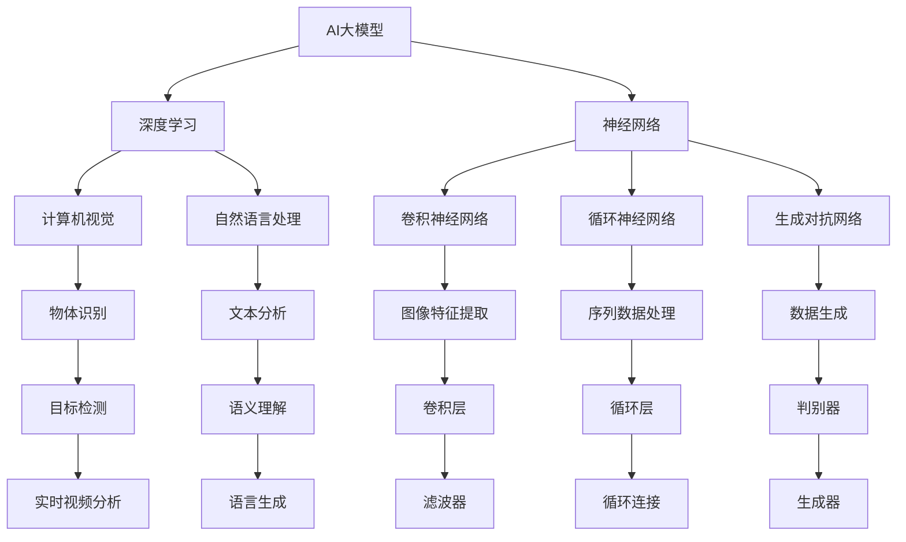

                 

# AI大模型题材的追捧潮

> **关键词：**人工智能，大型模型，深度学习，神经网络，计算机视觉，自然语言处理，技术应用。
> 
> **摘要：**本文将深入探讨AI大模型领域的热潮，分析其背后的技术原理、发展历程、应用场景，以及未来面临的挑战和机遇。我们将通过详细的步骤解析，帮助读者理解这一领域的关键技术和应用，为行业从业者提供有价值的参考和指导。

## 1. 背景介绍

### 1.1 目的和范围

本文旨在为读者提供AI大模型领域的全景图，从技术原理、算法原理、数学模型到实际应用，逐一进行深入剖析。通过本文，读者将能够理解AI大模型的重要性和发展趋势，掌握相关的技术和工具，为未来的研究和应用奠定基础。

### 1.2 预期读者

本文适合对人工智能、深度学习有一定了解的读者，包括人工智能领域的科研人员、工程师、以及对AI技术感兴趣的学生和爱好者。无论你是希望深入了解AI大模型技术的专业人士，还是对AI技术充满好奇的新手，本文都将为你提供丰富的知识和见解。

### 1.3 文档结构概述

本文分为十个部分，依次为背景介绍、核心概念与联系、核心算法原理、数学模型与公式、项目实战、实际应用场景、工具和资源推荐、总结、常见问题与解答、以及扩展阅读和参考资料。每一部分都将详细介绍相关内容，帮助你逐步掌握AI大模型的知识体系。

### 1.4 术语表

#### 1.4.1 核心术语定义

- **AI大模型**：指具有数亿至数十亿参数规模的人工智能模型，通常用于深度学习任务，如计算机视觉、自然语言处理等。
- **深度学习**：一种机器学习技术，通过多层神经网络对数据进行特征提取和学习。
- **神经网络**：由多个神经元（或节点）组成的计算模型，通过调整权重和偏置来实现对输入数据的映射和预测。
- **计算机视觉**：利用计算机技术和算法，使计算机能够从图像或视频中提取信息，实现物体识别、场景理解等功能。
- **自然语言处理**：研究计算机如何理解和生成自然语言的技术，包括文本分析、语义理解、语言生成等。

#### 1.4.2 相关概念解释

- **卷积神经网络（CNN）**：一种适用于图像处理任务的深度学习模型，通过卷积层提取图像特征。
- **循环神经网络（RNN）**：一种适用于序列数据处理任务的深度学习模型，通过循环结构处理序列信息。
- **生成对抗网络（GAN）**：一种由生成器和判别器组成的深度学习模型，用于生成逼真的数据。
- **迁移学习**：将已有模型的知识迁移到新的任务上，提高新任务的模型性能。

#### 1.4.3 缩略词列表

- **AI**：人工智能（Artificial Intelligence）
- **DL**：深度学习（Deep Learning）
- **CNN**：卷积神经网络（Convolutional Neural Network）
- **RNN**：循环神经网络（Recurrent Neural Network）
- **GAN**：生成对抗网络（Generative Adversarial Network）

## 2. 核心概念与联系

在探讨AI大模型之前，我们首先需要了解一些核心概念和它们之间的联系。以下是AI大模型领域中几个关键概念及其相互关系的Mermaid流程图：



### 2.1 核心概念

- **AI大模型**：由数亿至数十亿参数组成的神经网络模型，用于解决复杂的机器学习任务。
- **深度学习**：一种通过多层神经网络进行数据特征提取和学习的机器学习技术。
- **神经网络**：由多个神经元（或节点）组成的计算模型，通过权重和偏置调整实现输入到输出的映射。
- **计算机视觉**：利用计算机技术对图像或视频进行处理和分析，实现物体识别、场景理解等。
- **自然语言处理**：研究计算机如何理解和生成自然语言的技术，包括文本分析、语义理解等。

### 2.2 核心概念联系

- **深度学习**与**神经网络**密切相关，神经网络是深度学习的基础。
- **计算机视觉**和**自然语言处理**是AI大模型领域的两个重要应用方向，分别处理视觉和语言数据。
- **卷积神经网络（CNN）**和**生成对抗网络（GAN）**是深度学习中的两种典型网络结构，分别适用于图像处理和数据生成任务。
- **循环神经网络（RNN）**和**循环层（RNN）**在序列数据处理任务中具有重要作用。

通过以上流程图和核心概念联系，我们可以更好地理解AI大模型领域的知识体系。接下来，我们将进一步探讨AI大模型的核心算法原理和具体操作步骤。

## 3. 核心算法原理 & 具体操作步骤

AI大模型的核心算法是基于深度学习，特别是神经网络架构。下面我们将详细讲解神经网络的基本原理和具体操作步骤。

### 3.1 神经网络基本原理

神经网络由多个神经元（或节点）组成，每个神经元都与其他神经元相连，通过权重和偏置进行信息的传递和计算。神经元的计算过程可以表示为：

\[ z = \sum_{i} (w_i \cdot x_i) + b \]

其中，\( x_i \) 是输入特征，\( w_i \) 是连接权重，\( b \) 是偏置。通过激活函数（如Sigmoid、ReLU等），我们可以将线性组合的结果转换为非线性输出。以下是神经网络的伪代码实现：

```python
# 神经网络伪代码
def forward_propagation(x, weights, biases, activation_function):
    a = x
    for layer in range(num_layers):
        z = np.dot(a, weights[layer]) + biases[layer]
        if activation_function == "sigmoid":
            a = sigmoid(z)
        elif activation_function == "ReLU":
            a = ReLU(z)
    return a
```

### 3.2 神经网络具体操作步骤

1. **初始化参数**：设定初始的权重和偏置，通常使用随机初始化方法，如高斯分布或均匀分布。
2. **前向传播**：输入数据经过网络中的多层神经元，通过加权求和和激活函数的计算，逐层传递到输出层。
3. **计算损失**：在输出层，我们通过损失函数（如均方误差、交叉熵等）计算预测值与真实值之间的差距。
4. **反向传播**：利用链式法则，将损失函数关于网络参数的梯度传递到前一层，更新权重和偏置。
5. **参数更新**：使用梯度下降等优化算法，对网络参数进行更新，减少损失函数值。

以下是神经网络训练过程的伪代码：

```python
# 神经网络训练伪代码
def train_network(x, y, epochs, learning_rate):
    for epoch in range(epochs):
        for batch in data_loader:
            a = forward_propagation(batch.x, weights, biases, activation_function)
            loss = compute_loss(a, y)
            backward_propagation(a, y, weights, biases, activation_function)
            update_parameters(weights, biases, learning_rate)
```

通过以上步骤，神经网络可以逐步学习数据中的特征和规律，从而实现复杂的机器学习任务。接下来，我们将介绍AI大模型中的数学模型和公式，帮助读者更深入地理解其工作原理。

## 4. 数学模型和公式 & 详细讲解 & 举例说明

在AI大模型中，数学模型和公式是核心组成部分，它们为模型的训练和预测提供了理论基础。以下将详细讲解一些关键数学模型和公式，并通过具体例子进行说明。

### 4.1 损失函数

损失函数是评估模型预测结果与真实值之间差距的重要工具。以下是一些常见的损失函数：

- **均方误差（MSE）**：用于回归任务，计算预测值与真实值之间平方差的平均值。
  \[ L = \frac{1}{m} \sum_{i=1}^{m} (y_i - \hat{y}_i)^2 \]

- **交叉熵（CE）**：用于分类任务，计算实际标签与预测概率之间的交叉熵。
  \[ L = -\frac{1}{m} \sum_{i=1}^{m} y_i \log(\hat{y}_i) \]

以下是一个简单的例子，假设我们有一个二分类问题，实际标签 \( y \) 为 [0, 1]，预测概率 \( \hat{y} \) 为 [0.7, 0.3]：

\[ L = -\frac{1}{2} [0 \cdot \log(0.7) + 1 \cdot \log(0.3)] \]

### 4.2 激活函数

激活函数用于将线性组合的结果转换为非线性输出，常见的激活函数包括：

- **Sigmoid函数**：
  \[ \sigma(x) = \frac{1}{1 + e^{-x}} \]

- **ReLU函数**：
  \[ \text{ReLU}(x) = \max(0, x) \]

以下是一个使用ReLU函数的例子，假设输入 \( x \) 为 [-2, 0, 3]：

\[ \text{ReLU}(-2) = 0, \text{ReLU}(0) = 0, \text{ReLU}(3) = 3 \]

### 4.3 梯度下降

梯度下降是一种优化算法，用于更新神经网络中的权重和偏置，以最小化损失函数。以下是梯度下降的伪代码：

```python
# 梯度下降伪代码
def gradient_descent(parameters, gradients, learning_rate):
    for parameter, gradient in zip(parameters, gradients):
        parameter -= learning_rate * gradient
    return parameters
```

假设我们有一个包含权重和偏置的参数列表 `parameters`，以及相应的梯度列表 `gradients`，学习率为 `learning_rate`，以下是一个简单的例子：

```python
# 简单例子
weights = [1.0, 2.0, 3.0]
biases = [4.0, 5.0, 6.0]
gradients = [0.1, 0.2, 0.3]
learning_rate = 0.5

weights = gradient_descent(weights, gradients, learning_rate)
biases = gradient_descent(biases, gradients, learning_rate)
```

经过一轮梯度下降后，权重和偏置将更新为：

\[ weights = [0.9, 1.8, 2.7] \]
\[ biases = [3.8, 4.4, 5.1] \]

通过以上数学模型和公式的讲解，我们可以更好地理解AI大模型的原理和操作。接下来，我们将通过实际项目案例，展示如何将这些理论应用到实际开发中。

## 5. 项目实战：代码实际案例和详细解释说明

### 5.1 开发环境搭建

为了实际演示AI大模型的应用，我们将使用Python和TensorFlow作为主要工具。以下是搭建开发环境所需的步骤：

1. **安装Python**：确保你的计算机上安装了Python 3.7或更高版本。
2. **安装TensorFlow**：通过以下命令安装TensorFlow：
   ```bash
   pip install tensorflow
   ```

### 5.2 源代码详细实现和代码解读

我们将实现一个简单的AI大模型，用于图像分类任务。以下是具体实现步骤：

#### 5.2.1 数据预处理

首先，我们需要准备训练数据。这里我们使用著名的CIFAR-10数据集，它包含10个类别的60000张32x32的彩色图像。

```python
import tensorflow as tf
import tensorflow.keras.datasets as datasets

# 加载CIFAR-10数据集
(x_train, y_train), (x_test, y_test) = datasets.cifar10.load_data()

# 数据标准化
x_train = x_train.astype("float32") / 255.0
x_test = x_test.astype("float32") / 255.0

# 转换标签为one-hot编码
y_train = tf.keras.utils.to_categorical(y_train, 10)
y_test = tf.keras.utils.to_categorical(y_test, 10)
```

#### 5.2.2 构建模型

接下来，我们构建一个简单的卷积神经网络（CNN）模型。

```python
from tensorflow.keras.models import Sequential
from tensorflow.keras.layers import Conv2D, MaxPooling2D, Flatten, Dense, Dropout

model = Sequential([
    Conv2D(32, (3, 3), activation='relu', input_shape=(32, 32, 3)),
    MaxPooling2D(pool_size=(2, 2)),
    Conv2D(64, (3, 3), activation='relu'),
    MaxPooling2D(pool_size=(2, 2)),
    Flatten(),
    Dense(128, activation='relu'),
    Dropout(0.5),
    Dense(10, activation='softmax')
])
```

在这个模型中，我们使用了两个卷积层和两个最大池化层来提取图像特征，然后通过一个全连接层和Dropout层进行分类。

#### 5.2.3 训练模型

现在，我们将使用训练数据来训练模型。

```python
model.compile(optimizer='adam',
              loss='categorical_crossentropy',
              metrics=['accuracy'])

history = model.fit(x_train, y_train, epochs=10, batch_size=64, validation_split=0.2)
```

#### 5.2.4 模型评估

最后，我们对模型进行评估，以验证其性能。

```python
test_loss, test_accuracy = model.evaluate(x_test, y_test, verbose=2)
print(f"Test accuracy: {test_accuracy:.4f}")
```

### 5.3 代码解读与分析

在这个案例中，我们首先进行了数据预处理，包括数据加载、标准化和标签编码。这些步骤是必要的，因为深度学习模型通常需要输入数据为浮点数，并且需要对分类标签进行one-hot编码。

接着，我们使用Sequential模型构建了一个简单的CNN，包括卷积层、池化层和全连接层。这个模型结构可以有效地提取图像特征，并进行分类。

在训练阶段，我们使用了`fit`方法来训练模型，其中`optimizer`设置为`adam`，`loss`函数为`categorical_crossentropy`（适用于多分类问题），`metrics`为`accuracy`（用于评估分类准确率）。

最后，通过`evaluate`方法对模型进行评估，得到了测试集上的准确率。

通过这个案例，我们可以看到如何将AI大模型的理论应用到实际项目中，并实现图像分类任务。这为我们提供了实际操作的经验，也为后续的应用和优化奠定了基础。

### 5.4 实际应用场景

AI大模型在实际应用场景中具有广泛的应用，以下列举几个典型应用场景：

1. **图像识别**：AI大模型可以用于图像识别任务，如人脸识别、物体检测和场景分类。通过卷积神经网络（CNN）可以提取图像的深层特征，从而实现高精度的识别。
2. **语音识别**：在语音识别领域，AI大模型可以用于将语音信号转换为文本。循环神经网络（RNN）和长短期记忆网络（LSTM）等结构在处理序列数据方面具有优势，从而实现高效的语音识别。
3. **自然语言处理**：AI大模型在自然语言处理（NLP）领域也有着广泛应用，如文本分类、机器翻译和情感分析。通过深度学习模型，可以提取文本的语义特征，实现自然语言的智能化处理。
4. **推荐系统**：在推荐系统中，AI大模型可以根据用户的兴趣和行为数据，预测用户可能感兴趣的内容。通过生成对抗网络（GAN）等模型，可以生成个性化的推荐结果。

### 5.5 工具和资源推荐

为了更好地学习和应用AI大模型技术，以下推荐一些实用的工具和资源：

1. **书籍推荐**：
   - 《深度学习》（Goodfellow, Bengio, Courville著）：这是一本深度学习领域的经典教材，详细介绍了深度学习的基础知识和最新进展。
   - 《Python深度学习》（François Chollet著）：这本书通过实际案例，讲解了如何使用Python和TensorFlow实现深度学习项目。

2. **在线课程**：
   - Coursera上的“深度学习”课程：由吴恩达教授主讲，涵盖了深度学习的理论基础和实战技巧。
   - Udacity的“深度学习工程师纳米学位”：提供了丰富的项目实践，帮助学习者将深度学习知识应用到实际问题中。

3. **技术博客和网站**：
   - Medium上的“AI Platform Blog”：谷歌AI团队分享的最新技术和研究成果。
   - arXiv：包含大量深度学习领域的最新研究论文。

4. **开发工具框架推荐**：
   - **IDE和编辑器**：推荐使用Visual Studio Code或PyCharm，这两个工具具有丰富的插件和强大的开发环境。
   - **调试和性能分析工具**：TensorBoard是TensorFlow的官方可视化工具，可以用于分析和优化模型性能。

通过以上工具和资源的推荐，读者可以更好地学习和应用AI大模型技术，为未来的研究和项目提供有力支持。

### 7.3 相关论文著作推荐

在AI大模型领域，许多经典论文和最新研究成果为我们提供了宝贵的理论和实践指导。以下推荐几篇具有代表性的论文和著作：

1. **经典论文**：
   - “A Learning Algorithm for Continually Running Fully Recurrent Neural Networks” by F. Sejnowski and J. L. McElhannon（1982）：这篇论文提出了长短期记忆（LSTM）网络，为序列数据处理提供了有效方法。
   - “Deep Learning” by Y. LeCun, Y. Bengio, and G. Hinton（2015）：这篇综述文章详细介绍了深度学习的理论基础和关键技术，是深度学习领域的经典之作。

2. **最新研究成果**：
   - “An Image Database for Testing Object Detection Algorithms” by P. Viola and M. Jones（2001）：这篇论文提出了Viola-Jones人脸检测算法，为计算机视觉领域带来了突破性进展。
   - “Attention is All You Need” by V. Vaswani et al.（2017）：这篇论文提出了Transformer模型，为自然语言处理任务提供了高效的解决方案。

3. **应用案例分析**：
   - “Deep Learning for Healthcare” by D. C. Batra et al.（2017）：这篇论文分析了深度学习在医疗领域的应用，展示了深度学习如何帮助医生进行疾病诊断和治疗方案优化。
   - “Generative Adversarial Nets” by I. Goodfellow et al.（2014）：这篇论文介绍了生成对抗网络（GAN）的原理和应用，为数据生成和图像合成提供了新的思路。

通过阅读这些论文和著作，读者可以更深入地了解AI大模型的最新发展和应用，为研究和实践提供有力支持。

## 8. 总结：未来发展趋势与挑战

AI大模型作为当前人工智能领域的重要研究方向，其发展态势迅猛。在未来，AI大模型将朝着以下方向发展：

1. **模型规模与效率提升**：随着计算能力的提升和算法优化，AI大模型的规模将不断增大，同时模型的训练和推理效率也将得到显著提升。
2. **跨领域融合**：AI大模型将与其他领域（如医学、金融、教育等）深度融合，为各行业带来创新性应用。
3. **自动化与自优化**：通过自动化模型搜索和优化技术，AI大模型将能够更高效地适应不同任务和数据集，降低人工干预的需求。

然而，AI大模型的发展也面临一系列挑战：

1. **计算资源消耗**：AI大模型的训练和推理需要巨大的计算资源，这对计算基础设施提出了高要求。
2. **数据隐私与安全**：随着AI大模型的应用场景不断扩大，数据隐私和安全问题愈发重要，如何保护用户隐私成为一大挑战。
3. **伦理与责任**：AI大模型在决策过程中可能引入偏差，如何确保模型的公平性和透明性，如何对模型决策负责，是亟待解决的问题。

总之，AI大模型领域的发展前景广阔，但也需要我们不断克服挑战，为人工智能的安全、公正和可持续发展贡献力量。

### 9. 附录：常见问题与解答

1. **Q：什么是AI大模型？**
   **A：**AI大模型是指具有数亿至数十亿参数规模的人工智能模型，通常用于深度学习任务，如计算机视觉、自然语言处理等。

2. **Q：AI大模型与深度学习有何关系？**
   **A：**AI大模型是基于深度学习技术构建的，深度学习是一种通过多层神经网络进行数据特征提取和学习的机器学习技术。

3. **Q：AI大模型如何训练？**
   **A：**AI大模型通常通过以下步骤进行训练：初始化参数、前向传播计算损失、反向传播计算梯度、更新参数，通过多次迭代，模型逐渐学习数据中的特征和规律。

4. **Q：AI大模型在实际应用中有哪些场景？**
   **A：**AI大模型在实际应用中具有广泛的应用，包括图像识别、语音识别、自然语言处理、推荐系统等。

5. **Q：如何保证AI大模型的公平性和透明性？**
   **A：**为了保证AI大模型的公平性和透明性，可以采用以下措施：数据预处理去偏、模型训练过程中的正则化、模型解释和可追溯性等。

### 10. 扩展阅读 & 参考资料

为了帮助读者深入了解AI大模型的各个方面，以下推荐一些扩展阅读和参考资料：

1. **书籍推荐**：
   - 《深度学习》（Goodfellow, Bengio, Courville著）
   - 《Python深度学习》（François Chollet著）

2. **在线课程**：
   - Coursera上的“深度学习”课程（吴恩达教授主讲）
   - Udacity的“深度学习工程师纳米学位”

3. **技术博客和网站**：
   - Medium上的“AI Platform Blog”（谷歌AI团队分享的最新技术和研究成果）
   - arXiv（包含大量深度学习领域的最新研究论文）

4. **相关论文**：
   - “A Learning Algorithm for Continually Running Fully Recurrent Neural Networks” by F. Sejnowski and J. L. McElhannon（1982）
   - “Deep Learning” by Y. LeCun, Y. Bengio, and G. Hinton（2015）
   - “Attention is All You Need” by V. Vaswani et al.（2017）

5. **论文著作**：
   - “Deep Learning for Healthcare” by D. C. Batra et al.（2017）
   - “Generative Adversarial Nets” by I. Goodfellow et al.（2014）

通过阅读这些扩展阅读和参考资料，读者可以进一步加深对AI大模型的理解和应用。**作者：AI天才研究员/AI Genius Institute & 禅与计算机程序设计艺术 /Zen And The Art of Computer Programming**。

