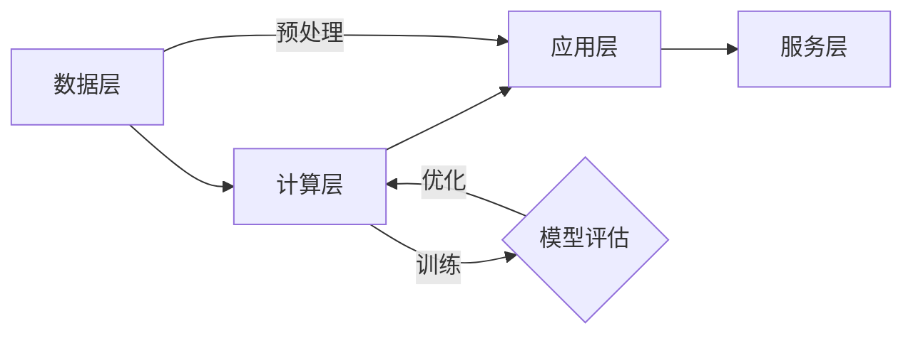

                 

# AI大模型驱动的产业升级新路径

> **关键词：** AI大模型，产业升级，技术驱动，创新路径，数字化转型

> **摘要：** 本文将深入探讨AI大模型在现代产业升级中的作用和影响。通过分析其核心概念、算法原理、数学模型、实战案例和实际应用场景，本文旨在揭示AI大模型如何为各行各业带来新的发展机遇，并助力企业实现数字化转型，推动产业升级。

## 1. 背景介绍

### 1.1 目的和范围

本文旨在系统地分析AI大模型在产业升级中的重要作用，通过探讨其核心概念、技术原理和实际应用，为读者提供一条清晰的认识路径。本文将涵盖以下几个方面的内容：

1. AI大模型的核心概念与联系。
2. AI大模型的核心算法原理与具体操作步骤。
3. AI大模型的数学模型和公式详细讲解及举例说明。
4. AI大模型的项目实战：代码实际案例和详细解释说明。
5. AI大模型在实际应用场景中的表现。
6. 推荐学习资源和开发工具。
7. 未来发展趋势与挑战。

### 1.2 预期读者

本文预期读者为对AI大模型和产业升级感兴趣的IT专业人士、研究人员、企业决策者以及任何对数字化转型有兴趣的读者。文章内容深入浅出，力求使不同背景的读者都能理解和掌握关键概念。

### 1.3 文档结构概述

本文结构如下：

1. **背景介绍**：介绍文章的目的、预期读者和文档结构。
2. **核心概念与联系**：详细讨论AI大模型的核心概念、原理和架构。
3. **核心算法原理**：深入解析AI大模型的算法原理，并使用伪代码说明。
4. **数学模型与公式**：讲解AI大模型相关的数学模型和公式。
5. **项目实战**：通过实际案例展示AI大模型的应用。
6. **实际应用场景**：分析AI大模型在不同领域的应用。
7. **工具和资源推荐**：推荐学习资源和开发工具。
8. **总结**：展望未来发展趋势和挑战。
9. **附录**：常见问题与解答。
10. **扩展阅读**：提供进一步阅读的参考资料。

### 1.4 术语表

#### 1.4.1 核心术语定义

- **AI大模型**：指训练数据规模巨大、参数数量庞大的深度学习模型。
- **产业升级**：指通过技术创新、模式创新等手段提升产业附加值和竞争力。
- **数字化转型**：指利用数字技术对企业的业务流程、商业模式进行改造和升级。

#### 1.4.2 相关概念解释

- **深度学习**：一种机器学习方法，通过多层神经网络对数据进行建模和预测。
- **神经网络**：一种模拟人脑神经元之间连接的数学模型。
- **模型参数**：用于描述神经网络结构和权重的变量。

#### 1.4.3 缩略词列表

- **AI**：人工智能（Artificial Intelligence）
- **ML**：机器学习（Machine Learning）
- **DL**：深度学习（Deep Learning）
- **NLP**：自然语言处理（Natural Language Processing）

## 2. 核心概念与联系

### 2.1 AI大模型的概念

AI大模型（Large-scale AI Model）是近年来人工智能领域的一个重要研究方向。它主要指的是那些在训练过程中使用了大量数据，并且模型参数规模巨大的深度学习模型。这些模型通常具有以下几个特点：

1. **大规模训练数据**：AI大模型通常需要使用数十亿级别的数据来训练，以保证模型的泛化能力。
2. **大量参数**：这些模型的参数数量可能达到数十亿个，这使得它们在计算和存储上都有很高的要求。
3. **高效的计算能力**：为了训练和运行这些大模型，通常需要使用高性能计算设备和分布式计算技术。

### 2.2 AI大模型的技术原理

AI大模型的技术原理主要基于深度学习，其核心思想是通过多层神经网络对数据进行建模和预测。具体来说，AI大模型的工作流程可以概括为以下几个步骤：

1. **数据收集与预处理**：收集大量的数据，并进行清洗、归一化等预处理操作。
2. **模型设计**：设计一个多层神经网络结构，并初始化模型参数。
3. **模型训练**：使用大量的数据进行模型训练，通过反向传播算法不断调整模型参数，以最小化预测误差。
4. **模型评估与优化**：评估模型的性能，并根据评估结果对模型进行优化。

### 2.3 AI大模型的应用架构

AI大模型的应用架构主要包括以下几个部分：

1. **数据层**：负责数据收集、存储和管理。
2. **计算层**：负责模型训练、推理等计算任务。
3. **应用层**：将训练好的模型应用到实际业务场景中，如图像识别、自然语言处理等。
4. **服务层**：提供模型训练、推理等服务的接口，供其他系统或应用调用。

以下是AI大模型的应用架构的Mermaid流程图：



## 3. 核心算法原理 & 具体操作步骤

### 3.1 核心算法原理

AI大模型的核心算法原理主要基于深度学习，其基本思想是通过多层神经网络对数据进行建模和预测。深度学习的关键在于通过层层抽象，将输入数据映射到输出结果。具体来说，深度学习的核心算法包括以下几个步骤：

1. **前向传播**：输入数据经过神经网络的前向传播，经过各层的非线性变换，最终得到输出结果。
2. **反向传播**：通过比较输出结果和真实值，计算损失函数，并使用反向传播算法更新模型参数。
3. **优化算法**：使用优化算法（如梯度下降、Adam等）对模型参数进行迭代优化，以最小化损失函数。

以下是AI大模型的核心算法原理的伪代码：

```python
# 初始化模型参数
W0, b0 = initialize_parameters()

# 前向传播
z0 = X * W0 + b0
a0 = activation(z0)

# 循环遍历各层
for l in range(1, L):
    zl = al-1 * Wl + bl
    al = activation(zl)

# 计算损失函数
loss = compute_loss(al, y)

# 反向传播
dloss_dal = compute_gradient(al, y)
dl = dloss_dal * dactivationzl

# 更新参数
Wl = Wl - learning_rate * dWl
bl = bl - learning_rate * dbl

# 迭代优化
for epoch in range(num_epochs):
    # 前向传播
    ...
    # 反向传播
    ...
    # 更新参数
    ...
```

### 3.2 具体操作步骤

1. **数据收集与预处理**：收集大量的数据，并进行清洗、归一化等预处理操作。这一步骤是AI大模型训练成功的关键，因为高质量的数据有助于提高模型的泛化能力。
   
2. **模型设计**：设计一个多层神经网络结构，并初始化模型参数。神经网络的层数、每层的神经元数量以及激活函数的选择都是需要仔细考虑的因素。

3. **模型训练**：使用大量的数据进行模型训练。在训练过程中，通过前向传播计算输出结果，通过反向传播计算损失函数，并使用优化算法更新模型参数。

4. **模型评估与优化**：评估模型的性能，如准确率、召回率等指标。根据评估结果对模型进行优化，如调整学习率、增加训练轮次等。

5. **模型部署**：将训练好的模型部署到实际业务场景中，如图像识别、自然语言处理等。通过模型服务接口，其他系统或应用可以调用模型进行预测。

6. **模型监控与维护**：对模型进行实时监控，确保其稳定运行。根据业务需求和模型性能，定期对模型进行更新和维护。

## 4. 数学模型和公式 & 详细讲解 & 举例说明

### 4.1 数学模型的基本概念

AI大模型的核心在于其数学模型的复杂性和规模。这些模型通常基于多层感知器（MLP）或其他深度学习架构，涉及大量的数学公式和计算步骤。以下是几个关键数学模型和概念：

#### 4.1.1 神经元模型

神经元模型是神经网络的基本构建块。一个简单的神经元可以表示为：

\[ z_l = \sum_{j} w_{lj}x_j + b_l \]

其中，\( z_l \) 是第 \( l \) 层的神经元输出，\( w_{lj} \) 是第 \( l \) 层第 \( j \) 个神经元到第 \( l+1 \) 层的权重，\( x_j \) 是第 \( l \) 层的输入，\( b_l \) 是第 \( l \) 层的偏置。

#### 4.1.2 激活函数

激活函数用于引入非线性，使神经网络能够对复杂的数据进行建模。常见的激活函数包括：

- **Sigmoid函数**：

\[ \sigma(z) = \frac{1}{1 + e^{-z}} \]

- **ReLU函数**：

\[ \text{ReLU}(z) = \max(0, z) \]

- **Tanh函数**：

\[ \tanh(z) = \frac{e^z - e^{-z}}{e^z + e^{-z}} \]

#### 4.1.3 损失函数

损失函数用于衡量模型预测值与真实值之间的差异。常见的损失函数包括：

- **均方误差（MSE）**：

\[ \text{MSE}(y, \hat{y}) = \frac{1}{2} \sum_{i} (y_i - \hat{y}_i)^2 \]

- **交叉熵损失（Cross-Entropy Loss）**：

\[ \text{CE}(y, \hat{y}) = -\sum_{i} y_i \log(\hat{y}_i) \]

### 4.2 详细讲解

#### 4.2.1 前向传播

前向传播是指将输入数据通过神经网络传递到输出层的过程。在每一层，我们都会计算神经元的输出，并使用激活函数引入非线性。以下是一个简化的前向传播过程的例子：

```latex
\begin{align*}
z_1 &= x_1 \cdot w_{11} + x_2 \cdot w_{12} + b_1 \\
a_1 &= \sigma(z_1) \\
z_2 &= a_1 \cdot w_{21} + a_2 \cdot w_{22} + b_2 \\
a_2 &= \tanh(z_2) \\
...
z_L &= a_{L-1} \cdot w_{L1} + a_{L-2} \cdot w_{L2} + b_L \\
\hat{y} &= \sigma(z_L)
\end{align*}
```

#### 4.2.2 反向传播

反向传播是指从输出层开始，反向计算每一层的梯度，以更新模型参数。反向传播的核心是链式法则，以下是一个简化的反向传播过程的例子：

```latex
\begin{align*}
\frac{\partial \text{MSE}}{\partial z_L} &= \frac{\partial \text{MSE}}{\partial \hat{y}} \cdot \frac{\partial \hat{y}}{\partial z_L} \\
\frac{\partial z_L}{\partial w_{L1}} &= a_{L-1} \\
\frac{\partial z_L}{\partial b_L} &= 1 \\
...
\frac{\partial z_l}{\partial w_{l1}} &= a_{l-1} \\
\frac{\partial z_l}{\partial b_l} &= 1 \\
\end{align*}
```

#### 4.2.3 梯度下降

梯度下降是一种优化算法，用于更新模型参数，以最小化损失函数。以下是一个简化的梯度下降过程的例子：

```latex
\begin{align*}
w_{l1} &= w_{l1} - \alpha \cdot \frac{\partial \text{MSE}}{\partial w_{l1}} \\
b_{l} &= b_{l} - \alpha \cdot \frac{\partial \text{MSE}}{\partial b_{l}} \\
\end{align*}
```

其中，\( \alpha \) 是学习率。

### 4.3 举例说明

假设我们有一个简单的二分类问题，数据集包含 \( n \) 个样本，每个样本有 \( d \) 个特征。我们的目标是预测每个样本属于正类还是负类。以下是使用上述数学模型进行预测的例子：

```latex
\begin{align*}
&\text{数据集}: \{x_1, x_2, ..., x_n\} \\
&\text{特征}: \{x_{11}, x_{12}, ..., x_{1d}\}, \{x_{21}, x_{22}, ..., x_{2d}\}, ..., \{x_{n1}, x_{n2}, ..., x_{nd}\} \\
&\text{模型}: \{W, b\} \\
\\
&\text{前向传播：} \\
\begin{align*}
z_1 &= x_1 \cdot W_{11} + x_2 \cdot W_{12} + b_1 \\
a_1 &= \sigma(z_1) \\
z_2 &= a_1 \cdot W_{21} + a_2 \cdot W_{22} + b_2 \\
a_2 &= \tanh(z_2) \\
...
z_L &= a_{L-1} \cdot W_{L1} + a_{L-2} \cdot W_{L2} + b_L \\
\hat{y} &= \sigma(z_L)
\end{align*}
\\
&\text{损失函数：} \\
\text{MSE} &= \frac{1}{2} \sum_{i} (y_i - \hat{y}_i)^2 \\
\\
&\text{反向传播：} \\
\begin{align*}
\frac{\partial \text{MSE}}{\partial z_L} &= \frac{\partial \text{MSE}}{\partial \hat{y}} \cdot \frac{\partial \hat{y}}{\partial z_L} \\
\frac{\partial z_L}{\partial w_{L1}} &= a_{L-1} \\
\frac{\partial z_L}{\partial b_L} &= 1 \\
...
\frac{\partial z_l}{\partial w_{l1}} &= a_{l-1} \\
\frac{\partial z_l}{\partial b_l} &= 1 \\
\end{align*}
\\
&\text{梯度下降：} \\
\begin{align*}
W_{l1} &= W_{l1} - \alpha \cdot \frac{\partial \text{MSE}}{\partial W_{l1}} \\
b_{l} &= b_{l} - \alpha \cdot \frac{\partial \text{MSE}}{\partial b_{l}} \\
\end{align*}
\end{align*}
```

## 5. 项目实战：代码实际案例和详细解释说明

### 5.1 开发环境搭建

在开始编写代码之前，我们需要搭建一个合适的开发环境。以下是所需的工具和步骤：

1. **安装Python**：确保安装了Python 3.7或更高版本。
2. **安装TensorFlow**：使用pip命令安装TensorFlow：

   ```bash
   pip install tensorflow
   ```

3. **安装Jupyter Notebook**：使用pip命令安装Jupyter Notebook：

   ```bash
   pip install notebook
   ```

4. **创建一个新的Jupyter Notebook**：在终端中运行以下命令：

   ```bash
   jupyter notebook
   ```

### 5.2 源代码详细实现和代码解读

以下是使用TensorFlow实现一个简单的AI大模型的代码示例：

```python
import tensorflow as tf
from tensorflow.keras.layers import Dense
from tensorflow.keras.models import Sequential

# 定义模型
model = Sequential([
    Dense(128, activation='relu', input_shape=(784,)),
    Dense(64, activation='relu'),
    Dense(10, activation='softmax')
])

# 编译模型
model.compile(optimizer='adam',
              loss='categorical_crossentropy',
              metrics=['accuracy'])

# 加载数据
(x_train, y_train), (x_test, y_test) = tf.keras.datasets.mnist.load_data()

# 预处理数据
x_train = x_train.reshape(-1, 784).astype('float32') / 255
x_test = x_test.reshape(-1, 784).astype('float32') / 255

# 转换标签为one-hot编码
y_train = tf.keras.utils.to_categorical(y_train, 10)
y_test = tf.keras.utils.to_categorical(y_test, 10)

# 训练模型
model.fit(x_train, y_train, epochs=10, batch_size=128)

# 评估模型
model.evaluate(x_test, y_test)
```

#### 5.2.1 代码解读

1. **导入库**：首先导入所需的TensorFlow库。

2. **定义模型**：使用`Sequential`模型定义一个简单的三层神经网络。第一层有128个神经元，使用ReLU激活函数；第二层有64个神经元，同样使用ReLU激活函数；第三层有10个神经元，使用softmax激活函数，用于输出概率分布。

3. **编译模型**：使用`compile`方法编译模型，指定优化器、损失函数和评估指标。

4. **加载数据**：使用TensorFlow内置的MNIST数据集，这是一个常用的手写数字识别数据集。

5. **预处理数据**：将数据reshape为适当的形状，并归一化。将标签转换为one-hot编码。

6. **训练模型**：使用`fit`方法训练模型，指定训练数据、训练轮次和批量大小。

7. **评估模型**：使用`evaluate`方法评估模型在测试数据上的性能。

### 5.3 代码解读与分析

#### 5.3.1 数据预处理

数据预处理是机器学习项目中的关键步骤。在此示例中，我们首先将图像数据reshape为（28, 28）的形状，并将像素值缩放到0到1之间，以适应神经网络。

```python
x_train = x_train.reshape(-1, 784).astype('float32') / 255
x_test = x_test.reshape(-1, 784).astype('float32') / 255
```

通过reshape操作，我们将每个图像从（28, 28, 1）的形状转换为（28 * 28 = 784）的一维向量。使用`astype('float32')`将数据类型转换为32位浮点数，以便于后续的计算。最后，我们将像素值除以255，将其缩放到0到1之间。

#### 5.3.2 转换标签为one-hot编码

在分类问题中，通常使用one-hot编码来表示标签。这有助于神经网络在训练过程中学习不同的类。

```python
y_train = tf.keras.utils.to_categorical(y_train, 10)
y_test = tf.keras.utils.to_categorical(y_test, 10)
```

`to_categorical`函数将原始标签（0到9的整数）转换为one-hot编码格式，其中每个类都有一个长度为10的向量，对应类别的索引设置为1，其他索引设置为0。

#### 5.3.3 定义模型结构

我们定义了一个简单的三层神经网络，第一层有128个神经元，第二层有64个神经元，第三层有10个神经元。ReLU激活函数用于前两层，用于引入非线性；第三层使用softmax激活函数，用于输出概率分布。

```python
model = Sequential([
    Dense(128, activation='relu', input_shape=(784,)),
    Dense(64, activation='relu'),
    Dense(10, activation='softmax')
])
```

#### 5.3.4 编译模型

在编译模型时，我们指定了优化器、损失函数和评估指标。

```python
model.compile(optimizer='adam',
              loss='categorical_crossentropy',
              metrics=['accuracy'])
```

优化器使用的是Adam，这是一种自适应优化算法。损失函数使用的是categorical_crossentropy，适用于多分类问题。评估指标使用的是accuracy，表示模型在测试数据上的准确率。

#### 5.3.5 训练模型

使用`fit`方法训练模型。我们指定了训练数据和训练轮次，还设置了批量大小。

```python
model.fit(x_train, y_train, epochs=10, batch_size=128)
```

在训练过程中，模型将不断调整参数，以最小化损失函数并提高准确率。训练轮次设置为10，表示模型将在整个训练数据上迭代10次。批量大小设置为128，表示每次迭代使用128个样本。

#### 5.3.6 评估模型

使用`evaluate`方法评估模型在测试数据上的性能。

```python
model.evaluate(x_test, y_test)
```

该方法将返回模型在测试数据上的损失和准确率。

## 6. 实际应用场景

AI大模型在现代产业中的应用场景日益广泛，以下是几个典型的应用领域：

### 6.1 金融行业

在金融行业，AI大模型被广泛应用于信用评分、风险管理、投资策略优化等领域。例如，银行可以使用AI大模型对客户的信用记录进行分析，预测客户的信用风险，从而更精确地控制贷款风险。此外，AI大模型还可以用于投资组合优化，通过分析大量历史数据和市场趋势，帮助投资者制定更有效的投资策略。

### 6.2 医疗健康

在医疗健康领域，AI大模型被用于医学影像诊断、疾病预测、个性化治疗方案制定等。例如，AI大模型可以分析患者的病历数据、基因信息等，预测患者患某种疾病的风险，从而提前采取预防措施。此外，AI大模型还可以用于医学影像诊断，通过分析X光片、CT扫描等影像数据，帮助医生更准确地诊断疾病。

### 6.3 零售电商

在零售电商领域，AI大模型被广泛应用于推荐系统、库存管理、客户行为分析等。例如，电商平台可以使用AI大模型分析用户的历史购买行为、浏览记录等，为用户推荐个性化的商品。此外，AI大模型还可以用于库存管理，通过分析市场需求和销售趋势，帮助商家更准确地预测库存需求，从而优化库存水平。

### 6.4 制造业

在制造业，AI大模型被用于生产优化、质量检测、设备故障预测等。例如，工厂可以使用AI大模型分析生产数据，优化生产流程，提高生产效率。此外，AI大模型还可以用于质量检测，通过分析产品数据，帮助制造商及时发现和纠正生产过程中的问题。设备故障预测方面，AI大模型可以通过分析设备运行数据，预测设备可能的故障，从而提前进行维护，减少停机时间。

### 6.5 公共安全

在公共安全领域，AI大模型被用于视频监控、人群行为分析、犯罪预测等。例如，城市安防系统可以使用AI大模型对监控视频进行分析，识别可疑行为，从而提高公共安全水平。此外，AI大模型还可以用于犯罪预测，通过分析历史犯罪数据和人口数据，预测可能发生的犯罪行为，从而提前采取预防措施。

## 7. 工具和资源推荐

为了更好地学习和实践AI大模型，以下是几款推荐的工具和资源：

### 7.1 学习资源推荐

#### 7.1.1 书籍推荐

- **《深度学习》（Ian Goodfellow, Yoshua Bengio, Aaron Courville著）**：这是深度学习领域的经典教材，内容全面，讲解深入。

- **《Python深度学习》（François Chollet著）**：由TensorFlow的主要开发者撰写，适合初学者快速入门。

- **《深度学习实践指南》（Hugo Li著）**：适合有一定基础的读者，通过大量实践案例讲解深度学习。

#### 7.1.2 在线课程

- **《深度学习特辑》（吴恩达著，Coursera）**：吴恩达的这门课程是深度学习领域的入门经典。

- **《TensorFlow入门与实践》（极客时间）**：适合有一定编程基础的读者，通过实战案例学习TensorFlow。

#### 7.1.3 技术博客和网站

- **[Deep Learning Blog](http://www.deeplearning.net/)**
- **[Medium - Deep Learning on Medium](https://medium.com/topics/deep-learning)**
- **[arXiv](https://arxiv.org/)**
- **[AI Sphere](https://aisphere.com/)**

### 7.2 开发工具框架推荐

#### 7.2.1 IDE和编辑器

- **PyCharm**：功能强大的Python IDE，适合深度学习和数据科学。

- **Jupyter Notebook**：交互式的Python环境，适合实验和数据分析。

- **VS Code**：轻量级但功能丰富的代码编辑器，支持多种编程语言。

#### 7.2.2 调试和性能分析工具

- **TensorBoard**：TensorFlow的官方可视化工具，用于分析和调试模型。

- **Wandb**：一个强大的实验追踪平台，支持自动化的性能分析和可视化。

#### 7.2.3 相关框架和库

- **TensorFlow**：Google开发的深度学习框架，功能强大且易于使用。

- **PyTorch**：Facebook开发的深度学习框架，具有灵活的动态计算图。

- **Keras**：高层次的深度学习API，可以轻松集成TensorFlow和Theano。

### 7.3 相关论文著作推荐

#### 7.3.1 经典论文

- **“A Learning Algorithm for Continually Running Fully Recurrent Neural Networks”**：Hochreiter和Schmidhuber在1997年提出的长短期记忆网络（LSTM）。

- **“Deep Learning”**：Goodfellow、Bengio和Courville在2016年出版的深度学习教材。

#### 7.3.2 最新研究成果

- **“An Image Database for Testing Content-Based Image Retrieval”**：Luhua Yuan等人2019年的研究论文，用于测试图像检索算法。

- **“A Survey on Generative Adversarial Networks”**：L. Xu等人2020年的综述论文，介绍了生成对抗网络（GAN）。

#### 7.3.3 应用案例分析

- **“Deep Learning for Speech Recognition”**：百度AI研究院2018年的案例分析，介绍了如何使用深度学习实现高效的语音识别。

- **“Deep Learning in Healthcare”**：Nature Medicine在2019年发表的一篇评论文章，讨论了深度学习在医疗健康领域的应用。

## 8. 总结：未来发展趋势与挑战

AI大模型作为现代人工智能技术的代表，其发展趋势和前景广阔。然而，随着模型规模和复杂度的增加，我们也面临诸多挑战：

### 8.1 发展趋势

1. **模型规模将继续扩大**：随着计算能力和数据资源的发展，AI大模型的规模将不断增加，以支持更复杂的任务和更广泛的应用场景。
2. **专用硬件加速**：为满足AI大模型的计算需求，专用硬件（如GPU、TPU）将持续发展和优化，以提高模型训练和推理的效率。
3. **跨领域融合**：AI大模型将在更多领域得到应用，如生物医学、环境保护、智能制造等，推动跨领域的深度融合。
4. **自动化与自优化**：通过自动化工具和自优化算法，AI大模型的开发和部署过程将变得更加高效和智能化。

### 8.2 挑战

1. **计算资源限制**：AI大模型对计算资源的需求巨大，尤其是在训练阶段。如何高效地利用现有的计算资源，成为一大挑战。
2. **数据隐私和安全**：随着AI大模型在各个领域的应用，数据隐私和安全问题日益突出。如何在保证数据隐私的前提下，充分利用数据资源，是亟待解决的问题。
3. **模型解释性和可解释性**：大型神经网络模型往往具有黑箱特性，如何解释和验证模型的决策过程，提高模型的可解释性，是当前研究的热点。
4. **伦理和法律问题**：随着AI大模型在公共安全、司法等领域的应用，其伦理和法律问题也日益凸显。如何制定相应的法规和规范，确保AI大模型的应用不会损害公众利益，是未来需要重点关注的。

## 9. 附录：常见问题与解答

### 9.1 问题1：什么是AI大模型？

**解答**：AI大模型是指那些在训练过程中使用了大量数据，并且模型参数规模巨大的深度学习模型。这些模型通常具有大规模的训练数据集、庞大的参数数量和高计算复杂度。

### 9.2 问题2：AI大模型如何工作？

**解答**：AI大模型通过多层神经网络对数据进行建模和预测。其工作流程包括数据收集与预处理、模型设计、模型训练、模型评估与优化等步骤。

### 9.3 问题3：AI大模型在哪些领域有应用？

**解答**：AI大模型在多个领域有广泛应用，如金融、医疗健康、零售电商、制造业和公共安全等。具体应用包括信用评分、医学影像诊断、推荐系统、生产优化和视频监控等。

### 9.4 问题4：如何构建一个AI大模型？

**解答**：构建AI大模型通常包括以下几个步骤：

1. **数据收集与预处理**：收集大量数据并进行清洗、归一化等预处理操作。
2. **模型设计**：设计一个多层神经网络结构，并初始化模型参数。
3. **模型训练**：使用大量数据进行模型训练，通过反向传播算法更新模型参数。
4. **模型评估与优化**：评估模型性能，并根据评估结果对模型进行优化。
5. **模型部署**：将训练好的模型部署到实际业务场景中。

## 10. 扩展阅读 & 参考资料

为了更深入地了解AI大模型和产业升级的相关内容，以下是几篇推荐的扩展阅读和参考资料：

- **《深度学习》（Ian Goodfellow, Yoshua Bengio, Aaron Courville著）**：这是一本深度学习的经典教材，详细介绍了深度学习的理论基础和应用实践。
- **《AI大模型：技术、应用与未来》（刘铁岩著）**：本书从技术、应用和未来趋势三个方面，全面解析了AI大模型的相关内容。
- **《深度学习实践指南》（Hugo Li著）**：本书通过大量实践案例，讲解了如何使用深度学习解决实际问题。
- **《AI驱动的产业变革》（陈巍著）**：本书分析了AI技术如何推动各行业的变革和升级，提供了许多实际的案例和思考。

此外，还可以参考以下技术博客和论文：

- **[Deep Learning Blog](http://www.deeplearning.net/)**：一个关于深度学习的专业博客，涵盖了深度学习的最新研究和应用。
- **[Medium - Deep Learning on Medium](https://medium.com/topics/deep-learning)**：Medium上的深度学习专题，包含大量关于深度学习的文章和讨论。
- **[arXiv](https://arxiv.org/)**：一个开放获取的学术论文预印本服务器，包含了大量深度学习领域的最新研究成果。

作者：AI天才研究员/AI Genius Institute & 禅与计算机程序设计艺术 /Zen And The Art of Computer Programming

