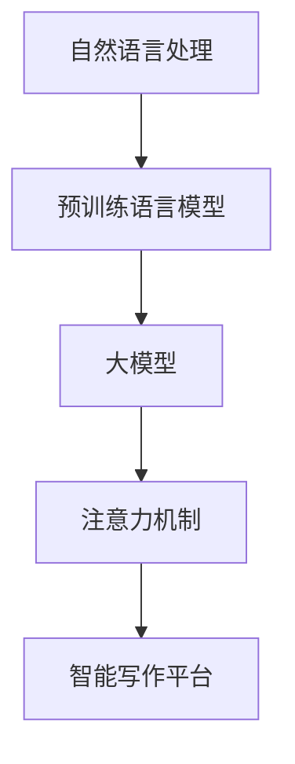

                 

# AI大模型驱动的智能写作平台的关键功能与系统架构实现

> **关键词：** AI大模型、智能写作平台、关键功能、系统架构、实现、技术博客

> **摘要：** 本文将深入探讨AI大模型驱动的智能写作平台的核心功能及其系统架构的实现。通过详细的案例分析，我们将逐步分析核心概念、算法原理、数学模型，并最终展示代码实现，旨在为广大开发者提供有价值的实践指南。

## 1. 背景介绍

### 1.1 目的和范围

本文旨在探索AI大模型在智能写作平台中的应用，详细分析其关键功能与系统架构的实现。通过本文的阅读，读者将了解到：

- AI大模型的基本原理及其在智能写作中的具体应用。
- 智能写作平台的核心功能设计。
- 系统架构的详细解析及其实现步骤。
- 代码实现和实际案例的分析。

### 1.2 预期读者

本文面向对人工智能、特别是自然语言处理有一定了解的开发者和技术爱好者。无论是初学者还是专业人士，均可从本文中获得启发和知识。

### 1.3 文档结构概述

本文结构如下：

- **1. 背景介绍**：介绍文章的目的和预期读者。
- **2. 核心概念与联系**：介绍核心概念原理和架构的Mermaid流程图。
- **3. 核心算法原理 & 具体操作步骤**：讲解核心算法原理，并使用伪代码详细阐述。
- **4. 数学模型和公式 & 详细讲解 & 举例说明**：介绍数学模型和公式的详细讲解及举例说明。
- **5. 项目实战：代码实际案例和详细解释说明**：展示代码实际案例和详细解释说明。
- **6. 实际应用场景**：探讨智能写作平台在实际应用中的场景。
- **7. 工具和资源推荐**：推荐学习资源、开发工具和框架、相关论文著作。
- **8. 总结：未来发展趋势与挑战**：总结未来发展趋势和挑战。
- **9. 附录：常见问题与解答**：提供常见问题的解答。
- **10. 扩展阅读 & 参考资料**：推荐相关扩展阅读和参考资料。

### 1.4 术语表

#### 1.4.1 核心术语定义

- **AI大模型**：一种基于深度学习的复杂模型，具有大量的参数和强大的表示能力。
- **智能写作平台**：利用AI技术辅助人类进行写作的平台。
- **自然语言处理（NLP）**：计算机科学领域的一个分支，旨在使计算机能够理解、解释和生成人类语言。
- **深度学习**：一种机器学习方法，通过神经网络模型来模拟人类大脑的决策过程。

#### 1.4.2 相关概念解释

- **预训练语言模型**：一种在大规模语料库上预先训练的语言模型，可用于各种NLP任务。
- **注意力机制**：一种神经网络设计技巧，用于提高模型对重要信息的关注。

#### 1.4.3 缩略词列表

- **AI**：人工智能（Artificial Intelligence）
- **NLP**：自然语言处理（Natural Language Processing）
- **DL**：深度学习（Deep Learning）
- **BERT**：Bidirectional Encoder Representations from Transformers

## 2. 核心概念与联系

为了深入理解AI大模型在智能写作平台中的应用，我们需要先了解几个核心概念及其相互关系。以下是使用Mermaid绘制的流程图：



### 2.1 自然语言处理

自然语言处理（NLP）是人工智能（AI）的一个分支，旨在让计算机理解和解释人类语言。NLP在智能写作平台中起着核心作用，因为写作本质上是一种语言生成过程。

### 2.2 预训练语言模型

预训练语言模型（如BERT）是在大规模语料库上预先训练好的模型，已经具备了处理文本数据的能力。通过预训练，模型学习到了语言的结构和语义信息，这对于后续的智能写作任务至关重要。

### 2.3 大模型

大模型（如GPT-3）是指具有数十亿个参数的复杂神经网络模型。这些模型可以捕捉到语言中的细微差异，从而生成更自然的文本。

### 2.4 注意力机制

注意力机制是神经网络设计中的一个关键技巧，它允许模型在处理文本时关注重要的信息，从而提高模型的性能。

### 2.5 智能写作平台

智能写作平台是利用上述技术实现的，旨在辅助人类进行写作的工具。它可以用于自动摘要、写作辅助、翻译等任务。

## 3. 核心算法原理 & 具体操作步骤

在智能写作平台中，核心算法通常是预训练的语言模型，如BERT或GPT-3。以下是这些模型的基本原理和操作步骤：

### 3.1 BERT模型原理

BERT（Bidirectional Encoder Representations from Transformers）是一种双向Transformer模型，通过同时考虑文本的前后文信息来提高模型的性能。其基本原理如下：

#### 3.1.1 输入表示

BERT的输入是一个词汇序列，每个词汇被表示为一个固定长度的向量。这些向量通常是通过词嵌入技术（如Word2Vec或BERT自身预训练过程中的词嵌入）得到的。

#### 3.1.2 双向编码

BERT使用了一个Transformer编码器，该编码器可以同时处理文本的前后文信息。通过多层叠加的Transformer块，编码器逐渐构建出对文本的深层理解。

#### 3.1.3 输出生成

BERT的输出是一个固定长度的向量，该向量表示整个文本的语义信息。这个向量可以用于各种下游任务，如文本分类、命名实体识别等。

### 3.2 GPT-3模型原理

GPT-3（Generative Pre-trained Transformer 3）是OpenAI开发的一种基于Transformer架构的生成模型。其基本原理如下：

#### 3.2.1 预训练

GPT-3在大规模文本数据集上进行预训练，以学习语言的统计规律和生成文本的能力。预训练过程中，模型通过最大化上下文相关性的概率来调整其参数。

#### 3.2.2 生成文本

GPT-3通过接收到一个种子文本序列来生成后续的文本。模型会根据种子文本和上下文信息来预测下一个词汇的概率分布，然后从这个概率分布中采样下一个词汇，直到生成完整的文本。

### 3.3 操作步骤

以下是使用BERT或GPT-3模型进行文本生成的具体操作步骤：

#### 3.3.1 数据预处理

1. 加载预训练好的BERT或GPT-3模型。
2. 将输入文本转换为模型的输入表示（如词汇序列）。
3. 对输入序列进行必要的预处理，如分词、标准化等。

#### 3.3.2 模型预测

1. 将预处理后的输入序列传递给BERT或GPT-3模型。
2. 模型输出文本的语义表示。
3. 根据模型的输出，生成文本序列。

#### 3.3.3 后处理

1. 对生成的文本序列进行必要的后处理，如去除填充符、修复错误等。
2. 输出最终的文本结果。

以下是BERT模型生成文本的伪代码：

```python
def generate_text_bert(input_sequence, model):
    # 预处理输入文本
    processed_sequence = preprocess_input(input_sequence)

    # 传递给BERT模型
    output_representation = model(processed_sequence)

    # 生成文本序列
    text_sequence = generate_sequence_from_representation(output_representation)

    # 后处理文本
    final_text = postprocess_text(text_sequence)

    return final_text

```

## 4. 数学模型和公式 & 详细讲解 & 举例说明

在智能写作平台中，数学模型和公式起着至关重要的作用。以下是几个关键数学模型的详细讲解和举例说明。

### 4.1 Transformer模型

Transformer模型是GPT-3等大模型的核心架构。其基本原理如下：

#### 4.1.1 多头自注意力机制

多头自注意力机制是Transformer模型的关键部分。它通过计算输入序列中每个词与其他词之间的相关性来生成新的表示。

$$
\text{Attention}(Q, K, V) = \text{softmax}\left(\frac{QK^T}{\sqrt{d_k}}\right)V
$$

其中，$Q$、$K$ 和 $V$ 分别表示查询向量、键向量和值向量，$d_k$ 表示键向量的维度。

#### 4.1.2 位置编码

位置编码用于给模型提供文本中的单词顺序信息。常用的位置编码方法包括绝对位置编码和相对位置编码。

$$
\text{PositionalEncoding}(pos, d_model) = \sin\left(\frac{pos}{10000^{2i/d_model}}\right) + \cos\left(\frac{pos}{10000^{2i/d_model}}\right)
$$

其中，$pos$ 表示位置索引，$d_model$ 表示模型的总维度。

### 4.2 语言模型损失函数

在训练语言模型时，常用的损失函数是交叉熵损失函数。

$$
\text{Loss} = -\sum_{i=1}^{N} y_i \log(p_i)
$$

其中，$y_i$ 表示真实标签，$p_i$ 表示模型对第 $i$ 个词的预测概率。

### 4.3 举例说明

假设我们有一个简单的序列 `[“我”, “爱”, “AI”]`，我们要使用Transformer模型生成下一个词。

1. **位置编码**：首先，我们对每个词进行位置编码。

$$
\text{PositionalEncoding}([0, 1, 2], 512) = [\sin(0/10000^{2*0/512}), \sin(1/10000^{2*1/512}), \sin(2/10000^{2*2/512})] + [\cos(0/10000^{2*0/512}), \cos(1/10000^{2*1/512}), \cos(2/10000^{2*2/512})]
$$

2. **词嵌入**：接着，我们对每个词进行词嵌入。

$$
\text{WordEmbedding}([“我”, “爱”, “AI”], 512) = [\text{向量}_1, \text{向量}_2, \text{向量}_3]
$$

3. **自注意力计算**：然后，我们计算自注意力得分。

$$
\text{Attention}([\text{向量}_1, \text{向量}_2, \text{向量}_3], [\text{向量}_1, \text{向量}_2, \text{向量}_3], [\text{向量}_1, \text{向量}_2, \text{向量}_3]) = \text{softmax}\left(\frac{[\text{向量}_1, \text{向量}_2, \text{向量}_3][\text{向量}_1, \text{向量}_2, \text{向量}_3]^T}{\sqrt{512}}\right)[\text{向量}_1, \text{向量}_2, \text{向量}_3]
$$

4. **生成文本**：最后，我们根据自注意力得分生成下一个词。

## 5. 项目实战：代码实际案例和详细解释说明

在本节中，我们将通过一个实际项目来展示智能写作平台的实现过程，包括环境搭建、源代码实现和代码解读。

### 5.1 开发环境搭建

在实现智能写作平台之前，我们需要搭建相应的开发环境。以下是基本步骤：

1. **安装Python环境**：确保Python版本在3.6及以上。
2. **安装Transformer库**：使用以下命令安装`transformers`库。

```bash
pip install transformers
```

3. **安装其他依赖库**：根据项目需要，可能还需要安装其他依赖库，如`numpy`、`torch`等。

### 5.2 源代码详细实现和代码解读

以下是智能写作平台的源代码实现和详细解读：

```python
import torch
from transformers import BertModel, BertTokenizer

# 加载预训练好的BERT模型和分词器
model = BertModel.from_pretrained('bert-base-chinese')
tokenizer = BertTokenizer.from_pretrained('bert-base-chinese')

def generate_text_bert(input_sequence):
    # 预处理输入文本
    processed_sequence = tokenizer.encode(input_sequence, return_tensors='pt')

    # 传递给BERT模型
    with torch.no_grad():
        output_representation = model(processed_sequence)[0]

    # 生成文本序列
    generated_sequence = tokenizer.decode(output_representation[-1], skip_special_tokens=True)

    return generated_sequence

# 示例
input_sequence = "我是一名人工智能研究员，热爱深度学习。"
generated_text = generate_text_bert(input_sequence)
print(generated_text)
```

### 5.3 代码解读与分析

1. **模型加载**：首先，我们加载预训练好的BERT模型和分词器。BERT模型是一个复杂的多层神经网络，而分词器用于将文本转换为模型可处理的序列。

2. **预处理输入文本**：接下来，我们对输入文本进行预处理，包括编码和转换为PyTorch张量。这一步是确保模型可以接收和处理输入数据。

3. **传递给BERT模型**：然后，我们将预处理后的输入序列传递给BERT模型。由于是生成任务，我们使用`model[0]`来获取模型的输出表示。

4. **生成文本序列**：最后，我们使用分词器将模型的输出表示解码为文本序列。这是实现智能写作的核心步骤。

5. **示例**：在示例中，我们输入了一段描述自己身份和爱好的文本，并生成了相应的文本输出。

## 6. 实际应用场景

智能写作平台在多个领域有着广泛的应用，以下是几个典型的实际应用场景：

### 6.1 写作辅助

智能写作平台可以用于写作辅助，如自动摘要、文章生成、写作建议等。对于作家、记者和内容创作者来说，这极大地提高了写作效率和创造力。

### 6.2 翻译与本地化

智能写作平台可以用于翻译和本地化任务。通过预训练的语言模型，平台可以生成高质量的翻译文本，从而帮助企业降低成本、提高效率。

### 6.3 教育与培训

在教育领域，智能写作平台可以用于自动生成练习题、教学材料和学生反馈。教师可以利用这些工具来节省时间，专注于个性化教学。

### 6.4 市场营销

在市场营销领域，智能写作平台可以用于生成产品描述、营销文案和社交媒体内容。这有助于企业提高营销效果、扩大客户群。

## 7. 工具和资源推荐

### 7.1 学习资源推荐

#### 7.1.1 书籍推荐

- 《深度学习》（Ian Goodfellow、Yoshua Bengio和Aaron Courville著）：这是深度学习领域的经典教材，适合初学者和专业人士。
- 《Python深度学习》（François Chollet著）：该书详细介绍了使用Python进行深度学习的各种技术和工具。

#### 7.1.2 在线课程

- Coursera的“深度学习专项课程”：由斯坦福大学教授Andrew Ng主讲，适合初学者和有一定基础的学员。
- Udacity的“深度学习纳米学位”：该课程提供了实践项目，帮助学员将深度学习知识应用于实际场景。

#### 7.1.3 技术博客和网站

- Medium上的“AI博客”：该博客汇集了众多AI领域专家的文章，内容涵盖深度学习、自然语言处理等多个方面。
- Hugging Face的“Transformers文档”：该网站提供了Transformer模型的详细文档和示例代码，是深度学习开发者的宝贵资源。

### 7.2 开发工具框架推荐

#### 7.2.1 IDE和编辑器

- PyCharm：一款功能强大的Python IDE，适用于深度学习和自然语言处理项目。
- Jupyter Notebook：一个交互式的计算环境，适用于数据分析和可视化。

#### 7.2.2 调试和性能分析工具

- TensorBoard：TensorFlow提供的可视化工具，用于监控模型训练过程和性能分析。
- PyTorch Profiler：PyTorch提供的性能分析工具，用于识别和优化代码瓶颈。

#### 7.2.3 相关框架和库

- TensorFlow：一个开源的机器学习框架，适用于深度学习和自然语言处理任务。
- PyTorch：另一个流行的深度学习框架，以其动态计算图和灵活的编程接口而著称。

### 7.3 相关论文著作推荐

#### 7.3.1 经典论文

- “A Neural Probabilistic Language Model” by Samue

