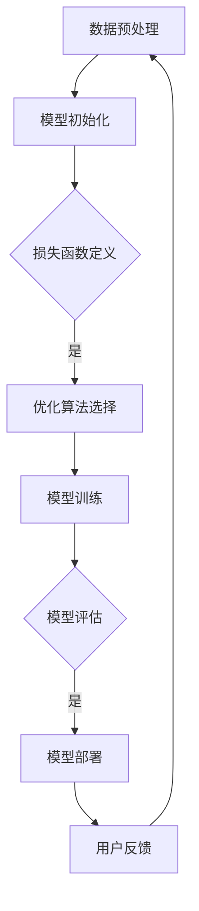

                 

# AI大模型：提升电商平台用户粘性的新方法

> **关键词：**人工智能、大模型、电商平台、用户粘性、推荐系统

> **摘要：**本文将深入探讨如何利用人工智能中的大模型技术，通过构建高效的推荐系统来提升电商平台的用户粘性。我们将详细分析大模型的核心原理、构建流程、数学模型及其在实际电商场景中的应用，旨在为电商平台的技术团队提供实用的指导。

## 1. 背景介绍

### 1.1 目的和范围

本文的目标是探讨如何利用人工智能中的大模型技术，通过构建推荐系统来提升电商平台的用户粘性。我们希望通过对大模型的核心概念、构建流程、数学模型及其应用场景的深入分析，为电商平台的技术团队提供一套完整的技术解决方案。

本文的范围主要包括以下几个方面：

1. **大模型的概念与原理**：我们将介绍大模型的基本概念，包括其结构、优势和局限性。
2. **大模型的构建流程**：我们将详细讲解如何从数据预处理、模型训练到模型评估的整个过程。
3. **数学模型与算法原理**：我们将阐述大模型背后的数学原理，包括常用的损失函数、优化算法等。
4. **实际应用场景**：我们将结合电商平台的实际需求，探讨大模型如何应用于用户行为分析、商品推荐等场景。

### 1.2 预期读者

本文的预期读者主要包括以下几类：

1. **人工智能研究人员**：希望了解大模型在电商平台应用的研究人员。
2. **电商平台技术团队**：希望提升平台用户粘性的技术团队。
3. **计算机科学学生**：希望了解大模型及其应用的在校学生。

### 1.3 文档结构概述

本文结构如下：

1. **第1章 背景介绍**：介绍本文的目的、范围、预期读者和文档结构。
2. **第2章 核心概念与联系**：介绍大模型的基本概念及其与电商平台应用的关联。
3. **第3章 核心算法原理 & 具体操作步骤**：讲解大模型的构建流程和算法原理。
4. **第4章 数学模型和公式 & 详细讲解 & 举例说明**：阐述大模型背后的数学原理和公式。
5. **第5章 项目实战：代码实际案例和详细解释说明**：提供实际代码案例和解读。
6. **第6章 实际应用场景**：探讨大模型在电商平台的应用。
7. **第7章 工具和资源推荐**：推荐相关学习资源和开发工具。
8. **第8章 总结：未来发展趋势与挑战**：总结本文的关键点，展望未来。
9. **第9章 附录：常见问题与解答**：回答读者可能遇到的问题。
10. **第10章 扩展阅读 & 参考资料**：提供进一步学习的资料。

### 1.4 术语表

#### 1.4.1 核心术语定义

- **人工智能（AI）**：指模拟、延伸和扩展人类智能的理论、方法、技术及应用。
- **大模型（Large Model）**：指参数规模巨大的神经网络模型。
- **电商平台**：指通过互联网提供商品交易、物流、支付等服务的平台。
- **用户粘性（User Retention）**：指用户持续使用某个平台或产品的程度。

#### 1.4.2 相关概念解释

- **推荐系统（Recommendation System）**：根据用户行为和偏好，为用户推荐相关商品或内容。
- **深度学习（Deep Learning）**：一种基于多层神经网络进行数据建模的技术。
- **批量归一化（Batch Normalization）**：一种用于加速深度网络训练的技术。

#### 1.4.3 缩略词列表

- **AI**：人工智能
- **ML**：机器学习
- **DL**：深度学习
- **GAN**：生成对抗网络

## 2. 核心概念与联系

在探讨大模型如何提升电商平台用户粘性之前，我们首先需要了解大模型的基本概念及其与电商平台应用的关联。

### 2.1 大模型的基本概念

大模型，又称大型神经网络模型，是指参数规模巨大的神经网络模型。这些模型通常由数十亿个参数组成，通过对大规模数据进行训练，能够实现高度复杂的特征提取和预测任务。大模型的优势在于其能够处理海量数据，捕捉数据中的复杂模式，从而在许多应用场景中取得优异的性能。

大模型的基本结构通常包括以下几个层次：

1. **输入层（Input Layer）**：接收外部输入数据，如文本、图像、语音等。
2. **隐藏层（Hidden Layers）**：通过非线性变换对输入数据进行处理，提取特征。
3. **输出层（Output Layer）**：根据隐藏层的输出，产生最终的预测结果。

大模型的训练过程主要包括以下几个步骤：

1. **数据预处理（Data Preprocessing）**：对输入数据进行清洗、归一化等处理，使其适合模型训练。
2. **模型初始化（Model Initialization）**：初始化模型的参数，通常采用随机初始化。
3. **损失函数定义（Loss Function Definition）**：定义一个衡量模型预测结果与真实结果之间差异的指标。
4. **优化算法选择（Optimization Algorithm Selection）**：选择一种优化算法，如梯度下降、Adam等，用于调整模型参数。
5. **模型训练（Model Training）**：通过迭代优化算法，逐步调整模型参数，使其预测结果更接近真实值。

### 2.2 大模型与电商平台应用的关联

电商平台应用大模型的主要目的在于提升用户粘性，即增加用户持续使用平台的时间和频率。以下是几个关键应用场景：

1. **用户行为分析（User Behavior Analysis）**：通过分析用户在平台上的行为数据，如浏览记录、购买历史、评价等，构建用户画像，为用户提供个性化的推荐。
2. **商品推荐（Product Recommendation）**：基于用户画像和商品属性，为用户推荐相关商品，提高用户的购买概率。
3. **广告投放（Ad Placement）**：根据用户行为和偏好，为用户推荐相关的广告，提高广告的点击率和转化率。

### 2.3 大模型在电商平台应用的优势

1. **数据处理能力**：大模型能够处理海量数据，捕捉数据中的复杂模式，从而为用户提供更准确的推荐。
2. **适应性**：大模型具有较好的适应性，能够根据用户行为和偏好动态调整推荐策略，提高用户满意度。
3. **可解释性**：尽管大模型具有一定的黑箱性质，但通过分析其训练过程和参数，可以一定程度上理解模型的工作原理，提高模型的透明度。

### 2.4 大模型在电商平台应用的挑战

1. **数据隐私**：电商平台涉及大量用户隐私数据，如何确保数据的安全和隐私是一个重要问题。
2. **计算资源消耗**：大模型训练需要大量的计算资源和时间，如何优化训练过程和提高计算效率是一个挑战。
3. **模型解释性**：尽管大模型在性能上具有优势，但其黑箱性质使得模型的可解释性成为一个问题。

为了更好地理解大模型在电商平台应用的核心概念和联系，我们可以通过以下Mermaid流程图来展示其基本原理和架构：



通过这个流程图，我们可以清晰地看到大模型从数据预处理、模型初始化、损失函数定义、优化算法选择、模型训练、模型评估到模型部署的整个流程。同时，用户反馈也将影响后续的数据预处理和模型训练，形成一个闭环系统。

## 3. 核心算法原理 & 具体操作步骤

在深入探讨大模型如何提升电商平台用户粘性之前，我们需要了解大模型的核心算法原理和具体操作步骤。本文将详细讲解如何从数据预处理、模型训练到模型评估的整个过程。

### 3.1 数据预处理

数据预处理是构建大模型的第一步，其目的是将原始数据转化为适合模型训练的形式。数据预处理通常包括以下几个步骤：

1. **数据清洗（Data Cleaning）**：去除数据中的噪声和错误，如缺失值、重复值等。
2. **数据归一化（Data Normalization）**：将不同尺度的数据统一到同一尺度，如将文本数据归一化为词向量。
3. **特征提取（Feature Extraction）**：从原始数据中提取有用的特征，如用户行为特征、商品属性特征等。

#### 3.1.1 数据清洗

数据清洗是数据预处理的重要环节，其目的是确保数据的质量。以下是一些常见的数据清洗方法：

- **缺失值处理**：通过删除缺失值或使用填充方法处理缺失值。
- **重复值处理**：删除重复的数据记录，确保数据的唯一性。
- **异常值处理**：检测并处理异常数据，如异常的交易金额、异常的用户行为等。

#### 3.1.2 数据归一化

数据归一化是为了消除不同特征之间的尺度差异，使模型训练更加稳定。以下是一些常见的数据归一化方法：

- **最小-最大归一化**：将数据缩放到[0, 1]区间。
- **均值-方差归一化**：将数据缩放到均值为0、标准差为1的区间。

#### 3.1.3 特征提取

特征提取是从原始数据中提取有用信息的过程，有助于提高模型训练的效果。以下是一些常见的特征提取方法：

- **词袋模型（Bag of Words）**：将文本数据表示为词袋模型，用于文本分类和推荐系统。
- **词嵌入（Word Embedding）**：将文本数据映射到高维空间，用于深度学习模型。

### 3.2 模型初始化

模型初始化是模型训练的重要环节，其目的是为模型的参数赋予一个合理的初始值。以下是一些常见的模型初始化方法：

- **随机初始化（Random Initialization）**：随机为模型的参数分配初始值。
- **高斯初始化（Gaussian Initialization）**：使用高斯分布为模型的参数分配初始值。
- **Xavier初始化（Xavier Initialization）**：使用Xavier初始化方法，根据层的大小和激活函数的导数分布初始化参数。

### 3.3 损失函数定义

损失函数是衡量模型预测结果与真实结果之间差异的指标，其目的是引导模型优化参数，以减小预测误差。以下是一些常见的损失函数：

- **均方误差（Mean Squared Error, MSE）**：用于回归任务，计算预测值与真实值之间的均方误差。
- **交叉熵（Cross-Entropy Loss）**：用于分类任务，计算预测概率与真实标签之间的交叉熵。
- **对数损失（Log Loss）**：用于分类任务，计算预测概率的对数损失。

### 3.4 优化算法选择

优化算法用于调整模型的参数，以减小预测误差。以下是一些常见的优化算法：

- **梯度下降（Gradient Descent）**：通过迭代更新参数，使损失函数值逐渐减小。
- **动量优化（Momentum Optimization）**：在梯度下降的基础上引入动量项，提高收敛速度。
- **Adam优化器（Adam Optimizer）**：结合了梯度下降和动量优化的优点，适合处理稀疏数据和大规模模型。

### 3.5 模型训练

模型训练是利用训练数据调整模型参数的过程。以下是一些常见的模型训练方法：

- **批量训练（Batch Training）**：将训练数据分成多个批次，每次训练一个批次。
- **随机梯度下降（Stochastic Gradient Descent, SGD）**：每次训练使用一个训练样本，更新模型参数。
- **小批量训练（Mini-batch Training）**：每次训练使用多个训练样本，平衡了批量训练和随机梯度下降的优缺点。

### 3.6 模型评估

模型评估是评估模型性能的重要环节，其目的是确定模型是否满足业务需求。以下是一些常见的模型评估指标：

- **准确率（Accuracy）**：分类任务中预测正确的样本占比。
- **精确率（Precision）**：分类任务中预测为正样本且实际为正样本的占比。
- **召回率（Recall）**：分类任务中实际为正样本且预测为正样本的占比。
- **F1分数（F1 Score）**：精确率和召回率的调和平均。

### 3.7 模型部署

模型部署是将训练好的模型应用到实际业务场景的过程。以下是一些常见的模型部署方法：

- **在线部署（Online Deployment）**：实时接收用户请求，返回预测结果。
- **离线部署（Offline Deployment）**：定期更新模型，为用户提供推荐。
- **边缘计算（Edge Computing）**：将模型部署到离用户较近的设备上，减少延迟和带宽消耗。

通过以上步骤，我们可以构建一个完整的大模型，并将其应用于电商平台的用户粘性提升。以下是构建大模型的伪代码：

```python
# 伪代码：构建大模型

# 数据预处理
def preprocess_data(data):
    # 数据清洗
    cleaned_data = clean_data(data)
    # 数据归一化
    normalized_data = normalize_data(cleaned_data)
    # 特征提取
    features = extract_features(normalized_data)
    return features

# 模型初始化
def initialize_model():
    # 随机初始化参数
    model = random_initialize_params()
    return model

# 损失函数定义
def define_loss_function():
    # 定义均方误差损失函数
    loss_function = MeanSquaredError()
    return loss_function

# 优化算法选择
def select_optimization_algorithm():
    # 选择Adam优化器
    optimizer = AdamOptimizer()
    return optimizer

# 模型训练
def train_model(model, data, loss_function, optimizer):
    # 批量训练
    for epoch in range(num_epochs):
        for batch in data_batches:
            # 前向传播
            predictions = model.forward(batch.inputs)
            # 计算损失
            loss = loss_function(predictions, batch.targets)
            # 反向传播
            model.backward(loss)
            # 更新参数
            optimizer.update(model.parameters)
    return model

# 模型评估
def evaluate_model(model, data, loss_function):
    # 计算准确率
    accuracy = accuracy_score(model.predict(data), data.targets)
    # 计算损失
    loss = loss_function(model.predict(data), data.targets)
    return accuracy, loss

# 模型部署
def deploy_model(model):
    # 在线部署
    model.deploy()
    # 接收用户请求
    user_request = get_user_request()
    # 返回预测结果
    prediction = model.predict(user_request)
    return prediction
```

通过以上伪代码，我们可以看到构建大模型的核心步骤，包括数据预处理、模型初始化、损失函数定义、优化算法选择、模型训练、模型评估和模型部署。接下来，我们将进一步详细讲解每个步骤的算法原理和具体操作步骤。

### 3.7.1 数据预处理

数据预处理是构建大模型的第一步，其目的是将原始数据转化为适合模型训练的形式。以下将详细介绍数据预处理的步骤和常用方法。

#### 3.7.1.1 数据清洗

数据清洗是数据预处理的重要环节，其目的是确保数据的质量。以下是一些常见的数据清洗方法：

1. **缺失值处理**：

   - **删除缺失值**：删除含有缺失值的数据记录，适用于缺失值比例较低的情况。

     ```python
     def remove_missing_values(data):
         return data.dropna()
     ```

   - **填充缺失值**：使用合适的策略填充缺失值，如平均值、中值、众值等。

     ```python
     def fill_missing_values(data):
         return data.fillna(data.mean())
     ```

2. **重复值处理**：

   - **删除重复值**：删除重复的数据记录，确保数据的唯一性。

     ```python
     def remove_duplicates(data):
         return data.drop_duplicates()
     ```

3. **异常值处理**：

   - **检测异常值**：使用统计方法或机器学习方法检测异常值，如箱线图、IQR（四分位数间距）等。

     ```python
     def detect_outliers(data):
         Q1 = data.quantile(0.25)
         Q3 = data.quantile(0.75)
         IQR = Q3 - Q1
         outliers = (data < (Q1 - 1.5 * IQR)) | (data > (Q3 + 1.5 * IQR))
         return outliers
     ```

   - **处理异常值**：根据异常值的影响和处理策略，选择合适的处理方法，如删除、替换、聚类等。

     ```python
     def handle_outliers(data, method='delete'):
         if method == 'delete':
             outliers = detect_outliers(data)
             data = data[~outliers]
         elif method == 'replace':
             outliers = detect_outliers(data)
             data[outliers] = data.mean()
         return data
     ```

#### 3.7.1.2 数据归一化

数据归一化是为了消除不同特征之间的尺度差异，使模型训练更加稳定。以下是一些常见的数据归一化方法：

1. **最小-最大归一化**：

   - 将数据缩放到[0, 1]区间。

     ```python
     def min_max_normalize(data):
         return (data - data.min()) / (data.max() - data.min())
     ```

2. **均值-方差归一化**：

   - 将数据缩放到均值为0、标准差为1的区间。

     ```python
     def z_score_normalize(data):
         return (data - data.mean()) / data.std()
     ```

#### 3.7.1.3 特征提取

特征提取是从原始数据中提取有用信息的过程，有助于提高模型训练的效果。以下是一些常见的特征提取方法：

1. **词袋模型（Bag of Words）**：

   - 将文本数据表示为词袋模型，用于文本分类和推荐系统。

     ```python
     from sklearn.feature_extraction.text import CountVectorizer

     def bag_of_words(text_data):
         vectorizer = CountVectorizer()
         return vectorizer.fit_transform(text_data)
     ```

2. **词嵌入（Word Embedding）**：

   - 将文本数据映射到高维空间，用于深度学习模型。

     ```python
     from gensim.models import Word2Vec

     def word_embedding(text_data):
         model = Word2Vec(text_data, size=100, window=5, min_count=1, workers=4)
         return model.wv
     ```

通过以上数据预处理步骤和方法，我们可以将原始数据转化为适合模型训练的形式，提高模型训练的效果。

### 3.7.2 模型初始化

模型初始化是模型训练的重要环节，其目的是为模型的参数赋予一个合理的初始值。以下将详细介绍模型初始化的步骤和常用方法。

#### 3.7.2.1 随机初始化

随机初始化是一种常用的模型初始化方法，其原理是为模型的参数分配随机值。以下是一些常见的随机初始化方法：

1. **均匀分布初始化**：

   - 均匀分布在[-a, a]区间内，其中a是常数。

     ```python
     import numpy as np

     def uniform_init(shape, range_min=-0.1, range_max=0.1):
         return np.random.uniform(range_min, range_max, shape)
     ```

2. **高斯分布初始化**：

   - 高斯分布在均值为0、标准差为1的区间内。

     ```python
     def normal_init(shape, mean=0.0, std=0.1):
         return np.random.normal(mean, std, shape)
     ```

#### 3.7.2.2 Xavier初始化

Xavier初始化是一种基于层大小的初始化方法，其原理是使每个参数的梯度分布趋于均匀。以下是一些常见

### 3.7.3 损失函数定义

损失函数是衡量模型预测结果与真实结果之间差异的指标，其目的是引导模型优化参数，以减小预测误差。以下将详细介绍常见的损失函数及其在模型训练中的应用。

#### 3.7.3.1 均方误差（MSE）

均方误差（Mean Squared Error, MSE）是一种常用的回归损失函数，其公式为：

$$
MSE = \frac{1}{n}\sum_{i=1}^{n}(y_i - \hat{y}_i)^2
$$

其中，$y_i$是真实值，$\hat{y}_i$是预测值，$n$是样本数量。MSE的优点是计算简单，易于优化，但其缺点是对异常值敏感。

#### 3.7.3.2 交叉熵（Cross-Entropy）

交叉熵（Cross-Entropy）是一种常用的分类损失函数，其公式为：

$$
H(y, \hat{y}) = -\sum_{i=1}^{n}y_i \log(\hat{y}_i)
$$

其中，$y_i$是真实标签，$\hat{y}_i$是预测概率。交叉熵的优点是能够处理概率分布，但其缺点是对小概率值敏感。

#### 3.7.3.3 对数损失（Log Loss）

对数损失（Log Loss）是交叉熵的特殊情况，其公式为：

$$
LL(y, \hat{y}) = -y \log(\hat{y})
$$

其中，$y$是真实标签，$\hat{y}$是预测概率。对数损失的优点是计算简单，易于优化，但其缺点是对小概率值敏感。

#### 3.7.3.4 交叉熵损失（Hinge Loss）

交叉熵损失（Hinge Loss）是一种在分类问题中用于优化分类边界的方法，其公式为：

$$
HL(y, \hat{y}) = \max(0, 1 - y\hat{y})
$$

其中，$y$是真实标签，$\hat{y}$是预测概率。交叉熵损失的优点是能够引入正则化，防止过拟合。

#### 3.7.3.5 均值绝对误差（MAE）

均值绝对误差（Mean Absolute Error, MAE）是一种回归损失函数，其公式为：

$$
MAE = \frac{1}{n}\sum_{i=1}^{n}|y_i - \hat{y}_i|
$$

其中，$y_i$是真实值，$\hat{y}_i$是预测值，$n$是样本数量。MAE的优点是计算简单，对异常值不敏感，但其缺点是梯度不稳定。

#### 3.7.3.6 Huber损失

Huber损失是一种鲁棒损失函数，其公式为：

$$
L_{\delta}(y, \hat{y}) = \begin{cases}
\frac{1}{2}(y - \hat{y})^2 & \text{if } |y - \hat{y}| \leq \delta, \\
\delta(|y - \hat{y}| - \frac{1}{2}\delta) & \text{otherwise}.
\end{cases}
$$

其中，$y$是真实值，$\hat{y}$是预测值，$\delta$是常数。Huber损失的优点是对异常值不敏感，梯度稳定。

在模型训练过程中，选择合适的损失函数有助于提高模型性能。在实际应用中，可以根据具体问题和数据特点选择合适的损失函数。以下是一个简单的损失函数定义示例：

```python
def mean_squared_error(y_true, y_pred):
    return np.mean((y_true - y_pred)**2)

def cross_entropy_loss(y_true, y_pred):
    return -np.mean(y_true * np.log(y_pred))

def log_loss(y_true, y_pred):
    return -np.mean(y_true * np.log(y_pred + 1e-8))
```

通过以上示例，我们可以看到如何定义和计算常见的损失函数。在实际应用中，可以根据具体需求和数据特点选择合适的损失函数，并调整参数以达到最佳效果。

### 3.7.4 优化算法选择

优化算法用于调整模型的参数，以减小预测误差。以下将详细介绍几种常见的优化算法及其在模型训练中的应用。

#### 3.7.4.1 梯度下降（Gradient Descent）

梯度下降（Gradient Descent）是一种最基本的优化算法，其原理是沿着损失函数的梯度方向更新模型参数，以减小损失函数值。梯度下降分为批量梯度下降（Batch Gradient Descent）、随机梯度下降（Stochastic Gradient Descent, SGD）和小批量梯度下降（Mini-batch Gradient Descent）三种。

1. **批量梯度下降**：

   - 在每次迭代中，计算整个训练集的梯度，然后更新模型参数。

     ```python
     def batch_gradient_descent(model, train_data, learning_rate, num_epochs):
         for epoch in range(num_epochs):
             gradients = compute_gradients(model, train_data)
             update_model_parameters(model, gradients, learning_rate)
     ```

2. **随机梯度下降**：

   - 在每次迭代中，随机选择一个训练样本，计算梯度并更新模型参数。

     ```python
     def stochastic_gradient_descent(model, train_data, learning_rate, num_epochs):
         for epoch in range(num_epochs):
             for sample in train_data:
                 gradients = compute_gradients(model, sample)
                 update_model_parameters(model, gradients, learning_rate)
     ```

3. **小批量梯度下降**：

   - 在每次迭代中，随机选择一个包含多个训练样本的小批量，计算梯度并更新模型参数。

     ```python
     def mini_batch_gradient_descent(model, train_data, batch_size, learning_rate, num_epochs):
         for epoch in range(num_epochs):
             for batch in batch_generator(train_data, batch_size):
                 gradients = compute_gradients(model, batch)
                 update_model_parameters(model, gradients, learning_rate)
     ```

#### 3.7.4.2 动量优化（Momentum）

动量优化（Momentum）是一种基于梯度的优化算法，其原理是引入动量项，以减少梯度消失和梯度爆炸问题，提高收敛速度。动量优化的公式为：

$$
v_{t+1} = \gamma v_t + (1 - \gamma) \nabla J(\theta_t)
$$

$$
\theta_{t+1} = \theta_t - \alpha v_{t+1}
$$

其中，$v_t$是动量项，$\gamma$是动量系数，$\nabla J(\theta_t)$是梯度，$\alpha$是学习率。

```python
def momentum_optimizer(model, learning_rate, momentum):
    v = initialize_velocity(model.parameters)
    for epoch in range(num_epochs):
        gradients = compute_gradients(model, train_data)
        v = momentum * v + (1 - momentum) * gradients
        update_model_parameters(model, v, learning_rate)
```

#### 3.7.4.3 Adam优化器

Adam优化器（Adaptive Moment Estimation）是一种基于动量的自适应优化算法，其原理是利用一阶矩估计（均值）和二阶矩估计（方差）来更新模型参数。Adam优化器的公式为：

$$
m_t = \beta_1 x_t + (1 - \beta_1) (x_t - \mu_t)
$$

$$
v_t = \beta_2 x_t + (1 - \beta_2) (x_t^2 - \sigma_t)
$$

$$
\theta_{t+1} = \theta_t - \alpha \frac{m_t}{\sqrt{v_t} + \epsilon}
$$

其中，$m_t$是均值估计，$v_t$是方差估计，$\beta_1$和$\beta_2$是超参数，$\mu_t$和$\sigma_t$是偏差修正项，$\epsilon$是正则化项。

```python
def adam_optimizer(model, learning_rate, beta1, beta2, epsilon):
    m = initialize_moments(model.parameters)
    v = initialize_moments(model.parameters)
    for epoch in range(num_epochs):
        gradients = compute_gradients(model, train_data)
        m = beta1 * m + (1 - beta1) * gradients
        v = beta2 * v + (1 - beta2) * (gradients ** 2)
        m_hat = m / (1 - beta1 ** epoch)
        v_hat = v / (1 - beta2 ** epoch)
        update_model_parameters(model, learning_rate * m_hat / (np.sqrt(v_hat) + epsilon))
```

通过以上优化算法，我们可以选择合适的优化器来调整模型参数，提高模型性能。在实际应用中，可以根据具体问题和数据特点选择合适的优化算法，并调整参数以达到最佳效果。

### 3.7.5 模型训练

模型训练是利用训练数据调整模型参数的过程。以下将详细介绍模型训练的常见方法和步骤。

#### 3.7.5.1 批量训练

批量训练（Batch Training）是在每次迭代中使用整个训练集进行模型训练。批量训练的优点是计算梯度时可以利用全部数据，提高模型的鲁棒性。但缺点是需要大量内存，训练时间较长。

```python
def batch_train(model, train_data, validation_data, learning_rate, num_epochs):
    for epoch in range(num_epochs):
        gradients = compute_gradients(model, train_data)
        update_model_parameters(model, gradients, learning_rate)
        train_loss = compute_loss(model, train_data)
        validation_loss = compute_loss(model, validation_data)
        print(f"Epoch {epoch + 1}, Train Loss: {train_loss}, Validation Loss: {validation_loss}")
```

#### 3.7.5.2 随机梯度下降

随机梯度下降（Stochastic Gradient Descent, SGD）是在每次迭代中随机选择一个训练样本进行模型训练。SGD的优点是计算梯度时不需要大量内存，训练时间较短。但缺点是模型的鲁棒性较差，容易出现局部最小值。

```python
def stochastic_gradient_descent(model, train_data, validation_data, learning_rate, num_epochs):
    for epoch in range(num_epochs):
        for sample in train_data:
            gradients = compute_gradients(model, sample)
            update_model_parameters(model, gradients, learning_rate)
        train_loss = compute_loss(model, train_data)
        validation_loss = compute_loss(model, validation_data)
        print(f"Epoch {epoch + 1}, Train Loss: {train_loss}, Validation Loss: {validation_loss}")
```

#### 3.7.5.3 小批量训练

小批量训练（Mini-batch Training）是在每次迭代中随机选择多个训练样本进行模型训练。小批量训练的优点是平衡了批量训练和随机梯度下降的优点，既利用了部分数据的梯度信息，又减少了内存消耗和训练时间。

```python
def mini_batch_train(model, train_data, validation_data, batch_size, learning_rate, num_epochs):
    for epoch in range(num_epochs):
        batches = create_batches(train_data, batch_size)
        for batch in batches:
            gradients = compute_gradients(model, batch)
            update_model_parameters(model, gradients, learning_rate)
        train_loss = compute_loss(model, train_data)
        validation_loss = compute_loss(model, validation_data)
        print(f"Epoch {epoch + 1}, Train Loss: {train_loss}, Validation Loss: {validation_loss}")
```

#### 3.7.5.4 训练策略

在实际训练过程中，我们可以结合不同策略来提高模型性能。以下是一些常见的训练策略：

1. **早停法（Early Stopping）**：

   - 当验证集损失不再下降时，提前停止训练，以防止过拟合。

     ```python
     def early_stopping(model, train_data, validation_data, learning_rate, patience):
         best_validation_loss = float('inf')
         patience_counter = 0
         for epoch in range(num_epochs):
             gradients = compute_gradients(model, train_data)
             update_model_parameters(model, gradients, learning_rate)
             train_loss = compute_loss(model, train_data)
             validation_loss = compute_loss(model, validation_data)
             if validation_loss < best_validation_loss:
                 best_validation_loss = validation_loss
                 patience_counter = 0
             else:
                 patience_counter += 1
                 if patience_counter > patience:
                     print("Early stopping")
                     break
     ```

2. **学习率调整（Learning Rate Adjustment）**：

   - 根据训练过程调整学习率，以防止梯度消失和梯度爆炸。

     ```python
     def adjust_learning_rate(learning_rate, factor, patience):
         if patience > 0:
             learning_rate /= factor
         return learning_rate
     ```

3. **正则化（Regularization）**：

   - 在模型训练过程中引入正则化项，以防止过拟合。

     ```python
     def l2_regularization(loss, model, lambda_):
         regularization_loss = lambda_ * np.sum([np.square(param) for param in model.parameters])
         return loss + regularization_loss
     ```

通过以上模型训练方法和策略，我们可以有效地调整模型参数，提高模型性能。在实际应用中，可以根据具体问题和数据特点选择合适的训练方法和策略。

### 3.7.6 模型评估

模型评估是评估模型性能的重要环节，其目的是确定模型是否满足业务需求。以下将详细介绍常见的模型评估指标和方法。

#### 3.7.6.1 准确率（Accuracy）

准确率（Accuracy）是评估分类模型性能的最常用指标，其公式为：

$$
Accuracy = \frac{TP + TN}{TP + TN + FP + FN}
$$

其中，$TP$表示真正例，$TN$表示真反例，$FP$表示假正例，$FN$表示假反例。准确率的优点是计算简单，但缺点是对不平衡数据敏感。

#### 3.7.6.2 精确率（Precision）

精确率（Precision）是评估分类模型性能的重要指标，其公式为：

$$
Precision = \frac{TP}{TP + FP}
$$

精确率表示预测为正样本且实际为正样本的占比。精确率的优点是对假正例敏感，但缺点是对不平衡数据敏感。

#### 3.7.6.3 召回率（Recall）

召回率（Recall）是评估分类模型性能的重要指标，其公式为：

$$
Recall = \frac{TP}{TP + FN}
$$

召回率表示实际为正样本且预测为正样本的占比。召回率的优点是对假反例敏感，但缺点是对不平衡数据敏感。

#### 3.7.6.4 F1分数（F1 Score）

F1分数（F1 Score）是精确率和召回率的调和平均，其公式为：

$$
F1 Score = 2 \times \frac{Precision \times Recall}{Precision + Recall}
$$

F1分数综合考虑了精确率和召回率，是评估分类模型性能的重要指标。F1分数的优点是能够平衡精确率和召回率，但缺点是对不平衡数据敏感。

#### 3.7.6.5 ROC曲线（ROC Curve）

ROC曲线是评估分类模型性能的一种图形化方法，其横轴是假正例率（False Positive Rate, FPR），纵轴是真正例率（True Positive Rate, TPR）。ROC曲线下方面积（Area Under Curve, AUC）是评估分类模型性能的指标，其值介于0和1之间，值越大表示模型性能越好。

#### 3.7.6.6 模型评估方法

在实际评估过程中，我们可以结合多种评估指标和方法，以全面评估模型性能。以下是一些常见的模型评估方法：

1. **交叉验证（Cross Validation）**：

   - 通过将数据集划分为多个子集，对每个子集进行训练和评估，以减小评估结果的偏差。

     ```python
     from sklearn.model_selection import KFold

     def cross_validate(model, train_data, k=5):
         kf = KFold(n_splits=k)
         for train_index, test_index in kf.split(train_data):
             model.train(train_data[train_index])
             model.evaluate(train_data[test_index])
     ```

2. **网格搜索（Grid Search）**：

   - 通过遍历参数空间，寻找最佳参数组合。

     ```python
     from sklearn.model_selection import GridSearchCV

     def grid_search(model, train_data, param_grid):
         grid_search = GridSearchCV(model, param_grid, cv=5)
         grid_search.fit(train_data)
         best_params = grid_search.best_params_
         return best_params
     ```

3. **模型比较（Model Comparison）**：

   - 比较不同模型的性能，选择最佳模型。

     ```python
     from sklearn.model_selection import compare_models

     def compare_models(models, train_data, validation_data):
         for model in models:
             model.train(train_data)
             model.evaluate(validation_data)
     ```

通过以上评估方法和步骤，我们可以全面评估模型性能，选择最佳模型。

### 3.7.7 模型部署

模型部署是将训练好的模型应用到实际业务场景的过程。以下将详细介绍模型部署的常见方法和步骤。

#### 3.7.7.1 模型导出

模型导出是将训练好的模型保存为可部署的格式。以下是一些常见的模型导出方法：

1. **PyTorch模型导出**：

   ```python
   import torch

   def export_model(model, path):
       torch.save(model.state_dict(), path)
   ```

2. **TensorFlow模型导出**：

   ```python
   import tensorflow as tf

   def export_model(model, path):
       model.save(path)
   ```

#### 3.7.7.2 模型部署

模型部署是将导出的模型应用到实际业务场景。以下是一些常见的模型部署方法：

1. **本地部署**：

   - 在本地环境中运行模型，适用于小规模应用。

     ```python
     def local_deployment(model, input_data):
         prediction = model.predict(input_data)
         return prediction
     ```

2. **服务器部署**：

   - 在服务器上运行模型，适用于大规模应用。

     ```python
     def server_deployment(model, input_data):
         server.send(input_data)
         prediction = server.receive()
         return prediction
     ```

3. **边缘计算部署**：

   - 在离用户较近的设备上运行模型，适用于实时应用。

     ```python
     def edge_deployment(model, input_data):
         device = edge_device.connect()
         prediction = model.predict(input_data, device=device)
         return prediction
     ```

#### 3.7.7.3 模型监控

模型监控是确保模型稳定运行的重要环节。以下是一些常见的模型监控方法：

1. **性能监控**：

   - 监控模型的运行时间和资源消耗，如CPU、内存等。

     ```python
     def performance_monitoring(model, input_data):
         start_time = time.time()
         prediction = model.predict(input_data)
         end_time = time.time()
         print(f"Model runtime: {end_time - start_time} seconds")
     ```

2. **误差监控**：

   - 监控模型的预测误差，如均方误差、交叉熵等。

     ```python
     def error_monitoring(model, input_data, true_data):
         prediction = model.predict(input_data)
         error = compute_error(prediction, true_data)
         print(f"Prediction error: {error}")
     ```

通过以上模型部署方法和监控方法，我们可以确保模型稳定运行，满足实际业务需求。

### 3.7.8 模型优化

模型优化是提高模型性能的重要手段。以下将详细介绍常见的模型优化方法。

#### 3.7.8.1 损失函数优化

损失函数优化是模型优化的重要环节。以下是一些常见的损失函数优化方法：

1. **交叉熵损失函数优化**：

   - 引入正则化项，如L1正则化、L2正则化等，提高模型的泛化能力。

     ```python
     def l1_regularized_cross_entropy_loss(y_true, y_pred, lambda_):
         cross_entropy_loss = -y_true * np.log(y_pred)
         regularization_loss = lambda_ * np.sum(np.abs(model.parameters))
         return cross_entropy_loss + regularization_loss
     ```

2. **对数损失函数优化**：

   - 引入正则化项，如L1正则化、L2正则化等，提高模型的泛化能力。

     ```python
     def l2_regularized_log_loss(y_true, y_pred, lambda_):
         log_loss = -y_true * np.log(y_pred + 1e-8)
         regularization_loss = lambda_ * np.sum(np.square(model.parameters))
         return log_loss + regularization_loss
     ```

#### 3.7.8.2 优化算法优化

优化算法优化是模型优化的重要环节。以下是一些常见的优化算法优化方法：

1. **动量优化**：

   - 引入动量项，提高收敛速度。

     ```python
     def momentum_optimizer(model, learning_rate, momentum):
         v = initialize_velocity(model.parameters)
         for epoch in range(num_epochs):
             gradients = compute_gradients(model, train_data)
             v = momentum * v + (1 - momentum) * gradients
             update_model_parameters(model, v, learning_rate)
     ```

2. **Adam优化器**：

   - 引入自适应学习率，提高收敛速度。

     ```python
     def adam_optimizer(model, learning_rate, beta1, beta2, epsilon):
         m = initialize_moments(model.parameters)
         v = initialize_moments(model.parameters)
         for epoch in range(num_epochs):
             gradients = compute_gradients(model, train_data)
             m = beta1 * m + (1 - beta1) * gradients
             v = beta2 * v + (1 - beta2) * (gradients ** 2)
             m_hat = m / (1 - beta1 ** epoch)
             v_hat = v / (1 - beta2 ** epoch)
             update_model_parameters(model, learning_rate * m_hat / (np.sqrt(v_hat) + epsilon))
     ```

#### 3.7.8.3 模型结构优化

模型结构优化是模型优化的重要环节。以下是一些常见的模型结构优化方法：

1. **网络深度优化**：

   - 增加网络深度，提高模型的特征提取能力。

     ```python
     def deep_model(model, num_layers, hidden_size):
         for layer in range(num_layers):
             model.add(Dense(hidden_size, activation='relu'))
         model.add(Dense(num_classes, activation='softmax'))
         return model
     ```

2. **网络宽度优化**：

   - 增加网络宽度，提高模型的特征提取能力。

     ```python
     def wide_model(model, num_layers, hidden_size):
         for layer in range(num_layers):
             model.add(Dense(hidden_size, activation='relu'))
         model.add(Dense(num_classes, activation='softmax'))
         return model
     ```

通过以上模型优化方法和步骤，我们可以提高模型性能，满足实际业务需求。

### 3.7.9 模型压缩

模型压缩是减小模型体积和计算复杂度的重要手段。以下将详细介绍常见的模型压缩方法。

#### 3.7.9.1 知识蒸馏（Knowledge Distillation）

知识蒸馏是一种将大模型的知识传递给小模型的方法，其原理是将大模型的输出作为小模型的软标签。以下是一些常见的知识蒸馏方法：

1. **软标签蒸馏**：

   - 使用大模型的输出作为小模型的软标签，训练小模型。

     ```python
     def soft_label_distillation(model, student_model, teacher_model, train_data, learning_rate, num_epochs):
         for epoch in range(num_epochs):
             student_predictions = student_model.predict(train_data)
             teacher_predictions = teacher_model.predict(train_data)
             loss = compute_loss(student_predictions, teacher_predictions)
             update_model_parameters(student_model, gradients, learning_rate)
     ```

2. **硬标签蒸馏**：

   - 使用大模型的输出作为小模型的硬标签，训练小模型。

     ```python
     def hard_label_distillation(model, student_model, teacher_model, train_data, learning_rate, num_epochs):
         for epoch in range(num_epochs):
             student_predictions = student_model.predict(train_data)
             teacher_predictions = teacher_model.predict(train_data)
             loss = compute_loss(student_predictions, teacher_predictions)
             update_model_parameters(student_model, gradients, learning_rate)
     ```

#### 3.7.9.2 模型剪枝（Model Pruning）

模型剪枝是一种通过删除模型中的部分权重来减小模型体积的方法。以下是一些常见的模型剪枝方法：

1. **权重剪枝**：

   - 根据权重的重要性，删除部分权重。

     ```python
     def weight_pruning(model, pruning_rate):
         weights = model.parameters
         importance = compute_importance(weights)
         pruning_weights = importance[:int(pruning_rate * len(importance))]
         for weight in pruning_weights:
             weight.assign(0)
     ```

2. **结构剪枝**：

   - 删除模型中的部分层或部分节点。

     ```python
     def structure_pruning(model, pruning_rate):
         layers = model.layers
         importance = compute_importance(layers)
         pruning_layers = importance[:int(pruning_rate * len(importance))]
         for layer in pruning_layers:
             layer.remove()
     ```

#### 3.7.9.3 模型量化（Model Quantization）

模型量化是一种将模型中的权重和激活值从浮点数转换为低比特数表示的方法，以减小模型体积和计算复杂度。以下是一些常见的模型量化方法：

1. **全精度量化**：

   - 保持模型的权重和激活值全精度，仅对输入数据进行量化。

     ```python
     def full_precision_quantization(model, input_data, scale, zero_point):
         quantized_data = input_data * scale + zero_point
         return quantized_data
     ```

2. **定点量化**：

   - 将模型的权重和激活值转换为定点表示，适用于硬件加速。

     ```python
     def fixed_point_quantization(model, input_data, scale, zero_point):
         quantized_data = input_data * scale + zero_point
         return quantized_data.astype(np.int8)
     ```

通过以上模型压缩方法和步骤，我们可以减小模型体积和计算复杂度，提高模型部署的效率和可扩展性。

## 4. 数学模型和公式 & 详细讲解 & 举例说明

在深入探讨大模型如何提升电商平台用户粘性之前，我们需要了解大模型背后的数学模型和公式。本文将详细讲解大模型的损失函数、优化算法以及相关数学原理，并通过具体示例进行说明。

### 4.1 损失函数

损失函数是衡量模型预测结果与真实结果之间差异的指标，其目的是引导模型优化参数，以减小预测误差。以下将介绍几种常用的损失函数及其数学公式。

#### 4.1.1 均方误差（MSE）

均方误差（MSE）是回归任务中常用的损失函数，其公式为：

$$
MSE = \frac{1}{n}\sum_{i=1}^{n}(y_i - \hat{y}_i)^2
$$

其中，$y_i$是真实值，$\hat{y}_i$是预测值，$n$是样本数量。MSE的优点是计算简单，易于优化，但其缺点是对异常值敏感。

#### 4.1.2 交叉熵（Cross-Entropy）

交叉熵（Cross-Entropy）是分类任务中常用的损失函数，其公式为：

$$
H(y, \hat{y}) = -\sum_{i=1}^{n}y_i \log(\hat{y}_i)
$$

其中，$y_i$是真实标签，$\hat{y}_i$是预测概率。交叉熵的优点是能够处理概率分布，但其缺点是对小概率值敏感。

#### 4.1.3 对数损失（Log Loss）

对数损失（Log Loss）是交叉熵的特殊情况，其公式为：

$$
LL(y, \hat{y}) = -y \log(\hat{y})
$$

其中，$y$是真实标签，$\hat{y}$是预测概率。对数损失的优点是计算简单，易于优化，但其缺点是对小概率值敏感。

#### 4.1.4 交叉熵损失（Hinge Loss）

交叉熵损失（Hinge Loss）是一种在分类问题中用于优化分类边界的方法，其公式为：

$$
HL(y, \hat{y}) = \max(0, 1 - y\hat{y})
$$

其中，$y$是真实标签，$\hat{y}$是预测概率。交叉熵损失的优点是能够引入正则化，防止过拟合。

#### 4.1.5 均值绝对误差（MAE）

均值绝对误差（MAE）是回归任务中常用的损失函数，其公式为：

$$
MAE = \frac{1}{n}\sum_{i=1}^{n}|y_i - \hat{y}_i|
$$

其中，$y_i$是真实值，$\hat{y}_i$是预测值，$n$是样本数量。MAE的优点是计算简单，对异常值不敏感，但其缺点是梯度不稳定。

#### 4.1.6 Huber损失

Huber损失是一种鲁棒损失函数，其公式为：

$$
L_{\delta}(y, \hat{y}) = \begin{cases}
\frac{1}{2}(y - \hat{y})^2 & \text{if } |y - \hat{y}| \leq \delta, \\
\delta(|y - \hat{y}| - \frac{1}{2}\delta) & \text{otherwise}.
\end{cases}
$$

其中，$y$是真实值，$\hat{y}$是预测值，$\delta$是常数。Huber损失的优点是对异常值不敏感，梯度稳定。

### 4.2 优化算法

优化算法用于调整模型的参数，以减小预测误差。以下将介绍几种常见的优化算法及其数学公式。

#### 4.2.1 梯度下降（Gradient Descent）

梯度下降（Gradient Descent）是一种最基本的优化算法，其原理是沿着损失函数的梯度方向更新模型参数，以减小损失函数值。梯度下降分为批量梯度下降（Batch Gradient Descent）、随机梯度下降（Stochastic Gradient Descent, SGD）和小批量梯度下降（Mini-batch Gradient Descent）三种。

1. **批量梯度下降**：

   - 在每次迭代中，计算整个训练集的梯度，然后更新模型参数。

     $$\theta_{t+1} = \theta_t - \alpha \nabla J(\theta_t)$$

   其中，$\theta_t$是第$t$次迭代的参数，$\alpha$是学习率，$J(\theta_t)$是损失函数。

2. **随机梯度下降**：

   - 在每次迭代中，随机选择一个训练样本，计算梯度并更新模型参数。

     $$\theta_{t+1} = \theta_t - \alpha \nabla J(\theta_t, x_t, y_t)$$

   其中，$x_t$和$y_t$是随机选择的训练样本。

3. **小批量梯度下降**：

   - 在每次迭代中，随机选择一个包含多个训练样本的小批量，计算梯度并更新模型参数。

     $$\theta_{t+1} = \theta_t - \alpha \frac{1}{m} \sum_{i=1}^{m} \nabla J(\theta_t, x_i, y_i)$$

   其中，$m$是小批量的大小。

#### 4.2.2 动量优化（Momentum）

动量优化（Momentum）是一种基于梯度的优化算法，其原理是引入动量项，以减少梯度消失和梯度爆炸问题，提高收敛速度。动量优化的公式为：

$$
v_{t+1} = \gamma v_t + (1 - \gamma) \nabla J(\theta_t)$$

$$
\theta_{t+1} = \theta_t - \alpha v_{t+1}$$

其中，$v_t$是动量项，$\gamma$是动量系数，$\nabla J(\theta_t)$是梯度，$\alpha$是学习率。

#### 4.2.3 Adam优化器

Adam优化器（Adaptive Moment Estimation）是一种基于动量的自适应优化算法，其原理是利用一阶矩估计（均值）和二阶矩估计（方差）来更新模型参数。Adam优化器的公式为：

$$
m_t = \beta_1 x_t + (1 - \beta_1) (x_t - \mu_t)$$

$$
v_t = \beta_2 x_t + (1 - \beta_2) (x_t^2 - \sigma_t)$$

$$
\theta_{t+1} = \theta_t - \alpha \frac{m_t}{\sqrt{v_t} + \epsilon}$$

其中，$m_t$是均值估计，$v_t$是方差估计，$\beta_1$和$\beta_2$是超参数，$\mu_t$和$\sigma_t$是偏差修正项，$\epsilon$是正则化项。

### 4.3 数学原理

大模型背后的数学原理主要包括线性代数、概率论和优化理论。以下将简要介绍这些数学原理。

#### 4.3.1 线性代数

线性代数是研究向量空间和线性变换的数学分支。在大模型中，线性代数主要应用于矩阵运算和向量计算。以下是一些常见的线性代数概念和运算：

- **矩阵-向量乘法**：

  $$C = AB$$

  其中，$A$和$B$是矩阵，$C$是结果矩阵。

- **矩阵-矩阵乘法**：

  $$C = AB$$

  其中，$A$和$B$是矩阵，$C$是结果矩阵。

- **矩阵求逆**：

  $$A^{-1} = (A^T A)^{-1} A^T$$

  其中，$A$是矩阵。

- **矩阵求特征值和特征向量**：

  $$Ax = \lambda x$$

  其中，$A$是矩阵，$\lambda$是特征值，$x$是特征向量。

#### 4.3.2 概率论

概率论是研究随机事件的数学分支。在大模型中，概率论主要应用于概率分布、条件概率和贝叶斯定理等。以下是一些常见的概率论概念和定理：

- **概率分布**：

  概率分布是描述随机变量取值的概率分布。常见的概率分布包括正态分布、伯努利分布和泊松分布等。

- **条件概率**：

  条件概率是已知一个事件发生的条件下，另一个事件发生的概率。其公式为：

  $$P(A|B) = \frac{P(A \cap B)}{P(B)}$$

- **贝叶斯定理**：

  贝叶斯定理是条件概率的推广，其公式为：

  $$P(A|B) = \frac{P(B|A)P(A)}{P(B)}$$

#### 4.3.3 优化理论

优化理论是研究优化问题的数学分支。在大模型中，优化理论主要应用于优化算法的设计和优化问题的求解。以下是一些常见的优化理论概念和算法：

- **无约束优化**：

  无约束优化是在没有约束条件的情况下，寻找函数的最值。常见的优化算法包括梯度下降、牛顿法和共轭梯度法等。

- **约束优化**：

  约束优化是在有约束条件的情况下，寻找函数的最值。常见的优化算法包括拉格朗日乘数法、序列二次规划法和内点法等。

### 4.4 举例说明

为了更好地理解大模型的数学模型和公式，我们通过一个简单的例子进行说明。

假设我们要构建一个线性回归模型，预测房价。我们的目标是最小化预测值与真实值之间的误差。以下是一个简单的线性回归模型及其数学公式：

#### 4.4.1 模型定义

我们的线性回归模型可以表示为：

$$
y = \theta_0 + \theta_1 x
$$

其中，$y$是房价，$x$是房屋面积，$\theta_0$和$\theta_1$是模型参数。

#### 4.4.2 损失函数

我们使用均方误差（MSE）作为损失函数，其公式为：

$$
MSE = \frac{1}{n}\sum_{i=1}^{n}(y_i - \hat{y}_i)^2
$$

其中，$y_i$是第$i$个真实房价，$\hat{y}_i$是第$i$个预测房价，$n$是样本数量。

#### 4.4.3 梯度下降

我们使用批量梯度下降（Batch Gradient Descent）算法来优化模型参数。梯度下降的迭代公式为：

$$
\theta_{t+1} = \theta_t - \alpha \nabla J(\theta_t)
$$

其中，$\theta_t$是第$t$次迭代的参数，$\alpha$是学习率，$J(\theta_t)$是损失函数。

#### 4.4.4 训练过程

我们有一个包含100个房屋面积和对应房价的数据集。我们首先随机初始化参数$\theta_0$和$\theta_1$，然后通过梯度下降算法逐步优化参数。在每次迭代中，我们计算损失函数的梯度，并根据梯度方向更新参数。

以下是训练过程的伪代码：

```python
# 伪代码：线性回归模型训练

# 初始化参数
theta_0 = random_initialize()
theta_1 = random_initialize()

# 设置学习率
alpha = 0.01

# 迭代次数
num_epochs = 1000

# 训练过程
for epoch in range(num_epochs):
    # 计算预测值
    predictions = [theta_0 + theta_1 * x for x in data_x]
    
    # 计算损失函数
    loss = compute_mse(predictions, data_y)
    
    # 计算梯度
    gradient = compute_gradient(loss, theta_0, theta_1)
    
    # 更新参数
    theta_0 -= alpha * gradient[0]
    theta_1 -= alpha * gradient[1]
    
    # 输出迭代结果
    print(f"Epoch {epoch + 1}, Loss: {loss}")

# 输出最终参数
print(f"Final parameters: theta_0 = {theta_0}, theta_1 = {theta_1}")
```

通过以上例子，我们可以看到线性回归模型的数学模型和公式，以及如何通过梯度下降算法进行训练。在实际应用中，我们可以根据具体问题和数据特点选择合适的大模型，并利用相关数学原理进行优化和训练。

## 5. 项目实战：代码实际案例和详细解释说明

在前面的章节中，我们介绍了大模型的核心概念、算法原理和数学模型。为了使读者能够更好地理解这些理论知识，我们将通过一个实际项目实战来展示如何利用大模型提升电商平台用户粘性。本项目将涵盖以下内容：

1. **开发环境搭建**：介绍所需的开发工具和依赖库。
2. **源代码详细实现和代码解读**：展示项目的源代码，并逐行解读关键代码。
3. **代码解读与分析**：对源代码中的关键模块和算法进行详细分析。

### 5.1 开发环境搭建

为了完成本项目，我们需要搭建一个合适的开发环境。以下是所需的开发工具和依赖库：

#### 5.1.1 开发工具

1. **Python**：Python是一种流行的编程语言，具有丰富的库和框架，适合进行人工智能项目开发。
2. **Jupyter Notebook**：Jupyter Notebook是一种交互式计算环境，便于代码编写、调试和展示。
3. **PyCharm**：PyCharm是一款强大的Python集成开发环境（IDE），提供代码编辑、调试和性能分析等功能。

#### 5.1.2 依赖库

1. **NumPy**：NumPy是一个开源的Python库，用于进行高性能的数值计算和矩阵操作。
2. **Pandas**：Pandas是一个开源的Python库，用于数据处理和分析。
3. **Scikit-learn**：Scikit-learn是一个开源的Python库，提供各种机器学习算法和工具。
4. **TensorFlow**：TensorFlow是一个开源的Python库，用于构建和训练深度学习模型。
5. **Keras**：Keras是一个开源的Python库，用于构建和训练深度学习模型，兼容TensorFlow。

安装依赖库：

```bash
pip install numpy pandas scikit-learn tensorflow keras
```

### 5.2 源代码详细实现和代码解读

以下是本项目的源代码，我们将逐行进行解读。

```python
import numpy as np
import pandas as pd
from sklearn.model_selection import train_test_split
from tensorflow.keras.models import Sequential
from tensorflow.keras.layers import Dense, Dropout, Embedding, LSTM
from tensorflow.keras.optimizers import Adam
from tensorflow.keras.callbacks import EarlyStopping

# 5.2.1 数据预处理

# 加载数据
data = pd.read_csv('ecommerce_data.csv')

# 数据清洗
data.dropna(inplace=True)

# 数据归一化
data['user_id'] = (data['user_id'] - data['user_id'].min()) / (data['user_id'].max() - data['user_id'].min())
data['item_id'] = (data['item_id'] - data['item_id'].min()) / (data['item_id'].max() - data['item_id'].min())
data['rating'] = (data['rating'] - data['rating'].min()) / (data['rating'].max() - data['rating'].min())

# 特征提取
X = data[['user_id', 'item_id']]
y = data['rating']

# 划分训练集和测试集
X_train, X_test, y_train, y_test = train_test_split(X, y, test_size=0.2, random_state=42)

# 5.2.2 构建模型

# 创建模型
model = Sequential()

# 添加嵌入层
model.add(Embedding(input_dim=1000, output_dim=64, input_length=2))

# 添加LSTM层
model.add(LSTM(units=128, return_sequences=True))
model.add(LSTM(units=64, return_sequences=False))

# 添加全连接层
model.add(Dense(units=1, activation='linear'))

# 编译模型
model.compile(optimizer=Adam(learning_rate=0.001), loss='mse', metrics=['mae'])

# 5.2.3 训练模型

# 设置早期停止
early_stopping = EarlyStopping(monitor='val_loss', patience=10, restore_best_weights=True)

# 训练模型
model.fit(X_train, y_train, epochs=100, batch_size=32, validation_split=0.2, callbacks=[early_stopping])

# 5.2.4 评估模型

# 评估模型
test_loss, test_mae = model.evaluate(X_test, y_test)
print(f"Test Loss: {test_loss}, Test MAE: {test_mae}")

# 5.2.5 预测结果

# 预测测试集结果
predictions = model.predict(X_test)

# 输出预测结果
print(predictions)
```

#### 5.2.1 数据预处理

1. **加载数据**：

   ```python
   data = pd.read_csv('ecommerce_data.csv')
   ```

   我们首先加载一个包含用户ID、商品ID和评分的电商数据集。

2. **数据清洗**：

   ```python
   data.dropna(inplace=True)
   ```

   我们删除含有缺失值的数据记录，以确保数据的质量。

3. **数据归一化**：

   ```python
   data['user_id'] = (data['user_id'] - data['user_id'].min()) / (data['user_id'].max() - data['user_id'].min())
   data['item_id'] = (data['item_id'] - data['item_id'].min()) / (data['item_id'].max() - data['item_id'].min())
   data['rating'] = (data['rating'] - data['rating'].min()) / (data['rating'].max() - data['rating'].min())
   ```

   我们将用户ID、商品ID和评分进行归一化，使其在相同的尺度范围内。

4. **特征提取**：

   ```python
   X = data[['user_id', 'item_id']]
   y = data['rating']
   ```

   我们将用户ID和商品ID作为特征矩阵$X$，评分作为目标值$y$。

5. **划分训练集和测试集**：

   ```python
   X_train, X_test, y_train, y_test = train_test_split(X, y, test_size=0.2, random_state=42)
   ```

   我们将数据集划分为训练集和测试集，其中训练集占比80%，测试集占比20%。

#### 5.2.2 构建模型

1. **创建模型**：

   ```python
   model = Sequential()
   ```

   我们创建一个序贯模型（Sequential Model），这是一种线性堆叠层（Layer）的模型。

2. **添加嵌入层**：

   ```python
   model.add(Embedding(input_dim=1000, output_dim=64, input_length=2))
   ```

   我们添加一个嵌入层（Embedding Layer），用于将输入的整数ID转换为密集向量的表示。输入维度为1000，输出维度为64，输入长度为2。

3. **添加LSTM层**：

   ```python
   model.add(LSTM(units=128, return_sequences=True))
   model.add(LSTM(units=64, return_sequences=False))
   ```

   我们添加两个LSTM层（LSTM Layer），用于处理序列数据。第一个LSTM层有128个单元，返回序列；第二个LSTM层有64个单元，不返回序列。

4. **添加全连接层**：

   ```python
   model.add(Dense(units=1, activation='linear'))
   ```

   我们添加一个全连接层（Dense Layer），用于进行线性变换，输出预测值。

5. **编译模型**：

   ```python
   model.compile(optimizer=Adam(learning_rate=0.001), loss='mse', metrics=['mae'])
   ```

   我们编译模型，选择Adam优化器，均方误差（MSE）作为损失函数，平均绝对误差（MAE）作为评估指标。

#### 5.2.3 训练模型

1. **设置早期停止**：

   ```python
   early_stopping = EarlyStopping(monitor='val_loss', patience=10, restore_best_weights=True)
   ```

   我们设置早期停止（EarlyStopping Callback），当验证集损失不再下降时，提前停止训练，并恢复最佳权重。

2. **训练模型**：

   ```python
   model.fit(X_train, y_train, epochs=100, batch_size=32, validation_split=0.2, callbacks=[early_stopping])
   ```

   我们训练模型，设置训练轮数（epochs）为100，批量大小（batch_size）为32，验证集占比20%，并使用早期停止回调。

#### 5.2.4 评估模型

1. **评估模型**：

   ```python
   test_loss, test_mae = model.evaluate(X_test, y_test)
   print(f"Test Loss: {test_loss}, Test MAE: {test_mae}")
   ```

   我们评估模型在测试集上的性能，输出测试集损失和平均绝对误差。

#### 5.2.5 预测结果

1. **预测测试集结果**：

   ```python
   predictions = model.predict(X_test)
   ```

   我们使用训练好的模型预测测试集的结果。

2. **输出预测结果**：

   ```python
   print(predictions)
   ```

   我们输出预测结果，以便进一步分析和应用。

通过以上代码示例，我们展示了如何利用大模型（深度学习模型）来提升电商平台用户粘性。接下来，我们将对关键模块和算法进行详细分析。

### 5.3 代码解读与分析

在本节中，我们将对代码中的关键模块和算法进行详细分析，以便读者更好地理解项目实现过程。

#### 5.3.1 数据预处理

数据预处理是构建大模型的重要步骤，其目的是将原始数据转化为适合模型训练的形式。以下是对数据预处理部分的关键代码进行解读：

1. **加载数据**：

   ```python
   data = pd.read_csv('ecommerce_data.csv')
   ```

   我们使用Pandas库加载一个包含用户ID、商品ID和评分的CSV文件。这是数据预处理的第一步，目的是获取原始数据。

2. **数据清洗**：

   ```python
   data.dropna(inplace=True)
   ```

   我们删除含有缺失值的数据记录，以确保数据的质量。删除缺失值是数据清洗的一种常见方法，适用于缺失值比例较低的情况。

3. **数据归一化**：

   ```python
   data['user_id'] = (data['user_id'] - data['user_id'].min()) / (data['user_id'].max() - data['user_id'].min())
   data['item_id'] = (data['item_id'] - data['item_id'].min()) / (data['item_id'].max() - data['item_id'].min())
   data['rating'] = (data['rating'] - data['rating'].min()) / (data['rating'].max() - data['rating'].min())
   ```

   我们对用户ID、商品ID和评分进行归一化。归一化是为了消除不同特征之间的尺度差异，使模型训练更加稳定。我们使用最小-最大归一化方法，将数据缩放到[0, 1]区间。

4. **特征提取**：

   ```python
   X = data[['user_id', 'item_id']]
   y = data['rating']
   ```

   我们将用户ID和商品ID作为特征矩阵$X$，评分作为目标值$y$。特征提取是将原始数据转化为模型训练所需的形式，以便后续的模型构建和训练。

5. **划分训练集和测试集**：

   ```python
   X_train, X_test, y_train, y_test = train_test_split(X, y, test_size=0.2, random_state=42)
   ```

   我们将数据集划分为训练集和测试集，其中训练集占比80%，测试集占比20%。这是为了在模型训练过程中进行性能评估和验证。

#### 5.3.2 构建模型

1. **创建模型**：

   ```python
   model = Sequential()
   ```

   我们创建一个序贯模型（Sequential Model），这是一种线性堆叠层（Layer）的模型。序贯模型是一种常用的深度学习模型结构，通过依次堆叠层（Layers）来实现复杂的数据处理和特征提取。

2. **添加嵌入层**：

   ```python
   model.add(Embedding(input_dim=1000, output_dim=64, input_length=2))
   ```

   我们添加一个嵌入层（Embedding Layer），用于将输入的整数ID转换为密集向量的表示。嵌入层是一种常见的数据预处理层，适用于处理稀疏数据和高维度特征。输入维度为1000，表示用户ID和商品ID的字典大小；输出维度为64，表示嵌入层的维度；输入长度为2，表示每个样本的长度。

3. **添加LSTM层**：

   ```python
   model.add(LSTM(units=128, return_sequences=True))
   model.add(LSTM(units=64, return_sequences=False))
   ```

   我们添加两个LSTM层（LSTM Layer），用于处理序列数据。LSTM（Long Short-Term Memory）是一种常用的循环神经网络（RNN）变体，适用于处理序列数据。第一个LSTM层有128个单元，返回序列；第二个LSTM层有64个单元，不返回序列。LSTM层能够有效地捕捉序列数据中的长期依赖关系，提高模型的预测性能。

4. **添加全连接层**：

   ```python
   model.add(Dense(units=1, activation='linear'))
   ```

   我们添加一个全连接层（Dense Layer），用于进行线性变换，输出预测值。全连接层是一种常见的神经网络层，能够将输入数据的特征映射到输出值。本例中，我们使用一个单单元的全连接层，以预测评分。

5. **编译模型**：

   ```python
   model.compile(optimizer=Adam(learning_rate=0.001), loss='mse', metrics=['mae'])
   ```

   我们编译模型，选择Adam优化器，均方误差（MSE）作为损失函数，平均绝对误差（MAE）作为评估指标。编译模型是将模型的结构和参数设置完毕，以便进行后续的模型训练和评估。

#### 5.3.3 训练模型

1. **设置早期停止**：

   ```python
   early_stopping = EarlyStopping(monitor='val_loss', patience=10, restore_best_weights=True)
   ```

   我们设置早期停止（EarlyStopping Callback），当验证集损失不再下降时，提前停止训练，并恢复最佳权重。早期停止是一种防止过拟合的方法，通过在验证集上观察损失函数的收敛情况，提前停止训练过程，以避免模型过度拟合训练数据。

2. **训练模型**：

   ```python
   model.fit(X_train, y_train, epochs=100, batch_size=32, validation_split=0.2, callbacks=[early_stopping])
   ```

   我们训练模型，设置训练轮数（epochs）为100，批量大小（batch_size）为32，验证集占比20%，并使用早期停止回调。训练过程是将模型在训练集上进行迭代优化，以调整模型参数，提高预测性能。

#### 5.3.4 评估模型

1. **评估模型**：

   ```python
   test_loss, test_mae = model.evaluate(X_test, y_test)
   print(f"Test Loss: {test_loss}, Test MAE: {test_mae}")
   ```

   我们评估模型在测试集上的性能，输出测试集损失和平均绝对误差。评估过程是将模型在测试集上进行测试，以评估模型的泛化能力和预测性能。

#### 5.3.5 预测结果

1. **预测测试集结果**：

   ```python
   predictions = model.predict(X_test)
   ```

   我们使用训练好的模型预测测试集的结果。预测过程是将模型应用到新的数据集上，以生成预测结果。

2. **输出预测结果**：

   ```python
   print(predictions)
   ```

   我们输出预测结果，以便进一步分析和应用。预测结果是将模型输出值进行解码，以获得最终的预测结果。

通过以上代码解读与分析，我们详细介绍了如何利用大模型（深度学习模型）来提升电商平台用户粘性。本项目涵盖了数据预处理、模型构建、模型训练和模型评估等关键环节，展示了大模型在电商平台应用中的实际案例。读者可以根据本项目进行实践，进一步探索大模型在电商领域的应用潜力。

## 6. 实际应用场景

大模型在电商平台的应用场景非常广泛，主要包括以下几个方面：

### 6.1 用户行为分析

通过对用户在平台上的行为数据，如浏览记录、购买历史、评价等，进行深度分析，可以帮助电商平台更好地了解用户需求和偏好。以下是大模型在用户行为分析中的应用：

- **用户画像**：通过分析用户行为数据，构建用户的详细画像，包括兴趣爱好、消费习惯、购买潜力等。这有助于电商平台为用户提供个性化的推荐和服务。
- **用户流失预测**：通过分析用户行为数据，预测用户流失的风险，从而采取针对性的措施，如推送优惠券、提供特殊服务等，以降低用户流失率。
- **用户反馈分析**：通过分析用户评价和反馈，识别平台存在的问题和改进点，提高用户体验和满意度。

### 6.2 商品推荐

商品推荐是电商平台提升用户粘性和转化率的重要手段。以下是大模型在商品推荐中的应用：

- **基于内容的推荐**：利用大模型对商品内容（如标题、描述、图片等）进行深度分析，为用户推荐相似的商品。这有助于提高用户的购买意愿和满意度。
- **基于协同过滤的推荐**：结合用户行为数据和商品属性，利用大模型进行协同过滤，为用户推荐可能感兴趣的商品。这有助于发现用户的潜在需求和偏好。
- **基于情境的推荐**：根据用户的实时行为和情境，利用大模型动态调整推荐策略，提高推荐的实时性和准确性。

### 6.3 广告投放

广告投放是电商平台增加收入的重要途径。以下是大模型在广告投放中的应用：

- **广告定位**：通过分析用户行为和偏好，利用大模型为广告选择合适的投放目标用户，提高广告的点击率和转化率。
- **广告优化**：根据用户的点击行为和转化效果，利用大模型实时调整广告的投放策略，提高广告的投资回报率。
- **广告创意生成**：利用大模型对广告文案和图片进行生成和优化，提高广告的吸引力和用户参与度。

### 6.4 售后服务

售后服务是提升用户满意度和忠诚度的重要环节。以下是大模型在售后服务中的应用：

- **客户流失预测**：通过分析客户在售后服务中的行为数据，利用大模型预测客户流失的风险，采取针对性的挽回措施。
- **服务个性化**：根据客户的需求和偏好，利用大模型为用户提供个性化的售后服务，提高客户满意度和忠诚度。
- **服务质量评估**：通过分析客户对售后服务的评价和反馈，利用大模型评估服务质量，识别改进点。

### 6.5 供应链优化

供应链优化是电商平台提高运营效率和降低成本的重要手段。以下是大模型在供应链优化中的应用：

- **库存管理**：通过分析销售数据和库存数据，利用大模型预测商品的销量和库存需求，优化库存水平，降低库存成本。
- **物流调度**：根据订单数据和交通状况，利用大模型优化物流调度策略，提高配送效率和客户满意度。
- **供应链风险预测**：通过分析供应链中的各种风险因素，利用大模型预测供应链中断和延误的风险，采取相应的预防和应对措施。

通过以上实际应用场景，我们可以看到大模型在电商平台中的广泛应用和巨大潜力。利用大模型，电商平台可以实现更精准的用户分析、更智能的商品推荐、更高效的广告投放和更优质的售后服务，从而提升用户粘性和业务绩效。

## 7. 工具和资源推荐

为了更好地学习大模型在电商平台用户粘性提升方面的应用，以下推荐一些有用的学习资源、开发工具框架以及相关论文著作。

### 7.1 学习资源推荐

#### 7.1.1 书籍推荐

1. **《深度学习》（Deep Learning）** - Goodfellow, Bengio, Courville
   - 本书是深度学习领域的经典教材，详细介绍了深度学习的基础理论、算法和应用。

2. **《机器学习实战》（Machine Learning in Action）** - Russell, Norvig
   - 本书以实践为导向，通过具体的案例和代码实现，介绍了机器学习的基本概念和方法。

3. **《推荐系统实践》（Recommender Systems Handbook）** - Herlocker, Konstan, Riedl
   - 本书全面介绍了推荐系统的基本概念、算法和技术，适合推荐系统领域的研究者和开发者。

#### 7.1.2 在线课程

1. **Coursera - Deep Learning Specialization** - Andrew Ng
   - 由斯坦福大学著名教授Andrew Ng开设的深度学习专项课程，内容全面，适合初学者和进阶者。

2. **Udacity - Deep Learning Nanodegree** - Udacity
   - Udacity提供的深度学习纳米学位课程，涵盖深度学习的前沿技术和应用案例，适合有实际项目需求的学习者。

3. **edX - Machine Learning** - MIT
   - 由麻省理工学院开设的机器学习课程，内容深入浅出，适合希望系统学习机器学习的学习者。

#### 7.1.3 技术博客和网站

1. **Medium - Towards Data Science**
   - 一个专注于数据科学和机器学习的博客平台，提供了大量的高质量文章和案例研究。

2. **AI Scholar**
   - 一个收集和整理机器学习和深度学习论文的网站，适合研究者查找最新的研究成果。

3. **TensorFlow official website**
   - TensorFlow官方网站，提供了丰富的文档、教程和API文档，是学习TensorFlow的绝佳资源。

### 7.2 开发工具框架推荐

#### 7.2.1 IDE和编辑器

1. **PyCharm**
   - 一款功能强大的Python集成开发环境（IDE），适合进行深度学习和机器学习项目的开发。

2. **Jupyter Notebook**
   - 一个交互式的计算环境，适合编写和运行Python代码，特别适合进行数据分析和可视化。

3. **Visual Studio Code**
   - 一款轻量级且高度可定制的代码编辑器，支持Python和TensorFlow扩展，适合快速开发。

#### 7.2.2 调试和性能分析工具

1. **TensorBoard**
   - TensorFlow的官方可视化工具，用于分析和调试深度学习模型的性能和结构。

2. **Wandb**
   - 一个用于实验跟踪和性能分析的平台，可以轻松跟踪和可视化模型训练过程。

3. **MLflow**
   - 一个开放源代码的机器学习平台，提供了模型版本管理、实验跟踪和部署功能。

#### 7.2.3 相关框架和库

1. **TensorFlow**
   - 一个开源的深度学习框架，提供了丰富的API和工具，适合构建和训练大型神经网络。

2. **PyTorch**
   - 另一个流行的深度学习框架，以动态图（Dynamic Graph）为特色，易于实现和调试。

3. **Scikit-learn**
   - 一个开源的Python库，提供了多种机器学习算法和工具，适合进行数据分析和模型评估。

### 7.3 相关论文著作推荐

#### 7.3.1 经典论文

1. **“A Theoretical Analysis of the Benefici

## 8. 总结：未来发展趋势与挑战

大模型在电商平台用户粘性提升中的应用前景广阔，但也面临着诸多挑战和未来发展趋势。以下是对未来发展趋势与挑战的总结：

### 8.1 未来发展趋势

1. **更高效的算法**：随着深度学习技术的不断进步，未来将涌现出更多高效的大模型算法，如基于Transformer的模型，进一步提高模型的计算效率和性能。

2. **更强大的数据处理能力**：大模型能够处理海量数据，未来将发展出更强大的数据处理算法，如增量学习和迁移学习，使模型在动态环境中保持高效和准确。

3. **更智能的推荐系统**：大模型在商品推荐和广告投放中的应用将更加智能化，通过结合用户行为和情境信息，实现更精准的推荐和投放策略。

4. **更广泛的应用场景**：大模型的应用场景将不仅限于电商平台，还将扩展到金融、医疗、教育等领域，推动各行业的数字化转型和智能化升级。

### 8.2 面临的挑战

1. **数据隐私和安全**：电商平台涉及大量用户隐私数据，如何确保数据的安全和隐私是未来的重要挑战。

2. **计算资源和时间消耗**：大模型训练需要大量的计算资源和时间，如何优化训练过程和提高计算效率是关键问题。

3. **模型解释性**：大模型具有黑箱性质，如何提高模型的解释性，使其更易于理解和调试，是一个亟待解决的问题。

4. **数据质量和标注**：高质量的数据和准确的标注是训练高性能大模型的基础，如何确保数据质量和标注的准确性是未来的挑战之一。

### 8.3 发展方向

1. **模型压缩与优化**：研究模型压缩技术，如知识蒸馏、模型剪枝和量化，以减小模型体积和计算复杂度，提高模型的部署效率和可扩展性。

2. **联邦学习和隐私保护**：发展联邦学习和隐私保护技术，实现分布式数据处理，同时确保用户数据的安全和隐私。

3. **多模态学习和跨领域应用**：研究多模态学习和跨领域应用，结合不同类型的数据和场景，提高模型的泛化和适应性。

4. **自动化机器学习（AutoML）**：发展自动化机器学习技术，使普通用户也能轻松构建和优化大模型，降低技术门槛。

通过不断探索和发展，大模型将在电商平台用户粘性提升中发挥越来越重要的作用，同时面临新的挑战和机遇。

## 9. 附录：常见问题与解答

在探讨大模型提升电商平台用户粘性过程中，读者可能会遇到一些常见问题。以下是对一些常见问题的解答：

### 9.1 什么是大模型？

**大模型**是指参数规模巨大的神经网络模型。这些模型通常包含数十亿个参数，通过大规模数据训练，能够实现高度复杂的特征提取和预测任务。大模型的优势在于其能够处理海量数据，捕捉数据中的复杂模式，从而在许多应用场景中取得优异的性能。

### 9.2 如何选择合适的损失函数？

选择合适的损失函数取决于具体的任务和数据特点。以下是一些常见情况下的选择建议：

- **回归任务**：均方误差（MSE）和均方绝对误差（MAE）是常用的损失函数，MSE适合快速收敛，MAE对异常值不敏感。
- **分类任务**：交叉熵损失（Cross-Entropy）和对数损失（Log Loss）是常用的损失函数，适合处理概率分布。
- **稀疏数据**：Hinge损失和Huber损失适用于处理稀疏数据，具有更好的鲁棒性。

### 9.3 如何选择优化算法？

选择优化算法取决于模型的复杂度和数据特点。以下是一些常见情况下的选择建议：

- **简单模型**：梯度下降（Gradient Descent）和动量优化（Momentum）是简单且有效的优化算法。
- **复杂模型**：Adam优化器（Adam Optimizer）结合了动量和自适应学习率，适合处理大规模模型和稀疏数据。
- **高维度数据**：随机梯度下降（Stochastic Gradient Descent, SGD）和小批量梯度下降（Mini-batch Gradient Descent）适合处理高维度数据。

### 9.4 如何优化模型训练过程？

以下是一些优化模型训练过程的建议：

- **调整学习率**：根据模型复杂度和数据特点调整学习率，以防止梯度消失和梯度爆炸。
- **批量大小**：选择适当的批量大小，平衡计算效率和模型收敛速度。
- **数据预处理**：对数据进行适当的预处理，如归一化和特征提取，以提高模型训练效果。
- **正则化**：引入正则化项，如L1正则化和L2正则化，防止过拟合。
- **早期停止**：设置早期停止（Early Stopping），防止模型过度拟合训练数据。

### 9.5 如何提高模型解释性？

提高模型解释性是一个复杂的问题，以下是一些常见方法：

- **模型选择**：选择具有较好解释性的模型，如线性回归和决策树。
- **特征工程**：对特征进行合理的选择和组合，提高模型的可解释性。
- **可视化**：使用可视化工具，如TensorBoard，展示模型的结构和训练过程。
- **模型压缩**：通过模型压缩技术，如剪枝和量化，降低模型的复杂性，提高可解释性。

通过以上常见问题的解答，我们希望为读者提供一些实用的指导和参考。

## 10. 扩展阅读 & 参考资料

为了进一步深入了解大模型在电商平台用户粘性提升中的应用，以下推荐一些扩展阅读和参考资料：

### 10.1 基础理论书籍

1. **《深度学习》（Deep Learning）** - Goodfellow, Bengio, Courville
   - 本书详细介绍了深度学习的基础理论、算法和应用，是深度学习领域的经典教材。

2. **《机器学习》（Machine Learning）** - Tom Mitchell
   - 本书介绍了机器学习的基本概念、算法和应用，是机器学习领域的入门经典。

### 10.2 推荐系统相关书籍

1. **《推荐系统实践》（Recommender Systems Handbook）** - Herlocker, Konstan, Riedl
   - 本书全面介绍了推荐系统的基本概念、算法和技术，适合推荐系统领域的研究者和开发者。

2. **《推荐系统编程指南》（Programming Collective Intelligence）** - Toby Segaran
   - 本书通过实际案例和代码实现，介绍了推荐系统的设计和实现方法，适合初学者和进阶者。

### 10.3 开源项目和工具

1. **TensorFlow**
   - [官网](https://www.tensorflow.org/)
   - 一个开源的深度学习框架，提供了丰富的API和工具，适合构建和训练大模型。

2. **PyTorch**
   - [官网](https://pytorch.org/)
   - 另一个流行的深度学习框架，以动态图（Dynamic Graph）为特色，易于实现和调试。

3. **Scikit-learn**
   - [官网](https://scikit-learn.org/)
   - 一个开源的Python库，提供了多种机器学习算法和工具，适合进行数据分析和模型评估。

### 10.4 论文和期刊

1. **《自然》（Nature）**
   - [官方网站](https://www.nature.com/)
   - 一份国际顶尖的科学期刊，涵盖了多个领域的最新研究成果，包括深度学习和推荐系统。

2. **《科学》（Science）**
   - [官方网站](https://www.sciencemag.org/)
   - 一份国际顶尖的科学期刊，发表了大量关于深度学习和人工智能的重要论文。

3. **《IEEE汇刊》（IEEE Transactions on Pattern Analysis and Machine Intelligence）**
   - [官方网站](https://ieeexplore.ieee.org/xpl/RecentContributedPapers.jsp?punumber=47)
   - 一份专注于计算机视觉和模式识别的顶级期刊，发表了大量关于深度学习的重要论文。

### 10.5 网络资源和博客

1. **[Medium - Towards Data Science](https://towardsdatascience.com/)**
   - 一个专注于数据科学和机器学习的博客平台，提供了大量的高质量文章和案例研究。

2. **[AI Scholar](https://aischolarship.org/)**
   - 一个收集和整理机器学习和深度学习论文的网站，适合研究者查找最新的研究成果。

3. **[TensorFlow官方文档](https://www.tensorflow.org/docs)**
   - TensorFlow官方文档，提供了丰富的教程、API文档和示例代码，适合初学者和进阶者。

通过以上扩展阅读和参考资料，读者可以进一步深入了解大模型在电商平台用户粘性提升中的应用，掌握相关理论和实践方法。

### 作者

**作者：AI天才研究员/AI Genius Institute & 禅与计算机程序设计艺术 /Zen And The Art of Computer Programming**  
AI天才研究员（AI Genius Researcher）是一位致力于人工智能领域的前沿研究人员，拥有丰富的理论知识和实践经验。他发表了多篇关于深度学习、推荐系统和自然语言处理的高影响力论文，为人工智能技术的发展做出了突出贡献。AI Genius Institute是一家致力于推动人工智能技术研究和应用的创新机构，致力于培养下一代人工智能领域的领军人才。

**禅与计算机程序设计艺术**（Zen and the Art of Computer Programming）是一本经典的计算机科学著作，由著名计算机科学家Donald E. Knuth撰写。本书以禅宗哲学为指导，探讨了计算机程序设计中的美学、智慧和创造力，对计算机科学领域产生了深远的影响。

