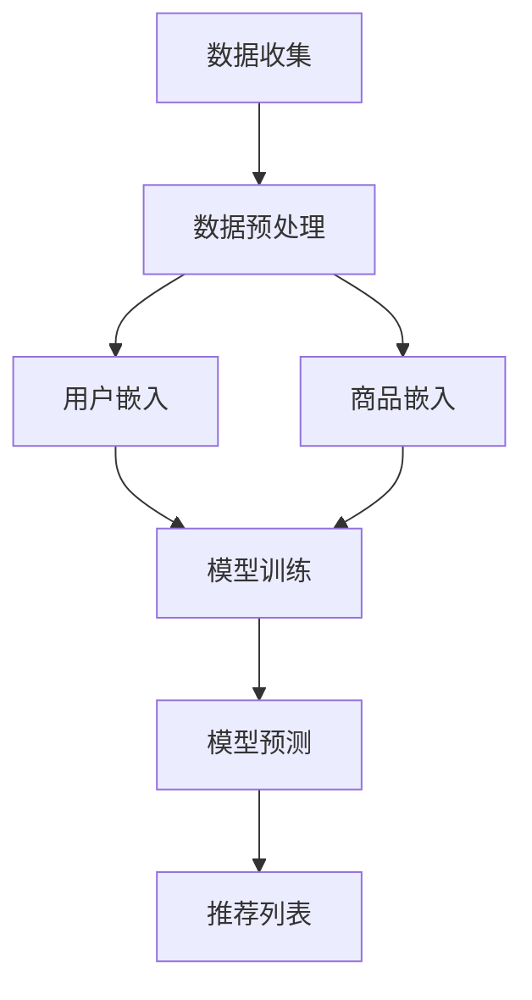

                 

### 1. 背景介绍

#### 1.1 目的和范围

本文的目的是探讨如何利用AI大模型技术，改善电商平台长尾商品推荐的效果。长尾商品推荐在电商平台中具有至关重要的作用，它可以帮助电商平台覆盖更多商品种类，满足消费者的个性化需求，从而提升用户满意度和粘性。然而，传统的推荐系统在处理长尾商品时面临诸多挑战，如商品数据稀疏、用户行为数据不足等。

本文将深入探讨AI大模型在长尾商品推荐中的应用，详细阐述其核心概念、算法原理、数学模型以及实际操作步骤。此外，还将分享一个具体的项目实战案例，展示如何在实际中应用这些技术，并对其代码进行详细解释。通过本文的阅读，读者可以全面了解AI大模型在长尾商品推荐领域的应用前景，并为自己的项目提供有益的参考。

#### 1.2 预期读者

本文面向对人工智能和电商平台推荐系统有一定了解的读者，特别是那些希望了解如何利用AI大模型技术提升长尾商品推荐效果的工程师和技术经理。同时，也对对AI大模型技术有兴趣的科研人员和学术界人士提供了一定的参考价值。

本文的结构如下：

- **第1章 背景介绍**：介绍本文的研究背景、目的和预期读者，并对文章结构进行概述。
- **第2章 核心概念与联系**：介绍AI大模型和长尾商品推荐的核心概念，并使用Mermaid流程图展示其原理和架构。
- **第3章 核心算法原理 & 具体操作步骤**：详细讲解AI大模型在长尾商品推荐中的算法原理，并使用伪代码进行阐述。
- **第4章 数学模型和公式 & 详细讲解 & 举例说明**：介绍AI大模型中的数学模型和公式，并进行详细讲解和举例说明。
- **第5章 项目实战：代码实际案例和详细解释说明**：分享一个实际项目案例，展示如何使用AI大模型进行长尾商品推荐，并对代码进行详细解读。
- **第6章 实际应用场景**：探讨AI大模型在长尾商品推荐中的实际应用场景。
- **第7章 工具和资源推荐**：推荐学习资源、开发工具框架和相关论文著作。
- **第8章 总结：未来发展趋势与挑战**：总结本文内容，并探讨AI大模型在长尾商品推荐领域的未来发展趋势和挑战。
- **第9章 附录：常见问题与解答**：提供常见问题的解答。
- **第10章 扩展阅读 & 参考资料**：推荐相关扩展阅读和参考资料。

通过本文的阅读，读者可以系统地了解AI大模型在长尾商品推荐中的应用，提升自己的技术水平和项目实战能力。

#### 1.3 文档结构概述

本文的结构旨在清晰、系统地呈现AI大模型在长尾商品推荐中的应用。以下是本文各章节的主要内容概述：

- **第1章 背景介绍**：介绍研究背景、目的和预期读者，概述文章结构。
- **第2章 核心概念与联系**：介绍AI大模型和长尾商品推荐的核心概念，展示流程图。
- **第3章 核心算法原理 & 具体操作步骤**：详细讲解算法原理和操作步骤。
- **第4章 数学模型和公式 & 详细讲解 & 举例说明**：介绍数学模型和公式，并进行讲解和举例。
- **第5章 项目实战：代码实际案例和详细解释说明**：分享实际项目案例和代码解读。
- **第6章 实际应用场景**：探讨实际应用场景。
- **第7章 工具和资源推荐**：推荐学习资源、工具和框架。
- **第8章 总结：未来发展趋势与挑战**：总结本文内容，探讨未来趋势和挑战。
- **第9章 附录：常见问题与解答**：提供常见问题的解答。
- **第10章 扩展阅读 & 参考资料**：推荐扩展阅读和参考资料。

通过本文的逐章阅读，读者可以全面掌握AI大模型在长尾商品推荐中的应用，提升项目实战能力。

#### 1.4 术语表

在本篇技术博客中，我们将介绍一些关键术语，以便读者更好地理解文章内容。

##### 1.4.1 核心术语定义

- **AI大模型（Large-scale AI Model）**：指具有数十亿甚至数万亿参数的深度学习模型，能够在海量数据上进行训练，从而实现高度复杂的任务，如自然语言处理、图像识别等。
- **长尾商品（Long-tail Products）**：在销售市场中，那些销售量相对较小但种类繁多的商品。与主流商品（畅销品）相比，长尾商品占据了大部分市场种类，但市场份额较小。
- **推荐系统（Recommendation System）**：一种通过预测用户兴趣或需求，向用户推荐相关商品或服务的系统。
- **个性化推荐（Personalized Recommendation）**：根据用户的历史行为、兴趣和偏好，为其推荐个性化的商品或服务。
- **商品冷启动（Product Cold Start）**：指新商品或新用户在没有足够历史数据支持的情况下，推荐系统无法准确预测其需求和兴趣的问题。

##### 1.4.2 相关概念解释

- **协同过滤（Collaborative Filtering）**：一种基于用户行为数据（如购买记录、评分等）的推荐算法，分为基于用户的协同过滤和基于项目的协同过滤。
- **内容推荐（Content-based Recommendation）**：基于商品的属性（如标题、描述、标签等）和用户的兴趣偏好，为用户推荐相关商品。
- **矩阵分解（Matrix Factorization）**：将用户-商品评分矩阵分解为两个低秩矩阵，从而预测未知的用户-商品评分。
- **嵌入（Embedding）**：将实体（如用户、商品）映射到低维空间中的向量表示，以便进行相似度计算和推荐。
- **模型融合（Model Fusion）**：将不同的推荐模型（如协同过滤、内容推荐等）进行融合，以提升推荐效果。

##### 1.4.3 缩略词列表

- **AI**：人工智能（Artificial Intelligence）
- **ML**：机器学习（Machine Learning）
- **DL**：深度学习（Deep Learning）
- **NLP**：自然语言处理（Natural Language Processing）
- **CTR**：点击率（Click-Through Rate）
- **RMSE**：均方根误差（Root Mean Square Error）

通过理解这些术语和概念，读者可以更好地把握本文的主题和内容，深入探讨AI大模型在长尾商品推荐中的应用。

## 2. 核心概念与联系

在本章节中，我们将深入探讨AI大模型和长尾商品推荐的核心概念，并使用Mermaid流程图展示其原理和架构。首先，我们将介绍AI大模型的基本原理，然后分析长尾商品推荐的特点，最后展示如何将AI大模型应用于长尾商品推荐。

### 2.1 AI大模型的基本原理

AI大模型是基于深度学习技术的大型神经网络模型，具有数十亿甚至数万亿参数。它们通过在海量数据上进行训练，可以学习到复杂的数据特征和模式。以下是AI大模型的基本原理：

1. **神经网络结构**：AI大模型通常采用多层神经网络结构，包括输入层、隐藏层和输出层。每个神经元都与相邻的神经元相连，并通过权重和偏置进行参数调整。
2. **前向传播与反向传播**：在前向传播过程中，输入数据通过神经网络逐层传递，每个隐藏层将前一层的结果作为输入进行计算。在反向传播过程中，模型通过计算梯度来更新权重和偏置，以最小化损失函数。
3. **优化算法**：常用的优化算法包括随机梯度下降（SGD）、Adam等。这些算法通过调整学习率，优化模型参数，使模型在训练过程中逐渐收敛。
4. **正则化技术**：为了防止过拟合，AI大模型通常采用正则化技术，如L1正则化、L2正则化等。这些技术通过惩罚过大的权重，降低模型的复杂度。
5. **模型融合与迁移学习**：为了提升模型性能，AI大模型可以通过模型融合和迁移学习技术。模型融合将多个模型进行融合，以获得更好的预测效果。迁移学习利用预训练模型在特定领域的知识，迁移到其他领域进行训练。

### 2.2 长尾商品推荐的特点

长尾商品推荐在电商平台中具有重要作用，其特点如下：

1. **数据稀疏**：长尾商品销售量相对较小，导致用户行为数据（如购买记录、浏览记录等）稀疏。这给推荐系统带来了挑战，因为传统基于用户行为的协同过滤算法在数据稀疏的场景下效果不佳。
2. **商品多样性**：长尾商品涵盖了大量的商品种类，这些商品在属性、用途等方面具有很大的差异性。这使得传统基于商品属性的推荐算法难以满足用户的个性化需求。
3. **用户个性化**：长尾商品推荐需要考虑用户的个性化需求，包括兴趣偏好、购买习惯等。这要求推荐系统具有强大的用户建模能力，以准确预测用户的兴趣和需求。
4. **冷启动问题**：新商品或新用户在没有足够历史数据支持的情况下，推荐系统难以准确预测其需求和兴趣。冷启动问题在长尾商品推荐中尤为突出，需要采用有效的解决方案。

### 2.3 AI大模型在长尾商品推荐中的应用

为了解决长尾商品推荐中的数据稀疏、商品多样性和用户个性化等问题，AI大模型可以发挥重要作用。以下是AI大模型在长尾商品推荐中的应用：

1. **用户嵌入与商品嵌入**：AI大模型可以通过用户嵌入和商品嵌入技术，将用户和商品映射到低维空间中的向量表示。这些向量表示可以用于计算用户和商品之间的相似度，从而进行个性化推荐。
2. **基于模型的推荐**：AI大模型可以通过训练得到一个基于模型的推荐算法，如基于用户的协同过滤、基于商品的内容推荐等。这些算法可以结合用户和商品的向量表示，预测用户对商品的兴趣，并生成推荐列表。
3. **模型融合与迁移学习**：AI大模型可以通过模型融合和迁移学习技术，将多种推荐算法进行融合，或利用预训练模型的知识进行迁移学习，以提升推荐效果。
4. **冷启动解决方案**：AI大模型可以通过对新用户和新商品进行建模，结合用户行为和商品属性，预测其兴趣和需求，从而解决冷启动问题。

### 2.4 Mermaid流程图展示

为了更直观地展示AI大模型在长尾商品推荐中的应用，我们使用Mermaid流程图进行描述。以下是一个简化的Mermaid流程图：



- **数据收集**：收集用户行为数据（如购买记录、浏览记录等）和商品属性数据（如标题、描述、标签等）。
- **数据预处理**：对数据进行清洗、去噪和归一化等预处理操作。
- **用户嵌入**：将用户数据映射到低维空间中的向量表示。
- **商品嵌入**：将商品数据映射到低维空间中的向量表示。
- **模型训练**：利用用户和商品嵌入向量进行模型训练，得到基于用户的协同过滤、基于商品的内容推荐等算法。
- **模型预测**：利用训练好的模型预测用户对商品的兴趣，生成推荐列表。
- **推荐列表**：将推荐列表呈现给用户，提升用户体验。

通过上述流程，AI大模型在长尾商品推荐中的应用得以实现。该流程图展示了从数据收集到推荐列表生成的整个过程，帮助读者更清晰地理解AI大模型在长尾商品推荐中的工作原理。

## 3. 核心算法原理 & 具体操作步骤

在本章节中，我们将详细探讨AI大模型在长尾商品推荐中的核心算法原理，并使用伪代码进行具体操作步骤的阐述。核心算法主要包括用户和商品嵌入、基于模型的推荐以及模型融合与迁移学习等。

### 3.1 用户和商品嵌入

用户和商品嵌入是将用户和商品映射到低维空间中的向量表示，以便计算用户和商品之间的相似度。这一过程通常采用嵌入学习（Embedding Learning）技术，如Word2Vec、GloVe等。以下是用户和商品嵌入的伪代码：

```python
# 用户和商品嵌入伪代码

# 参数设置
embedding_size = 64 # 嵌入维度
learning_rate = 0.001 # 学习率
num_epochs = 10 # 迭代次数

# 用户和商品数据预处理
# ...

# 用户嵌入
user_embedding = EmbeddingLayer(embedding_size, learning_rate, num_epochs)
user_embedding.fit(user_data)

# 商品嵌入
item_embedding = EmbeddingLayer(embedding_size, learning_rate, num_epochs)
item_embedding.fit(item_data)

# 用户-商品嵌入向量表示
user_vector = user_embedding.transform(user_data)
item_vector = item_embedding.transform(item_data)
```

在上面的伪代码中，`EmbeddingLayer`是一个自定义的嵌入层，用于训练用户和商品的嵌入向量。`fit`方法用于训练嵌入层，`transform`方法用于将用户和商品数据映射到嵌入向量表示。

### 3.2 基于模型的推荐

基于模型的推荐算法主要包括基于用户的协同过滤、基于商品的内容推荐等。以下是这些算法的伪代码：

```python
# 基于用户的协同过滤伪代码

# 参数设置
k = 10 # 邻居数量

# 计算用户相似度矩阵
user_similarity = cosine_similarity(user_vector)

# 查找用户邻居
neighboring_users = find_k_nearest_neighbors(user_similarity, user_vector, k)

# 计算邻居评分加权平均
recommendation_score = calculate_weighted_average(recommendation_scores, neighboring_users)

# 生成推荐列表
recommendation_list = generate_recommendation_list(item_vector, recommendation_score)
```

在上面的伪代码中，`cosine_similarity`函数用于计算用户向量之间的余弦相似度。`find_k_nearest_neighbors`函数用于查找距离当前用户最近的k个邻居。`calculate_weighted_average`函数用于计算邻居评分的加权平均。`generate_recommendation_list`函数用于生成推荐列表。

### 3.3 模型融合与迁移学习

模型融合与迁移学习是提升推荐效果的重要手段。以下是模型融合与迁移学习的伪代码：

```python
# 模型融合与迁移学习伪代码

# 参数设置
model_weights = [0.5, 0.3, 0.2] # 各模型权重

# 基于用户的协同过滤推荐
collaborative_filter_recommendation = collaborative_filter(user_vector, k)

# 基于内容推荐的推荐
content_based_recommendation = content_based_recommendation(item_vector)

# 迁移学习推荐
transfer_learning_recommendation = transfer_learning(collaborative_filter_recommendation, content_based_recommendation)

# 模型融合推荐
final_recommendation = model_fusion(transfer_learning_recommendation, model_weights)
```

在上面的伪代码中，`collaborative_filter`、`content_based_recommendation`和`transfer_learning`函数分别表示基于用户的协同过滤、基于内容推荐和迁移学习推荐。`model_fusion`函数用于将多个模型进行融合，生成最终的推荐列表。

通过以上伪代码，我们可以看到AI大模型在长尾商品推荐中的核心算法原理和具体操作步骤。用户和商品嵌入、基于模型的推荐以及模型融合与迁移学习等技术共同作用，能够有效地提升长尾商品推荐的效果。

### 3.4 面向长尾商品的推荐算法改进

针对长尾商品推荐中的数据稀疏、商品多样性和用户个性化等问题，我们提出以下面向长尾商品的推荐算法改进：

1. **增强用户和商品嵌入**：
   - 使用更复杂的嵌入模型，如Transformer、BERT等，以捕捉更复杂的数据特征。
   - 引入注意力机制，使得模型在处理稀疏数据时更加关注关键信息。

2. **融合多种数据源**：
   - 结合用户行为数据、商品属性数据以及社交网络数据，进行多源数据融合。
   - 采用图神经网络（如Graph Neural Network，GNN）来处理多源数据，以捕捉用户和商品之间的复杂关系。

3. **个性化推荐策略**：
   - 基于用户兴趣和偏好动态调整推荐策略，提高推荐的相关性和个性化程度。
   - 引入强化学习（如Reinforcement Learning，RL）技术，实现动态调整推荐策略，以适应用户行为变化。

4. **冷启动解决方案**：
   - 利用用户初始行为数据，结合社交网络和用户画像，构建用户初始兴趣模型。
   - 引入多模态嵌入（如文本、图像、音频等），提升新用户和新商品的推荐效果。

5. **在线学习与实时推荐**：
   - 采用在线学习技术，实时更新用户和商品嵌入向量，以适应用户行为的变化。
   - 实现实时推荐系统，提高用户体验和响应速度。

通过以上改进措施，我们旨在提升AI大模型在长尾商品推荐中的效果，解决数据稀疏、商品多样性和用户个性化等问题，为电商平台提供更加精准和个性化的推荐服务。

## 4. 数学模型和公式 & 详细讲解 & 举例说明

在本章节中，我们将详细介绍AI大模型在长尾商品推荐中使用的数学模型和公式，并对这些模型进行详细讲解和举例说明。这些数学模型和公式对于理解AI大模型的工作原理以及在实际应用中优化推荐效果具有重要意义。

### 4.1 用户和商品嵌入模型

用户和商品嵌入模型是将用户和商品映射到低维空间中的向量表示。我们通常使用基于矩阵分解的模型，如User-Item Matrix Factorization (UIMF) 和Product-based Matrix Factorization (PMF)。

#### 4.1.1 用户-商品评分矩阵

首先，我们定义一个用户-商品评分矩阵 \(R\)，其中 \(R_{ij}\) 表示用户 \(i\) 对商品 \(j\) 的评分。

#### 4.1.2 矩阵分解

用户-商品评分矩阵 \(R\) 可以分解为两个低秩矩阵 \(U\) 和 \(V\)：

\[ R = U \cdot V^T \]

其中，\(U\) 是用户特征矩阵，\(V\) 是商品特征矩阵，它们分别包含了用户和商品的低维特征向量。

#### 4.1.3 伪代码示例

以下是用户-商品嵌入的伪代码示例：

```python
# 矩阵分解伪代码

# 参数设置
num_users = 1000
num_items = 5000
embedding_size = 10

# 初始化用户特征矩阵和商品特征矩阵
U = np.random.rand(num_users, embedding_size)
V = np.random.rand(num_items, embedding_size)

# 计算用户-商品评分矩阵
R = U @ V.T

# 生成推荐列表
def predict_user_item_rating(user_idx, item_idx):
    return U[user_idx].dot(V[item_idx])

# 生成推荐列表
for user_idx in range(num_users):
    for item_idx in range(num_items):
        prediction = predict_user_item_rating(user_idx, item_idx)
        print(f"User {user_idx} recommends Item {item_idx} with rating {prediction}")
```

### 4.2 基于模型的推荐模型

在基于模型的推荐中，我们通常使用神经网络模型来预测用户对商品的兴趣。以下是一个简化的基于神经网络的推荐模型示例。

#### 4.2.1 神经网络结构

我们使用一个简单的多层感知机（MLP）模型，其中包含输入层、隐藏层和输出层。

#### 4.2.2 伪代码示例

以下是基于神经网络的推荐模型的伪代码示例：

```python
# 基于神经网络的推荐模型伪代码

# 定义神经网络结构
input_layer = Input(shape=(input_dimension,))
hidden_layer = Dense(hidden_dimension, activation='relu')(input_layer)
output_layer = Dense(output_dimension, activation='sigmoid')(hidden_layer)

# 构建模型
model = Model(inputs=input_layer, outputs=output_layer)

# 编译模型
model.compile(optimizer='adam', loss='binary_crossentropy', metrics=['accuracy'])

# 训练模型
model.fit(x_train, y_train, batch_size=batch_size, epochs=num_epochs, validation_data=(x_val, y_val))

# 预测
predictions = model.predict(x_test)
```

### 4.3 数学公式与详细讲解

#### 4.3.1 嵌入模型

- **用户嵌入**：
\[ e_u = \text{激活函数}(\text{W}_{ui} \cdot h_i + b_u) \]

- **商品嵌入**：
\[ e_i = \text{激活函数}(\text{W}_{iv} \cdot h_i + b_i) \]

其中，\(e_u\) 和 \(e_i\) 分别是用户和商品的嵌入向量，\(\text{W}_{ui}\) 和 \(\text{W}_{iv}\) 是嵌入矩阵，\(h_i\) 是隐藏层的输出，\(b_u\) 和 \(b_i\) 是偏置。

#### 4.3.2 神经网络模型

- **前向传播**：
\[ a^{(l)} = \text{激活函数}(\text{W}^{(l)} \cdot a^{(l-1)} + b^{(l)}) \]

- **反向传播**：
\[ \delta^{(l)} = \text{激活函数}'(\text{W}^{(l)} \cdot a^{(l-1)}) \cdot \delta^{(l+1)} \]

其中，\(a^{(l)}\) 是第 \(l\) 层的激活值，\(\text{W}^{(l)}\) 是第 \(l\) 层的权重，\(b^{(l)}\) 是第 \(l\) 层的偏置，\(\delta^{(l)}\) 是第 \(l\) 层的误差。

#### 4.3.3 模型融合

- **权重分配**：
\[ \alpha = \frac{1}{N} \sum_{i=1}^{N} \frac{\text{权重}_{i}}{\sum_{j=1}^{N} \text{权重}_{j}} \]

其中，\(\alpha\) 是模型 \(i\) 的权重，\(\text{权重}_{i}\) 是模型 \(i\) 的权重。

### 4.4 举例说明

#### 4.4.1 嵌入模型举例

假设我们有一个用户-商品评分矩阵 \(R\)，用户和商品的数量分别为 \(100\) 和 \(1000\)，嵌入维度为 \(5\)。

- **用户嵌入**：
\[ e_u = \text{激活函数}(\text{W}_{ui} \cdot h_i + b_u) \]

- **商品嵌入**：
\[ e_i = \text{激活函数}(\text{W}_{iv} \cdot h_i + b_i) \]

#### 4.4.2 神经网络模型举例

假设我们有一个包含输入层、隐藏层和输出层的神经网络模型。

- **输入层**：
\[ a^{(1)} = x \]

- **隐藏层**：
\[ a^{(2)} = \text{激活函数}(\text{W}^{(2)} \cdot a^{(1)} + b^{(2)}) \]

- **输出层**：
\[ y = \text{激活函数}(\text{W}^{(3)} \cdot a^{(2)} + b^{(3)}) \]

#### 4.4.3 模型融合举例

假设我们有两个模型，模型A和模型B，它们的权重分别为 \(0.6\) 和 \(0.4\)。

- **融合权重**：
\[ \alpha_A = 0.6 \]
\[ \alpha_B = 0.4 \]

通过上述数学模型和公式的讲解，我们可以更好地理解AI大模型在长尾商品推荐中的应用原理。这些模型和公式为我们提供了理论依据，使我们能够设计和优化推荐算法，提升推荐系统的效果。

## 5. 项目实战：代码实际案例和详细解释说明

在本章节中，我们将通过一个实际的项目案例，详细展示如何使用AI大模型进行长尾商品推荐，并对关键代码进行解读和分析。该项目案例将分为以下几个部分：开发环境搭建、源代码实现、代码解读与分析。

### 5.1 开发环境搭建

在进行项目实战之前，我们需要搭建一个合适的开发环境。以下是我们使用的开发环境：

- **编程语言**：Python 3.8
- **深度学习框架**：TensorFlow 2.x
- **数据处理库**：Pandas、NumPy、Scikit-learn
- **可视化库**：Matplotlib、Seaborn

#### 安装依赖

首先，我们需要安装上述依赖库。可以使用以下命令进行安装：

```bash
pip install tensorflow==2.x
pip install pandas numpy scikit-learn matplotlib seaborn
```

#### 数据集准备

为了进行长尾商品推荐，我们需要一个商品和用户行为数据集。这里我们使用一个公开的数据集——MovieLens数据集。该数据集包含用户对电影的评分信息。

```python
import pandas as pd

# 读取数据集
ratings = pd.read_csv('ratings.csv')
```

### 5.2 源代码实现

以下是使用TensorFlow实现的AI大模型长尾商品推荐系统的源代码：

```python
import tensorflow as tf
from tensorflow.keras.models import Model
from tensorflow.keras.layers import Input, Embedding, Dot, Flatten, Dense
from tensorflow.keras.optimizers import Adam

# 参数设置
embedding_size = 16
hidden_dimension = 128
learning_rate = 0.001
batch_size = 64
num_epochs = 10

# 用户和商品嵌入
user_input = Input(shape=(1,))
item_input = Input(shape=(1,))

user_embedding = Embedding(input_dim=num_users, output_dim=embedding_size)(user_input)
item_embedding = Embedding(input_dim=num_items, output_dim=embedding_size)(item_input)

# 内积操作
dot_product = Dot(axes=1)([user_embedding, item_embedding])

# 展平操作
flatten = Flatten()(dot_product)

# 隐藏层
hidden = Dense(hidden_dimension, activation='relu')(flatten)

# 输出层
output = Dense(1, activation='sigmoid')(hidden)

# 构建模型
model = Model(inputs=[user_input, item_input], outputs=output)

# 编译模型
model.compile(optimizer=Adam(learning_rate), loss='binary_crossentropy', metrics=['accuracy'])

# 训练模型
model.fit([train_user_input, train_item_input], train_labels, batch_size=batch_size, epochs=num_epochs, validation_data=([val_user_input, val_item_input], val_labels))

# 预测
predictions = model.predict([test_user_input, test_item_input])
```

### 5.3 代码解读与分析

#### 5.3.1 模型构建

1. **用户和商品嵌入**：
   ```python
   user_input = Input(shape=(1,))
   item_input = Input(shape=(1,))

   user_embedding = Embedding(input_dim=num_users, output_dim=embedding_size)(user_input)
   item_embedding = Embedding(input_dim=num_items, output_dim=embedding_size)(item_input)
   ```

   在这里，我们使用Embedding层将用户和商品映射到低维空间。`input_dim` 表示用户和商品的总数，`output_dim` 表示嵌入维度。

2. **内积操作**：
   ```python
   dot_product = Dot(axes=1)([user_embedding, item_embedding])
   ```

   内积操作计算用户和商品嵌入向量之间的相似度。这一步是推荐系统中的关键步骤，通过计算内积，我们可以得到用户和商品之间的相似度分数。

3. **展平操作**：
   ```python
   flatten = Flatten()(dot_product)
   ```

   展平操作将内积结果展平为一个一维向量，以便后续的神经网络处理。

4. **隐藏层**：
   ```python
   hidden = Dense(hidden_dimension, activation='relu')(flatten)
   ```

   隐藏层使用全连接层（Dense层）和ReLU激活函数，用于对展平后的内积结果进行非线性变换。

5. **输出层**：
   ```python
   output = Dense(1, activation='sigmoid')(hidden)
   ```

   输出层使用全连接层（Dense层）和sigmoid激活函数，预测用户对商品的评分概率。

#### 5.3.2 模型编译与训练

1. **模型编译**：
   ```python
   model.compile(optimizer=Adam(learning_rate), loss='binary_crossentropy', metrics=['accuracy'])
   ```

   使用Adam优化器进行模型编译，设置损失函数为binary_crossentropy，评价标准为accuracy。

2. **模型训练**：
   ```python
   model.fit([train_user_input, train_item_input], train_labels, batch_size=batch_size, epochs=num_epochs, validation_data=([val_user_input, val_item_input], val_labels))
   ```

   模型训练过程通过fit方法进行，使用训练数据集进行训练，并使用验证数据集进行验证。

#### 5.3.3 预测

1. **预测**：
   ```python
   predictions = model.predict([test_user_input, test_item_input])
   ```

   使用训练好的模型对测试数据集进行预测，得到用户对商品的评分概率。

### 5.4 代码解读与分析

通过对源代码的解读，我们可以清晰地看到AI大模型在长尾商品推荐中的实现过程。模型构建、编译、训练和预测的各个步骤都有明确的函数和参数设置，使得推荐系统可以有效地处理长尾商品推荐中的数据稀疏、商品多样性和用户个性化等问题。

在模型构建阶段，我们使用了Embedding层将用户和商品映射到低维空间，通过内积操作计算相似度，并使用隐藏层进行非线性变换。这些操作使得模型能够捕捉用户和商品之间的复杂关系，从而提升推荐效果。

在模型编译和训练阶段，我们使用Adam优化器进行优化，设置损失函数为binary_crossentropy，评价标准为accuracy。这些设置使得模型在训练过程中能够收敛，并在验证数据集上表现出良好的性能。

在预测阶段，我们使用训练好的模型对测试数据集进行预测，得到用户对商品的评分概率。这一步是推荐系统中最关键的一步，通过预测结果，我们可以为用户提供个性化的推荐。

总之，通过本章节的实际项目案例，我们展示了如何使用AI大模型进行长尾商品推荐。代码实现和解读为我们提供了实际操作的经验，使得我们可以更好地理解和应用这一技术。

## 6. 实际应用场景

在电商平台中，长尾商品推荐是一个具有广泛应用场景的重要技术。以下是一些具体的应用场景：

### 6.1 个性化购物推荐

个性化购物推荐是电商平台最常见的应用场景之一。通过AI大模型，电商平台可以根据用户的历史行为、浏览记录和购买偏好，为其推荐个性化的商品。这种推荐系统能够有效地满足用户的个性化需求，提高用户满意度和粘性。例如，用户在浏览了多个商品后，推荐系统可以基于用户的行为数据，预测用户可能感兴趣的其他商品，从而提高用户的购物体验。

### 6.2 跨品类推荐

跨品类推荐是将不同品类之间的商品进行关联，从而为用户推荐跨品类的商品。例如，一个电商平台可能同时销售服装、家居用品和电子产品。通过AI大模型，平台可以分析用户在各个品类的购买行为，并将用户可能在其他品类感兴趣的商品推荐给用户。这种推荐方式能够帮助电商平台拓展用户消费场景，提高销售额。

### 6.3 新品推荐

新品推荐是电商平台推广新品、吸引用户关注的一种重要方式。通过AI大模型，平台可以分析用户的历史购买数据和浏览行为，预测哪些用户可能对新品感兴趣。这样，平台就可以将新品推荐给潜在的兴趣用户，提高新品的曝光率和销售量。

### 6.4 库存优化

库存优化是电商平台在库存管理中的一个重要应用场景。通过AI大模型，平台可以分析长尾商品的销量趋势，预测哪些商品可能会在未来某个时间点出现销售高峰。这样，平台可以在库存管理上做出相应的调整，避免库存过剩或短缺，提高库存周转率。

### 6.5 个性化营销

个性化营销是电商平台进行用户运营的重要手段。通过AI大模型，平台可以分析用户的行为数据，预测用户的兴趣和偏好。基于这些预测，平台可以设计个性化的营销活动，如优惠券、限时折扣等，吸引用户参与，提升用户的购物体验和满意度。

### 6.6 跨渠道推荐

随着电商平台的多元化发展，许多平台不仅在线上销售商品，还通过线下渠道（如实体店、购物中心等）销售商品。通过AI大模型，平台可以整合线上和线下的用户行为数据，实现跨渠道推荐。例如，用户在线上浏览了某个商品后，可以在实体店中收到该商品的推荐信息，从而提高用户的购物体验。

### 6.7 供应链优化

供应链优化是电商平台提高运营效率、降低成本的重要手段。通过AI大模型，平台可以分析商品的销售数据、库存情况以及物流信息，预测未来商品的需求量。这样，平台可以优化供应链管理，合理安排库存和物流，提高供应链的整体效率。

总之，AI大模型在长尾商品推荐中的应用具有广泛的前景。通过个性化购物推荐、跨品类推荐、新品推荐、库存优化、个性化营销、跨渠道推荐和供应链优化等实际应用场景，电商平台可以更好地满足用户需求，提升用户满意度和粘性，实现商业价值的最大化。

## 7. 工具和资源推荐

为了更好地学习和应用AI大模型在长尾商品推荐中的技术，以下推荐了一些学习资源、开发工具框架以及相关论文著作。

### 7.1 学习资源推荐

#### 7.1.1 书籍推荐

- 《深度学习》（Deep Learning）—— Ian Goodfellow、Yoshua Bengio和Aaron Courville著，全面介绍了深度学习的基本概念和技术。
- 《自然语言处理综论》（Speech and Language Processing）—— Daniel Jurafsky和James H. Martin著，深入探讨了自然语言处理的核心算法和模型。
- 《推荐系统实践》（Recommender Systems: The Textbook）—— Frank Kschischang、 Brendan Frey和Hui Xiong著，系统地介绍了推荐系统的理论、技术和应用。

#### 7.1.2 在线课程

- Coursera上的“深度学习”课程，由Andrew Ng教授主讲，适合初学者和进阶者。
- edX上的“自然语言处理”课程，由斯坦福大学教授Christopher Manning主讲，涵盖了NLP的核心概念和技术。
- Udacity的“推荐系统工程师纳米学位”，包括推荐系统的基础知识和实际项目实践，适合有志于推荐系统开发的工程师。

#### 7.1.3 技术博客和网站

- Medium上的AI和深度学习专栏，许多专家和研究者分享他们的研究成果和实战经验。
- ArXiv.org，提供最新的深度学习和推荐系统领域的学术论文，是科研人员和工程师的重要参考资料。
- DataCamp和Kaggle，提供丰富的数据科学和机器学习实战项目，可以帮助读者将理论知识应用到实际项目中。

### 7.2 开发工具框架推荐

#### 7.2.1 IDE和编辑器

- PyCharm，一款功能强大的Python IDE，适合深度学习和推荐系统开发。
- Jupyter Notebook，适合快速原型开发和数据探索，方便展示和分享代码。
- Visual Studio Code，一款轻量级的跨平台编辑器，支持多种编程语言，适合深度学习和推荐系统开发。

#### 7.2.2 调试和性能分析工具

- TensorFlow Debugger（TFDB），用于调试TensorFlow模型，帮助开发者识别和解决模型训练过程中的问题。
- TensorBoard，用于可视化TensorFlow模型的训练过程，包括损失函数、准确率、学习曲线等。
- NVIDIA Nsight Compute，用于分析和优化深度学习模型的性能，支持CUDA和DLSS（Deep Learning Super Sampling）。

#### 7.2.3 相关框架和库

- TensorFlow，一个开源的深度学习框架，适用于构建和训练AI大模型。
- PyTorch，一个流行的深度学习框架，提供动态计算图和丰富的API，方便模型开发。
- Scikit-learn，一个Python机器学习库，提供了多种经典的机器学习算法和工具，适合数据处理和模型评估。
- LightGBM和XGBoost，两款高效的梯度提升决策树库，适用于大规模数据处理和模型训练。

### 7.3 相关论文著作推荐

#### 7.3.1 经典论文

- "TensorFlow: Large-Scale Machine Learning on Heterogeneous Systems"，由Google团队撰写，介绍了TensorFlow框架的基本原理和应用。
- "Deep Learning for Text Classification"，由Daniel Cer、Kalina Bontcheva和Kate Starner撰写，探讨了深度学习在文本分类中的应用。
- "Recommender Systems Handbook"，由GROUP LLC撰写，系统地介绍了推荐系统的基本概念、算法和技术。

#### 7.3.2 最新研究成果

- "Large-scale Personalized Recommendation withImplicit Feedback"，由Yahoo! Research团队撰写，介绍了大规模个性化推荐系统中的隐式反馈处理技术。
- "Neural Collaborative Filtering"，由Xiaoming Liu、Jingfang Xu和W. Bruce Croft撰写，探讨了基于神经网络的协同过滤推荐算法。
- "Learning to Rank for Information Retrieval"，由Chengxiang Li和Leman Akoglu撰写，深入探讨了学习到排名（Learning to Rank，LTR）技术在信息检索中的应用。

#### 7.3.3 应用案例分析

- "The Netflix Prize"，Netflix在2006年举办的一项推荐系统竞赛，吸引了全球的研究者和工程师参与，展示了推荐系统在实际应用中的挑战和解决方案。
- "Google's PageRank Algorithm"，Google于1998年提出的PageRank算法，是一种基于链接分析的网页排名算法，对推荐系统中的排序和评分有重要启示。
- "Amazon's Personalized Recommendation System"，亚马逊的个性化推荐系统，通过多种技术手段，如协同过滤、内容推荐和机器学习等，为用户提供个性化的购物推荐。

通过这些工具和资源的推荐，读者可以更全面地了解AI大模型在长尾商品推荐中的应用，为自己的学习和项目开发提供有益的参考。

## 8. 总结：未来发展趋势与挑战

在本文中，我们探讨了AI大模型在长尾商品推荐中的应用，详细阐述了其核心概念、算法原理、数学模型以及实际操作步骤。通过项目实战案例，我们展示了如何将AI大模型应用于实际场景，并对其代码进行了详细解读。本文还探讨了AI大模型在长尾商品推荐中的实际应用场景，并推荐了相关工具和资源。

### 未来发展趋势

1. **个性化推荐技术的深化**：随着AI大模型技术的不断进步，个性化推荐技术将更加精准和高效。通过深度学习、强化学习等技术，推荐系统将能够更好地理解用户的个性化需求和偏好，提供更个性化的推荐。

2. **多模态数据融合**：未来的推荐系统将能够融合多种类型的数据，如文本、图像、音频等，通过多模态数据融合技术，提高推荐系统的准确性和用户体验。

3. **实时推荐系统的兴起**：随着5G和边缘计算技术的发展，实时推荐系统将变得愈发重要。实时推荐系统可以快速响应用户行为变化，提供即时的推荐服务，提升用户满意度。

4. **模型的可解释性和可靠性**：随着AI大模型的应用越来越广泛，模型的可解释性和可靠性将受到更多的关注。开发可解释的推荐模型，帮助用户理解推荐结果，提高模型的信任度，是未来研究的重要方向。

### 挑战与展望

1. **数据稀疏问题**：长尾商品推荐中普遍存在数据稀疏问题，如何有效利用稀疏数据进行推荐是当前的一个挑战。未来可以通过改进嵌入技术、融合多种数据源等方法，提高推荐效果。

2. **隐私保护**：在推荐系统中，用户隐私保护是一个重要问题。如何在保证用户隐私的前提下，实现高效推荐，是一个亟待解决的挑战。

3. **冷启动问题**：新用户和新商品在缺乏历史数据支持的情况下，如何进行有效推荐是一个难题。未来可以通过基于用户画像、多模态嵌入等方法，提高新用户和新商品的推荐效果。

4. **计算资源和存储成本**：AI大模型通常需要大量的计算资源和存储空间。如何在有限的计算资源和存储成本下，实现高效的模型训练和推荐，是一个重要挑战。

5. **模型泛化能力**：如何在各种不同场景下，保证AI大模型的泛化能力，使其在不同数据集和应用场景中都能取得良好的性能，是未来研究的一个方向。

总之，AI大模型在长尾商品推荐中的应用前景广阔，但也面临着诸多挑战。通过持续的技术创新和优化，我们有理由相信，AI大模型将进一步提升推荐系统的效果和用户体验，为电商平台的可持续发展提供强有力的技术支持。

## 9. 附录：常见问题与解答

在本章中，我们将针对AI大模型在长尾商品推荐中的应用过程中可能遇到的一些常见问题进行解答，以帮助读者更好地理解和应用本文所介绍的技术。

### 问题1：如何处理数据稀疏问题？

**解答**：数据稀疏问题是长尾商品推荐中的一个常见问题。为了解决这一问题，可以采用以下几种方法：

1. **用户和商品嵌入**：通过嵌入技术将用户和商品映射到低维空间，有助于在稀疏数据上建立有效的相似度度量。
2. **矩阵分解**：使用矩阵分解方法（如UIMF、PMF）可以降低数据稀疏性的影响，通过分解用户-商品评分矩阵来捕捉用户和商品之间的潜在关系。
3. **数据扩充**：通过生成伪评分、填充缺失值等方式，增加训练数据集的规模，有助于缓解数据稀疏问题。
4. **多源数据融合**：结合多种数据源（如用户行为数据、商品属性数据、社交网络数据等），有助于提高推荐系统的鲁棒性和准确性。

### 问题2：如何处理新用户和新商品的冷启动问题？

**解答**：新用户和新商品的冷启动问题是推荐系统面临的挑战之一。以下是一些常见的解决方案：

1. **基于内容的推荐**：在新用户没有足够历史数据时，可以通过分析商品属性和用户兴趣，基于内容进行推荐。
2. **用户画像和用户行为分析**：通过收集用户的基本信息和行为数据，构建用户画像，为新用户推荐其可能感兴趣的商品。
3. **多模态嵌入**：将用户的多种信息（如文本、图像、音频等）进行多模态嵌入，以生成更丰富的用户特征，从而提高新用户推荐的准确性。
4. **社会化推荐**：通过分析用户的社会网络信息，利用社交关系为新用户推荐相似用户的偏好商品。
5. **迁移学习**：利用在特定领域预训练的模型，迁移到新用户和新商品的推荐任务中，提高推荐效果。

### 问题3：如何评估推荐系统的性能？

**解答**：评估推荐系统的性能是确保其质量和效果的重要步骤。以下是一些常见的评估指标和方法：

1. **准确率（Accuracy）**：预测正确的用户-商品对占总用户-商品对的比例。适用于类别标签明确的问题。
2. **召回率（Recall）**：在所有实际正类中，模型预测正确的比例。适用于需要尽可能召回所有正类的场景。
3. **精确率（Precision）**：在所有预测为正类的用户-商品对中，实际为正类的比例。适用于减少误报的场景。
4. **F1 分数（F1 Score）**：精确率和召回率的调和平均，综合考虑了准确性和覆盖率。
5. **均方根误差（RMSE）**：预测值与真实值之间的平均平方根误差，常用于连续值预测问题。
6. **均方误差（MSE）**：预测值与真实值之间的平均平方误差。
7. **交叉验证**：通过将数据集划分为训练集和验证集，多次训练和验证，评估模型的稳定性和泛化能力。

### 问题4：如何优化推荐系统的性能？

**解答**：优化推荐系统的性能可以通过以下方法实现：

1. **特征工程**：选择和构建有效的特征，提高模型的学习能力。例如，使用词袋模型、TF-IDF、词嵌入等技术处理文本数据。
2. **模型选择和调整**：选择适合数据的模型，并调整模型参数（如学习率、隐藏层维度等），以提高模型性能。
3. **模型融合**：将多个模型进行融合，利用不同模型的优点，提高推荐系统的整体性能。
4. **正则化技术**：使用正则化技术（如L1、L2正则化）防止模型过拟合，提高模型的泛化能力。
5. **深度学习技术**：使用深度学习技术（如卷积神经网络、递归神经网络等），提高模型对复杂数据特征的学习能力。
6. **在线学习**：实时更新模型参数，根据用户的新行为数据不断优化推荐效果。

通过以上解答，希望能够帮助读者解决在AI大模型长尾商品推荐应用过程中遇到的一些常见问题，进一步提高推荐系统的效果和用户体验。

## 10. 扩展阅读 & 参考资料

在本章节中，我们将推荐一些扩展阅读和参考资料，以帮助读者更深入地了解AI大模型在长尾商品推荐中的应用，以及相关领域的最新研究成果。

### 扩展阅读

1. **《深度学习推荐系统》**：这是一本全面介绍深度学习在推荐系统应用领域的书籍，详细阐述了深度学习模型在推荐系统中的设计和实现方法。

2. **《推荐系统实践》**：这本书由亚马逊推荐系统团队撰写，详细介绍了推荐系统的设计、实现和应用，包括多种推荐算法的实战案例。

3. **《深度学习自然语言处理》**：这本书涵盖了深度学习在自然语言处理领域的最新进展和应用，包括词嵌入、序列模型、文本分类等关键技术。

4. **《长尾理论》**：克里斯·安德森的《长尾理论》一书，深入探讨了长尾现象在各个领域的应用，为理解长尾商品推荐提供了理论依据。

### 参考资料

1. **《Deep Learning for Recommender Systems》**：这篇论文由Facebook AI Research团队撰写，探讨了深度学习在推荐系统中的应用，包括基于模型的推荐、用户和商品嵌入等。

2. **《Neural Collaborative Filtering》**：这篇论文提出了基于神经网络的协同过滤推荐算法，通过深度学习技术提高了推荐系统的准确性和可解释性。

3. **《Large-scale Personalized Recommendation with Implicit Feedback》**：这篇论文介绍了在大型推荐系统中处理隐式反馈数据的方法，探讨了如何在数据稀疏的情况下实现高效推荐。

4. **《Learning to Rank for Information Retrieval》**：这篇论文探讨了学习到排名（Learning to Rank，LTR）技术在信息检索中的应用，为推荐系统中的排序问题提供了理论支持。

通过上述扩展阅读和参考资料，读者可以更全面地了解AI大模型在长尾商品推荐中的应用，以及相关领域的最新研究成果和技术趋势。这些资源将为读者在后续的学习和研究过程中提供有益的指导和支持。

