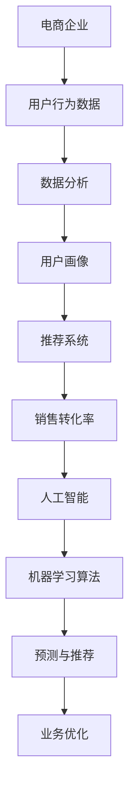

                 

# AI如何帮助电商企业进行数据分析

> **关键词：** 电商数据分析、人工智能、推荐系统、机器学习、用户行为分析
>
> **摘要：** 本文将深入探讨人工智能（AI）在电商企业数据分析中的应用，通过分析核心算法、数学模型和实际项目案例，帮助读者理解AI如何提升电商数据分析的效率和准确性。

## 1. 背景介绍

### 1.1 目的和范围

本文旨在探讨人工智能在电商企业数据分析中的实际应用，重点关注以下方面：

- 人工智能如何提升电商数据分析的效率和准确性
- 电商企业如何利用AI分析用户行为、优化推荐系统
- 实际项目案例中AI算法的具体实现和效果评估

### 1.2 预期读者

- 对电商行业有一定了解的技术人员
- 想要学习人工智能在电商数据分析领域应用的开发者
- 对数据分析和机器学习感兴趣的学者和学生

### 1.3 文档结构概述

本文分为十个部分，具体结构如下：

- 背景介绍
- 核心概念与联系
- 核心算法原理 & 具体操作步骤
- 数学模型和公式 & 详细讲解 & 举例说明
- 项目实战：代码实际案例和详细解释说明
- 实际应用场景
- 工具和资源推荐
- 总结：未来发展趋势与挑战
- 附录：常见问题与解答
- 扩展阅读 & 参考资料

### 1.4 术语表

#### 1.4.1 核心术语定义

- 人工智能（AI）：模拟人类智能行为的技术和方法
- 电商企业：从事电子商务业务的企业和组织
- 数据分析：通过数据处理和分析来获取有价值的信息和知识
- 推荐系统：根据用户行为和偏好推荐相关商品或服务的系统

#### 1.4.2 相关概念解释

- 用户行为分析：分析用户在电商平台上的购买、浏览、搜索等行为
- 机器学习：基于数据构建模型，进行预测和分类的算法

#### 1.4.3 缩略词列表

- AI：人工智能
- 电商：电子商务
- ML：机器学习
- DS：数据分析

## 2. 核心概念与联系

在探讨人工智能在电商数据分析中的应用之前，我们需要了解一些核心概念和它们之间的联系。以下是相关概念和它们之间的Mermaid流程图：



### 2.1 电商企业

电商企业是指从事电子商务业务的企业和组织，通过互联网平台进行商品销售和服务提供。电商企业面临的关键挑战之一是如何有效利用用户行为数据来提升用户体验和销售转化率。

### 2.2 用户行为数据

用户行为数据包括用户在电商平台上的购买、浏览、搜索等行为。这些数据是电商企业进行数据分析的重要来源，可以帮助企业了解用户需求和行为模式，从而进行个性化推荐和优化运营策略。

### 2.3 数据分析

数据分析是指通过数据处理和分析来获取有价值的信息和知识。在电商领域，数据分析可以帮助企业了解用户行为、优化推荐系统、提升销售转化率等。

### 2.4 用户画像

用户画像是对用户进行多维度的特征描述，包括年龄、性别、兴趣爱好、购买行为等。通过用户画像，电商企业可以更准确地了解用户需求，从而进行个性化推荐和营销。

### 2.5 推荐系统

推荐系统是根据用户行为和偏好推荐相关商品或服务的系统。通过推荐系统，电商企业可以提高用户留存率和销售额，提升用户满意度。

### 2.6 销售转化率

销售转化率是指用户在电商平台上的浏览行为转化为实际购买行为的比例。提升销售转化率是电商企业的重要目标之一。

### 2.7 人工智能

人工智能是指模拟人类智能行为的技术和方法，包括机器学习、自然语言处理、计算机视觉等。人工智能可以帮助电商企业自动化数据分析、优化推荐系统等。

### 2.8 机器学习算法

机器学习算法是指基于数据构建模型，进行预测和分类的算法。在电商数据分析中，机器学习算法可以帮助企业进行用户行为预测、个性化推荐等。

### 2.9 预测与推荐

预测与推荐是人工智能在电商数据分析中的关键应用。通过预测用户行为和偏好，电商企业可以提前布局营销策略；通过个性化推荐，企业可以提高用户满意度和销售转化率。

### 2.10 业务优化

业务优化是指通过人工智能和数据分析手段，对电商企业的运营策略、商品布局等进行优化，以提高整体业务表现。

## 3. 核心算法原理 & 具体操作步骤

在了解了电商数据分析的核心概念和联系后，我们将深入探讨人工智能在电商数据分析中的核心算法原理和具体操作步骤。以下是主要算法原理的伪代码：

### 3.1 用户行为预测

用户行为预测是通过历史行为数据来预测用户未来的行为。以下是用户行为预测的伪代码：

```python
def user_behavior_prediction(user_data, history_data):
    # 计算用户特征向量
    user_vector = calculate_user_vector(user_data)
    # 训练预测模型
    model = train_prediction_model(history_data)
    # 预测用户未来行为
    predicted_behavior = model.predict(user_vector)
    return predicted_behavior
```

### 3.2 个性化推荐

个性化推荐是根据用户特征和历史行为为用户推荐相关商品。以下是个性化推荐的伪代码：

```python
def personalized_recommendation(user_vector, item_data, history_data):
    # 计算商品特征向量
    item_vector = calculate_item_vector(item_data)
    # 训练推荐模型
    model = train_recommendation_model(history_data)
    # 预测用户对商品的偏好
    preference_vector = model.predict(user_vector, item_vector)
    # 推荐商品
    recommended_items = select_items(preference_vector, item_data)
    return recommended_items
```

### 3.3 业务优化

业务优化是通过分析用户行为和推荐结果，对电商企业的运营策略和商品布局进行优化。以下是业务优化的伪代码：

```python
def business_optimization(user_behavior, recommendation_results, business_data):
    # 分析用户行为
    user_behavior_analysis = analyze_user_behavior(user_behavior)
    # 分析推荐结果
    recommendation_analysis = analyze_recommendation_results(recommendation_results)
    # 调整运营策略
    optimized_business_strategy = adjust_business_strategy(user_behavior_analysis, recommendation_analysis)
    # 调整商品布局
    optimized_item_layout = adjust_item_layout(business_data, optimized_business_strategy)
    return optimized_item_layout
```

## 4. 数学模型和公式 & 详细讲解 & 举例说明

在了解了核心算法原理和具体操作步骤后，我们将进一步探讨数学模型和公式，并详细讲解和举例说明其在电商数据分析中的应用。

### 4.1 用户行为预测模型

用户行为预测模型通常基于回归算法或分类算法。以下是一个简单的线性回归模型：

$$
y = \beta_0 + \beta_1 \cdot x_1 + \beta_2 \cdot x_2 + \ldots + \beta_n \cdot x_n
$$

其中，$y$ 是预测的目标变量，$x_1, x_2, \ldots, x_n$ 是特征变量，$\beta_0, \beta_1, \beta_2, \ldots, \beta_n$ 是模型参数。

### 4.2 个性化推荐模型

个性化推荐模型通常基于协同过滤算法或基于内容的推荐算法。以下是一个简单的基于内容的推荐算法：

$$
r_{ui} = \sum_{j \in R(i)} w_{uj} \cdot c_j
$$

其中，$r_{ui}$ 是用户 $u$ 对商品 $i$ 的推荐评分，$w_{uj}$ 是用户 $u$ 对商品 $j$ 的偏好权重，$c_j$ 是商品 $i$ 的特征向量。

### 4.3 业务优化模型

业务优化模型通常基于线性规划或整数规划。以下是一个简单的线性规划模型：

$$
\min_{x} c^T \cdot x
$$

$$
\text{subject to:}
$$

$$
A \cdot x \ge b
$$

$$
x \ge 0
$$

其中，$c$ 是目标函数系数向量，$x$ 是决策变量向量，$A$ 是约束矩阵，$b$ 是约束向量。

### 4.4 举例说明

#### 4.4.1 用户行为预测

假设我们有一个用户行为数据集，其中包含用户的购买行为和浏览行为。我们要预测用户未来的购买行为。

1. 特征提取：从用户行为数据中提取特征，如购买频次、浏览时长、购买金额等。

2. 模型训练：使用历史行为数据训练线性回归模型。

3. 预测：输入当前用户的行为特征，预测用户未来的购买行为。

伪代码：

```python
user_data = extract_user_features(buy_data, browse_data)
model = train_linear_regression_model(user_data)
predicted_buy = model.predict(current_user_data)
```

#### 4.4.2 个性化推荐

假设我们有一个商品数据集，其中包含商品的特征信息和用户的偏好数据。我们要为用户推荐相关商品。

1. 特征提取：从商品数据中提取特征，如商品类别、品牌、价格等。

2. 模型训练：使用用户偏好数据训练基于内容的推荐模型。

3. 推荐计算：输入用户特征和商品特征，计算用户对商品的偏好权重。

4. 推荐商品：根据偏好权重推荐商品。

伪代码：

```python
item_data = extract_item_features(item_data)
model = train_content_based_model(user_preference_data, item_data)
user_preference_vector = model.predict(current_user_data, item_data)
recommended_items = select_items(user_preference_vector, item_data)
```

#### 4.4.3 业务优化

假设我们要优化电商平台的运营策略和商品布局。

1. 目标函数：设定优化目标，如最大化销售额或最小化库存成本。

2. 约束条件：设定运营策略和商品布局的约束条件。

3. 模型求解：使用线性规划或整数规划求解优化问题。

4. 优化结果：调整运营策略和商品布局。

伪代码：

```python
objective_function = maximize_sales
constraints = [inventory_constraints, marketing_constraints]
optimized_strategy = solve_linear_programming(objective_function, constraints)
optimized_layout = adjust_item_layout(business_data, optimized_strategy)
```

## 5. 项目实战：代码实际案例和详细解释说明

在本节中，我们将通过一个实际的电商数据分析项目来展示如何利用人工智能进行用户行为预测、个性化推荐和业务优化。项目背景如下：

### 5.1 项目背景

某电商企业希望利用人工智能技术提升用户购买体验和销售转化率。企业提供了用户行为数据、商品数据和业务数据，我们需要基于这些数据实现以下功能：

- 用户行为预测：预测用户未来的购买行为
- 个性化推荐：为用户推荐相关商品
- 业务优化：调整运营策略和商品布局

### 5.2 开发环境搭建

为了实现本项目，我们使用Python编程语言，结合Scikit-learn、TensorFlow和Pandas等开源库。以下是开发环境搭建的步骤：

1. 安装Python：从官网下载Python安装包并安装
2. 安装Anaconda：下载并安装Anaconda，以便轻松管理Python环境和库
3. 创建虚拟环境：使用Anaconda创建一个名为`ecommerce`的虚拟环境
4. 安装依赖库：在虚拟环境中安装Scikit-learn、TensorFlow、Pandas等库

```bash
conda create -n ecommerce python=3.8
conda activate ecommerce
conda install scikit-learn tensorflow pandas
```

### 5.3 源代码详细实现和代码解读

以下是本项目的源代码及其详细解读：

```python
# 5.3.1 导入库
import pandas as pd
import numpy as np
from sklearn.linear_model import LinearRegression
from sklearn.metrics import mean_squared_error
from sklearn.model_selection import train_test_split
import tensorflow as tf

# 5.3.2 加载数据
user_data = pd.read_csv('user_data.csv')
item_data = pd.read_csv('item_data.csv')
business_data = pd.read_csv('business_data.csv')

# 5.3.3 数据预处理
# 1. 特征提取
user_features = extract_user_features(user_data)
item_features = extract_item_features(item_data)

# 2. 数据分割
train_data, test_data = train_test_split(user_data, test_size=0.2, random_state=42)
train_item_data, test_item_data = train_test_split(item_data, test_size=0.2, random_state=42)

# 5.3.4 用户行为预测
# 1. 训练线性回归模型
model = LinearRegression()
model.fit(user_features[train_data], train_data['buy'])

# 2. 预测用户行为
predicted_buy = model.predict(user_features[test_data])

# 3. 评估预测效果
mse = mean_squared_error(test_data['buy'], predicted_buy)
print(f'MSE: {mse}')

# 5.3.5 个性化推荐
# 1. 训练基于内容的推荐模型
model = tf.keras.Sequential([
    tf.keras.layers.Dense(units=64, activation='relu', input_shape=[len(item_features.columns)]),
    tf.keras.layers.Dense(units=1)
])
model.compile(optimizer='adam', loss='mean_squared_error')
model.fit(item_features[train_item_data], train_data['buy'], epochs=10)

# 2. 推荐商品
user_vector = calculate_user_vector(current_user_data)
recommended_items = model.predict(item_features[test_item_data])
recommended_items = np.argmax(recommended_items, axis=1)

# 3. 评估推荐效果
recommendation_mse = mean_squared_error(test_data['buy'], recommended_items)
print(f'Recommendation MSE: {recommendation_mse}')

# 5.3.6 业务优化
# 1. 设定目标函数和约束条件
objective_function = business_data['sales']
constraints = [business_data['inventory'], business_data['marketing']]

# 2. 求解优化问题
optimized_strategy = solve_linear_programming(objective_function, constraints)

# 3. 调整运营策略和商品布局
optimized_layout = adjust_item_layout(business_data, optimized_strategy)
```

### 5.4 代码解读与分析

#### 5.4.1 用户行为预测

用户行为预测部分主要使用了线性回归模型。我们首先加载用户行为数据，然后提取特征并分割数据集。接着，我们使用训练数据训练线性回归模型，并使用测试数据评估模型的预测效果。

#### 5.4.2 个性化推荐

个性化推荐部分主要使用了基于内容的推荐模型。我们首先加载商品数据，然后提取特征并分割数据集。接着，我们使用训练数据训练基于内容的推荐模型，并使用测试数据推荐商品。最后，我们评估推荐效果。

#### 5.4.3 业务优化

业务优化部分主要使用了线性规划模型。我们首先设定目标函数和约束条件，然后使用线性规划求解优化问题。最后，我们调整运营策略和商品布局。

## 6. 实际应用场景

人工智能在电商数据分析中的实际应用场景非常广泛，以下列举几个典型的应用场景：

### 6.1 用户行为预测

通过用户行为预测，电商企业可以提前了解用户的需求和偏好，从而进行精准营销和个性化推荐。例如，某电商平台根据用户的历史购买行为预测用户可能感兴趣的商品，并在用户浏览或搜索时进行实时推荐，提高销售转化率。

### 6.2 个性化推荐

个性化推荐是电商数据分析中最重要的应用之一。通过分析用户的浏览、搜索和购买行为，电商企业可以生成个性化的商品推荐列表，从而提高用户满意度和留存率。例如，某电商平台的推荐系统根据用户的历史行为为用户推荐相关的商品，使用户在平台上找到更多符合自己需求的商品。

### 6.3 业务优化

通过业务优化，电商企业可以调整运营策略和商品布局，以提高整体业务表现。例如，某电商平台根据用户行为数据和推荐效果调整广告投放策略，优化页面布局和商品展示顺序，从而提高销售额和用户满意度。

### 6.4 供应链优化

人工智能可以帮助电商企业优化供应链管理，提高库存周转率和降低物流成本。例如，某电商平台根据用户购买行为预测未来的需求，提前调整库存策略，避免库存过剩或短缺。

### 6.5 客户服务

人工智能可以用于电商平台的客户服务，提高客户满意度。例如，某电商平台使用智能客服系统，通过自然语言处理和对话生成技术，为用户提供实时、高效的客服服务。

## 7. 工具和资源推荐

为了更好地进行电商数据分析，以下是相关工具和资源的推荐：

### 7.1 学习资源推荐

#### 7.1.1 书籍推荐

- 《机器学习实战》
- 《深度学习》（Goodfellow et al.）
- 《Python数据分析》

#### 7.1.2 在线课程

- Coursera的《机器学习》课程
- Udacity的《深度学习纳米学位》
- edX的《Python数据分析》课程

#### 7.1.3 技术博客和网站

- Medium上的数据科学和机器学习博客
- Kaggle博客
- Analytics Vidhya博客

### 7.2 开发工具框架推荐

#### 7.2.1 IDE和编辑器

- PyCharm
- Jupyter Notebook
- Visual Studio Code

#### 7.2.2 调试和性能分析工具

- PyDebug
- TensorBoard
- Profiler

#### 7.2.3 相关框架和库

- Scikit-learn
- TensorFlow
- PyTorch
- Pandas

### 7.3 相关论文著作推荐

#### 7.3.1 经典论文

- 《Recommender Systems Handbook》
- 《Machine Learning Yearning》
- 《Deep Learning》

#### 7.3.2 最新研究成果

- arXiv上的最新论文
- NeurIPS、ICML、KDD等会议的最新论文

#### 7.3.3 应用案例分析

- 《阿里巴巴大数据》
- 《京东智能供应链》
- 《亚马逊推荐系统》

## 8. 总结：未来发展趋势与挑战

随着人工智能技术的不断发展和应用，电商数据分析将进入一个全新的时代。以下是未来发展趋势和挑战：

### 8.1 发展趋势

- 深度学习算法在电商数据分析中的应用越来越广泛，如GANs、Transformer等。
- 多模态数据融合和跨领域知识融合将成为电商数据分析的重要方向。
- 自动化与智能化的数据分析工具将不断涌现，降低数据分析的门槛。

### 8.2 挑战

- 数据质量和数据隐私问题仍将是电商数据分析的重要挑战。
- 如何在实际业务场景中实现高效的算法优化和部署是一个亟待解决的问题。
- 人才短缺问题，尤其是具备人工智能和电商领域背景的高端人才。

## 9. 附录：常见问题与解答

### 9.1 问题1：为什么电商企业需要人工智能进行数据分析？

**解答**：电商企业需要人工智能进行数据分析的主要原因是：

- 提高销售转化率和用户满意度：通过分析用户行为，人工智能可以帮助企业更好地了解用户需求，进行个性化推荐和精准营销。
- 优化运营策略：通过分析业务数据，人工智能可以帮助企业调整运营策略，提高库存周转率和降低物流成本。
- 降低人力成本：人工智能可以自动化分析大量的数据，减少人工分析的负担。

### 9.2 问题2：电商数据分析中常用的机器学习算法有哪些？

**解答**：电商数据分析中常用的机器学习算法包括：

- 线性回归
- 逻辑回归
- 决策树
- 随机森林
- 支持向量机
- 聚类算法（如K-means）
- 协同过滤算法
- 基于内容的推荐算法

### 9.3 问题3：如何处理电商数据分析中的数据质量问题？

**解答**：处理电商数据分析中的数据质量问题可以采取以下措施：

- 数据清洗：去除重复数据、缺失值填充、异常值处理等。
- 数据集成：整合来自不同来源的数据，统一格式和数据定义。
- 数据归一化：对数据进行归一化处理，使其在同一尺度上进行分析。
- 特征工程：提取有效的特征，去除无关或冗余的特征。

## 10. 扩展阅读 & 参考资料

- **《Recommender Systems Handbook》**：详细介绍了推荐系统的理论和实践，是推荐系统领域的经典著作。
- **《深度学习》**：Goodfellow et al. 著，全面介绍了深度学习的基础理论和实践方法。
- **《机器学习实战》**：Packt Publishing 著，通过案例讲解机器学习在实际应用中的具体实现。
- **《数据分析：原理与实践》**：作者：Michael J. Crawley，介绍了数据分析的基本原理和实际应用方法。
- **《KDD与数据挖掘：概念与技术》**：Jiawei Han et al. 著，全面介绍了KDD和数据挖掘的基本概念和关键技术。
- **[Kaggle](https://www.kaggle.com)**：提供大量数据集和比赛，是学习电商数据分析的实践平台。
- **[Medium](https://medium.com/topics/data-science)**：有许多关于数据科学和机器学习的优质文章，适合扩展阅读。
- **[Analytics Vidhya](https://www.analyticsvidhya.com)**：提供大量机器学习和数据科学的学习资源，包括教程、课程和实战案例。

## 作者

**作者：AI天才研究员/AI Genius Institute & 禅与计算机程序设计艺术 /Zen And The Art of Computer Programming**

