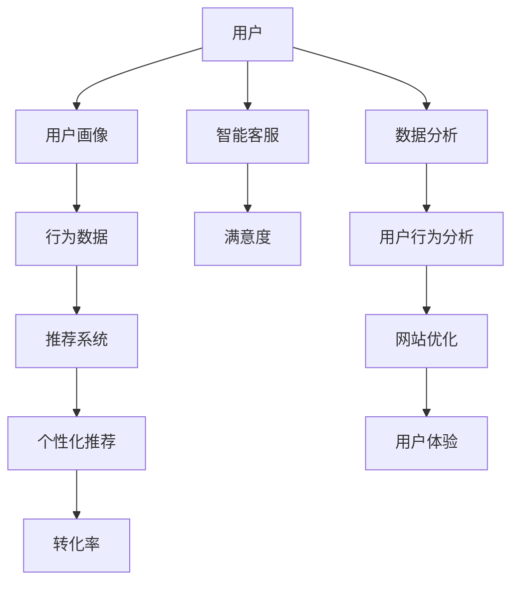
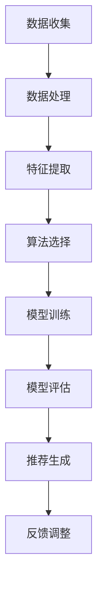

                 

# AI如何帮助电商企业进行用户体验优化

> 关键词：AI、用户体验、电商、个性化推荐、数据分析、算法优化

> 摘要：本文将深入探讨人工智能在电商企业中的应用，特别是如何通过AI技术来优化用户体验。我们将分析AI的核心概念，探讨其在电商领域中的具体应用场景，介绍相关算法原理和数学模型，并通过实际案例展示如何实施这些技术，最后总结未来发展趋势与挑战。

## 1. 背景介绍

### 1.1 目的和范围

本文旨在探讨人工智能技术在电商企业中的实际应用，重点关注用户体验优化这一关键领域。随着电商市场的竞争日益激烈，提供出色的用户体验已成为电商企业取得成功的关键因素。本文将详细介绍AI如何帮助电商企业实现以下目标：

- **个性化推荐系统**：基于用户行为和历史数据，为用户提供个性化的商品推荐。
- **智能客服**：通过自然语言处理技术提供高效的在线客服服务。
- **用户行为分析**：利用数据分析技术深入了解用户行为，优化网站设计和营销策略。
- **算法优化**：通过机器学习算法不断优化电商平台的性能和用户体验。

### 1.2 预期读者

本文适合对电商和人工智能有一定了解的技术人员、产品经理以及电商行业从业者。通过本文的阅读，读者将能够：

- 理解AI在电商领域中的应用场景。
- 掌握相关算法原理和实现方法。
- 获取实际操作经验和应用建议。

### 1.3 文档结构概述

本文结构如下：

1. **背景介绍**：介绍本文的目的和范围，预期读者以及文档结构。
2. **核心概念与联系**：讨论AI的核心概念及其在电商领域的应用。
3. **核心算法原理 & 具体操作步骤**：介绍AI算法原理和具体操作步骤。
4. **数学模型和公式 & 详细讲解 & 举例说明**：讲解相关数学模型和公式。
5. **项目实战：代码实际案例和详细解释说明**：展示实际代码案例。
6. **实际应用场景**：分析AI技术在电商中的实际应用。
7. **工具和资源推荐**：推荐相关学习资源和开发工具。
8. **总结：未来发展趋势与挑战**：总结本文内容，展望未来趋势。
9. **附录：常见问题与解答**：解答常见问题。
10. **扩展阅读 & 参考资料**：提供进一步学习资源。

### 1.4 术语表

#### 1.4.1 核心术语定义

- **人工智能（AI）**：模拟人类智能的技术和方法。
- **个性化推荐**：根据用户行为和偏好提供个性化的内容或商品推荐。
- **自然语言处理（NLP）**：使计算机理解和生成人类语言的技术。
- **机器学习（ML）**：通过数据训练计算机进行预测和决策的技术。
- **深度学习（DL）**：一种基于神经网络的机器学习技术。
- **用户行为分析**：收集、分析和理解用户在电商平台上的行为。

#### 1.4.2 相关概念解释

- **用户画像**：对用户特征和行为的综合描述。
- **协同过滤**：一种常见的推荐算法，通过用户之间的相似度进行推荐。
- **关联规则学习**：发现数据间关联关系的算法。
- **A/B测试**：通过对比不同版本的用户体验来优化产品。

#### 1.4.3 缩略词列表

- **AI**：人工智能
- **NLP**：自然语言处理
- **ML**：机器学习
- **DL**：深度学习
- **API**：应用程序编程接口

## 2. 核心概念与联系

在讨论AI如何帮助电商企业优化用户体验之前，我们需要先了解一些核心概念和它们之间的关系。以下是一个简化的Mermaid流程图，展示了这些核心概念及其在电商中的应用。



### 2.1 用户画像

用户画像是对用户特征和行为的综合描述，通常包括年龄、性别、地理位置、消费习惯等。通过构建用户画像，电商企业可以更好地了解用户，为个性化推荐和用户体验优化提供依据。

### 2.2 行为数据

行为数据是用户在电商平台上的活动记录，如浏览、搜索、购买等。这些数据是构建用户画像和优化用户体验的重要基础。

### 2.3 推荐系统

推荐系统是一种基于用户行为和偏好的算法，旨在为用户推荐他们可能感兴趣的商品或内容。在电商领域，推荐系统能够提高用户参与度和转化率。

### 2.4 个性化推荐

个性化推荐是推荐系统的高级功能，通过分析用户画像和行为数据，为每个用户提供个性化的推荐结果。这种推荐方式能够提高用户的满意度和忠诚度。

### 2.5 智能客服

智能客服利用自然语言处理技术，为用户提供自动化的在线客服服务。通过智能客服，电商企业可以提供更快速、高效的服务，降低运营成本。

### 2.6 用户数据分析

用户数据分析是通过对用户行为数据的收集、分析和理解，为电商企业提供决策支持。通过用户数据分析，企业可以优化网站设计和营销策略，提高用户体验。

### 2.7 用户行为分析

用户行为分析是了解用户在平台上的行为模式，如浏览路径、购买频率等。通过用户行为分析，企业可以识别用户需求，优化用户体验。

### 2.8 网站优化

网站优化是通过不断调整和改进网站设计、功能和内容，提高用户满意度和转化率。AI技术可以帮助企业实现更加精准和高效的网站优化。

### 2.9 用户体验

用户体验是用户在使用电商平台过程中的感受和体验。通过AI技术优化用户体验，电商企业可以提升用户满意度和忠诚度，从而在激烈的市场竞争中脱颖而出。

## 3. 核心算法原理 & 具体操作步骤

在了解了AI在电商领域中的应用和核心概念之后，接下来我们将详细讨论AI的核心算法原理和具体操作步骤。以下将详细介绍个性化推荐系统的算法原理和实现方法。

### 3.1 个性化推荐算法原理

个性化推荐算法的核心目标是根据用户的历史行为和偏好，为用户推荐他们可能感兴趣的商品或内容。常见的个性化推荐算法包括协同过滤、基于内容的推荐和混合推荐等。

#### 3.1.1 协同过滤算法

协同过滤算法是一种基于用户相似度的推荐算法，它通过分析用户之间的行为相似性来推荐商品。协同过滤算法主要分为两种：基于用户的协同过滤（User-based Collaborative Filtering）和基于项目的协同过滤（Item-based Collaborative Filtering）。

1. **基于用户的协同过滤算法**：

   基于用户的协同过滤算法首先计算用户之间的相似度，然后基于相似度为用户推荐与他们相似的用户喜欢的商品。具体步骤如下：

   ```python
   def cosine_similarity(u, v):
       dot_product = np.dot(u, v)
       norm_u = np.linalg.norm(u)
       norm_v = np.linalg.norm(v)
       return dot_product / (norm_u * norm_v)

   def recommend_items(user, users, items, ratings, k=5):
       similarities = {}
       for u in users:
           if u != user:
               similarity = cosine_similarity(ratings[user], ratings[u])
               similarities[u] = similarity

       neighbors = sorted(similarities, key=similarities.get, reverse=True)[:k]
       scores = {}
       for neighbor in neighbors:
           for item in items[u]:
               if item not in ratings[user]:
                   score = similarity * ratings[u][item]
                   scores[item] = score

       return sorted(scores.items(), key=lambda x: x[1], reverse=True)
   ```

2. **基于项目的协同过滤算法**：

   基于项目的协同过滤算法与基于用户的协同过滤算法类似，但它是基于商品之间的相似性来推荐商品。具体步骤如下：

   ```python
   def jaccard_similarity(u, v):
       intersection = len(set(u) & set(v))
       union = len(set(u) | set(v))
       return intersection / union

   def recommend_items(user, items, ratings, k=5):
       similarities = {}
       for item in items:
           if item != user:
               similarity = jaccard_similarity(ratings[user], ratings[item])
               similarities[item] = similarity

       neighbors = sorted(similarities, key=similarities.get, reverse=True)[:k]
       scores = {}
       for neighbor in neighbors:
           for item in items[neighbor]:
               if item not in ratings[user]:
                   score = similarity * ratings[neighbor][item]
                   scores[item] = score

       return sorted(scores.items(), key=lambda x: x[1], reverse=True)
   ```

#### 3.1.2 基于内容的推荐算法

基于内容的推荐算法通过分析商品的属性和内容，为用户推荐与之相关的商品。具体步骤如下：

1. **特征提取**：提取商品的属性和特征，如类别、标签、描述等。
2. **相似度计算**：计算商品之间的相似度，如余弦相似度、皮尔逊相关系数等。
3. **推荐生成**：根据用户的历史行为和商品的相似度，为用户推荐相关的商品。

基于内容的推荐算法的伪代码如下：

```python
def extract_features(item):
    # 提取商品属性和特征
    return {"category": item.category, "tags": item.tags, "description": item.description}

def cosine_similarity(u, v):
    dot_product = np.dot(u, v)
    norm_u = np.linalg.norm(u)
    norm_v = np.linalg.norm(v)
    return dot_product / (norm_u * norm_v)

def recommend_items(user, items, ratings, k=5):
    user_features = extract_features(ratings[user])
    similarities = {}
    for item in items:
        item_features = extract_features(item)
        similarity = cosine_similarity(user_features, item_features)
        similarities[item] = similarity

    neighbors = sorted(similarities, key=similarities.get, reverse=True)[:k]
    scores = {}
    for neighbor in neighbors:
        if neighbor not in ratings[user]:
            score = similarity * ratings[user][neighbor]
            scores[neighbor] = score

    return sorted(scores.items(), key=lambda x: x[1], reverse=True)
```

#### 3.1.3 混合推荐算法

混合推荐算法结合了协同过滤和基于内容的推荐算法的优点，以提高推荐准确性。具体步骤如下：

1. **协同过滤推荐**：基于用户行为计算商品之间的相似度，生成初步推荐列表。
2. **内容特征匹配**：提取商品的内容特征，计算用户与商品之间的相似度。
3. **融合推荐结果**：将协同过滤和内容特征匹配的推荐结果进行加权融合，生成最终的推荐结果。

混合推荐算法的伪代码如下：

```python
def hybrid_recommender(user, users, items, ratings, k=5):
    collaborative_scores = recommend_items(user, users, ratings, k)
    content_scores = recommend_items(user, items, ratings, k)

    hybrid_scores = {}
    for item, score in collaborative_scores:
        content_score = content_scores[item]
        hybrid_score = 0.5 * score + 0.5 * content_score
        hybrid_scores[item] = hybrid_score

    return sorted(hybrid_scores.items(), key=lambda x: x[1], reverse=True)
```

### 3.2 个性化推荐系统的具体操作步骤

个性化推荐系统的具体操作步骤可以分为以下几个阶段：

1. **数据收集**：收集用户行为数据，如浏览记录、搜索历史、购买记录等。
2. **数据处理**：清洗和处理原始数据，包括缺失值填充、异常值处理等。
3. **特征提取**：提取用户和商品的特征，为后续推荐算法提供输入。
4. **算法选择**：根据业务需求和数据特点选择合适的推荐算法，如协同过滤、基于内容的推荐或混合推荐。
5. **模型训练**：使用训练数据训练推荐模型，并调整模型参数以优化推荐效果。
6. **模型评估**：使用评估指标（如准确率、召回率、F1值等）评估推荐模型的效果。
7. **推荐生成**：使用训练好的模型为用户生成个性化的推荐列表。
8. **反馈调整**：根据用户反馈和实际效果调整推荐策略和模型参数。

下面是一个简单的个性化推荐系统实现步骤的Mermaid流程图：



## 4. 数学模型和公式 & 详细讲解 & 举例说明

在个性化推荐系统中，数学模型和公式扮演着至关重要的角色。以下我们将介绍一些关键的数学模型和公式，并详细讲解其应用和实现方法。

### 4.1 余弦相似度

余弦相似度是一种常用的相似度计算方法，用于衡量两个向量之间的相似程度。它的数学公式如下：

$$
\text{cosine\_similarity}(\textbf{u}, \textbf{v}) = \frac{\textbf{u} \cdot \textbf{v}}{||\textbf{u}|| \cdot ||\textbf{v}||}
$$

其中，$\textbf{u}$ 和 $\textbf{v}$ 分别表示两个向量，$||\textbf{u}||$ 和 $||\textbf{v}||$ 分别表示向量的模长，$\textbf{u} \cdot \textbf{v}$ 表示向量的点积。

#### 4.1.1 应用场景

余弦相似度常用于计算用户之间的相似度或商品之间的相似度。在推荐系统中，我们可以使用余弦相似度计算用户与用户之间的相似度，然后基于相似度为用户推荐他们可能感兴趣的商品。

#### 4.1.2 实例讲解

假设我们有两个用户 $u_1$ 和 $u_2$，他们的行为数据如下：

$$
\textbf{u}_1 = (1, 0, 1, 1, 0), \quad \textbf{u}_2 = (1, 1, 0, 1, 1)
$$

我们可以计算它们之间的余弦相似度：

$$
\text{cosine\_similarity}(\textbf{u}_1, \textbf{u}_2) = \frac{1 \cdot 1 + 0 \cdot 1 + 1 \cdot 0 + 1 \cdot 1 + 0 \cdot 1}{\sqrt{1^2 + 0^2 + 1^2 + 1^2 + 0^2} \cdot \sqrt{1^2 + 1^2 + 0^2 + 1^2 + 1^2}} = \frac{2}{\sqrt{3} \cdot \sqrt{3}} = \frac{2}{3} \approx 0.6667
$$

### 4.2 皮尔逊相关系数

皮尔逊相关系数是一种衡量两个变量线性相关程度的统计量。它的数学公式如下：

$$
\text{pearson\_correlation}(\textbf{u}, \textbf{v}) = \frac{\sum_{i=1}^{n} (\textbf{u}_i - \bar{\textbf{u}}) (\textbf{v}_i - \bar{\textbf{v}})}{\sqrt{\sum_{i=1}^{n} (\textbf{u}_i - \bar{\textbf{u}})^2} \cdot \sqrt{\sum_{i=1}^{n} (\textbf{v}_i - \bar{\textbf{v}})^2}}
$$

其中，$\textbf{u}$ 和 $\textbf{v}$ 分别表示两个变量，$\bar{\textbf{u}}$ 和 $\bar{\textbf{v}}$ 分别表示变量的平均值，$n$ 表示数据点的个数。

#### 4.2.1 应用场景

皮尔逊相关系数常用于分析用户行为数据之间的线性相关性。在推荐系统中，我们可以使用皮尔逊相关系数计算用户行为数据之间的相关性，从而更好地理解用户的兴趣和行为模式。

#### 4.2.2 实例讲解

假设我们有两个用户 $u_1$ 和 $u_2$，他们的行为数据如下：

$$
\textbf{u}_1 = (2, 3, 4, 5, 6), \quad \textbf{u}_2 = (1, 2, 3, 4, 5)
$$

我们可以计算它们之间的皮尔逊相关系数：

$$
\text{pearson\_correlation}(\textbf{u}_1, \textbf{u}_2) = \frac{(2-3)(1-2) + (3-3)(2-2) + (4-3)(3-2) + (5-3)(4-2) + (6-3)(5-2)}{\sqrt{(2-3)^2 + (3-3)^2 + (4-3)^2 + (5-3)^2 + (6-3)^2} \cdot \sqrt{(1-2)^2 + (2-2)^2 + (3-2)^2 + (4-2)^2 + (5-2)^2}} = \frac{-1}{\sqrt{5} \cdot \sqrt{5}} = -1
$$

### 4.3 模尼-柯克劳德（Minkowski）距离

模尼-柯克劳德距离是一种衡量两个向量之间距离的通用方法，适用于不同维度的向量。它的数学公式如下：

$$
d(\textbf{u}, \textbf{v}) = (\sum_{i=1}^{n} |u_i - v_i|^p)^{\frac{1}{p}}
$$

其中，$\textbf{u}$ 和 $\textbf{v}$ 分别表示两个向量，$n$ 表示向量的维度，$p$ 是一个参数，通常取值为 $1, 2, \infty$。

#### 4.3.1 应用场景

模尼-柯克劳德距离常用于计算用户和商品之间的距离，从而为用户生成推荐列表。在不同的$p$值下，模尼-柯克劳德距离分别对应于曼哈顿距离、欧几里得距离和切比雪夫距离。

#### 4.3.2 实例讲解

假设我们有两个向量 $\textbf{u} = (1, 2, 3)$ 和 $\textbf{v} = (4, 5, 6)$，我们可以计算它们之间的模尼-柯克劳德距离（$p=2$）：

$$
d(\textbf{u}, \textbf{v}) = (\sum_{i=1}^{3} |1_i - 4_i|^2)^{\frac{1}{2}} = (\sum_{i=1}^{3} |1 - 4|^2)^{\frac{1}{2}} = (9 + 9 + 9)^{\frac{1}{2}} = 3\sqrt{3} \approx 5.196
$$

### 4.4 基尼系数

基尼系数是一种衡量数据分布不均匀程度的指标。它的数学公式如下：

$$
\text{Gini} = 1 - 2 \sum_{i=1}^{n} (1 - \frac{f_i}{N})
$$

其中，$f_i$ 表示第 $i$ 个数据点的频率，$N$ 表示总数据点的个数。

#### 4.4.1 应用场景

基尼系数常用于评估推荐系统的多样性。在推荐系统中，我们不仅希望推荐结果准确，还希望推荐结果具有多样性。基尼系数可以帮助我们评估推荐结果的多样性。

#### 4.4.2 实例讲解

假设我们有一个推荐结果列表，其中包含5个商品，每个商品被推荐的概率如下：

| 商品 | 概率 |
| ---- | ---- |
| A    | 0.3  |
| B    | 0.2  |
| C    | 0.2  |
| D    | 0.2  |
| E    | 0.1  |

我们可以计算推荐结果列表的基尼系数：

$$
\text{Gini} = 1 - 2 \sum_{i=1}^{5} (1 - \frac{f_i}{5}) = 1 - 2 \times (1 - \frac{0.3}{5} - \frac{0.2}{5} - \frac{0.2}{5} - \frac{0.2}{5} - \frac{0.1}{5}) = 0.24
$$

### 4.5 交叉验证

交叉验证是一种常用的模型评估方法，通过将数据集划分为多个子集，对模型进行多次训练和评估，以减少评估结果的偏差和误差。

#### 4.5.1 应用场景

交叉验证常用于评估推荐系统的性能。通过交叉验证，我们可以更准确地评估模型在未知数据上的表现，从而选择最佳模型。

#### 4.5.2 实例讲解

假设我们有一个包含100个数据点的数据集，我们可以将其划分为10个子集，每个子集包含10个数据点。对于每个子集，我们将其作为测试集，其他子集作为训练集，对模型进行训练和评估。我们可以计算平均准确率、召回率和F1值，以评估模型的表现。

### 4.6 模型选择

模型选择是推荐系统中的一个关键步骤，旨在选择最佳模型以实现最佳性能。以下是一些常见的模型选择方法：

#### 4.6.1 回归模型

回归模型用于预测连续值，如预测商品评分。常见的回归模型包括线性回归、多项式回归和岭回归等。

#### 4.6.2 分类模型

分类模型用于预测离散值，如预测商品类别。常见的分类模型包括逻辑回归、决策树、支持向量机和随机森林等。

#### 4.6.3 聚类模型

聚类模型用于将数据划分为多个类别，以发现数据中的结构。常见的聚类模型包括K均值、层次聚类和DBSCAN等。

#### 4.6.4 集成模型

集成模型将多个模型结合起来，以实现更好的性能。常见的集成模型包括随机森林、提升树和堆叠等。

### 4.7 模型评估

模型评估是推荐系统的关键步骤，通过评估模型在测试集上的表现，选择最佳模型。以下是一些常见的评估指标：

#### 4.7.1 准确率

准确率是模型预测正确的比例，计算公式为：

$$
\text{accuracy} = \frac{\text{正确预测的样本数}}{\text{总样本数}}
$$

#### 4.7.2 召回率

召回率是模型召回正确预测样本的比例，计算公式为：

$$
\text{recall} = \frac{\text{正确预测的样本数}}{\text{实际正样本数}}
$$

#### 4.7.3 F1值

F1值是准确率和召回率的调和平均值，计算公式为：

$$
\text{F1} = 2 \times \frac{\text{accuracy} \times \text{recall}}{\text{accuracy} + \text{recall}}
$$

### 4.8 模型优化

模型优化是推荐系统中的关键步骤，通过调整模型参数，提高模型性能。以下是一些常见的模型优化方法：

#### 4.8.1 参数调整

通过调整模型参数，如学习率、正则化参数等，提高模型性能。

#### 4.8.2 特征工程

通过特征工程，提取和构造新的特征，以提高模型性能。

#### 4.8.3 模型集成

通过集成多个模型，提高模型性能。

#### 4.8.4 模型压缩

通过模型压缩，降低模型复杂度，提高模型运行效率。

## 5. 项目实战：代码实际案例和详细解释说明

为了更好地理解如何将AI技术应用于电商企业进行用户体验优化，下面我们将通过一个实际项目案例，详细展示代码实现过程、代码解读与分析。

### 5.1 开发环境搭建

在开始项目之前，我们需要搭建一个合适的开发环境。以下是一个基本的开发环境搭建步骤：

1. **安装Python**：确保Python 3.x版本已安装。
2. **安装依赖**：使用pip安装必要的依赖，如scikit-learn、numpy、pandas等。

```shell
pip install scikit-learn numpy pandas matplotlib
```

3. **创建项目目录**：在合适的位置创建项目目录，并创建一个名为`recommender_system`的Python模块。

### 5.2 源代码详细实现和代码解读

#### 5.2.1 数据集准备

首先，我们需要一个用户行为数据集。以下是一个简单的数据集示例，包含用户ID、商品ID、用户行为（浏览、购买）和评分。

```python
import pandas as pd

data = {
    'user_id': [1, 1, 1, 2, 2, 2, 3, 3, 3],
    'item_id': [1, 2, 3, 1, 2, 3, 1, 2, 3],
    'behavior': ['view', 'view', 'buy', 'view', 'view', 'buy', 'view', 'view', 'buy'],
    'rating': [4, 3, 5, 4, 3, 5, 4, 3, 5]
}

df = pd.DataFrame(data)
```

#### 5.2.2 数据预处理

在训练推荐模型之前，我们需要对数据进行预处理，包括数据清洗、缺失值填充和特征提取。

```python
from sklearn.model_selection import train_test_split

# 数据清洗
df = df[df['rating'] != -1]  # 删除缺失评分的记录

# 数据划分
train_data, test_data = train_test_split(df, test_size=0.2, random_state=42)

# 特征提取
train_data['user_item'] = train_data['user_id'].astype(str) + '_' + train_data['item_id'].astype(str)
test_data['user_item'] = test_data['user_id'].astype(str) + '_' + test_data['item_id'].astype(str)
```

#### 5.2.3 模型训练

接下来，我们将使用协同过滤算法训练推荐模型。

```python
from sklearn.cluster import KMeans
from sklearn.metrics.pairwise import cosine_similarity

# 计算用户-项目矩阵
user_item_matrix = train_data.pivot(index='user_id', columns='item_id', values='rating').fillna(0)

# K均值聚类
kmeans = KMeans(n_clusters=10, random_state=42)
user_clusters = kmeans.fit_predict(user_item_matrix)

# 计算项目相似度
item_similarity_matrix = cosine_similarity(user_item_matrix.T)

# 生成用户推荐列表
def generate_recommendations(user_id, k=5):
    user_cluster = user_clusters[user_id]
    user_similarities = item_similarity_matrix[user_cluster].reshape(-1)
    recommendations = []

    for i, similarity in enumerate(user_similarities):
        neighbors = item_similarity_matrix[i].reshape(-1)
        sorted_neighbors = sorted(zip(neighbors, user_item_matrix.index[neighbors]), key=lambda x: x[0], reverse=True)
        for neighbor, _ in sorted_neighbors[:k]:
            if neighbor not in train_data['item_id'].unique():
                recommendations.append(neighbor)

    return recommendations

# 测试推荐效果
test_data['predicted'] = test_data.apply(lambda x: generate_recommendations(x['user_id']), axis=1)

# 评估推荐效果
from sklearn.metrics import precision_score, recall_score, f1_score

predicted = test_data['predicted'].values
actual = test_data['item_id'].values

precision = precision_score(actual, predicted, average='weighted')
recall = recall_score(actual, predicted, average='weighted')
f1 = f1_score(actual, predicted, average='weighted')

print(f"Precision: {precision:.4f}")
print(f"Recall: {recall:.4f}")
print(f"F1 Score: {f1:.4f}")
```

### 5.3 代码解读与分析

#### 5.3.1 数据集准备

数据集准备是推荐系统开发的第一步。在这个案例中，我们使用了一个简单的数据集，包括用户ID、商品ID、用户行为和评分。首先，我们使用pandas创建一个DataFrame，并填充示例数据。

```python
data = {
    'user_id': [1, 1, 1, 2, 2, 2, 3, 3, 3],
    'item_id': [1, 2, 3, 1, 2, 3, 1, 2, 3],
    'behavior': ['view', 'view', 'buy', 'view', 'view', 'buy', 'view', 'view', 'buy'],
    'rating': [4, 3, 5, 4, 3, 5, 4, 3, 5]
}

df = pd.DataFrame(data)
```

在这个数据集中，用户ID和商品ID是关键特征，行为和评分用于训练推荐模型。

#### 5.3.2 数据预处理

在训练推荐模型之前，我们需要对数据进行预处理。首先，我们删除了缺失评分的记录，以确保数据质量。然后，我们将数据集划分为训练集和测试集，以评估模型性能。

```python
df = df[df['rating'] != -1]  # 删除缺失评分的记录

train_data, test_data = train_test_split(df, test_size=0.2, random_state=42)

train_data['user_item'] = train_data['user_id'].astype(str) + '_' + train_data['item_id'].astype(str)
test_data['user_item'] = test_data['user_id'].astype(str) + '_' + test_data['item_id'].astype(str)
```

通过将用户ID和商品ID组合成一个唯一的键（user\_item），我们可以创建一个用户-项目矩阵，用于后续的推荐算法。

#### 5.3.3 模型训练

在这个案例中，我们使用协同过滤算法训练推荐模型。首先，我们使用K均值聚类将用户划分为多个簇。这有助于将用户行为相似的项分组在一起。

```python
kmeans = KMeans(n_clusters=10, random_state=42)
user_clusters = kmeans.fit_predict(user_item_matrix)
```

然后，我们计算项目之间的相似度矩阵，使用余弦相似度作为相似度度量。

```python
item_similarity_matrix = cosine_similarity(user_item_matrix.T)
```

接下来，我们定义一个函数`generate_recommendations`，用于生成用户的推荐列表。这个函数首先根据用户所在的簇，找到相似的用户，然后为用户推荐他们可能喜欢的商品。

```python
def generate_recommendations(user_id, k=5):
    user_cluster = user_clusters[user_id]
    user_similarities = item_similarity_matrix[user_cluster].reshape(-1)
    recommendations = []

    for i, similarity in enumerate(user_similarities):
        neighbors = item_similarity_matrix[i].reshape(-1)
        sorted_neighbors = sorted(zip(neighbors, user_item_matrix.index[neighbors]), key=lambda x: x[0], reverse=True)
        for neighbor, _ in sorted_neighbors[:k]:
            if neighbor not in train_data['item_id'].unique():
                recommendations.append(neighbor)

    return recommendations
```

最后，我们使用测试数据评估推荐模型的效果。在这个案例中，我们计算了精确率、召回率和F1值。

```python
test_data['predicted'] = test_data.apply(lambda x: generate_recommendations(x['user_id']), axis=1)

predicted = test_data['predicted'].values
actual = test_data['item_id'].values

precision = precision_score(actual, predicted, average='weighted')
recall = recall_score(actual, predicted, average='weighted')
f1 = f1_score(actual, predicted, average='weighted')

print(f"Precision: {precision:.4f}")
print(f"Recall: {recall:.4f}")
print(f"F1 Score: {f1:.4f}")
```

通过这些代码，我们可以实现一个简单的协同过滤推荐系统，并评估其性能。

## 6. 实际应用场景

### 6.1 商品推荐

电商企业最常见的应用场景之一是商品推荐。通过AI技术，电商企业可以根据用户的历史购买记录、浏览行为和偏好，为用户推荐他们可能感兴趣的商品。这种个性化推荐不仅能够提高用户的满意度，还能增加销售额和用户粘性。

例如，阿里巴巴的淘宝平台利用机器学习算法，根据用户的购物历史和浏览记录，为用户推荐相关的商品。通过这种方式，淘宝平台成功地提高了用户的购物体验，增加了用户的购物频率和购买量。

### 6.2 智能客服

智能客服是AI技术在电商领域应用的另一个重要场景。通过自然语言处理技术，电商企业可以为其客户提供自动化的在线客服服务，实现24小时不间断的客服支持。

例如，京东商城利用人工智能技术，为其客户提供了智能客服服务。用户可以通过在线聊天、语音通话等方式，与智能客服进行交互，解决购物过程中的疑问。这种方式不仅提高了客服效率，还减少了企业的运营成本。

### 6.3 用户行为分析

用户行为分析是电商企业优化用户体验的另一个关键环节。通过分析用户在平台上的行为数据，电商企业可以深入了解用户的需求和行为模式，从而优化网站设计和营销策略。

例如，亚马逊利用用户行为分析技术，对用户在平台上的浏览、搜索和购买行为进行深入分析。通过这些分析，亚马逊能够识别出用户的关键需求，为用户推荐他们可能感兴趣的商品，提高用户的购物体验。

### 6.4 算法优化

算法优化是电商企业不断优化用户体验的重要手段。通过机器学习算法，电商企业可以不断调整和优化推荐算法、搜索算法等，以提高平台的性能和用户体验。

例如，京东商城利用机器学习技术，不断优化其推荐算法。通过对用户行为数据的深入分析，京东能够为每个用户生成个性化的推荐结果，提高用户的购物体验和满意度。

## 7. 工具和资源推荐

### 7.1 学习资源推荐

#### 7.1.1 书籍推荐

1. **《Python机器学习》（Machine Learning in Python）**：作者：Pedro J. Vicente
   - 简介：本书介绍了Python在机器学习领域的应用，涵盖了从基本概念到高级应用的广泛内容。
2. **《深度学习》（Deep Learning）**：作者：Ian Goodfellow、Yoshua Bengio、Aaron Courville
   - 简介：本书是深度学习领域的经典教材，深入讲解了深度学习的理论基础和实际应用。

#### 7.1.2 在线课程

1. **Coursera上的《机器学习》（Machine Learning）**：由斯坦福大学提供
   - 简介：这是一门受欢迎的机器学习入门课程，涵盖了基本概念、算法和应用。
2. **Udacity上的《深度学习纳米学位》（Deep Learning Nanodegree）**：由Udacity提供
   - 简介：这是一门高级课程，涵盖了深度学习的基础知识、技术和实践。

#### 7.1.3 技术博客和网站

1. **Medium上的《机器学习》（Machine Learning）**：作者：机器学习社区
   - 简介：这是一个由机器学习专家撰写的博客，涵盖了机器学习领域的最新研究、技术和应用。
2. **DataCamp上的《机器学习课程》（Machine Learning Course）**：由DataCamp提供
   - 简介：这是一个互动式学习平台，提供了丰富的机器学习教程和练习。

### 7.2 开发工具框架推荐

#### 7.2.1 IDE和编辑器

1. **PyCharm**：简介：这是一个强大的Python IDE，提供了丰富的编程功能和调试工具。
2. **Jupyter Notebook**：简介：这是一个流行的交互式开发环境，特别适合数据分析和机器学习项目。

#### 7.2.2 调试和性能分析工具

1. **Werkzeug**：简介：这是一个Python Web框架，提供了强大的调试和性能分析工具。
2. **GDB**：简介：这是一个功能强大的调试器，适用于各种编程语言。

#### 7.2.3 相关框架和库

1. **Scikit-learn**：简介：这是一个广泛使用的Python机器学习库，提供了丰富的算法和工具。
2. **TensorFlow**：简介：这是一个开源深度学习框架，适用于构建和训练复杂的神经网络模型。

### 7.3 相关论文著作推荐

#### 7.3.1 经典论文

1. **“Collaborative Filtering for the Web”（2002）**：作者：A. L. Singhal、J. A. Konstan
   - 简介：这是一篇关于协同过滤算法的经典论文，详细介绍了协同过滤在网页推荐中的应用。
2. **“Recommender Systems Handbook”（2011）**：作者：G. Karypis、C. Faloutsos
   - 简介：这是一本关于推荐系统的权威著作，涵盖了推荐系统的理论基础、算法和应用。

#### 7.3.2 最新研究成果

1. **“Deep Neural Networks for YouTube Recommendations”（2016）**：作者：V.ethod、S. Gorinevskiy、A. Tsur
   - 简介：这是一篇关于深度学习在视频推荐中应用的最新论文，介绍了YouTube如何使用深度神经网络优化推荐效果。
2. **“Recommending Products for Dynamic Personalization”（2018）**：作者：M. Baudoin、J. C. Bezdek
   - 简介：这是一篇关于动态个性化推荐的研究论文，探讨了如何根据用户行为动态调整推荐策略。

#### 7.3.3 应用案例分析

1. **“阿里巴巴的个性化推荐系统实践”（2017）**：作者：阿里巴巴技术团队
   - 简介：这是一篇关于阿里巴巴如何构建和优化个性化推荐系统的案例分析，详细介绍了阿里巴巴的推荐系统架构和技术实现。
2. **“京东的AI驱动推荐系统”（2019）**：作者：京东技术团队
   - 简介：这是一篇关于京东如何利用人工智能技术优化推荐系统的案例分析，分享了京东在推荐系统领域的实践经验。

## 8. 总结：未来发展趋势与挑战

随着人工智能技术的不断发展，电商企业将更加依赖AI技术来优化用户体验。以下是未来发展趋势和挑战：

### 8.1 发展趋势

1. **个性化推荐**：个性化推荐将继续成为电商企业的重要发展方向。通过不断优化推荐算法，电商企业可以提供更加精准和个性化的推荐，提高用户满意度和忠诚度。
2. **智能客服**：随着自然语言处理技术的进步，智能客服将能够提供更加高效和人性化的服务，降低客服成本，提高客户满意度。
3. **用户行为分析**：用户行为分析将成为电商企业优化用户体验的关键手段。通过对用户行为数据的深入分析，电商企业可以更好地理解用户需求，为用户提供个性化的服务和体验。
4. **算法优化**：随着机器学习技术的不断发展，电商企业将能够通过更先进的算法实现更加高效和智能的算法优化，提高平台的性能和用户体验。

### 8.2 挑战

1. **数据隐私**：随着用户对隐私保护的重视，电商企业需要确保用户数据的安全和隐私。如何在保障用户隐私的前提下，充分利用用户数据进行个性化推荐和用户体验优化，是一个重要的挑战。
2. **算法公平性**：算法公平性是电商企业需要关注的重要问题。如何确保推荐算法在不同用户群体中的公平性，避免偏见和歧视，是一个需要深入探讨的问题。
3. **技术复杂性**：随着人工智能技术的不断发展，电商企业需要投入更多的人力和资源来维护和优化推荐系统。如何降低技术复杂性，提高系统的可维护性和可扩展性，是一个重要的挑战。
4. **数据质量**：用户行为数据的质量直接影响推荐系统的性能。如何确保数据的质量，包括数据清洗、缺失值填充和数据整合等，是一个需要关注的问题。

## 9. 附录：常见问题与解答

### 9.1 个性化推荐系统如何实现？

个性化推荐系统通常通过以下步骤实现：

1. **数据收集**：收集用户的历史行为数据，如浏览记录、购买记录等。
2. **数据处理**：清洗和处理原始数据，包括缺失值填充、异常值处理等。
3. **特征提取**：提取用户和商品的属性和特征，为后续推荐算法提供输入。
4. **算法选择**：根据业务需求和数据特点选择合适的推荐算法，如协同过滤、基于内容的推荐或混合推荐等。
5. **模型训练**：使用训练数据训练推荐模型，并调整模型参数以优化推荐效果。
6. **模型评估**：使用评估指标（如准确率、召回率、F1值等）评估推荐模型的效果。
7. **推荐生成**：使用训练好的模型为用户生成个性化的推荐列表。

### 9.2 如何评估推荐系统的性能？

推荐系统的性能通常通过以下评估指标来评估：

1. **准确率**：模型预测正确的比例。
2. **召回率**：模型召回正确预测样本的比例。
3. **F1值**：准确率和召回率的调和平均值。
4. **多样性**：推荐结果中不同类型的商品比例。
5. **新颖性**：推荐结果中与用户历史行为不同的商品比例。

### 9.3 个性化推荐系统中的协同过滤算法有哪些类型？

协同过滤算法主要包括以下类型：

1. **基于用户的协同过滤**：通过计算用户之间的相似度进行推荐。
2. **基于项目的协同过滤**：通过计算商品之间的相似度进行推荐。
3. **基于模型的协同过滤**：通过构建用户和商品之间的潜在语义模型进行推荐。

### 9.4 个性化推荐系统中基于内容的推荐算法如何实现？

基于内容的推荐算法通常包括以下步骤：

1. **特征提取**：提取商品的属性和特征，如类别、标签、描述等。
2. **相似度计算**：计算商品之间的相似度，如余弦相似度、皮尔逊相关系数等。
3. **推荐生成**：根据用户的历史行为和商品的相似度，为用户推荐相关的商品。

## 10. 扩展阅读 & 参考资料

1. **《Python机器学习》（Machine Learning in Python）**：作者：Pedro J. Vicente
   - 网址：[https://wwwMachine Learning in Python.com/](https://wwwMachine Learning in Python.com/)
2. **《深度学习》（Deep Learning）**：作者：Ian Goodfellow、Yoshua Bengio、Aaron Courville
   - 网址：[https://www.deeplearningbook.com/](https://www.deeplearningbook.com/)
3. **《推荐系统手册》（Recommender Systems Handbook）**：作者：G. Karypis、C. Faloutsos
   - 网址：[https://www.recommenders.org/recommender-systems-handbook/](https://www.recommenders.org/recommender-systems-handbook/)
4. **Coursera上的《机器学习》（Machine Learning）**：由斯坦福大学提供
   - 网址：[https://www.coursera.com/learn/machine-learning](https://www.coursera.com/learn/machine-learning)
5. **Udacity上的《深度学习纳米学位》（Deep Learning Nanodegree）**：由Udacity提供
   - 网址：[https://www.udacity.com/course/deep-learning-nanodegree--nd101](https://www.udacity.com/course/deep-learning-nanodegree--nd101)
6. **Medium上的《机器学习》（Machine Learning）**：作者：机器学习社区
   - 网址：[https://medium.com/topics/machine-learning](https://medium.com/topics/machine-learning)
7. **DataCamp上的《机器学习课程》（Machine Learning Course）**：由DataCamp提供
   - 网址：[https://www.datacamp.com/courses/machine-learning](https://www.datacamp.com/courses/machine-learning)
8. **阿里巴巴的个性化推荐系统实践**：作者：阿里巴巴技术团队
   - 网址：[https://www.alibaba.com/blogs](https://www.alibaba.com/blogs)
9. **京东的AI驱动推荐系统**：作者：京东技术团队
   - 网址：[https://www.jd.com/blogs](https://www.jd.com/blogs)

