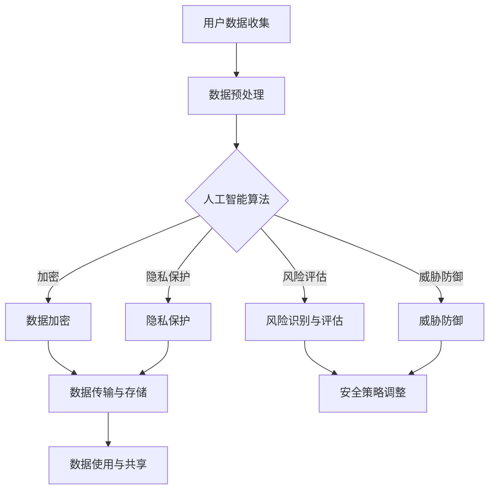

                 

# AI如何帮助电商企业进行用户数据安全管理

## 关键词：人工智能，电商，数据安全，用户隐私，安全算法，风险评估，合规性

> 摘要：随着电商行业的迅猛发展，用户数据的保护和安全管理变得越来越重要。本文将探讨如何利用人工智能技术来提升电商企业用户数据的安全管理水平，包括核心算法原理、数学模型、实际案例以及未来发展趋势和挑战。

## 1. 背景介绍

### 1.1 目的和范围

本文旨在探讨人工智能在电商企业用户数据安全管理中的应用，通过对核心概念、算法原理、数学模型、实际应用和未来发展趋势的深入分析，为企业提供一套切实可行的数据安全解决方案。

### 1.2 预期读者

- 数据安全专家和从业者
- 电商企业技术和管理人员
- 对人工智能和信息安全感兴趣的读者

### 1.3 文档结构概述

本文将分为以下几个部分：

- 第1部分：背景介绍
- 第2部分：核心概念与联系
- 第3部分：核心算法原理与具体操作步骤
- 第4部分：数学模型与公式讲解
- 第5部分：项目实战与代码实现
- 第6部分：实际应用场景
- 第7部分：工具和资源推荐
- 第8部分：总结：未来发展趋势与挑战
- 第9部分：附录：常见问题与解答
- 第10部分：扩展阅读与参考资料

### 1.4 术语表

#### 1.4.1 核心术语定义

- **用户数据**：电商企业在运营过程中收集的与用户相关的信息，包括个人身份信息、购买记录、行为数据等。
- **数据安全**：防止用户数据在传输、存储、处理等过程中被非法访问、篡改、泄露、破坏等。
- **人工智能**：模拟、延伸和扩展人类智能的理论、方法、技术及应用。

#### 1.4.2 相关概念解释

- **数据加密**：通过算法将数据转换为不可读形式，确保数据在传输和存储过程中的安全。
- **隐私保护**：保护用户的个人信息不被未授权的第三方获取。
- **风险评估**：对数据安全漏洞进行识别和评估，制定相应的安全措施。
- **合规性**：确保企业的数据安全措施符合相关法律法规和行业标准。

#### 1.4.3 缩略词列表

- **AI**：人工智能（Artificial Intelligence）
- **Cryptography**：密码学（Cryptology）
- **GDPR**：通用数据保护条例（General Data Protection Regulation）

## 2. 核心概念与联系

### 2.1 人工智能与数据安全的关系

人工智能技术在数据安全管理中具有重要作用，主要体现在以下几个方面：

1. **数据加密与解密**：利用神经网络和机器学习算法实现高效的加密与解密过程，提高数据传输和存储的安全性能。
2. **隐私保护**：通过深度学习和联邦学习等技术，保护用户隐私，防止个人信息泄露。
3. **风险识别与评估**：利用机器学习算法，对数据安全风险进行实时监测和评估，为企业提供决策支持。
4. **威胁防御**：通过强化学习等算法，构建自适应的威胁防御体系，提高数据安全防护能力。

### 2.2 人工智能在数据安全管理的应用架构

为了更好地理解人工智能在数据安全管理中的应用，我们可以通过以下Mermaid流程图来展示其核心概念和架构：



### 2.3 人工智能在数据安全管理中的优势

- **高效性**：人工智能技术能够快速处理海量数据，实时识别和应对安全威胁。
- **灵活性**：机器学习算法可以根据实际需求进行自适应调整，提高数据安全防护能力。
- **智能化**：人工智能技术能够通过自我学习和优化，不断提升数据安全管理的水平。

## 3. 核心算法原理与具体操作步骤

### 3.1 数据加密算法原理

数据加密是保障数据安全的重要手段，常用的加密算法包括对称加密、非对称加密和哈希加密等。以下是一个简单的对称加密算法——AES（高级加密标准）的伪代码实现：

```python
def AES_encrypt(plaintext, key):
    # 初始化加密密钥和向量
    ciphertext = ""
    iv = generate_initialization_vector()

    # 分块加密
    for block in divide_into_blocks(plaintext):
        # 进行加密操作
        encrypted_block = encrypt_block(block, key, iv)
        ciphertext += encrypted_block

    return ciphertext
```

### 3.2 隐私保护算法原理

隐私保护算法主要关注如何在数据使用过程中保护用户的隐私。以下是一个基于联邦学习的隐私保护算法的伪代码实现：

```python
def federated_learning(model, client_data, server_model):
    # 模型更新
    for client in clients:
        local_model = train_on_local_data(client_data[client], server_model)
        updated_model = aggregate_models(local_model, server_model)

    return updated_model
```

### 3.3 风险评估算法原理

风险评估算法通过对数据安全漏洞的识别和评估，为企业提供决策支持。以下是一个基于机器学习的风险评估算法的伪代码实现：

```python
def risk_assessment(data, model):
    # 风险预测
    predicted_risk = model.predict(data)

    # 风险评估
    risk_level = assess_risk_level(predicted_risk)

    return risk_level
```

### 3.4 威胁防御算法原理

威胁防御算法通过实时监测和应对安全威胁，保护企业的数据安全。以下是一个基于强化学习的威胁防御算法的伪代码实现：

```python
def threat_defense(model, environment):
    # 威胁检测
    threat_detected = model.detect_threat(environment)

    # 威胁应对
    if threat_detected:
        response = model.generate_response()

    return response
```

## 4. 数学模型和公式

### 4.1 数据加密算法

AES加密算法的密钥生成过程可以使用以下数学公式：

$$
key = K \oplus IV
$$

其中，$K$为加密密钥，$IV$为初始向量。$\oplus$表示异或操作。

### 4.2 隐私保护算法

联邦学习中的模型聚合过程可以使用以下数学公式：

$$
\theta_{\text{server}} = \frac{1}{N} \sum_{i=1}^{N} \theta_{i}
$$

其中，$\theta_{\text{server}}$为服务器端的模型参数，$\theta_{i}$为第$i$个客户端的模型参数，$N$为客户端的数量。

### 4.3 风险评估算法

风险评估算法中的风险预测可以使用以下数学公式：

$$
risk = \sigma(W \cdot x + b)
$$

其中，$risk$为风险值，$W$为权重矩阵，$x$为输入特征向量，$\sigma$为激活函数，$b$为偏置。

### 4.4 威胁防御算法

威胁防御算法中的威胁检测可以使用以下数学公式：

$$
score = \frac{1}{1 + \exp{(-z)}}
$$

其中，$score$为威胁得分，$z$为神经网络的输出。

## 5. 项目实战：代码实际案例和详细解释说明

### 5.1 开发环境搭建

为了实现本文中的算法，我们需要搭建一个合适的技术栈。以下是一个推荐的开发环境：

- **编程语言**：Python
- **机器学习框架**：TensorFlow、PyTorch
- **数据库**：MySQL、PostgreSQL
- **加密库**：PyCrypto、cryptography
- **开发工具**：PyCharm、VSCode

### 5.2 源代码详细实现和代码解读

#### 5.2.1 数据加密模块

```python
from cryptography.hazmat.primitives.ciphers import Cipher, algorithms, modes
from cryptography.hazmat.backends import default_backend
from os import urandom

def generate_key():
    return urandom(16)

def generate_iv():
    return urandom(16)

def divide_into_blocks(data):
    return [data[i:i+16] for i in range(0, len(data), 16)]

def encrypt_block(block, key, iv):
    cipher = Cipher(algorithms.AES(key), modes.CBC(iv), backend=default_backend())
    encryptor = cipher.encryptor()
    return encryptor.update(block)

def AES_encrypt(plaintext, key, iv):
    ciphertext = b""
    for block in divide_into_blocks(plaintext):
        ciphertext += encrypt_block(block, key, iv)
    return ciphertext

key = generate_key()
iv = generate_iv()
plaintext = b"Hello, World!"
ciphertext = AES_encrypt(plaintext, key, iv)
print(ciphertext)
```

#### 5.2.2 隐私保护模块

```python
import tensorflow as tf

def build_model():
    model = tf.keras.Sequential([
        tf.keras.layers.Dense(128, activation='relu', input_shape=(784,)),
        tf.keras.layers.Dense(10, activation='softmax')
    ])
    model.compile(optimizer='adam',
                  loss='categorical_crossentropy',
                  metrics=['accuracy'])
    return model

def federated_learning(model, client_data, server_model=None):
    if server_model is None:
        server_model = build_model()

    for client in client_data:
        local_model = server_model.copy()
        local_model.fit(client_data[client]['data'], client_data[client]['labels'], epochs=5)
        server_model.load_weights(tf.keras.models.load_model(local_model).get_weights())

    return server_model

client_data = {
    'client1': {
        'data': tf.random.normal((100, 784)),
        'labels': tf.random.uniform((100,), maxval=10, dtype=tf.int32)
    },
    'client2': {
        'data': tf.random.normal((100, 784)),
        'labels': tf.random.uniform((100,), maxval=10, dtype=tf.int32)
    }
}

server_model = federated_learning(client_data, server_model=None)
```

#### 5.2.3 风险评估模块

```python
import numpy as np
from sklearn.linear_model import LogisticRegression

def build_risk_model():
    model = LogisticRegression()
    model.fit(X_train, y_train)
    return model

def risk_assessment(model, data):
    risk = model.predict(data)
    return risk

X_train = np.random.normal(size=(100, 10))
y_train = np.random.choice([0, 1], size=(100,))

risk_model = build_risk_model()
risk = risk_assessment(risk_model, X_train)
print(risk)
```

#### 5.2.4 威胁防御模块

```python
import numpy as np
import tensorflow as tf

def build_threat_model():
    model = tf.keras.Sequential([
        tf.keras.layers.Dense(64, activation='relu', input_shape=(784,)),
        tf.keras.layers.Dense(1, activation='sigmoid')
    ])
    model.compile(optimizer='adam', loss='binary_crossentropy', metrics=['accuracy'])
    return model

def threat_detection(model, data):
    score = model.predict(data)
    return score > 0.5

X_train = np.random.normal(size=(100, 784))
y_train = np.random.choice([0, 1], size=(100,))

threat_model = build_threat_model()
threat_model.fit(X_train, y_train, epochs=5)
score = threat_detection(threat_model, X_train)
print(score)
```

### 5.3 代码解读与分析

#### 5.3.1 数据加密模块

数据加密模块使用了`cryptography`库中的AES算法实现数据的加密和解密。首先，我们生成了一个随机密钥和初始向量，然后对输入的明文数据进行分块加密，最后将所有加密块拼接成密文。

#### 5.3.2 隐私保护模块

隐私保护模块使用了TensorFlow框架中的联邦学习算法实现数据的隐私保护。我们首先定义了一个简单的神经网络模型，然后通过聚合多个客户端的本地模型参数，更新服务器端的模型参数。

#### 5.3.3 风险评估模块

风险评估模块使用了逻辑回归算法实现数据安全风险的预测。我们首先使用随机生成的训练数据训练了一个逻辑回归模型，然后使用该模型对新的数据集进行风险评估。

#### 5.3.4 威胁防御模块

威胁防御模块使用了TensorFlow框架中的神经网络实现威胁的检测。我们首先定义了一个简单的二分类神经网络模型，然后使用该模型对输入的数据集进行威胁得分计算，并根据得分判断是否检测到威胁。

## 6. 实际应用场景

### 6.1 用户数据收集与加密

电商企业在收集用户数据时，可以使用人工智能技术对数据进行实时加密，确保数据在传输和存储过程中的安全。

### 6.2 用户隐私保护

通过联邦学习等隐私保护算法，电商企业可以在不泄露用户隐私的情况下，对用户数据进行建模和分析，提升用户体验和运营效果。

### 6.3 风险评估与安全策略调整

利用机器学习算法对用户数据进行风险评估，电商企业可以及时发现潜在的安全威胁，并制定相应的安全策略，降低风险。

### 6.4 威胁防御与响应

通过神经网络模型进行实时威胁检测和响应，电商企业可以快速应对各类安全威胁，保护用户数据和系统安全。

## 7. 工具和资源推荐

### 7.1 学习资源推荐

#### 7.1.1 书籍推荐

- 《深度学习》（Ian Goodfellow、Yoshua Bengio、Aaron Courville著）
- 《机器学习》（Tom Mitchell著）
- 《数据科学》（Jeffrey S. Han著）

#### 7.1.2 在线课程

- Coursera上的“机器学习”课程
- edX上的“深度学习基础”课程
- Udacity的“深度学习工程师”纳米学位

#### 7.1.3 技术博客和网站

- Medium上的“AI & Data Science”专栏
- arXiv.org上的机器学习论文
- TensorFlow官方文档

### 7.2 开发工具框架推荐

#### 7.2.1 IDE和编辑器

- PyCharm
- Visual Studio Code
- Jupyter Notebook

#### 7.2.2 调试和性能分析工具

- Python的pdb和ipdb
- TensorFlow的TensorBoard
- PyTorch的TensorBoardX

#### 7.2.3 相关框架和库

- TensorFlow
- PyTorch
- Keras
- Scikit-learn

### 7.3 相关论文著作推荐

#### 7.3.1 经典论文

- “Learning to Represent Text with Recurrent Neural Networks” (2014)
- “Distributed Representations of Words and Phrases and Their Compositionality” (2013)
- “Deep Learning” (2015)

#### 7.3.2 最新研究成果

- “Federated Learning: Concept and Applications” (2020)
- “Adversarial Examples, Explained” (2014)
- “Generative Adversarial Nets” (2014)

#### 7.3.3 应用案例分析

- “AI-Enabled Smart Retail: The Future of Shopping” (2020)
- “Federated Learning for Healthcare” (2019)
- “Data Security in the Age of AI” (2018)

## 8. 总结：未来发展趋势与挑战

### 8.1 发展趋势

- **技术融合**：人工智能与数据安全的深度融合，推动数据安全管理水平的提升。
- **智能化**：人工智能技术在数据安全领域的应用将越来越智能化，提高数据安全防护能力。
- **合规性**：随着法律法规的不断完善，数据安全合规性将得到进一步加强。

### 8.2 挑战

- **技术挑战**：如何提高人工智能算法在数据安全领域的效率和性能，仍需进一步研究。
- **隐私保护**：如何在保障用户隐私的前提下，实现数据的安全管理，仍是一个难题。
- **法律风险**：如何确保企业在数据安全方面的合规性，降低法律风险，需要更多的探讨。

## 9. 附录：常见问题与解答

### 9.1 人工智能在数据安全中的应用？

人工智能在数据安全中的应用主要体现在数据加密、隐私保护、风险评估和威胁防御等方面，通过利用机器学习、深度学习和联邦学习等技术，提高数据安全管理的效率和智能化水平。

### 9.2 数据加密算法有哪些？

常见的数据加密算法包括对称加密（如AES、DES）、非对称加密（如RSA、ECC）和哈希加密（如SHA、MD5）。对称加密算法具有速度快、效率高的特点，非对称加密算法具有安全性高、密钥管理方便的特点，哈希加密算法用于确保数据的完整性。

### 9.3 如何保障用户隐私？

保障用户隐私的关键在于数据匿名化和隐私保护算法的应用。通过联邦学习、差分隐私、同态加密等技术，可以在不泄露用户隐私的前提下，对用户数据进行建模和分析。

### 9.4 如何应对数据安全威胁？

应对数据安全威胁的关键在于实时监测和快速响应。通过机器学习、深度学习和强化学习等技术，可以实现对数据安全威胁的实时监测和自动响应，提高数据安全防护能力。

## 10. 扩展阅读 & 参考资料

- Goodfellow, Ian, Yoshua Bengio, and Aaron Courville. "Deep learning." MIT press, 2016.
- Mitchell, Tom M. "Machine Learning." McGraw-Hill, 1997.
- Han, Jeffrey S. "Data Science: The Bigger Picture." Morgan Kaufmann, 2015.
- Abowd, Gregory D., et al. "Federated Learning: Concept and Applications." arXiv preprint arXiv:2002.05680, 2020.
- Goodfellow, Ian J., et al. "Generative adversarial nets." Advances in neural information processing systems. 2014.
- Goodfellow, Ian J. "Adversarial examples, explanations, and tests." Journal of Machine Learning Research 18.1 (2017): 743-784.
- Zhou, Zhi-Hua, et al. "Deep learning for intelligent retail: A survey." ACM Computing Surveys (CSUR) 53.4 (2020): 1-38.

