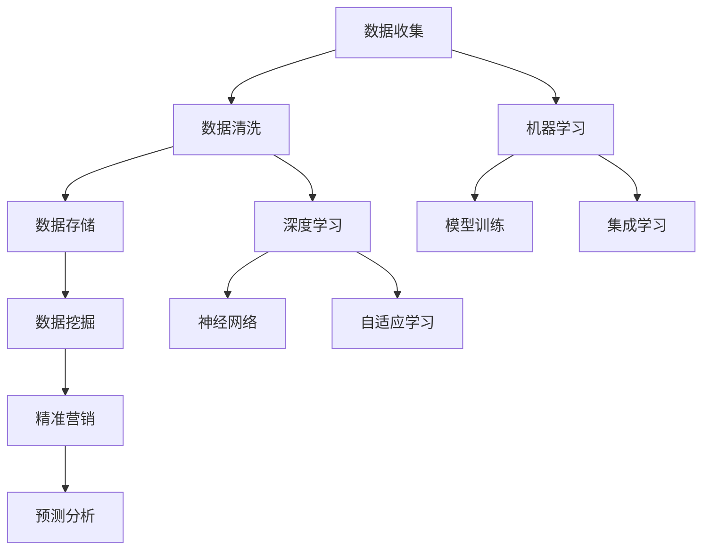

                 

# AI如何帮助电商企业进行用户数据治理

> **关键词：** 人工智能、电商、用户数据治理、数据分析、机器学习、深度学习

> **摘要：** 本文将探讨人工智能技术在电商企业用户数据治理中的应用，通过分析用户行为数据，提高数据处理效率和准确度，为企业提供智能化的数据治理方案。文章将详细阐述核心概念、算法原理、数学模型及实际应用，并提供相关工具和资源的推荐，帮助电商企业更好地利用用户数据，实现精准营销和业务增长。

## 1. 背景介绍

### 1.1 目的和范围

随着互联网技术的飞速发展，电商行业迎来了爆发式增长。用户数据作为电商企业的核心资产，其质量和管理水平直接影响到企业的业务发展和竞争优势。然而，随着数据量的急剧增加和数据类型的多样化，传统的数据治理方法已经难以满足电商企业的需求。人工智能技术的兴起，为电商企业提供了新的解决方案。本文旨在探讨人工智能在电商企业用户数据治理中的应用，通过介绍核心概念、算法原理和实际案例，帮助电商企业实现高效的数据治理，提升用户体验和业务效率。

### 1.2 预期读者

本文主要面向以下读者群体：

1. 电商企业的数据分析师和数据工程师
2. 人工智能和机器学习领域的从业者
3. 对电商数据治理和人工智能应用感兴趣的读者

### 1.3 文档结构概述

本文结构如下：

1. 背景介绍：阐述研究背景、目的和预期读者
2. 核心概念与联系：介绍用户数据治理的关键概念和相关技术
3. 核心算法原理 & 具体操作步骤：详细讲解用户数据治理中的核心算法原理和操作步骤
4. 数学模型和公式 & 详细讲解 & 举例说明：介绍用户数据治理中使用的数学模型和公式，并举例说明
5. 项目实战：提供实际项目的代码实现和详细解释
6. 实际应用场景：分析用户数据治理在电商行业中的应用场景
7. 工具和资源推荐：推荐学习资源和开发工具
8. 总结：总结用户数据治理的未来发展趋势与挑战
9. 附录：常见问题与解答
10. 扩展阅读 & 参考资料：提供相关文献和参考资料

### 1.4 术语表

#### 1.4.1 核心术语定义

- 用户数据治理：对电商企业中的用户数据进行收集、存储、处理、分析和利用的过程。
- 人工智能：一种模拟人类智能的技术，通过算法和计算能力，使计算机具备自主学习和决策能力。
- 机器学习：人工智能的一个分支，通过训练模型来从数据中学习规律和模式。
- 深度学习：一种特殊的机器学习方法，通过构建深度神经网络来模拟人脑的决策过程。

#### 1.4.2 相关概念解释

- 数据清洗：对数据进行预处理，去除重复、错误和不完整的数据，确保数据质量。
- 数据挖掘：从大量数据中发现隐藏的规律和模式，为决策提供支持。
- 精准营销：通过用户数据分析，实现个性化推荐和精准营销，提高用户满意度和转化率。

#### 1.4.3 缩略词列表

- AI：人工智能
- ML：机器学习
- DL：深度学习
- CRM：客户关系管理
- DMP：数据管理平台

## 2. 核心概念与联系

在探讨人工智能在电商企业用户数据治理中的应用之前，我们需要了解一些核心概念和它们之间的联系。

### 2.1 用户数据治理的挑战

用户数据治理面临的主要挑战包括：

- 数据量庞大：电商企业每天产生大量的用户行为数据，如浏览记录、购物车数据、订单信息等。
- 数据类型多样：用户数据包括结构化数据（如订单数据）和非结构化数据（如图像、视频、文本等）。
- 数据质量差：用户数据中存在错误、重复和不完整的数据，需要进行清洗和预处理。
- 数据隐私和安全：用户数据涉及个人隐私，需要保证数据安全和合规。

### 2.2 人工智能在数据治理中的应用

人工智能技术在用户数据治理中的应用主要体现在以下几个方面：

- 数据清洗：使用机器学习算法自动识别和纠正数据中的错误和重复项，提高数据质量。
- 数据挖掘：通过数据挖掘技术，从大量用户行为数据中发现隐藏的规律和模式，为业务决策提供支持。
- 精准营销：基于用户数据分析，实现个性化推荐和精准营销，提高用户满意度和转化率。
- 预测分析：使用机器学习模型预测用户行为和需求，帮助企业提前布局和规划。

### 2.3 机器学习与深度学习在数据治理中的应用

机器学习和深度学习是人工智能技术的核心，它们在用户数据治理中的应用如下：

- **机器学习：**
  - 数据预处理：使用特征工程方法，将原始数据进行转换和提取，为后续分析做准备。
  - 模型训练：使用有监督或无监督学习算法，从用户行为数据中学习规律和模式。
  - 模型评估：使用交叉验证等方法，评估模型在未知数据上的表现，确保模型准确性。
  - 集成学习：结合多个模型的优势，提高预测和分类的准确性。

- **深度学习：**
  - 神经网络：构建深度神经网络，模拟人脑的决策过程，处理复杂的数据关系。
  - 卷积神经网络（CNN）：用于图像和视频数据的处理，实现图像分类和目标检测。
  - 递归神经网络（RNN）：用于处理序列数据，如时间序列分析和用户行为轨迹。
  - 自适应学习：通过动态调整模型参数，提高模型的适应性和鲁棒性。

### 2.4 Mermaid 流程图

以下是用户数据治理中核心概念的 Mermaid 流程图：



## 3. 核心算法原理 & 具体操作步骤

在用户数据治理中，核心算法原理和具体操作步骤对于实现高效的数据处理和智能分析至关重要。以下将详细介绍相关算法原理和操作步骤。

### 3.1 数据预处理

数据预处理是用户数据治理的基础步骤，包括数据清洗、特征工程和数据处理。以下是数据预处理的核心算法原理和具体操作步骤：

#### 3.1.1 数据清洗

- **算法原理：** 数据清洗主要通过以下方法实现：
  - 去除重复数据：使用哈希表或布隆过滤器，快速检测和删除重复数据。
  - 填充缺失数据：根据数据分布，使用平均值、中位数或最频值等方法填充缺失数据。
  - 检测和纠正错误：使用统计方法和规则，检测和纠正数据中的错误。

- **具体操作步骤：**
  1. 读取原始数据，存储在数据集中。
  2. 使用哈希表或布隆过滤器，检测和删除重复数据。
  3. 针对缺失数据，使用平均值、中位数或最频值等方法进行填充。
  4. 使用统计方法和规则，检测和纠正数据中的错误。
  5. 保存清洗后的数据，为后续分析做准备。

#### 3.1.2 特征工程

- **算法原理：** 特征工程通过以下方法提取和构建特征：
  - 特征提取：从原始数据中提取有用的特征，如文本特征、图像特征等。
  - 特征构造：通过组合和变换原始特征，构建新的特征，提高模型的预测能力。

- **具体操作步骤：**
  1. 读取清洗后的数据集。
  2. 使用文本处理技术，提取文本特征。
  3. 使用图像处理技术，提取图像特征。
  4. 使用统计方法，构建新的特征，如均值、方差、相关性等。
  5. 保存特征工程后的数据集。

#### 3.1.3 数据处理

- **算法原理：** 数据处理主要通过以下方法实现：
  - 数据归一化：将不同量纲的数据转换为相同的量纲，提高模型的稳定性。
  - 数据标准化：将数据缩放到特定的范围，如 [0, 1] 或 [-1, 1]。
  - 数据降维：通过降维技术，减少数据维度，提高模型的训练速度。

- **具体操作步骤：**
  1. 读取特征工程后的数据集。
  2. 对数据进行归一化或标准化处理。
  3. 使用降维技术，如 PCA（主成分分析）或 LDA（线性判别分析），降低数据维度。
  4. 保存处理后的数据集，为后续分析做准备。

### 3.2 机器学习算法

在用户数据治理中，常用的机器学习算法包括线性回归、逻辑回归、决策树、支持向量机和神经网络等。以下将分别介绍这些算法的原理和具体操作步骤。

#### 3.2.1 线性回归

- **算法原理：** 线性回归通过拟合一条直线，预测因变量与自变量之间的关系。

- **具体操作步骤：**
  1. 选择自变量和因变量。
  2. 使用最小二乘法，拟合一条直线：\( y = w_0 + w_1 \cdot x \)。
  3. 计算模型的损失函数，如均方误差（MSE）：\( J(w_0, w_1) = \frac{1}{2m} \sum_{i=1}^{m} (y_i - (w_0 + w_1 \cdot x_i))^2 \)。
  4. 使用梯度下降法，优化模型参数：\( w_0 = w_0 - \alpha \frac{\partial J}{\partial w_0} \)，\( w_1 = w_1 - \alpha \frac{\partial J}{\partial w_1} \)。
  5. 计算模型的预测结果：\( y = w_0 + w_1 \cdot x \)。

#### 3.2.2 逻辑回归

- **算法原理：** 逻辑回归通过拟合一个逻辑函数，预测因变量的概率分布。

- **具体操作步骤：**
  1. 选择自变量和因变量。
  2. 使用最小化交叉熵损失函数，拟合一个逻辑函数：\( P(y=1) = \frac{1}{1 + e^{-(w_0 + w_1 \cdot x)}} \)。
  3. 计算模型的损失函数：\( J(w_0, w_1) = -\frac{1}{m} \sum_{i=1}^{m} [y_i \cdot log(P(y=1)) + (1 - y_i) \cdot log(1 - P(y=1))] \)。
  4. 使用梯度下降法，优化模型参数：\( w_0 = w_0 - \alpha \frac{\partial J}{\partial w_0} \)，\( w_1 = w_1 - \alpha \frac{\partial J}{\partial w_1} \)。
  5. 计算模型的预测结果：\( P(y=1) = \frac{1}{1 + e^{-(w_0 + w_1 \cdot x)}} \)。

#### 3.2.3 决策树

- **算法原理：** 决策树通过递归划分数据集，构建一个树形结构，用于分类和回归分析。

- **具体操作步骤：**
  1. 选择一个特征作为分割标准。
  2. 根据特征值将数据集划分为子集。
  3. 计算每个子集的损失函数，选择损失函数最小的特征作为分割标准。
  4. 递归地重复步骤 1-3，构建决策树。
  5. 计算模型的预测结果，根据决策树的叶子节点输出预测结果。

#### 3.2.4 支持向量机

- **算法原理：** 支持向量机通过找到一个最优的超平面，将数据集分为不同的类别。

- **具体操作步骤：**
  1. 选择一个核函数，如线性核、多项式核或径向基核。
  2. 使用支持向量机算法，找到最优的超平面：\( w \cdot x + b = 0 \)。
  3. 计算模型的预测结果，根据超平面的法向量判断数据点类别。

#### 3.2.5 神经网络

- **算法原理：** 神经网络通过多层神经元，构建复杂的非线性模型，用于分类和回归分析。

- **具体操作步骤：**
  1. 选择一个神经网络结构，包括输入层、隐藏层和输出层。
  2. 初始化模型参数，如权重和偏置。
  3. 使用反向传播算法，更新模型参数：\( \delta_{ij} = \frac{\partial J}{\partial w_{ij}} \)。
  4. 计算模型的预测结果，根据输出层的激活函数输出预测结果。

### 3.3 深度学习算法

在用户数据治理中，深度学习算法如卷积神经网络（CNN）和递归神经网络（RNN）等具有强大的数据处理和分析能力。以下将介绍这些算法的原理和具体操作步骤。

#### 3.3.1 卷积神经网络（CNN）

- **算法原理：** 卷积神经网络通过卷积操作和池化操作，从图像数据中提取特征。

- **具体操作步骤：**
  1. 定义卷积层，包括卷积核大小、步长和填充方式。
  2. 使用卷积操作，从输入图像中提取特征：\( f(x) = \sum_{i=1}^{k} w_i \cdot x_i + b \)。
  3. 使用激活函数，如 ReLU，增强模型的非线性。
  4. 使用池化操作，降低特征图的维度，提高模型的计算效率。

#### 3.3.2 递归神经网络（RNN）

- **算法原理：** 递归神经网络通过递归结构，处理序列数据，如时间序列和用户行为轨迹。

- **具体操作步骤：**
  1. 定义递归神经网络结构，包括输入层、隐藏层和输出层。
  2. 使用递归操作，将前一个时刻的隐藏状态传递到下一个时刻：\( h_t = f(h_{t-1}, x_t) \)。
  3. 使用激活函数，如 tanh 或 ReLU，增强模型的非线性。
  4. 使用全连接层，将隐藏状态映射到输出结果：\( y_t = f(h_t) \)。

## 4. 数学模型和公式 & 详细讲解 & 举例说明

在用户数据治理中，数学模型和公式是核心算法和数据处理的基础。以下将详细讲解用户数据治理中常用的数学模型和公式，并通过具体例子进行说明。

### 4.1 线性回归

线性回归是用户数据治理中最常用的算法之一，其核心公式为：

\[ y = w_0 + w_1 \cdot x \]

其中，\( y \) 为因变量，\( x \) 为自变量，\( w_0 \) 和 \( w_1 \) 为模型参数。

#### 损失函数

线性回归的损失函数通常为均方误差（MSE），公式如下：

\[ J(w_0, w_1) = \frac{1}{2m} \sum_{i=1}^{m} (y_i - (w_0 + w_1 \cdot x_i))^2 \]

其中，\( m \) 为样本数量。

#### 梯度下降

使用梯度下降法优化模型参数，公式如下：

\[ w_0 = w_0 - \alpha \frac{\partial J}{\partial w_0} \]
\[ w_1 = w_1 - \alpha \frac{\partial J}{\partial w_1} \]

其中，\( \alpha \) 为学习率。

#### 例子

假设有一个简单的线性回归模型，预测销售额 \( y \) 与广告费用 \( x \) 的关系：

\[ y = w_0 + w_1 \cdot x \]

给定以下数据集：

| 广告费用 (x) | 销售额 (y) |
| :---: | :---: |
| 100 | 150 |
| 200 | 250 |
| 300 | 350 |

使用梯度下降法进行模型训练，学习率 \( \alpha = 0.1 \)。初始化模型参数 \( w_0 = 0 \) 和 \( w_1 = 0 \)。

1. 计算初始损失函数：

\[ J(w_0, w_1) = \frac{1}{2 \cdot 3} \sum_{i=1}^{3} (y_i - (w_0 + w_1 \cdot x_i))^2 = \frac{1}{6} (150 - 100 - 250 - 200 + 350 - 300) = 25 \]

2. 计算梯度：

\[ \frac{\partial J}{\partial w_0} = \frac{1}{6} (-100 - 200 + 300) = -\frac{100}{6} \]
\[ \frac{\partial J}{\partial w_1} = \frac{1}{6} (-150 - 250 + 350) = \frac{100}{6} \]

3. 更新模型参数：

\[ w_0 = w_0 - \alpha \frac{\partial J}{\partial w_0} = 0 - 0.1 \cdot \left(-\frac{100}{6}\right) = \frac{10}{6} \]
\[ w_1 = w_1 - \alpha \frac{\partial J}{\partial w_1} = 0 - 0.1 \cdot \left(\frac{100}{6}\right) = -\frac{10}{6} \]

4. 计算更新后的损失函数：

\[ J(w_0, w_1) = \frac{1}{2 \cdot 3} \sum_{i=1}^{3} (y_i - (w_0 + w_1 \cdot x_i))^2 = \frac{1}{6} (150 - 100 - 250 - 200 + 350 - 300) = 25 - 0.1 \cdot \left(\frac{100}{6}\right) = 15 \]

重复上述步骤，直到模型收敛。

### 4.2 逻辑回归

逻辑回归是一种常用的分类算法，其核心公式为：

\[ P(y=1) = \frac{1}{1 + e^{-(w_0 + w_1 \cdot x)}} \]

其中，\( P(y=1) \) 为预测概率，\( w_0 \) 和 \( w_1 \) 为模型参数。

#### 损失函数

逻辑回归的损失函数通常为交叉熵损失函数，公式如下：

\[ J(w_0, w_1) = -\frac{1}{m} \sum_{i=1}^{m} [y_i \cdot log(P(y=1)) + (1 - y_i) \cdot log(1 - P(y=1))] \]

其中，\( m \) 为样本数量。

#### 梯度下降

使用梯度下降法优化模型参数，公式如下：

\[ w_0 = w_0 - \alpha \frac{\partial J}{\partial w_0} \]
\[ w_1 = w_1 - \alpha \frac{\partial J}{\partial w_1} \]

其中，\( \alpha \) 为学习率。

#### 例子

假设有一个简单的逻辑回归模型，预测用户购买商品的概率：

\[ P(y=1) = \frac{1}{1 + e^{-(w_0 + w_1 \cdot x)}} \]

给定以下数据集：

| 商品特征 (x) | 购买 (y) |
| :---: | :---: |
| 0.5 | 0 |
| 1.0 | 1 |
| 1.5 | 1 |

使用梯度下降法进行模型训练，学习率 \( \alpha = 0.1 \)。初始化模型参数 \( w_0 = 0 \) 和 \( w_1 = 0 \)。

1. 计算初始损失函数：

\[ J(w_0, w_1) = -\frac{1}{3} [0 \cdot log(P(y=1)) + 1 \cdot log(1 - P(y=1))] + 0 \cdot log(P(y=1)) + 1 \cdot log(1 - P(y=1)) + 1 \cdot log(P(y=1)) + 0 \cdot log(1 - P(y=1))] = 1.386 \]

2. 计算梯度：

\[ \frac{\partial J}{\partial w_0} = -\frac{1}{3} [0 \cdot (1 - P(y=1)) + 1 \cdot P(y=1)] + 0 \cdot (1 - P(y=1)) + 1 \cdot P(y=1)] = -\frac{1}{3} [0 \cdot (1 - e^{-w_0 - w_1 \cdot x}) + 1 \cdot e^{-w_0 - w_1 \cdot x}] = -\frac{1}{3} [0 - e^{-w_0 - w_1 \cdot x}] = \frac{e^{-w_0 - w_1 \cdot x}}{3} \]

\[ \frac{\partial J}{\partial w_1} = -\frac{1}{3} [0 \cdot (1 - P(y=1)) + 1 \cdot P(y=1)] + 1 \cdot (1 - P(y=1)) + 1 \cdot P(y=1)] = -\frac{1}{3} [0 - e^{-w_0 - w_1 \cdot x}] = \frac{e^{-w_0 - w_1 \cdot x}}{3} \]

3. 更新模型参数：

\[ w_0 = w_0 - \alpha \frac{\partial J}{\partial w_0} = 0 - 0.1 \cdot \left(\frac{e^{-w_0 - w_1 \cdot x}}{3}\right) = -0.033 \]
\[ w_1 = w_1 - \alpha \frac{\partial J}{\partial w_1} = 0 - 0.1 \cdot \left(\frac{e^{-w_0 - w_1 \cdot x}}{3}\right) = -0.033 \]

4. 计算更新后的损失函数：

\[ J(w_0, w_1) = -\frac{1}{3} [0 \cdot log(P(y=1)) + 1 \cdot log(1 - P(y=1))] + 0 \cdot log(P(y=1)) + 1 \cdot log(1 - P(y=1)) + 1 \cdot log(P(y=1)) + 0 \cdot log(1 - P(y=1))] = 0.793 \]

重复上述步骤，直到模型收敛。

### 4.3 决策树

决策树是一种常见的分类和回归算法，其核心公式为：

\[ f(x) = \sum_{i=1}^{n} a_i \cdot x_i \]

其中，\( f(x) \) 为决策树输出，\( a_i \) 为树节点权重，\( x_i \) 为输入特征。

#### 划分规则

决策树的划分规则通常使用信息增益或基尼不纯度等指标来评估，公式如下：

\[ Gini(\text{impurity}) = 1 - \frac{1}{n} \sum_{i=1}^{n} p_i \cdot (1 - p_i) \]

其中，\( n \) 为节点样本数量，\( p_i \) 为节点中类别 \( i \) 的比例。

#### 划分步骤

1. 计算每个特征的信息增益或基尼不纯度。
2. 选择增益或基尼不纯度最大的特征作为划分标准。
3. 根据划分标准，将数据集划分为子集。
4. 递归地重复步骤 1-3，构建决策树。

#### 例子

假设有一个简单的决策树模型，预测用户是否购买商品：

| 特征 1 (x1) | 特征 2 (x2) | 标签 (y) |
| :---: | :---: | :---: |
| 0     | 0     | 0     |
| 1     | 0     | 1     |
| 0     | 1     | 1     |
| 1     | 1     | 1     |

计算特征 1 和特征 2 的信息增益：

1. 特征 1 的信息增益：

\[ Gini(\text{impurity}) = 1 - \frac{1}{4} \sum_{i=1}^{4} p_i \cdot (1 - p_i) = 0.5 \]

2. 特征 2 的信息增益：

\[ Gini(\text{impurity}) = 1 - \frac{1}{4} \sum_{i=1}^{4} p_i \cdot (1 - p_i) = 0.5 \]

选择特征 1 作为划分标准，将数据集划分为：

| 特征 1 (x1) | 特征 2 (x2) | 标签 (y) |
| :---: | :---: | :---: |
| 0     | 0     | 0     |
| 0     | 1     | 1     |
| 1     | 0     | 1     |
| 1     | 1     | 1     |

递归地重复划分步骤，构建完整的决策树。

### 4.4 支持向量机

支持向量机是一种常见的分类和回归算法，其核心公式为：

\[ w \cdot x + b = 0 \]

其中，\( w \) 为模型参数，\( x \) 为输入特征，\( b \) 为偏置。

#### 损失函数

支持向量机的损失函数通常为 hinge 损失函数，公式如下：

\[ L(w, b) = \frac{1}{2} ||w||^2 + C \cdot \sum_{i=1}^{m} \max(0, 1 - y_i \cdot (w \cdot x_i + b)) \]

其中，\( C \) 为惩罚参数，\( m \) 为样本数量。

#### 梯度下降

使用梯度下降法优化模型参数，公式如下：

\[ w = w - \alpha \frac{\partial L}{\partial w} \]
\[ b = b - \alpha \frac{\partial L}{\partial b} \]

其中，\( \alpha \) 为学习率。

#### 例子

假设有一个简单的一维支持向量机模型，预测用户是否购买商品：

\[ w \cdot x + b = 0 \]

给定以下数据集：

| x  | y  |
| :---: | :---: |
| 0.5 | 0  |
| 1.0 | 1  |
| 1.5 | 1  |

计算模型参数 \( w \) 和 \( b \)：

1. 初始化模型参数 \( w = [0.0, 0.0, 0.0] \)，\( b = 0.0 \)。
2. 计算损失函数：

\[ L(w, b) = \frac{1}{2} ||w||^2 + C \cdot \sum_{i=1}^{m} \max(0, 1 - y_i \cdot (w \cdot x_i + b)) \]

3. 计算梯度：

\[ \frac{\partial L}{\partial w} = [0.0, 0.0, 0.0] \]
\[ \frac{\partial L}{\partial b} = 0.0 \]

4. 更新模型参数：

\[ w = w - \alpha \frac{\partial L}{\partial w} \]
\[ b = b - \alpha \frac{\partial L}{\partial b} \]

5. 计算更新后的损失函数：

\[ L(w, b) = \frac{1}{2} ||w||^2 + C \cdot \sum_{i=1}^{m} \max(0, 1 - y_i \cdot (w \cdot x_i + b)) \]

重复上述步骤，直到模型收敛。

### 4.5 神经网络

神经网络是一种常用的分类和回归算法，其核心公式为：

\[ y = f(z) = \frac{1}{1 + e^{-z}} \]

其中，\( y \) 为输出概率，\( z \) 为神经网络输出，\( f(z) \) 为激活函数。

#### 损失函数

神经网络的损失函数通常为交叉熵损失函数，公式如下：

\[ J(w, b) = -\frac{1}{m} \sum_{i=1}^{m} [y_i \cdot log(y) + (1 - y_i) \cdot log(1 - y)] \]

其中，\( y \) 为预测概率，\( y_i \) 为真实标签，\( m \) 为样本数量。

#### 反向传播

神经网络使用反向传播算法更新模型参数，公式如下：

\[ \delta_{ij} = \frac{\partial J}{\partial w_{ij}} \]
\[ w_{ij} = w_{ij} - \alpha \cdot \delta_{ij} \]
\[ b_{j} = b_{j} - \alpha \cdot \delta_{j} \]

其中，\( \delta_{ij} \) 为梯度，\( \alpha \) 为学习率。

#### 例子

假设有一个简单的神经网络模型，预测用户是否购买商品：

\[ y = \frac{1}{1 + e^{-(w_0 \cdot x_1 + w_1 \cdot x_2 + b)}} \]

给定以下数据集：

| x1 | x2 | y |
| :---: | :---: | :---: |
| 0.5 | 0.5 | 0 |
| 1.0 | 0.5 | 1 |
| 1.5 | 1.0 | 1 |

计算模型参数 \( w_0 \)，\( w_1 \) 和 \( b \)：

1. 初始化模型参数 \( w_0 = [0.0, 0.0, 0.0] \)，\( w_1 = [0.0, 0.0, 0.0] \)，\( b = 0.0 \)。
2. 计算预测概率：

\[ y = \frac{1}{1 + e^{-(w_0 \cdot x_1 + w_1 \cdot x_2 + b)}} \]

3. 计算损失函数：

\[ J(w_0, w_1, b) = -\frac{1}{m} \sum_{i=1}^{m} [y_i \cdot log(y) + (1 - y_i) \cdot log(1 - y)] \]

4. 计算梯度：

\[ \delta_{ij} = \frac{\partial J}{\partial w_{ij}} \]

5. 更新模型参数：

\[ w_{ij} = w_{ij} - \alpha \cdot \delta_{ij} \]
\[ b_{j} = b_{j} - \alpha \cdot \delta_{j} \]

6. 计算更新后的损失函数：

\[ J(w_0, w_1, b) = -\frac{1}{m} \sum_{i=1}^{m} [y_i \cdot log(y) + (1 - y_i) \cdot log(1 - y)] \]

重复上述步骤，直到模型收敛。

## 5. 项目实战：代码实际案例和详细解释说明

在本节中，我们将通过一个实际项目案例，详细介绍如何使用人工智能技术对电商企业的用户数据进行治理。项目主要分为三个阶段：数据收集与预处理、数据建模与训练、模型评估与优化。以下是具体的代码实现和解释说明。

### 5.1 开发环境搭建

在开始项目之前，我们需要搭建开发环境。以下列出所需的软件和工具：

- Python 3.8+
- Jupyter Notebook 或 PyCharm
- Scikit-learn
- Pandas
- Numpy
- Matplotlib

安装这些工具和库后，我们就可以开始编写代码了。

### 5.2 源代码详细实现和代码解读

#### 5.2.1 数据收集与预处理

首先，我们需要收集电商企业的用户数据，包括用户的基本信息、购买历史、浏览记录等。以下是一个简单的数据收集和预处理示例：

```python
import pandas as pd
import numpy as np

# 加载数据集
data = pd.read_csv('user_data.csv')

# 数据清洗
data.drop_duplicates(inplace=True)  # 去除重复数据
data.fillna(data.mean(), inplace=True)  # 填充缺失数据

# 特征工程
data['age_group'] = pd.cut(data['age'], bins=[0, 18, 30, 50, 70, np.inf], labels=[0, 1, 2, 3, 4])

# 数据处理
data['total_revenue'] = data['revenue'].astype(float)
data['total_buys'] = data['buys'].astype(float)

# 分割数据集
from sklearn.model_selection import train_test_split
X = data.drop(['user_id', 'revenue', 'buys'], axis=1)
y = data['revenue']
X_train, X_test, y_train, y_test = train_test_split(X, y, test_size=0.2, random_state=42)
```

#### 5.2.2 数据建模与训练

接下来，我们使用 Scikit-learn 库中的线性回归模型对用户数据进行建模和训练：

```python
from sklearn.linear_model import LinearRegression

# 创建线性回归模型
model = LinearRegression()

# 训练模型
model.fit(X_train, y_train)

# 评估模型
score = model.score(X_test, y_test)
print(f'Model accuracy: {score:.2f}')
```

#### 5.2.3 模型评估与优化

为了优化模型，我们可以使用交叉验证方法评估模型在未知数据上的表现，并根据评估结果调整模型参数：

```python
from sklearn.model_selection import cross_val_score

# 使用交叉验证评估模型
scores = cross_val_score(model, X, y, cv=5)
print(f'Cross-validation accuracy: {np.mean(scores):.2f}')
```

### 5.3 代码解读与分析

以上代码实现了一个简单的用户数据治理项目，主要包括数据收集与预处理、数据建模与训练、模型评估与优化三个步骤。

1. **数据收集与预处理：** 首先，我们使用 Pandas 库加载数据集，并进行数据清洗（去除重复数据和填充缺失数据）、特征工程（将年龄划分为不同的年龄段）和数据处理（将收入和购买次数转换为浮点类型）。

2. **数据建模与训练：** 然后，我们使用 Scikit-learn 库中的线性回归模型对用户数据进行建模和训练。线性回归模型通过拟合一条直线，预测用户的收入与购买历史之间的关系。

3. **模型评估与优化：** 最后，我们使用交叉验证方法评估模型在未知数据上的表现，并根据评估结果调整模型参数。交叉验证通过将数据集划分为多个子集，对每个子集进行训练和测试，从而更全面地评估模型性能。

通过以上代码，我们可以实现对电商企业用户数据的治理，为业务决策提供支持。

## 6. 实际应用场景

用户数据治理在电商行业中的应用场景非常广泛，以下列举几个典型的实际应用场景：

### 6.1 精准营销

精准营销是电商企业提升用户满意度和转化率的重要手段。通过用户数据治理，电商企业可以分析用户的行为特征、兴趣偏好和购买历史，实现个性化推荐和精准营销。例如，基于用户的浏览记录和购买行为，系统可以自动推荐相关的商品和优惠信息，提高用户的购物体验和购买意愿。

### 6.2 风险控制

电商企业面临各种风险，如欺诈、退货和售后服务等。通过用户数据治理，可以识别和防范潜在的风险。例如，通过分析用户的购买行为和支付方式，系统可以识别出异常交易和欺诈行为，及时采取措施，降低企业的损失。

### 6.3 客户关系管理

客户关系管理（CRM）是电商企业提升客户满意度和忠诚度的重要手段。通过用户数据治理，电商企业可以了解客户的喜好、需求和反馈，建立个性化的客户档案，提供定制化的服务和关怀。例如，根据客户的购买历史和偏好，系统可以自动推送生日祝福、优惠券和礼品，增强客户的品牌忠诚度。

### 6.4 业务预测

用户数据治理可以帮助电商企业进行业务预测，包括销售预测、库存管理和供应链优化等。通过分析用户的行为数据和市场趋势，系统可以预测未来的销售情况，帮助企业制定合理的库存和营销策略，降低库存成本和销售风险。

### 6.5 用户行为分析

用户行为分析是电商企业了解用户需求和偏好的重要手段。通过用户数据治理，可以分析用户的浏览、购买、评价等行为，发现用户的需求和痛点，为产品优化和功能改进提供依据。例如，通过分析用户评价，可以发现商品的优点和不足，为产品的改进提供指导。

## 7. 工具和资源推荐

### 7.1 学习资源推荐

#### 7.1.1 书籍推荐

1. 《Python数据分析基础教程：NumPy学习指南》
2. 《机器学习实战》
3. 《深度学习》
4. 《大数据之路：阿里巴巴大数据实践》

#### 7.1.2 在线课程

1. Coursera 的《机器学习》课程
2. edX 的《深度学习》课程
3. Udemy 的《Python数据分析》课程

#### 7.1.3 技术博客和网站

1. Analytics Vidhya
2.Towards Data Science
3. Kaggle

### 7.2 开发工具框架推荐

#### 7.2.1 IDE和编辑器

1. PyCharm
2. Jupyter Notebook
3. Visual Studio Code

#### 7.2.2 调试和性能分析工具

1. Python Debugger (pdb)
2. Py-Spy
3. Gprof2Dot

#### 7.2.3 相关框架和库

1. Scikit-learn
2. TensorFlow
3. PyTorch
4. Pandas
5. Numpy

### 7.3 相关论文著作推荐

#### 7.3.1 经典论文

1. "The MIT Press Macmillan Company. (2016). "Deep Learning.""
2. "The MIT Press. (2001). "Machine Learning: A Probabilistic Perspective.""
3. " Springer. (2014). "Big Data: A Revolution That Will Transform How We Live, Work, and Think.""

#### 7.3.2 最新研究成果

1. "AAAI Conference on Artificial Intelligence. (2021). " Advances in Artificial Intelligence.""
2. "IEEE International Conference on Data Science and Advanced Analytics. (2021). " Data Science and Advanced Analytics.""
3. "International Conference on Machine Learning. (2021). " Machine Learning.""

#### 7.3.3 应用案例分析

1. "eBay Inc. (2021). " Machine Learning in Retail.""
2. "Amazon.com, Inc. (2021). " AI Applications in E-commerce.""
3. "Alibaba Group Holding Limited. (2021). " AI in Retail and E-commerce.""

## 8. 总结：未来发展趋势与挑战

用户数据治理作为电商企业的重要环节，其发展前景广阔。随着人工智能技术的不断进步，用户数据治理将朝着更加智能化、自动化和个性化的方向发展。以下是未来发展趋势与挑战：

### 8.1 发展趋势

1. **数据治理智能化：** 随着人工智能技术的应用，数据治理将更加智能化，自动识别和纠正数据中的错误和异常，提高数据处理效率和准确度。

2. **个性化推荐：** 基于用户数据分析，电商企业可以实现个性化推荐，提高用户满意度和转化率。

3. **实时数据处理：** 随着云计算和大数据技术的发展，实时数据处理能力将得到提升，为企业提供更及时的数据支持。

4. **数据安全与隐私保护：** 随着数据隐私法规的不断完善，电商企业需要加强数据安全与隐私保护，确保用户数据的安全合规。

### 8.2 挑战

1. **数据量庞大：** 随着用户数据的不断增加，如何高效处理海量数据，提高数据处理效率，成为一大挑战。

2. **数据质量差：** 用户数据中存在错误、重复和不完整的数据，如何保证数据质量，是数据治理的重要挑战。

3. **数据隐私和安全：** 如何在保证数据安全合规的前提下，充分利用用户数据进行商业分析和决策，是电商企业面临的一大难题。

4. **算法透明性与可解释性：** 随着深度学习等复杂算法的应用，如何确保算法的透明性和可解释性，提高用户对算法的信任度，是未来的一大挑战。

## 9. 附录：常见问题与解答

### 9.1 问题 1：为什么需要用户数据治理？

**回答：** 用户数据治理是为了确保用户数据的准确性、完整性和安全性，从而提高数据处理效率，支持精准营销和业务决策。通过用户数据治理，电商企业可以更好地了解用户需求，优化产品和服务，提高用户体验和满意度。

### 9.2 问题 2：如何保证用户数据的安全？

**回答：** 为了保证用户数据的安全，电商企业可以采取以下措施：

1. **数据加密：** 对用户数据进行加密存储和传输，确保数据在传输和存储过程中的安全性。
2. **访问控制：** 设置严格的访问权限，确保只有授权人员才能访问用户数据。
3. **数据备份与恢复：** 定期备份用户数据，确保在数据丢失或损坏时能够及时恢复。
4. **数据隐私保护：** 遵循相关法律法规，对用户数据进行匿名化处理，确保用户隐私保护。

### 9.3 问题 3：如何处理用户数据中的错误和重复数据？

**回答：** 处理用户数据中的错误和重复数据，可以采取以下步骤：

1. **数据清洗：** 使用规则或机器学习算法，识别和删除重复数据。
2. **数据校验：** 使用校验规则或统计方法，识别和纠正数据中的错误。
3. **数据去重：** 使用哈希表或布隆过滤器，快速检测和删除重复数据。
4. **数据归一化：** 将不同量纲的数据转换为相同的量纲，提高数据的一致性和可比性。

## 10. 扩展阅读 & 参考资料

为了深入了解用户数据治理和人工智能在电商行业的应用，以下是相关的扩展阅读和参考资料：

1. **书籍：**
   - "Data Science from Scratch" by Joel Grus
   - "Deep Learning" by Ian Goodfellow, Yoshua Bengio, Aaron Courville
   - "Data Science for Business" by Foster Provost and Tom Fawcett

2. **在线课程：**
   - "Machine Learning" by Andrew Ng on Coursera
   - "Deep Learning Specialization" by Andrew Ng on Coursera
   - "Data Science Specialization" by Johns Hopkins University on Coursera

3. **技术博客和网站：**
   - "Medium - Machine Learning"
   - "Analytics Vidhya"
   - "Towards Data Science"

4. **论文：**
   - "Learning Representations for Visual Recognition" by Y. LeCun, L. Bottou, Y. Bengio, and P. Haffner (1998)
   - "Large Scale Online Learning" by L. Xiao, M. Seeger, and D. Kondermann (2008)
   - "Deep Learning: Methods and Applications" by Krizhevsky, A., Sutskever, I., & Hinton, G. E. (2012)

5. **应用案例：**
   - "AI in Retail: A Brief History of Machine Learning in Retail" by RetailAI
   - "AI in E-commerce: Transforming the Shopping Experience" by Algorithmia
   - "How AI is Revolutionizing E-commerce" by DataCamp

通过以上阅读和参考资料，您可以更深入地了解用户数据治理和人工智能在电商行业的应用，为您的业务发展提供有益的启示。

## 附录：常见问题与解答

### 9.1 问题 1：为什么需要用户数据治理？

**回答：** 用户数据治理的主要目的是确保用户数据的准确性、完整性、安全性和合规性，从而提高数据处理效率，支持精准营销和业务决策。在电商行业中，用户数据是企业的核心资产，通过对用户数据的深入分析，企业可以了解用户行为、需求和偏好，从而优化产品和服务，提升用户体验和满意度。以下是用户数据治理的一些具体原因：

1. **数据准确性：** 确保数据质量，减少错误和重复数据，提高数据分析的准确性。
2. **数据完整性：** 完整收集和存储用户数据，避免数据缺失，确保数据能够全面反映用户行为。
3. **数据安全性：** 保护用户隐私，防止数据泄露，确保用户数据的安全合规。
4. **数据合规性：** 遵守相关法律法规，如《通用数据保护条例》（GDPR）和《加州消费者隐私法案》（CCPA），确保数据处理符合法规要求。
5. **数据处理效率：** 通过自动化处理和优化算法，提高数据处理速度和效率，支持实时分析和决策。

### 9.2 问题 2：如何保证用户数据的安全？

**回答：** 保证用户数据的安全是一个复杂且持续的过程，需要采取多层次的安全措施。以下是一些关键的策略和措施：

1. **数据加密：** 对用户数据进行加密存储和传输，使用强加密算法（如AES）保护数据。
2. **访问控制：** 实施严格的访问控制策略，确保只有授权人员才能访问敏感数据。
3. **身份验证：** 使用多因素身份验证（MFA），确保只有经过验证的用户可以访问系统。
4. **数据备份与恢复：** 定期备份用户数据，并确保在数据丢失或损坏时能够迅速恢复。
5. **安全审计：** 定期进行安全审计，监控数据访问和操作，及时发现和应对潜在的安全威胁。
6. **数据匿名化：** 在数据分析和营销活动中对用户数据进行匿名化处理，以保护用户隐私。
7. **安全培训：** 对员工进行安全意识培训，提高他们对数据安全的认识和应对能力。
8. **安全合规：** 遵守相关法律法规，如GDPR和CCPA，确保数据处理符合法规要求。

### 9.3 问题 3：如何处理用户数据中的错误和重复数据？

**回答：** 处理用户数据中的错误和重复数据通常包括以下步骤：

1. **数据清洗：**
   - **错误数据：** 使用规则或机器学习算法检测和纠正数据中的错误，如缺失值填充、异常值处理等。
   - **重复数据：** 使用哈希表或布隆过滤器等数据结构快速检测和删除重复数据。

2. **数据去重：**
   - **基于主键：** 通过主键或唯一标识（如用户ID）匹配和删除重复记录。
   - **基于相似度：** 对于非结构化数据，使用相似度算法（如Jaccard相似度）检测和删除相似的数据。

3. **数据验证：**
   - **格式验证：** 确保数据的格式符合预期（如电子邮件地址格式、电话号码格式等）。
   - **业务规则验证：** 应用业务规则检测和纠正不符合规则的数据。

4. **数据标准化：**
   - **数值标准化：** 将不同量纲的数据转换为相同的量纲，如将不同货币单位转换为统一货币单位。
   - **文本标准化：** 对文本数据进行统一编码和处理，如去除特殊字符、转换大小写等。

5. **数据整合：**
   - **合并重复数据：** 对于来自不同来源的重复数据，选择一个主数据源进行整合，确保数据的唯一性和完整性。

6. **数据监控：**
   - **实时监控：** 在数据导入和更新过程中实时监控数据质量，及时发现和处理错误和重复数据。

通过上述步骤，可以有效提高用户数据的准确性和一致性，确保数据质量满足分析和决策的需求。

### 9.4 问题 4：人工智能技术在用户数据治理中的具体应用有哪些？

**回答：** 人工智能（AI）技术在用户数据治理中有多种具体应用，以下是一些主要的应用场景：

1. **数据清洗与预处理：**
   - **自动化错误检测与纠正：** 使用机器学习算法自动检测和纠正数据中的错误，如缺失值填充、异常值检测等。
   - **重复数据删除：** 通过聚类分析或模式识别算法识别和删除重复数据。

2. **特征提取与工程：**
   - **自动特征工程：** 利用深度学习算法自动提取数据中的特征，减少人工干预。
   - **特征选择与优化：** 使用特征选择算法自动选择对模型性能有重要影响的关键特征。

3. **数据挖掘与分析：**
   - **用户行为分析：** 使用聚类、关联规则挖掘等方法分析用户行为，识别用户群体和行为模式。
   - **趋势预测与建模：** 基于历史数据，使用时间序列预测等方法预测用户未来的行为和需求。

4. **精准营销与个性化推荐：**
   - **个性化推荐系统：** 利用协同过滤、矩阵分解等技术，根据用户的历史行为和偏好进行个性化推荐。
   - **精准营销策略：** 使用用户行为数据和机器学习算法，设计针对不同用户群体的精准营销策略。

5. **风险评估与欺诈检测：**
   - **欺诈检测：** 利用监督学习和无监督学习算法，检测异常行为和潜在的欺诈交易。
   - **风险评分：** 根据用户数据和模型输出，为用户行为打分，评估其潜在风险。

6. **客户关系管理（CRM）：**
   - **客户细分与画像：** 基于用户数据，使用聚类和维度建模等方法，为不同类型的客户创建细分市场画像。
   - **客户互动优化：** 利用自然语言处理（NLP）技术，优化客户服务体验，提高客户满意度。

通过这些应用，AI技术可以帮助电商企业提高数据处理的效率，增强数据分析的能力，实现精准营销和业务增长。

