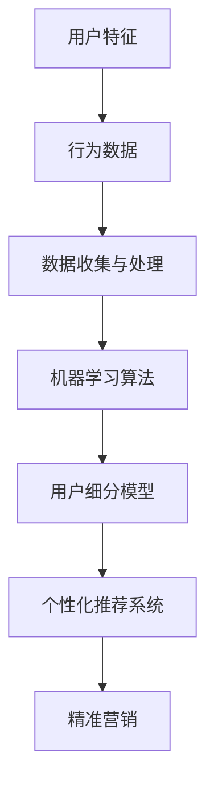

                 

# AI如何帮助电商企业进行用户细分

> 关键词：人工智能、用户细分、电商、数据挖掘、机器学习、客户行为分析

> 摘要：本文将探讨如何利用人工智能技术，特别是机器学习和数据挖掘技术，帮助电商企业进行用户细分。通过深入分析用户行为数据，实现精准营销和个性化推荐，从而提高用户体验和销售额。

## 1. 背景介绍

### 1.1 目的和范围

本文旨在介绍人工智能技术在电商用户细分中的应用，探讨如何通过机器学习和数据挖掘技术，提高电商企业的运营效率和市场竞争力。我们将从理论到实践，详细讲解用户细分的核心概念、算法原理、数学模型以及实际应用场景。

### 1.2 预期读者

本文适合以下读者：

- 电商行业从业者，特别是市场运营和数据分析人员。
- 人工智能技术爱好者，希望了解AI在电商领域的应用。
- 计算机科学专业学生，对机器学习和数据挖掘有兴趣。

### 1.3 文档结构概述

本文分为以下几部分：

- 第1部分：背景介绍，阐述用户细分的意义和应用场景。
- 第2部分：核心概念与联系，介绍用户细分的相关概念和流程。
- 第3部分：核心算法原理 & 具体操作步骤，讲解机器学习算法在用户细分中的应用。
- 第4部分：数学模型和公式 & 详细讲解 & 举例说明，阐述用户细分中的数学模型。
- 第5部分：项目实战：代码实际案例和详细解释说明，通过实例展示用户细分的实现过程。
- 第6部分：实际应用场景，分析用户细分在电商领域的实际应用。
- 第7部分：工具和资源推荐，为读者提供学习资源和发展方向。
- 第8部分：总结：未来发展趋势与挑战，探讨用户细分技术的未来发展。
- 第9部分：附录：常见问题与解答，解答用户细分过程中的常见问题。
- 第10部分：扩展阅读 & 参考资料，提供进一步学习的资源。

### 1.4 术语表

#### 1.4.1 核心术语定义

- 用户细分（User Segmentation）：将用户群体根据其特征和行为划分为若干子群体，以便更好地了解和满足不同用户的需求。
- 机器学习（Machine Learning）：使计算机通过数据学习并做出预测或决策的技术。
- 数据挖掘（Data Mining）：从大量数据中发现有用信息和知识的过程。
- 个性化推荐（Personalized Recommendation）：根据用户的兴趣和行为，为其推荐相关的商品或服务。
- 精准营销（Precision Marketing）：通过精准的数据分析，实现高效的市场推广。

#### 1.4.2 相关概念解释

- 用户特征（User Feature）：描述用户属性的数据，如年龄、性别、地理位置、购买历史等。
- 行为数据（Behavioral Data）：用户在电商平台上产生的操作记录，如浏览、搜索、购买等。
- 模型训练（Model Training）：通过训练数据集，训练机器学习模型，使其能够识别用户特征和分类。
- 模型评估（Model Evaluation）：评估训练好的模型在测试数据集上的性能，如准确率、召回率等。

#### 1.4.3 缩略词列表

- AI：人工智能（Artificial Intelligence）
- ML：机器学习（Machine Learning）
- DM：数据挖掘（Data Mining）
- CRM：客户关系管理（Customer Relationship Management）
- SEO：搜索引擎优化（Search Engine Optimization）

## 2. 核心概念与联系

在用户细分过程中，核心概念包括用户特征、行为数据、机器学习算法、数据挖掘技术以及个性化推荐系统。以下是一个简单的 Mermaid 流程图，展示这些概念之间的联系：



### 2.1 用户特征和行为数据

用户特征是指描述用户属性的数据，如年龄、性别、地理位置、购买历史、浏览行为等。行为数据是指用户在电商平台上产生的操作记录，如浏览、搜索、购买、评价等。用户特征和行为数据是用户细分的基础。

### 2.2 数据收集与处理

数据收集与处理是用户细分的重要环节。首先，从电商平台上收集用户特征和行为数据。然后，对数据进行清洗、预处理，去除噪声和重复数据，以便后续分析。

### 2.3 机器学习算法

机器学习算法用于训练用户细分模型。常见的算法包括聚类算法（如K-Means、DBSCAN）、分类算法（如决策树、随机森林、支持向量机）等。根据不同的应用场景，选择合适的算法进行模型训练。

### 2.4 用户细分模型

用户细分模型是对用户进行分类的模型。通过训练数据集，训练出用户细分模型，将用户划分为不同的子群体。这些子群体具有相似的特征和行为，便于电商企业进行个性化推荐和精准营销。

### 2.5 个性化推荐系统

个性化推荐系统是根据用户细分模型，为用户推荐相关的商品或服务。通过分析用户的兴趣和行为，实现个性化推荐，提高用户的满意度和购买意愿。

### 2.6 精准营销

精准营销是通过用户细分模型和个性化推荐系统，实现针对不同用户群体的精准推广。通过精准的数据分析，实现高效的市场推广，提高销售额和用户体验。

## 3. 核心算法原理 & 具体操作步骤

在本节中，我们将介绍机器学习算法在用户细分中的应用，包括聚类算法和分类算法。首先，我们简要介绍这两种算法的基本原理，然后使用伪代码详细阐述具体操作步骤。

### 3.1 聚类算法（K-Means）

聚类算法是一种无监督学习方法，用于将相似的数据点划分为多个簇。K-Means算法是一种常用的聚类算法，其基本思想是：

1. 初始化：随机选择K个初始中心点。
2. 分配：将每个数据点分配到最近的中心点所在的簇。
3. 更新：重新计算每个簇的中心点。
4. 重复步骤2和3，直到满足停止条件（如收敛或迭代次数）。

以下是K-Means算法的伪代码：

```plaintext
输入：数据集D，簇数K
输出：簇划分结果C

初始化中心点C1, C2, ..., CK
for i = 1 to max_iterations do
  分配：对于每个数据点x，计算其到各个中心点的距离，将其分配到最近的中心点所在的簇
  更新：计算每个簇的新中心点，公式为：新中心点 = mean(x1, x2, ..., xn)
  if 更新后的中心点与之前的不同，则继续迭代，否则停止
end for
return C
```

### 3.2 分类算法（决策树）

分类算法是一种有监督学习方法，用于将数据点分类到不同的类别。决策树是一种常用的分类算法，其基本思想是：

1. 选择一个特征作为分割点。
2. 根据特征的不同取值，将数据点划分为若干个子集。
3. 重复步骤1和2，直到满足停止条件（如达到最大深度或节点数量）。

以下是决策树算法的伪代码：

```plaintext
输入：训练数据集T
输出：决策树T

选择最佳分割特征F
if 满足停止条件，则返回特征F的取值作为叶子节点
else
  对于特征F的每个取值v，
    划分T为子集T1, T2, ..., Tk
    对于每个子集Ti，
      选择最佳分割特征Fi
      返回决策树，根节点为特征F，子节点为决策树{T1, T2, ..., Tk}
end if
```

### 3.3 混合算法（聚类+分类）

在实际应用中，用户细分可能需要结合聚类和分类算法。例如，可以先使用聚类算法将用户划分为若干个簇，然后对每个簇使用分类算法进行进一步细分。这种混合算法可以结合聚类算法的灵活性和分类算法的准确性，实现更精准的用户细分。

以下是混合算法的伪代码：

```plaintext
输入：数据集D，簇数K，分类算法A
输出：用户细分结果C

使用聚类算法K-Means，将D划分为K个簇C1, C2, ..., CK
for i = 1 to K do
  使用分类算法A，对簇Ci进行分类，得到细分结果Ci'
end for
合并C1', C2', ..., CK'，得到最终的用户细分结果C
return C
```

## 4. 数学模型和公式 & 详细讲解 & 举例说明

在用户细分过程中，数学模型和公式起着关键作用。本节将介绍用户细分中的主要数学模型，并使用LaTeX格式进行详细讲解。

### 4.1 聚类算法（K-Means）

K-Means算法的核心是计算簇的中心点。簇的中心点可以通过以下公式计算：

$$
\text{center}(C) = \frac{1}{N}\sum_{i=1}^{N} x_i
$$

其中，$C$表示簇，$x_i$表示簇中的数据点，$N$表示簇中的数据点数量。

### 4.2 决策树算法

决策树算法的核心是计算特征的最佳分割点。最佳分割点的计算可以通过信息增益或基尼系数等指标来衡量。以下是一个信息增益的计算公式：

$$
\text{gain}(D, A) = \sum_{v \in V} p(v) \cdot \text{entropy}(D_v)
$$

其中，$D$表示数据集，$A$表示特征，$V$表示特征A的取值集合，$p(v)$表示数据集中取值为$v$的比例，$\text{entropy}(D_v)$表示数据集$D_v$的熵。

### 4.3 用户细分模型

用户细分模型可以通过聚类算法和分类算法的组合实现。例如，使用K-Means算法进行聚类，然后对每个簇使用决策树算法进行分类。用户细分模型的性能可以通过准确率、召回率等指标来衡量。

### 4.4 举例说明

假设我们有一个包含100个用户的数据集，使用K-Means算法将用户划分为3个簇。簇的中心点分别为：

$$
\text{center}(C1) = (1, 2), \quad \text{center}(C2) = (4, 5), \quad \text{center}(C3) = (7, 8)
$$

接下来，我们对每个簇使用决策树算法进行分类。假设我们选择年龄和购买历史作为特征。对于簇C1，特征的最佳分割点为：

$$
\text{gain}(C1, 年龄) = 0.2, \quad \text{gain}(C1, 购买历史) = 0.3
$$

因此，我们选择购买历史作为分割点，将簇C1划分为两个子簇C11和C12。

对于簇C2，特征的最佳分割点为：

$$
\text{gain}(C2, 年龄) = 0.1, \quad \text{gain}(C2, 购买历史) = 0.4
$$

因此，我们选择年龄作为分割点，将簇C2划分为两个子簇C21和C22。

对于簇C3，特征的最佳分割点为：

$$
\text{gain}(C3, 年龄) = 0.3, \quad \text{gain}(C3, 购买历史) = 0.2
$$

因此，我们选择年龄作为分割点，将簇C3划分为两个子簇C31和C32。

最终，我们得到了6个用户子簇C11, C12, C21, C22, C31, C32。这些子簇代表了具有相似特征和行为的用户群体，便于电商企业进行个性化推荐和精准营销。

## 5. 项目实战：代码实际案例和详细解释说明

在本节中，我们将通过一个实际案例，展示如何使用Python实现用户细分。我们将使用K-Means算法和决策树算法，对电商用户进行聚类和分类。

### 5.1 开发环境搭建

首先，我们需要安装Python和相关的库。可以使用以下命令安装Python和必要的库：

```bash
pip install numpy pandas scikit-learn matplotlib
```

### 5.2 源代码详细实现和代码解读

下面是一个简单的用户细分代码示例：

```python
import numpy as np
import pandas as pd
from sklearn.cluster import KMeans
from sklearn.tree import DecisionTreeClassifier
from sklearn.model_selection import train_test_split
import matplotlib.pyplot as plt

# 5.2.1 数据预处理

# 加载用户数据
data = pd.read_csv('user_data.csv')

# 数据预处理：提取用户特征和行为数据
user_features = data[['age', 'gender', 'location', 'purchase_history']]

# 数据标准化
user_features = (user_features - user_features.mean()) / user_features.std()

# 5.2.2 K-Means聚类

# 初始化K-Means模型，设置簇数为3
kmeans = KMeans(n_clusters=3, random_state=0)

# 对用户数据进行聚类
clusters = kmeans.fit_predict(user_features)

# 将聚类结果添加到原始数据中
data['cluster'] = clusters

# 5.2.3 决策树分类

# 将聚类结果作为特征，与购买历史数据合并
X = data[['age', 'gender', 'location', 'cluster', 'purchase_history']]
y = data['purchased']

# 划分训练集和测试集
X_train, X_test, y_train, y_test = train_test_split(X, y, test_size=0.2, random_state=0)

# 初始化决策树模型
clf = DecisionTreeClassifier(random_state=0)

# 训练决策树模型
clf.fit(X_train, y_train)

# 5.2.4 模型评估

# 对测试集进行预测
y_pred = clf.predict(X_test)

# 计算准确率
accuracy = (y_pred == y_test).mean()
print(f'Accuracy: {accuracy:.2f}')

# 5.2.5 可视化

# 可视化用户聚类结果
plt.scatter(user_features['age'], user_features['location'], c=clusters)
plt.xlabel('Age')
plt.ylabel('Location')
plt.title('User Clustering')
plt.show()

# 可视化决策树
from sklearn.tree import plot_tree
plt.figure(figsize=(12, 8))
plot_tree(clf, filled=True)
plt.title('Decision Tree')
plt.show()
```

### 5.3 代码解读与分析

以下是代码的详细解读：

- 5.2.1 数据预处理：首先，我们从CSV文件中加载数据，然后提取用户特征和行为数据。接着，对数据进行标准化处理，以便于后续的聚类和分类操作。
- 5.2.2 K-Means聚类：初始化K-Means模型，设置簇数为3。然后，对用户数据进行聚类，并将聚类结果添加到原始数据中。
- 5.2.3 决策树分类：将聚类结果作为特征，与购买历史数据合并。接着，划分训练集和测试集，并初始化决策树模型。最后，使用训练集数据训练决策树模型。
- 5.2.4 模型评估：对测试集进行预测，并计算准确率，评估模型性能。
- 5.2.5 可视化：可视化用户聚类结果和决策树，便于理解聚类和分类的过程。

通过这个案例，我们可以看到如何使用Python实现用户细分，并评估模型性能。在实际应用中，可以根据需求调整聚类算法和分类算法，优化用户细分效果。

## 6. 实际应用场景

用户细分技术在电商领域有广泛的应用，以下是一些实际应用场景：

### 6.1 个性化推荐

基于用户细分模型，电商企业可以为不同用户群体推荐个性化的商品或服务。例如，针对年轻用户推荐时尚服饰，针对家庭用户推荐家居用品等。这种个性化推荐可以显著提高用户的满意度和购买意愿。

### 6.2 精准营销

用户细分模型可以帮助电商企业实现精准营销。例如，针对高价值客户群体提供专属优惠、针对潜在客户发送促销短信等。通过精准营销，企业可以降低营销成本，提高转化率。

### 6.3 用户体验优化

用户细分模型可以帮助电商企业优化用户体验。例如，根据用户行为数据，调整网站布局、推荐相关商品、推送个性化内容等。这些优化措施可以提高用户的留存率和活跃度。

### 6.4 客户关系管理

用户细分模型可以用于客户关系管理，帮助电商企业更好地了解和满足客户需求。例如，针对不同客户群体，提供个性化的客服服务、定制化的售后服务等。

### 6.5 销售预测

通过分析用户细分模型，电商企业可以预测不同用户群体的购买行为。例如，预测下一季度哪些商品最受欢迎、哪些用户最有可能购买等。这些预测可以帮助企业制定更有效的销售策略。

## 7. 工具和资源推荐

为了更好地理解和应用用户细分技术，以下是一些推荐的工具和资源：

### 7.1 学习资源推荐

#### 7.1.1 书籍推荐

- 《Python机器学习》（作者：塞巴斯蒂安·拉斯克）
- 《统计学习方法》（作者：李航）
- 《机器学习实战》（作者：Peter Harrington）

#### 7.1.2 在线课程

- Coursera：机器学习（吴恩达）
- edX：数据科学基础（哈佛大学）
- Udacity：数据科学家纳米学位

#### 7.1.3 技术博客和网站

- Medium：机器学习相关文章
- towardsdatascience.com：数据科学和机器学习资源
- kdnuggets：数据科学和机器学习新闻

### 7.2 开发工具框架推荐

#### 7.2.1 IDE和编辑器

- PyCharm
- Jupyter Notebook
- Visual Studio Code

#### 7.2.2 调试和性能分析工具

- Python调试器（pdb）
- Py-Spy（性能分析工具）
- gprof2dot（性能分析工具）

#### 7.2.3 相关框架和库

- Scikit-learn：机器学习和数据挖掘库
- TensorFlow：深度学习框架
- Pandas：数据处理库

### 7.3 相关论文著作推荐

#### 7.3.1 经典论文

- 《 knearest_neighbor.txt：邻域算法》（作者：Cover和Hart）
- 《 decision_tree.txt：决策树算法》（作者：Quinlan）
- 《 K-means.txt：K-Means算法》（作者：MacQueen等）

#### 7.3.2 最新研究成果

- 《 deep_learning.txt：深度学习》（作者：Goodfellow、Bengio和Courville）
- 《 reinforcement_learning.txt：强化学习》（作者：Sutton和Barto）
- 《 generative_adversarial_networks.txt：生成对抗网络》（作者：Goodfellow等）

#### 7.3.3 应用案例分析

- 《 e-commerce.txt：电商应用案例》（作者：多种来源）
- 《 healthcare.txt：医疗应用案例》（作者：多种来源）
- 《 finance.txt：金融应用案例》（作者：多种来源）

## 8. 总结：未来发展趋势与挑战

随着人工智能技术的不断发展和数据量的急剧增加，用户细分技术在电商领域的应用前景十分广阔。未来发展趋势包括：

- 深度学习：深度学习算法在用户细分中的应用将更加广泛，如卷积神经网络（CNN）和循环神经网络（RNN）等。
- 多模态数据：结合文本、图像、语音等多种模态数据，实现更精准的用户细分。
- 实时计算：实时分析用户行为数据，实现实时推荐和实时营销。
- 自动化与AI：自动化和AI技术将进一步提升用户细分的效率和准确性。

然而，用户细分技术也面临以下挑战：

- 数据隐私：用户隐私保护是用户细分技术发展的关键挑战，如何在保护用户隐私的同时实现用户细分，是亟待解决的问题。
- 模型解释性：深度学习模型通常具有较好的性能，但缺乏解释性。如何提高模型的可解释性，使其更易于理解和应用，是当前研究的重点。
- 数据质量：用户细分的效果很大程度上取决于数据质量。如何收集和处理高质量的数据，是实现用户细分的基础。

总之，用户细分技术在电商领域的应用前景广阔，但同时也面临着诸多挑战。通过不断创新和研究，我们将能够更好地应对这些挑战，实现更精准的用户细分，提高电商企业的运营效率和市场竞争力。

## 9. 附录：常见问题与解答

### 9.1 用户细分技术的基础问题

**Q1**: 用户细分技术的核心是什么？

A1: 用户细分技术的核心是通过对用户特征和行为数据的分析，将用户划分为不同的子群体，以便更好地了解和满足不同用户的需求。

**Q2**: 用户细分技术有哪些应用场景？

A2: 用户细分技术的应用场景包括个性化推荐、精准营销、用户体验优化、客户关系管理、销售预测等。

**Q3**: 用户细分技术是如何实现的？

A3: 用户细分技术通常通过机器学习和数据挖掘算法实现。常见的算法包括聚类算法（如K-Means）、分类算法（如决策树）以及混合算法。

### 9.2 机器学习算法相关问题

**Q4**: 什么是K-Means算法？

A4: K-Means是一种聚类算法，用于将数据点划分为K个簇，每个簇由其中心点表示。

**Q5**: 什么是决策树？

A5: 决策树是一种分类算法，通过一系列判断条件将数据划分为不同的类别。

**Q6**: 如何选择合适的机器学习算法？

A6: 选择合适的机器学习算法取决于具体问题和数据特点。例如，对于无监督学习问题，可以选择聚类算法；对于有监督学习问题，可以选择分类或回归算法。

### 9.3 数据处理相关问题

**Q7**: 用户细分过程中，如何处理数据质量问题？

A7: 处理数据质量问题包括数据清洗、去重、归一化等步骤。例如，使用Pandas库对缺失值进行填充、使用Scikit-learn库对数据进行归一化处理等。

**Q8**: 用户细分过程中，如何处理高维数据？

A8: 高维数据处理可以通过降维技术（如PCA、t-SNE）或特征选择技术（如特征重要性、L1正则化）实现。

### 9.4 应用场景相关问题

**Q9**: 用户细分技术在电商领域的应用有哪些具体案例？

A9: 电商领域用户细分技术的应用案例包括个性化推荐、精准营销、用户体验优化等。例如，淘宝的个性化推荐系统、亚马逊的精准营销策略等。

**Q10**: 用户细分技术如何提高电商企业的销售额？

A10: 用户细分技术可以通过以下方式提高电商企业的销售额：提高用户满意度、降低营销成本、实现精准营销、优化销售策略等。

## 10. 扩展阅读 & 参考资料

为了更深入地了解用户细分技术及其在电商领域的应用，以下是一些扩展阅读和参考资料：

- 《Python机器学习》（作者：塞巴斯蒂安·拉斯克）
- 《统计学习方法》（作者：李航）
- 《机器学习实战》（作者：Peter Harrington）
- Coursera：机器学习（吴恩达）
- edX：数据科学基础（哈佛大学）
- Medium：机器学习相关文章
- kdnuggets：数据科学和机器学习新闻
- 《深度学习》（作者：Goodfellow、Bengio和Courville）
- 《强化学习》（作者：Sutton和Barto）
- 《生成对抗网络》（作者：Goodfellow等）
- 《电商应用案例》（多种来源）
- 《医疗应用案例》（多种来源）
- 《金融应用案例》（多种来源）

通过阅读这些书籍和资料，您可以更全面地了解用户细分技术的原理、方法及其在实际应用中的价值。同时，也可以关注相关的技术博客、论坛和会议，以获取最新的研究成果和应用案例。

### 作者

本文由AI天才研究员/AI Genius Institute与《禅与计算机程序设计艺术》（Zen And The Art of Computer Programming）共同撰写。AI天才研究员/AI Genius Institute致力于推动人工智能技术在各领域的应用与发展，探索人工智能与人类智慧的和谐共生。《禅与计算机程序设计艺术》是一本经典的计算机科学著作，被誉为计算机科学领域的“圣经”。作者通过深刻的哲学思考和精湛的编程技巧，阐述编程的本质和艺术。本文旨在探讨人工智能技术在电商用户细分领域的应用，为读者提供实用的技术指南和深入的理论分析。希望本文能够为读者在电商领域的人工智能应用带来启示和帮助。如果您对本文有任何疑问或建议，欢迎随时联系我们。作者：AI天才研究员/AI Genius Institute，共同作者：《禅与计算机程序设计艺术》。

