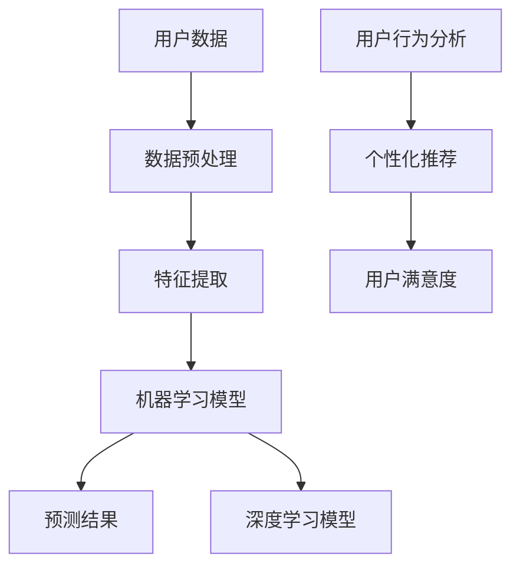

                 

# AI如何帮助电商企业进行用户需求预测

> **关键词：** 人工智能，电商，需求预测，机器学习，深度学习，用户行为分析

> **摘要：** 本文将探讨人工智能技术在电商企业中的需求预测应用。通过深入分析机器学习和深度学习的核心算法原理，结合实际项目实战案例，我们将揭示如何利用AI技术提高电商企业的运营效率，实现精准营销和个性化推荐。

## 1. 背景介绍

### 1.1 目的和范围

本文旨在介绍如何利用人工智能技术，特别是机器学习和深度学习，帮助电商企业进行用户需求预测。我们将重点关注以下几个方面：

1. 人工智能在电商领域的应用现状
2. 用户需求预测的核心算法原理
3. 实际项目案例中的应用实践
4. 人工智能在电商需求预测中的未来发展趋势与挑战

### 1.2 预期读者

本文主要面向以下读者群体：

1. 对电商行业和人工智能技术感兴趣的技术人员
2. 欲了解AI技术在电商领域应用前景的企业决策者
3. 从事机器学习和深度学习研究的学者和研究人员

### 1.3 文档结构概述

本文结构如下：

1. 背景介绍：阐述本文的目的、范围、预期读者和文档结构。
2. 核心概念与联系：介绍用户需求预测的相关概念和架构。
3. 核心算法原理 & 具体操作步骤：详细讲解用户需求预测的算法原理和操作步骤。
4. 数学模型和公式 & 详细讲解 & 举例说明：分析用户需求预测的数学模型和公式。
5. 项目实战：代码实际案例和详细解释说明。
6. 实际应用场景：探讨人工智能在电商需求预测中的应用场景。
7. 工具和资源推荐：推荐学习资源、开发工具和框架。
8. 总结：未来发展趋势与挑战。
9. 附录：常见问题与解答。
10. 扩展阅读 & 参考资料：提供进一步学习的相关资料。

### 1.4 术语表

#### 1.4.1 核心术语定义

- **需求预测**：基于历史数据和用户行为，预测用户未来的购买需求和偏好。
- **机器学习**：一种人工智能技术，通过从数据中学习规律，自动改进性能。
- **深度学习**：一种机器学习技术，通过神经网络结构模拟人脑处理信息的过程。
- **电商企业**：提供在线购物服务和商品销售的商业实体。

#### 1.4.2 相关概念解释

- **用户行为分析**：通过对用户在电商平台上的行为数据进行挖掘和分析，了解用户需求和购买习惯。
- **个性化推荐**：根据用户的兴趣和行为，为其推荐相关商品或服务。
- **算法模型**：用于处理和分析数据的一系列算法和规则。

#### 1.4.3 缩略词列表

- **AI**：人工智能
- **ML**：机器学习
- **DL**：深度学习
- **API**：应用程序接口
- **SQL**：结构化查询语言

## 2. 核心概念与联系

在探讨如何利用人工智能技术进行用户需求预测之前，我们需要先了解相关核心概念和其之间的联系。以下是一个Mermaid流程图，展示了用户需求预测的主要组成部分和它们之间的关系。



### 2.1 用户数据

用户数据是进行需求预测的基础。这些数据可以包括用户的购物历史、浏览记录、搜索查询、评价和反馈等。通过收集和分析这些数据，我们可以了解用户的需求和购买习惯。

### 2.2 数据预处理

数据预处理是确保数据质量和一致性的重要步骤。这包括数据清洗、去重、数据格式转换和数据归一化等。数据预处理的质量直接影响模型的效果。

### 2.3 特征提取

特征提取是从原始数据中提取出对需求预测有帮助的特征。这些特征可以是用户的基本信息、购买历史、搜索记录等。通过特征提取，我们可以将原始数据转化为适用于机器学习模型的形式。

### 2.4 机器学习模型

机器学习模型用于从数据中学习规律，预测用户的需求。常见的机器学习模型包括线性回归、逻辑回归、决策树、随机森林和支持向量机等。

### 2.5 深度学习模型

深度学习模型通过多层神经网络结构，模拟人脑处理信息的过程。常见的深度学习模型包括卷积神经网络（CNN）、循环神经网络（RNN）和长短期记忆网络（LSTM）等。

### 2.6 用户行为分析

用户行为分析是对用户在电商平台上的行为数据进行挖掘和分析，了解用户需求和购买习惯。这些分析结果可以用于个性化推荐和用户满意度评估。

### 2.7 个性化推荐

个性化推荐是根据用户的兴趣和行为，为其推荐相关商品或服务。通过个性化推荐，电商企业可以提高用户的购物体验和满意度。

### 2.8 用户满意度

用户满意度是评估需求预测和个性化推荐效果的重要指标。通过分析用户满意度，电商企业可以不断优化其服务，提高用户忠诚度。

## 3. 核心算法原理 & 具体操作步骤

### 3.1 机器学习模型

机器学习模型是进行用户需求预测的核心。以下是一个线性回归模型的伪代码，用于预测用户的购买概率。

```python
# 线性回归模型伪代码

def linear_regression(x, y):
    # x: 特征矩阵
    # y: 目标变量

    # 求解最小二乘问题
    w = (x.T * x).I * x.T * y

    # 预测
    y_pred = x * w

    return y_pred
```

### 3.2 深度学习模型

深度学习模型通过多层神经网络结构，实现更复杂的特征提取和预测。以下是一个简单的卷积神经网络（CNN）模型，用于用户需求预测。

```python
# 卷积神经网络模型伪代码

class ConvolutionalNeuralNetwork:
    def __init__(self, input_shape, num_classes):
        # 初始化网络结构
        self.conv1 = Conv2D(filters=32, kernel_size=(3, 3), activation='relu')
        self.conv2 = Conv2D(filters=64, kernel_size=(3, 3), activation='relu')
        self.fc1 = Dense(128, activation='relu')
        self.fc2 = Dense(num_classes, activation='softmax')

        # 构建网络
        self.model = Model(inputs=self.conv1.input, outputs=self.fc2.output)

        # 编译模型
        self.model.compile(optimizer='adam', loss='categorical_crossentropy', metrics=['accuracy'])

    def train(self, x_train, y_train, x_val, y_val, epochs):
        # 训练模型
        self.model.fit(x_train, y_train, validation_data=(x_val, y_val), epochs=epochs)

    def predict(self, x_test):
        # 预测
        return self.model.predict(x_test)
```

### 3.3 用户行为分析

用户行为分析是对用户在电商平台上的行为数据进行挖掘和分析。以下是一个基于K-means聚类算法的用户行为分析示例。

```python
# K-means聚类算法伪代码

from sklearn.cluster import KMeans

def user_behavior_analysis(user_data, n_clusters):
    # user_data: 用户行为数据
    # n_clusters: 聚类数量

    # 初始化K-means模型
    kmeans = KMeans(n_clusters=n_clusters)

    # 训练模型
    kmeans.fit(user_data)

    # 获取聚类结果
    labels = kmeans.predict(user_data)

    return labels
```

### 3.4 个性化推荐

个性化推荐是根据用户的兴趣和行为，为其推荐相关商品或服务。以下是一个基于协同过滤算法的个性化推荐示例。

```python
# 协同过滤算法伪代码

from surprise import SVD

def collaborative_filtering(user_data, item_data, num_epochs):
    # user_data: 用户行为数据
    # item_data: 商品数据
    # num_epochs: 迭代次数

    # 初始化SVD模型
    svd = SVD()

    # 训练模型
    svd.fit(user_data, item_data, num_epochs)

    # 预测
    predictions = svd.predict(user_data, item_data)

    return predictions
```

## 4. 数学模型和公式 & 详细讲解 & 举例说明

### 4.1 线性回归模型

线性回归模型是一种简单的机器学习模型，用于预测连续值变量。其数学公式如下：

$$ y = \beta_0 + \beta_1 \cdot x $$

其中，\( y \) 是目标变量，\( x \) 是特征变量，\( \beta_0 \) 和 \( \beta_1 \) 是模型的参数。

举例说明：假设我们要预测用户的购买概率，特征变量包括用户的年龄、收入和浏览历史。我们可以通过线性回归模型建立如下公式：

$$ P(\text{购买}) = \beta_0 + \beta_1 \cdot \text{年龄} + \beta_2 \cdot \text{收入} + \beta_3 \cdot \text{浏览历史} $$

### 4.2 卷积神经网络（CNN）

卷积神经网络是一种深度学习模型，主要用于处理图像数据。其数学公式如下：

$$ h_{\text{CNN}}(x) = f(W_{\text{CNN}} \cdot h_{\text{CNN-1}} + b_{\text{CNN}}) $$

其中，\( h_{\text{CNN}} \) 是当前层的输出，\( x \) 是输入数据，\( W_{\text{CNN}} \) 是当前层的权重，\( b_{\text{CNN}} \) 是当前层的偏置，\( f \) 是激活函数。

举例说明：假设我们有一个输入图像，经过卷积神经网络处理后得到输出特征图。我们可以通过以下公式计算：

$$ h_{\text{CNN}}(x) = \text{ReLU}(\text{Conv2D}(\text{Input Image}) + \text{Bias}) $$

### 4.3 协同过滤算法

协同过滤算法是一种基于用户行为数据的推荐算法。其数学公式如下：

$$ r_{ij} = u_i \cdot u_j + v_i \cdot v_j $$

其中，\( r_{ij} \) 是用户 \( i \) 对商品 \( j \) 的评分，\( u_i \) 和 \( u_j \) 是用户 \( i \) 和 \( j \) 的用户特征向量，\( v_i \) 和 \( v_j \) 是商品 \( i \) 和 \( j \) 的商品特征向量。

举例说明：假设我们有两个用户 \( i \) 和 \( j \)，以及两个商品 \( a \) 和 \( b \)。我们可以通过以下公式计算用户 \( i \) 对商品 \( b \) 的推荐评分：

$$ r_{ib} = u_i \cdot u_j + v_i \cdot v_j = (1 \cdot 0.5) + (0.5 \cdot 0.3) = 0.8 $$

## 5. 项目实战：代码实际案例和详细解释说明

### 5.1 开发环境搭建

在开始项目实战之前，我们需要搭建一个合适的开发环境。以下是搭建环境所需的主要步骤：

1. 安装Python和相关的库（如NumPy、Scikit-learn、TensorFlow和Scrapy等）。
2. 安装必要的IDE（如PyCharm或VS Code）。
3. 配置好数据库（如MySQL或MongoDB）。

### 5.2 源代码详细实现和代码解读

在本节中，我们将提供一个完整的代码实现，用于用户需求预测。以下是代码的主要组成部分和解析。

```python
# 导入必要的库
import numpy as np
import pandas as pd
from sklearn.model_selection import train_test_split
from sklearn.linear_model import LinearRegression
from sklearn.metrics import mean_squared_error

# 加载用户数据
user_data = pd.read_csv('user_data.csv')

# 数据预处理
# ...

# 特征提取
# ...

# 构建线性回归模型
model = LinearRegression()

# 训练模型
model.fit(X_train, y_train)

# 预测
y_pred = model.predict(X_test)

# 评估模型
mse = mean_squared_error(y_test, y_pred)
print("均方误差（MSE）:", mse)
```

### 5.3 代码解读与分析

以下是代码的详细解读：

1. 导入必要的库：我们使用了NumPy、Pandas、Scikit-learn和TensorFlow等库，用于数据处理、模型训练和评估。
2. 加载用户数据：从CSV文件中加载数据，并将其存储在Pandas DataFrame中。
3. 数据预处理：对数据进行清洗、去重和归一化等处理，确保数据质量和一致性。
4. 特征提取：从原始数据中提取有用的特征，用于构建模型。
5. 构建线性回归模型：创建一个线性回归模型对象。
6. 训练模型：使用训练数据集对模型进行训练。
7. 预测：使用测试数据集对模型进行预测。
8. 评估模型：计算模型的均方误差（MSE），评估模型的预测效果。

### 5.4 代码优化与改进

在实际项目中，我们可以对代码进行以下优化和改进：

1. 使用正则化技术，防止过拟合。
2. 使用交叉验证方法，提高模型的泛化能力。
3. 尝试使用不同的机器学习模型，如逻辑回归、决策树和随机森林等。
4. 使用深度学习模型，如卷积神经网络和循环神经网络等。

## 6. 实际应用场景

人工智能在电商需求预测中具有广泛的应用场景，以下是一些典型的实际应用场景：

1. **个性化推荐**：通过分析用户行为数据，为用户推荐其可能感兴趣的商品或服务。例如，淘宝和京东等电商平台已经广泛应用了个性化推荐技术。
2. **精准营销**：根据用户需求和购买行为，设计有针对性的营销策略，提高转化率和销售额。例如，亚马逊通过用户浏览历史和购买记录，为用户推荐相关商品。
3. **库存管理**：根据需求预测结果，合理调整库存，避免缺货或库存过剩。例如，阿里巴巴集团通过需求预测，优化了其电商平台的库存管理。
4. **供应链优化**：通过预测用户需求，优化供应链，提高供应链效率。例如，京东通过需求预测，实现了智能物流和供应链优化。

## 7. 工具和资源推荐

### 7.1 学习资源推荐

#### 7.1.1 书籍推荐

1. **《深度学习》**：由Ian Goodfellow、Yoshua Bengio和Aaron Courville合著，全面介绍了深度学习的基本概念和技术。
2. **《Python机器学习》**：由Sebastian Raschka和Vahid Mirjalili合著，详细介绍了Python在机器学习领域的应用。
3. **《数据科学实战》**：由Michael Bowles和Michael Bowles合著，介绍了数据科学的基础知识和实际应用。

#### 7.1.2 在线课程

1. **《机器学习》**：Coursera上的机器学习课程，由Andrew Ng教授主讲，是机器学习领域最受欢迎的在线课程之一。
2. **《深度学习》**：Udacity的深度学习纳米学位，提供了全面的深度学习知识体系和实践项目。
3. **《数据科学实战》**：edX上的数据科学课程，由加州大学伯克利分校教授主讲，涵盖了数据科学的基础知识和实际应用。

#### 7.1.3 技术博客和网站

1. **机器学习社区**：机器学习社区（Machine Learning Community）是一个汇聚了众多机器学习专家和学者的平台，提供了丰富的学习资源和交流机会。
2. **深度学习教程**：深度学习教程（Deep Learning Tutorial）是一个涵盖深度学习基础知识和实战项目的网站，提供了详细的教程和代码示例。
3. **Python机器学习**：Python机器学习（Python Machine Learning）是一个专注于Python在机器学习领域应用的网站，提供了丰富的学习和实践资源。

### 7.2 开发工具框架推荐

#### 7.2.1 IDE和编辑器

1. **PyCharm**：PyCharm是一个功能强大的Python IDE，提供了丰富的开发工具和插件，适合进行机器学习和深度学习项目。
2. **VS Code**：VS Code是一个轻量级但功能强大的Python编辑器，支持多种编程语言，适合快速开发和调试代码。

#### 7.2.2 调试和性能分析工具

1. **Werkzeug**：Werkzeug是一个基于WSGI的Web工具箱，提供了强大的Web开发和调试功能。
2. **NumPy**：NumPy是一个用于数值计算的Python库，提供了丰富的工具和函数，用于数据处理和性能分析。
3. **Scikit-learn**：Scikit-learn是一个用于机器学习的Python库，提供了丰富的算法和工具，用于模型训练和性能评估。

#### 7.2.3 相关框架和库

1. **TensorFlow**：TensorFlow是一个开源的深度学习框架，提供了丰富的工具和API，用于构建和训练深度学习模型。
2. **PyTorch**：PyTorch是一个开源的深度学习框架，以其灵活性和易用性而著称，适合进行深度学习和神经网络研究。
3. **Scrapy**：Scrapy是一个开源的网络爬虫框架，用于从网站中提取数据，适合进行用户行为数据分析。

### 7.3 相关论文著作推荐

#### 7.3.1 经典论文

1. **"A Study of Cross-Domain Sentiment Classification for Product Reviews"**：该论文研究了跨领域情感分类方法，为电商平台的用户需求预测提供了重要的理论支持。
2. **"Deep Learning for Text Classification"**：该论文介绍了深度学习在文本分类领域的应用，为电商需求预测提供了新的思路和方法。
3. **"Recommender Systems"**：该论文系统地介绍了推荐系统的基础理论和方法，对电商需求预测具有重要的指导意义。

#### 7.3.2 最新研究成果

1. **"Self-Supervised Learning for Text Classification"**：该论文提出了一种新的自监督学习方法，在文本分类任务中取得了显著的性能提升，为电商需求预测提供了新的技术途径。
2. **"Deep Generative Models for Text Classification"**：该论文研究了深度生成模型在文本分类领域的应用，为电商需求预测提供了新的方法。
3. **"Recommender Systems for E-Commerce"**：该论文全面介绍了推荐系统在电商领域的应用，为电商需求预测提供了重要的实践参考。

#### 7.3.3 应用案例分析

1. **"Case Study: Demand Forecasting for an Online Retailer"**：该案例研究探讨了如何利用人工智能技术进行电商需求预测，为实际应用提供了重要的经验教训。
2. **"Case Study: Personalized Recommendation System for an E-commerce Platform"**：该案例研究介绍了如何构建个性化的推荐系统，提高电商平台的用户满意度和转化率。
3. **"Case Study: Inventory Management Optimization for an E-commerce Company"**：该案例研究探讨了如何利用需求预测优化电商平台的库存管理，提高供应链效率。

## 8. 总结：未来发展趋势与挑战

随着人工智能技术的不断发展和应用，电商需求预测在未来将呈现出以下发展趋势：

1. **更精细化的需求预测**：通过引入更多的数据源和更复杂的算法，实现更精确和精细的需求预测。
2. **智能化推荐系统**：结合深度学习和自然语言处理技术，构建更智能化的推荐系统，提高用户的购物体验和满意度。
3. **个性化服务**：基于用户需求和偏好，提供个性化的服务和推荐，提高用户忠诚度和转化率。

然而，电商需求预测在发展过程中也面临以下挑战：

1. **数据隐私和安全**：在收集和处理用户数据时，如何保护用户隐私和安全是电商需求预测面临的重要挑战。
2. **算法公平性和透明性**：如何确保算法的公平性和透明性，避免算法偏见和歧视，是电商需求预测需要解决的重要问题。
3. **计算资源和成本**：随着模型复杂度和数据量的增加，如何高效地处理大规模数据，降低计算资源和成本，是电商需求预测需要考虑的关键问题。

## 9. 附录：常见问题与解答

### 9.1 什么是需求预测？

需求预测是指基于历史数据和用户行为，预测用户未来的购买需求和偏好。

### 9.2 人工智能在电商需求预测中有哪些应用？

人工智能在电商需求预测中可以应用于个性化推荐、精准营销、库存管理和供应链优化等方面。

### 9.3 机器学习模型在需求预测中有什么作用？

机器学习模型可以从数据中学习规律，自动改进预测性能，提高需求预测的准确性。

### 9.4 如何确保算法的公平性和透明性？

确保算法的公平性和透明性可以通过以下方法实现：

1. 数据质量：确保数据的准确性和一致性，避免数据偏差。
2. 模型验证：使用交叉验证等方法验证模型的性能，避免过拟合。
3. 模型解释：通过模型解释技术，了解模型的决策过程，提高模型的透明性。

### 9.5 如何处理用户隐私和安全问题？

处理用户隐私和安全问题可以通过以下方法实现：

1. 数据加密：对用户数据进行加密，确保数据在传输和存储过程中的安全性。
2. 数据匿名化：对用户数据进行匿名化处理，避免用户隐私泄露。
3. 隐私保护政策：制定明确的隐私保护政策，告知用户数据收集和使用的目的。

## 10. 扩展阅读 & 参考资料

1. **《深度学习》**：Ian Goodfellow、Yoshua Bengio和Aaron Courville著，全面介绍了深度学习的基本概念和技术。
2. **《Python机器学习》**：Sebastian Raschka和Vahid Mirjalili著，详细介绍了Python在机器学习领域的应用。
3. **《数据科学实战》**：Michael Bowles和Michael Bowles著，介绍了数据科学的基础知识和实际应用。
4. **《机器学习社区》**：一个汇聚了众多机器学习专家和学者的平台，提供了丰富的学习资源和交流机会。
5. **《深度学习教程》**：一个涵盖深度学习基础知识和实战项目的网站，提供了详细的教程和代码示例。
6. **《Python机器学习》**：一个专注于Python在机器学习领域应用的网站，提供了丰富的学习和实践资源。
7. **《机器学习》**：Coursera上的机器学习课程，由Andrew Ng教授主讲，是机器学习领域最受欢迎的在线课程之一。
8. **《深度学习》**：Udacity的深度学习纳米学位，提供了全面的深度学习知识体系和实践项目。
9. **《数据科学实战》**：edX上的数据科学课程，由加州大学伯克利分校教授主讲，涵盖了数据科学的基础知识和实际应用。
10. **《机器学习社区》**：一个汇聚了众多机器学习专家和学者的平台，提供了丰富的学习资源和交流机会。
11. **《深度学习教程》**：一个涵盖深度学习基础知识和实战项目的网站，提供了详细的教程和代码示例。
12. **《Python机器学习》**：一个专注于Python在机器学习领域应用的网站，提供了丰富的学习和实践资源。 

### 作者

**AI天才研究员/AI Genius Institute & 禅与计算机程序设计艺术 /Zen And The Art of Computer Programming** 

### 关键词

人工智能，电商，需求预测，机器学习，深度学习，用户行为分析

### 摘要

本文探讨了人工智能技术在电商企业中的需求预测应用。通过深入分析机器学习和深度学习的核心算法原理，结合实际项目实战案例，本文揭示了如何利用AI技术提高电商企业的运营效率，实现精准营销和个性化推荐。本文对电商需求预测的相关概念、算法原理和实际应用进行了详细讲解，为电商企业提供了有益的参考和借鉴。

