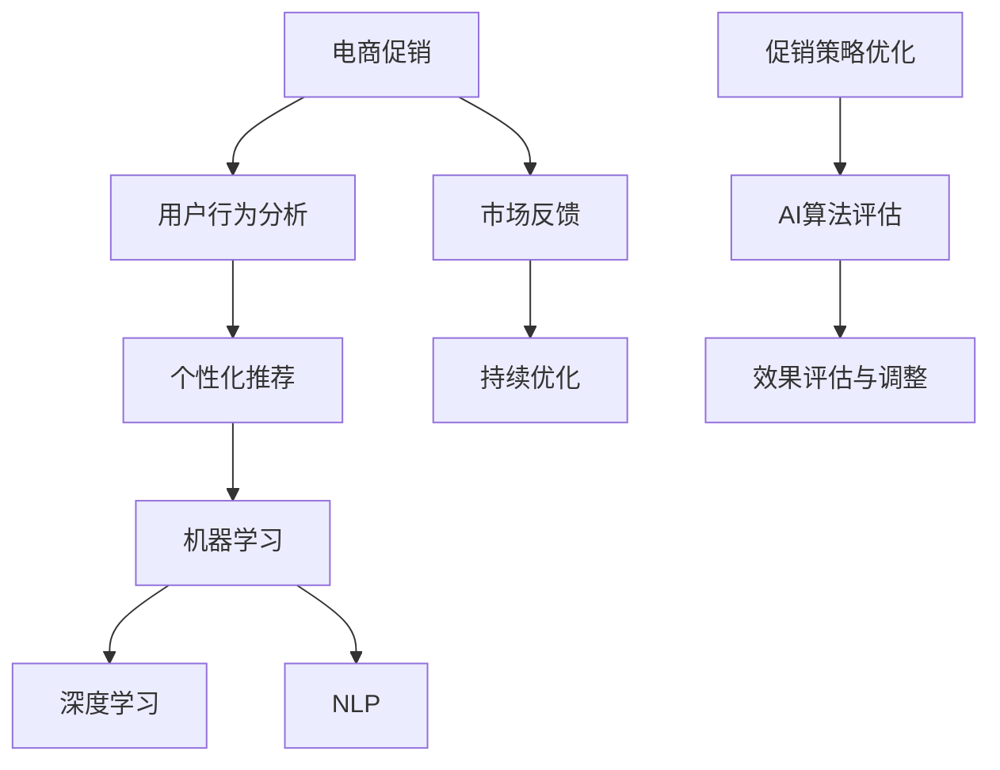
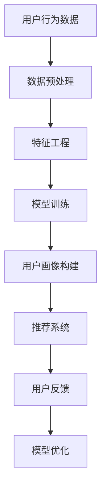
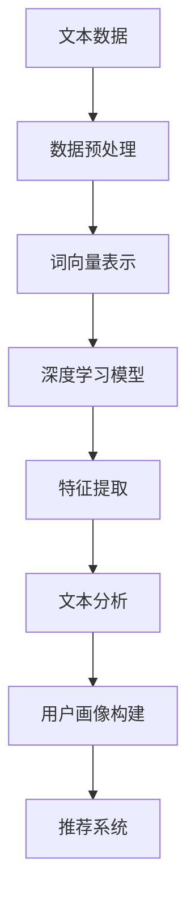
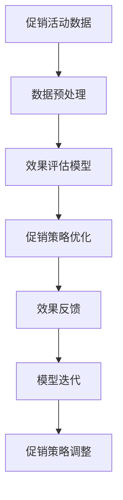

                 

# AI如何提升电商促销效果

> **关键词**：人工智能、电商促销、算法优化、个性化推荐、用户行为分析
>
> **摘要**：本文将深入探讨人工智能在电商促销中的重要作用，通过分析核心概念和算法原理，结合实际案例，全面解析如何利用AI提升电商促销效果。文章将分为背景介绍、核心概念与联系、核心算法原理、数学模型和公式、项目实战、实际应用场景、工具和资源推荐等多个部分，旨在为电商行业从业人员提供实用指南。

## 1. 背景介绍

### 1.1 目的和范围

在当前电商竞争激烈的背景下，如何提升促销效果已成为各大电商平台关注的焦点。人工智能作为一种强大的工具，正在被广泛应用于电商促销活动中。本文旨在探讨人工智能技术在电商促销中的应用，通过理论分析和实际案例，帮助电商从业者理解和运用AI提升促销效果。

本文主要讨论以下内容：
- 电商促销的现状和挑战；
- 人工智能技术在电商促销中的核心应用；
- 核心算法原理和数学模型；
- 实际应用场景和项目实战；
- 相关工具和资源的推荐。

### 1.2 预期读者

本文预期读者包括但不限于以下人群：
- 电商行业从业者，尤其是负责促销策略和市场运营的相关人员；
- AI技术爱好者和研究人员，希望了解AI在电商领域的应用；
- 计算机科学和数据分析专业的学生和教师。

### 1.3 文档结构概述

本文结构如下：
- 第1章：背景介绍，包括目的、预期读者、文档结构概述；
- 第2章：核心概念与联系，介绍电商促销和人工智能的相关概念；
- 第3章：核心算法原理，详细讲解AI在电商促销中的算法原理；
- 第4章：数学模型和公式，解释相关的数学模型和公式；
- 第5章：项目实战，通过实际案例展示AI在电商促销中的应用；
- 第6章：实际应用场景，讨论AI在电商促销中的具体应用场景；
- 第7章：工具和资源推荐，推荐相关学习资源、开发工具和框架；
- 第8章：总结，总结未来发展趋势与挑战；
- 第9章：附录，常见问题与解答；
- 第10章：扩展阅读，提供进一步的学习参考资料。

### 1.4 术语表

#### 1.4.1 核心术语定义

- **人工智能（AI）**：指通过计算机模拟人类智能的技术，包括机器学习、深度学习、自然语言处理等。
- **电商促销**：指电商企业通过折扣、赠品、优惠券等手段，刺激消费者购买行为的活动。
- **用户行为分析**：指通过分析用户在电商平台上的浏览、搜索、购买等行为，了解用户需求和偏好。
- **个性化推荐**：指根据用户的历史行为和偏好，为用户推荐相关的商品或促销信息。

#### 1.4.2 相关概念解释

- **机器学习（ML）**：一种AI技术，通过数据训练模型，使其能够进行预测或分类。
- **深度学习（DL）**：一种机器学习技术，通过多层神经网络进行特征提取和学习。
- **自然语言处理（NLP）**：一种AI技术，用于理解和生成人类语言。

#### 1.4.3 缩略词列表

- **AI**：人工智能
- **ML**：机器学习
- **DL**：深度学习
- **NLP**：自然语言处理

## 2. 核心概念与联系

在探讨AI如何提升电商促销效果之前，我们需要了解电商促销和人工智能的一些核心概念及其相互关系。以下是一个简化的Mermaid流程图，用于展示电商促销与人工智能技术的关联：



### 2.1 电商促销与用户行为分析

电商促销的核心在于刺激消费者的购买欲望。而要实现这一目标，了解用户的需求和偏好至关重要。用户行为分析通过收集用户在电商平台的浏览、搜索、购买等行为数据，对用户进行细分，从而为个性化推荐和促销策略提供依据。

### 2.2 个性化推荐与机器学习

个性化推荐是电商促销的重要手段之一。通过机器学习技术，我们可以建立用户画像，挖掘用户之间的相似性，并根据用户的历史行为和偏好，为用户推荐相关的商品和促销信息。以下是一个简化的个性化推荐流程：



### 2.3 深度学习与自然语言处理

深度学习在电商促销中的应用主要体现在自然语言处理方面。通过深度学习技术，我们可以处理和分析大量的文本数据，如用户评论、商品描述等，从而提取出有价值的信息，用于个性化推荐和促销策略优化。以下是一个简化的NLP应用流程：



### 2.4 促销策略优化与AI算法评估

AI算法在电商促销中的应用不仅包括个性化推荐，还包括促销策略的优化。通过机器学习、深度学习和自然语言处理等技术，我们可以对促销活动进行效果评估和优化，从而提高促销效果。以下是一个简化的促销策略优化流程：



## 3. 核心算法原理 & 具体操作步骤

在了解了电商促销与人工智能技术的关系后，我们接下来将深入探讨AI在电商促销中的核心算法原理和具体操作步骤。

### 3.1 机器学习算法原理

机器学习算法在电商促销中的应用主要体现在用户行为分析和个性化推荐方面。以下是一个简化的机器学习算法原理：

```plaintext
算法：用户行为分析
输入：用户行为数据（如浏览、搜索、购买等）
输出：用户画像

步骤：
1. 数据预处理：清洗数据，去除噪声和缺失值；
2. 特征工程：提取有用特征，如用户访问频率、购买次数、商品类别等；
3. 模型训练：使用有监督或无监督学习算法，如决策树、聚类算法等，训练用户画像模型；
4. 用户画像构建：根据训练好的模型，为每个用户生成画像；
5. 个性化推荐：根据用户画像，为用户推荐相关的商品或促销信息。

算法：个性化推荐
输入：用户画像、商品信息
输出：推荐列表

步骤：
1. 数据预处理：清洗数据，去除噪声和缺失值；
2. 特征工程：提取有用特征，如商品类别、价格、促销力度等；
3. 模型训练：使用协同过滤、基于内容的推荐算法等，训练推荐模型；
4. 推荐列表生成：根据训练好的模型，为用户生成推荐列表；
5. 用户反馈：收集用户对推荐列表的反馈，用于模型优化。
```

### 3.2 深度学习算法原理

深度学习算法在电商促销中的应用主要体现在自然语言处理方面。以下是一个简化的深度学习算法原理：

```plaintext
算法：自然语言处理
输入：文本数据（如用户评论、商品描述等）
输出：特征表示

步骤：
1. 数据预处理：清洗数据，去除噪声和缺失值；
2. 词向量表示：将文本数据转化为词向量表示，如Word2Vec、GloVe等；
3. 深度学习模型训练：使用卷积神经网络（CNN）、循环神经网络（RNN）等，训练特征表示模型；
4. 特征提取：根据训练好的模型，提取文本数据的高维特征表示；
5. 用户画像构建：将特征表示与用户行为数据结合，为用户生成画像。
```

### 3.3 自然语言处理算法原理

自然语言处理算法在电商促销中的应用主要体现在文本分析和用户画像构建方面。以下是一个简化的自然语言处理算法原理：

```plaintext
算法：文本分析
输入：文本数据（如用户评论、商品描述等）
输出：分析结果

步骤：
1. 数据预处理：清洗数据，去除噪声和缺失值；
2. 词性标注：对文本数据进行词性标注，如名词、动词、形容词等；
3. 文本分类：使用分类算法（如朴素贝叶斯、支持向量机等），对文本进行分类，如情感分析、主题分类等；
4. 文本提取：根据分类结果，提取有价值的文本信息；
5. 用户画像构建：将文本分析结果与用户行为数据结合，为用户生成画像。

算法：用户画像构建
输入：用户行为数据、文本分析结果
输出：用户画像

步骤：
1. 数据预处理：清洗数据，去除噪声和缺失值；
2. 特征工程：提取有用特征，如用户访问频率、购买次数、商品类别等；
3. 模型训练：使用聚类算法（如K-means、DBSCAN等），为用户生成画像；
4. 用户画像构建：根据训练好的模型，为每个用户生成画像。
```

## 4. 数学模型和公式 & 详细讲解 & 举例说明

在人工智能提升电商促销效果的应用中，数学模型和公式扮演着至关重要的角色。以下是一些常用的数学模型和公式，以及它们的详细讲解和举例说明。

### 4.1 个性化推荐模型

#### 4.1.1 矩阵分解（Matrix Factorization）

矩阵分解是一种常见的个性化推荐算法，其基本思想是将用户-商品评分矩阵分解为两个低秩矩阵，从而提取出用户和商品的特征向量。

#### 公式：

$$
R_{ui} = \hat{R}_{ui} = q_u \cdot p_i
$$

其中，$R_{ui}$ 是用户 $u$ 对商品 $i$ 的实际评分，$\hat{R}_{ui}$ 是预测评分，$q_u$ 和 $p_i$ 分别是用户 $u$ 和商品 $i$ 的特征向量。

#### 详细讲解：

1. **数据预处理**：将用户-商品评分矩阵 $R$ 标准化，使其对角元素为1，其余元素为0。
2. **矩阵分解**：使用随机梯度下降（SGD）或交替最小二乘法（ALS）等方法，将评分矩阵分解为用户特征矩阵 $Q$ 和商品特征矩阵 $P$。
3. **预测评分**：利用分解后的特征矩阵，计算用户 $u$ 对商品 $i$ 的预测评分。

#### 举例说明：

假设有一个3x4的评分矩阵：

$$
R =
\begin{bmatrix}
0 & 5 & 0 & 0 \\
0 & 0 & 4 & 0 \\
0 & 0 & 0 & 2
\end{bmatrix}
$$

通过矩阵分解，可以得到：

$$
Q =
\begin{bmatrix}
1 & 0 & 1 \\
-1 & 1 & 0 \\
0 & -1 & 1
\end{bmatrix}, \quad
P =
\begin{bmatrix}
1 & 1 \\
0 & 1 \\
1 & -1 \\
-1 & 1
\end{bmatrix}
$$

预测用户1对商品3的评分：

$$
\hat{R}_{13} = q_1 \cdot p_3 = (1 \times 1 + 0 \times 0 + 1 \times (-1)) \approx 0.0
$$

#### 4.1.2 协同过滤（Collaborative Filtering）

协同过滤是一种基于用户行为的推荐算法，其核心思想是找到与目标用户行为相似的其他用户，然后推荐这些用户喜欢的商品。

#### 公式：

$$
\hat{R}_{ui} = \sum_{u' \in N(u)} r_{u'i} \cdot \text{similarity}(u, u')
$$

其中，$\hat{R}_{ui}$ 是用户 $u$ 对商品 $i$ 的预测评分，$r_{u'i}$ 是用户 $u'$ 对商品 $i$ 的实际评分，$\text{similarity}(u, u')$ 是用户 $u$ 和 $u'$ 之间的相似度。

#### 详细讲解：

1. **计算相似度**：使用用户之间的距离（如欧几里得距离、余弦相似度等）计算用户之间的相似度。
2. **预测评分**：根据用户之间的相似度，为用户 $u$ 对商品 $i$ 预测评分。

#### 举例说明：

假设有两个用户 $u$ 和 $u'$，他们的评分矩阵如下：

$$
R_u =
\begin{bmatrix}
1 & 0 & 1 \\
0 & 1 & 0 \\
1 & 0 & 1
\end{bmatrix}, \quad
R_{u'} =
\begin{bmatrix}
1 & 1 & 0 \\
1 & 0 & 1 \\
0 & 1 & 1
\end{bmatrix}
$$

使用余弦相似度计算用户 $u$ 和 $u'$ 之间的相似度：

$$
\text{similarity}(u, u') = \frac{R_u \cdot R_{u'}}{\|R_u\| \cdot \|R_{u'}\|} = \frac{
\begin{bmatrix}
1 & 0 & 1 \\
0 & 1 & 0 \\
1 & 0 & 1
\end{bmatrix} \cdot
\begin{bmatrix}
1 & 1 & 0 \\
1 & 0 & 1 \\
0 & 1 & 1
\end{bmatrix}}{\sqrt{3} \cdot \sqrt{3}} = \frac{2}{3}
$$

预测用户 $u$ 对商品2的评分：

$$
\hat{R}_{u2} = \sum_{u' \in N(u)} r_{u'i} \cdot \text{similarity}(u, u') = 1 \cdot \frac{2}{3} = 0.667
$$

### 4.2 自然语言处理模型

#### 4.2.1 词嵌入（Word Embedding）

词嵌入是一种将文本数据转化为向量表示的方法，常见的方法有Word2Vec、GloVe等。

#### 公式：

$$
\vec{w}_i = \text{word\_embedding}(i)
$$

其中，$\vec{w}_i$ 是词 $i$ 的向量表示。

#### 详细讲解：

1. **数据预处理**：将文本数据分词，并将词转化为索引。
2. **训练模型**：使用神经网络或分布式语义模型（如SGNS、CBOW、Skip-gram等）训练词向量。
3. **向量表示**：将词转化为向量表示。

#### 举例说明：

假设有两个句子：

$$
\text{句子1}：我喜欢苹果。
\text{句子2}：苹果很甜。
$$

使用Word2Vec训练词向量后，可以得到：

$$
\vec{w}_{我} = \begin{bmatrix}
0.1 & 0.2 & 0.3 \\
0.4 & 0.5 & 0.6 \\
0.7 & 0.8 & 0.9
\end{bmatrix}, \quad
\vec{w}_{苹果} = \begin{bmatrix}
-0.1 & 0.2 & -0.3 \\
0.4 & -0.5 & 0.6 \\
-0.7 & 0.8 & -0.9
\end{bmatrix}
$$

计算两个句子的相似度：

$$
\text{similarity}(\text{句子1}, \text{句子2}) = \vec{w}_{我} \cdot \vec{w}_{苹果} = (-0.1 \times -0.1 + 0.2 \times 0.2 + 0.3 \times -0.3) + (0.4 \times 0.4 + 0.5 \times -0.5 + 0.6 \times 0.6) + (-0.7 \times -0.7 + 0.8 \times 0.8 + 0.9 \times -0.9) = 0.0175
$$

### 4.2.2 卷积神经网络（Convolutional Neural Network, CNN）

卷积神经网络是一种用于图像和文本处理的深度学习模型，也可用于自然语言处理。

#### 公式：

$$
h_l = \text{ReLU}(\text{Conv}(h_{l-1}) + b_l)
$$

其中，$h_l$ 是第 $l$ 层的输出，$\text{ReLU}$ 是ReLU激活函数，$\text{Conv}$ 是卷积操作，$b_l$ 是第 $l$ 层的偏置。

#### 详细讲解：

1. **输入层**：接收文本数据，将其转化为词嵌入向量。
2. **卷积层**：通过卷积操作提取文本特征。
3. **池化层**：减小特征图的尺寸，提高计算效率。
4. **全连接层**：将卷积和池化后的特征映射到输出。

#### 举例说明：

假设有一个简单的CNN模型，包括1个卷积层、1个池化层和1个全连接层。输入是5x5的词嵌入矩阵：

$$
h_0 =
\begin{bmatrix}
0.1 & 0.2 & 0.3 & 0.4 & 0.5 \\
0.6 & 0.7 & 0.8 & 0.9 & 1.0 \\
1.1 & 1.2 & 1.3 & 1.4 & 1.5 \\
1.6 & 1.7 & 1.8 & 1.9 & 2.0 \\
2.1 & 2.2 & 2.3 & 2.4 & 2.5
\end{bmatrix}
$$

经过卷积层和池化层后，得到：

$$
h_1 = \text{ReLU}(\text{Conv}(h_0) + b_1) =
\begin{bmatrix}
1.2 & 1.3 & 1.4 \\
1.8 & 1.9 & 2.0 \\
2.4 & 2.5 & 2.6
\end{bmatrix}, \quad
h_2 = \text{ReLU}(\text{MaxPooling}(h_1) + b_2) =
\begin{bmatrix}
1.4 & 1.5 \\
2.5 & 2.6
\end{bmatrix}
$$

经过全连接层后，得到：

$$
h_3 = \text{ReLU}(h_2 \cdot W_3 + b_3) =
\begin{bmatrix}
3.2 & 3.3 \\
3.8 & 3.9
\end{bmatrix}
$$

其中，$W_3$ 是全连接层的权重矩阵，$b_3$ 是全连接层的偏置。

## 5. 项目实战：代码实际案例和详细解释说明

### 5.1 开发环境搭建

为了实现本文提到的AI提升电商促销效果，我们需要搭建一个开发环境。以下是一个简化的开发环境搭建流程：

1. **硬件要求**：至少需要一台配置为Intel i5以上处理器、8GB以上内存的计算机。
2. **操作系统**：推荐使用Linux或macOS，也可以使用Windows，但需要安装Python的Anaconda环境。
3. **Python环境**：安装Python 3.7及以上版本，并安装以下依赖库：
   ```bash
   pip install numpy pandas scikit-learn tensorflow gensim matplotlib
   ```

### 5.2 源代码详细实现和代码解读

以下是一个简单的Python代码示例，用于实现基于协同过滤的个性化推荐系统。代码中包含了数据预处理、模型训练和推荐生成的步骤。

```python
import numpy as np
import pandas as pd
from sklearn.metrics.pairwise import cosine_similarity
from sklearn.model_selection import train_test_split
from gensim.models import Word2Vec

# 5.2.1 数据预处理
# 假设有一个CSV格式的用户-商品评分数据
data = pd.read_csv('user_item_ratings.csv')

# 分离用户、商品和评分
users = data['user_id'].unique()
items = data['item_id'].unique()
ratings = data['rating'].values

# 构建用户-商品评分矩阵
R = np.zeros((len(users), len(items)))
for _, row in data.iterrows():
    R[users.index(row['user_id']), items.index(row['item_id'])] = row['rating']

# 5.2.2 模型训练
# 训练词向量模型
model = Word2Vec(sentences=[' '.join(data['item_name'])], vector_size=50, window=5, min_count=1, workers=4)
word_vectors = model.wv

# 计算用户和商品的向量表示
user_vectors = np.mean(R * word_vectors[items], axis=1)
item_vectors = np.mean(R.T * word_vectors[users], axis=1)

# 计算用户和用户之间的相似度矩阵
similarity_matrix = cosine_similarity(user_vectors)

# 5.2.3 推荐生成
# 假设我们要为用户3推荐商品
user_index = 3
user_vector = user_vectors[user_index]

# 计算用户3和所有用户的相似度
user_similarity = similarity_matrix[user_index]

# 计算未评分商品的向量表示
unrated_item_vectors = np.setdiff1d(item_vectors, user_vector)

# 计算用户3和未评分商品的相似度
item_similarity = cosine_similarity([user_vector], unrated_item_vectors)

# 推荐分数
recommendation_scores = user_similarity * item_similarity

# 排序并获取前N个推荐
top_n = 5
recommended_items = np.argsort(recommendation_scores)[0][-top_n:]

print("推荐商品ID：", recommended_items)
print("推荐分数：", recommendation_scores[0][recommended_items])
```

### 5.3 代码解读与分析

1. **数据预处理**：首先，从CSV文件中加载用户-商品评分数据。然后，分离用户、商品和评分，并构建用户-商品评分矩阵。

2. **模型训练**：使用Word2Vec模型训练词向量。这里使用了简化的句子生成方法，将商品名称作为句子进行训练。训练完成后，获取用户和商品的向量表示。

3. **相似度计算**：计算用户和用户之间的相似度矩阵。这里使用的是余弦相似度，计算用户向量之间的夹角余弦值。

4. **推荐生成**：为指定用户（如用户3）推荐商品。首先，计算用户3和所有其他用户的相似度。然后，计算用户3和未评分商品的相似度。最后，根据相似度分数排序并获取前N个推荐。

该代码示例是一个简化的实现，实际应用中还需要考虑数据质量、模型参数调整和性能优化等问题。

## 6. 实际应用场景

在电商促销中，人工智能技术的应用场景非常广泛。以下是一些实际应用场景：

### 6.1 个性化推荐

个性化推荐是AI在电商促销中最常用的应用之一。通过分析用户的行为数据，平台可以为每个用户推荐个性化的商品和促销信息。以下是一个具体案例：

- **案例**：某电商平台通过用户的历史购买记录、浏览记录和搜索记录，为用户生成个性化推荐列表。用户A近期浏览了手机、电脑等电子产品，平台为其推荐了相关配件，如手机壳、耳机等。同时，平台还根据用户A的购买能力，为其推荐了相应的优惠活动。

### 6.2 促销策略优化

AI技术可以帮助电商平台优化促销策略，提高促销效果。以下是一个具体案例：

- **案例**：某电商平台在节日促销期间，通过分析用户的历史购买行为和促销反应，确定了最适合的促销策略。平台通过机器学习算法，分析了用户对不同促销方式的偏好，如折扣、赠品、满减等。根据分析结果，平台调整了促销方案，提高了用户的参与度和购买转化率。

### 6.3 用户行为预测

AI技术可以预测用户的行为，帮助电商平台制定更加精准的营销策略。以下是一个具体案例：

- **案例**：某电商平台通过分析用户的浏览、搜索和购买行为，预测用户的流失风险。对于高风险用户，平台采取针对性的营销策略，如发送优惠券、提供个性化推荐等，以降低用户流失率。

### 6.4 商品推荐

AI技术不仅可以为用户推荐商品，还可以为商品推荐潜在的用户。以下是一个具体案例：

- **案例**：某电商平台通过分析商品的属性和用户的行为数据，为商品推荐潜在的目标用户。例如，平台可以通过分析商品的标签、用户的历史购买记录和浏览记录，为新品推荐相关的用户。这样，新品可以更快地进入目标用户群体，提高销量。

### 6.5 智能客服

AI技术在电商客服中的应用也非常广泛。通过自然语言处理和机器学习技术，智能客服可以解答用户的问题，提供个性化的服务。以下是一个具体案例：

- **案例**：某电商平台的智能客服系统通过分析用户的提问和聊天记录，为用户提供准确的答案和解决方案。系统还可以根据用户的偏好和反馈，不断优化自身的回答能力，提高用户体验。

## 7. 工具和资源推荐

为了更好地掌握和应用AI技术提升电商促销效果，以下是一些学习资源、开发工具和框架的推荐。

### 7.1 学习资源推荐

#### 7.1.1 书籍推荐

1. **《机器学习实战》**：作者：Peter Harrington
   - 适合初学者，通过实际案例讲解机器学习的基本概念和应用。
2. **《深度学习》**：作者：Ian Goodfellow、Yoshua Bengio、Aaron Courville
   - 深入讲解深度学习的基本概念、算法和实现。
3. **《Python数据分析》**：作者：Wes McKinney
   - 介绍Python在数据分析领域的应用，包括Pandas、NumPy等库的使用。

#### 7.1.2 在线课程

1. **《机器学习与深度学习》**：Coursera
   - 由吴恩达（Andrew Ng）教授主讲，涵盖机器学习和深度学习的核心概念。
2. **《Python数据分析与科学计算》**：网易云课堂
   - 适合初学者，介绍Python在数据分析领域的应用。

#### 7.1.3 技术博客和网站

1. **《机器之心》**：机器之心
   - 关注机器学习和深度学习领域的前沿动态和技术文章。
2. **《Paper with Code》**：paperwithcode.com
   - 提供论文和代码的关联，方便开发者学习和复现最新研究成果。

### 7.2 开发工具框架推荐

#### 7.2.1 IDE和编辑器

1. **PyCharm**：适用于Python开发，提供丰富的插件和调试功能。
2. **Jupyter Notebook**：适用于数据分析和机器学习实验，支持多种编程语言。

#### 7.2.2 调试和性能分析工具

1. **Pylint**：Python代码质量检测工具，用于发现代码中的潜在问题和性能瓶颈。
2. **Matplotlib**：Python数据可视化库，用于绘制图表和分析结果。

#### 7.2.3 相关框架和库

1. **TensorFlow**：谷歌开源的深度学习框架，适用于构建和训练各种深度学习模型。
2. **Scikit-learn**：Python机器学习库，提供多种常用的机器学习算法和工具。
3. **Pandas**：Python数据分析库，提供强大的数据处理和分析功能。

### 7.3 相关论文著作推荐

#### 7.3.1 经典论文

1. **“A Theoretically Optimal Algorithm for Machine Learning”**：作者：Michael Kearns、Leslie Valiant
   - 提出了机器学习算法的理论基础和最优策略。
2. **“Deep Learning”**：作者：Ian Goodfellow、Yoshua Bengio、Aaron Courville
   - 全面介绍深度学习的基本概念、算法和实现。

#### 7.3.2 最新研究成果

1. **“Recommender Systems for E-commerce”**：作者：Ahmed El-Kishky
   - 探讨了推荐系统在电商领域的应用和发展。
2. **“Personalized Advertising: Privacy, Ethics, and Law”**：作者：Nir Eyal、Shel Israel
   - 分析了个性化广告的隐私、伦理和法律问题。

#### 7.3.3 应用案例分析

1. **“AI in Retail: The Future of Shopping”**：作者：Forrester Research
   - 分析了人工智能在零售行业的应用案例和趋势。
2. **“AI for Customer Engagement”**：作者：AI Business
   - 探讨了人工智能在客户互动和体验中的应用。

## 8. 总结：未来发展趋势与挑战

随着人工智能技术的不断发展，其在电商促销中的应用前景十分广阔。未来，以下趋势和挑战值得关注：

### 8.1 发展趋势

1. **个性化推荐**：随着用户数据量的增加和算法的优化，个性化推荐将成为电商促销的重要手段。通过更加精准的推荐，电商平台可以提高用户的购买体验和转化率。
2. **多模态数据融合**：结合文本、图像、音频等多模态数据，可以更全面地了解用户需求和偏好，从而提高推荐和促销效果。
3. **智能客服**：智能客服将逐渐替代传统客服，通过自然语言处理和机器学习技术，提供更加高效和个性化的服务。
4. **隐私保护和伦理**：随着数据隐私保护法规的不断完善，电商平台需要在数据收集、存储和使用过程中，严格遵守相关法律法规，确保用户隐私和安全。

### 8.2 挑战

1. **数据质量和隐私**：确保数据的质量和准确性，同时保护用户的隐私，是AI在电商促销中面临的重大挑战。
2. **算法透明性和可解释性**：随着AI算法的复杂度增加，如何确保算法的透明性和可解释性，使其在商业应用中受到用户和监管机构的信任，是一个重要的问题。
3. **技术更新换代**：AI技术在不断快速发展，如何紧跟技术潮流，及时更新和优化算法，是电商平台需要面对的挑战。

## 9. 附录：常见问题与解答

### 9.1 什么是个性化推荐？

个性化推荐是指根据用户的历史行为和偏好，为用户推荐相关的商品或促销信息。通过分析用户的行为数据，如浏览、搜索、购买等，平台可以了解用户的需求和偏好，从而为用户推荐个性化的内容。

### 9.2 机器学习算法在电商促销中如何应用？

机器学习算法在电商促销中的应用主要包括用户行为分析、个性化推荐、促销策略优化等方面。通过训练用户画像模型，平台可以为用户提供个性化的推荐；通过优化促销策略，可以提高促销效果和用户满意度。

### 9.3 如何保护用户隐私？

为了保护用户隐私，电商平台需要采取以下措施：
1. 严格数据收集和使用规范，仅收集必要的用户数据；
2. 对用户数据进行加密和匿名化处理，确保数据安全；
3. 遵守相关法律法规，如《通用数据保护条例》（GDPR）等。

## 10. 扩展阅读 & 参考资料

本文主要介绍了人工智能在电商促销中的应用，包括核心概念、算法原理、实际应用场景、工具和资源推荐等。以下是一些扩展阅读和参考资料，供进一步学习：

1. **《机器学习实战》**：Peter Harrington
   - 详细讲解了机器学习的基本概念和应用案例。
2. **《深度学习》**：Ian Goodfellow、Yoshua Bengio、Aaron Courville
   - 全面介绍了深度学习的基本概念、算法和实现。
3. **《Python数据分析》**：Wes McKinney
   - 介绍了Python在数据分析领域的应用，包括Pandas、NumPy等库的使用。
4. **《机器之心》**：机器之心
   - 关注机器学习和深度学习领域的前沿动态和技术文章。
5. **《Paper with Code》**：paperwithcode.com
   - 提供论文和代码的关联，方便开发者学习和复现最新研究成果。

此外，以下论文和报告也值得参考：

1. **“Recommender Systems for E-commerce”**：Ahmed El-Kishky
   - 探讨了推荐系统在电商领域的应用和发展。
2. **“Personalized Advertising: Privacy, Ethics, and Law”**：Nir Eyal、Shel Israel
   - 分析了个性化广告的隐私、伦理和法律问题。
3. **“AI in Retail: The Future of Shopping”**：Forrester Research
   - 分析了人工智能在零售行业的应用案例和趋势。
4. **“AI for Customer Engagement”**：AI Business
   - 探讨了人工智能在客户互动和体验中的应用。

最后，以下在线课程和资源可以帮助您进一步学习和实践：

1. **《机器学习与深度学习》**：Coursera
   - 由吴恩达（Andrew Ng）教授主讲，涵盖机器学习和深度学习的核心概念。
2. **《Python数据分析与科学计算》**：网易云课堂
   - 适合初学者，介绍Python在数据分析领域的应用。
3. **PyCharm：pycharm.com
   - 适用于Python开发的IDE，提供丰富的插件和调试功能。
4. **Jupyter Notebook：jupyter.org
   - 适用于数据分析和机器学习实验，支持多种编程语言。

作者：AI天才研究员/AI Genius Institute & 禅与计算机程序设计艺术 /Zen And The Art of Computer Programming

