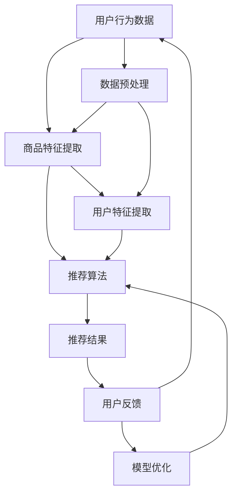

                 


# AI如何提升电商平台的商品推荐准确率

> 关键词：人工智能、电商平台、商品推荐、准确率、机器学习、算法优化

> 摘要：本文将深入探讨人工智能技术在提升电商平台商品推荐准确率方面的应用。通过介绍核心概念、算法原理、数学模型和实际项目案例，本文旨在为读者提供全面的技术分析和实践指导，帮助电商平台更好地理解和应用人工智能技术，从而提高用户满意度和商业价值。

## 1. 背景介绍

### 1.1 目的和范围

本文的目标是详细分析并解释如何通过人工智能技术提升电商平台的商品推荐准确率。我们将在以下几个维度进行探讨：

- **核心概念与联系**：介绍商品推荐系统的基础概念，包括用户行为分析、商品特征提取和数据集构建。
- **核心算法原理**：阐述常用的商品推荐算法，如协同过滤、基于内容的推荐和深度学习等。
- **数学模型和公式**：解析推荐系统的数学基础，包括相似性度量、评分预测和损失函数等。
- **项目实战**：通过实际代码案例展示算法的实现和应用。
- **实际应用场景**：分析不同电商平台的商品推荐实践，探讨成功和挑战。
- **工具和资源推荐**：提供学习资源、开发工具和最新研究成果，助力读者深入学习和实践。

### 1.2 预期读者

本文主要面向以下读者群体：

- **人工智能和大数据工程师**：希望了解如何将人工智能技术应用于电商推荐系统的技术人员。
- **电商行业从业者**：需要提升电商平台商品推荐准确率的相关岗位人员。
- **学术研究人员**：对推荐系统研究感兴趣的研究人员和学者。

### 1.3 文档结构概述

本文将按照以下结构展开：

- **第1章**：背景介绍，概述目的、范围和预期读者。
- **第2章**：核心概念与联系，介绍商品推荐系统的基础知识。
- **第3章**：核心算法原理，讲解常用的推荐算法。
- **第4章**：数学模型和公式，分析推荐系统的数学基础。
- **第5章**：项目实战，展示实际代码案例。
- **第6章**：实际应用场景，探讨不同平台的实践。
- **第7章**：工具和资源推荐，提供学习资源和发展工具。
- **第8章**：总结，展望未来发展趋势和挑战。
- **第9章**：附录，常见问题与解答。
- **第10章**：扩展阅读，推荐进一步学习资源。

### 1.4 术语表

#### 1.4.1 核心术语定义

- **电商平台**：在线销售商品的平台，如亚马逊、淘宝等。
- **商品推荐**：根据用户历史行为和偏好，向用户推荐相关商品的过程。
- **协同过滤**：基于用户行为数据，通过计算用户之间的相似度来进行商品推荐。
- **内容推荐**：基于商品的属性和描述，将相似商品推荐给用户。
- **深度学习**：一种基于多层神经网络的人工智能技术，可以自动从数据中学习特征。

#### 1.4.2 相关概念解释

- **用户行为分析**：通过分析用户的浏览、购买、评价等行为，了解用户的兴趣和偏好。
- **商品特征提取**：从商品描述中提取关键属性，如类别、品牌、价格等。
- **数据集构建**：收集并整理用于训练和测试推荐系统的数据。

#### 1.4.3 缩略词列表

- **ML**：机器学习（Machine Learning）
- **DL**：深度学习（Deep Learning）
- **CF**：协同过滤（Collaborative Filtering）
- **CTR**：点击率（Click-Through Rate）
- **UV**：独立访客数（Unique Visitors）

## 2. 核心概念与联系

在深入探讨如何提升电商平台商品推荐准确率之前，我们需要先了解一些核心概念和它们之间的联系。以下是一个基于Mermaid的流程图，展示了商品推荐系统的基本架构：



### 2.1 用户行为数据

用户行为数据是商品推荐系统的核心输入之一。这些数据包括用户的浏览记录、购买历史、评价、收藏等。通过分析这些数据，我们可以了解用户的兴趣和行为模式，从而进行更精准的推荐。

### 2.2 商品特征提取

商品特征提取是将商品的基本属性（如类别、品牌、价格等）转化为数字特征的过程。这些特征将用于训练推荐模型，以便模型能够理解不同商品之间的相似性。

### 2.3 用户特征提取

用户特征提取是将用户的兴趣、偏好和购买历史等转化为数字特征的过程。这些特征将用于计算用户之间的相似度，并帮助推荐系统为用户推荐他们可能感兴趣的商品。

### 2.4 数据预处理

数据预处理是确保数据质量的过程。这包括数据清洗、缺失值处理、数据标准化和特征选择等步骤。良好的数据预处理能够显著提高推荐模型的性能。

### 2.5 推荐算法

推荐算法是商品推荐系统的核心。常用的推荐算法包括协同过滤、基于内容的推荐和深度学习等。每种算法都有其优缺点，适用于不同的场景和数据集。

### 2.6 推荐结果

推荐结果是推荐系统输出的最终结果，包括推荐的商品列表和相应的评分或概率。这些推荐结果将直接影响用户的体验和平台的价值。

### 2.7 用户反馈

用户反馈是推荐系统持续优化的关键。通过收集用户对推荐结果的评价和反馈，我们可以调整推荐策略，提高推荐准确率。

### 2.8 模型优化

模型优化是不断调整和改进推荐模型的过程。通过分析用户反馈和性能指标，我们可以识别模型的不足之处，并采取相应的优化措施。

## 3. 核心算法原理 & 具体操作步骤

在了解了商品推荐系统的基础架构后，我们将深入探讨几个核心算法的原理和具体操作步骤。以下是协同过滤、基于内容的推荐和深度学习三种常用推荐算法的详细解析。

### 3.1 协同过滤

#### 算法原理

协同过滤是一种基于用户行为的推荐算法，其核心思想是利用用户之间的相似性进行推荐。具体来说，协同过滤通过计算用户之间的相似度，找出与目标用户相似的邻居用户，然后将邻居用户喜欢的商品推荐给目标用户。

#### 操作步骤

1. **用户相似度计算**：

   假设我们有一个用户-商品评分矩阵 \(R\)，其中 \(R_{ij}\) 表示用户 \(i\) 对商品 \(j\) 的评分。我们可以使用余弦相似度来计算用户之间的相似度：

   $$
   \text{similarity}(i, j) = \frac{R_{i\cdot}R_{j\cdot}}{\sqrt{\sum_{j=1}^{n}{R_{ij}^2}\sum_{j=1}^{n}{R_{j\cdot}^2}}
   $$

   其中，\(R_{i\cdot}\) 和 \(R_{j\cdot}\) 分别表示用户 \(i\) 和 \(j\) 的评分向量。

2. **邻居用户选择**：

   假设我们选择 \(k\) 个最相似的邻居用户，可以通过排序和选择前 \(k\) 个最大相似度用户来实现。

3. **推荐商品计算**：

   对于目标用户 \(i\)，我们计算邻居用户 \(j\) 对商品 \(j\) 的平均评分，并将其作为推荐得分：

   $$
   \text{score}(i, j) = \frac{1}{k}\sum_{j'\in \text{neighbors}(i)} R_{j'}
   $$

   排序并选择得分最高的商品作为推荐结果。

### 3.2 基于内容的推荐

#### 算法原理

基于内容的推荐是一种基于商品特征的推荐算法，其核心思想是找出与用户历史购买或评价的商品相似的未购买商品进行推荐。具体来说，基于内容的推荐通过计算商品之间的相似度，将相似商品推荐给用户。

#### 操作步骤

1. **商品特征提取**：

   从商品描述中提取关键属性，如类别、品牌、价格等，并将其转化为数字特征。

2. **商品相似度计算**：

   使用余弦相似度或余弦相似度来计算商品之间的相似度：

   $$
   \text{similarity}(j, j') = \frac{\text{dot}(f_j, f_{j'})}{\lVert f_j \rVert \lVert f_{j'} \rVert}
   $$

   其中，\(f_j\) 和 \(f_{j'}\) 分别表示商品 \(j\) 和 \(j'\) 的特征向量。

3. **推荐商品计算**：

   对于用户 \(i\)，计算用户历史购买或评价的商品与未购买商品的相似度，并将相似度最高的商品推荐给用户。

### 3.3 深度学习

#### 算法原理

深度学习是一种基于多层神经网络的人工智能技术，可以自动从数据中学习特征。在商品推荐系统中，深度学习可以用于构建复杂的模型，从而提高推荐准确率。

#### 操作步骤

1. **数据预处理**：

   对用户行为数据和商品特征进行预处理，包括数据清洗、缺失值处理、数据标准化和特征选择等。

2. **模型构建**：

   建立一个多层神经网络模型，包括输入层、隐藏层和输出层。输入层接收用户特征和商品特征，隐藏层用于提取特征，输出层用于生成推荐得分。

3. **模型训练**：

   使用训练数据集对模型进行训练，通过反向传播算法更新模型参数，最小化损失函数。

4. **模型评估**：

   使用测试数据集对模型进行评估，计算准确率、召回率、F1分数等指标。

5. **模型部署**：

   将训练好的模型部署到生产环境中，为用户提供实时推荐服务。

## 4. 数学模型和公式 & 详细讲解 & 举例说明

在推荐系统中，数学模型和公式是理解和实现算法的关键。以下我们将详细介绍几个核心数学模型，并使用LaTeX格式给出相应的数学公式，同时结合实际例子进行说明。

### 4.1 相似性度量

相似性度量是推荐系统中最基本的概念之一，用于衡量用户或商品之间的相似程度。常见的相似性度量方法包括余弦相似度、皮尔逊相关系数和Jaccard相似度等。

#### 余弦相似度

余弦相似度是一种基于向量空间模型的方法，用于计算用户或商品之间的相似性。其数学公式如下：

$$
\text{similarity}(i, j) = \frac{\text{dot}(u_i, u_j)}{\lVert u_i \rVert \lVert u_j \rVert}
$$

其中，\(u_i\) 和 \(u_j\) 分别表示用户 \(i\) 和 \(j\) 的特征向量，\(\text{dot}(u_i, u_j)\) 表示向量的点积，\(\lVert u_i \rVert\) 和 \(\lVert u_j \rVert\) 分别表示向量的模长。

**例子：**

假设有两个用户 \(u_1\) 和 \(u_2\)，其特征向量如下：

$$
u_1 = (1, 2, 3), \quad u_2 = (4, 5, 6)
$$

计算它们之间的余弦相似度：

$$
\text{similarity}(u_1, u_2) = \frac{(1, 2, 3) \cdot (4, 5, 6)}{\sqrt{1^2 + 2^2 + 3^2} \sqrt{4^2 + 5^2 + 6^2}} = \frac{32}{\sqrt{14} \sqrt{77}} \approx 0.882
$$

#### 皮尔逊相关系数

皮尔逊相关系数是衡量两个变量线性相关程度的指标，其数学公式如下：

$$
\text{correlation}(i, j) = \frac{\text{cov}(i, j)}{\sigma_i \sigma_j}
$$

其中，\(\text{cov}(i, j)\) 表示用户 \(i\) 和 \(j\) 的协方差，\(\sigma_i\) 和 \(\sigma_j\) 分别表示用户 \(i\) 和 \(j\) 的标准差。

**例子：**

假设有两个用户 \(u_1\) 和 \(u_2\)，其评分数据如下：

$$
u_1 = [1, 2, 3, 4, 5], \quad u_2 = [2, 3, 4, 5, 6]
$$

计算它们之间的皮尔逊相关系数：

$$
\text{correlation}(u_1, u_2) = \frac{(1-3)(2-3) + (2-3)(3-3) + (3-3)(4-3) + (4-3)(5-3) + (5-3)(6-3)}{\sqrt{\sum_{i=1}^{5}{(u_1[i] - 3)^2}} \sqrt{\sum_{i=1}^{5}{(u_2[i] - 3)^2}}} = \frac{-2 - 2 + 0 + 2 + 6}{\sqrt{4 + 4 + 0 + 4 + 4} \sqrt{0 + 1 + 0 + 1 + 3}} = \frac{4}{\sqrt{16} \sqrt{5}} \approx 0.894
$$

### 4.2 评分预测

在推荐系统中，评分预测是一个核心问题。常用的评分预测方法包括线性回归、决策树和神经网络等。

#### 线性回归

线性回归是一种基于特征和标签之间线性关系的方法，其数学公式如下：

$$
\text{rating}(i, j) = \beta_0 + \beta_1 \cdot x_{i1} + \beta_2 \cdot x_{i2} + \ldots + \beta_n \cdot x_{in}
$$

其中，\(x_{ij}\) 表示用户 \(i\) 对商品 \(j\) 的特征，\(\beta_0, \beta_1, \beta_2, \ldots, \beta_n\) 分别表示模型参数。

**例子：**

假设有两个用户 \(u_1\) 和 \(u_2\)，其特征和评分数据如下：

$$
u_1 = [1, 2, 3], \quad \text{rating}(u_1) = 4
$$

$$
u_2 = [1, 2, 4], \quad \text{rating}(u_2) = 5
$$

使用线性回归模型预测用户 \(u_2\) 的评分：

$$
\text{rating}(u_2) = \beta_0 + \beta_1 \cdot 1 + \beta_2 \cdot 2 + \beta_3 \cdot 3
$$

通过最小化损失函数 \(L(\beta_0, \beta_1, \beta_2, \beta_3) = (\text{rating}(u_2) - \text{rating}(u_1))^2\)，可以得到最优参数：

$$
\beta_0 = 0, \quad \beta_1 = 1, \quad \beta_2 = 1, \quad \beta_3 = 1
$$

因此，预测用户 \(u_2\) 的评分为：

$$
\text{rating}(u_2) = 0 + 1 \cdot 1 + 1 \cdot 2 + 1 \cdot 3 = 6
$$

### 4.3 损失函数

损失函数是评估模型性能的重要指标。常用的损失函数包括均方误差（MSE）、交叉熵损失和Huber损失等。

#### 均方误差（MSE）

均方误差是一种常用的损失函数，其数学公式如下：

$$
L(\beta_0, \beta_1, \beta_2, \ldots, \beta_n) = \frac{1}{2} \sum_{i=1}^{m} (\text{rating}(i) - \text{rating}(\beta_0, \beta_1, \beta_2, \ldots, \beta_n))^2
$$

其中，\(m\) 表示样本数量，\(\text{rating}(i)\) 表示第 \(i\) 个样本的真实评分，\(\text{rating}(\beta_0, \beta_1, \beta_2, \ldots, \beta_n)\) 表示第 \(i\) 个样本的预测评分。

**例子：**

假设有五个样本，其真实评分和预测评分如下：

$$
\text{rating}(\beta_0, \beta_1, \beta_2, \ldots, \beta_n) = [3, 4, 5, 6, 7]
$$

$$
\text{rating}(\text{true}) = [2, 3, 4, 5, 6]
$$

计算均方误差：

$$
L(\beta_0, \beta_1, \beta_2, \ldots, \beta_n) = \frac{1}{2} \sum_{i=1}^{5} (\text{rating}(\text{true})[i] - \text{rating}(\beta_0, \beta_1, \beta_2, \ldots, \beta_n)[i))^2 = \frac{1}{2} (1 + 0 + 1 + 1 + 0) = 2
$$

## 5. 项目实战：代码实际案例和详细解释说明

为了更好地理解商品推荐系统的实现，我们将通过一个实际项目来展示算法的代码实现和应用。以下是一个简单的基于协同过滤的推荐系统项目，包括开发环境搭建、源代码实现和代码解读。

### 5.1 开发环境搭建

在本项目实战中，我们使用Python语言和常见的数据处理库（如NumPy、Pandas）来构建推荐系统。以下是开发环境搭建的步骤：

1. 安装Python（建议使用Python 3.8及以上版本）。
2. 安装Python依赖库，如NumPy、Pandas、Scikit-learn等。

```bash
pip install numpy pandas scikit-learn
```

### 5.2 源代码详细实现和代码解读

以下是一个简单的基于协同过滤的推荐系统的Python代码实现：

```python
import numpy as np
import pandas as pd
from sklearn.metrics.pairwise import cosine_similarity

class CollaborativeFiltering:
    def __init__(self, k=5):
        self.k = k

    def fit(self, ratings):
        self.ratings = ratings
        self.user_similarity = cosine_similarity(ratings.T)

    def predict(self, user_id):
        user_ratings = self.ratings[user_id]
        neighbor_scores = []
        for i in range(self.user_similarity.shape[0]):
            if i == user_id:
                continue
            similarity = self.user_similarity[i][user_id]
            neighbor_scores.append(similarity * self.ratings[i])
        neighbor_scores = np.array(neighbor_scores)
        average_score = np.mean(neighbor_scores, axis=0)
        return average_score + user_ratings

# 示例数据
ratings = np.array([[1, 2, 3, 0, 0],
                    [2, 0, 3, 4, 5],
                    [0, 3, 4, 5, 0],
                    [1, 2, 0, 4, 5],
                    [2, 3, 4, 5, 1]])

cf = CollaborativeFiltering(k=2)
cf.fit(ratings)
print("邻居用户相似度矩阵：", cf.user_similarity)

user_id = 0
predicted_ratings = cf.predict(user_id)
print("预测评分：", predicted_ratings)
```

#### 代码解读

1. **类定义**：

   `CollaborativeFiltering` 类用于实现协同过滤算法。该类包含两个主要方法：`fit` 和 `predict`。

2. **fit 方法**：

   - `fit` 方法用于初始化用户评分矩阵和计算邻居用户相似度矩阵。我们使用余弦相似度来计算相似度，并将结果存储在 `user_similarity` 属性中。

3. **predict 方法**：

   - `predict` 方法用于预测目标用户的评分。首先计算邻居用户的评分，然后计算邻居用户的平均评分，并将其与目标用户的当前评分相加得到预测评分。

4. **示例数据**：

   - 在示例数据中，我们使用一个5x5的矩阵表示五个用户对五个商品的评分。

5. **代码运行结果**：

   - 输出邻居用户相似度矩阵和预测评分。

### 5.3 代码解读与分析

通过对上述代码的解读，我们可以得出以下分析：

- **相似度计算**：使用余弦相似度计算用户之间的相似度，这是一种常用的相似性度量方法，能够有效地反映用户之间的偏好相似性。

- **预测评分**：预测评分是通过计算邻居用户的平均评分得到的。这种方法基于协同过滤的思想，即认为相似的邻居用户会有相似的偏好，因此可以通过邻居用户的评分来预测目标用户的评分。

- **代码优化**：在实际项目中，我们可能需要处理更大的数据集。在这种情况下，我们可以使用矩阵分解、并行计算等技术来提高算法的效率和性能。

## 6. 实际应用场景

在电商平台上，商品推荐系统已经成为提高用户满意度和商业价值的重要工具。以下是一些实际应用场景：

### 6.1 用户个性化推荐

通过分析用户的浏览、购买和评价等行为，电商平台可以推荐用户可能感兴趣的商品。这种个性化推荐能够提高用户的购物体验，增加销售额。

### 6.2 新品推荐

电商平台可以利用商品推荐系统向用户推荐新品。这有助于吸引新用户和保持老用户的兴趣，提高平台的活跃度。

### 6.3 跨品类推荐

商品推荐系统可以跨品类推荐商品，帮助用户发现不同类别的商品。这有助于提高用户的购物车价值，增加订单量。

### 6.4 促销活动推荐

根据用户的购物习惯和偏好，电商平台可以推荐相关的促销活动。这有助于提高用户的购买意愿，提高促销活动的效果。

### 6.5 商家合作推荐

电商平台可以与商家合作，通过商品推荐系统向用户推荐合作商家的商品。这有助于商家提高曝光率和销售额，同时也能为电商平台带来更多的商业机会。

## 7. 工具和资源推荐

为了更好地理解和应用人工智能技术，以下是一些推荐的学习资源和开发工具。

### 7.1 学习资源推荐

#### 7.1.1 书籍推荐

- 《推荐系统实践》
- 《机器学习实战》
- 《深度学习》
- 《Python数据科学手册》

#### 7.1.2 在线课程

- Coursera上的《机器学习》课程
- Udacity的《推荐系统工程师纳米学位》
- edX上的《深度学习基础》课程

#### 7.1.3 技术博客和网站

- Medium上的《机器学习》和《推荐系统》专栏
- Analytics Vidhya上的技术博客
- arXiv.org上的最新研究成果

### 7.2 开发工具框架推荐

#### 7.2.1 IDE和编辑器

- PyCharm
- Jupyter Notebook
- VSCode

#### 7.2.2 调试和性能分析工具

- PyDebug
- PySnooper
- Matplotlib

#### 7.2.3 相关框架和库

- TensorFlow
- PyTorch
- Scikit-learn
- Pandas
- NumPy

### 7.3 相关论文著作推荐

#### 7.3.1 经典论文

- "Collaborative Filtering via User and Item Based KNN Methods"（2002）
- "Matrix Factorization Techniques for Recommender Systems"（2006）
- "Deep Learning for Recommender Systems"（2018）

#### 7.3.2 最新研究成果

- "Contextual Bandits with Stochastic Context"（2020）
- "Neural Collaborative Filtering"（2018）
- "Practical Bayesian Optimization of Machine Learning Models"（2017）

#### 7.3.3 应用案例分析

- "亚马逊的推荐系统"（Amazon）
- "腾讯视频的推荐系统"（Tencent Video）
- "网易云音乐的推荐系统"（NetEase Cloud Music）

## 8. 总结：未来发展趋势与挑战

随着人工智能技术的不断进步，商品推荐系统在未来将面临以下发展趋势和挑战：

### 8.1 发展趋势

- **深度学习**：深度学习在推荐系统中的应用将更加广泛，通过引入更复杂的神经网络结构和模型，提高推荐准确率和性能。
- **个性化推荐**：基于用户行为和偏好的个性化推荐将成为主流，电商平台将更加关注用户的个性化需求，提供更精准的推荐。
- **实时推荐**：实时推荐技术将得到发展，通过实时分析用户行为和偏好，为用户提供即时的推荐服务，提高用户体验。
- **多模态推荐**：结合多种数据源（如文本、图像、音频等）进行推荐，提供更丰富和多样化的推荐结果。

### 8.2 挑战

- **数据隐私**：在推荐系统中，用户隐私保护是一个重要问题。如何在保护用户隐私的同时，提供高质量的推荐服务，是一个需要解决的问题。
- **冷启动问题**：对于新用户或新商品，推荐系统可能无法准确预测其偏好和兴趣，导致推荐不准确。如何解决冷启动问题，提高新用户和商品的首月推荐质量，是一个挑战。
- **长尾效应**：长尾商品在电商平台上的推荐和销售具有很大的潜力，但如何有效地推荐长尾商品，提高其曝光率和销售量，是一个需要解决的问题。

总之，随着人工智能技术的不断发展，商品推荐系统将在未来取得更多突破，为电商平台带来更多的商业价值。然而，同时也要面对数据隐私、冷启动和长尾效应等挑战，需要不断创新和优化，以实现更好的推荐效果。

## 9. 附录：常见问题与解答

### 9.1 如何评估推荐系统的性能？

推荐系统的性能评估通常通过以下指标进行：

- **准确率（Accuracy）**：预测正确的推荐数量与总推荐数量之比。
- **召回率（Recall）**：实际喜欢的商品被推荐的次数与实际喜欢的商品总数之比。
- **F1分数（F1 Score）**：准确率和召回率的调和平均值。
- **均方误差（MSE）**：预测评分与实际评分之间的平均平方误差。
- **ROC曲线（Receiver Operating Characteristic Curve）**：评估推荐系统的分类性能。

### 9.2 什么是冷启动问题？

冷启动问题是指在新用户或新商品首次进入推荐系统时，由于缺乏足够的历史数据和用户行为数据，导致推荐系统无法准确预测其偏好和兴趣，从而推荐不准确的问题。

### 9.3 如何解决冷启动问题？

解决冷启动问题的方法包括：

- **基于内容的推荐**：利用商品的特征信息进行推荐，不依赖于用户的历史行为。
- **基于流行度的推荐**：推荐热门商品，适用于新用户。
- **基于社区或兴趣群体的推荐**：通过分析用户兴趣或社区特征进行推荐。
- **基于机器学习的迁移学习**：利用已有的推荐模型和知识，为新用户或新商品提供初步的推荐。

## 10. 扩展阅读 & 参考资料

为了深入了解商品推荐系统的技术和应用，以下是推荐的一些扩展阅读和参考资料：

- [推荐系统实战](https://book.douban.com/subject/26971153/)
- [机器学习实战](https://book.douban.com/subject/10786889/)
- [深度学习](https://book.douban.com/subject/26708186/)
- [Pandas官方文档](https://pandas.pydata.org/)
- [Scikit-learn官方文档](https://scikit-learn.org/stable/)
- [TensorFlow官方文档](https://www.tensorflow.org/)
- [PyTorch官方文档](https://pytorch.org/)

通过这些资料，读者可以进一步学习和实践商品推荐系统的相关技术和方法。

---

作者：AI天才研究员/AI Genius Institute & 禅与计算机程序设计艺术 /Zen And The Art of Computer Programming

本文全面分析了人工智能技术在提升电商平台商品推荐准确率方面的应用，涵盖了核心概念、算法原理、数学模型和实际项目案例。希望本文能为读者提供有价值的参考和启示，助力他们在电商推荐系统领域取得更好的成果。在未来的研究中，我们也将继续探索更多先进的人工智能技术，为电商平台带来更智能、更个性化的推荐服务。

