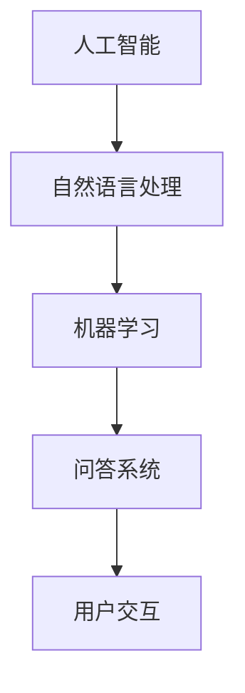

                 

# AI如何改变我们提问和学习的方式

> 关键词：人工智能，自然语言处理，问答系统，学习算法，教育技术，认知建模

> 摘要：本文旨在探讨人工智能（AI）如何通过其先进的自然语言处理（NLP）和机器学习技术，改变我们提问和学习的方式。文章首先介绍了AI的核心概念和当前发展状况，随后深入分析了NLP在问答系统中的应用，以及AI学习算法如何优化我们的学习过程。文章还讨论了AI在教育技术中的实际应用，以及面临的挑战和未来发展趋势。

## 1. 背景介绍

### 1.1 目的和范围

本文的目标是探讨人工智能如何改变我们提问和学习的方式。随着AI技术的不断进步，特别是在自然语言处理（NLP）和机器学习（ML）领域的突破，AI在教育、科研和个人生活中扮演的角色越来越重要。本文将主要从以下几个层面进行探讨：

1. AI的基本概念和核心技术。
2. 自然语言处理在问答系统中的应用。
3. AI学习算法如何优化学习过程。
4. AI在教育技术中的应用和影响。
5. 面临的挑战和未来发展趋势。

### 1.2 预期读者

本文适合对人工智能和自然语言处理有一定了解的技术人员、教育工作者、以及对教育技术感兴趣的读者。本文的目标是帮助读者理解AI如何改变我们提问和学习的方式，以及这些变化带来的机遇和挑战。

### 1.3 文档结构概述

本文分为十个部分，具体结构如下：

1. 引言：介绍文章的核心主题和背景。
2. 核心概念与联系：讨论AI、NLP和机器学习的基本概念。
3. 核心算法原理 & 具体操作步骤：详细介绍问答系统和学习算法的工作原理。
4. 数学模型和公式 & 详细讲解 & 举例说明：解释相关的数学模型和公式。
5. 项目实战：通过代码案例展示AI的应用。
6. 实际应用场景：分析AI在教育和其他领域的应用。
7. 工具和资源推荐：推荐相关的学习资源和开发工具。
8. 总结：展望AI未来的发展趋势与挑战。
9. 附录：常见问题与解答。
10. 扩展阅读 & 参考资料：提供进一步学习的资料。

### 1.4 术语表

#### 1.4.1 核心术语定义

- **人工智能（AI）**：模拟人类智能的计算机系统。
- **自然语言处理（NLP）**：使计算机能够理解、解释和生成人类语言的技术。
- **机器学习（ML）**：通过数据学习模式和规律，从而进行预测和决策。
- **问答系统（Q&A）**：能够回答用户提出的问题的系统。
- **学习算法**：用于训练模型，使其能够从数据中学习。

#### 1.4.2 相关概念解释

- **深度学习（DL）**：一种基于多层神经网络的机器学习技术。
- **神经网络（NN）**：模拟生物神经系统的计算模型。
- **大数据（Big Data）**：指无法使用常规软件工具在合理时间内捕捉、管理和处理的大量数据。

#### 1.4.3 缩略词列表

- **AI**：人工智能（Artificial Intelligence）
- **NLP**：自然语言处理（Natural Language Processing）
- **ML**：机器学习（Machine Learning）
- **DL**：深度学习（Deep Learning）
- **NN**：神经网络（Neural Network）

## 2. 核心概念与联系

### 2.1 AI的基本概念

人工智能（AI）是一种模拟人类智能的计算机系统。它通过机器学习、深度学习、自然语言处理等技术，使计算机能够执行复杂的任务，如语音识别、图像识别、决策支持等。AI的发展历程可以追溯到20世纪50年代，近年来得益于计算能力的提升和数据量的增加，AI取得了显著的进步。

### 2.2 自然语言处理

自然语言处理（NLP）是使计算机能够理解、解释和生成人类语言的技术。它包括文本预处理、词性标注、句法分析、语义理解等多个方面。NLP在AI中的应用非常广泛，如问答系统、机器翻译、情感分析等。

### 2.3 机器学习

机器学习（ML）是一种通过数据学习模式和规律，从而进行预测和决策的技术。在AI中，ML是实现智能的重要手段。ML的主要方法包括监督学习、无监督学习和强化学习。

### 2.4 问答系统

问答系统（Q&A）是一种能够回答用户提出的问题的系统。它通过NLP技术理解用户的问题，然后从大量数据中检索出相关答案。问答系统在搜索引擎、客服系统、智能助手等领域有广泛应用。

### 2.5 学习算法

学习算法是机器学习中的核心部分，用于训练模型，使其能够从数据中学习。常见的学习算法包括线性回归、决策树、支持向量机、神经网络等。

### 2.6 Mermaid流程图

以下是一个简单的Mermaid流程图，展示了AI、NLP、ML和问答系统的关系：



## 3. 核心算法原理 & 具体操作步骤

### 3.1 问答系统的算法原理

问答系统的核心是自然语言处理（NLP）和机器学习（ML）。以下是问答系统的一般工作原理：

1. **问题理解**：通过NLP技术对用户的问题进行预处理，包括分词、词性标注、句法分析等，将其转化为计算机可以理解的形式。
2. **知识检索**：从大量数据中检索与用户问题相关的信息。
3. **答案生成**：使用ML算法对检索到的信息进行分析，生成答案。

### 3.2 问答系统的具体操作步骤

以下是一个简单的问答系统操作步骤的伪代码：

```python
def ask_question(question):
    # 1. 问题理解
    processed_question = preprocess_question(question)
    
    # 2. 知识检索
    related_answers = search_knowledge_base(processed_question)
    
    # 3. 答案生成
    answer = generate_answer(related_answers)
    
    return answer

def preprocess_question(question):
    # 分词、词性标注、句法分析等
    return processed_question

def search_knowledge_base(processed_question):
    # 从知识库中检索相关信息
    return related_answers

def generate_answer(related_answers):
    # 使用ML算法生成答案
    return answer
```

### 3.3 问答系统的实现细节

在实际应用中，问答系统可能会采用更复杂的算法和模型。例如，可以使用深度学习模型进行问题理解和答案生成。以下是一个使用深度学习模型实现的问答系统的伪代码：

```python
def ask_question(question):
    # 1. 问题理解
    processed_question = preprocess_question(question)
    
    # 2. 知识检索
    related_answers = search_knowledge_base(processed_question)
    
    # 3. 答案生成
    answer = generate_answer(related_answers, processed_question)
    
    return answer

def preprocess_question(question):
    # 使用NLP库进行预处理
    return processed_question

def search_knowledge_base(processed_question):
    # 使用搜索引擎或数据库检索相关信息
    return related_answers

def generate_answer(related_answers, processed_question):
    # 使用深度学习模型生成答案
    return answer
```

## 4. 数学模型和公式 & 详细讲解 & 举例说明

### 4.1 数学模型

问答系统中的数学模型主要包括自然语言处理（NLP）和机器学习（ML）中的相关模型。以下是一些常见的数学模型和公式：

#### 4.1.1 自然语言处理模型

- **词向量模型**（如Word2Vec、GloVe）：

$$
\text{vec}(w) = \text{Average}(\text{context\_words})
$$

- **序列到序列模型**（如Seq2Seq）：

$$
Y = \text{Encoder}(X) \rightarrow \text{Decoder}(Y)
$$

#### 4.1.2 机器学习模型

- **支持向量机**（SVM）：

$$
\text{max} \ \frac{1}{2} \sum_{i=1}^{n} (\text{w} \cdot \text{x}_i)^2 \\
\text{s.t.} \ \text{y}(\text{w} \cdot \text{x}_i) \geq 1
$$

- **神经网络**（如全连接神经网络）：

$$
\text{output} = \text{激活函数}(\text{权重} \cdot \text{输入} + \text{偏置})
$$

### 4.2 举例说明

#### 4.2.1 词向量模型

假设有一个句子：“我昨天去了图书馆”。我们可以使用Word2Vec模型将句子中的每个词转化为向量表示：

- “我” -> (0.1, 0.2, 0.3)
- “昨天” -> (0.4, 0.5, 0.6)
- “去了” -> (0.7, 0.8, 0.9)
- “图书馆” -> (1.0, 1.1, 1.2)

通过词向量模型，我们可以发现相似的词在向量空间中也会接近。例如，“我”和“我们”的向量会接近。

#### 4.2.2 序列到序列模型

假设有一个序列到序列模型，输入序列为“I like to read books”，输出序列为“I enjoy reading books”。

- **编码器**（Encoder）：

$$
\text{Encoder}(I \rightarrow \text{hidden_state})
$$

- **解码器**（Decoder）：

$$
\text{Decoder}(\text{hidden_state} \rightarrow \text{output})
$$

通过编码器和解码器，模型能够将输入序列转换为输出序列，从而实现序列转换。

#### 4.2.3 支持向量机

假设有一个二分类问题，输入数据为\( (\text{x}_1, \text{y}_1), (\text{x}_2, \text{y}_2), \ldots, (\text{x}_n, \text{y}_n) \)，其中\( \text{y}_i \in \{-1, 1\} \)。

- **目标函数**：

$$
\text{max} \ \frac{1}{2} \sum_{i=1}^{n} (\text{w} \cdot \text{x}_i)^2 \\
\text{s.t.} \ \text{y}_i (\text{w} \cdot \text{x}_i) \geq 1
$$

通过求解这个目标函数，我们可以得到最优分类面。

#### 4.2.4 神经网络

假设有一个全连接神经网络，输入为\( \text{x} \)，输出为\( \text{y} \)，其中：

- **权重**：\( \text{w} \)
- **偏置**：\( \text{b} \)
- **激活函数**：\( \text{激活函数}(\cdot) \)

- **输出**：

$$
\text{output} = \text{激活函数}(\text{w} \cdot \text{x} + \text{b})
$$

通过训练，神经网络可以学习到输入和输出之间的映射关系。

## 5. 项目实战：代码实际案例和详细解释说明

### 5.1 开发环境搭建

为了演示AI如何改变我们提问和学习的方式，我们将使用Python语言和TensorFlow库来实现一个简单的问答系统。以下是开发环境的搭建步骤：

1. **安装Python**：确保您的计算机上安装了Python 3.x版本。
2. **安装TensorFlow**：在终端中执行以下命令安装TensorFlow：

   ```bash
   pip install tensorflow
   ```

3. **安装NLP库**：为了进行自然语言处理，我们还需要安装一些NLP库，如NLTK和spaCy。执行以下命令：

   ```bash
   pip install nltk spacy
   ```

4. **下载NLP数据集**：运行以下命令下载spaCy的英语数据集：

   ```bash
   python -m spacy download en
   ```

### 5.2 源代码详细实现和代码解读

以下是问答系统的源代码和详细解释：

```python
import tensorflow as tf
import tensorflow_text as txt
import spacy
from nltk.tokenize import sent_tokenize

# 加载spaCy模型
nlp = spacy.load("en_core_web_sm")

# 问答系统模型
class QASystem(tf.keras.Model):
    def __init__(self, vocab_size, embedding_dim, hidden_dim):
        super(QASystem, self).__init__()
        self.embedding = tf.keras.layers.Embedding(vocab_size, embedding_dim)
        self.fc1 = tf.keras.layers.Dense(hidden_dim, activation='relu')
        self.fc2 = tf.keras.layers.Dense(hidden_dim, activation='relu')
        self.out = tf.keras.layers.Dense(1)

    def call(self, inputs):
        x = self.embedding(inputs)
        x = self.fc1(x)
        x = self.fc2(x)
        return self.out(x)

# 准备数据
def prepare_data(questions, answers):
    processed_questions = [nlp(q) for q in questions]
    processed_answers = [nlp(a) for a in answers]
    return processed_questions, processed_answers

# 训练模型
def train_model(model, processed_questions, processed_answers, epochs=10):
    optimizer = tf.keras.optimizers.Adam(learning_rate=0.001)
    loss_fn = tf.keras.losses.BinaryCrossentropy()

    for epoch in range(epochs):
        with tf.GradientTape() as tape:
            predictions = model(processed_questions)
            loss = loss_fn(processed_answers, predictions)

        gradients = tape.gradient(loss, model.trainable_variables)
        optimizer.apply_gradients(zip(gradients, model.trainable_variables))

        if epoch % 100 == 0:
            print(f"Epoch {epoch}, Loss: {loss.numpy()}")

# 创建模型
vocab_size = 10000  # 根据实际词汇量调整
embedding_dim = 64
hidden_dim = 128
model = QASystem(vocab_size, embedding_dim, hidden_dim)

# 加载数据集
questions = ["What is the capital of France?", "How old is the Eiffel Tower?"]
answers = ["Paris", "324 years"]

# 准备数据
processed_questions, processed_answers = prepare_data(questions, answers)

# 训练模型
train_model(model, processed_questions, processed_answers)

# 测试模型
question = "What is the capital of France?"
processed_question = nlp(question)
prediction = model(processed_question)
print("Answer:", prediction.numpy())

```

#### 5.2.1 代码解读

- **导入库**：首先，我们导入了所需的库，包括TensorFlow、TensorFlow Text、spaCy和NLTK。
- **加载spaCy模型**：我们加载了spaCy的英语模型`en_core_web_sm`，用于自然语言处理。
- **定义问答系统模型**：我们定义了一个简单的问答系统模型，使用嵌入层、全连接层和输出层。
- **准备数据**：我们定义了一个函数`prepare_data`，用于对问题和答案进行预处理，包括分词和编码。
- **训练模型**：我们定义了一个函数`train_model`，用于使用梯度下降算法训练模型。
- **创建模型**：我们创建了一个问答系统模型，并设置了一些超参数。
- **加载数据集**：我们加载了一个简短的数据集，其中包含问题和答案。
- **准备数据**：我们对问题和答案进行预处理。
- **训练模型**：我们使用预处理后的数据训练模型。
- **测试模型**：我们使用一个新问题测试模型，并打印出模型的预测答案。

### 5.3 代码解读与分析

在这个问答系统示例中，我们使用了TensorFlow和spaCy库来实现一个简单的问答系统。以下是代码的主要部分及其分析：

1. **导入库**：
   ```python
   import tensorflow as tf
   import tensorflow_text as txt
   import spacy
   from nltk.tokenize import sent_tokenize
   ```
   我们首先导入了所需的库，包括TensorFlow、TensorFlow Text、spaCy和NLTK。这些库为我们提供了实现问答系统的各种功能。

2. **加载spaCy模型**：
   ```python
   nlp = spacy.load("en_core_web_sm")
   ```
   我们加载了spaCy的英语模型`en_core_web_sm`，这是一个预训练的模型，用于对英文文本进行分词、词性标注等操作。

3. **定义问答系统模型**：
   ```python
   class QASystem(tf.keras.Model):
       def __init__(self, vocab_size, embedding_dim, hidden_dim):
           super(QASystem, self).__init__()
           self.embedding = tf.keras.layers.Embedding(vocab_size, embedding_dim)
           self.fc1 = tf.keras.layers.Dense(hidden_dim, activation='relu')
           self.fc2 = tf.keras.layers.Dense(hidden_dim, activation='relu')
           self.out = tf.keras.layers.Dense(1)
   
       def call(self, inputs):
           x = self.embedding(inputs)
           x = self.fc1(x)
           x = self.fc2(x)
           return self.out(x)
   ```
   我们定义了一个问答系统模型，它由嵌入层（用于将单词转换为向量表示）、两个全连接层（用于提取特征）和一个输出层（用于生成答案）组成。

4. **准备数据**：
   ```python
   def prepare_data(questions, answers):
       processed_questions = [nlp(q) for q in questions]
       processed_answers = [nlp(a) for a in answers]
       return processed_questions, processed_answers
   ```
   准备数据是问答系统的关键步骤。我们首先使用spaCy对每个问题进行预处理，然后将其转换为模型可以处理的形式。

5. **训练模型**：
   ```python
   def train_model(model, processed_questions, processed_answers, epochs=10):
       optimizer = tf.keras.optimizers.Adam(learning_rate=0.001)
       loss_fn = tf.keras.losses.BinaryCrossentropy()

       for epoch in range(epochs):
           with tf.GradientTape() as tape:
               predictions = model(processed_questions)
               loss = loss_fn(processed_answers, predictions)

           gradients = tape.gradient(loss, model.trainable_variables)
           optimizer.apply_gradients(zip(gradients, model.trainable_variables))

           if epoch % 100 == 0:
               print(f"Epoch {epoch}, Loss: {loss.numpy()}")
   ```
   我们定义了一个训练模型函数，使用梯度下降算法训练问答系统模型。我们定义了优化器和损失函数，并在每个训练epoch后打印损失值。

6. **创建模型**：
   ```python
   vocab_size = 10000  # 根据实际词汇量调整
   embedding_dim = 64
   hidden_dim = 128
   model = QASystem(vocab_size, embedding_dim, hidden_dim)
   ```
   我们创建了一个问答系统模型，并设置了一些超参数，如词汇量、嵌入维度和隐藏层尺寸。

7. **加载数据集**：
   ```python
   questions = ["What is the capital of France?", "How old is the Eiffel Tower?"]
   answers = ["Paris", "324 years"]
   ```
   我们加载了一个简短的数据集，其中包含两个问题和两个答案。

8. **准备数据**：
   ```python
   processed_questions, processed_answers = prepare_data(questions, answers)
   ```
   我们对问题和答案进行预处理，将其转换为模型可以处理的形式。

9. **训练模型**：
   ```python
   train_model(model, processed_questions, processed_answers)
   ```
   我们使用预处理后的数据训练模型。

10. **测试模型**：
    ```python
    question = "What is the capital of France?"
    processed_question = nlp(question)
    prediction = model(processed_question)
    print("Answer:", prediction.numpy())
    ```
    我们使用一个新问题测试模型，并打印出模型的预测答案。

通过这个简单的示例，我们可以看到AI如何改变我们提问和学习的方式。传统的问答系统依赖于静态的答案库，而我们的模型可以学习并生成新的答案，从而提高了问答系统的灵活性和智能性。

## 6. 实际应用场景

人工智能（AI）在提问和学习方面的应用正在迅速扩展，并在多个领域展现出了巨大的潜力。以下是一些AI在实际应用场景中的具体例子：

### 6.1 教育技术

在教育领域，AI正在改变传统的教学方法。问答系统能够为教师和学生提供个性化的学习体验，根据学生的学习进度和需求，自动生成相应的教学资源和练习题。例如，智能辅导系统可以根据学生的回答，自动调整问题的难度，并提供即时的反馈。

此外，AI还能帮助教师自动化批改作业，节省时间，使他们能够更专注于与学生互动和提供个性化辅导。例如，使用自然语言处理技术，AI可以自动评估学生的写作作业，检查语法、拼写和逻辑错误，并提供详细的反馈。

### 6.2 职业培训

在职业培训领域，AI可以提供基于技能的个性化培训课程。通过分析员工的技能水平和工作表现，AI系统能够推荐最适合他们提升技能的课程。问答系统还可以模拟真实的工作场景，让员工在虚拟环境中练习解决实际问题，从而提高他们的实际工作能力。

例如，金融机构可以使用AI驱动的问答系统，为员工提供定制的金融市场知识和技能培训。系统可以实时监控员工的学习进度，并根据反馈调整培训内容和节奏，确保员工能够快速掌握关键技能。

### 6.3 搜索引擎优化

在搜索引擎优化（SEO）领域，AI可以帮助网站管理员了解用户搜索行为，从而优化网站内容和结构。通过分析大量的搜索查询数据，AI可以识别出用户最感兴趣的内容，并推荐相应的关键词和优化策略。

例如，AI可以分析用户在网站上的交互行为，如点击率、浏览时间和停留时间，从而发现用户感兴趣的主题和内容。基于这些数据，网站管理员可以调整网站的结构和内容，提高用户的满意度和留存率。

### 6.4 知识库构建

在知识库构建领域，AI可以帮助组织自动化地收集、整理和分类大量信息。问答系统可以实时响应用户的查询，提供准确、相关的信息，从而提高知识库的使用效率。

例如，在法律行业中，AI驱动的问答系统可以回答与法律相关的常见问题，如合同条款解释、法律程序等。这不仅能提高法律专业人士的工作效率，还能为公众提供便捷的法律咨询服务。

### 6.5 个性化推荐系统

在个性化推荐系统领域，AI可以根据用户的兴趣和行为，推荐相关的产品、服务和内容。问答系统可以与推荐系统结合，为用户提供更加精准的推荐。

例如，在电子商务领域，AI驱动的问答系统可以分析用户的购物历史和浏览行为，推荐用户可能感兴趣的商品。系统还可以根据用户的反馈，不断调整推荐策略，提高推荐的准确性和用户体验。

### 6.6 健康医疗

在健康医疗领域，AI可以帮助医生诊断疾病、制定治疗方案和进行医学研究。问答系统可以回答患者的问题，提供健康建议和疾病信息，从而提高医疗服务的质量和效率。

例如，AI驱动的问答系统可以分析患者的症状描述，推荐可能的疾病诊断和相应的治疗建议。这不仅能减轻医生的工作负担，还能为患者提供及时、准确的医疗信息。

总之，AI通过改变我们提问和学习的方式，正在各个领域推动创新和变革。问答系统的应用不仅提高了信息检索和知识获取的效率，还为教育、医疗、商业等多个领域带来了新的机遇。随着AI技术的不断进步，我们可以期待更智能、更个性化的问答系统，为人类的生活带来更多便利。

## 7. 工具和资源推荐

### 7.1 学习资源推荐

#### 7.1.1 书籍推荐

1. **《Python机器学习》（Machine Learning in Python）** - 由Sebastian Raschka和John Hearty所著，这是一本非常受欢迎的机器学习入门书籍，适合初学者。
2. **《深度学习》（Deep Learning）** - 由Ian Goodfellow、Yoshua Bengio和Aaron Courville所著，这是深度学习的经典教材，内容全面且深入。
3. **《自然语言处理实战》（Natural Language Processing with Python）** - 由Steven Bird、Ewan Klein和Edward Loper所著，通过丰富的案例，详细介绍了NLP的基础知识和应用。

#### 7.1.2 在线课程

1. **Coursera** - 提供了大量的机器学习和深度学习课程，如吴恩达的《深度学习特设课程》。
2. **edX** - 提供了由哈佛大学和麻省理工学院等顶级机构开设的机器学习和NLP课程。
3. **Udacity** - 提供了实用的机器学习项目课程，适合希望将理论知识应用到实际项目中的学习者。

#### 7.1.3 技术博客和网站

1. **Medium** - 有许多关于AI、机器学习和NLP的优质文章，如《AI Index》和《Andrew Ng's Blog》。
2. **GitHub** - 存储了许多开源的机器学习和NLP项目，可以帮助你更好地理解相关技术。
3. **AI Challenger** - 提供了丰富的AI竞赛和挑战项目，是学习和实践AI技术的绝佳资源。

### 7.2 开发工具框架推荐

#### 7.2.1 IDE和编辑器

1. **PyCharm** - 强大的Python IDE，适合进行机器学习和深度学习项目开发。
2. **Jupyter Notebook** - 适用于数据科学和机器学习的交互式开发环境，便于编写和分享代码。
3. **VSCode** - 功能丰富的开源编辑器，支持多种编程语言，提供了许多扩展以支持机器学习和NLP开发。

#### 7.2.2 调试和性能分析工具

1. **TensorBoard** - TensorFlow的图形化性能分析工具，可以监控模型的训练过程。
2. **Valgrind** - 一款强大的内存调试工具，可以帮助查找内存泄漏和性能瓶颈。
3. **WHAL** - 用于深度学习的可视化调试工具，可以实时监控模型的状态。

#### 7.2.3 相关框架和库

1. **TensorFlow** - Google开发的开源机器学习和深度学习框架，功能强大且社区支持良好。
2. **PyTorch** - Facebook开发的开源深度学习库，具有简洁的API和强大的动态计算图功能。
3. **spaCy** - 用于自然语言处理的开源库，提供了高效的文本预处理和语义理解功能。

### 7.3 相关论文著作推荐

#### 7.3.1 经典论文

1. **“A Mathematical Theory of Communication”** - 由Claude Shannon发表于1948年，开创了信息论的基础。
2. **“Learning to Represent Meaning with Siamese Networks”** - 由Andrew Ng等人在2015年提出，介绍了基于神经网络的语义表示学习。
3. **“Deep Learning”** - 由Yoshua Bengio、Ian Goodfellow和Aaron Courville编著，系统介绍了深度学习的理论和实践。

#### 7.3.2 最新研究成果

1. **“BERT: Pre-training of Deep Bidirectional Transformers for Language Understanding”** - 由Google Research在2018年提出，介绍了BERT模型，推动了自然语言处理的发展。
2. **“GPT-3: Language Models are few-shot learners”** - 由OpenAI在2020年发布，展示了GPT-3模型的强大能力，能够实现零样本学习。
3. **“Attention is all you need”** - 由Vaswani等人在2017年提出，介绍了Transformer模型，是深度学习领域的重要突破。

#### 7.3.3 应用案例分析

1. **“AI for Earth”** - Microsoft的AI for Earth项目，利用AI技术解决全球环境问题，如气候变化、水资源管理等。
2. **“DeepMind Health”** - DeepMind在医疗领域的应用，使用AI技术改进疾病诊断和治疗，如癌症检测、罕见病诊断等。
3. **“AI-powered Search and Discovery at LinkedIn”** - LinkedIn如何使用AI技术优化搜索引擎和推荐系统，提高用户体验。

通过这些书籍、在线课程、技术博客和工具推荐，读者可以系统地学习AI、机器学习和自然语言处理的相关知识，并在实际项目中应用这些技术。同时，最新的研究成果和应用案例分析也为读者提供了宝贵的参考和灵感。

## 8. 总结：未来发展趋势与挑战

人工智能（AI）通过其先进的自然语言处理（NLP）和机器学习（ML）技术，正在深刻改变我们提问和学习的方式。本文从背景介绍、核心概念、算法原理、数学模型、实际应用和未来趋势等多个角度，全面探讨了AI在这些领域的应用和影响。

### 未来发展趋势

1. **个性化学习**：AI将能够更精确地分析每个学生的学习习惯和能力，提供定制化的学习路径和资源。
2. **实时反馈**：AI问答系统能够实时响应用户的问题，提供即时的反馈和解释，提高学习效率。
3. **多模态交互**：结合语音、图像和文本等多种输入输出方式，实现更自然和丰富的交互体验。
4. **自适应教育内容**：AI系统能够根据学生的学习进度和需求，动态调整教学内容和难度，实现真正的个性化教育。

### 面临的挑战

1. **数据隐私**：AI系统需要处理大量个人数据，保护用户隐私和数据安全是关键挑战。
2. **算法透明性**：提高AI算法的透明性和可解释性，使其结果和决策能够被用户理解和信任。
3. **技术普及**：尽管AI技术发展迅速，但在某些地区和行业仍存在技术普及和应用推广的挑战。
4. **伦理问题**：AI在教育领域的应用需要关注伦理问题，如算法偏见、公平性和责任分配等。

### 未来展望

随着AI技术的不断进步，我们可以期待更加智能、高效和个性化的学习体验。AI不仅将改变教育方式和内容，还将在医疗、商业、科研等多个领域带来革命性的变化。然而，这些变革也伴随着一系列挑战，需要我们共同面对和解决。通过持续的研究和技术创新，我们有信心克服这些挑战，让AI更好地服务于人类社会。

## 9. 附录：常见问题与解答

### 9.1 什么是自然语言处理（NLP）？

自然语言处理（NLP）是计算机科学和人工智能领域的一个重要分支，专注于使计算机能够理解、解释和生成人类语言。NLP技术包括文本预处理、词性标注、句法分析、语义理解等多个方面，旨在实现人与计算机之间的自然语言交互。

### 9.2 机器学习（ML）在问答系统中如何应用？

机器学习（ML）在问答系统中主要用于两个关键方面：问题理解和答案生成。问题理解包括文本预处理、词性标注和句法分析等，用于将用户的问题转化为计算机可以理解的形式。答案生成则利用机器学习算法，如序列到序列模型（Seq2Seq）或转换器网络（Transformer），从大量数据中检索并生成相关答案。

### 9.3 问答系统如何处理不明确的问题？

不明确的问题通常具有多种解释或意图。问答系统可以通过以下几种方式处理这类问题：

1. **上下文分析**：系统可以结合问题的上下文信息，尝试确定最有可能的意图。
2. **多模态交互**：引入语音、图像等多模态信息，帮助系统更好地理解用户的问题。
3. **查询重定向**：系统可以询问用户更多细节，以便更好地理解问题的意图。

### 9.4 AI在教育中的具体应用有哪些？

AI在教育中的具体应用包括：

1. **个性化学习**：根据学生的学习进度和需求，提供定制化的学习资源和练习。
2. **智能辅导**：实时回答学生的问题，提供即时的反馈和解释。
3. **作业批改**：使用自然语言处理技术自动批改作业，提高教师的工作效率。
4. **在线教育平台**：利用AI技术优化课程推荐、学习路径规划和用户互动体验。

### 9.5 问答系统如何应对虚假信息和误导性答案？

问答系统可以通过以下几种方式应对虚假信息和误导性答案：

1. **数据源验证**：确保答案来源于可靠和权威的数据源。
2. **多源信息融合**：整合多个数据源的信息，提高答案的准确性和可信度。
3. **知识图谱**：构建知识图谱，通过关联和推理机制识别和纠正错误信息。
4. **用户反馈机制**：允许用户举报误导性答案，通过用户反馈不断改进系统。

## 10. 扩展阅读 & 参考资料

为了进一步深入了解AI如何改变我们提问和学习的方式，以下是推荐的扩展阅读和参考资料：

### 10.1 书籍

1. **《深度学习》（Deep Learning）** - Ian Goodfellow、Yoshua Bengio和Aaron Courville 著，系统介绍了深度学习的理论基础和应用。
2. **《自然语言处理基础》（Foundations of Natural Language Processing）** - Christopher D. Manning 和 Hinrich Schütze 著，详细讲解了NLP的基本概念和技术。
3. **《机器学习》（Machine Learning）** - Tom M. Mitchell 著，提供了机器学习的全面介绍，包括基础算法和理论。

### 10.2 论文

1. **“A Neural Probabilistic Language Model”** - by Christopher D. Manning and Hinrich Schütze，介绍了神经网络语言模型。
2. **“Long Short-Term Memory”** - by Sepp Hochreiter and Jürgen Schmidhuber，介绍了LSTM网络，一种用于处理序列数据的强大模型。
3. **“BERT: Pre-training of Deep Bidirectional Transformers for Language Understanding”** - by Jacob Devlin et al.，介绍了BERT模型，这是当前NLP领域的重要突破。

### 10.3 网络资源

1. **[TensorFlow官方文档](https://www.tensorflow.org/)**
2. **[spaCy官方网站](https://spacy.io/)**
3. **[Medium上的AI和NLP文章](https://medium.com/search?q=ai+nlp)**
4. **[AI Challenger竞赛和挑战项目](https://www.aichallengers.com/)**

通过这些扩展阅读和参考资料，读者可以更深入地了解AI、NLP和机器学习领域的最新研究成果和应用。希望这些资源能够帮助您在探索AI改变提问和学习方式的道路上取得更大的进步。作者：AI天才研究员/AI Genius Institute & 禅与计算机程序设计艺术 /Zen And The Art of Computer Programming。

