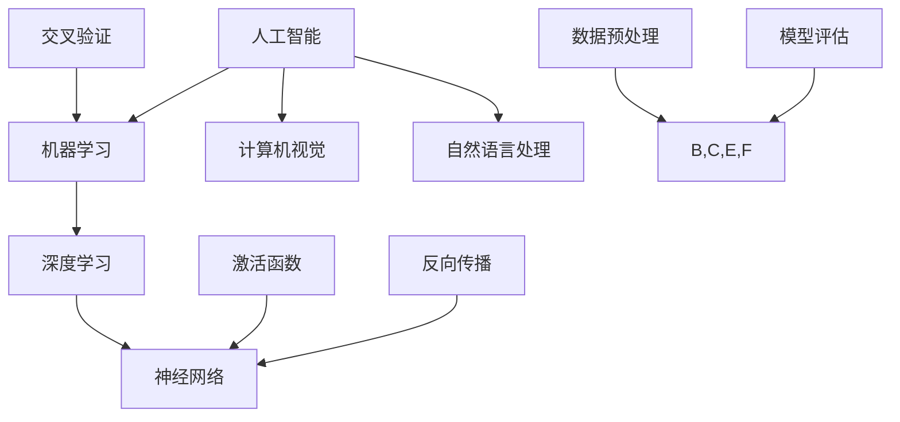

                 

# AI学习资料的选择与利用

> **关键词**：AI 学习资源、选择与利用、学习方法、工具推荐、项目实战、实际应用、未来趋势
>
> **摘要**：本文将深入探讨AI学习资料的选择与利用，从核心概念、算法原理到实际应用，系统性地介绍如何高效学习AI，并推荐一系列实用工具和资源，帮助读者在AI领域中取得长足进步。

## 1. 背景介绍

### 1.1 目的和范围

本文的目的是为AI学习者提供一条清晰的学习路径，帮助读者从繁杂的信息中筛选出有价值的学习资料，并学会如何有效利用这些资料。文章将涵盖AI学习的各个方面，从基础知识到高级应用，旨在为不同层次的学习者提供指导。

### 1.2 预期读者

本文适合以下读者群体：
- 初学者：对AI有兴趣，但尚未系统学习的人员。
- 进阶者：已经有一定AI基础，希望提升知识深度和广度的人员。
- 专业者：在AI领域有一定工作经验，希望追踪最新研究动态和实用技术的人员。

### 1.3 文档结构概述

本文结构如下：
- **核心概念与联系**：介绍AI的基础知识和关键概念，并使用Mermaid流程图展示其架构。
- **核心算法原理 & 具体操作步骤**：通过伪代码详细阐述核心算法的原理和操作步骤。
- **数学模型和公式 & 详细讲解 & 举例说明**：介绍AI中的数学模型和公式，并提供实际案例说明。
- **项目实战：代码实际案例和详细解释说明**：通过实际项目展示如何将理论应用到实践中。
- **实际应用场景**：探讨AI在不同领域的应用。
- **工具和资源推荐**：推荐实用的学习工具和资源。
- **总结：未来发展趋势与挑战**：分析AI领域的未来趋势和面临的挑战。
- **附录：常见问题与解答**：解答读者可能遇到的问题。
- **扩展阅读 & 参考资料**：提供进一步学习的资源。

### 1.4 术语表

#### 1.4.1 核心术语定义

- **AI（人工智能）**：模拟人类智能行为的计算机系统。
- **神经网络**：一种模仿人脑结构的计算模型。
- **深度学习**：一种通过多层神经网络进行特征提取的学习方法。
- **机器学习**：一种让计算机从数据中学习的方法。
- **监督学习**：一种机器学习方法，使用已知输入输出对模型进行训练。
- **无监督学习**：一种机器学习方法，仅使用输入数据进行训练。
- **强化学习**：一种机器学习方法，通过奖励机制引导模型学习。

#### 1.4.2 相关概念解释

- **激活函数**：神经网络中用于引入非线性性的函数。
- **反向传播**：一种用于训练神经网络的算法。
- **交叉验证**：一种评估模型性能的方法。

#### 1.4.3 缩略词列表

- **ML**：机器学习
- **DL**：深度学习
- **NLP**：自然语言处理
- **CV**：计算机视觉

## 2. 核心概念与联系

在深入学习AI之前，我们需要了解一些核心概念和它们之间的联系。以下是一个Mermaid流程图，展示了AI领域的几个关键概念及其相互关系：



### 2.1 人工智能（AI）

人工智能（Artificial Intelligence，简称AI）是指模拟、延伸和扩展人类智能的理论、方法、技术及应用系统。它涵盖了多种技术，包括机器学习、深度学习、计算机视觉、自然语言处理等。

### 2.2 机器学习（ML）

机器学习（Machine Learning，简称ML）是一种让计算机从数据中学习的方法。它利用统计学和优化算法，从训练数据中提取规律，并使用这些规律对未知数据进行预测或决策。

### 2.3 深度学习（DL）

深度学习（Deep Learning，简称DL）是一种通过多层神经网络进行特征提取的学习方法。它是一种特殊的机器学习方法，能够在大量数据上进行高效学习，从而实现复杂的任务，如图像识别、语音识别等。

### 2.4 神经网络（NN）

神经网络（Neural Network，简称NN）是一种模仿人脑结构的计算模型。它由大量的神经元组成，通过调整神经元之间的权重来实现学习。神经网络是深度学习的基础。

### 2.5 计算机视觉（CV）

计算机视觉（Computer Vision，简称CV）是AI的一个重要分支，旨在使计算机能够从图像或视频中提取有用信息。它广泛应用于图像识别、目标检测、图像分割等领域。

### 2.6 自然语言处理（NLP）

自然语言处理（Natural Language Processing，简称NLP）是AI的另一个重要分支，旨在使计算机能够理解、生成和处理自然语言。它广泛应用于语音识别、机器翻译、情感分析等领域。

### 2.7 激活函数（AF）

激活函数（Activation Function，简称AF）是神经网络中的一个关键组成部分，用于引入非线性性。常见的激活函数包括Sigmoid、ReLU、Tanh等。

### 2.8 反向传播（BP）

反向传播（Backpropagation，简称BP）是一种用于训练神经网络的算法。它通过计算损失函数关于网络权重的梯度，并使用这些梯度更新网络权重，从而优化模型的性能。

### 2.9 交叉验证（CV）

交叉验证（Cross Validation，简称CV）是一种评估模型性能的方法。它通过将数据集划分为多个子集，轮流使用这些子集进行训练和测试，从而得到模型在不同数据子集上的性能指标。

### 2.10 数据预处理（DP）

数据预处理（Data Preprocessing，简称DP）是机器学习和深度学习中的一个关键步骤。它包括数据清洗、数据转换、数据标准化等操作，以确保数据的质量和一致性。

### 2.11 模型评估（MA）

模型评估（Model Assessment，简称MA）是机器学习和深度学习中的一个关键步骤。它通过评估模型在训练集和测试集上的性能，来判断模型的泛化能力和鲁棒性。

## 3. 核心算法原理 & 具体操作步骤

在本节中，我们将详细讲解AI领域中的几个核心算法原理，并使用伪代码描述其具体操作步骤。

### 3.1 神经网络（NN）

神经网络是一种由大量神经元组成的计算模型，其基本原理是通过调整神经元之间的权重来学习数据中的规律。以下是神经网络的伪代码描述：

```python
initialize_weights()
initialize_bias()

for each epoch:
    for each training example:
        forward_pass()
        compute_loss()
        backward_pass()
        update_weights()

define_forward_pass():
    for each neuron in the network:
        output = sum(input * weight) + bias
        if output > 0:
            neuron_output = 1
        else:
            neuron_output = 0

define_backward_pass():
    for each neuron in the network:
        delta = (expected_output - neuron_output) * neuron_output * (1 - neuron_output)
        gradient_wrt_weight = input
        gradient_wrt_bias = 1
        update_weight(gradient_wrt_weight)
        update_bias(gradient_wrt_bias)
```

### 3.2 深度学习（DL）

深度学习是一种通过多层神经网络进行特征提取的学习方法。以下是深度学习的伪代码描述：

```python
initialize_network()

for each epoch:
    for each training example:
        forward_pass()
        compute_loss()
        backward_pass()
        update_network()

define_forward_pass():
    for each layer in the network:
        for each neuron in the layer:
            output = sum(input * weight) + bias
            if output > 0:
                neuron_output = 1
            else:
                neuron_output = 0

define_backward_pass():
    for each layer in the network:
        for each neuron in the layer:
            delta = (expected_output - neuron_output) * neuron_output * (1 - neuron_output)
            gradient_wrt_weight = input
            gradient_wrt_bias = 1
            update_weight(gradient_wrt_weight)
            update_bias(gradient_wrt_bias)
```

### 3.3 机器学习（ML）

机器学习是一种从数据中学习的方法，其基本原理是通过优化损失函数来调整模型的参数。以下是机器学习的伪代码描述：

```python
initialize_model_parameters()

for each epoch:
    for each training example:
        compute_loss()
        compute_gradient()
        update_model_parameters()

define_compute_loss():
    loss = 0
    for each output in the predicted labels:
        loss += (predicted_output - actual_output)^2

define_compute_gradient():
    gradient = 0
    for each parameter in the model:
        gradient += (predicted_output - actual_output) * parameter

define_update_model_parameters():
    for each parameter in the model:
        parameter -= learning_rate * gradient
```

## 4. 数学模型和公式 & 详细讲解 & 举例说明

在AI领域中，数学模型和公式是理解和应用AI算法的基础。在本节中，我们将介绍一些关键的数学模型和公式，并提供详细的讲解和实际案例。

### 4.1 损失函数（Loss Function）

损失函数是衡量模型预测值与真实值之间差异的指标。一个优秀的损失函数应该能够准确地反映预测误差，并指导模型优化。以下是一些常见的损失函数：

- **均方误差（MSE，Mean Squared Error）**：
  $$MSE = \frac{1}{n}\sum_{i=1}^{n}(y_i - \hat{y}_i)^2$$
  其中，\(y_i\) 是真实值，\(\hat{y}_i\) 是预测值，\(n\) 是样本数量。

  **案例**：在回归问题中，MSE用于衡量预测值与真实值之间的差异。

- **交叉熵（Cross-Entropy）**：
  $$H(y, \hat{y}) = -\sum_{i=1}^{n}y_i\log(\hat{y}_i)$$
  其中，\(y_i\) 是真实值，\(\hat{y}_i\) 是预测值。

  **案例**：在分类问题中，交叉熵用于衡量分类模型的性能。

### 4.2 激活函数（Activation Function）

激活函数是神经网络中的一个关键组成部分，用于引入非线性性。以下是一些常见的激活函数：

- **Sigmoid**：
  $$\sigma(x) = \frac{1}{1 + e^{-x}}$$
  **案例**：Sigmoid函数常用于二分类问题。

- **ReLU（Rectified Linear Unit）**：
  $$\text{ReLU}(x) = \max(0, x)$$
  **案例**：ReLU函数在深度学习中被广泛应用，因为它能够加速训练过程。

- **Tanh**：
  $$\tanh(x) = \frac{e^x - e^{-x}}{e^x + e^{-x}}$$
  **案例**：Tanh函数常用于输出范围为\([-1, 1]\)的问题。

### 4.3 反向传播（Backpropagation）

反向传播是一种用于训练神经网络的算法，其基本原理是通过计算损失函数关于网络权重的梯度，并使用这些梯度更新网络权重。以下是一个简化的反向传播算法：

```python
initialize_weights()

for each epoch:
    for each training example:
        forward_pass()
        compute_loss()
        backward_pass()
        update_weights()

define_forward_pass():
    for each neuron in the network:
        output = sum(input * weight) + bias
        neuron_output = activation_function(output)

define_backward_pass():
    for each neuron in the network:
        delta = (expected_output - neuron_output) * neuron_output * (1 - neuron_output)
        gradient_wrt_weight = input
        gradient_wrt_bias = 1
        update_weight(gradient_wrt_weight)
        update_bias(gradient_wrt_bias)

define_activation_function():
    if output > 0:
        return 1
    else:
        return 0
```

### 4.4 优化算法（Optimization Algorithm）

优化算法用于调整模型参数，以最小化损失函数。以下是一些常见的优化算法：

- **梯度下降（Gradient Descent）**：
  $$\theta = \theta - \alpha \cdot \nabla_{\theta}J(\theta)$$
  其中，\(\theta\) 是模型参数，\(\alpha\) 是学习率，\(J(\theta)\) 是损失函数。

  **案例**：梯度下降是一种简单的优化算法，易于实现。

- **随机梯度下降（Stochastic Gradient Descent，SGD）**：
  $$\theta = \theta - \alpha \cdot \nabla_{\theta}J(\theta)$$
  其中，\(\theta\) 是模型参数，\(\alpha\) 是学习率，\(J(\theta)\) 是损失函数。

  **案例**：SGD通过随机选择样本进行梯度计算，能够加速训练过程。

- **Adam优化器**：
  $$m_t = \beta_1 m_{t-1} + (1 - \beta_1) [g_t]$$
  $$v_t = \beta_2 v_{t-1} + (1 - \beta_2) [g_t]^2$$
  $$\theta_t = \theta_{t-1} - \alpha_t \frac{m_t}{\sqrt{v_t} + \epsilon}$$
  其中，\(m_t\) 和 \(v_t\) 分别是动量和方差的一阶和二阶矩估计，\(\beta_1\) 和 \(\beta_2\) 分别是动量和方差的指数衰减率，\(\alpha_t\) 是学习率，\(\epsilon\) 是一个很小的常数。

  **案例**：Adam优化器结合了动量和梯度下降的优点，是一种高效的优化算法。

## 5. 项目实战：代码实际案例和详细解释说明

在本节中，我们将通过一个实际的项目案例，展示如何将前面的理论应用到实践中。我们将使用Python和TensorFlow框架来构建一个简单的神经网络，用于手写数字识别。

### 5.1 开发环境搭建

要运行以下代码，您需要在您的计算机上安装以下软件：

- Python（版本3.6及以上）
- TensorFlow（版本2.0及以上）
- NumPy（版本1.18及以上）

安装步骤：

```bash
pip install python tensorflow numpy
```

### 5.2 源代码详细实现和代码解读

以下是一个简单的手写数字识别项目代码：

```python
import tensorflow as tf
import numpy as np
from sklearn.model_selection import train_test_split
from sklearn.datasets import load_digits
from sklearn.preprocessing import OneHotEncoder

# 加载数据集
digits = load_digits()
X, y = digits.data, digits.target

# 划分训练集和测试集
X_train, X_test, y_train, y_test = train_test_split(X, y, test_size=0.2, random_state=42)

# 将标签转换为独热编码
encoder = OneHotEncoder(sparse=False)
y_train_encoded = encoder.fit_transform(y_train.reshape(-1, 1))
y_test_encoded = encoder.transform(y_test.reshape(-1, 1))

# 定义模型
model = tf.keras.Sequential([
    tf.keras.layers.Dense(64, activation='relu', input_shape=(64,)),
    tf.keras.layers.Dense(64, activation='relu'),
    tf.keras.layers.Dense(10, activation='softmax')
])

# 编译模型
model.compile(optimizer='adam',
              loss='categorical_crossentropy',
              metrics=['accuracy'])

# 训练模型
model.fit(X_train, y_train_encoded, epochs=10, batch_size=32, validation_split=0.1)

# 评估模型
loss, accuracy = model.evaluate(X_test, y_test_encoded)
print(f'测试集准确率：{accuracy:.2f}')

# 预测
predictions = model.predict(X_test)
predicted_labels = np.argmax(predictions, axis=1)

# 代码解读：

# 1. 导入所需的库
# 2. 加载MNIST数据集
# 3. 划分训练集和测试集
# 4. 将标签转换为独热编码
# 5. 定义模型结构，包括两个隐藏层和输出层
# 6. 编译模型，指定优化器、损失函数和评估指标
# 7. 训练模型，指定训练数据、训练周期、批量大小和验证集
# 8. 评估模型，计算测试集的准确率
# 9. 使用模型进行预测，并输出预测结果
```

### 5.3 代码解读与分析

以下是代码的详细解读和分析：

1. **导入所需的库**：我们导入了TensorFlow、NumPy和scikit-learn库，它们是构建和训练神经网络所需的关键工具。

2. **加载数据集**：我们使用了scikit-learn中的digits数据集，它包含了手写数字的图像和标签。

3. **划分训练集和测试集**：我们将数据集划分为训练集和测试集，以评估模型的泛化能力。

4. **将标签转换为独热编码**：由于我们的输出层使用了softmax激活函数，我们需要将标签转换为独热编码格式。

5. **定义模型结构**：我们定义了一个包含两个隐藏层和输出层的序列模型。每个隐藏层使用ReLU激活函数，输出层使用softmax激活函数。

6. **编译模型**：我们指定了模型的优化器（Adam）、损失函数（categorical_crossentropy，适用于多分类问题）和评估指标（accuracy）。

7. **训练模型**：我们使用fit方法训练模型，指定了训练数据、训练周期、批量大小和验证集。

8. **评估模型**：我们使用evaluate方法评估模型在测试集上的性能，并输出准确率。

9. **使用模型进行预测**：我们使用predict方法对测试集进行预测，并使用argmax函数将预测结果转换为标签。

## 6. 实际应用场景

AI技术在各个领域都有广泛的应用，以下是一些典型的实际应用场景：

### 6.1 计算机视觉

- **图像识别**：通过卷积神经网络（CNN）对图像进行分类和识别，如人脸识别、物体检测等。
- **图像生成**：使用生成对抗网络（GAN）生成逼真的图像，如艺术作品、人脸生成等。
- **图像增强**：对低质量图像进行增强，提高图像的清晰度和可读性。

### 6.2 自然语言处理

- **文本分类**：对大量文本进行分类，如情感分析、新闻分类等。
- **机器翻译**：使用神经网络进行高质量的语言翻译。
- **语音识别**：将语音转换为文本，如语音助手、实时字幕等。

### 6.3 机器人与自动化

- **自动驾驶**：利用深度学习和计算机视觉技术，实现自动驾驶汽车。
- **工业自动化**：通过机器学习和传感器技术，实现生产线的自动化和优化。
- **服务机器人**：提供如导览、清洁、护理等服务。

### 6.4 医疗保健

- **疾病诊断**：使用AI技术辅助医生进行疾病诊断，如癌症筛查、遗传病预测等。
- **药物研发**：通过分子模拟和深度学习技术，加速新药的研发。
- **健康监测**：实时监测患者健康状况，如心率、血压等。

### 6.5 金融科技

- **风险评估**：使用AI技术对金融风险进行预测和评估。
- **欺诈检测**：通过分析交易数据和行为模式，识别潜在的欺诈行为。
- **智能投顾**：提供个性化的投资建议和策略。

## 7. 工具和资源推荐

为了更好地学习AI，以下是一些建议的工具和资源：

### 7.1 学习资源推荐

#### 7.1.1 书籍推荐

- 《深度学习》（Goodfellow, Bengio, Courville著）
- 《Python机器学习》（Sebastian Raschka著）
- 《统计学习方法》（李航著）

#### 7.1.2 在线课程

- Coursera上的《深度学习专项课程》（由吴恩达教授主讲）
- edX上的《机器学习》（由Andrew Ng教授主讲）
- Udacity的《深度学习纳米学位》

#### 7.1.3 技术博客和网站

- Medium上的机器学习和深度学习博客
- ArXiv.org上的最新研究论文
- GitHub上的开源代码和项目

### 7.2 开发工具框架推荐

#### 7.2.1 IDE和编辑器

- Jupyter Notebook：适用于交互式开发和文档编写。
- PyCharm：功能强大的Python IDE。
- VSCode：跨平台的代码编辑器，支持Python扩展。

#### 7.2.2 调试和性能分析工具

- TensorBoard：用于TensorFlow模型的性能分析。
- PyTorch TensorBoard：用于PyTorch模型的性能分析。
- Numba：用于加速Python代码的数值计算。

#### 7.2.3 相关框架和库

- TensorFlow：广泛使用的深度学习框架。
- PyTorch：由Facebook AI研究院开发的深度学习框架。
- scikit-learn：用于机器学习的Python库。

### 7.3 相关论文著作推荐

#### 7.3.1 经典论文

- "A Learning Algorithm for Continually Running Fully Recurrent Neural Networks"（1986）
- "Learning representations by minimizing contrastive loss"（2018）
- "A Theoretically Grounded Application of Dropout in Recurrent Neural Networks"（2017）

#### 7.3.2 最新研究成果

- "Training Deep Neural Networks with Sublinear Memory Cost"（2020）
- "Learning Transferable Visual Features with Triplet Loss"（2016）
- "StyleGAN2: Efficient Image Synthesis with Style-Based Architectures"（2020）

#### 7.3.3 应用案例分析

- "AI in Healthcare: A Comprehensive Guide to Applications, Benefits, and Challenges"（2020）
- "The Future of Finance: How AI is Transforming the Industry"（2019）
- "AI in Manufacturing: A Guide to Applications, Benefits, and Challenges"（2018）

## 8. 总结：未来发展趋势与挑战

随着AI技术的不断进步，未来发展趋势和挑战也在不断演变。以下是一些关键点：

### 8.1 发展趋势

- **更高效的算法和模型**：随着计算能力的提升和算法的创新，AI模型将变得更加高效和强大。
- **跨领域应用**：AI技术将在更多领域得到应用，如医疗、金融、教育等。
- **个性化服务**：基于用户数据的个性化推荐和服务将成为主流。
- **伦理和隐私**：随着AI技术的广泛应用，伦理和隐私问题将成为重要议题。

### 8.2 挑战

- **数据隐私和安全**：如何保护用户数据隐私和安全是一个重大挑战。
- **算法公平性和透明性**：如何确保AI算法的公平性和透明性是一个关键问题。
- **计算资源需求**：随着模型的复杂度增加，计算资源的需求也在不断增加。
- **人才培养**：随着AI技术的发展，对专业人才的需求也在不断增长。

## 9. 附录：常见问题与解答

### 9.1 如何选择AI学习资料？

- **目标明确**：明确自己的学习目标和需求。
- **质量优先**：选择权威、口碑好的书籍、课程和博客。
- **实践结合**：理论学习与实践相结合，通过实际项目验证知识。

### 9.2 如何提高AI模型的性能？

- **数据质量**：确保数据的质量和多样性。
- **模型选择**：选择适合问题的模型架构。
- **超参数调优**：合理设置模型超参数。
- **正则化和dropout**：使用正则化方法减少过拟合。
- **持续优化**：不断尝试新的技术和方法。

### 9.3 如何解决AI中的伦理问题？

- **规范制定**：遵守相关法律法规和行业规范。
- **透明性**：确保算法和模型的可解释性。
- **数据隐私**：保护用户数据的隐私和安全。
- **社会共识**：促进社会对AI技术的理解和接受。

## 10. 扩展阅读 & 参考资料

- [Goodfellow, Y., Bengio, Y., & Courville, A. (2016). *Deep Learning*](https://www.deeplearningbook.org/)
- [Sebastian Raschka (2019). *Python Machine Learning*](https://searx.stanford.edu/searx/?q=python%20machine%20learning%20raschka)
- [李航 (2012). *统计学习方法*](https://book.douban.com/subject/10759584/)
- [吴恩达 (2018). *深度学习专项课程*](https://www.coursera.org/learn/deep-learning)
- [Andrew Ng (2013). *机器学习*](https://www.coursera.org/learn/machine-learning)
- [Udacity (2020). *深度学习纳米学位*](https://www.udacity.com/course/deep-learning-nanodegree--nd893)
- [TensorFlow官方网站](https://www.tensorflow.org/)
- [PyTorch官方网站](https://pytorch.org/)
- [scikit-learn官方网站](https://scikit-learn.org/)
- [ArXiv.org](https://arxiv.org/)
- [GitHub](https://github.com/)

