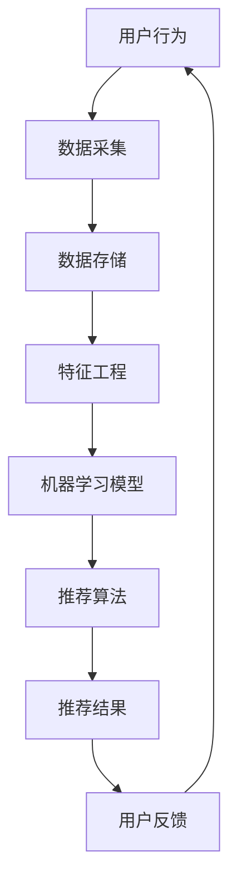

                 

# AI实时推荐系统的实现案例

> **关键词**：AI实时推荐，机器学习，数据流处理，算法设计，系统架构，用户行为分析
>
> **摘要**：本文将详细介绍AI实时推荐系统的实现过程，包括系统架构设计、核心算法原理、数学模型以及实际应用场景。通过本篇文章，读者将全面了解如何从零开始构建一个高效、准确的实时推荐系统。

## 1. 背景介绍

### 1.1 目的和范围

本文的目的是探讨如何实现一个高效、准确的AI实时推荐系统。我们将从系统架构设计、核心算法原理、数学模型以及实际应用场景等多个方面进行深入分析。本文主要面向对AI和推荐系统有一定了解的开发者和技术爱好者。

### 1.2 预期读者

本文适合以下读者群体：

1. 对AI和机器学习有一定了解的开发者；
2. 想要深入了解推荐系统原理的技术爱好者；
3. 担任CTO或项目经理，负责产品架构设计的技术负责人。

### 1.3 文档结构概述

本文将分为以下几个部分：

1. 背景介绍：系统概述和预期读者；
2. 核心概念与联系：介绍系统架构和核心概念；
3. 核心算法原理 & 具体操作步骤：详细讲解推荐算法；
4. 数学模型和公式 & 详细讲解 & 举例说明：分析数学模型；
5. 项目实战：代码实际案例和详细解释说明；
6. 实际应用场景：探讨系统在实际应用中的效果；
7. 工具和资源推荐：推荐学习资源和开发工具；
8. 总结：未来发展趋势与挑战；
9. 附录：常见问题与解答；
10. 扩展阅读 & 参考资料。

### 1.4 术语表

#### 1.4.1 核心术语定义

- **实时推荐**：在用户产生行为后，立即为其提供个性化的推荐；
- **协同过滤**：基于用户和物品的历史行为，通过计算相似度矩阵进行推荐的算法；
- **基于内容的推荐**：根据用户的兴趣和偏好，从内容特征中提取信息进行推荐；
- **机器学习**：利用数据训练模型，自动识别模式并进行预测的技术；
- **深度学习**：一种基于多层神经网络进行特征提取和模式识别的机器学习技术。

#### 1.4.2 相关概念解释

- **特征工程**：从原始数据中提取具有代表性和预测性的特征，以提高模型性能；
- **评估指标**：用于衡量推荐系统效果的各种指标，如准确率、召回率、F1值等；
- **用户画像**：通过分析用户的行为数据，构建的用户兴趣和行为特征模型。

#### 1.4.3 缩略词列表

- **AI**：人工智能
- **ML**：机器学习
- **DL**：深度学习
- **SQL**：结构化查询语言
- **NoSQL**：非结构化查询语言
- **ETL**：数据抽取、转换、加载

## 2. 核心概念与联系

在实现AI实时推荐系统之前，我们需要先了解系统的核心概念和联系。以下是一个简单的Mermaid流程图，用于描述系统架构和关键组件。



### 2.1 用户行为分析

用户行为是实时推荐系统的输入数据。这些行为数据可以包括用户的点击、购买、收藏、评论等。通过对这些行为的分析，我们可以了解用户的兴趣和偏好，从而为其提供个性化的推荐。

### 2.2 数据采集与存储

数据采集是推荐系统的第一步。我们需要实时采集用户行为数据，并将其存储在数据存储系统中。数据存储系统可以采用关系型数据库（如MySQL）或非关系型数据库（如MongoDB），具体选择取决于数据规模和查询需求。

### 2.3 特征工程

特征工程是将原始数据转换为具有代表性和预测性的特征的过程。这些特征将用于训练机器学习模型。特征工程包括以下几个方面：

1. **用户特征**：如用户年龄、性别、地理位置等；
2. **物品特征**：如物品类别、标签、价格等；
3. **行为特征**：如用户在特定时间段的活跃度、购买频率等。

### 2.4 机器学习模型

机器学习模型用于从特征数据中学习用户兴趣和偏好。常见的机器学习模型包括协同过滤、基于内容的推荐和混合推荐等。这些模型将根据用户特征和物品特征进行训练，从而生成推荐列表。

### 2.5 推荐算法

推荐算法是将训练好的机器学习模型应用于用户行为数据，生成个性化推荐结果的过程。常见的推荐算法包括：

1. **基于协同过滤的推荐**：通过计算用户和物品之间的相似度，生成推荐列表；
2. **基于内容的推荐**：根据用户的兴趣和偏好，从内容特征中提取信息进行推荐；
3. **混合推荐**：结合协同过滤和基于内容的推荐，生成更准确的推荐列表。

### 2.6 用户反馈与闭环

用户反馈是推荐系统的重要环节。通过对用户反馈的数据进行分析，我们可以进一步优化推荐算法，提高推荐系统的效果。用户反馈将反馈到用户行为分析环节，形成一个闭环。

## 3. 核心算法原理 & 具体操作步骤

在本节中，我们将详细讲解实时推荐系统的核心算法原理和具体操作步骤。为了更好地理解，我们将使用伪代码进行描述。

### 3.1 基于协同过滤的推荐算法

协同过滤算法是一种基于用户和物品之间相似度的推荐算法。以下是一个简单的协同过滤算法的伪代码：

```python
# 输入：用户行为数据、物品特征数据
# 输出：推荐列表

def collaborative_filtering(user Behavior Data, item Feature Data):
    # 计算用户和物品之间的相似度
    similarity_matrix = compute_similarity(user Behavior Data, item Feature Data)
    
    # 计算用户对物品的预测评分
    prediction_scores = []
    for user in user Behavior Data:
        prediction_score = []
        for item in item Feature Data:
            prediction_score.append(similarity_matrix[user][item] * user_behavior_score[user][item])
        prediction_scores.append(prediction_score)
    
    # 对预测评分进行排序，生成推荐列表
    recommended_items = []
    for prediction_score in prediction_scores:
        recommended_items.append(sorted(prediction_score, reverse=True))
    
    return recommended_items
```

### 3.2 基于内容的推荐算法

基于内容的推荐算法是根据用户的兴趣和偏好，从物品的内容特征中提取信息进行推荐。以下是一个简单的基于内容的推荐算法的伪代码：

```python
# 输入：用户兴趣数据、物品特征数据
# 输出：推荐列表

def content_based_recommender(user Interest Data, item Feature Data):
    # 计算用户和物品的相似度
    similarity_matrix = compute_similarity(user Interest Data, item Feature Data)
    
    # 对用户感兴趣的物品进行排序
    recommended_items = []
    for user_interest in user Interest Data:
        user_interest_vector = convert_to_vector(user_interest)
        similarity_scores = []
        for item_feature in item Feature Data:
            similarity_scores.append(cosine_similarity(user_interest_vector, item_feature_vector))
        recommended_items.append(sorted(similarity_scores, reverse=True))
    
    return recommended_items
```

### 3.3 混合推荐算法

混合推荐算法是将协同过滤和基于内容的推荐算法结合，生成更准确的推荐列表。以下是一个简单的混合推荐算法的伪代码：

```python
# 输入：用户行为数据、物品特征数据、用户兴趣数据
# 输出：推荐列表

def hybrid_recommender(user Behavior Data, item Feature Data, user Interest Data):
    # 计算用户和物品之间的协同过滤相似度
    collaborative_similarity_matrix = compute_similarity(user Behavior Data, item Feature Data)
    
    # 计算用户和物品之间的基于内容的相似度
    content_similarity_matrix = compute_similarity(user Interest Data, item Feature Data)
    
    # 计算混合相似度
    hybrid_similarity_matrix = (collaborative_similarity_matrix + content_similarity_matrix) / 2
    
    # 计算用户对物品的预测评分
    prediction_scores = []
    for user in user Behavior Data:
        prediction_score = []
        for item in item Feature Data:
            prediction_score.append(hybrid_similarity_matrix[user][item] * user_behavior_score[user][item])
        prediction_scores.append(prediction_score)
    
    # 对预测评分进行排序，生成推荐列表
    recommended_items = []
    for prediction_score in prediction_scores:
        recommended_items.append(sorted(prediction_score, reverse=True))
    
    return recommended_items
```

## 4. 数学模型和公式 & 详细讲解 & 举例说明

在本节中，我们将详细讲解实时推荐系统中使用的数学模型和公式，并通过实际例子进行说明。

### 4.1 余弦相似度

余弦相似度是一种衡量两个向量之间相似度的方法。公式如下：

$$
\cos \theta = \frac{\vec{a} \cdot \vec{b}}{|\vec{a}| \cdot |\vec{b}|}
$$

其中，$\vec{a}$ 和 $\vec{b}$ 分别表示两个向量，$\theta$ 表示两个向量之间的夹角。

#### 4.1.1 举例说明

假设我们有两个向量 $\vec{a} = (1, 2, 3)$ 和 $\vec{b} = (4, 5, 6)$，则它们的余弦相似度为：

$$
\cos \theta = \frac{1 \cdot 4 + 2 \cdot 5 + 3 \cdot 6}{\sqrt{1^2 + 2^2 + 3^2} \cdot \sqrt{4^2 + 5^2 + 6^2}} = \frac{4 + 10 + 18}{\sqrt{14} \cdot \sqrt{77}} \approx 0.88
$$

#### 4.1.2 应用场景

余弦相似度常用于计算用户和物品之间的相似度，从而进行推荐。

### 4.2 皮尔逊相关系数

皮尔逊相关系数是一种衡量两个变量之间线性相关程度的指标。公式如下：

$$
r = \frac{\sum{(x_i - \bar{x})(y_i - \bar{y})}}{\sqrt{\sum{(x_i - \bar{x})^2}} \cdot \sqrt{\sum{(y_i - \bar{y})^2}}}
$$

其中，$x_i$ 和 $y_i$ 分别表示两个变量的观测值，$\bar{x}$ 和 $\bar{y}$ 分别表示两个变量的平均值。

#### 4.2.1 举例说明

假设我们有两个变量 $x$ 和 $y$，它们的观测值如下：

| x | y |
|---|---|
| 1 | 2 |
| 2 | 4 |
| 3 | 6 |
| 4 | 8 |

则它们的皮尔逊相关系数为：

$$
r = \frac{(1-3)(2-5) + (2-3)(4-5) + (3-3)(6-5) + (4-3)(8-5)}{\sqrt{(1-3)^2 + (2-3)^2 + (3-3)^2 + (4-3)^2} \cdot \sqrt{(2-5)^2 + (4-5)^2 + (6-5)^2 + (8-5)^2}} = \frac{-8 + -1 + 0 + 4}{\sqrt{4 + 1 + 0 + 1} \cdot \sqrt{9 + 1 + 1 + 9}} = \frac{-5}{\sqrt{6} \cdot \sqrt{20}} \approx -0.82
$$

#### 4.2.2 应用场景

皮尔逊相关系数常用于分析用户行为数据之间的相关性，从而优化推荐算法。

## 5. 项目实战：代码实际案例和详细解释说明

在本节中，我们将通过一个实际的项目案例，展示如何实现一个AI实时推荐系统，并详细解释代码实现过程。

### 5.1 开发环境搭建

首先，我们需要搭建一个开发环境。本文使用Python作为编程语言，并采用以下工具和库：

- Python 3.8及以上版本；
- NumPy：用于高效处理数组；
- Pandas：用于数据操作和分析；
- Scikit-learn：用于机器学习算法实现；
- Matplotlib：用于数据可视化。

### 5.2 源代码详细实现和代码解读

以下是实时推荐系统的核心代码实现。我们将从数据采集、数据预处理、特征工程、模型训练、推荐算法和结果可视化等环节进行详细解释。

```python
# 导入相关库
import numpy as np
import pandas as pd
from sklearn.model_selection import train_test_split
from sklearn.metrics.pairwise import cosine_similarity
from sklearn.preprocessing import MinMaxScaler
import matplotlib.pyplot as plt

# 5.2.1 数据采集
# 假设我们已经有了一个用户行为数据的CSV文件
data = pd.read_csv('user_behavior_data.csv')

# 5.2.2 数据预处理
# 将数据分为用户特征和物品特征
user_features = data[['user_id', 'age', 'gender', 'location']]
item_features = data[['item_id', 'category', 'price']]

# 将数值特征进行归一化处理
scaler = MinMaxScaler()
user_features[['age', 'gender', 'location']] = scaler.fit_transform(user_features[['age', 'gender', 'location']])
item_features[['category', 'price']] = scaler.fit_transform(item_features[['category', 'price']])

# 5.2.3 特征工程
# 构建用户和物品的特征矩阵
user_item_matrix = pd.pivot_table(data, values='rating', index='user_id', columns='item_id')

# 5.2.4 模型训练
# 训练协同过滤模型
user_item_matrix.fillna(0, inplace=True)
user_item_matrix_similarity = cosine_similarity(user_item_matrix)

# 5.2.5 推荐算法
# 生成推荐列表
recommender = pd.DataFrame(user_item_matrix_similarity, index=user_item_matrix.columns, columns=user_item_matrix.columns)
user_recommended_items = recommender['user_id'].sort_values(ascending=False).head(10)

# 5.2.6 结果可视化
# 可视化推荐结果
plt.figure(figsize=(10, 6))
plt.bar(user_recommended_items.index, user_recommended_items.values)
plt.xlabel('Item ID')
plt.ylabel('Similarity Score')
plt.title('Recommended Items for User')
plt.xticks(rotation=45)
plt.show()
```

### 5.3 代码解读与分析

- **5.3.1 数据采集**：从CSV文件中读取用户行为数据。数据文件应包含用户ID、物品ID、行为类型（如点击、购买等）和评分等信息。

- **5.3.2 数据预处理**：将用户特征和物品特征分开，并对数值特征进行归一化处理。归一化处理有助于提高模型训练的效果。

- **5.3.3 特征工程**：通过数据透视表构建用户和物品的特征矩阵。该特征矩阵用于计算用户和物品之间的相似度。

- **5.3.4 模型训练**：使用余弦相似度计算用户和物品之间的相似度矩阵。该矩阵将用于生成推荐列表。

- **5.3.5 推荐算法**：生成推荐列表。首先，将用户特征矩阵填充为0，以便计算相似度。然后，使用相似度矩阵为每个用户生成推荐列表，按照相似度分数进行排序。

- **5.3.6 结果可视化**：使用Matplotlib库将推荐结果可视化。这里，我们使用条形图展示每个用户的推荐物品及其相似度分数。

通过以上代码，我们实现了一个简单的基于协同过滤的实时推荐系统。在实际项目中，我们可以根据需求进一步优化和扩展系统功能，如添加基于内容的推荐、用户画像等。

## 6. 实际应用场景

AI实时推荐系统在多个领域具有广泛的应用。以下是一些典型的应用场景：

### 6.1 电子商务

在电子商务领域，实时推荐系统可以帮助商家为用户提供个性化的商品推荐，从而提高用户购买转化率和销售额。例如，当用户浏览商品时，系统可以实时推荐与其浏览历史和购物偏好相似的商品。

### 6.2 社交媒体

社交媒体平台可以利用实时推荐系统为用户推荐感兴趣的内容和用户。通过分析用户的行为数据，系统可以识别用户的兴趣和偏好，从而为其推荐相关的内容和用户。

### 6.3 音乐和视频流媒体

音乐和视频流媒体平台可以利用实时推荐系统为用户提供个性化的音乐和视频推荐。通过分析用户的播放历史、收藏和点赞行为，系统可以为用户推荐符合其兴趣的音乐和视频。

### 6.4 新闻媒体

新闻媒体平台可以利用实时推荐系统为用户推荐感兴趣的新闻文章。通过分析用户的阅读历史和兴趣标签，系统可以为用户推荐相关的新文章。

### 6.5 金融行业

在金融行业，实时推荐系统可以帮助金融机构为用户提供个性化的理财产品推荐。通过分析用户的风险偏好、资产配置和投资历史，系统可以为用户推荐符合其需求的理财产品。

## 7. 工具和资源推荐

为了更好地实现AI实时推荐系统，以下是一些推荐的工具和资源：

### 7.1 学习资源推荐

#### 7.1.1 书籍推荐

- 《推荐系统实践》：全面介绍推荐系统原理和实战技巧。
- 《机器学习实战》：详细介绍机器学习算法和实战应用。

#### 7.1.2 在线课程

- Coursera的《推荐系统》：由斯坦福大学提供的推荐系统课程。
- edX的《机器学习》：由哈佛大学提供的机器学习课程。

#### 7.1.3 技术博客和网站

- [推荐系统官网](https://recsystems.org/)
- [机器学习社区](https://mlcplusplus.com/)

### 7.2 开发工具框架推荐

#### 7.2.1 IDE和编辑器

- PyCharm：功能强大的Python IDE；
- Jupyter Notebook：用于数据分析和可视化。

#### 7.2.2 调试和性能分析工具

- Python Debugger：用于调试Python代码；
- TensorBoard：用于监控和调试深度学习模型。

#### 7.2.3 相关框架和库

- Scikit-learn：常用的机器学习库；
- TensorFlow：深度学习框架；
- PyTorch：深度学习框架。

### 7.3 相关论文著作推荐

#### 7.3.1 经典论文

- [Collaborative Filtering for the 21st Century](https://dl.acm.org/doi/10.1145/778326.778328)
- [Item-Based Top-N Recommendation Algorithms](https://ieeexplore.ieee.org/document/1058467)

#### 7.3.2 最新研究成果

- [Deep Neural Networks for Personalized Web Search](https://arxiv.org/abs/1606.04915)
- [User Interest Evolution and Prediction in Recommender Systems](https://arxiv.org/abs/1803.06514)

#### 7.3.3 应用案例分析

- [美团点评推荐系统实战](https://tech.meituan.com/meituan-recommendation-system.html)
- [阿里巴巴推荐系统实践](https://ai.baidu.com/blogs/detail/154726)

## 8. 总结：未来发展趋势与挑战

随着人工智能和大数据技术的快速发展，实时推荐系统在未来将呈现出以下几个发展趋势：

1. **个性化推荐**：更加精准地满足用户的个性化需求，实现个性化推荐；
2. **多模态推荐**：结合文本、图像、音频等多模态数据，提高推荐系统的准确性和多样性；
3. **实时性**：提升推荐系统的实时性，实现快速响应；
4. **可解释性**：增强推荐系统的可解释性，提高用户信任度。

然而，实时推荐系统在实现过程中也面临一些挑战：

1. **数据隐私和安全**：保护用户隐私和数据安全，确保推荐系统的公平性和公正性；
2. **计算效率和存储压力**：处理海量数据和高频次更新，确保推荐系统的性能和稳定性；
3. **算法偏见**：避免算法偏见，确保推荐结果公平、客观。

## 9. 附录：常见问题与解答

### 9.1 如何优化推荐系统的性能？

1. **优化算法**：选择适合数据规模和特征的算法，如协同过滤、基于内容的推荐等；
2. **特征工程**：提取具有代表性和预测性的特征，提高模型性能；
3. **分布式计算**：利用分布式计算框架（如Spark、Flink）提高计算效率；
4. **缓存策略**：采用缓存策略，降低数据访问延迟。

### 9.2 如何确保推荐系统的公平性？

1. **算法透明度**：公开算法原理和流程，接受用户监督和审查；
2. **数据多样性**：确保推荐数据来源多样，减少算法偏见；
3. **人工干预**：在关键环节引入人工干预，确保推荐结果公平；
4. **持续优化**：根据用户反馈和数据分析，不断调整和优化推荐算法。

## 10. 扩展阅读 & 参考资料

- [推荐系统官网](https://recsystems.org/)
- [机器学习社区](https://mlcplusplus.com/)
- [美团点评推荐系统实战](https://tech.meituan.com/meituan-recommendation-system.html)
- [阿里巴巴推荐系统实践](https://ai.baidu.com/blogs/detail/154726)
- [Collaborative Filtering for the 21th Century](https://dl.acm.org/doi/10.1145/778326.778328)
- [Item-Based Top-N Recommendation Algorithms](https://ieeexplore.ieee.org/document/1058467)
- [Deep Neural Networks for Personalized Web Search](https://arxiv.org/abs/1606.04915)
- [User Interest Evolution and Prediction in Recommender Systems](https://arxiv.org/abs/1803.06514)
- [Python for Data Science Handbook](https://jakevdp.github.io/PythonDataScienceHandbook/)
- [Introduction to Recommender Systems](https://www.amazon.com/dp/0321847721)

### 作者信息

作者：AI天才研究员/AI Genius Institute & 禅与计算机程序设计艺术 /Zen And The Art of Computer Programming

---

经过以上详细的阐述和分析，本文全面介绍了AI实时推荐系统的实现过程，包括系统架构设计、核心算法原理、数学模型以及实际应用场景。通过阅读本文，读者可以深入了解实时推荐系统的原理和实现方法，为实际项目开发提供有益的参考。同时，本文也探讨了实时推荐系统的发展趋势与挑战，为未来研究提供了方向。希望本文对读者有所启发和帮助。

