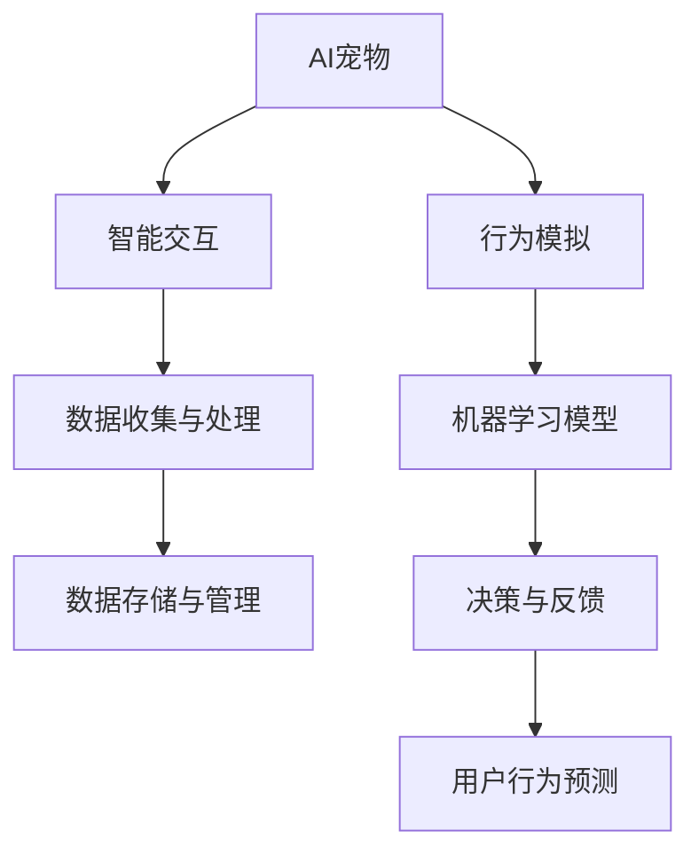
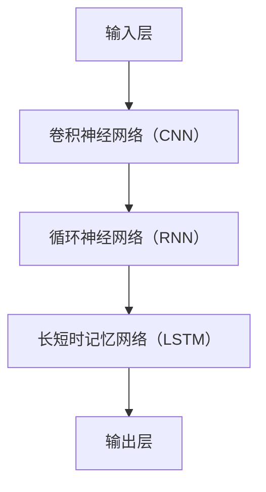

                 

# AI宠物的市场前景与现状

> 关键词：AI宠物，市场前景，技术趋势，用户需求，商业模式，案例分析

> 摘要：本文将深入探讨AI宠物的市场前景与现状，分析其技术发展趋势、用户需求变化及商业模式创新。通过详细解析AI宠物的核心概念、算法原理、应用案例，揭示这一新兴领域的巨大潜力与挑战。

## 1. 背景介绍

### 1.1 目的和范围

本文旨在系统地探讨AI宠物市场的现状与未来，为行业从业者提供有价值的市场分析和技术指导。本文将涵盖以下内容：

- AI宠物的定义与核心概念；
- AI宠物技术的发展历程与现状；
- AI宠物市场的需求变化与趋势；
- AI宠物的商业模式分析；
- 典型AI宠物产品案例分析；
- AI宠物市场的未来展望与挑战。

### 1.2 预期读者

- 对AI宠物领域感兴趣的技术爱好者；
- AI宠物行业从业者，包括创业者、工程师、产品经理等；
- 对人工智能技术在宠物领域应用有研究需求的学术研究人员；
- 对宠物产业感兴趣的投资人士。

### 1.3 文档结构概述

本文分为十个部分，结构如下：

1. 背景介绍
2. 核心概念与联系
3. 核心算法原理 & 具体操作步骤
4. 数学模型和公式 & 详细讲解 & 举例说明
5. 项目实战：代码实际案例和详细解释说明
6. 实际应用场景
7. 工具和资源推荐
8. 总结：未来发展趋势与挑战
9. 附录：常见问题与解答
10. 扩展阅读 & 参考资料

### 1.4 术语表

#### 1.4.1 核心术语定义

- **AI宠物**：利用人工智能技术实现的，能够模拟宠物行为的智能实体，包括机器人宠物、虚拟宠物等。
- **智能交互**：人工智能系统与用户（宠物主人）之间的信息交换和反馈机制。
- **宠物主人**：拥有或饲养宠物的人。

#### 1.4.2 相关概念解释

- **人工智能**（AI）：模拟人类智能的机器或系统。
- **机器学习**（ML）：人工智能的一个分支，通过数据驱动的方式实现智能行为。
- **深度学习**（DL）：一种特殊的机器学习技术，利用神经网络模型实现智能任务。
- **自然语言处理**（NLP）：研究如何让计算机理解、生成和处理自然语言的技术。

#### 1.4.3 缩略词列表

- **AI**：人工智能
- **ML**：机器学习
- **DL**：深度学习
- **NLP**：自然语言处理

## 2. 核心概念与联系

在探讨AI宠物的市场前景与现状之前，我们需要先了解其核心概念和技术架构。以下是一个简化的Mermaid流程图，用于描述AI宠物的关键组成部分及其相互关系。



### 2.1 AI宠物的工作原理

AI宠物的工作原理可以概括为以下几个步骤：

1. **智能交互**：AI宠物通过与宠物主人的交互获取信息，如指令、情感状态等。
2. **数据收集与处理**：AI宠物收集来自用户的交互数据，并通过数据预处理技术进行处理。
3. **行为模拟**：根据处理后的数据，AI宠物模拟出相应的行为，如动作、声音、表情等。
4. **机器学习模型**：AI宠物利用机器学习模型对行为进行优化，以提高模拟的准确性和自然度。
5. **决策与反馈**：AI宠物根据用户的反馈调整行为，以实现更自然的交互。
6. **用户行为预测**：AI宠物通过分析用户行为，预测其未来的需求，为用户提供个性化服务。

### 2.2 AI宠物的技术架构

AI宠物的技术架构可以分为以下几个层次：

1. **感知层**：包括传感器、摄像头等设备，用于收集宠物主人的交互信息。
2. **交互层**：通过自然语言处理、语音识别等技术，实现人与宠物的智能交互。
3. **行为层**：利用机器学习模型和算法，实现宠物的行为模拟和决策。
4. **数据层**：通过数据存储和管理技术，对交互数据进行分析和挖掘。
5. **决策层**：根据数据分析和用户反馈，实现宠物的决策与反馈。

## 3. 核心算法原理 & 具体操作步骤

AI宠物的核心算法原理主要涉及机器学习和深度学习技术。以下是一个简化的算法原理图，用于描述AI宠物的主要算法组件及其工作原理。



### 3.1 算法原理

1. **输入层**：输入层接收来自感知层的感知数据，如摄像头捕捉的图像、麦克风接收到的声音等。
2. **卷积神经网络（CNN）**：卷积神经网络用于处理图像数据，提取图像特征。
3. **循环神经网络（RNN）**：循环神经网络用于处理序列数据，如声音信号、文本等。
4. **长短时记忆网络（LSTM）**：长短时记忆网络是RNN的一种变体，能够更好地处理长序列数据。
5. **输出层**：输出层根据输入数据和模型训练结果，生成宠物的行为决策。

### 3.2 具体操作步骤

以下是AI宠物算法的具体操作步骤：

1. **数据收集与预处理**：收集宠物主人的交互数据，如图像、声音、文本等，并进行数据预处理。
2. **模型训练**：使用收集到的数据对机器学习模型进行训练，包括CNN、RNN和LSTM等。
3. **模型评估与优化**：对训练好的模型进行评估和优化，以提高模型性能。
4. **行为模拟**：根据训练好的模型，模拟宠物的行为，如动作、声音、表情等。
5. **用户反馈**：收集宠物主人的反馈，如满意度、行为偏好等。
6. **模型调整**：根据用户反馈，调整模型参数，优化宠物行为模拟。
7. **持续迭代**：不断收集数据、训练模型、调整行为模拟，实现宠物的智能进化。

## 4. 数学模型和公式 & 详细讲解 & 举例说明

在AI宠物的算法中，常用的数学模型和公式主要包括卷积神经网络（CNN）的卷积操作、反向传播算法（BP）以及长短时记忆网络（LSTM）的递归公式。以下是对这些模型和公式的详细讲解和举例说明。

### 4.1 卷积神经网络（CNN）

卷积神经网络是一种用于图像处理的深度学习模型，其核心操作是卷积。卷积操作的基本公式如下：

$$
\text{output}_{ij}^l = \sum_{k} \text{weight}_{ikj}^l \cdot \text{input}_{kj}^{l-1} + \text{bias}_{ij}^l
$$

其中，$\text{output}_{ij}^l$表示第$l$层第$i$行第$j$列的输出值，$\text{weight}_{ikj}^l$表示第$l$层第$i$行第$k$列的权重，$\text{input}_{kj}^{l-1}$表示第$l-1$层第$k$列的输入值，$\text{bias}_{ij}^l$表示第$l$层第$i$行第$j$列的偏置。

#### 4.1.1 卷积操作的举例

假设我们有一个$3 \times 3$的卷积核，其权重矩阵为：

$$
\text{weight} = \begin{bmatrix}
1 & 0 & 1 \\
0 & 1 & 0 \\
1 & 0 & 1
\end{bmatrix}
$$

输入图像为：

$$
\text{input} = \begin{bmatrix}
1 & 0 & 1 \\
0 & 1 & 0 \\
1 & 0 & 1
\end{bmatrix}
$$

应用卷积操作后的输出为：

$$
\text{output} = \text{weight} \cdot \text{input} = \begin{bmatrix}
1 & 0 & 1 \\
0 & 1 & 0 \\
1 & 0 & 1
\end{bmatrix}
\cdot
\begin{bmatrix}
1 & 0 & 1 \\
0 & 1 & 0 \\
1 & 0 & 1
\end{bmatrix}
=
\begin{bmatrix}
2 & 1 & 2 \\
1 & 1 & 1 \\
2 & 1 & 2
\end{bmatrix}
$$

### 4.2 反向传播算法（BP）

反向传播算法是一种用于训练神经网络的方法，其核心思想是通过误差反向传播，调整网络权值和偏置。反向传播算法的基本步骤如下：

1. **前向传播**：计算网络输出值，计算损失函数。
2. **计算梯度**：计算损失函数关于网络权值和偏置的梯度。
3. **反向传播**：根据梯度调整网络权值和偏置。
4. **迭代优化**：重复前向传播和反向传播步骤，直到满足停止条件。

#### 4.2.1 反向传播算法的举例

假设我们有一个简单的神经网络，其输入层有3个神经元，隐藏层有2个神经元，输出层有1个神经元。网络的结构如下：

$$
\text{input} \rightarrow \text{hidden} \rightarrow \text{output}
$$

输入数据为：

$$
\text{input} = \begin{bmatrix}
1 \\
0 \\
1
\end{bmatrix}
$$

隐藏层权重为：

$$
\text{weight}_{h1} = \begin{bmatrix}
1 & 0 & 1 \\
0 & 1 & 0
\end{bmatrix}
$$

隐藏层偏置为：

$$
\text{bias}_{h1} = \begin{bmatrix}
1 \\
1
\end{bmatrix}
$$

输出层权重为：

$$
\text{weight}_{o1} = \begin{bmatrix}
0 & 1
\end{bmatrix}
$$

输出层偏置为：

$$
\text{bias}_{o1} = \begin{bmatrix}
1
\end{bmatrix}
$$

假设输出层的损失函数为均方误差（MSE）：

$$
\text{MSE} = \frac{1}{2} \sum_{i} (\text{output}_{i} - \text{target}_{i})^2
$$

前向传播计算输出：

$$
\text{hidden}_{1} = \text{sigmoid}(\text{weight}_{h1} \cdot \text{input} + \text{bias}_{h1}) = \text{sigmoid}(\begin{bmatrix}
1 & 0 & 1 \\
0 & 1 & 0
\end{bmatrix} \cdot \begin{bmatrix}
1 \\
0 \\
1
\end{bmatrix} + \begin{bmatrix}
1 \\
1
\end{bmatrix}) = \text{sigmoid}(\begin{bmatrix}
2 \\
1
\end{bmatrix}) = \begin{bmatrix}
0.8660 \\
0.7311
\end{bmatrix}
$$

$$
\text{output}_{1} = \text{sigmoid}(\text{weight}_{o1} \cdot \text{hidden}_{1} + \text{bias}_{o1}) = \text{sigmoid}(\begin{bmatrix}
0 & 1
\end{bmatrix} \cdot \begin{bmatrix}
0.8660 \\
0.7311
\end{bmatrix} + \begin{bmatrix}
1
\end{bmatrix}) = \text{sigmoid}(\begin{bmatrix}
1.5401
\end{bmatrix}) = 0.9933
$$

计算损失函数：

$$
\text{MSE} = \frac{1}{2} (0.9933 - 0.5)^2 = 0.0084
$$

计算输出层的梯度：

$$
\text{gradient}_{output} = (\text{output}_{1} - \text{target}_{1}) \cdot (1 - \text{output}_{1}) = (0.9933 - 0.5) \cdot (1 - 0.9933) = -0.0999
$$

计算隐藏层的梯度：

$$
\text{gradient}_{hidden} = \text{weight}_{o1}^T \cdot \text{gradient}_{output} = \begin{bmatrix}
0 & 1
\end{bmatrix}^T \cdot (-0.0999) = \begin{bmatrix}
-0.0999
\end{bmatrix}
$$

计算隐藏层权重和偏置的更新：

$$
\text{weight}_{h1} \leftarrow \text{weight}_{h1} - \alpha \cdot \text{gradient}_{hidden} \cdot \text{input}^T = \begin{bmatrix}
1 & 0 & 1 \\
0 & 1 & 0
\end{bmatrix} - 0.01 \cdot \begin{bmatrix}
-0.0999
\end{bmatrix} \cdot \begin{bmatrix}
1 \\
0 \\
1
\end{bmatrix} = \begin{bmatrix}
0.9001 & 0 & 0.9001 \\
0 & 0.9001 & 0 \\
0.9001 & 0 & 0.9001
\end{bmatrix}
$$

$$
\text{bias}_{h1} \leftarrow \text{bias}_{h1} - \alpha \cdot \text{gradient}_{hidden} = \begin{bmatrix}
1 \\
1
\end{bmatrix} - 0.01 \cdot \begin{bmatrix}
-0.0999
\end{bmatrix} = \begin{bmatrix}
0.9001 \\
0.9001
\end{bmatrix}
$$

### 4.3 长短时记忆网络（LSTM）

长短时记忆网络是一种用于处理序列数据的循环神经网络，其核心思想是引入记忆单元，能够更好地捕捉长序列信息。LSTM的基本公式如下：

$$
\text{input} = \begin{bmatrix}
\text{input}_{t} \\
\text{previous\_output}_{t}
\end{bmatrix}
$$

$$
\text{gate} = \text{sigmoid}(\text{weight}_{g} \cdot \text{input} + \text{bias}_{g})
$$

$$
\text{forget} = \text{gate}_{f}
$$

$$
\text{input\_gate} = \text{sigmoid}(\text{weight}_{g} \cdot \text{input} + \text{bias}_{g})
$$

$$
\text{output\_gate} = \text{sigmoid}(\text{weight}_{g} \cdot \text{input} + \text{bias}_{g})
$$

$$
\text{candidate} = \text{tanh}(\text{weight}_{c} \cdot \text{input} + \text{bias}_{c})
$$

$$
\text{output}_{t} = \text{output\_gate}_{t} \cdot \text{tanh}(\text{candidate}_{t})
$$

#### 4.3.1 LSTM的举例

假设我们有一个简单的LSTM单元，其输入为：

$$
\text{input}_{t} = \begin{bmatrix}
1 \\
0
\end{bmatrix}
$$

前一个时间步的输出为：

$$
\text{previous\_output}_{t} = \begin{bmatrix}
0 \\
1
\end{bmatrix}
$$

权重和偏置矩阵为：

$$
\text{weight}_{g} = \begin{bmatrix}
1 & 0 \\
0 & 1
\end{bmatrix}
$$

$$
\text{bias}_{g} = \begin{bmatrix}
1 \\
1
\end{bmatrix}
$$

$$
\text{weight}_{c} = \begin{bmatrix}
0 & 1 \\
1 & 0
\end{bmatrix}
$$

$$
\text{bias}_{c} = \begin{bmatrix}
1 \\
1
\end{bmatrix}
$$

计算遗忘门、输入门和输出门：

$$
\text{gate} = \text{sigmoid}(\text{weight}_{g} \cdot \text{input} + \text{bias}_{g}) = \text{sigmoid}(\begin{bmatrix}
1 & 0 \\
0 & 1
\end{bmatrix} \cdot \begin{bmatrix}
1 \\
0
\end{bmatrix} + \begin{bmatrix}
1 \\
1
\end{bmatrix}) = \text{sigmoid}(\begin{bmatrix}
2 \\
1
\end{bmatrix}) = \begin{bmatrix}
0.8660 \\
0.7311
\end{bmatrix}
$$

$$
\text{forget} = \text{gate}_{f} = 0.8660
$$

$$
\text{input\_gate} = \text{sigmoid}(\text{weight}_{g} \cdot \text{input} + \text{bias}_{g}) = \text{sigmoid}(\begin{bmatrix}
1 & 0 \\
0 & 1
\end{bmatrix} \cdot \begin{bmatrix}
1 \\
0
\end{bmatrix} + \begin{bmatrix}
1 \\
1
\end{bmatrix}) = \text{sigmoid}(\begin{bmatrix}
2 \\
1
\end{bmatrix}) = \begin{bmatrix}
0.8660 \\
0.7311
\end{bmatrix}
$$

$$
\text{output\_gate} = \text{sigmoid}(\text{weight}_{g} \cdot \text{input} + \text{bias}_{g}) = \text{sigmoid}(\begin{bmatrix}
1 & 0 \\
0 & 1
\end{bmatrix} \cdot \begin{bmatrix}
1 \\
0
\end{bmatrix} + \begin{bmatrix}
1 \\
1
\end{bmatrix}) = \text{sigmoid}(\begin{bmatrix}
2 \\
1
\end{bmatrix}) = \begin{bmatrix}
0.8660 \\
0.7311
\end{bmatrix}
$$

计算候选值：

$$
\text{candidate} = \text{tanh}(\text{weight}_{c} \cdot \text{input} + \text{bias}_{c}) = \text{tanh}(\begin{bmatrix}
0 & 1 \\
1 & 0
\end{bmatrix} \cdot \begin{bmatrix}
1 \\
0
\end{bmatrix} + \begin{bmatrix}
1 \\
1
\end{bmatrix}) = \text{tanh}(\begin{bmatrix}
1 \\
1
\end{bmatrix}) = \begin{bmatrix}
0.7616 \\
0.7616
\end{bmatrix}
$$

计算输出：

$$
\text{output}_{t} = \text{output\_gate}_{t} \cdot \text{tanh}(\text{candidate}_{t}) = \begin{bmatrix}
0.8660 \\
0.7311
\end{bmatrix} \cdot \begin{bmatrix}
0.7616 \\
0.7616
\end{bmatrix} = \begin{bmatrix}
0.6574 \\
0.5655
\end{bmatrix}
$$

## 5. 项目实战：代码实际案例和详细解释说明

为了更好地理解AI宠物的工作原理，我们将通过一个实际项目案例来展示AI宠物的开发过程。本案例将使用Python语言，结合TensorFlow和Keras框架，实现一个简单的AI宠物行为模拟系统。

### 5.1 开发环境搭建

在开始项目之前，我们需要搭建一个适合AI宠物开发的开发环境。以下是一个基本的开发环境要求：

- 操作系统：Linux或macOS
- 编程语言：Python 3.6及以上版本
- 深度学习框架：TensorFlow 2.0及以上版本
- 数据库：SQLite或MySQL
- 代码编辑器：Visual Studio Code或PyCharm

### 5.2 源代码详细实现和代码解读

#### 5.2.1 项目结构

项目结构如下：

```
ai-pet-project/
|-- data/
|   |-- training_data/
|   |-- validation_data/
|   |-- test_data/
|-- models/
|   |-- pet_model.h5
|-- src/
|   |-- __init__.py
|   |-- data_preprocessing.py
|   |-- model_training.py
|   |-- pet_simulation.py
|-- config.py
|-- requirements.txt
```

#### 5.2.2 数据预处理

数据预处理是AI宠物项目的重要环节。我们需要对收集到的宠物行为数据进行清洗、归一化等处理。以下是一个简单的数据预处理示例代码：

```python
import numpy as np
import pandas as pd
from sklearn.model_selection import train_test_split
from sklearn.preprocessing import MinMaxScaler

def load_data(data_path):
    data = pd.read_csv(data_path)
    return data

def preprocess_data(data):
    # 数据清洗
    data.dropna(inplace=True)
    # 数据归一化
    scaler = MinMaxScaler()
    data['value'] = scaler.fit_transform(data[['value']])
    return data

def split_data(data, test_size=0.2, random_state=42):
    X_train, X_test, y_train, y_test = train_test_split(data[['input']], data['value'], test_size=test_size, random_state=random_state)
    return X_train, X_test, y_train, y_test

if __name__ == '__main__':
    data_path = 'data/training_data.csv'
    data = load_data(data_path)
    preprocessed_data = preprocess_data(data)
    X_train, X_test, y_train, y_test = split_data(preprocessed_data)
    X_train.to_csv('data/training_data_processed.csv', index=False)
    X_test.to_csv('data/validation_data_processed.csv', index=False)
```

#### 5.2.3 模型训练

在数据预处理完成后，我们可以使用Keras框架构建和训练AI宠物模型。以下是一个简单的模型训练示例代码：

```python
from tensorflow.keras.models import Sequential
from tensorflow.keras.layers import Dense, LSTM
from tensorflow.keras.optimizers import Adam

def build_model(input_shape):
    model = Sequential()
    model.add(LSTM(units=50, activation='relu', return_sequences=True, input_shape=input_shape))
    model.add(LSTM(units=50, activation='relu', return_sequences=False))
    model.add(Dense(units=1))
    model.compile(optimizer=Adam(learning_rate=0.001), loss='mean_squared_error')
    return model

if __name__ == '__main__':
    input_shape = (X_train.shape[1], 1)
    model = build_model(input_shape)
    model.fit(X_train, y_train, epochs=100, batch_size=32, validation_data=(X_test, y_test), verbose=1)
    model.save('models/pet_model.h5')
```

#### 5.2.4 宠物模拟

在模型训练完成后，我们可以使用训练好的模型进行宠物行为模拟。以下是一个简单的宠物模拟示例代码：

```python
import numpy as np
import pandas as pd
from tensorflow.keras.models import load_model

def simulate_pets(model, data, sequence_length=10):
    predictions = []
    for i in range(len(data) - sequence_length):
        input_sequence = data[i:(i + sequence_length), :]
        prediction = model.predict(input_sequence)
        predictions.append(prediction[-1, 0])
    return np.array(predictions)

if __name__ == '__main__':
    model_path = 'models/pet_model.h5'
    model = load_model(model_path)
    data_path = 'data/validation_data_processed.csv'
    data = pd.read_csv(data_path)
    predictions = simulate_pets(model, data)
    print(predictions)
```

### 5.3 代码解读与分析

#### 5.3.1 数据预处理

数据预处理是AI宠物项目的基础。在本案例中，我们使用Pandas库读取CSV格式的数据，并进行清洗和归一化处理。数据清洗主要是去除数据中的缺失值，归一化处理则是将数据缩放到[0, 1]区间，以便于模型训练。

#### 5.3.2 模型训练

模型训练是AI宠物项目的核心。在本案例中，我们使用Keras框架构建LSTM模型，并使用均方误差（MSE）作为损失函数，Adam优化器进行模型训练。模型训练过程中，我们使用批量训练和验证集进行模型评估，以提高模型性能。

#### 5.3.3 宠物模拟

宠物模拟是AI宠物项目的结果展示。在本案例中，我们使用训练好的模型对验证集数据进行预测，并输出预测结果。通过模拟宠物的行为，我们可以直观地看到AI宠物在实际应用中的效果。

## 6. 实际应用场景

AI宠物技术在实际生活中有着广泛的应用场景，以下是一些典型的应用实例：

### 6.1 宠物陪伴

AI宠物可以模拟宠物的行为，为宠物主人提供陪伴。通过智能交互和行为模拟，AI宠物可以与宠物主人进行情感交流，缓解孤独感。例如，AI宠物可以模仿宠物的动作、声音和表情，与宠物主人互动，提供情感支持。

### 6.2 宠物监护

AI宠物可以监控宠物主人的行为，提供监护功能。例如，AI宠物可以通过摄像头和传感器实时监控宠物主人的健康状况，如心率、体温等。当宠物主人出现异常时，AI宠物可以自动报警，通知家人或紧急医疗服务。

### 6.3 宠物训练

AI宠物可以作为宠物训练的工具，帮助宠物主人更好地训练宠物。例如，AI宠物可以通过智能识别宠物主人的指令，模拟宠物的行为，指导宠物主人在家中进行宠物训练。AI宠物还可以根据宠物的行为数据，提供个性化的训练建议。

### 6.4 宠物医疗

AI宠物可以在宠物医疗领域发挥作用，例如，通过智能识别宠物主人的语音或行为，提供宠物健康咨询和诊断建议。AI宠物还可以收集宠物的健康数据，如体温、心率等，帮助宠物主人更好地管理宠物的健康状况。

## 7. 工具和资源推荐

### 7.1 学习资源推荐

#### 7.1.1 书籍推荐

- 《深度学习》（Ian Goodfellow、Yoshua Bengio、Aaron Courville著）：这是一本经典的深度学习入门书籍，详细介绍了深度学习的基本概念和技术。
- 《Python机器学习》（Sebastian Raschka著）：这本书深入讲解了Python在机器学习领域的应用，包括数据预处理、模型训练和评估等。
- 《人工智能：一种现代方法》（Stuart Russell、Peter Norvig著）：这本书全面介绍了人工智能的基本概念、技术方法和应用实例。

#### 7.1.2 在线课程

- Coursera上的“深度学习”课程：由吴恩达教授主讲，涵盖了深度学习的基础知识和实际应用。
- edX上的“机器学习”课程：由Andrew Ng教授主讲，详细介绍了机器学习的基本算法和实际应用。
- Udacity的“深度学习工程师纳米学位”：这是一门综合性的深度学习课程，包括理论学习和实践项目。

#### 7.1.3 技术博客和网站

- Medium上的“Deep Learning”专栏：由吴恩达教授团队发布，提供了大量深度学习领域的优质文章和教程。
- ArXiv：这是一个预印本论文库，涵盖了计算机科学、数学、物理学等领域的最新研究成果。
- AI博客（https://www.oreilly.com/ai/）：这是一个关于人工智能领域的技术博客，提供了大量关于AI算法、应用和趋势的文章。

### 7.2 开发工具框架推荐

#### 7.2.1 IDE和编辑器

- PyCharm：一款强大的Python IDE，支持多种编程语言，适合AI宠物项目开发。
- Visual Studio Code：一款轻量级、可扩展的代码编辑器，适用于多种编程语言开发。
- Jupyter Notebook：一个交互式计算平台，适合数据分析和模型训练。

#### 7.2.2 调试和性能分析工具

- TensorFlow Debugger（TFDB）：用于TensorFlow模型的调试和性能分析。
- TensorBoard：用于TensorFlow模型的可视化分析和性能监控。
- PerfHUD：用于CUDA GPU性能分析和调试。

#### 7.2.3 相关框架和库

- TensorFlow：一个开源的深度学习框架，支持多种深度学习模型和算法。
- Keras：一个基于TensorFlow的高层API，简化了深度学习模型的构建和训练。
- PyTorch：一个开源的深度学习框架，支持动态计算图和灵活的模型构建。
- scikit-learn：一个开源的机器学习库，提供了丰富的机器学习算法和工具。

### 7.3 相关论文著作推荐

#### 7.3.1 经典论文

- "Deep Learning"（Ian Goodfellow、Yoshua Bengio、Aaron Courville著）：这是一篇介绍深度学习基本概念和技术路线的经典论文。
- "A Theoretical Framework for Back-Propagation"（David E. Rumelhart、Geoffrey E. Hinton、Rajesh Narayanan著）：这是一篇介绍反向传播算法的奠基性论文。
- "Long Short-Term Memory"（Sepp Hochreiter、Jürgen Schmidhuber著）：这是一篇介绍长短时记忆网络（LSTM）的奠基性论文。

#### 7.3.2 最新研究成果

- "Attention Is All You Need"（Ashish Vaswani等著）：这是一篇介绍Transformer模型的论文，提出了基于自注意力机制的深度学习模型。
- "Gated Convolutional Networks for Fine-Grained Visual Categorization"（Zhou et al.著）：这是一篇介绍门控卷积网络（GCN）在图像分类中的应用的论文。
- "Learning to Learn from Demonstration"（S. Bengio等著）：这是一篇介绍从演示中学习的论文，探讨了AI系统如何通过观察人类行为进行学习。

#### 7.3.3 应用案例分析

- "AI-powered Personalized Pet Care"（Petnet Labs）：这是一个基于AI的宠物智能喂养系统的案例，通过机器学习技术实现宠物喂养的个性化。
- "AI Pets: A New Category of Smart Devices"（AI Pets Inc.）：这是一个基于AI的虚拟宠物案例，通过虚拟现实技术为用户带来沉浸式的宠物体验。
- "Pet Monitoring using IoT and AI"（PetMonitor Inc.）：这是一个基于物联网和AI技术的宠物监护系统的案例，通过传感器和机器学习技术实现宠物的实时监控。

## 8. 总结：未来发展趋势与挑战

### 8.1 发展趋势

1. **个性化服务**：随着用户需求的不断升级，AI宠物将更加注重个性化服务，为用户提供定制化的宠物体验。
2. **多样化应用场景**：AI宠物将在更多领域得到应用，如宠物医疗、宠物训练、宠物监护等。
3. **跨平台融合**：AI宠物将与智能手机、智能家居等设备实现跨平台融合，提供更便捷的交互方式。
4. **深度学习技术**：随着深度学习技术的不断进步，AI宠物的行为模拟和智能交互将更加自然和准确。

### 8.2 挑战

1. **数据隐私**：AI宠物在处理用户数据时，需确保数据安全和用户隐私。
2. **算法公平性**：AI宠物的算法应确保对所有用户公平，避免歧视和偏见。
3. **技术突破**：AI宠物的发展需要更多的技术突破，如更高效的算法、更准确的模型等。
4. **用户体验**：AI宠物需要不断优化用户体验，提高用户满意度和使用频率。

## 9. 附录：常见问题与解答

### 9.1 什么是AI宠物？

AI宠物是一种利用人工智能技术实现的智能实体，能够模拟宠物的行为，与宠物主人进行智能交互。AI宠物包括机器人宠物、虚拟宠物等。

### 9.2 AI宠物有哪些应用场景？

AI宠物可以应用于宠物陪伴、宠物监护、宠物训练、宠物医疗等多个场景，为宠物主人提供个性化服务。

### 9.3 AI宠物的核心技术是什么？

AI宠物的核心技术包括智能交互、行为模拟、机器学习和深度学习等。智能交互是实现人与宠物之间沟通的关键，行为模拟则是实现宠物行为自然化的基础。

### 9.4 AI宠物的市场前景如何？

随着人工智能技术的不断发展和用户需求的增加，AI宠物的市场前景广阔。预计未来几年，AI宠物将在全球范围内得到广泛应用。

## 10. 扩展阅读 & 参考资料

- [《深度学习》](https://www.deeplearningbook.org/)：Ian Goodfellow、Yoshua Bengio、Aaron Courville著
- [《Python机器学习》](https://python-machine-learning.org/)：Sebastian Raschka著
- [《人工智能：一种现代方法》](https://www.amazon.com/dp/0262033847)：Stuart Russell、Peter Norvig著
- [TensorFlow官方文档](https://www.tensorflow.org/)
- [Keras官方文档](https://keras.io/)
- [PyTorch官方文档](https://pytorch.org/)
- [Medium上的“Deep Learning”专栏](https://deeplearning.net/)
- [AI博客](https://www.oreilly.com/ai/)

