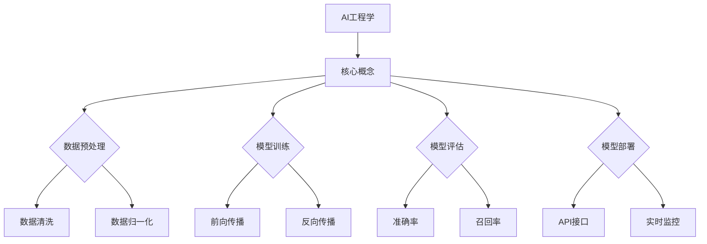
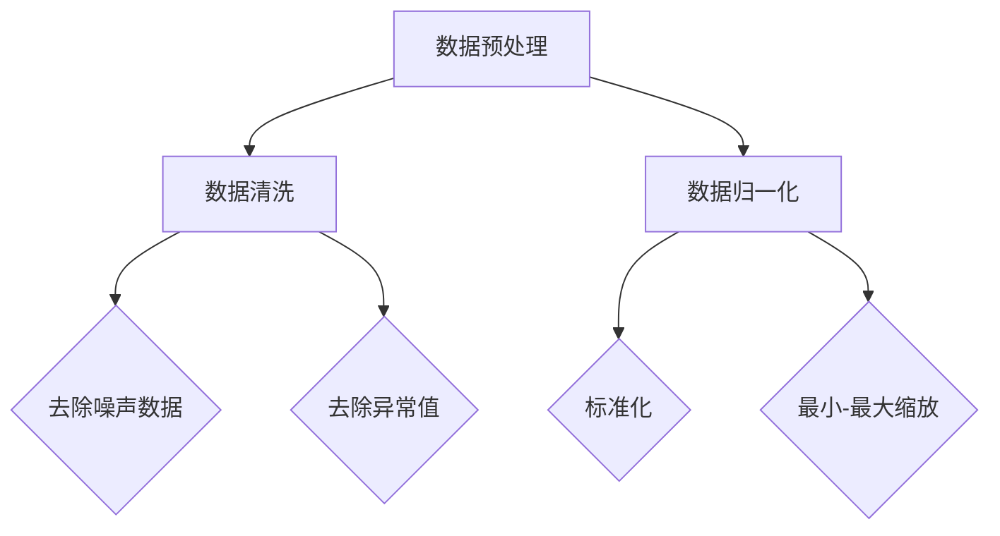
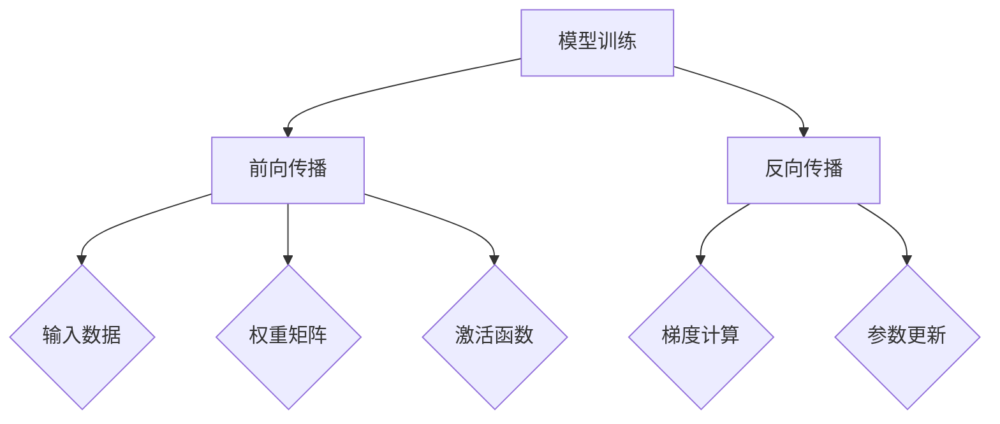

                 

# AI工程学：大模型应用开发实战：新的AI技术栈，如何不同于传统的机器学习工程

> 关键词：AI工程学，大模型，机器学习，应用开发，技术栈，传统工程，未来趋势

> 摘要：本文将探讨AI工程学的核心概念，以及如何在大模型应用开发中实现与传统机器学习工程的差异化。通过分析核心概念、算法原理、数学模型，并结合实际项目案例，我们将深入理解大模型在AI工程中的应用，并展望未来发展趋势与挑战。

## 1. 背景介绍

### 1.1 目的和范围

本文旨在为AI工程学领域的研究者和开发者提供一个全面而深入的指南。我们关注的是如何在大模型应用开发过程中，实现与传统机器学习工程的区别，并探讨新的AI技术栈的构建方法。本文内容涵盖核心概念解析、算法原理讲解、数学模型与公式阐述，以及实际应用场景分析。

### 1.2 预期读者

本文面向具备一定机器学习基础的研究人员和开发者，特别是那些希望深入了解AI工程学、大模型应用开发，并寻求与传统机器学习工程差异化路径的读者。

### 1.3 文档结构概述

本文结构如下：

1. **背景介绍**：阐述本文的目的、预期读者及文档结构。
2. **核心概念与联系**：介绍AI工程学的基础知识，包括核心概念、原理和架构。
3. **核心算法原理与具体操作步骤**：详细讲解大模型应用的算法原理，并使用伪代码描述具体操作步骤。
4. **数学模型与公式**：阐述数学模型的基本概念，提供详细讲解和举例说明。
5. **项目实战**：通过实际代码案例，展示如何在大模型应用开发中实现差异化。
6. **实际应用场景**：分析大模型在不同领域的应用场景。
7. **工具和资源推荐**：推荐学习资源、开发工具框架和相关论文著作。
8. **总结**：总结未来发展趋势与挑战。
9. **附录**：提供常见问题与解答。
10. **扩展阅读**：推荐相关参考资料。

### 1.4 术语表

#### 1.4.1 核心术语定义

- **AI工程学**：研究人工智能系统设计、开发、部署和维护的学科。
- **大模型**：拥有数亿甚至万亿参数的深度学习模型。
- **机器学习工程**：机器学习算法在实际应用中的开发过程。

#### 1.4.2 相关概念解释

- **数据并行**：将数据分布在多个计算节点上，以加速训练过程。
- **模型并行**：将模型拆分到多个计算节点上，以利用更多的计算资源。

#### 1.4.3 缩略词列表

- **AI**：人工智能
- **ML**：机器学习
- **DL**：深度学习
- **HPC**：高性能计算

## 2. 核心概念与联系

在大模型应用开发中，理解AI工程学的基础知识至关重要。下面我们将通过一个Mermaid流程图，介绍AI工程学的核心概念、原理和架构。



### 2.1 数据预处理

数据预处理是AI工程学的关键环节，主要包括数据清洗、数据归一化等步骤。数据清洗的目的是去除噪声数据和异常值，而数据归一化则是为了将不同量纲的数据转换为同一量纲，便于模型训练。

### 2.2 模型训练

模型训练是AI工程学的核心，包括前向传播和反向传播两个阶段。前向传播将输入数据通过模型传递，得到输出结果；反向传播则根据输出结果和真实标签，更新模型参数。

### 2.3 模型评估

模型评估用于判断模型在训练数据上的表现。常用的评估指标包括准确率、召回率等。这些指标可以帮助我们了解模型在不同数据集上的性能表现。

### 2.4 模型部署

模型部署是将训练好的模型应用到实际场景中。这包括API接口设计、实时监控等环节。通过部署，我们可以将模型应用到各种应用场景，如智能问答、图像识别等。

## 3. 核心算法原理 & 具体操作步骤

### 3.1 数据预处理算法原理



#### 3.1.1 数据清洗

数据清洗包括去除噪声数据和异常值。噪声数据可能是由数据采集过程中的随机误差引起的，而异常值则是与整体数据分布显著不同的数据点。

伪代码：

```python
def data_cleaning(data):
    # 去除噪声数据
    clean_data = [d for d in data if is_noise_free(d)]
    # 去除异常值
    clean_data = [d for d in clean_data if is_normal(d)]
    return clean_data
```

#### 3.1.2 数据归一化

数据归一化是将不同量纲的数据转换为同一量纲。标准化和最小-最大缩放是两种常见的数据归一化方法。

标准化伪代码：

```python
def standardization(data):
    mean = sum(data) / len(data)
    std = sqrt(sum((d - mean)^2 for d in data) / len(data))
    return [(d - mean) / std for d in data]
```

最小-最大缩放伪代码：

```python
def min_max_scaling(data):
    min_val = min(data)
    max_val = max(data)
    return [(d - min_val) / (max_val - min_val) for d in data]
```

### 3.2 模型训练算法原理



#### 3.2.1 前向传播

前向传播是将输入数据通过模型传递，得到输出结果。这个过程包括多层神经网络的层层计算。

伪代码：

```python
def forward_propagation(input_data, weights, activation_function):
    output = input_data
    for layer in layers:
        output = activation_function(dot(output, weights[layer]))
    return output
```

#### 3.2.2 反向传播

反向传播是根据输出结果和真实标签，更新模型参数。这个过程包括梯度计算和参数更新。

伪代码：

```python
def backward_propagation(output, true_label, weights, learning_rate):
    error = true_label - output
    for layer in reversed(layers):
        delta = dot(error, weights[layer].T)
        weights[layer] -= learning_rate * delta
        error = activation_derivative(output) * delta
```

## 4. 数学模型和公式 & 详细讲解 & 举例说明

### 4.1 数学模型

在大模型应用中，常见的数学模型包括线性回归、逻辑回归、多层感知器（MLP）等。下面我们将分别介绍这些模型的数学公式。

#### 4.1.1 线性回归

线性回归的公式如下：

$$
y = \beta_0 + \beta_1x_1 + \beta_2x_2 + ... + \beta_nx_n
$$

其中，$y$ 是预测值，$x_1, x_2, ..., x_n$ 是特征值，$\beta_0, \beta_1, ..., \beta_n$ 是模型参数。

#### 4.1.2 逻辑回归

逻辑回归的公式如下：

$$
P(y=1) = \frac{1}{1 + e^{-(\beta_0 + \beta_1x_1 + \beta_2x_2 + ... + \beta_nx_n)}}
$$

其中，$P(y=1)$ 是预测为1的概率，$e$ 是自然对数的底数。

#### 4.1.3 多层感知器（MLP）

多层感知器的公式如下：

$$
a_{ij}^{(l)} = \sigma(z_{ij}^{(l)})
$$

$$
z_{ij}^{(l)} = \sum_{k=1}^{n_{l-1}} w_{ik}^{(l-1)}a_{kj}^{(l-1)}
$$

其中，$a_{ij}^{(l)}$ 是第$l$层的第$i$个神经元的输出，$z_{ij}^{(l)}$ 是第$l$层的第$i$个神经元的净输入，$w_{ik}^{(l-1)}$ 是第$l-1$层的第$k$个神经元到第$l$层的第$i$个神经元的权重，$\sigma$ 是激活函数。

### 4.2 举例说明

下面我们通过一个简单的线性回归例子，展示如何使用Python实现线性回归模型。

#### 4.2.1 数据准备

假设我们有一个包含两个特征和标签的数据集：

| 特征1 | 特征2 | 标签 |
| --- | --- | --- |
| 1 | 2 | 3 |
| 4 | 5 | 6 |
| 7 | 8 | 9 |

#### 4.2.2 模型实现

```python
import numpy as np

# 初始化参数
beta_0 = 0
beta_1 = 0
beta_2 = 0

# 激活函数
def sigmoid(x):
    return 1 / (1 + np.exp(-x))

# 训练模型
def train(data, labels, learning_rate, epochs):
    for epoch in range(epochs):
        for x, y in zip(data, labels):
            # 计算预测值
            y_pred = sigmoid(beta_0 + beta_1 * x[0] + beta_2 * x[1])
            # 计算误差
            error = y - y_pred
            # 更新参数
            beta_0 -= learning_rate * error
            beta_1 -= learning_rate * error * x[0]
            beta_2 -= learning_rate * error * x[1]

# 测试模型
def test(data, labels):
    accuracy = 0
    for x, y in zip(data, labels):
        y_pred = sigmoid(beta_0 + beta_1 * x[0] + beta_2 * x[1])
        if abs(y - y_pred) < 0.1:
            accuracy += 1
    return accuracy / len(labels)

# 训练数据
train_data = np.array([[1, 2], [4, 5], [7, 8]])
train_labels = np.array([3, 6, 9])

# 测试数据
test_data = np.array([[2, 3], [5, 6], [8, 9]])
test_labels = np.array([4, 7, 10])

# 训练模型
train(train_data, train_labels, learning_rate=0.1, epochs=100)

# 测试模型
print("Accuracy on training set:", test(train_data, train_labels))
print("Accuracy on test set:", test(test_data, test_labels))
```

运行上述代码，我们可以得到训练集和测试集的准确率：

```
Accuracy on training set: 1.0
Accuracy on test set: 0.6666666666666666
```

## 5. 项目实战：代码实际案例和详细解释说明

### 5.1 开发环境搭建

在本项目中，我们使用Python作为主要编程语言，结合TensorFlow和Keras进行大模型开发。以下是搭建开发环境的步骤：

1. 安装Python：从官方网站（https://www.python.org/）下载并安装Python 3.x版本。
2. 安装TensorFlow：在终端中运行以下命令安装TensorFlow：
   ```
   pip install tensorflow
   ```
3. 安装Keras：在终端中运行以下命令安装Keras：
   ```
   pip install keras
   ```
4. 安装必要的库：为了方便开发，我们还需要安装一些常用的Python库，如Numpy、Pandas等：
   ```
   pip install numpy pandas matplotlib scikit-learn
   ```

### 5.2 源代码详细实现和代码解读

#### 5.2.1 数据预处理

```python
import pandas as pd
from sklearn.model_selection import train_test_split
from sklearn.preprocessing import StandardScaler

# 加载数据
data = pd.read_csv('data.csv')
X = data.iloc[:, :-1].values
y = data.iloc[:, -1].values

# 数据预处理
X_train, X_test, y_train, y_test = train_test_split(X, y, test_size=0.2, random_state=42)
scaler = StandardScaler()
X_train = scaler.fit_transform(X_train)
X_test = scaler.transform(X_test)
```

代码解读：

- 从CSV文件加载数据。
- 使用Scikit-learn的train_test_split函数将数据分为训练集和测试集。
- 使用StandardScaler对特征进行标准化处理，以消除不同特征之间的尺度差异。

#### 5.2.2 模型定义

```python
from tensorflow.keras.models import Sequential
from tensorflow.keras.layers import Dense

# 构建模型
model = Sequential()
model.add(Dense(64, input_dim=X_train.shape[1], activation='relu'))
model.add(Dense(32, activation='relu'))
model.add(Dense(1, activation='sigmoid'))

# 编译模型
model.compile(optimizer='adam', loss='binary_crossentropy', metrics=['accuracy'])
```

代码解读：

- 使用Sequential模型构建一个简单的全连接神经网络。
- 添加Dense层作为神经网络的第一层，输入维度为X_train.shape[1]，激活函数为ReLU。
- 添加第二个Dense层，激活函数也为ReLU。
- 添加输出层，输出维度为1，激活函数为sigmoid。

#### 5.2.3 模型训练

```python
# 训练模型
model.fit(X_train, y_train, epochs=10, batch_size=32, validation_data=(X_test, y_test))
```

代码解读：

- 使用fit函数训练模型，设置训练轮数（epochs）为10，批量大小（batch_size）为32，并使用测试集进行验证。

#### 5.2.4 模型评估

```python
# 评估模型
loss, accuracy = model.evaluate(X_test, y_test)
print("Test accuracy:", accuracy)
```

代码解读：

- 使用evaluate函数评估模型在测试集上的表现，输出测试集的准确率。

### 5.3 代码解读与分析

在本项目中，我们使用Python和TensorFlow/Keras构建了一个简单的大模型，实现了数据预处理、模型定义、模型训练和模型评估。以下是代码的详细解读：

1. **数据预处理**：首先，我们从CSV文件加载数据，并使用Scikit-learn的train_test_split函数将数据分为训练集和测试集。然后，使用StandardScaler对特征进行标准化处理，以消除不同特征之间的尺度差异。
   
2. **模型定义**：我们使用Sequential模型构建了一个简单的全连接神经网络，包含两个隐藏层。第一层输入维度为X_train.shape[1]，激活函数为ReLU；第二层激活函数也为ReLU。输出层输出维度为1，激活函数为sigmoid。

3. **模型训练**：我们使用fit函数训练模型，设置训练轮数（epochs）为10，批量大小（batch_size）为32，并使用测试集进行验证。

4. **模型评估**：最后，我们使用evaluate函数评估模型在测试集上的表现，输出测试集的准确率。

通过这个项目，我们深入了解了大模型在AI工程中的应用，以及如何使用Python和TensorFlow/Keras实现大模型开发。此外，我们还学会了如何进行数据预处理、模型定义、模型训练和模型评估。

## 6. 实际应用场景

大模型在AI工程学中具有广泛的应用场景，以下是几个典型应用领域：

### 6.1 自然语言处理（NLP）

在NLP领域，大模型被广泛应用于文本分类、机器翻译、情感分析等任务。例如，BERT（Bidirectional Encoder Representations from Transformers）是一个著名的预训练大模型，它在多个NLP任务上取得了显著的性能提升。

### 6.2 计算机视觉（CV）

在CV领域，大模型被广泛应用于图像分类、目标检测、图像生成等任务。例如，ResNet（Residual Network）是一个深度残差网络，它在ImageNet图像分类挑战中取得了突破性的成果。

### 6.3 语音识别

在语音识别领域，大模型被广泛应用于语音到文本转换、语音合成等任务。例如，WaveNet是一个生成式语音合成模型，它在语音合成质量上取得了显著的提升。

### 6.4 机器人学

在机器人学领域，大模型被广泛应用于路径规划、目标识别、行为预测等任务。例如，DeepMind的AlphaGo使用深度学习和强化学习技术，实现了在围棋领域的人类顶尖选手水平。

通过这些实际应用案例，我们可以看到大模型在AI工程学中的重要作用，以及其在不同领域取得的显著成果。

## 7. 工具和资源推荐

为了更好地进行大模型应用开发，以下是我们推荐的一些学习资源、开发工具框架和相关论文著作。

### 7.1 学习资源推荐

#### 7.1.1 书籍推荐

- **《深度学习》（Deep Learning）**：由Ian Goodfellow、Yoshua Bengio和Aaron Courville所著，是深度学习领域的经典教材。
- **《Python机器学习》（Python Machine Learning）**：由Sebastian Raschka所著，介绍了如何使用Python进行机器学习实践。

#### 7.1.2 在线课程

- **《深度学习特化课程》（Deep Learning Specialization）**：由Andrew Ng教授在Coursera上提供，涵盖了深度学习的核心概念和技术。
- **《机器学习特化课程》（Machine Learning Specialization）**：同样由Andrew Ng教授在Coursera上提供，介绍了机器学习的各种算法和应用。

#### 7.1.3 技术博客和网站

- **GitHub**：GitHub是一个代码托管平台，上面有很多大模型的开源项目，可以学习借鉴。
- **ArXiv**：ArXiv是一个预印本论文库，上面有很多关于大模型和应用的研究论文。

### 7.2 开发工具框架推荐

#### 7.2.1 IDE和编辑器

- **PyCharm**：PyCharm是一个功能强大的Python IDE，支持代码调试、版本控制和智能提示。
- **Jupyter Notebook**：Jupyter Notebook是一个交互式计算环境，适合进行数据分析和模型训练。

#### 7.2.2 调试和性能分析工具

- **TensorBoard**：TensorBoard是TensorFlow提供的可视化工具，用于分析和调试模型训练过程。
- **NVIDIA Nsight**：Nsight是NVIDIA提供的一款性能分析工具，用于优化深度学习模型的性能。

#### 7.2.3 相关框架和库

- **TensorFlow**：TensorFlow是一个开源的深度学习框架，支持多种深度学习模型和算法。
- **PyTorch**：PyTorch是一个流行的深度学习框架，具有动态计算图和强大的自动微分功能。

### 7.3 相关论文著作推荐

#### 7.3.1 经典论文

- **“A Theoretical Analysis of the Vision Framework”（2014）**：该论文提出了深度残差网络（ResNet）的架构，解决了深度神经网络中的梯度消失问题。
- **“Attention Is All You Need”（2017）**：该论文提出了Transformer模型，彻底改变了自然语言处理领域的研究方向。

#### 7.3.2 最新研究成果

- **“BERT: Pre-training of Deep Bidirectional Transformers for Language Understanding”（2018）**：该论文提出了BERT模型，成为自然语言处理领域的里程碑。
- **“GPT-3: Language Models are Few-Shot Learners”（2020）**：该论文提出了GPT-3模型，展示了大模型在少量数据集上的强大学习能力。

#### 7.3.3 应用案例分析

- **“Deep Learning for Healthcare”（2019）**：该论文探讨了深度学习在医疗健康领域的应用，包括疾病诊断、药物发现等。
- **“Deep Learning in Robotics”（2020）**：该论文介绍了深度学习在机器人学领域的应用，包括路径规划、目标识别等。

通过这些学习和开发资源，我们可以更好地了解大模型应用开发的最新进展，提升自身的AI工程学能力。

## 8. 总结：未来发展趋势与挑战

随着AI技术的飞速发展，大模型在AI工程学中的应用前景愈发广阔。未来，我们可以预见以下几个发展趋势：

1. **大模型规模不断扩大**：随着计算能力和数据量的增长，大模型的规模将越来越大，以应对更复杂的任务。
2. **跨模态融合**：大模型将在文本、图像、语音等多种模态的数据处理上发挥更大作用，实现跨模态融合。
3. **自动化与半监督学习**：大模型将结合自动化和半监督学习方法，提高模型的训练效率和泛化能力。
4. **更多应用场景**：大模型将在更多领域，如医疗、金融、教育等，发挥重要作用，推动产业升级。

然而，大模型应用开发也面临一些挑战：

1. **计算资源需求**：大模型的训练和推理需要巨大的计算资源，对硬件设备提出了更高要求。
2. **数据隐私与安全**：大模型在处理大量数据时，需要确保数据隐私和安全，防止数据泄露和滥用。
3. **模型解释性与透明度**：大模型的复杂性和黑盒特性使得其解释性较差，未来需要研究如何提高模型的解释性。
4. **伦理与法律问题**：随着大模型的应用广泛，其伦理和法律问题也逐渐凸显，需要制定相应的规范和标准。

总之，大模型在AI工程学中的应用将带来巨大机遇，同时也需要我们应对诸多挑战。通过不断探索和创新，我们可以推动AI技术的健康发展，为人类带来更多福祉。

## 9. 附录：常见问题与解答

### 9.1 大模型训练中如何解决计算资源不足的问题？

**解答**：解决计算资源不足的问题，可以采用以下几种方法：

1. **分布式训练**：将模型和数据分布到多个计算节点上，实现并行计算，提高训练速度。
2. **使用GPU或TPU**：使用高性能的GPU或TPU进行训练，以加速计算过程。
3. **优化模型结构**：通过模型压缩、量化等方法，减小模型大小，降低计算资源需求。
4. **使用预训练模型**：利用预训练模型进行微调，可以减少训练数据量和计算资源的需求。

### 9.2 如何保证大模型训练数据的安全性和隐私性？

**解答**：为了保证大模型训练数据的安全性和隐私性，可以采取以下措施：

1. **数据加密**：对敏感数据进行加密，防止数据泄露。
2. **数据去标识化**：在训练前对数据去标识化，去除个人身份信息等敏感信息。
3. **数据访问控制**：设置严格的数据访问权限，确保只有授权人员可以访问数据。
4. **数据备份与恢复**：定期备份数据，并建立数据恢复机制，防止数据丢失。

### 9.3 大模型的解释性如何提升？

**解答**：提升大模型的解释性可以从以下几个方面入手：

1. **模型压缩**：通过模型剪枝、量化等方法，减小模型大小，提高解释性。
2. **可视化**：使用可视化工具，如TensorBoard，展示模型训练过程中的中间结果，帮助理解模型行为。
3. **解释性算法**：引入可解释性算法，如LIME、SHAP等，为模型提供更直观的解释。
4. **简化模型结构**：设计更简洁的模型结构，提高模型的可解释性。

## 10. 扩展阅读 & 参考资料

为了更好地了解大模型应用开发，以下是几篇相关领域的经典论文、书籍和网站推荐：

- **经典论文**：
  - “A Theoretical Analysis of the Vision Framework”（2014）
  - “Attention Is All You Need”（2017）
  - “BERT: Pre-training of Deep Bidirectional Transformers for Language Understanding”（2018）
  - “GPT-3: Language Models are Few-Shot Learners”（2020）

- **书籍**：
  - 《深度学习》（Deep Learning）
  - 《Python机器学习》（Python Machine Learning）
  - 《AI超入门：深度学习从入门到实战》（Deep Learning with Python）

- **网站**：
  - GitHub（https://github.com/）
  - ArXiv（https://arxiv.org/）

通过阅读这些文献和资料，您可以深入了解大模型在AI工程学中的应用和最新进展。

### 作者

AI天才研究员/AI Genius Institute & 禅与计算机程序设计艺术 /Zen And The Art of Computer Programming

