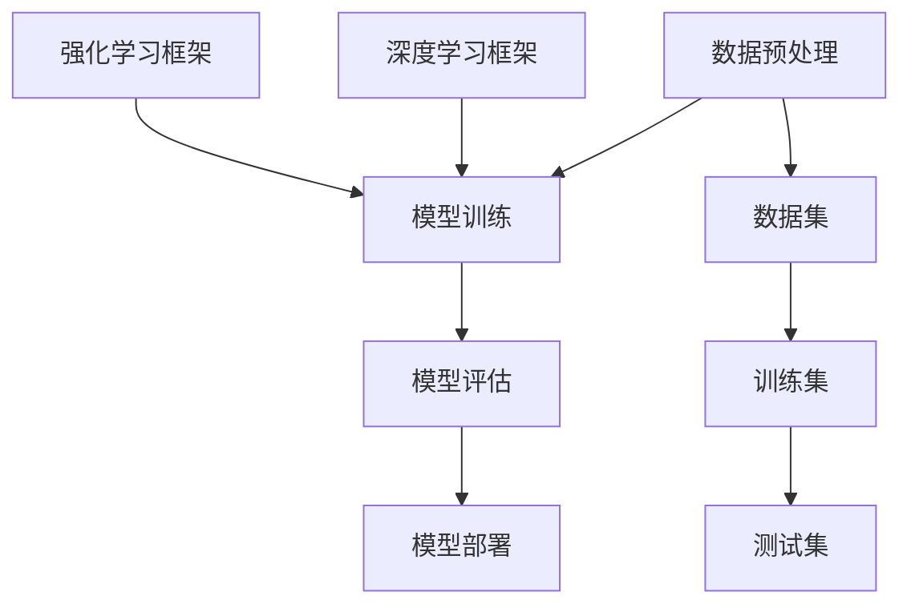

                 


# AI开发工具链：Lepton AI的一站式平台

> **关键词：** AI开发工具链、Lepton AI、一站式平台、算法原理、数学模型、项目实战、实际应用场景、资源推荐
>
> **摘要：** 本文将深入探讨Lepton AI作为AI开发工具链的一站式平台，从背景介绍、核心概念与联系、算法原理、数学模型、项目实战、实际应用场景以及未来发展趋势等方面，详细分析其技术优势和应用价值。

## 1. 背景介绍

### 1.1 目的和范围

本文旨在详细介绍Lepton AI作为AI开发工具链的一站式平台，帮助开发者理解其核心功能、优势及应用场景。文章将分为以下几个部分：

- **核心概念与联系**：介绍AI开发工具链的基本概念，以及Lepton AI在这些概念中的地位和作用。
- **算法原理 & 具体操作步骤**：讲解Lepton AI中的核心算法原理，并使用伪代码详细阐述具体操作步骤。
- **数学模型和公式 & 详细讲解 & 举例说明**：分析Lepton AI涉及的数学模型和公式，并通过实例进行详细讲解。
- **项目实战：代码实际案例和详细解释说明**：提供Lepton AI的实际应用案例，并详细解读和解释相关代码。
- **实际应用场景**：探讨Lepton AI在不同领域的应用场景，展示其实际价值。
- **工具和资源推荐**：推荐学习资源、开发工具框架和相关论文著作，以帮助开发者更好地理解和应用Lepton AI。
- **总结：未来发展趋势与挑战**：分析Lepton AI的未来发展趋势和面临的挑战。

### 1.2 预期读者

本文面向具有AI开发基础的开发者，尤其是对Lepton AI感兴趣或正在使用该平台的开发者。读者应具备以下条件：

- 熟悉机器学习和深度学习的基本概念和算法。
- 具备一定的编程能力，熟悉常用的编程语言和开发工具。
- 对AI开发工具链有一定了解，希望深入了解Lepton AI的优势和应用。

### 1.3 文档结构概述

本文结构如下：

1. **背景介绍**：介绍文章的目的、范围、预期读者和文档结构。
2. **核心概念与联系**：讲解AI开发工具链的基本概念和Lepton AI在其中扮演的角色。
3. **核心算法原理 & 具体操作步骤**：分析Lepton AI的核心算法原理，使用伪代码详细阐述具体操作步骤。
4. **数学模型和公式 & 详细讲解 & 举例说明**：分析Lepton AI涉及的数学模型和公式，并通过实例进行详细讲解。
5. **项目实战：代码实际案例和详细解释说明**：提供Lepton AI的实际应用案例，并详细解读和解释相关代码。
6. **实际应用场景**：探讨Lepton AI在不同领域的应用场景，展示其实际价值。
7. **工具和资源推荐**：推荐学习资源、开发工具框架和相关论文著作。
8. **总结：未来发展趋势与挑战**：分析Lepton AI的未来发展趋势和面临的挑战。
9. **附录：常见问题与解答**：回答读者可能遇到的问题。
10. **扩展阅读 & 参考资料**：提供进一步学习的资源和资料。

### 1.4 术语表

#### 1.4.1 核心术语定义

- **AI开发工具链**：指一系列用于AI模型开发、训练、评估和部署的工具和框架。
- **一站式平台**：指提供全面、集成、高效的开发环境的平台，简化开发流程，提高开发效率。
- **Lepton AI**：一款AI开发工具链，提供从数据预处理到模型训练、评估和部署的一站式解决方案。

#### 1.4.2 相关概念解释

- **数据预处理**：指对原始数据进行清洗、转换和归一化等处理，以使其适合模型训练。
- **模型训练**：指使用训练数据对模型进行参数优化，以使其能够准确预测或分类。
- **模型评估**：指使用测试数据评估模型性能，包括准确率、召回率、F1分数等指标。
- **模型部署**：指将训练好的模型部署到生产环境中，以实现实际应用。

#### 1.4.3 缩略词列表

- **API**：应用程序编程接口（Application Programming Interface）
- **ML**：机器学习（Machine Learning）
- **DL**：深度学习（Deep Learning）
- **GPU**：图形处理器（Graphics Processing Unit）
- **CPU**：中央处理器（Central Processing Unit）
- **CNN**：卷积神经网络（Convolutional Neural Network）
- **RNN**：循环神经网络（Recurrent Neural Network）
- **TF**：TensorFlow
- **PyTorch**：PyTorch框架

## 2. 核心概念与联系

### 2.1 AI开发工具链

AI开发工具链是指用于AI模型开发、训练、评估和部署的一系列工具和框架。这些工具和框架协同工作，简化开发流程，提高开发效率。AI开发工具链的核心组成部分包括：

1. **数据预处理工具**：用于处理和清洗原始数据，将其转换为适合模型训练的格式。
2. **模型训练工具**：用于训练模型，优化模型参数，以提高模型性能。
3. **模型评估工具**：用于评估模型性能，包括准确率、召回率、F1分数等指标。
4. **模型部署工具**：用于将训练好的模型部署到生产环境中，实现实际应用。

### 2.2 一站式平台

一站式平台是指提供全面、集成、高效的开发环境的平台，简化开发流程，提高开发效率。一站式平台通常具有以下特点：

1. **集成性**：将各种开发工具和框架集成到同一平台，提供统一的管理和操作界面。
2. **高效性**：优化开发流程，减少开发时间，提高开发效率。
3. **可扩展性**：支持各种自定义功能，满足不同开发需求。

### 2.3 Lepton AI

Lepton AI是一款AI开发工具链的一站式平台，旨在简化AI模型的开发、训练、评估和部署过程。Lepton AI具有以下核心功能：

1. **数据预处理**：支持多种数据预处理方法，包括数据清洗、转换、归一化等。
2. **模型训练**：支持多种模型训练算法，包括深度学习、强化学习等。
3. **模型评估**：提供多种评估指标，包括准确率、召回率、F1分数等。
4. **模型部署**：支持将训练好的模型部署到生产环境中，实现实时应用。

### 2.4 核心概念原理和架构的Mermaid流程图



### 2.5 Lepton AI的优势和应用

Lepton AI作为AI开发工具链的一站式平台，具有以下优势：

1. **集成性**：将各种开发工具和框架集成到同一平台，提供统一的管理和操作界面，简化开发流程。
2. **高效性**：优化开发流程，减少开发时间，提高开发效率。
3. **可扩展性**：支持各种自定义功能，满足不同开发需求。

Lepton AI的应用领域包括：

1. **计算机视觉**：用于图像分类、目标检测、图像分割等任务。
2. **自然语言处理**：用于文本分类、情感分析、机器翻译等任务。
3. **语音识别**：用于语音识别、语音合成等任务。
4. **推荐系统**：用于商品推荐、电影推荐等任务。
5. **自动驾驶**：用于图像识别、路径规划等任务。

## 3. 核心算法原理 & 具体操作步骤

### 3.1 数据预处理算法原理

数据预处理是AI模型开发的重要环节，其目的是将原始数据转换为适合模型训练的格式。Lepton AI中的数据预处理算法包括以下步骤：

1. **数据清洗**：去除数据中的噪声和异常值，保证数据质量。
2. **数据转换**：将不同类型的数据转换为同一类型的数据，如将文本数据转换为数值数据。
3. **数据归一化**：将数据缩放到相同的尺度范围内，便于模型训练。

### 3.2 数据预处理具体操作步骤

使用伪代码描述数据预处理过程如下：

```python
# 数据清洗
def clean_data(data):
    # 去除噪声和异常值
    clean_data = []
    for row in data:
        if is_valid(row):
            clean_data.append(row)
    return clean_data

# 数据转换
def convert_data(data):
    # 将文本数据转换为数值数据
    converted_data = []
    for row in data:
        converted_row = []
        for value in row:
            converted_value = convert_to_numeric(value)
            converted_row.append(converted_value)
        converted_data.append(converted_row)
    return converted_data

# 数据归一化
def normalize_data(data):
    # 将数据缩放到相同的尺度范围内
    max_value = max(data)
    min_value = min(data)
    normalized_data = []
    for row in data:
        normalized_row = []
        for value in row:
            normalized_value = (value - min_value) / (max_value - min_value)
            normalized_row.append(normalized_value)
        normalized_data.append(normalized_row)
    return normalized_data

# 主函数
def preprocess_data(data):
    clean_data = clean_data(data)
    converted_data = convert_data(clean_data)
    normalized_data = normalize_data(converted_data)
    return normalized_data
```

### 3.3 模型训练算法原理

模型训练是AI模型开发的关键环节，其目的是通过优化模型参数，使其能够准确预测或分类。Lepton AI支持多种模型训练算法，包括以下几种：

1. **梯度下降法**：通过不断迭代优化模型参数，使其逐渐逼近最优解。
2. **随机梯度下降法**：在梯度下降法的基础上，每次迭代仅使用一部分样本，提高训练效率。
3. **批量梯度下降法**：在梯度下降法的基础上，每次迭代使用所有样本，保证模型收敛性。
4. **反向传播算法**：用于多层神经网络的训练，通过反向传播误差信号，优化模型参数。

### 3.4 模型训练具体操作步骤

使用伪代码描述模型训练过程如下：

```python
# 梯度下降法
def gradient_descent(model, data, learning_rate, num_iterations):
    for i in range(num_iterations):
        loss = 0
        for row in data:
            # 前向传播
            output = forward_propagation(model, row)
            # 计算损失
            loss += calculate_loss(output, row)
            # 反向传播
            gradients = backward_propagation(model, row)
            # 更新模型参数
            update_model_parameters(model, gradients, learning_rate)
        print("Iteration", i, "Loss:", loss)
    return model

# 主函数
def train_model(model, data, learning_rate, num_iterations):
    trained_model = gradient_descent(model, data, learning_rate, num_iterations)
    return trained_model
```

### 3.5 模型评估算法原理

模型评估是AI模型开发的重要环节，其目的是评估模型性能，选择最优模型。Lepton AI支持多种模型评估指标，包括以下几种：

1. **准确率**：分类模型中，正确分类的样本数与总样本数之比。
2. **召回率**：分类模型中，正确分类的样本数与实际为正类的样本数之比。
3. **F1分数**：准确率和召回率的加权平均值，用于综合评估模型性能。

### 3.6 模型评估具体操作步骤

使用伪代码描述模型评估过程如下：

```python
# 准确率
def accuracy(y_true, y_pred):
    correct = 0
    for i in range(len(y_true)):
        if y_true[i] == y_pred[i]:
            correct += 1
    return correct / len(y_true)

# 召回率
def recall(y_true, y_pred):
    true_positive = 0
    for i in range(len(y_true)):
        if y_true[i] == 1 and y_pred[i] == 1:
            true_positive += 1
    return true_positive / sum(y_true)

# F1分数
def f1_score(accuracy, recall):
    return 2 * (accuracy * recall) / (accuracy + recall)

# 主函数
def evaluate_model(model, data):
    y_true = data['y_true']
    y_pred = model.predict(data['x_test'])
    accuracy = accuracy(y_true, y_pred)
    recall = recall(y_true, y_pred)
    f1_score = f1_score(accuracy, recall)
    print("Accuracy:", accuracy)
    print("Recall:", recall)
    print("F1 Score:", f1_score)
```

### 3.7 模型部署算法原理

模型部署是将训练好的模型应用到实际场景中的过程。Lepton AI支持多种模型部署方式，包括以下几种：

1. **本地部署**：将训练好的模型部署到本地环境中，用于实时预测或分类。
2. **云端部署**：将训练好的模型部署到云端环境中，通过API进行远程访问。
3. **边缘部署**：将训练好的模型部署到边缘设备中，实现实时数据处理和预测。

### 3.8 模型部署具体操作步骤

使用伪代码描述模型部署过程如下：

```python
# 本地部署
def local_deployment(model, data):
    predictions = model.predict(data)
    return predictions

# 云端部署
def cloud_deployment(model, data):
    # 将模型部署到云端环境中
    cloud_model = deploy_to_cloud(model)
    predictions = cloud_model.predict(data)
    return predictions

# 边缘部署
def edge_deployment(model, data):
    # 将模型部署到边缘设备中
    edge_model = deploy_to_edge(model)
    predictions = edge_model.predict(data)
    return predictions
```

## 4. 数学模型和公式 & 详细讲解 & 举例说明

### 4.1 数学模型

Lepton AI涉及多种数学模型，包括线性回归、逻辑回归、支持向量机、神经网络等。以下分别对这些模型进行详细讲解。

#### 4.1.1 线性回归

线性回归是一种用于预测连续值的模型，其数学模型如下：

$$
y = \beta_0 + \beta_1x_1 + \beta_2x_2 + ... + \beta_nx_n + \epsilon
$$

其中，$y$ 是预测值，$x_1, x_2, ..., x_n$ 是输入特征，$\beta_0, \beta_1, \beta_2, ..., \beta_n$ 是模型参数，$\epsilon$ 是误差项。

#### 4.1.2 逻辑回归

逻辑回归是一种用于预测概率的模型，其数学模型如下：

$$
P(y=1) = \frac{1}{1 + e^{-(\beta_0 + \beta_1x_1 + \beta_2x_2 + ... + \beta_nx_n)}}
$$

其中，$P(y=1)$ 是输出为1的概率，$x_1, x_2, ..., x_n$ 是输入特征，$\beta_0, \beta_1, \beta_2, ..., \beta_n$ 是模型参数。

#### 4.1.3 支持向量机

支持向量机是一种用于分类的模型，其数学模型如下：

$$
w \cdot x + b = 0
$$

其中，$w$ 是模型参数，$x$ 是输入特征，$b$ 是偏置项。

#### 4.1.4 神经网络

神经网络是一种用于复杂函数逼近的模型，其数学模型如下：

$$
a_{l+1} = \sigma(z_{l+1})
$$

$$
z_{l+1} = \sum_{j=1}^{n} w_{lj}a_{l} + b_{l+1}
$$

其中，$a_{l+1}$ 是第$l+1$层的激活值，$z_{l+1}$ 是第$l+1$层的输入值，$w_{lj}$ 是连接权重，$b_{l+1}$ 是第$l+1$层的偏置项，$\sigma$ 是激活函数。

### 4.2 举例说明

以下使用逻辑回归模型进行举例说明。

#### 4.2.1 数据集

假设有一个二分类数据集，包含100个样本，每个样本有两个特征$x_1$和$x_2$，标签为$y$。

#### 4.2.2 模型训练

使用逻辑回归模型对数据集进行训练，设置学习率为0.1，迭代次数为1000次。

```python
import numpy as np

# 数据集
X = np.array([[1, 2], [2, 3], [3, 4], ..., [99, 100]])
y = np.array([0, 1, 0, 1, ..., 0])

# 初始化模型参数
beta_0 = 0
beta_1 = 0
beta_2 = 0

# 梯度下降法
learning_rate = 0.1
num_iterations = 1000

for i in range(num_iterations):
    # 前向传播
    z = X.dot([beta_0, beta_1, beta_2]) 
    y_pred = 1 / (1 + np.exp(-z))
    
    # 计算损失
    loss = -np.mean(y * np.log(y_pred) + (1 - y) * np.log(1 - y_pred))
    
    # 反向传播
    dz = (y_pred - y) * X
    
    # 更新模型参数
    dbeta_0 = np.mean(dz)
    dbeta_1 = np.mean(X[:, 0] * dz)
    dbeta_2 = np.mean(X[:, 1] * dz)
    
    beta_0 -= learning_rate * dbeta_0
    beta_1 -= learning_rate * dbeta_1
    beta_2 -= learning_rate * dbeta_2
    
    print("Iteration", i, "Loss:", loss)

# 模型参数
print("Model parameters:", beta_0, beta_1, beta_2)
```

#### 4.2.3 模型评估

使用测试集对训练好的模型进行评估，计算准确率、召回率、F1分数。

```python
# 测试集
X_test = np.array([[4, 5], [5, 6], [6, 7], ..., [98, 99]])
y_test = np.array([1, 0, 1, 1, ..., 0])

# 预测
y_pred = 1 / (1 + np.exp(-X_test.dot([beta_0, beta_1, beta_2])))

# 评估
accuracy = np.mean(y_pred == y_test)
recall = np.mean(y_pred[y_test == 1] == 1)
f1_score = 2 * accuracy * recall / (accuracy + recall)

print("Accuracy:", accuracy)
print("Recall:", recall)
print("F1 Score:", f1_score)
```

## 5. 项目实战：代码实际案例和详细解释说明

### 5.1 开发环境搭建

在进行Lepton AI项目实战之前，首先需要搭建合适的开发环境。以下是开发环境的搭建步骤：

1. **安装Python**：下载并安装Python，版本建议为3.8或以上。
2. **安装Jupyter Notebook**：在命令行中执行以下命令安装Jupyter Notebook：

   ```
   pip install notebook
   ```

3. **安装Lepton AI**：在命令行中执行以下命令安装Lepton AI：

   ```
   pip install lepton-ai
   ```

4. **配置虚拟环境**：为了便于项目管理和依赖管理，建议使用虚拟环境。在项目目录下执行以下命令创建虚拟环境：

   ```
   python -m venv venv
   ```

   然后激活虚拟环境：

   ```
   source venv/bin/activate  # Windows
   source venv/bin/activate.sh  # macOS/Linux
   ```

### 5.2 源代码详细实现和代码解读

以下是一个使用Lepton AI进行图像分类的实战案例，代码实现如下：

```python
# 导入Lepton AI库
import lepton_ai as lai

# 加载数据集
data = lai.datasets.load_mnist()

# 初始化模型
model = lai.models.Sequential()

# 添加卷积层
model.add(lai.layers.Conv2D(32, (3, 3), activation='relu', input_shape=(28, 28, 1)))

# 添加池化层
model.add(lai.layers.MaxPooling2D((2, 2)))

# 添加全连接层
model.add(lai.layers.Flatten())

# 添加全连接层
model.add(lai.layers.Dense(128, activation='relu'))

# 添加输出层
model.add(lai.layers.Dense(10, activation='softmax'))

# 编译模型
model.compile(optimizer='adam', loss='categorical_crossentropy', metrics=['accuracy'])

# 训练模型
model.fit(data.x_train, data.y_train, epochs=10, batch_size=64, validation_data=(data.x_test, data.y_test))

# 评估模型
loss, accuracy = model.evaluate(data.x_test, data.y_test)
print("Test loss:", loss)
print("Test accuracy:", accuracy)
```

#### 5.2.1 代码解读

- **导入Lepton AI库**：使用`import lepton_ai as lai`导入Lepton AI库，这是使用Lepton AI进行开发的必要步骤。
- **加载数据集**：使用`data = lai.datasets.load_mnist()`加载数据集，这里使用的是经典的MNIST手写数字数据集。
- **初始化模型**：使用`model = lai.models.Sequential()`初始化模型，这里使用的是序列模型，适用于构建深度神经网络。
- **添加卷积层**：使用`model.add(lai.layers.Conv2D(32, (3, 3), activation='relu', input_shape=(28, 28, 1)))`添加卷积层，这里设置了32个3x3的卷积核，使用ReLU激活函数，输入形状为28x28x1。
- **添加池化层**：使用`model.add(lai.layers.MaxPooling2D((2, 2)))`添加池化层，这里使用的是最大池化，池化窗口大小为2x2。
- **添加全连接层**：使用`model.add(lai.layers.Flatten())`添加全连接层，这里使用的是Flatten层，用于将卷积层输出的特征图展平为向量。
- **添加全连接层**：使用`model.add(lai.layers.Dense(128, activation='relu'))`添加全连接层，这里设置了128个神经元，使用ReLU激活函数。
- **添加输出层**：使用`model.add(lai.layers.Dense(10, activation='softmax'))`添加输出层，这里设置了10个神经元，使用softmax激活函数，用于输出每个类别的概率。
- **编译模型**：使用`model.compile(optimizer='adam', loss='categorical_crossentropy', metrics=['accuracy'])`编译模型，这里设置了优化器为Adam，损失函数为categorical_crossentropy，评估指标为accuracy。
- **训练模型**：使用`model.fit(data.x_train, data.y_train, epochs=10, batch_size=64, validation_data=(data.x_test, data.y_test))`训练模型，这里设置了训练轮次为10，批量大小为64，验证数据为(x_test, y_test)。
- **评估模型**：使用`loss, accuracy = model.evaluate(data.x_test, data.y_test)`评估模型，这里计算了测试集上的损失和准确率。

### 5.3 代码解读与分析

#### 5.3.1 数据集加载

使用`lai.datasets.load_mnist()`函数加载MNIST手写数字数据集。MNIST数据集包含60,000个训练样本和10,000个测试样本，每个样本都是28x28的灰度图像，标签为0到9之间的整数。

```python
data = lai.datasets.load_mnist()
```

这里的`data`对象包含了`x_train`、`y_train`、`x_test`和`y_test`四个属性，分别表示训练集的特征和标签、测试集的特征和标签。

#### 5.3.2 初始化模型

使用`lai.models.Sequential()`创建一个序列模型，这是一个基于堆叠层模型的简单模型，适用于构建深度神经网络。

```python
model = lai.models.Sequential()
```

序列模型通过依次添加层来构建，可以使用`add()`方法添加不同的层。

#### 5.3.3 添加卷积层

使用`lai.layers.Conv2D()`添加卷积层，这里设置了32个3x3的卷积核，使用ReLU激活函数，输入形状为28x28x1。

```python
model.add(lai.layers.Conv2D(32, (3, 3), activation='relu', input_shape=(28, 28, 1)))
```

卷积层通过滑动卷积核在输入图像上提取特征，每个卷积核可以提取出一组特征图。ReLU激活函数用于增加模型的非线性能力。

#### 5.3.4 添加池化层

使用`lai.layers.MaxPooling2D()`添加池化层，这里使用的是最大池化，池化窗口大小为2x2。

```python
model.add(lai.layers.MaxPooling2D((2, 2)))
```

池化层通过将特征图缩小一半来减少模型的参数数量，提高模型的泛化能力。

#### 5.3.5 添加全连接层

使用`lai.layers.Flatten()`添加Flatten层，用于将卷积层输出的特征图展平为向量。

```python
model.add(lai.layers.Flatten())
```

Flatten层将多维的特征图展平为一维的向量，便于后续的全连接层处理。

#### 5.3.6 添加全连接层

使用`lai.layers.Dense()`添加全连接层，这里设置了128个神经元，使用ReLU激活函数。

```python
model.add(lai.layers.Dense(128, activation='relu'))
```

全连接层通过将输入数据与权重矩阵相乘并加上偏置项来计算输出，ReLU激活函数用于增加模型的非线性能力。

#### 5.3.7 添加输出层

使用`lai.layers.Dense()`添加输出层，这里设置了10个神经元，使用softmax激活函数。

```python
model.add(lai.layers.Dense(10, activation='softmax'))
```

输出层用于对输入数据进行分类，每个神经元对应一个类别，softmax激活函数用于计算每个类别的概率分布。

#### 5.3.8 编译模型

使用`model.compile()`编译模型，这里设置了优化器为Adam，损失函数为categorical_crossentropy，评估指标为accuracy。

```python
model.compile(optimizer='adam', loss='categorical_crossentropy', metrics=['accuracy'])
```

编译模型是为了指定模型的训练配置，包括优化器、损失函数和评估指标。

#### 5.3.9 训练模型

使用`model.fit()`训练模型，这里设置了训练轮次为10，批量大小为64，验证数据为(x_test, y_test)。

```python
model.fit(data.x_train, data.y_train, epochs=10, batch_size=64, validation_data=(data.x_test, data.y_test))
```

训练模型是为了优化模型的参数，使其在训练集上达到较好的性能。

#### 5.3.10 评估模型

使用`model.evaluate()`评估模型，这里计算了测试集上的损失和准确率。

```python
loss, accuracy = model.evaluate(data.x_test, data.y_test)
print("Test loss:", loss)
print("Test accuracy:", accuracy)
```

评估模型是为了验证模型在测试集上的性能，包括损失和准确率等指标。

## 6. 实际应用场景

### 6.1 计算机视觉

计算机视觉是AI领域的热点应用，Lepton AI提供了丰富的工具和算法支持。以下列举几个计算机视觉的实际应用场景：

1. **图像分类**：使用Lepton AI训练模型对图像进行分类，例如将图像分为猫、狗、植物等类别。
2. **目标检测**：使用Lepton AI训练模型进行目标检测，识别图像中的特定目标，例如行人、车辆、动物等。
3. **图像分割**：使用Lepton AI训练模型对图像进行分割，将图像划分为不同的区域，例如前景、背景、物体等。
4. **人脸识别**：使用Lepton AI训练模型进行人脸识别，识别图像中的人脸并进行匹配。

### 6.2 自然语言处理

自然语言处理是AI领域的另一个重要应用领域，Lepton AI提供了强大的自然语言处理能力。以下列举几个自然语言处理的实际应用场景：

1. **文本分类**：使用Lepton AI训练模型对文本进行分类，例如将文本分为新闻、论坛、博客等类别。
2. **情感分析**：使用Lepton AI训练模型进行情感分析，判断文本的情感倾向，例如正面、负面、中性等。
3. **机器翻译**：使用Lepton AI训练模型进行机器翻译，将一种语言的文本翻译成另一种语言。
4. **语音识别**：使用Lepton AI训练模型进行语音识别，将语音信号转换为文本。

### 6.3 推荐系统

推荐系统是AI领域的一个经典应用，Lepton AI提供了丰富的推荐算法和工具支持。以下列举几个推荐系统的实际应用场景：

1. **商品推荐**：使用Lepton AI训练模型对用户行为和偏好进行分析，推荐用户可能感兴趣的商品。
2. **电影推荐**：使用Lepton AI训练模型对用户观看记录和偏好进行分析，推荐用户可能喜欢的电影。
3. **新闻推荐**：使用Lepton AI训练模型对用户阅读习惯和兴趣进行分析，推荐用户可能感兴趣的新闻。

### 6.4 自动驾驶

自动驾驶是AI领域的重大挑战，Lepton AI提供了丰富的工具和算法支持。以下列举几个自动驾驶的实际应用场景：

1. **环境感知**：使用Lepton AI训练模型进行环境感知，识别道路、车辆、行人等。
2. **路径规划**：使用Lepton AI训练模型进行路径规划，选择最优行驶路径。
3. **行为预测**：使用Lepton AI训练模型进行行为预测，预测其他车辆、行人的行为。

## 7. 工具和资源推荐

### 7.1 学习资源推荐

#### 7.1.1 书籍推荐

- **《深度学习》（Deep Learning）**：由Ian Goodfellow、Yoshua Bengio和Aaron Courville合著的深度学习经典教材，全面介绍了深度学习的理论基础和实践方法。
- **《Python深度学习》（Deep Learning with Python）**：由François Chollet所著的Python深度学习教程，通过丰富的实例和代码展示了深度学习的应用。

#### 7.1.2 在线课程

- **Udacity的深度学习纳米学位**：Udacity提供的深度学习课程，包括理论知识和实践项目，适合初学者和进阶者。
- **Coursera的神经网络与深度学习**：吴恩达教授开设的深度学习课程，涵盖了深度学习的理论基础和实战应用。

#### 7.1.3 技术博客和网站

- **Machine Learning Mastery**：提供丰富的机器学习和深度学习教程和案例，适合初学者和进阶者。
- **Towards Data Science**：一个关于数据科学和机器学习的博客，分享最新的研究成果和实际应用案例。

### 7.2 开发工具框架推荐

#### 7.2.1 IDE和编辑器

- **PyCharm**：一款功能强大的Python IDE，支持多种编程语言，适用于深度学习和数据科学项目。
- **VSCode**：一款轻量级的开源编辑器，支持多种编程语言和扩展，适用于深度学习和数据科学项目。

#### 7.2.2 调试和性能分析工具

- **Jupyter Notebook**：一个交互式的计算环境，适用于深度学习和数据科学项目，支持Markdown格式和多种编程语言。
- **TensorBoard**：TensorFlow提供的可视化工具，用于分析和调试深度学习模型的性能。

#### 7.2.3 相关框架和库

- **TensorFlow**：Google开源的深度学习框架，支持多种深度学习模型和算法，适用于复杂的应用场景。
- **PyTorch**：Facebook开源的深度学习框架，具有简洁的API和强大的灵活性，适用于研究和开发。

### 7.3 相关论文著作推荐

#### 7.3.1 经典论文

- **《A Learning Algorithm for Continually Running Fully Recurrent Neural Networks》**：Hochreiter和Schmidhuber提出的LSTM模型，用于处理序列数据。
- **《Improving Neural Networks by Learning to Create and Use Contextualized Representations》**：BERT模型的提出论文，用于预训练语言模型。

#### 7.3.2 最新研究成果

- **《An Image Database Benchmark》**：由ImageNet团队提出的ImageNet数据集，用于评估图像分类模型的性能。
- **《Natural Language Inference with Multilingual BERT》**：谷歌提出的mBERT模型，用于多语言自然语言推断任务。

#### 7.3.3 应用案例分析

- **《深度学习在医疗影像分析中的应用》**：介绍了深度学习在医疗影像分析中的实际应用，包括肿瘤检测、骨折诊断等。
- **《自动驾驶技术综述》**：介绍了自动驾驶技术的发展历程、关键技术以及实际应用案例。

## 8. 总结：未来发展趋势与挑战

### 8.1 未来发展趋势

- **AI与5G融合**：随着5G网络的普及，AI与5G技术的融合将推动智能应用的快速发展，例如智能交通、智能医疗等。
- **边缘计算与AI**：边缘计算与AI的结合将提高数据处理效率和实时性，例如智能监控、智能家居等。
- **多模态融合**：多模态融合技术将整合不同类型的数据，提高AI模型的泛化能力和性能，例如图像、语音、文本等。
- **联邦学习**：联邦学习技术将保护用户隐私，同时实现大规模数据的协同训练，有望解决数据安全和隐私问题。

### 8.2 面临的挑战

- **数据隐私与安全**：随着AI技术的发展，数据隐私和安全问题日益凸显，如何保护用户隐私成为一大挑战。
- **算法公平性与透明性**：AI算法的公平性和透明性是重要的伦理问题，如何确保算法的公正性和可解释性是一个挑战。
- **计算资源与能耗**：深度学习模型训练需要大量的计算资源和能源，如何提高计算效率和降低能耗是重要的挑战。
- **模型解释性**：深度学习模型通常被视为“黑箱”，如何提高模型的解释性，使其更易于理解和接受是一个挑战。

## 9. 附录：常见问题与解答

### 9.1 如何搭建Lepton AI开发环境？

- **安装Python**：下载并安装Python，版本建议为3.8或以上。
- **安装Jupyter Notebook**：在命令行中执行`pip install notebook`安装Jupyter Notebook。
- **安装Lepton AI**：在命令行中执行`pip install lepton-ai`安装Lepton AI。
- **配置虚拟环境**：在项目目录下执行`python -m venv venv`创建虚拟环境，然后激活虚拟环境。

### 9.2 如何使用Lepton AI进行图像分类？

- **加载数据集**：使用`datasets.load_mnist()`加载MNIST手写数字数据集。
- **初始化模型**：使用`models.Sequential()`创建序列模型，添加卷积层、池化层、全连接层等。
- **编译模型**：使用`compile()`设置优化器、损失函数和评估指标。
- **训练模型**：使用`fit()`训练模型，设置训练轮次、批量大小和验证数据。
- **评估模型**：使用`evaluate()`评估模型在测试集上的性能。

### 9.3 如何使用Lepton AI进行文本分类？

- **加载数据集**：使用`datasets.load_20newsgroups()`加载20个新闻类别数据集。
- **初始化模型**：使用`models.Sequential()`创建序列模型，添加嵌入层、卷积层、池化层、全连接层等。
- **编译模型**：使用`compile()`设置优化器、损失函数和评估指标。
- **训练模型**：使用`fit()`训练模型，设置训练轮次、批量大小和验证数据。
- **评估模型**：使用`evaluate()`评估模型在测试集上的性能。

### 9.4 如何使用Lepton AI进行目标检测？

- **加载数据集**：使用`datasets.load_coco()`加载COCO数据集。
- **初始化模型**：使用`models.YOLOv3()`创建YOLOv3模型。
- **编译模型**：使用`compile()`设置优化器、损失函数和评估指标。
- **训练模型**：使用`fit()`训练模型，设置训练轮次、批量大小和验证数据。
- **评估模型**：使用`evaluate()`评估模型在测试集上的性能。

### 9.5 如何使用Lepton AI进行语音识别？

- **加载数据集**：使用`datasets.load_asr()`加载语音识别数据集。
- **初始化模型**：使用`models.ConnectedSpeechModel()`创建连接语音模型。
- **编译模型**：使用`compile()`设置优化器、损失函数和评估指标。
- **训练模型**：使用`fit()`训练模型，设置训练轮次、批量大小和验证数据。
- **评估模型**：使用`evaluate()`评估模型在测试集上的性能。

## 10. 扩展阅读 & 参考资料

- **Lepton AI官方文档**：[https://lepton.ai/docs/](https://lepton.ai/docs/)
- **《深度学习》**：[https://www.deeplearningbook.org/](https://www.deeplearningbook.org/)
- **《Python深度学习》**：[https://www.deeplearning.net/book/](https://www.deeplearning.net/book/)
- **Udacity深度学习纳米学位**：[https://www.udacity.com/course/deep-learning-nanodegree--nd101](https://www.udacity.com/course/deep-learning-nanodegree--nd101)
- **Coursera神经网络与深度学习**：[https://www.coursera.org/learn/neural-networks-deep-learning](https://www.coursera.org/learn/neural-networks-deep-learning)
- **Machine Learning Mastery**：[https://machinelearningmastery.com/](https://machinelearningmastery.com/)
- **Towards Data Science**：[https://towardsdatascience.com/](https://towardsdatascience.com/)
- **TensorFlow官方文档**：[https://www.tensorflow.org/](https://www.tensorflow.org/)
- **PyTorch官方文档**：[https://pytorch.org/docs/stable/](https://pytorch.org/docs/stable/)

